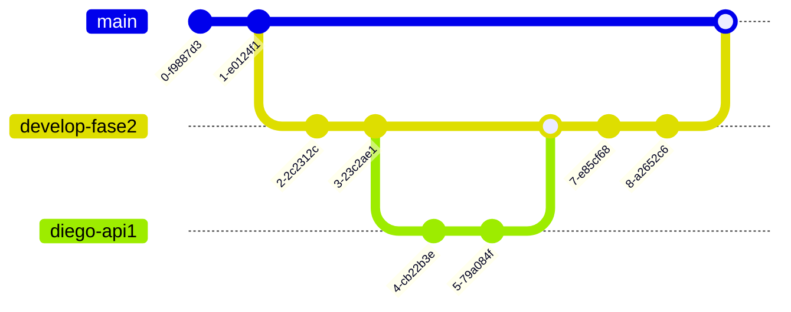

# Instrucciones:
---
## División de trabajos:
---
- Maqueta: Renovación y mejora. Encargados: Diego y Daniel.
- API 1: Guardado de datos en la nube. Encargada: Natalia.
- API 2: Recuperación de datos de la nube + Dashboard. Encargado: Bruce.
> [!IMPORTANT] Documentación
> Es importante que comenten su código para hacer la documentación posteriormente.
## ¿Cómo hacer commits?
---
Rama de esta fase: develop-fase2.
- Se generará una rama develop-fase2
- De esa rama generarán otras ramas de uso propio.
- El nombre de esa rama será el suyo propio + feature. Ejemplo: diego-api1
- Probarémos cada cosa de manera individual y en la fase final haremos merge a la rama develop-fase2.
