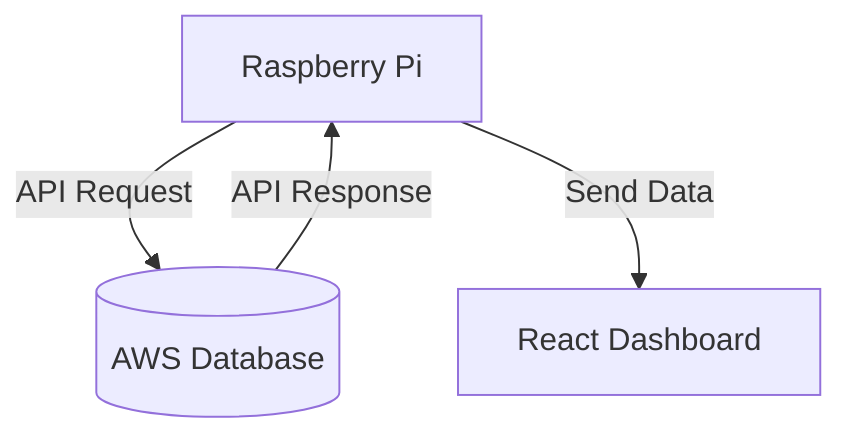

# Instrucciones
---
Se creará una API para una raspberry que tomará los datos de la base de datos de AWS y los mostrará en un Dashboard.

- La Raspberry Pi se conectará a la base de datos de AWS a través de una API para recuperar los datos necesarios.
- Una vez que la Raspberry Pi obtenga los datos, los enviará al Dashboard hecho en React.
- El Dashboard consumirá estos datos para generar las gráficas y visualizaciones necesarias.

> [!IMPORTANT] Dashboard
> Utilizar React o Angular para hacer el dashboard, como sugerencia usar una api light-weight para tomar los datos de la base de datos (como flask o fastapi).