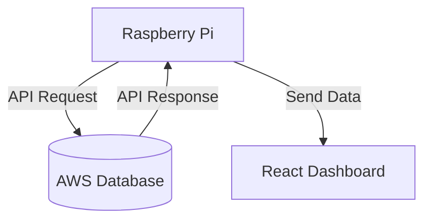

# Instrucciones
---
Se creará una API para una raspberry que tomará los datos de la base de datos de AWS y los mostrará en un Dashboard.

- La Raspberry Pi se conectará a la base de datos de AWS a través de una API para recuperar los datos necesarios.
- Una vez que la Raspberry Pi obtenga los datos, los enviará al Dashboard hecho en React.
- El Dashboard consumirá estos datos para generar las gráficas y visualizaciones necesarias.

> [!IMPORTANT] 
> Utilizar React o Angular para hacer el dashboard, como sugerencia usar una api light-weight para tomar los datos de la base de datos (como flask o fastapi).


# ¿Como activar la API? (FastApi)

Ejecutar el siguiente listado de comandos:

- cd FastApi
- source/venv/bin/activate
- uvicorn main:app -reload

Y comenzara a ejecutarse en el: 127.0.0.1:8000

# ¿Como ejecutar el frontend? (Django)

- cd dashboardArqui2
- source venv/bin/activate
- python3 manage.py runserver 0.0.0.0:8080


```
retrieve-api
├─ FastApi
│  ├─ __pycache__
│  │  └─ main.cpython-312.pyc
│  ├─ main.py
│  └─ venv
│     ├─ bin
│     │  ├─ Activate.ps1
│     │  ├─ activate
│     │  ├─ activate.csh
│     │  ├─ activate.fish
│     │  ├─ fastapi
│     │  ├─ pip
│     │  ├─ pip3
│     │  ├─ pip3.12
│     │  ├─ python
│     │  ├─ python3
│     │  ├─ python3.12
│     │  └─ uvicorn
│     ├─ include
│     │  ├─ python3.12
│     │  └─ site
│     │     └─ python3.12
│     │        └─ greenlet
│     │           └─ greenlet.h
│     ├─ lib
│     │  └─ python3.12
│     │     └─ site-packages
│     │        ├─ PyMySQL-1.1.1.dist-info
│     │        │  ├─ INSTALLER
│     │        │  ├─ LICENSE
│     │        │  ├─ METADATA
│     │        │  ├─ RECORD
│     │        │  ├─ REQUESTED
│     │        │  ├─ WHEEL
│     │        │  └─ top_level.txt
│     │        ├─ __pycache__
│     │        │  └─ typing_extensions.cpython-312.pyc
│     │        ├─ annotated_types
│     │        │  ├─ __init__.py
│     │        │  ├─ __pycache__
│     │        │  │  ├─ __init__.cpython-312.pyc
│     │        │  │  └─ test_cases.cpython-312.pyc
│     │        │  ├─ py.typed
│     │        │  └─ test_cases.py
│     │        ├─ annotated_types-0.7.0.dist-info
│     │        │  ├─ INSTALLER
│     │        │  ├─ METADATA
│     │        │  ├─ RECORD
│     │        │  ├─ WHEEL
│     │        │  └─ licenses
│     │        │     └─ LICENSE
│     │        ├─ anyio
│     │        │  ├─ __init__.py
│     │        │  ├─ __pycache__
│     │        │  │  ├─ __init__.cpython-312.pyc
│     │        │  │  ├─ from_thread.cpython-312.pyc
│     │        │  │  ├─ lowlevel.cpython-312.pyc
│     │        │  │  ├─ pytest_plugin.cpython-312.pyc
│     │        │  │  ├─ to_interpreter.cpython-312.pyc
│     │        │  │  ├─ to_process.cpython-312.pyc
│     │        │  │  └─ to_thread.cpython-312.pyc
│     │        │  ├─ _backends
│     │        │  │  ├─ __init__.py
│     │        │  │  ├─ __pycache__
│     │        │  │  │  ├─ __init__.cpython-312.pyc
│     │        │  │  │  ├─ _asyncio.cpython-312.pyc
│     │        │  │  │  └─ _trio.cpython-312.pyc
│     │        │  │  ├─ _asyncio.py
│     │        │  │  └─ _trio.py
│     │        │  ├─ _core
│     │        │  │  ├─ __init__.py
│     │        │  │  ├─ __pycache__
│     │        │  │  │  ├─ __init__.cpython-312.pyc
│     │        │  │  │  ├─ _asyncio_selector_thread.cpython-312.pyc
│     │        │  │  │  ├─ _eventloop.cpython-312.pyc
│     │        │  │  │  ├─ _exceptions.cpython-312.pyc
│     │        │  │  │  ├─ _fileio.cpython-312.pyc
│     │        │  │  │  ├─ _resources.cpython-312.pyc
│     │        │  │  │  ├─ _signals.cpython-312.pyc
│     │        │  │  │  ├─ _sockets.cpython-312.pyc
│     │        │  │  │  ├─ _streams.cpython-312.pyc
│     │        │  │  │  ├─ _subprocesses.cpython-312.pyc
│     │        │  │  │  ├─ _synchronization.cpython-312.pyc
│     │        │  │  │  ├─ _tasks.cpython-312.pyc
│     │        │  │  │  ├─ _testing.cpython-312.pyc
│     │        │  │  │  └─ _typedattr.cpython-312.pyc
│     │        │  │  ├─ _asyncio_selector_thread.py
│     │        │  │  ├─ _eventloop.py
│     │        │  │  ├─ _exceptions.py
│     │        │  │  ├─ _fileio.py
│     │        │  │  ├─ _resources.py
│     │        │  │  ├─ _signals.py
│     │        │  │  ├─ _sockets.py
│     │        │  │  ├─ _streams.py
│     │        │  │  ├─ _subprocesses.py
│     │        │  │  ├─ _synchronization.py
│     │        │  │  ├─ _tasks.py
│     │        │  │  ├─ _testing.py
│     │        │  │  └─ _typedattr.py
│     │        │  ├─ abc
│     │        │  │  ├─ __init__.py
│     │        │  │  ├─ __pycache__
│     │        │  │  │  ├─ __init__.cpython-312.pyc
│     │        │  │  │  ├─ _eventloop.cpython-312.pyc
│     │        │  │  │  ├─ _resources.cpython-312.pyc
│     │        │  │  │  ├─ _sockets.cpython-312.pyc
│     │        │  │  │  ├─ _streams.cpython-312.pyc
│     │        │  │  │  ├─ _subprocesses.cpython-312.pyc
│     │        │  │  │  ├─ _tasks.cpython-312.pyc
│     │        │  │  │  └─ _testing.cpython-312.pyc
│     │        │  │  ├─ _eventloop.py
│     │        │  │  ├─ _resources.py
│     │        │  │  ├─ _sockets.py
│     │        │  │  ├─ _streams.py
│     │        │  │  ├─ _subprocesses.py
│     │        │  │  ├─ _tasks.py
│     │        │  │  └─ _testing.py
│     │        │  ├─ from_thread.py
│     │        │  ├─ lowlevel.py
│     │        │  ├─ py.typed
│     │        │  ├─ pytest_plugin.py
│     │        │  ├─ streams
│     │        │  │  ├─ __init__.py
│     │        │  │  ├─ __pycache__
│     │        │  │  │  ├─ __init__.cpython-312.pyc
│     │        │  │  │  ├─ buffered.cpython-312.pyc
│     │        │  │  │  ├─ file.cpython-312.pyc
│     │        │  │  │  ├─ memory.cpython-312.pyc
│     │        │  │  │  ├─ stapled.cpython-312.pyc
│     │        │  │  │  ├─ text.cpython-312.pyc
│     │        │  │  │  └─ tls.cpython-312.pyc
│     │        │  │  ├─ buffered.py
│     │        │  │  ├─ file.py
│     │        │  │  ├─ memory.py
│     │        │  │  ├─ stapled.py
│     │        │  │  ├─ text.py
│     │        │  │  └─ tls.py
│     │        │  ├─ to_interpreter.py
│     │        │  ├─ to_process.py
│     │        │  └─ to_thread.py
│     │        ├─ anyio-4.8.0.dist-info
│     │        │  ├─ INSTALLER
│     │        │  ├─ LICENSE
│     │        │  ├─ METADATA
│     │        │  ├─ RECORD
│     │        │  ├─ WHEEL
│     │        │  ├─ entry_points.txt
│     │        │  └─ top_level.txt
│     │        ├─ click
│     │        │  ├─ __init__.py
│     │        │  ├─ __pycache__
│     │        │  │  ├─ __init__.cpython-312.pyc
│     │        │  │  ├─ _compat.cpython-312.pyc
│     │        │  │  ├─ _termui_impl.cpython-312.pyc
│     │        │  │  ├─ _textwrap.cpython-312.pyc
│     │        │  │  ├─ _winconsole.cpython-312.pyc
│     │        │  │  ├─ core.cpython-312.pyc
│     │        │  │  ├─ decorators.cpython-312.pyc
│     │        │  │  ├─ exceptions.cpython-312.pyc
│     │        │  │  ├─ formatting.cpython-312.pyc
│     │        │  │  ├─ globals.cpython-312.pyc
│     │        │  │  ├─ parser.cpython-312.pyc
│     │        │  │  ├─ shell_completion.cpython-312.pyc
│     │        │  │  ├─ termui.cpython-312.pyc
│     │        │  │  ├─ testing.cpython-312.pyc
│     │        │  │  ├─ types.cpython-312.pyc
│     │        │  │  └─ utils.cpython-312.pyc
│     │        │  ├─ _compat.py
│     │        │  ├─ _termui_impl.py
│     │        │  ├─ _textwrap.py
│     │        │  ├─ _winconsole.py
│     │        │  ├─ core.py
│     │        │  ├─ decorators.py
│     │        │  ├─ exceptions.py
│     │        │  ├─ formatting.py
│     │        │  ├─ globals.py
│     │        │  ├─ parser.py
│     │        │  ├─ py.typed
│     │        │  ├─ shell_completion.py
│     │        │  ├─ termui.py
│     │        │  ├─ testing.py
│     │        │  ├─ types.py
│     │        │  └─ utils.py
│     │        ├─ click-8.1.8.dist-info
│     │        │  ├─ INSTALLER
│     │        │  ├─ LICENSE.txt
│     │        │  ├─ METADATA
│     │        │  ├─ RECORD
│     │        │  └─ WHEEL
│     │        ├─ fastapi
│     │        │  ├─ __init__.py
│     │        │  ├─ __main__.py
│     │        │  ├─ __pycache__
│     │        │  │  ├─ __init__.cpython-312.pyc
│     │        │  │  ├─ __main__.cpython-312.pyc
│     │        │  │  ├─ _compat.cpython-312.pyc
│     │        │  │  ├─ applications.cpython-312.pyc
│     │        │  │  ├─ background.cpython-312.pyc
│     │        │  │  ├─ cli.cpython-312.pyc
│     │        │  │  ├─ concurrency.cpython-312.pyc
│     │        │  │  ├─ datastructures.cpython-312.pyc
│     │        │  │  ├─ encoders.cpython-312.pyc
│     │        │  │  ├─ exception_handlers.cpython-312.pyc
│     │        │  │  ├─ exceptions.cpython-312.pyc
│     │        │  │  ├─ logger.cpython-312.pyc
│     │        │  │  ├─ param_functions.cpython-312.pyc
│     │        │  │  ├─ params.cpython-312.pyc
│     │        │  │  ├─ requests.cpython-312.pyc
│     │        │  │  ├─ responses.cpython-312.pyc
│     │        │  │  ├─ routing.cpython-312.pyc
│     │        │  │  ├─ staticfiles.cpython-312.pyc
│     │        │  │  ├─ templating.cpython-312.pyc
│     │        │  │  ├─ testclient.cpython-312.pyc
│     │        │  │  ├─ types.cpython-312.pyc
│     │        │  │  ├─ utils.cpython-312.pyc
│     │        │  │  └─ websockets.cpython-312.pyc
│     │        │  ├─ _compat.py
│     │        │  ├─ applications.py
│     │        │  ├─ background.py
│     │        │  ├─ cli.py
│     │        │  ├─ concurrency.py
│     │        │  ├─ datastructures.py
│     │        │  ├─ dependencies
│     │        │  │  ├─ __init__.py
│     │        │  │  ├─ __pycache__
│     │        │  │  │  ├─ __init__.cpython-312.pyc
│     │        │  │  │  ├─ models.cpython-312.pyc
│     │        │  │  │  └─ utils.cpython-312.pyc
│     │        │  │  ├─ models.py
│     │        │  │  └─ utils.py
│     │        │  ├─ encoders.py
│     │        │  ├─ exception_handlers.py
│     │        │  ├─ exceptions.py
│     │        │  ├─ logger.py
│     │        │  ├─ middleware
│     │        │  │  ├─ __init__.py
│     │        │  │  ├─ __pycache__
│     │        │  │  │  ├─ __init__.cpython-312.pyc
│     │        │  │  │  ├─ cors.cpython-312.pyc
│     │        │  │  │  ├─ gzip.cpython-312.pyc
│     │        │  │  │  ├─ httpsredirect.cpython-312.pyc
│     │        │  │  │  ├─ trustedhost.cpython-312.pyc
│     │        │  │  │  └─ wsgi.cpython-312.pyc
│     │        │  │  ├─ cors.py
│     │        │  │  ├─ gzip.py
│     │        │  │  ├─ httpsredirect.py
│     │        │  │  ├─ trustedhost.py
│     │        │  │  └─ wsgi.py
│     │        │  ├─ openapi
│     │        │  │  ├─ __init__.py
│     │        │  │  ├─ __pycache__
│     │        │  │  │  ├─ __init__.cpython-312.pyc
│     │        │  │  │  ├─ constants.cpython-312.pyc
│     │        │  │  │  ├─ docs.cpython-312.pyc
│     │        │  │  │  ├─ models.cpython-312.pyc
│     │        │  │  │  └─ utils.cpython-312.pyc
│     │        │  │  ├─ constants.py
│     │        │  │  ├─ docs.py
│     │        │  │  ├─ models.py
│     │        │  │  └─ utils.py
│     │        │  ├─ param_functions.py
│     │        │  ├─ params.py
│     │        │  ├─ py.typed
│     │        │  ├─ requests.py
│     │        │  ├─ responses.py
│     │        │  ├─ routing.py
│     │        │  ├─ security
│     │        │  │  ├─ __init__.py
│     │        │  │  ├─ __pycache__
│     │        │  │  │  ├─ __init__.cpython-312.pyc
│     │        │  │  │  ├─ api_key.cpython-312.pyc
│     │        │  │  │  ├─ base.cpython-312.pyc
│     │        │  │  │  ├─ http.cpython-312.pyc
│     │        │  │  │  ├─ oauth2.cpython-312.pyc
│     │        │  │  │  ├─ open_id_connect_url.cpython-312.pyc
│     │        │  │  │  └─ utils.cpython-312.pyc
│     │        │  │  ├─ api_key.py
│     │        │  │  ├─ base.py
│     │        │  │  ├─ http.py
│     │        │  │  ├─ oauth2.py
│     │        │  │  ├─ open_id_connect_url.py
│     │        │  │  └─ utils.py
│     │        │  ├─ staticfiles.py
│     │        │  ├─ templating.py
│     │        │  ├─ testclient.py
│     │        │  ├─ types.py
│     │        │  ├─ utils.py
│     │        │  └─ websockets.py
│     │        ├─ fastapi-0.115.11.dist-info
│     │        │  ├─ INSTALLER
│     │        │  ├─ METADATA
│     │        │  ├─ RECORD
│     │        │  ├─ REQUESTED
│     │        │  ├─ WHEEL
│     │        │  ├─ entry_points.txt
│     │        │  └─ licenses
│     │        │     └─ LICENSE
│     │        ├─ greenlet
│     │        │  ├─ CObjects.cpp
│     │        │  ├─ PyGreenlet.cpp
│     │        │  ├─ PyGreenlet.hpp
│     │        │  ├─ PyGreenletUnswitchable.cpp
│     │        │  ├─ PyModule.cpp
│     │        │  ├─ TBrokenGreenlet.cpp
│     │        │  ├─ TExceptionState.cpp
│     │        │  ├─ TGreenlet.cpp
│     │        │  ├─ TGreenlet.hpp
│     │        │  ├─ TGreenletGlobals.cpp
│     │        │  ├─ TMainGreenlet.cpp
│     │        │  ├─ TPythonState.cpp
│     │        │  ├─ TStackState.cpp
│     │        │  ├─ TThreadState.hpp
│     │        │  ├─ TThreadStateCreator.hpp
│     │        │  ├─ TThreadStateDestroy.cpp
│     │        │  ├─ TUserGreenlet.cpp
│     │        │  ├─ __init__.py
│     │        │  ├─ __pycache__
│     │        │  │  └─ __init__.cpython-312.pyc
│     │        │  ├─ _greenlet.cpython-312-x86_64-linux-gnu.so
│     │        │  ├─ greenlet.cpp
│     │        │  ├─ greenlet.h
│     │        │  ├─ greenlet_allocator.hpp
│     │        │  ├─ greenlet_compiler_compat.hpp
│     │        │  ├─ greenlet_cpython_add_pending.hpp
│     │        │  ├─ greenlet_cpython_compat.hpp
│     │        │  ├─ greenlet_exceptions.hpp
│     │        │  ├─ greenlet_internal.hpp
│     │        │  ├─ greenlet_refs.hpp
│     │        │  ├─ greenlet_slp_switch.hpp
│     │        │  ├─ greenlet_thread_support.hpp
│     │        │  ├─ platform
│     │        │  │  ├─ __init__.py
│     │        │  │  ├─ __pycache__
│     │        │  │  │  └─ __init__.cpython-312.pyc
│     │        │  │  ├─ setup_switch_x64_masm.cmd
│     │        │  │  ├─ switch_aarch64_gcc.h
│     │        │  │  ├─ switch_alpha_unix.h
│     │        │  │  ├─ switch_amd64_unix.h
│     │        │  │  ├─ switch_arm32_gcc.h
│     │        │  │  ├─ switch_arm32_ios.h
│     │        │  │  ├─ switch_arm64_masm.asm
│     │        │  │  ├─ switch_arm64_masm.obj
│     │        │  │  ├─ switch_arm64_msvc.h
│     │        │  │  ├─ switch_csky_gcc.h
│     │        │  │  ├─ switch_loongarch64_linux.h
│     │        │  │  ├─ switch_m68k_gcc.h
│     │        │  │  ├─ switch_mips_unix.h
│     │        │  │  ├─ switch_ppc64_aix.h
│     │        │  │  ├─ switch_ppc64_linux.h
│     │        │  │  ├─ switch_ppc_aix.h
│     │        │  │  ├─ switch_ppc_linux.h
│     │        │  │  ├─ switch_ppc_macosx.h
│     │        │  │  ├─ switch_ppc_unix.h
│     │        │  │  ├─ switch_riscv_unix.h
│     │        │  │  ├─ switch_s390_unix.h
│     │        │  │  ├─ switch_sh_gcc.h
│     │        │  │  ├─ switch_sparc_sun_gcc.h
│     │        │  │  ├─ switch_x32_unix.h
│     │        │  │  ├─ switch_x64_masm.asm
│     │        │  │  ├─ switch_x64_masm.obj
│     │        │  │  ├─ switch_x64_msvc.h
│     │        │  │  ├─ switch_x86_msvc.h
│     │        │  │  └─ switch_x86_unix.h
│     │        │  ├─ slp_platformselect.h
│     │        │  └─ tests
│     │        │     ├─ __init__.py
│     │        │     ├─ __pycache__
│     │        │     │  ├─ __init__.cpython-312.pyc
│     │        │     │  ├─ fail_clearing_run_switches.cpython-312.pyc
│     │        │     │  ├─ fail_cpp_exception.cpython-312.pyc
│     │        │     │  ├─ fail_initialstub_already_started.cpython-312.pyc
│     │        │     │  ├─ fail_slp_switch.cpython-312.pyc
│     │        │     │  ├─ fail_switch_three_greenlets.cpython-312.pyc
│     │        │     │  ├─ fail_switch_three_greenlets2.cpython-312.pyc
│     │        │     │  ├─ fail_switch_two_greenlets.cpython-312.pyc
│     │        │     │  ├─ leakcheck.cpython-312.pyc
│     │        │     │  ├─ test_contextvars.cpython-312.pyc
│     │        │     │  ├─ test_cpp.cpython-312.pyc
│     │        │     │  ├─ test_extension_interface.cpython-312.pyc
│     │        │     │  ├─ test_gc.cpython-312.pyc
│     │        │     │  ├─ test_generator.cpython-312.pyc
│     │        │     │  ├─ test_generator_nested.cpython-312.pyc
│     │        │     │  ├─ test_greenlet.cpython-312.pyc
│     │        │     │  ├─ test_greenlet_trash.cpython-312.pyc
│     │        │     │  ├─ test_leaks.cpython-312.pyc
│     │        │     │  ├─ test_stack_saved.cpython-312.pyc
│     │        │     │  ├─ test_throw.cpython-312.pyc
│     │        │     │  ├─ test_tracing.cpython-312.pyc
│     │        │     │  ├─ test_version.cpython-312.pyc
│     │        │     │  └─ test_weakref.cpython-312.pyc
│     │        │     ├─ _test_extension.c
│     │        │     ├─ _test_extension.cpython-312-x86_64-linux-gnu.so
│     │        │     ├─ _test_extension_cpp.cpp
│     │        │     ├─ _test_extension_cpp.cpython-312-x86_64-linux-gnu.so
│     │        │     ├─ fail_clearing_run_switches.py
│     │        │     ├─ fail_cpp_exception.py
│     │        │     ├─ fail_initialstub_already_started.py
│     │        │     ├─ fail_slp_switch.py
│     │        │     ├─ fail_switch_three_greenlets.py
│     │        │     ├─ fail_switch_three_greenlets2.py
│     │        │     ├─ fail_switch_two_greenlets.py
│     │        │     ├─ leakcheck.py
│     │        │     ├─ test_contextvars.py
│     │        │     ├─ test_cpp.py
│     │        │     ├─ test_extension_interface.py
│     │        │     ├─ test_gc.py
│     │        │     ├─ test_generator.py
│     │        │     ├─ test_generator_nested.py
│     │        │     ├─ test_greenlet.py
│     │        │     ├─ test_greenlet_trash.py
│     │        │     ├─ test_leaks.py
│     │        │     ├─ test_stack_saved.py
│     │        │     ├─ test_throw.py
│     │        │     ├─ test_tracing.py
│     │        │     ├─ test_version.py
│     │        │     └─ test_weakref.py
│     │        ├─ greenlet-3.1.1.dist-info
│     │        │  ├─ AUTHORS
│     │        │  ├─ INSTALLER
│     │        │  ├─ LICENSE
│     │        │  ├─ LICENSE.PSF
│     │        │  ├─ METADATA
│     │        │  ├─ RECORD
│     │        │  ├─ WHEEL
│     │        │  └─ top_level.txt
│     │        ├─ h11
│     │        │  ├─ __init__.py
│     │        │  ├─ __pycache__
│     │        │  │  ├─ __init__.cpython-312.pyc
│     │        │  │  ├─ _abnf.cpython-312.pyc
│     │        │  │  ├─ _connection.cpython-312.pyc
│     │        │  │  ├─ _events.cpython-312.pyc
│     │        │  │  ├─ _headers.cpython-312.pyc
│     │        │  │  ├─ _readers.cpython-312.pyc
│     │        │  │  ├─ _receivebuffer.cpython-312.pyc
│     │        │  │  ├─ _state.cpython-312.pyc
│     │        │  │  ├─ _util.cpython-312.pyc
│     │        │  │  ├─ _version.cpython-312.pyc
│     │        │  │  └─ _writers.cpython-312.pyc
│     │        │  ├─ _abnf.py
│     │        │  ├─ _connection.py
│     │        │  ├─ _events.py
│     │        │  ├─ _headers.py
│     │        │  ├─ _readers.py
│     │        │  ├─ _receivebuffer.py
│     │        │  ├─ _state.py
│     │        │  ├─ _util.py
│     │        │  ├─ _version.py
│     │        │  ├─ _writers.py
│     │        │  ├─ py.typed
│     │        │  └─ tests
│     │        │     ├─ __init__.py
│     │        │     ├─ __pycache__
│     │        │     │  ├─ __init__.cpython-312.pyc
│     │        │     │  ├─ helpers.cpython-312.pyc
│     │        │     │  ├─ test_against_stdlib_http.cpython-312.pyc
│     │        │     │  ├─ test_connection.cpython-312.pyc
│     │        │     │  ├─ test_events.cpython-312.pyc
│     │        │     │  ├─ test_headers.cpython-312.pyc
│     │        │     │  ├─ test_helpers.cpython-312.pyc
│     │        │     │  ├─ test_io.cpython-312.pyc
│     │        │     │  ├─ test_receivebuffer.cpython-312.pyc
│     │        │     │  ├─ test_state.cpython-312.pyc
│     │        │     │  └─ test_util.cpython-312.pyc
│     │        │     ├─ data
│     │        │     │  └─ test-file
│     │        │     ├─ helpers.py
│     │        │     ├─ test_against_stdlib_http.py
│     │        │     ├─ test_connection.py
│     │        │     ├─ test_events.py
│     │        │     ├─ test_headers.py
│     │        │     ├─ test_helpers.py
│     │        │     ├─ test_io.py
│     │        │     ├─ test_receivebuffer.py
│     │        │     ├─ test_state.py
│     │        │     └─ test_util.py
│     │        ├─ h11-0.14.0.dist-info
│     │        │  ├─ INSTALLER
│     │        │  ├─ LICENSE.txt
│     │        │  ├─ METADATA
│     │        │  ├─ RECORD
│     │        │  ├─ WHEEL
│     │        │  └─ top_level.txt
│     │        ├─ idna
│     │        │  ├─ __init__.py
│     │        │  ├─ __pycache__
│     │        │  │  ├─ __init__.cpython-312.pyc
│     │        │  │  ├─ codec.cpython-312.pyc
│     │        │  │  ├─ compat.cpython-312.pyc
│     │        │  │  ├─ core.cpython-312.pyc
│     │        │  │  ├─ idnadata.cpython-312.pyc
│     │        │  │  ├─ intranges.cpython-312.pyc
│     │        │  │  ├─ package_data.cpython-312.pyc
│     │        │  │  └─ uts46data.cpython-312.pyc
│     │        │  ├─ codec.py
│     │        │  ├─ compat.py
│     │        │  ├─ core.py
│     │        │  ├─ idnadata.py
│     │        │  ├─ intranges.py
│     │        │  ├─ package_data.py
│     │        │  ├─ py.typed
│     │        │  └─ uts46data.py
│     │        ├─ idna-3.10.dist-info
│     │        │  ├─ INSTALLER
│     │        │  ├─ LICENSE.md
│     │        │  ├─ METADATA
│     │        │  ├─ RECORD
│     │        │  └─ WHEEL
│     │        ├─ pip
│     │        │  ├─ __init__.py
│     │        │  ├─ __main__.py
│     │        │  ├─ __pip-runner__.py
│     │        │  ├─ __pycache__
│     │        │  │  ├─ __init__.cpython-312.pyc
│     │        │  │  ├─ __main__.cpython-312.pyc
│     │        │  │  └─ __pip-runner__.cpython-312.pyc
│     │        │  ├─ _internal
│     │        │  │  ├─ __init__.py
│     │        │  │  ├─ __pycache__
│     │        │  │  │  ├─ __init__.cpython-312.pyc
│     │        │  │  │  ├─ build_env.cpython-312.pyc
│     │        │  │  │  ├─ cache.cpython-312.pyc
│     │        │  │  │  ├─ configuration.cpython-312.pyc
│     │        │  │  │  ├─ exceptions.cpython-312.pyc
│     │        │  │  │  ├─ main.cpython-312.pyc
│     │        │  │  │  ├─ pyproject.cpython-312.pyc
│     │        │  │  │  ├─ self_outdated_check.cpython-312.pyc
│     │        │  │  │  └─ wheel_builder.cpython-312.pyc
│     │        │  │  ├─ build_env.py
│     │        │  │  ├─ cache.py
│     │        │  │  ├─ cli
│     │        │  │  │  ├─ __init__.py
│     │        │  │  │  ├─ __pycache__
│     │        │  │  │  │  ├─ __init__.cpython-312.pyc
│     │        │  │  │  │  ├─ autocompletion.cpython-312.pyc
│     │        │  │  │  │  ├─ base_command.cpython-312.pyc
│     │        │  │  │  │  ├─ cmdoptions.cpython-312.pyc
│     │        │  │  │  │  ├─ command_context.cpython-312.pyc
│     │        │  │  │  │  ├─ main.cpython-312.pyc
│     │        │  │  │  │  ├─ main_parser.cpython-312.pyc
│     │        │  │  │  │  ├─ parser.cpython-312.pyc
│     │        │  │  │  │  ├─ progress_bars.cpython-312.pyc
│     │        │  │  │  │  ├─ req_command.cpython-312.pyc
│     │        │  │  │  │  ├─ spinners.cpython-312.pyc
│     │        │  │  │  │  └─ status_codes.cpython-312.pyc
│     │        │  │  │  ├─ autocompletion.py
│     │        │  │  │  ├─ base_command.py
│     │        │  │  │  ├─ cmdoptions.py
│     │        │  │  │  ├─ command_context.py
│     │        │  │  │  ├─ main.py
│     │        │  │  │  ├─ main_parser.py
│     │        │  │  │  ├─ parser.py
│     │        │  │  │  ├─ progress_bars.py
│     │        │  │  │  ├─ req_command.py
│     │        │  │  │  ├─ spinners.py
│     │        │  │  │  └─ status_codes.py
│     │        │  │  ├─ commands
│     │        │  │  │  ├─ __init__.py
│     │        │  │  │  ├─ __pycache__
│     │        │  │  │  │  ├─ __init__.cpython-312.pyc
│     │        │  │  │  │  ├─ cache.cpython-312.pyc
│     │        │  │  │  │  ├─ check.cpython-312.pyc
│     │        │  │  │  │  ├─ completion.cpython-312.pyc
│     │        │  │  │  │  ├─ configuration.cpython-312.pyc
│     │        │  │  │  │  ├─ debug.cpython-312.pyc
│     │        │  │  │  │  ├─ download.cpython-312.pyc
│     │        │  │  │  │  ├─ freeze.cpython-312.pyc
│     │        │  │  │  │  ├─ hash.cpython-312.pyc
│     │        │  │  │  │  ├─ help.cpython-312.pyc
│     │        │  │  │  │  ├─ index.cpython-312.pyc
│     │        │  │  │  │  ├─ inspect.cpython-312.pyc
│     │        │  │  │  │  ├─ install.cpython-312.pyc
│     │        │  │  │  │  ├─ list.cpython-312.pyc
│     │        │  │  │  │  ├─ search.cpython-312.pyc
│     │        │  │  │  │  ├─ show.cpython-312.pyc
│     │        │  │  │  │  ├─ uninstall.cpython-312.pyc
│     │        │  │  │  │  └─ wheel.cpython-312.pyc
│     │        │  │  │  ├─ cache.py
│     │        │  │  │  ├─ check.py
│     │        │  │  │  ├─ completion.py
│     │        │  │  │  ├─ configuration.py
│     │        │  │  │  ├─ debug.py
│     │        │  │  │  ├─ download.py
│     │        │  │  │  ├─ freeze.py
│     │        │  │  │  ├─ hash.py
│     │        │  │  │  ├─ help.py
│     │        │  │  │  ├─ index.py
│     │        │  │  │  ├─ inspect.py
│     │        │  │  │  ├─ install.py
│     │        │  │  │  ├─ list.py
│     │        │  │  │  ├─ search.py
│     │        │  │  │  ├─ show.py
│     │        │  │  │  ├─ uninstall.py
│     │        │  │  │  └─ wheel.py
│     │        │  │  ├─ configuration.py
│     │        │  │  ├─ distributions
│     │        │  │  │  ├─ __init__.py
│     │        │  │  │  ├─ __pycache__
│     │        │  │  │  │  ├─ __init__.cpython-312.pyc
│     │        │  │  │  │  ├─ base.cpython-312.pyc
│     │        │  │  │  │  ├─ installed.cpython-312.pyc
│     │        │  │  │  │  ├─ sdist.cpython-312.pyc
│     │        │  │  │  │  └─ wheel.cpython-312.pyc
│     │        │  │  │  ├─ base.py
│     │        │  │  │  ├─ installed.py
│     │        │  │  │  ├─ sdist.py
│     │        │  │  │  └─ wheel.py
│     │        │  │  ├─ exceptions.py
│     │        │  │  ├─ index
│     │        │  │  │  ├─ __init__.py
│     │        │  │  │  ├─ __pycache__
│     │        │  │  │  │  ├─ __init__.cpython-312.pyc
│     │        │  │  │  │  ├─ collector.cpython-312.pyc
│     │        │  │  │  │  ├─ package_finder.cpython-312.pyc
│     │        │  │  │  │  └─ sources.cpython-312.pyc
│     │        │  │  │  ├─ collector.py
│     │        │  │  │  ├─ package_finder.py
│     │        │  │  │  └─ sources.py
│     │        │  │  ├─ locations
│     │        │  │  │  ├─ __init__.py
│     │        │  │  │  ├─ __pycache__
│     │        │  │  │  │  ├─ __init__.cpython-312.pyc
│     │        │  │  │  │  ├─ _distutils.cpython-312.pyc
│     │        │  │  │  │  ├─ _sysconfig.cpython-312.pyc
│     │        │  │  │  │  └─ base.cpython-312.pyc
│     │        │  │  │  ├─ _distutils.py
│     │        │  │  │  ├─ _sysconfig.py
│     │        │  │  │  └─ base.py
│     │        │  │  ├─ main.py
│     │        │  │  ├─ metadata
│     │        │  │  │  ├─ __init__.py
│     │        │  │  │  ├─ __pycache__
│     │        │  │  │  │  ├─ __init__.cpython-312.pyc
│     │        │  │  │  │  ├─ _json.cpython-312.pyc
│     │        │  │  │  │  ├─ base.cpython-312.pyc
│     │        │  │  │  │  └─ pkg_resources.cpython-312.pyc
│     │        │  │  │  ├─ _json.py
│     │        │  │  │  ├─ base.py
│     │        │  │  │  ├─ importlib
│     │        │  │  │  │  ├─ __init__.py
│     │        │  │  │  │  ├─ __pycache__
│     │        │  │  │  │  │  ├─ __init__.cpython-312.pyc
│     │        │  │  │  │  │  ├─ _compat.cpython-312.pyc
│     │        │  │  │  │  │  ├─ _dists.cpython-312.pyc
│     │        │  │  │  │  │  └─ _envs.cpython-312.pyc
│     │        │  │  │  │  ├─ _compat.py
│     │        │  │  │  │  ├─ _dists.py
│     │        │  │  │  │  └─ _envs.py
│     │        │  │  │  └─ pkg_resources.py
│     │        │  │  ├─ models
│     │        │  │  │  ├─ __init__.py
│     │        │  │  │  ├─ __pycache__
│     │        │  │  │  │  ├─ __init__.cpython-312.pyc
│     │        │  │  │  │  ├─ candidate.cpython-312.pyc
│     │        │  │  │  │  ├─ direct_url.cpython-312.pyc
│     │        │  │  │  │  ├─ format_control.cpython-312.pyc
│     │        │  │  │  │  ├─ index.cpython-312.pyc
│     │        │  │  │  │  ├─ installation_report.cpython-312.pyc
│     │        │  │  │  │  ├─ link.cpython-312.pyc
│     │        │  │  │  │  ├─ scheme.cpython-312.pyc
│     │        │  │  │  │  ├─ search_scope.cpython-312.pyc
│     │        │  │  │  │  ├─ selection_prefs.cpython-312.pyc
│     │        │  │  │  │  ├─ target_python.cpython-312.pyc
│     │        │  │  │  │  └─ wheel.cpython-312.pyc
│     │        │  │  │  ├─ candidate.py
│     │        │  │  │  ├─ direct_url.py
│     │        │  │  │  ├─ format_control.py
│     │        │  │  │  ├─ index.py
│     │        │  │  │  ├─ installation_report.py
│     │        │  │  │  ├─ link.py
│     │        │  │  │  ├─ scheme.py
│     │        │  │  │  ├─ search_scope.py
│     │        │  │  │  ├─ selection_prefs.py
│     │        │  │  │  ├─ target_python.py
│     │        │  │  │  └─ wheel.py
│     │        │  │  ├─ network
│     │        │  │  │  ├─ __init__.py
│     │        │  │  │  ├─ __pycache__
│     │        │  │  │  │  ├─ __init__.cpython-312.pyc
│     │        │  │  │  │  ├─ auth.cpython-312.pyc
│     │        │  │  │  │  ├─ cache.cpython-312.pyc
│     │        │  │  │  │  ├─ download.cpython-312.pyc
│     │        │  │  │  │  ├─ lazy_wheel.cpython-312.pyc
│     │        │  │  │  │  ├─ session.cpython-312.pyc
│     │        │  │  │  │  ├─ utils.cpython-312.pyc
│     │        │  │  │  │  └─ xmlrpc.cpython-312.pyc
│     │        │  │  │  ├─ auth.py
│     │        │  │  │  ├─ cache.py
│     │        │  │  │  ├─ download.py
│     │        │  │  │  ├─ lazy_wheel.py
│     │        │  │  │  ├─ session.py
│     │        │  │  │  ├─ utils.py
│     │        │  │  │  └─ xmlrpc.py
│     │        │  │  ├─ operations
│     │        │  │  │  ├─ __init__.py
│     │        │  │  │  ├─ __pycache__
│     │        │  │  │  │  ├─ __init__.cpython-312.pyc
│     │        │  │  │  │  ├─ check.cpython-312.pyc
│     │        │  │  │  │  ├─ freeze.cpython-312.pyc
│     │        │  │  │  │  └─ prepare.cpython-312.pyc
│     │        │  │  │  ├─ build
│     │        │  │  │  │  ├─ __init__.py
│     │        │  │  │  │  ├─ __pycache__
│     │        │  │  │  │  │  ├─ __init__.cpython-312.pyc
│     │        │  │  │  │  │  ├─ build_tracker.cpython-312.pyc
│     │        │  │  │  │  │  ├─ metadata.cpython-312.pyc
│     │        │  │  │  │  │  ├─ metadata_editable.cpython-312.pyc
│     │        │  │  │  │  │  ├─ metadata_legacy.cpython-312.pyc
│     │        │  │  │  │  │  ├─ wheel.cpython-312.pyc
│     │        │  │  │  │  │  ├─ wheel_editable.cpython-312.pyc
│     │        │  │  │  │  │  └─ wheel_legacy.cpython-312.pyc
│     │        │  │  │  │  ├─ build_tracker.py
│     │        │  │  │  │  ├─ metadata.py
│     │        │  │  │  │  ├─ metadata_editable.py
│     │        │  │  │  │  ├─ metadata_legacy.py
│     │        │  │  │  │  ├─ wheel.py
│     │        │  │  │  │  ├─ wheel_editable.py
│     │        │  │  │  │  └─ wheel_legacy.py
│     │        │  │  │  ├─ check.py
│     │        │  │  │  ├─ freeze.py
│     │        │  │  │  ├─ install
│     │        │  │  │  │  ├─ __init__.py
│     │        │  │  │  │  ├─ __pycache__
│     │        │  │  │  │  │  ├─ __init__.cpython-312.pyc
│     │        │  │  │  │  │  ├─ editable_legacy.cpython-312.pyc
│     │        │  │  │  │  │  └─ wheel.cpython-312.pyc
│     │        │  │  │  │  ├─ editable_legacy.py
│     │        │  │  │  │  └─ wheel.py
│     │        │  │  │  └─ prepare.py
│     │        │  │  ├─ pyproject.py
│     │        │  │  ├─ req
│     │        │  │  │  ├─ __init__.py
│     │        │  │  │  ├─ __pycache__
│     │        │  │  │  │  ├─ __init__.cpython-312.pyc
│     │        │  │  │  │  ├─ constructors.cpython-312.pyc
│     │        │  │  │  │  ├─ req_file.cpython-312.pyc
│     │        │  │  │  │  ├─ req_install.cpython-312.pyc
│     │        │  │  │  │  ├─ req_set.cpython-312.pyc
│     │        │  │  │  │  └─ req_uninstall.cpython-312.pyc
│     │        │  │  │  ├─ constructors.py
│     │        │  │  │  ├─ req_file.py
│     │        │  │  │  ├─ req_install.py
│     │        │  │  │  ├─ req_set.py
│     │        │  │  │  └─ req_uninstall.py
│     │        │  │  ├─ resolution
│     │        │  │  │  ├─ __init__.py
│     │        │  │  │  ├─ __pycache__
│     │        │  │  │  │  ├─ __init__.cpython-312.pyc
│     │        │  │  │  │  └─ base.cpython-312.pyc
│     │        │  │  │  ├─ base.py
│     │        │  │  │  ├─ legacy
│     │        │  │  │  │  ├─ __init__.py
│     │        │  │  │  │  ├─ __pycache__
│     │        │  │  │  │  │  ├─ __init__.cpython-312.pyc
│     │        │  │  │  │  │  └─ resolver.cpython-312.pyc
│     │        │  │  │  │  └─ resolver.py
│     │        │  │  │  └─ resolvelib
│     │        │  │  │     ├─ __init__.py
│     │        │  │  │     ├─ __pycache__
│     │        │  │  │     │  ├─ __init__.cpython-312.pyc
│     │        │  │  │     │  ├─ base.cpython-312.pyc
│     │        │  │  │     │  ├─ candidates.cpython-312.pyc
│     │        │  │  │     │  ├─ factory.cpython-312.pyc
│     │        │  │  │     │  ├─ found_candidates.cpython-312.pyc
│     │        │  │  │     │  ├─ provider.cpython-312.pyc
│     │        │  │  │     │  ├─ reporter.cpython-312.pyc
│     │        │  │  │     │  ├─ requirements.cpython-312.pyc
│     │        │  │  │     │  └─ resolver.cpython-312.pyc
│     │        │  │  │     ├─ base.py
│     │        │  │  │     ├─ candidates.py
│     │        │  │  │     ├─ factory.py
│     │        │  │  │     ├─ found_candidates.py
│     │        │  │  │     ├─ provider.py
│     │        │  │  │     ├─ reporter.py
│     │        │  │  │     ├─ requirements.py
│     │        │  │  │     └─ resolver.py
│     │        │  │  ├─ self_outdated_check.py
│     │        │  │  ├─ utils
│     │        │  │  │  ├─ __init__.py
│     │        │  │  │  ├─ __pycache__
│     │        │  │  │  │  ├─ __init__.cpython-312.pyc
│     │        │  │  │  │  ├─ _jaraco_text.cpython-312.pyc
│     │        │  │  │  │  ├─ _log.cpython-312.pyc
│     │        │  │  │  │  ├─ appdirs.cpython-312.pyc
│     │        │  │  │  │  ├─ compat.cpython-312.pyc
│     │        │  │  │  │  ├─ compatibility_tags.cpython-312.pyc
│     │        │  │  │  │  ├─ datetime.cpython-312.pyc
│     │        │  │  │  │  ├─ deprecation.cpython-312.pyc
│     │        │  │  │  │  ├─ direct_url_helpers.cpython-312.pyc
│     │        │  │  │  │  ├─ egg_link.cpython-312.pyc
│     │        │  │  │  │  ├─ encoding.cpython-312.pyc
│     │        │  │  │  │  ├─ entrypoints.cpython-312.pyc
│     │        │  │  │  │  ├─ filesystem.cpython-312.pyc
│     │        │  │  │  │  ├─ filetypes.cpython-312.pyc
│     │        │  │  │  │  ├─ glibc.cpython-312.pyc
│     │        │  │  │  │  ├─ hashes.cpython-312.pyc
│     │        │  │  │  │  ├─ logging.cpython-312.pyc
│     │        │  │  │  │  ├─ misc.cpython-312.pyc
│     │        │  │  │  │  ├─ models.cpython-312.pyc
│     │        │  │  │  │  ├─ packaging.cpython-312.pyc
│     │        │  │  │  │  ├─ setuptools_build.cpython-312.pyc
│     │        │  │  │  │  ├─ subprocess.cpython-312.pyc
│     │        │  │  │  │  ├─ temp_dir.cpython-312.pyc
│     │        │  │  │  │  ├─ unpacking.cpython-312.pyc
│     │        │  │  │  │  ├─ urls.cpython-312.pyc
│     │        │  │  │  │  ├─ virtualenv.cpython-312.pyc
│     │        │  │  │  │  └─ wheel.cpython-312.pyc
│     │        │  │  │  ├─ _jaraco_text.py
│     │        │  │  │  ├─ _log.py
│     │        │  │  │  ├─ appdirs.py
│     │        │  │  │  ├─ compat.py
│     │        │  │  │  ├─ compatibility_tags.py
│     │        │  │  │  ├─ datetime.py
│     │        │  │  │  ├─ deprecation.py
│     │        │  │  │  ├─ direct_url_helpers.py
│     │        │  │  │  ├─ egg_link.py
│     │        │  │  │  ├─ encoding.py
│     │        │  │  │  ├─ entrypoints.py
│     │        │  │  │  ├─ filesystem.py
│     │        │  │  │  ├─ filetypes.py
│     │        │  │  │  ├─ glibc.py
│     │        │  │  │  ├─ hashes.py
│     │        │  │  │  ├─ logging.py
│     │        │  │  │  ├─ misc.py
│     │        │  │  │  ├─ models.py
│     │        │  │  │  ├─ packaging.py
│     │        │  │  │  ├─ setuptools_build.py
│     │        │  │  │  ├─ subprocess.py
│     │        │  │  │  ├─ temp_dir.py
│     │        │  │  │  ├─ unpacking.py
│     │        │  │  │  ├─ urls.py
│     │        │  │  │  ├─ virtualenv.py
│     │        │  │  │  └─ wheel.py
│     │        │  │  ├─ vcs
│     │        │  │  │  ├─ __init__.py
│     │        │  │  │  ├─ __pycache__
│     │        │  │  │  │  ├─ __init__.cpython-312.pyc
│     │        │  │  │  │  ├─ bazaar.cpython-312.pyc
│     │        │  │  │  │  ├─ git.cpython-312.pyc
│     │        │  │  │  │  ├─ mercurial.cpython-312.pyc
│     │        │  │  │  │  ├─ subversion.cpython-312.pyc
│     │        │  │  │  │  └─ versioncontrol.cpython-312.pyc
│     │        │  │  │  ├─ bazaar.py
│     │        │  │  │  ├─ git.py
│     │        │  │  │  ├─ mercurial.py
│     │        │  │  │  ├─ subversion.py
│     │        │  │  │  └─ versioncontrol.py
│     │        │  │  └─ wheel_builder.py
│     │        │  ├─ _vendor
│     │        │  │  ├─ __init__.py
│     │        │  │  ├─ __pycache__
│     │        │  │  │  ├─ __init__.cpython-312.pyc
│     │        │  │  │  ├─ six.cpython-312.pyc
│     │        │  │  │  └─ typing_extensions.cpython-312.pyc
│     │        │  │  ├─ cachecontrol
│     │        │  │  │  ├─ __init__.py
│     │        │  │  │  ├─ __pycache__
│     │        │  │  │  │  ├─ __init__.cpython-312.pyc
│     │        │  │  │  │  ├─ _cmd.cpython-312.pyc
│     │        │  │  │  │  ├─ adapter.cpython-312.pyc
│     │        │  │  │  │  ├─ cache.cpython-312.pyc
│     │        │  │  │  │  ├─ controller.cpython-312.pyc
│     │        │  │  │  │  ├─ filewrapper.cpython-312.pyc
│     │        │  │  │  │  ├─ heuristics.cpython-312.pyc
│     │        │  │  │  │  ├─ serialize.cpython-312.pyc
│     │        │  │  │  │  └─ wrapper.cpython-312.pyc
│     │        │  │  │  ├─ _cmd.py
│     │        │  │  │  ├─ adapter.py
│     │        │  │  │  ├─ cache.py
│     │        │  │  │  ├─ caches
│     │        │  │  │  │  ├─ __init__.py
│     │        │  │  │  │  ├─ __pycache__
│     │        │  │  │  │  │  ├─ __init__.cpython-312.pyc
│     │        │  │  │  │  │  ├─ file_cache.cpython-312.pyc
│     │        │  │  │  │  │  └─ redis_cache.cpython-312.pyc
│     │        │  │  │  │  ├─ file_cache.py
│     │        │  │  │  │  └─ redis_cache.py
│     │        │  │  │  ├─ controller.py
│     │        │  │  │  ├─ filewrapper.py
│     │        │  │  │  ├─ heuristics.py
│     │        │  │  │  ├─ serialize.py
│     │        │  │  │  └─ wrapper.py
│     │        │  │  ├─ certifi
│     │        │  │  │  ├─ __init__.py
│     │        │  │  │  ├─ __main__.py
│     │        │  │  │  ├─ __pycache__
│     │        │  │  │  │  ├─ __init__.cpython-312.pyc
│     │        │  │  │  │  ├─ __main__.cpython-312.pyc
│     │        │  │  │  │  └─ core.cpython-312.pyc
│     │        │  │  │  ├─ cacert.pem
│     │        │  │  │  └─ core.py
│     │        │  │  ├─ chardet
│     │        │  │  │  ├─ __init__.py
│     │        │  │  │  ├─ __pycache__
│     │        │  │  │  │  ├─ __init__.cpython-312.pyc
│     │        │  │  │  │  ├─ big5freq.cpython-312.pyc
│     │        │  │  │  │  ├─ big5prober.cpython-312.pyc
│     │        │  │  │  │  ├─ chardistribution.cpython-312.pyc
│     │        │  │  │  │  ├─ charsetgroupprober.cpython-312.pyc
│     │        │  │  │  │  ├─ charsetprober.cpython-312.pyc
│     │        │  │  │  │  ├─ codingstatemachine.cpython-312.pyc
│     │        │  │  │  │  ├─ codingstatemachinedict.cpython-312.pyc
│     │        │  │  │  │  ├─ cp949prober.cpython-312.pyc
│     │        │  │  │  │  ├─ enums.cpython-312.pyc
│     │        │  │  │  │  ├─ escprober.cpython-312.pyc
│     │        │  │  │  │  ├─ escsm.cpython-312.pyc
│     │        │  │  │  │  ├─ eucjpprober.cpython-312.pyc
│     │        │  │  │  │  ├─ euckrfreq.cpython-312.pyc
│     │        │  │  │  │  ├─ euckrprober.cpython-312.pyc
│     │        │  │  │  │  ├─ euctwfreq.cpython-312.pyc
│     │        │  │  │  │  ├─ euctwprober.cpython-312.pyc
│     │        │  │  │  │  ├─ gb2312freq.cpython-312.pyc
│     │        │  │  │  │  ├─ gb2312prober.cpython-312.pyc
│     │        │  │  │  │  ├─ hebrewprober.cpython-312.pyc
│     │        │  │  │  │  ├─ jisfreq.cpython-312.pyc
│     │        │  │  │  │  ├─ johabfreq.cpython-312.pyc
│     │        │  │  │  │  ├─ johabprober.cpython-312.pyc
│     │        │  │  │  │  ├─ jpcntx.cpython-312.pyc
│     │        │  │  │  │  ├─ langbulgarianmodel.cpython-312.pyc
│     │        │  │  │  │  ├─ langgreekmodel.cpython-312.pyc
│     │        │  │  │  │  ├─ langhebrewmodel.cpython-312.pyc
│     │        │  │  │  │  ├─ langhungarianmodel.cpython-312.pyc
│     │        │  │  │  │  ├─ langrussianmodel.cpython-312.pyc
│     │        │  │  │  │  ├─ langthaimodel.cpython-312.pyc
│     │        │  │  │  │  ├─ langturkishmodel.cpython-312.pyc
│     │        │  │  │  │  ├─ latin1prober.cpython-312.pyc
│     │        │  │  │  │  ├─ macromanprober.cpython-312.pyc
│     │        │  │  │  │  ├─ mbcharsetprober.cpython-312.pyc
│     │        │  │  │  │  ├─ mbcsgroupprober.cpython-312.pyc
│     │        │  │  │  │  ├─ mbcssm.cpython-312.pyc
│     │        │  │  │  │  ├─ resultdict.cpython-312.pyc
│     │        │  │  │  │  ├─ sbcharsetprober.cpython-312.pyc
│     │        │  │  │  │  ├─ sbcsgroupprober.cpython-312.pyc
│     │        │  │  │  │  ├─ sjisprober.cpython-312.pyc
│     │        │  │  │  │  ├─ universaldetector.cpython-312.pyc
│     │        │  │  │  │  ├─ utf1632prober.cpython-312.pyc
│     │        │  │  │  │  ├─ utf8prober.cpython-312.pyc
│     │        │  │  │  │  └─ version.cpython-312.pyc
│     │        │  │  │  ├─ big5freq.py
│     │        │  │  │  ├─ big5prober.py
│     │        │  │  │  ├─ chardistribution.py
│     │        │  │  │  ├─ charsetgroupprober.py
│     │        │  │  │  ├─ charsetprober.py
│     │        │  │  │  ├─ cli
│     │        │  │  │  │  ├─ __init__.py
│     │        │  │  │  │  ├─ __pycache__
│     │        │  │  │  │  │  ├─ __init__.cpython-312.pyc
│     │        │  │  │  │  │  └─ chardetect.cpython-312.pyc
│     │        │  │  │  │  └─ chardetect.py
│     │        │  │  │  ├─ codingstatemachine.py
│     │        │  │  │  ├─ codingstatemachinedict.py
│     │        │  │  │  ├─ cp949prober.py
│     │        │  │  │  ├─ enums.py
│     │        │  │  │  ├─ escprober.py
│     │        │  │  │  ├─ escsm.py
│     │        │  │  │  ├─ eucjpprober.py
│     │        │  │  │  ├─ euckrfreq.py
│     │        │  │  │  ├─ euckrprober.py
│     │        │  │  │  ├─ euctwfreq.py
│     │        │  │  │  ├─ euctwprober.py
│     │        │  │  │  ├─ gb2312freq.py
│     │        │  │  │  ├─ gb2312prober.py
│     │        │  │  │  ├─ hebrewprober.py
│     │        │  │  │  ├─ jisfreq.py
│     │        │  │  │  ├─ johabfreq.py
│     │        │  │  │  ├─ johabprober.py
│     │        │  │  │  ├─ jpcntx.py
│     │        │  │  │  ├─ langbulgarianmodel.py
│     │        │  │  │  ├─ langgreekmodel.py
│     │        │  │  │  ├─ langhebrewmodel.py
│     │        │  │  │  ├─ langhungarianmodel.py
│     │        │  │  │  ├─ langrussianmodel.py
│     │        │  │  │  ├─ langthaimodel.py
│     │        │  │  │  ├─ langturkishmodel.py
│     │        │  │  │  ├─ latin1prober.py
│     │        │  │  │  ├─ macromanprober.py
│     │        │  │  │  ├─ mbcharsetprober.py
│     │        │  │  │  ├─ mbcsgroupprober.py
│     │        │  │  │  ├─ mbcssm.py
│     │        │  │  │  ├─ metadata
│     │        │  │  │  │  ├─ __init__.py
│     │        │  │  │  │  ├─ __pycache__
│     │        │  │  │  │  │  ├─ __init__.cpython-312.pyc
│     │        │  │  │  │  │  └─ languages.cpython-312.pyc
│     │        │  │  │  │  └─ languages.py
│     │        │  │  │  ├─ resultdict.py
│     │        │  │  │  ├─ sbcharsetprober.py
│     │        │  │  │  ├─ sbcsgroupprober.py
│     │        │  │  │  ├─ sjisprober.py
│     │        │  │  │  ├─ universaldetector.py
│     │        │  │  │  ├─ utf1632prober.py
│     │        │  │  │  ├─ utf8prober.py
│     │        │  │  │  └─ version.py
│     │        │  │  ├─ colorama
│     │        │  │  │  ├─ __init__.py
│     │        │  │  │  ├─ __pycache__
│     │        │  │  │  │  ├─ __init__.cpython-312.pyc
│     │        │  │  │  │  ├─ ansi.cpython-312.pyc
│     │        │  │  │  │  ├─ ansitowin32.cpython-312.pyc
│     │        │  │  │  │  ├─ initialise.cpython-312.pyc
│     │        │  │  │  │  ├─ win32.cpython-312.pyc
│     │        │  │  │  │  └─ winterm.cpython-312.pyc
│     │        │  │  │  ├─ ansi.py
│     │        │  │  │  ├─ ansitowin32.py
│     │        │  │  │  ├─ initialise.py
│     │        │  │  │  ├─ tests
│     │        │  │  │  │  ├─ __init__.py
│     │        │  │  │  │  ├─ __pycache__
│     │        │  │  │  │  │  ├─ __init__.cpython-312.pyc
│     │        │  │  │  │  │  ├─ ansi_test.cpython-312.pyc
│     │        │  │  │  │  │  ├─ ansitowin32_test.cpython-312.pyc
│     │        │  │  │  │  │  ├─ initialise_test.cpython-312.pyc
│     │        │  │  │  │  │  ├─ isatty_test.cpython-312.pyc
│     │        │  │  │  │  │  ├─ utils.cpython-312.pyc
│     │        │  │  │  │  │  └─ winterm_test.cpython-312.pyc
│     │        │  │  │  │  ├─ ansi_test.py
│     │        │  │  │  │  ├─ ansitowin32_test.py
│     │        │  │  │  │  ├─ initialise_test.py
│     │        │  │  │  │  ├─ isatty_test.py
│     │        │  │  │  │  ├─ utils.py
│     │        │  │  │  │  └─ winterm_test.py
│     │        │  │  │  ├─ win32.py
│     │        │  │  │  └─ winterm.py
│     │        │  │  ├─ distlib
│     │        │  │  │  ├─ __init__.py
│     │        │  │  │  ├─ __pycache__
│     │        │  │  │  │  ├─ __init__.cpython-312.pyc
│     │        │  │  │  │  ├─ compat.cpython-312.pyc
│     │        │  │  │  │  ├─ database.cpython-312.pyc
│     │        │  │  │  │  ├─ index.cpython-312.pyc
│     │        │  │  │  │  ├─ locators.cpython-312.pyc
│     │        │  │  │  │  ├─ manifest.cpython-312.pyc
│     │        │  │  │  │  ├─ markers.cpython-312.pyc
│     │        │  │  │  │  ├─ metadata.cpython-312.pyc
│     │        │  │  │  │  ├─ resources.cpython-312.pyc
│     │        │  │  │  │  ├─ scripts.cpython-312.pyc
│     │        │  │  │  │  ├─ util.cpython-312.pyc
│     │        │  │  │  │  ├─ version.cpython-312.pyc
│     │        │  │  │  │  └─ wheel.cpython-312.pyc
│     │        │  │  │  ├─ compat.py
│     │        │  │  │  ├─ database.py
│     │        │  │  │  ├─ index.py
│     │        │  │  │  ├─ locators.py
│     │        │  │  │  ├─ manifest.py
│     │        │  │  │  ├─ markers.py
│     │        │  │  │  ├─ metadata.py
│     │        │  │  │  ├─ resources.py
│     │        │  │  │  ├─ scripts.py
│     │        │  │  │  ├─ util.py
│     │        │  │  │  ├─ version.py
│     │        │  │  │  └─ wheel.py
│     │        │  │  ├─ distro
│     │        │  │  │  ├─ __init__.py
│     │        │  │  │  ├─ __main__.py
│     │        │  │  │  ├─ __pycache__
│     │        │  │  │  │  ├─ __init__.cpython-312.pyc
│     │        │  │  │  │  ├─ __main__.cpython-312.pyc
│     │        │  │  │  │  └─ distro.cpython-312.pyc
│     │        │  │  │  └─ distro.py
│     │        │  │  ├─ idna
│     │        │  │  │  ├─ __init__.py
│     │        │  │  │  ├─ __pycache__
│     │        │  │  │  │  ├─ __init__.cpython-312.pyc
│     │        │  │  │  │  ├─ codec.cpython-312.pyc
│     │        │  │  │  │  ├─ compat.cpython-312.pyc
│     │        │  │  │  │  ├─ core.cpython-312.pyc
│     │        │  │  │  │  ├─ idnadata.cpython-312.pyc
│     │        │  │  │  │  ├─ intranges.cpython-312.pyc
│     │        │  │  │  │  ├─ package_data.cpython-312.pyc
│     │        │  │  │  │  └─ uts46data.cpython-312.pyc
│     │        │  │  │  ├─ codec.py
│     │        │  │  │  ├─ compat.py
│     │        │  │  │  ├─ core.py
│     │        │  │  │  ├─ idnadata.py
│     │        │  │  │  ├─ intranges.py
│     │        │  │  │  ├─ package_data.py
│     │        │  │  │  └─ uts46data.py
│     │        │  │  ├─ msgpack
│     │        │  │  │  ├─ __init__.py
│     │        │  │  │  ├─ __pycache__
│     │        │  │  │  │  ├─ __init__.cpython-312.pyc
│     │        │  │  │  │  ├─ exceptions.cpython-312.pyc
│     │        │  │  │  │  ├─ ext.cpython-312.pyc
│     │        │  │  │  │  └─ fallback.cpython-312.pyc
│     │        │  │  │  ├─ exceptions.py
│     │        │  │  │  ├─ ext.py
│     │        │  │  │  └─ fallback.py
│     │        │  │  ├─ packaging
│     │        │  │  │  ├─ __about__.py
│     │        │  │  │  ├─ __init__.py
│     │        │  │  │  ├─ __pycache__
│     │        │  │  │  │  ├─ __about__.cpython-312.pyc
│     │        │  │  │  │  ├─ __init__.cpython-312.pyc
│     │        │  │  │  │  ├─ _manylinux.cpython-312.pyc
│     │        │  │  │  │  ├─ _musllinux.cpython-312.pyc
│     │        │  │  │  │  ├─ _structures.cpython-312.pyc
│     │        │  │  │  │  ├─ markers.cpython-312.pyc
│     │        │  │  │  │  ├─ requirements.cpython-312.pyc
│     │        │  │  │  │  ├─ specifiers.cpython-312.pyc
│     │        │  │  │  │  ├─ tags.cpython-312.pyc
│     │        │  │  │  │  ├─ utils.cpython-312.pyc
│     │        │  │  │  │  └─ version.cpython-312.pyc
│     │        │  │  │  ├─ _manylinux.py
│     │        │  │  │  ├─ _musllinux.py
│     │        │  │  │  ├─ _structures.py
│     │        │  │  │  ├─ markers.py
│     │        │  │  │  ├─ requirements.py
│     │        │  │  │  ├─ specifiers.py
│     │        │  │  │  ├─ tags.py
│     │        │  │  │  ├─ utils.py
│     │        │  │  │  └─ version.py
│     │        │  │  ├─ pkg_resources
│     │        │  │  │  ├─ __init__.py
│     │        │  │  │  └─ __pycache__
│     │        │  │  │     └─ __init__.cpython-312.pyc
│     │        │  │  ├─ platformdirs
│     │        │  │  │  ├─ __init__.py
│     │        │  │  │  ├─ __main__.py
│     │        │  │  │  ├─ __pycache__
│     │        │  │  │  │  ├─ __init__.cpython-312.pyc
│     │        │  │  │  │  ├─ __main__.cpython-312.pyc
│     │        │  │  │  │  ├─ android.cpython-312.pyc
│     │        │  │  │  │  ├─ api.cpython-312.pyc
│     │        │  │  │  │  ├─ macos.cpython-312.pyc
│     │        │  │  │  │  ├─ unix.cpython-312.pyc
│     │        │  │  │  │  ├─ version.cpython-312.pyc
│     │        │  │  │  │  └─ windows.cpython-312.pyc
│     │        │  │  │  ├─ android.py
│     │        │  │  │  ├─ api.py
│     │        │  │  │  ├─ macos.py
│     │        │  │  │  ├─ unix.py
│     │        │  │  │  ├─ version.py
│     │        │  │  │  └─ windows.py
│     │        │  │  ├─ pygments
│     │        │  │  │  ├─ __init__.py
│     │        │  │  │  ├─ __main__.py
│     │        │  │  │  ├─ __pycache__
│     │        │  │  │  │  ├─ __init__.cpython-312.pyc
│     │        │  │  │  │  ├─ __main__.cpython-312.pyc
│     │        │  │  │  │  ├─ cmdline.cpython-312.pyc
│     │        │  │  │  │  ├─ console.cpython-312.pyc
│     │        │  │  │  │  ├─ filter.cpython-312.pyc
│     │        │  │  │  │  ├─ formatter.cpython-312.pyc
│     │        │  │  │  │  ├─ lexer.cpython-312.pyc
│     │        │  │  │  │  ├─ modeline.cpython-312.pyc
│     │        │  │  │  │  ├─ plugin.cpython-312.pyc
│     │        │  │  │  │  ├─ regexopt.cpython-312.pyc
│     │        │  │  │  │  ├─ scanner.cpython-312.pyc
│     │        │  │  │  │  ├─ sphinxext.cpython-312.pyc
│     │        │  │  │  │  ├─ style.cpython-312.pyc
│     │        │  │  │  │  ├─ token.cpython-312.pyc
│     │        │  │  │  │  ├─ unistring.cpython-312.pyc
│     │        │  │  │  │  └─ util.cpython-312.pyc
│     │        │  │  │  ├─ cmdline.py
│     │        │  │  │  ├─ console.py
│     │        │  │  │  ├─ filter.py
│     │        │  │  │  ├─ filters
│     │        │  │  │  │  ├─ __init__.py
│     │        │  │  │  │  └─ __pycache__
│     │        │  │  │  │     └─ __init__.cpython-312.pyc
│     │        │  │  │  ├─ formatter.py
│     │        │  │  │  ├─ formatters
│     │        │  │  │  │  ├─ __init__.py
│     │        │  │  │  │  ├─ __pycache__
│     │        │  │  │  │  │  ├─ __init__.cpython-312.pyc
│     │        │  │  │  │  │  ├─ _mapping.cpython-312.pyc
│     │        │  │  │  │  │  ├─ bbcode.cpython-312.pyc
│     │        │  │  │  │  │  ├─ groff.cpython-312.pyc
│     │        │  │  │  │  │  ├─ html.cpython-312.pyc
│     │        │  │  │  │  │  ├─ img.cpython-312.pyc
│     │        │  │  │  │  │  ├─ irc.cpython-312.pyc
│     │        │  │  │  │  │  ├─ latex.cpython-312.pyc
│     │        │  │  │  │  │  ├─ other.cpython-312.pyc
│     │        │  │  │  │  │  ├─ pangomarkup.cpython-312.pyc
│     │        │  │  │  │  │  ├─ rtf.cpython-312.pyc
│     │        │  │  │  │  │  ├─ svg.cpython-312.pyc
│     │        │  │  │  │  │  ├─ terminal.cpython-312.pyc
│     │        │  │  │  │  │  └─ terminal256.cpython-312.pyc
│     │        │  │  │  │  ├─ _mapping.py
│     │        │  │  │  │  ├─ bbcode.py
│     │        │  │  │  │  ├─ groff.py
│     │        │  │  │  │  ├─ html.py
│     │        │  │  │  │  ├─ img.py
│     │        │  │  │  │  ├─ irc.py
│     │        │  │  │  │  ├─ latex.py
│     │        │  │  │  │  ├─ other.py
│     │        │  │  │  │  ├─ pangomarkup.py
│     │        │  │  │  │  ├─ rtf.py
│     │        │  │  │  │  ├─ svg.py
│     │        │  │  │  │  ├─ terminal.py
│     │        │  │  │  │  └─ terminal256.py
│     │        │  │  │  ├─ lexer.py
│     │        │  │  │  ├─ lexers
│     │        │  │  │  │  ├─ __init__.py
│     │        │  │  │  │  ├─ __pycache__
│     │        │  │  │  │  │  ├─ __init__.cpython-312.pyc
│     │        │  │  │  │  │  ├─ _mapping.cpython-312.pyc
│     │        │  │  │  │  │  └─ python.cpython-312.pyc
│     │        │  │  │  │  ├─ _mapping.py
│     │        │  │  │  │  └─ python.py
│     │        │  │  │  ├─ modeline.py
│     │        │  │  │  ├─ plugin.py
│     │        │  │  │  ├─ regexopt.py
│     │        │  │  │  ├─ scanner.py
│     │        │  │  │  ├─ sphinxext.py
│     │        │  │  │  ├─ style.py
│     │        │  │  │  ├─ styles
│     │        │  │  │  │  ├─ __init__.py
│     │        │  │  │  │  └─ __pycache__
│     │        │  │  │  │     └─ __init__.cpython-312.pyc
│     │        │  │  │  ├─ token.py
│     │        │  │  │  ├─ unistring.py
│     │        │  │  │  └─ util.py
│     │        │  │  ├─ pyparsing
│     │        │  │  │  ├─ __init__.py
│     │        │  │  │  ├─ __pycache__
│     │        │  │  │  │  ├─ __init__.cpython-312.pyc
│     │        │  │  │  │  ├─ actions.cpython-312.pyc
│     │        │  │  │  │  ├─ common.cpython-312.pyc
│     │        │  │  │  │  ├─ core.cpython-312.pyc
│     │        │  │  │  │  ├─ exceptions.cpython-312.pyc
│     │        │  │  │  │  ├─ helpers.cpython-312.pyc
│     │        │  │  │  │  ├─ results.cpython-312.pyc
│     │        │  │  │  │  ├─ testing.cpython-312.pyc
│     │        │  │  │  │  ├─ unicode.cpython-312.pyc
│     │        │  │  │  │  └─ util.cpython-312.pyc
│     │        │  │  │  ├─ actions.py
│     │        │  │  │  ├─ common.py
│     │        │  │  │  ├─ core.py
│     │        │  │  │  ├─ diagram
│     │        │  │  │  │  ├─ __init__.py
│     │        │  │  │  │  └─ __pycache__
│     │        │  │  │  │     └─ __init__.cpython-312.pyc
│     │        │  │  │  ├─ exceptions.py
│     │        │  │  │  ├─ helpers.py
│     │        │  │  │  ├─ results.py
│     │        │  │  │  ├─ testing.py
│     │        │  │  │  ├─ unicode.py
│     │        │  │  │  └─ util.py
│     │        │  │  ├─ pyproject_hooks
│     │        │  │  │  ├─ __init__.py
│     │        │  │  │  ├─ __pycache__
│     │        │  │  │  │  ├─ __init__.cpython-312.pyc
│     │        │  │  │  │  ├─ _compat.cpython-312.pyc
│     │        │  │  │  │  └─ _impl.cpython-312.pyc
│     │        │  │  │  ├─ _compat.py
│     │        │  │  │  ├─ _impl.py
│     │        │  │  │  └─ _in_process
│     │        │  │  │     ├─ __init__.py
│     │        │  │  │     ├─ __pycache__
│     │        │  │  │     │  ├─ __init__.cpython-312.pyc
│     │        │  │  │     │  └─ _in_process.cpython-312.pyc
│     │        │  │  │     └─ _in_process.py
│     │        │  │  ├─ requests
│     │        │  │  │  ├─ __init__.py
│     │        │  │  │  ├─ __pycache__
│     │        │  │  │  │  ├─ __init__.cpython-312.pyc
│     │        │  │  │  │  ├─ __version__.cpython-312.pyc
│     │        │  │  │  │  ├─ _internal_utils.cpython-312.pyc
│     │        │  │  │  │  ├─ adapters.cpython-312.pyc
│     │        │  │  │  │  ├─ api.cpython-312.pyc
│     │        │  │  │  │  ├─ auth.cpython-312.pyc
│     │        │  │  │  │  ├─ certs.cpython-312.pyc
│     │        │  │  │  │  ├─ compat.cpython-312.pyc
│     │        │  │  │  │  ├─ cookies.cpython-312.pyc
│     │        │  │  │  │  ├─ exceptions.cpython-312.pyc
│     │        │  │  │  │  ├─ help.cpython-312.pyc
│     │        │  │  │  │  ├─ hooks.cpython-312.pyc
│     │        │  │  │  │  ├─ models.cpython-312.pyc
│     │        │  │  │  │  ├─ packages.cpython-312.pyc
│     │        │  │  │  │  ├─ sessions.cpython-312.pyc
│     │        │  │  │  │  ├─ status_codes.cpython-312.pyc
│     │        │  │  │  │  ├─ structures.cpython-312.pyc
│     │        │  │  │  │  └─ utils.cpython-312.pyc
│     │        │  │  │  ├─ __version__.py
│     │        │  │  │  ├─ _internal_utils.py
│     │        │  │  │  ├─ adapters.py
│     │        │  │  │  ├─ api.py
│     │        │  │  │  ├─ auth.py
│     │        │  │  │  ├─ certs.py
│     │        │  │  │  ├─ compat.py
│     │        │  │  │  ├─ cookies.py
│     │        │  │  │  ├─ exceptions.py
│     │        │  │  │  ├─ help.py
│     │        │  │  │  ├─ hooks.py
│     │        │  │  │  ├─ models.py
│     │        │  │  │  ├─ packages.py
│     │        │  │  │  ├─ sessions.py
│     │        │  │  │  ├─ status_codes.py
│     │        │  │  │  ├─ structures.py
│     │        │  │  │  └─ utils.py
│     │        │  │  ├─ resolvelib
│     │        │  │  │  ├─ __init__.py
│     │        │  │  │  ├─ __pycache__
│     │        │  │  │  │  ├─ __init__.cpython-312.pyc
│     │        │  │  │  │  ├─ providers.cpython-312.pyc
│     │        │  │  │  │  ├─ reporters.cpython-312.pyc
│     │        │  │  │  │  ├─ resolvers.cpython-312.pyc
│     │        │  │  │  │  └─ structs.cpython-312.pyc
│     │        │  │  │  ├─ compat
│     │        │  │  │  │  ├─ __init__.py
│     │        │  │  │  │  ├─ __pycache__
│     │        │  │  │  │  │  ├─ __init__.cpython-312.pyc
│     │        │  │  │  │  │  └─ collections_abc.cpython-312.pyc
│     │        │  │  │  │  └─ collections_abc.py
│     │        │  │  │  ├─ providers.py
│     │        │  │  │  ├─ reporters.py
│     │        │  │  │  ├─ resolvers.py
│     │        │  │  │  └─ structs.py
│     │        │  │  ├─ rich
│     │        │  │  │  ├─ __init__.py
│     │        │  │  │  ├─ __main__.py
│     │        │  │  │  ├─ __pycache__
│     │        │  │  │  │  ├─ __init__.cpython-312.pyc
│     │        │  │  │  │  ├─ __main__.cpython-312.pyc
│     │        │  │  │  │  ├─ _cell_widths.cpython-312.pyc
│     │        │  │  │  │  ├─ _emoji_codes.cpython-312.pyc
│     │        │  │  │  │  ├─ _emoji_replace.cpython-312.pyc
│     │        │  │  │  │  ├─ _export_format.cpython-312.pyc
│     │        │  │  │  │  ├─ _extension.cpython-312.pyc
│     │        │  │  │  │  ├─ _fileno.cpython-312.pyc
│     │        │  │  │  │  ├─ _inspect.cpython-312.pyc
│     │        │  │  │  │  ├─ _log_render.cpython-312.pyc
│     │        │  │  │  │  ├─ _loop.cpython-312.pyc
│     │        │  │  │  │  ├─ _null_file.cpython-312.pyc
│     │        │  │  │  │  ├─ _palettes.cpython-312.pyc
│     │        │  │  │  │  ├─ _pick.cpython-312.pyc
│     │        │  │  │  │  ├─ _ratio.cpython-312.pyc
│     │        │  │  │  │  ├─ _spinners.cpython-312.pyc
│     │        │  │  │  │  ├─ _stack.cpython-312.pyc
│     │        │  │  │  │  ├─ _timer.cpython-312.pyc
│     │        │  │  │  │  ├─ _win32_console.cpython-312.pyc
│     │        │  │  │  │  ├─ _windows.cpython-312.pyc
│     │        │  │  │  │  ├─ _windows_renderer.cpython-312.pyc
│     │        │  │  │  │  ├─ _wrap.cpython-312.pyc
│     │        │  │  │  │  ├─ abc.cpython-312.pyc
│     │        │  │  │  │  ├─ align.cpython-312.pyc
│     │        │  │  │  │  ├─ ansi.cpython-312.pyc
│     │        │  │  │  │  ├─ bar.cpython-312.pyc
│     │        │  │  │  │  ├─ box.cpython-312.pyc
│     │        │  │  │  │  ├─ cells.cpython-312.pyc
│     │        │  │  │  │  ├─ color.cpython-312.pyc
│     │        │  │  │  │  ├─ color_triplet.cpython-312.pyc
│     │        │  │  │  │  ├─ columns.cpython-312.pyc
│     │        │  │  │  │  ├─ console.cpython-312.pyc
│     │        │  │  │  │  ├─ constrain.cpython-312.pyc
│     │        │  │  │  │  ├─ containers.cpython-312.pyc
│     │        │  │  │  │  ├─ control.cpython-312.pyc
│     │        │  │  │  │  ├─ default_styles.cpython-312.pyc
│     │        │  │  │  │  ├─ diagnose.cpython-312.pyc
│     │        │  │  │  │  ├─ emoji.cpython-312.pyc
│     │        │  │  │  │  ├─ errors.cpython-312.pyc
│     │        │  │  │  │  ├─ file_proxy.cpython-312.pyc
│     │        │  │  │  │  ├─ filesize.cpython-312.pyc
│     │        │  │  │  │  ├─ highlighter.cpython-312.pyc
│     │        │  │  │  │  ├─ json.cpython-312.pyc
│     │        │  │  │  │  ├─ jupyter.cpython-312.pyc
│     │        │  │  │  │  ├─ layout.cpython-312.pyc
│     │        │  │  │  │  ├─ live.cpython-312.pyc
│     │        │  │  │  │  ├─ live_render.cpython-312.pyc
│     │        │  │  │  │  ├─ logging.cpython-312.pyc
│     │        │  │  │  │  ├─ markup.cpython-312.pyc
│     │        │  │  │  │  ├─ measure.cpython-312.pyc
│     │        │  │  │  │  ├─ padding.cpython-312.pyc
│     │        │  │  │  │  ├─ pager.cpython-312.pyc
│     │        │  │  │  │  ├─ palette.cpython-312.pyc
│     │        │  │  │  │  ├─ panel.cpython-312.pyc
│     │        │  │  │  │  ├─ pretty.cpython-312.pyc
│     │        │  │  │  │  ├─ progress.cpython-312.pyc
│     │        │  │  │  │  ├─ progress_bar.cpython-312.pyc
│     │        │  │  │  │  ├─ prompt.cpython-312.pyc
│     │        │  │  │  │  ├─ protocol.cpython-312.pyc
│     │        │  │  │  │  ├─ region.cpython-312.pyc
│     │        │  │  │  │  ├─ repr.cpython-312.pyc
│     │        │  │  │  │  ├─ rule.cpython-312.pyc
│     │        │  │  │  │  ├─ scope.cpython-312.pyc
│     │        │  │  │  │  ├─ screen.cpython-312.pyc
│     │        │  │  │  │  ├─ segment.cpython-312.pyc
│     │        │  │  │  │  ├─ spinner.cpython-312.pyc
│     │        │  │  │  │  ├─ status.cpython-312.pyc
│     │        │  │  │  │  ├─ style.cpython-312.pyc
│     │        │  │  │  │  ├─ styled.cpython-312.pyc
│     │        │  │  │  │  ├─ syntax.cpython-312.pyc
│     │        │  │  │  │  ├─ table.cpython-312.pyc
│     │        │  │  │  │  ├─ terminal_theme.cpython-312.pyc
│     │        │  │  │  │  ├─ text.cpython-312.pyc
│     │        │  │  │  │  ├─ theme.cpython-312.pyc
│     │        │  │  │  │  ├─ themes.cpython-312.pyc
│     │        │  │  │  │  ├─ traceback.cpython-312.pyc
│     │        │  │  │  │  └─ tree.cpython-312.pyc
│     │        │  │  │  ├─ _cell_widths.py
│     │        │  │  │  ├─ _emoji_codes.py
│     │        │  │  │  ├─ _emoji_replace.py
│     │        │  │  │  ├─ _export_format.py
│     │        │  │  │  ├─ _extension.py
│     │        │  │  │  ├─ _fileno.py
│     │        │  │  │  ├─ _inspect.py
│     │        │  │  │  ├─ _log_render.py
│     │        │  │  │  ├─ _loop.py
│     │        │  │  │  ├─ _null_file.py
│     │        │  │  │  ├─ _palettes.py
│     │        │  │  │  ├─ _pick.py
│     │        │  │  │  ├─ _ratio.py
│     │        │  │  │  ├─ _spinners.py
│     │        │  │  │  ├─ _stack.py
│     │        │  │  │  ├─ _timer.py
│     │        │  │  │  ├─ _win32_console.py
│     │        │  │  │  ├─ _windows.py
│     │        │  │  │  ├─ _windows_renderer.py
│     │        │  │  │  ├─ _wrap.py
│     │        │  │  │  ├─ abc.py
│     │        │  │  │  ├─ align.py
│     │        │  │  │  ├─ ansi.py
│     │        │  │  │  ├─ bar.py
│     │        │  │  │  ├─ box.py
│     │        │  │  │  ├─ cells.py
│     │        │  │  │  ├─ color.py
│     │        │  │  │  ├─ color_triplet.py
│     │        │  │  │  ├─ columns.py
│     │        │  │  │  ├─ console.py
│     │        │  │  │  ├─ constrain.py
│     │        │  │  │  ├─ containers.py
│     │        │  │  │  ├─ control.py
│     │        │  │  │  ├─ default_styles.py
│     │        │  │  │  ├─ diagnose.py
│     │        │  │  │  ├─ emoji.py
│     │        │  │  │  ├─ errors.py
│     │        │  │  │  ├─ file_proxy.py
│     │        │  │  │  ├─ filesize.py
│     │        │  │  │  ├─ highlighter.py
│     │        │  │  │  ├─ json.py
│     │        │  │  │  ├─ jupyter.py
│     │        │  │  │  ├─ layout.py
│     │        │  │  │  ├─ live.py
│     │        │  │  │  ├─ live_render.py
│     │        │  │  │  ├─ logging.py
│     │        │  │  │  ├─ markup.py
│     │        │  │  │  ├─ measure.py
│     │        │  │  │  ├─ padding.py
│     │        │  │  │  ├─ pager.py
│     │        │  │  │  ├─ palette.py
│     │        │  │  │  ├─ panel.py
│     │        │  │  │  ├─ pretty.py
│     │        │  │  │  ├─ progress.py
│     │        │  │  │  ├─ progress_bar.py
│     │        │  │  │  ├─ prompt.py
│     │        │  │  │  ├─ protocol.py
│     │        │  │  │  ├─ region.py
│     │        │  │  │  ├─ repr.py
│     │        │  │  │  ├─ rule.py
│     │        │  │  │  ├─ scope.py
│     │        │  │  │  ├─ screen.py
│     │        │  │  │  ├─ segment.py
│     │        │  │  │  ├─ spinner.py
│     │        │  │  │  ├─ status.py
│     │        │  │  │  ├─ style.py
│     │        │  │  │  ├─ styled.py
│     │        │  │  │  ├─ syntax.py
│     │        │  │  │  ├─ table.py
│     │        │  │  │  ├─ terminal_theme.py
│     │        │  │  │  ├─ text.py
│     │        │  │  │  ├─ theme.py
│     │        │  │  │  ├─ themes.py
│     │        │  │  │  ├─ traceback.py
│     │        │  │  │  └─ tree.py
│     │        │  │  ├─ six.py
│     │        │  │  ├─ tenacity
│     │        │  │  │  ├─ __init__.py
│     │        │  │  │  ├─ __pycache__
│     │        │  │  │  │  ├─ __init__.cpython-312.pyc
│     │        │  │  │  │  ├─ _asyncio.cpython-312.pyc
│     │        │  │  │  │  ├─ _utils.cpython-312.pyc
│     │        │  │  │  │  ├─ after.cpython-312.pyc
│     │        │  │  │  │  ├─ before.cpython-312.pyc
│     │        │  │  │  │  ├─ before_sleep.cpython-312.pyc
│     │        │  │  │  │  ├─ nap.cpython-312.pyc
│     │        │  │  │  │  ├─ retry.cpython-312.pyc
│     │        │  │  │  │  ├─ stop.cpython-312.pyc
│     │        │  │  │  │  ├─ tornadoweb.cpython-312.pyc
│     │        │  │  │  │  └─ wait.cpython-312.pyc
│     │        │  │  │  ├─ _asyncio.py
│     │        │  │  │  ├─ _utils.py
│     │        │  │  │  ├─ after.py
│     │        │  │  │  ├─ before.py
│     │        │  │  │  ├─ before_sleep.py
│     │        │  │  │  ├─ nap.py
│     │        │  │  │  ├─ retry.py
│     │        │  │  │  ├─ stop.py
│     │        │  │  │  ├─ tornadoweb.py
│     │        │  │  │  └─ wait.py
│     │        │  │  ├─ tomli
│     │        │  │  │  ├─ __init__.py
│     │        │  │  │  ├─ __pycache__
│     │        │  │  │  │  ├─ __init__.cpython-312.pyc
│     │        │  │  │  │  ├─ _parser.cpython-312.pyc
│     │        │  │  │  │  ├─ _re.cpython-312.pyc
│     │        │  │  │  │  └─ _types.cpython-312.pyc
│     │        │  │  │  ├─ _parser.py
│     │        │  │  │  ├─ _re.py
│     │        │  │  │  └─ _types.py
│     │        │  │  ├─ truststore
│     │        │  │  │  ├─ __init__.py
│     │        │  │  │  ├─ __pycache__
│     │        │  │  │  │  ├─ __init__.cpython-312.pyc
│     │        │  │  │  │  ├─ _api.cpython-312.pyc
│     │        │  │  │  │  ├─ _macos.cpython-312.pyc
│     │        │  │  │  │  ├─ _openssl.cpython-312.pyc
│     │        │  │  │  │  ├─ _ssl_constants.cpython-312.pyc
│     │        │  │  │  │  └─ _windows.cpython-312.pyc
│     │        │  │  │  ├─ _api.py
│     │        │  │  │  ├─ _macos.py
│     │        │  │  │  ├─ _openssl.py
│     │        │  │  │  ├─ _ssl_constants.py
│     │        │  │  │  └─ _windows.py
│     │        │  │  ├─ typing_extensions.py
│     │        │  │  ├─ urllib3
│     │        │  │  │  ├─ __init__.py
│     │        │  │  │  ├─ __pycache__
│     │        │  │  │  │  ├─ __init__.cpython-312.pyc
│     │        │  │  │  │  ├─ _collections.cpython-312.pyc
│     │        │  │  │  │  ├─ _version.cpython-312.pyc
│     │        │  │  │  │  ├─ connection.cpython-312.pyc
│     │        │  │  │  │  ├─ connectionpool.cpython-312.pyc
│     │        │  │  │  │  ├─ exceptions.cpython-312.pyc
│     │        │  │  │  │  ├─ fields.cpython-312.pyc
│     │        │  │  │  │  ├─ filepost.cpython-312.pyc
│     │        │  │  │  │  ├─ poolmanager.cpython-312.pyc
│     │        │  │  │  │  ├─ request.cpython-312.pyc
│     │        │  │  │  │  └─ response.cpython-312.pyc
│     │        │  │  │  ├─ _collections.py
│     │        │  │  │  ├─ _version.py
│     │        │  │  │  ├─ connection.py
│     │        │  │  │  ├─ connectionpool.py
│     │        │  │  │  ├─ contrib
│     │        │  │  │  │  ├─ __init__.py
│     │        │  │  │  │  ├─ __pycache__
│     │        │  │  │  │  │  ├─ __init__.cpython-312.pyc
│     │        │  │  │  │  │  ├─ _appengine_environ.cpython-312.pyc
│     │        │  │  │  │  │  ├─ appengine.cpython-312.pyc
│     │        │  │  │  │  │  ├─ ntlmpool.cpython-312.pyc
│     │        │  │  │  │  │  ├─ pyopenssl.cpython-312.pyc
│     │        │  │  │  │  │  ├─ securetransport.cpython-312.pyc
│     │        │  │  │  │  │  └─ socks.cpython-312.pyc
│     │        │  │  │  │  ├─ _appengine_environ.py
│     │        │  │  │  │  ├─ _securetransport
│     │        │  │  │  │  │  ├─ __init__.py
│     │        │  │  │  │  │  ├─ __pycache__
│     │        │  │  │  │  │  │  ├─ __init__.cpython-312.pyc
│     │        │  │  │  │  │  │  ├─ bindings.cpython-312.pyc
│     │        │  │  │  │  │  │  └─ low_level.cpython-312.pyc
│     │        │  │  │  │  │  ├─ bindings.py
│     │        │  │  │  │  │  └─ low_level.py
│     │        │  │  │  │  ├─ appengine.py
│     │        │  │  │  │  ├─ ntlmpool.py
│     │        │  │  │  │  ├─ pyopenssl.py
│     │        │  │  │  │  ├─ securetransport.py
│     │        │  │  │  │  └─ socks.py
│     │        │  │  │  ├─ exceptions.py
│     │        │  │  │  ├─ fields.py
│     │        │  │  │  ├─ filepost.py
│     │        │  │  │  ├─ packages
│     │        │  │  │  │  ├─ __init__.py
│     │        │  │  │  │  ├─ __pycache__
│     │        │  │  │  │  │  ├─ __init__.cpython-312.pyc
│     │        │  │  │  │  │  └─ six.cpython-312.pyc
│     │        │  │  │  │  ├─ backports
│     │        │  │  │  │  │  ├─ __init__.py
│     │        │  │  │  │  │  ├─ __pycache__
│     │        │  │  │  │  │  │  ├─ __init__.cpython-312.pyc
│     │        │  │  │  │  │  │  ├─ makefile.cpython-312.pyc
│     │        │  │  │  │  │  │  └─ weakref_finalize.cpython-312.pyc
│     │        │  │  │  │  │  ├─ makefile.py
│     │        │  │  │  │  │  └─ weakref_finalize.py
│     │        │  │  │  │  └─ six.py
│     │        │  │  │  ├─ poolmanager.py
│     │        │  │  │  ├─ request.py
│     │        │  │  │  ├─ response.py
│     │        │  │  │  └─ util
│     │        │  │  │     ├─ __init__.py
│     │        │  │  │     ├─ __pycache__
│     │        │  │  │     │  ├─ __init__.cpython-312.pyc
│     │        │  │  │     │  ├─ connection.cpython-312.pyc
│     │        │  │  │     │  ├─ proxy.cpython-312.pyc
│     │        │  │  │     │  ├─ queue.cpython-312.pyc
│     │        │  │  │     │  ├─ request.cpython-312.pyc
│     │        │  │  │     │  ├─ response.cpython-312.pyc
│     │        │  │  │     │  ├─ retry.cpython-312.pyc
│     │        │  │  │     │  ├─ ssl_.cpython-312.pyc
│     │        │  │  │     │  ├─ ssl_match_hostname.cpython-312.pyc
│     │        │  │  │     │  ├─ ssltransport.cpython-312.pyc
│     │        │  │  │     │  ├─ timeout.cpython-312.pyc
│     │        │  │  │     │  ├─ url.cpython-312.pyc
│     │        │  │  │     │  └─ wait.cpython-312.pyc
│     │        │  │  │     ├─ connection.py
│     │        │  │  │     ├─ proxy.py
│     │        │  │  │     ├─ queue.py
│     │        │  │  │     ├─ request.py
│     │        │  │  │     ├─ response.py
│     │        │  │  │     ├─ retry.py
│     │        │  │  │     ├─ ssl_.py
│     │        │  │  │     ├─ ssl_match_hostname.py
│     │        │  │  │     ├─ ssltransport.py
│     │        │  │  │     ├─ timeout.py
│     │        │  │  │     ├─ url.py
│     │        │  │  │     └─ wait.py
│     │        │  │  ├─ vendor.txt
│     │        │  │  └─ webencodings
│     │        │  │     ├─ __init__.py
│     │        │  │     ├─ __pycache__
│     │        │  │     │  ├─ __init__.cpython-312.pyc
│     │        │  │     │  ├─ labels.cpython-312.pyc
│     │        │  │     │  ├─ mklabels.cpython-312.pyc
│     │        │  │     │  ├─ tests.cpython-312.pyc
│     │        │  │     │  └─ x_user_defined.cpython-312.pyc
│     │        │  │     ├─ labels.py
│     │        │  │     ├─ mklabels.py
│     │        │  │     ├─ tests.py
│     │        │  │     └─ x_user_defined.py
│     │        │  └─ py.typed
│     │        ├─ pip-24.0.dist-info
│     │        │  ├─ AUTHORS.txt
│     │        │  ├─ INSTALLER
│     │        │  ├─ LICENSE.txt
│     │        │  ├─ METADATA
│     │        │  ├─ RECORD
│     │        │  ├─ REQUESTED
│     │        │  ├─ WHEEL
│     │        │  ├─ entry_points.txt
│     │        │  └─ top_level.txt
│     │        ├─ pydantic
│     │        │  ├─ __init__.py
│     │        │  ├─ __pycache__
│     │        │  │  ├─ __init__.cpython-312.pyc
│     │        │  │  ├─ _migration.cpython-312.pyc
│     │        │  │  ├─ alias_generators.cpython-312.pyc
│     │        │  │  ├─ aliases.cpython-312.pyc
│     │        │  │  ├─ annotated_handlers.cpython-312.pyc
│     │        │  │  ├─ class_validators.cpython-312.pyc
│     │        │  │  ├─ color.cpython-312.pyc
│     │        │  │  ├─ config.cpython-312.pyc
│     │        │  │  ├─ dataclasses.cpython-312.pyc
│     │        │  │  ├─ datetime_parse.cpython-312.pyc
│     │        │  │  ├─ decorator.cpython-312.pyc
│     │        │  │  ├─ env_settings.cpython-312.pyc
│     │        │  │  ├─ error_wrappers.cpython-312.pyc
│     │        │  │  ├─ errors.cpython-312.pyc
│     │        │  │  ├─ fields.cpython-312.pyc
│     │        │  │  ├─ functional_serializers.cpython-312.pyc
│     │        │  │  ├─ functional_validators.cpython-312.pyc
│     │        │  │  ├─ generics.cpython-312.pyc
│     │        │  │  ├─ json.cpython-312.pyc
│     │        │  │  ├─ json_schema.cpython-312.pyc
│     │        │  │  ├─ main.cpython-312.pyc
│     │        │  │  ├─ mypy.cpython-312.pyc
│     │        │  │  ├─ networks.cpython-312.pyc
│     │        │  │  ├─ parse.cpython-312.pyc
│     │        │  │  ├─ root_model.cpython-312.pyc
│     │        │  │  ├─ schema.cpython-312.pyc
│     │        │  │  ├─ tools.cpython-312.pyc
│     │        │  │  ├─ type_adapter.cpython-312.pyc
│     │        │  │  ├─ types.cpython-312.pyc
│     │        │  │  ├─ typing.cpython-312.pyc
│     │        │  │  ├─ utils.cpython-312.pyc
│     │        │  │  ├─ validate_call_decorator.cpython-312.pyc
│     │        │  │  ├─ validators.cpython-312.pyc
│     │        │  │  ├─ version.cpython-312.pyc
│     │        │  │  └─ warnings.cpython-312.pyc
│     │        │  ├─ _internal
│     │        │  │  ├─ __init__.py
│     │        │  │  ├─ __pycache__
│     │        │  │  │  ├─ __init__.cpython-312.pyc
│     │        │  │  │  ├─ _config.cpython-312.pyc
│     │        │  │  │  ├─ _core_metadata.cpython-312.pyc
│     │        │  │  │  ├─ _core_utils.cpython-312.pyc
│     │        │  │  │  ├─ _dataclasses.cpython-312.pyc
│     │        │  │  │  ├─ _decorators.cpython-312.pyc
│     │        │  │  │  ├─ _decorators_v1.cpython-312.pyc
│     │        │  │  │  ├─ _discriminated_union.cpython-312.pyc
│     │        │  │  │  ├─ _docs_extraction.cpython-312.pyc
│     │        │  │  │  ├─ _fields.cpython-312.pyc
│     │        │  │  │  ├─ _forward_ref.cpython-312.pyc
│     │        │  │  │  ├─ _generate_schema.cpython-312.pyc
│     │        │  │  │  ├─ _generics.cpython-312.pyc
│     │        │  │  │  ├─ _git.cpython-312.pyc
│     │        │  │  │  ├─ _import_utils.cpython-312.pyc
│     │        │  │  │  ├─ _internal_dataclass.cpython-312.pyc
│     │        │  │  │  ├─ _known_annotated_metadata.cpython-312.pyc
│     │        │  │  │  ├─ _mock_val_ser.cpython-312.pyc
│     │        │  │  │  ├─ _model_construction.cpython-312.pyc
│     │        │  │  │  ├─ _namespace_utils.cpython-312.pyc
│     │        │  │  │  ├─ _repr.cpython-312.pyc
│     │        │  │  │  ├─ _schema_generation_shared.cpython-312.pyc
│     │        │  │  │  ├─ _serializers.cpython-312.pyc
│     │        │  │  │  ├─ _signature.cpython-312.pyc
│     │        │  │  │  ├─ _std_types_schema.cpython-312.pyc
│     │        │  │  │  ├─ _typing_extra.cpython-312.pyc
│     │        │  │  │  ├─ _utils.cpython-312.pyc
│     │        │  │  │  ├─ _validate_call.cpython-312.pyc
│     │        │  │  │  └─ _validators.cpython-312.pyc
│     │        │  │  ├─ _config.py
│     │        │  │  ├─ _core_metadata.py
│     │        │  │  ├─ _core_utils.py
│     │        │  │  ├─ _dataclasses.py
│     │        │  │  ├─ _decorators.py
│     │        │  │  ├─ _decorators_v1.py
│     │        │  │  ├─ _discriminated_union.py
│     │        │  │  ├─ _docs_extraction.py
│     │        │  │  ├─ _fields.py
│     │        │  │  ├─ _forward_ref.py
│     │        │  │  ├─ _generate_schema.py
│     │        │  │  ├─ _generics.py
│     │        │  │  ├─ _git.py
│     │        │  │  ├─ _import_utils.py
│     │        │  │  ├─ _internal_dataclass.py
│     │        │  │  ├─ _known_annotated_metadata.py
│     │        │  │  ├─ _mock_val_ser.py
│     │        │  │  ├─ _model_construction.py
│     │        │  │  ├─ _namespace_utils.py
│     │        │  │  ├─ _repr.py
│     │        │  │  ├─ _schema_generation_shared.py
│     │        │  │  ├─ _serializers.py
│     │        │  │  ├─ _signature.py
│     │        │  │  ├─ _std_types_schema.py
│     │        │  │  ├─ _typing_extra.py
│     │        │  │  ├─ _utils.py
│     │        │  │  ├─ _validate_call.py
│     │        │  │  └─ _validators.py
│     │        │  ├─ _migration.py
│     │        │  ├─ alias_generators.py
│     │        │  ├─ aliases.py
│     │        │  ├─ annotated_handlers.py
│     │        │  ├─ class_validators.py
│     │        │  ├─ color.py
│     │        │  ├─ config.py
│     │        │  ├─ dataclasses.py
│     │        │  ├─ datetime_parse.py
│     │        │  ├─ decorator.py
│     │        │  ├─ deprecated
│     │        │  │  ├─ __init__.py
│     │        │  │  ├─ __pycache__
│     │        │  │  │  ├─ __init__.cpython-312.pyc
│     │        │  │  │  ├─ class_validators.cpython-312.pyc
│     │        │  │  │  ├─ config.cpython-312.pyc
│     │        │  │  │  ├─ copy_internals.cpython-312.pyc
│     │        │  │  │  ├─ decorator.cpython-312.pyc
│     │        │  │  │  ├─ json.cpython-312.pyc
│     │        │  │  │  ├─ parse.cpython-312.pyc
│     │        │  │  │  └─ tools.cpython-312.pyc
│     │        │  │  ├─ class_validators.py
│     │        │  │  ├─ config.py
│     │        │  │  ├─ copy_internals.py
│     │        │  │  ├─ decorator.py
│     │        │  │  ├─ json.py
│     │        │  │  ├─ parse.py
│     │        │  │  └─ tools.py
│     │        │  ├─ env_settings.py
│     │        │  ├─ error_wrappers.py
│     │        │  ├─ errors.py
│     │        │  ├─ experimental
│     │        │  │  ├─ __init__.py
│     │        │  │  ├─ __pycache__
│     │        │  │  │  ├─ __init__.cpython-312.pyc
│     │        │  │  │  └─ pipeline.cpython-312.pyc
│     │        │  │  └─ pipeline.py
│     │        │  ├─ fields.py
│     │        │  ├─ functional_serializers.py
│     │        │  ├─ functional_validators.py
│     │        │  ├─ generics.py
│     │        │  ├─ json.py
│     │        │  ├─ json_schema.py
│     │        │  ├─ main.py
│     │        │  ├─ mypy.py
│     │        │  ├─ networks.py
│     │        │  ├─ parse.py
│     │        │  ├─ plugin
│     │        │  │  ├─ __init__.py
│     │        │  │  ├─ __pycache__
│     │        │  │  │  ├─ __init__.cpython-312.pyc
│     │        │  │  │  ├─ _loader.cpython-312.pyc
│     │        │  │  │  └─ _schema_validator.cpython-312.pyc
│     │        │  │  ├─ _loader.py
│     │        │  │  └─ _schema_validator.py
│     │        │  ├─ py.typed
│     │        │  ├─ root_model.py
│     │        │  ├─ schema.py
│     │        │  ├─ tools.py
│     │        │  ├─ type_adapter.py
│     │        │  ├─ types.py
│     │        │  ├─ typing.py
│     │        │  ├─ utils.py
│     │        │  ├─ v1
│     │        │  │  ├─ __init__.py
│     │        │  │  ├─ __pycache__
│     │        │  │  │  ├─ __init__.cpython-312.pyc
│     │        │  │  │  ├─ _hypothesis_plugin.cpython-312.pyc
│     │        │  │  │  ├─ annotated_types.cpython-312.pyc
│     │        │  │  │  ├─ class_validators.cpython-312.pyc
│     │        │  │  │  ├─ color.cpython-312.pyc
│     │        │  │  │  ├─ config.cpython-312.pyc
│     │        │  │  │  ├─ dataclasses.cpython-312.pyc
│     │        │  │  │  ├─ datetime_parse.cpython-312.pyc
│     │        │  │  │  ├─ decorator.cpython-312.pyc
│     │        │  │  │  ├─ env_settings.cpython-312.pyc
│     │        │  │  │  ├─ error_wrappers.cpython-312.pyc
│     │        │  │  │  ├─ errors.cpython-312.pyc
│     │        │  │  │  ├─ fields.cpython-312.pyc
│     │        │  │  │  ├─ generics.cpython-312.pyc
│     │        │  │  │  ├─ json.cpython-312.pyc
│     │        │  │  │  ├─ main.cpython-312.pyc
│     │        │  │  │  ├─ mypy.cpython-312.pyc
│     │        │  │  │  ├─ networks.cpython-312.pyc
│     │        │  │  │  ├─ parse.cpython-312.pyc
│     │        │  │  │  ├─ schema.cpython-312.pyc
│     │        │  │  │  ├─ tools.cpython-312.pyc
│     │        │  │  │  ├─ types.cpython-312.pyc
│     │        │  │  │  ├─ typing.cpython-312.pyc
│     │        │  │  │  ├─ utils.cpython-312.pyc
│     │        │  │  │  ├─ validators.cpython-312.pyc
│     │        │  │  │  └─ version.cpython-312.pyc
│     │        │  │  ├─ _hypothesis_plugin.py
│     │        │  │  ├─ annotated_types.py
│     │        │  │  ├─ class_validators.py
│     │        │  │  ├─ color.py
│     │        │  │  ├─ config.py
│     │        │  │  ├─ dataclasses.py
│     │        │  │  ├─ datetime_parse.py
│     │        │  │  ├─ decorator.py
│     │        │  │  ├─ env_settings.py
│     │        │  │  ├─ error_wrappers.py
│     │        │  │  ├─ errors.py
│     │        │  │  ├─ fields.py
│     │        │  │  ├─ generics.py
│     │        │  │  ├─ json.py
│     │        │  │  ├─ main.py
│     │        │  │  ├─ mypy.py
│     │        │  │  ├─ networks.py
│     │        │  │  ├─ parse.py
│     │        │  │  ├─ py.typed
│     │        │  │  ├─ schema.py
│     │        │  │  ├─ tools.py
│     │        │  │  ├─ types.py
│     │        │  │  ├─ typing.py
│     │        │  │  ├─ utils.py
│     │        │  │  ├─ validators.py
│     │        │  │  └─ version.py
│     │        │  ├─ validate_call_decorator.py
│     │        │  ├─ validators.py
│     │        │  ├─ version.py
│     │        │  └─ warnings.py
│     │        ├─ pydantic-2.10.6.dist-info
│     │        │  ├─ INSTALLER
│     │        │  ├─ METADATA
│     │        │  ├─ RECORD
│     │        │  ├─ WHEEL
│     │        │  └─ licenses
│     │        │     └─ LICENSE
│     │        ├─ pydantic_core
│     │        │  ├─ __init__.py
│     │        │  ├─ __pycache__
│     │        │  │  ├─ __init__.cpython-312.pyc
│     │        │  │  └─ core_schema.cpython-312.pyc
│     │        │  ├─ _pydantic_core.cpython-312-x86_64-linux-gnu.so
│     │        │  ├─ _pydantic_core.pyi
│     │        │  ├─ core_schema.py
│     │        │  └─ py.typed
│     │        ├─ pydantic_core-2.27.2.dist-info
│     │        │  ├─ INSTALLER
│     │        │  ├─ METADATA
│     │        │  ├─ RECORD
│     │        │  ├─ WHEEL
│     │        │  └─ licenses
│     │        │     └─ LICENSE
│     │        ├─ pymysql
│     │        │  ├─ __init__.py
│     │        │  ├─ __pycache__
│     │        │  │  ├─ __init__.cpython-312.pyc
│     │        │  │  ├─ _auth.cpython-312.pyc
│     │        │  │  ├─ charset.cpython-312.pyc
│     │        │  │  ├─ connections.cpython-312.pyc
│     │        │  │  ├─ converters.cpython-312.pyc
│     │        │  │  ├─ cursors.cpython-312.pyc
│     │        │  │  ├─ err.cpython-312.pyc
│     │        │  │  ├─ optionfile.cpython-312.pyc
│     │        │  │  ├─ protocol.cpython-312.pyc
│     │        │  │  └─ times.cpython-312.pyc
│     │        │  ├─ _auth.py
│     │        │  ├─ charset.py
│     │        │  ├─ connections.py
│     │        │  ├─ constants
│     │        │  │  ├─ CLIENT.py
│     │        │  │  ├─ COMMAND.py
│     │        │  │  ├─ CR.py
│     │        │  │  ├─ ER.py
│     │        │  │  ├─ FIELD_TYPE.py
│     │        │  │  ├─ FLAG.py
│     │        │  │  ├─ SERVER_STATUS.py
│     │        │  │  ├─ __init__.py
│     │        │  │  └─ __pycache__
│     │        │  │     ├─ CLIENT.cpython-312.pyc
│     │        │  │     ├─ COMMAND.cpython-312.pyc
│     │        │  │     ├─ CR.cpython-312.pyc
│     │        │  │     ├─ ER.cpython-312.pyc
│     │        │  │     ├─ FIELD_TYPE.cpython-312.pyc
│     │        │  │     ├─ FLAG.cpython-312.pyc
│     │        │  │     ├─ SERVER_STATUS.cpython-312.pyc
│     │        │  │     └─ __init__.cpython-312.pyc
│     │        │  ├─ converters.py
│     │        │  ├─ cursors.py
│     │        │  ├─ err.py
│     │        │  ├─ optionfile.py
│     │        │  ├─ protocol.py
│     │        │  └─ times.py
│     │        ├─ sniffio
│     │        │  ├─ __init__.py
│     │        │  ├─ __pycache__
│     │        │  │  ├─ __init__.cpython-312.pyc
│     │        │  │  ├─ _impl.cpython-312.pyc
│     │        │  │  └─ _version.cpython-312.pyc
│     │        │  ├─ _impl.py
│     │        │  ├─ _tests
│     │        │  │  ├─ __init__.py
│     │        │  │  ├─ __pycache__
│     │        │  │  │  ├─ __init__.cpython-312.pyc
│     │        │  │  │  └─ test_sniffio.cpython-312.pyc
│     │        │  │  └─ test_sniffio.py
│     │        │  ├─ _version.py
│     │        │  └─ py.typed
│     │        ├─ sniffio-1.3.1.dist-info
│     │        │  ├─ INSTALLER
│     │        │  ├─ LICENSE
│     │        │  ├─ LICENSE.APACHE2
│     │        │  ├─ LICENSE.MIT
│     │        │  ├─ METADATA
│     │        │  ├─ RECORD
│     │        │  ├─ WHEEL
│     │        │  └─ top_level.txt
│     │        ├─ sqlalchemy
│     │        │  ├─ __init__.py
│     │        │  ├─ __pycache__
│     │        │  │  ├─ __init__.cpython-312.pyc
│     │        │  │  ├─ events.cpython-312.pyc
│     │        │  │  ├─ exc.cpython-312.pyc
│     │        │  │  ├─ inspection.cpython-312.pyc
│     │        │  │  ├─ log.cpython-312.pyc
│     │        │  │  ├─ schema.cpython-312.pyc
│     │        │  │  └─ types.cpython-312.pyc
│     │        │  ├─ connectors
│     │        │  │  ├─ __init__.py
│     │        │  │  ├─ __pycache__
│     │        │  │  │  ├─ __init__.cpython-312.pyc
│     │        │  │  │  ├─ aioodbc.cpython-312.pyc
│     │        │  │  │  ├─ asyncio.cpython-312.pyc
│     │        │  │  │  └─ pyodbc.cpython-312.pyc
│     │        │  │  ├─ aioodbc.py
│     │        │  │  ├─ asyncio.py
│     │        │  │  └─ pyodbc.py
│     │        │  ├─ cyextension
│     │        │  │  ├─ __init__.py
│     │        │  │  ├─ __pycache__
│     │        │  │  │  └─ __init__.cpython-312.pyc
│     │        │  │  ├─ collections.cpython-312-x86_64-linux-gnu.so
│     │        │  │  ├─ collections.pyx
│     │        │  │  ├─ immutabledict.cpython-312-x86_64-linux-gnu.so
│     │        │  │  ├─ immutabledict.pxd
│     │        │  │  ├─ immutabledict.pyx
│     │        │  │  ├─ processors.cpython-312-x86_64-linux-gnu.so
│     │        │  │  ├─ processors.pyx
│     │        │  │  ├─ resultproxy.cpython-312-x86_64-linux-gnu.so
│     │        │  │  ├─ resultproxy.pyx
│     │        │  │  ├─ util.cpython-312-x86_64-linux-gnu.so
│     │        │  │  └─ util.pyx
│     │        │  ├─ dialects
│     │        │  │  ├─ __init__.py
│     │        │  │  ├─ __pycache__
│     │        │  │  │  ├─ __init__.cpython-312.pyc
│     │        │  │  │  └─ _typing.cpython-312.pyc
│     │        │  │  ├─ _typing.py
│     │        │  │  ├─ mssql
│     │        │  │  │  ├─ __init__.py
│     │        │  │  │  ├─ __pycache__
│     │        │  │  │  │  ├─ __init__.cpython-312.pyc
│     │        │  │  │  │  ├─ aioodbc.cpython-312.pyc
│     │        │  │  │  │  ├─ base.cpython-312.pyc
│     │        │  │  │  │  ├─ information_schema.cpython-312.pyc
│     │        │  │  │  │  ├─ json.cpython-312.pyc
│     │        │  │  │  │  ├─ provision.cpython-312.pyc
│     │        │  │  │  │  ├─ pymssql.cpython-312.pyc
│     │        │  │  │  │  └─ pyodbc.cpython-312.pyc
│     │        │  │  │  ├─ aioodbc.py
│     │        │  │  │  ├─ base.py
│     │        │  │  │  ├─ information_schema.py
│     │        │  │  │  ├─ json.py
│     │        │  │  │  ├─ provision.py
│     │        │  │  │  ├─ pymssql.py
│     │        │  │  │  └─ pyodbc.py
│     │        │  │  ├─ mysql
│     │        │  │  │  ├─ __init__.py
│     │        │  │  │  ├─ __pycache__
│     │        │  │  │  │  ├─ __init__.cpython-312.pyc
│     │        │  │  │  │  ├─ aiomysql.cpython-312.pyc
│     │        │  │  │  │  ├─ asyncmy.cpython-312.pyc
│     │        │  │  │  │  ├─ base.cpython-312.pyc
│     │        │  │  │  │  ├─ cymysql.cpython-312.pyc
│     │        │  │  │  │  ├─ dml.cpython-312.pyc
│     │        │  │  │  │  ├─ enumerated.cpython-312.pyc
│     │        │  │  │  │  ├─ expression.cpython-312.pyc
│     │        │  │  │  │  ├─ json.cpython-312.pyc
│     │        │  │  │  │  ├─ mariadb.cpython-312.pyc
│     │        │  │  │  │  ├─ mariadbconnector.cpython-312.pyc
│     │        │  │  │  │  ├─ mysqlconnector.cpython-312.pyc
│     │        │  │  │  │  ├─ mysqldb.cpython-312.pyc
│     │        │  │  │  │  ├─ provision.cpython-312.pyc
│     │        │  │  │  │  ├─ pymysql.cpython-312.pyc
│     │        │  │  │  │  ├─ pyodbc.cpython-312.pyc
│     │        │  │  │  │  ├─ reflection.cpython-312.pyc
│     │        │  │  │  │  ├─ reserved_words.cpython-312.pyc
│     │        │  │  │  │  └─ types.cpython-312.pyc
│     │        │  │  │  ├─ aiomysql.py
│     │        │  │  │  ├─ asyncmy.py
│     │        │  │  │  ├─ base.py
│     │        │  │  │  ├─ cymysql.py
│     │        │  │  │  ├─ dml.py
│     │        │  │  │  ├─ enumerated.py
│     │        │  │  │  ├─ expression.py
│     │        │  │  │  ├─ json.py
│     │        │  │  │  ├─ mariadb.py
│     │        │  │  │  ├─ mariadbconnector.py
│     │        │  │  │  ├─ mysqlconnector.py
│     │        │  │  │  ├─ mysqldb.py
│     │        │  │  │  ├─ provision.py
│     │        │  │  │  ├─ pymysql.py
│     │        │  │  │  ├─ pyodbc.py
│     │        │  │  │  ├─ reflection.py
│     │        │  │  │  ├─ reserved_words.py
│     │        │  │  │  └─ types.py
│     │        │  │  ├─ oracle
│     │        │  │  │  ├─ __init__.py
│     │        │  │  │  ├─ __pycache__
│     │        │  │  │  │  ├─ __init__.cpython-312.pyc
│     │        │  │  │  │  ├─ base.cpython-312.pyc
│     │        │  │  │  │  ├─ cx_oracle.cpython-312.pyc
│     │        │  │  │  │  ├─ dictionary.cpython-312.pyc
│     │        │  │  │  │  ├─ oracledb.cpython-312.pyc
│     │        │  │  │  │  ├─ provision.cpython-312.pyc
│     │        │  │  │  │  └─ types.cpython-312.pyc
│     │        │  │  │  ├─ base.py
│     │        │  │  │  ├─ cx_oracle.py
│     │        │  │  │  ├─ dictionary.py
│     │        │  │  │  ├─ oracledb.py
│     │        │  │  │  ├─ provision.py
│     │        │  │  │  └─ types.py
│     │        │  │  ├─ postgresql
│     │        │  │  │  ├─ __init__.py
│     │        │  │  │  ├─ __pycache__
│     │        │  │  │  │  ├─ __init__.cpython-312.pyc
│     │        │  │  │  │  ├─ _psycopg_common.cpython-312.pyc
│     │        │  │  │  │  ├─ array.cpython-312.pyc
│     │        │  │  │  │  ├─ asyncpg.cpython-312.pyc
│     │        │  │  │  │  ├─ base.cpython-312.pyc
│     │        │  │  │  │  ├─ dml.cpython-312.pyc
│     │        │  │  │  │  ├─ ext.cpython-312.pyc
│     │        │  │  │  │  ├─ hstore.cpython-312.pyc
│     │        │  │  │  │  ├─ json.cpython-312.pyc
│     │        │  │  │  │  ├─ named_types.cpython-312.pyc
│     │        │  │  │  │  ├─ operators.cpython-312.pyc
│     │        │  │  │  │  ├─ pg8000.cpython-312.pyc
│     │        │  │  │  │  ├─ pg_catalog.cpython-312.pyc
│     │        │  │  │  │  ├─ provision.cpython-312.pyc
│     │        │  │  │  │  ├─ psycopg.cpython-312.pyc
│     │        │  │  │  │  ├─ psycopg2.cpython-312.pyc
│     │        │  │  │  │  ├─ psycopg2cffi.cpython-312.pyc
│     │        │  │  │  │  ├─ ranges.cpython-312.pyc
│     │        │  │  │  │  └─ types.cpython-312.pyc
│     │        │  │  │  ├─ _psycopg_common.py
│     │        │  │  │  ├─ array.py
│     │        │  │  │  ├─ asyncpg.py
│     │        │  │  │  ├─ base.py
│     │        │  │  │  ├─ dml.py
│     │        │  │  │  ├─ ext.py
│     │        │  │  │  ├─ hstore.py
│     │        │  │  │  ├─ json.py
│     │        │  │  │  ├─ named_types.py
│     │        │  │  │  ├─ operators.py
│     │        │  │  │  ├─ pg8000.py
│     │        │  │  │  ├─ pg_catalog.py
│     │        │  │  │  ├─ provision.py
│     │        │  │  │  ├─ psycopg.py
│     │        │  │  │  ├─ psycopg2.py
│     │        │  │  │  ├─ psycopg2cffi.py
│     │        │  │  │  ├─ ranges.py
│     │        │  │  │  └─ types.py
│     │        │  │  ├─ sqlite
│     │        │  │  │  ├─ __init__.py
│     │        │  │  │  ├─ __pycache__
│     │        │  │  │  │  ├─ __init__.cpython-312.pyc
│     │        │  │  │  │  ├─ aiosqlite.cpython-312.pyc
│     │        │  │  │  │  ├─ base.cpython-312.pyc
│     │        │  │  │  │  ├─ dml.cpython-312.pyc
│     │        │  │  │  │  ├─ json.cpython-312.pyc
│     │        │  │  │  │  ├─ provision.cpython-312.pyc
│     │        │  │  │  │  ├─ pysqlcipher.cpython-312.pyc
│     │        │  │  │  │  └─ pysqlite.cpython-312.pyc
│     │        │  │  │  ├─ aiosqlite.py
│     │        │  │  │  ├─ base.py
│     │        │  │  │  ├─ dml.py
│     │        │  │  │  ├─ json.py
│     │        │  │  │  ├─ provision.py
│     │        │  │  │  ├─ pysqlcipher.py
│     │        │  │  │  └─ pysqlite.py
│     │        │  │  └─ type_migration_guidelines.txt
│     │        │  ├─ engine
│     │        │  │  ├─ __init__.py
│     │        │  │  ├─ __pycache__
│     │        │  │  │  ├─ __init__.cpython-312.pyc
│     │        │  │  │  ├─ _py_processors.cpython-312.pyc
│     │        │  │  │  ├─ _py_row.cpython-312.pyc
│     │        │  │  │  ├─ _py_util.cpython-312.pyc
│     │        │  │  │  ├─ base.cpython-312.pyc
│     │        │  │  │  ├─ characteristics.cpython-312.pyc
│     │        │  │  │  ├─ create.cpython-312.pyc
│     │        │  │  │  ├─ cursor.cpython-312.pyc
│     │        │  │  │  ├─ default.cpython-312.pyc
│     │        │  │  │  ├─ events.cpython-312.pyc
│     │        │  │  │  ├─ interfaces.cpython-312.pyc
│     │        │  │  │  ├─ mock.cpython-312.pyc
│     │        │  │  │  ├─ processors.cpython-312.pyc
│     │        │  │  │  ├─ reflection.cpython-312.pyc
│     │        │  │  │  ├─ result.cpython-312.pyc
│     │        │  │  │  ├─ row.cpython-312.pyc
│     │        │  │  │  ├─ strategies.cpython-312.pyc
│     │        │  │  │  ├─ url.cpython-312.pyc
│     │        │  │  │  └─ util.cpython-312.pyc
│     │        │  │  ├─ _py_processors.py
│     │        │  │  ├─ _py_row.py
│     │        │  │  ├─ _py_util.py
│     │        │  │  ├─ base.py
│     │        │  │  ├─ characteristics.py
│     │        │  │  ├─ create.py
│     │        │  │  ├─ cursor.py
│     │        │  │  ├─ default.py
│     │        │  │  ├─ events.py
│     │        │  │  ├─ interfaces.py
│     │        │  │  ├─ mock.py
│     │        │  │  ├─ processors.py
│     │        │  │  ├─ reflection.py
│     │        │  │  ├─ result.py
│     │        │  │  ├─ row.py
│     │        │  │  ├─ strategies.py
│     │        │  │  ├─ url.py
│     │        │  │  └─ util.py
│     │        │  ├─ event
│     │        │  │  ├─ __init__.py
│     │        │  │  ├─ __pycache__
│     │        │  │  │  ├─ __init__.cpython-312.pyc
│     │        │  │  │  ├─ api.cpython-312.pyc
│     │        │  │  │  ├─ attr.cpython-312.pyc
│     │        │  │  │  ├─ base.cpython-312.pyc
│     │        │  │  │  ├─ legacy.cpython-312.pyc
│     │        │  │  │  └─ registry.cpython-312.pyc
│     │        │  │  ├─ api.py
│     │        │  │  ├─ attr.py
│     │        │  │  ├─ base.py
│     │        │  │  ├─ legacy.py
│     │        │  │  └─ registry.py
│     │        │  ├─ events.py
│     │        │  ├─ exc.py
│     │        │  ├─ ext
│     │        │  │  ├─ __init__.py
│     │        │  │  ├─ __pycache__
│     │        │  │  │  ├─ __init__.cpython-312.pyc
│     │        │  │  │  ├─ associationproxy.cpython-312.pyc
│     │        │  │  │  ├─ automap.cpython-312.pyc
│     │        │  │  │  ├─ baked.cpython-312.pyc
│     │        │  │  │  ├─ compiler.cpython-312.pyc
│     │        │  │  │  ├─ horizontal_shard.cpython-312.pyc
│     │        │  │  │  ├─ hybrid.cpython-312.pyc
│     │        │  │  │  ├─ indexable.cpython-312.pyc
│     │        │  │  │  ├─ instrumentation.cpython-312.pyc
│     │        │  │  │  ├─ mutable.cpython-312.pyc
│     │        │  │  │  ├─ orderinglist.cpython-312.pyc
│     │        │  │  │  └─ serializer.cpython-312.pyc
│     │        │  │  ├─ associationproxy.py
│     │        │  │  ├─ asyncio
│     │        │  │  │  ├─ __init__.py
│     │        │  │  │  ├─ __pycache__
│     │        │  │  │  │  ├─ __init__.cpython-312.pyc
│     │        │  │  │  │  ├─ base.cpython-312.pyc
│     │        │  │  │  │  ├─ engine.cpython-312.pyc
│     │        │  │  │  │  ├─ exc.cpython-312.pyc
│     │        │  │  │  │  ├─ result.cpython-312.pyc
│     │        │  │  │  │  ├─ scoping.cpython-312.pyc
│     │        │  │  │  │  └─ session.cpython-312.pyc
│     │        │  │  │  ├─ base.py
│     │        │  │  │  ├─ engine.py
│     │        │  │  │  ├─ exc.py
│     │        │  │  │  ├─ result.py
│     │        │  │  │  ├─ scoping.py
│     │        │  │  │  └─ session.py
│     │        │  │  ├─ automap.py
│     │        │  │  ├─ baked.py
│     │        │  │  ├─ compiler.py
│     │        │  │  ├─ declarative
│     │        │  │  │  ├─ __init__.py
│     │        │  │  │  ├─ __pycache__
│     │        │  │  │  │  ├─ __init__.cpython-312.pyc
│     │        │  │  │  │  └─ extensions.cpython-312.pyc
│     │        │  │  │  └─ extensions.py
│     │        │  │  ├─ horizontal_shard.py
│     │        │  │  ├─ hybrid.py
│     │        │  │  ├─ indexable.py
│     │        │  │  ├─ instrumentation.py
│     │        │  │  ├─ mutable.py
│     │        │  │  ├─ mypy
│     │        │  │  │  ├─ __init__.py
│     │        │  │  │  ├─ __pycache__
│     │        │  │  │  │  ├─ __init__.cpython-312.pyc
│     │        │  │  │  │  ├─ apply.cpython-312.pyc
│     │        │  │  │  │  ├─ decl_class.cpython-312.pyc
│     │        │  │  │  │  ├─ infer.cpython-312.pyc
│     │        │  │  │  │  ├─ names.cpython-312.pyc
│     │        │  │  │  │  ├─ plugin.cpython-312.pyc
│     │        │  │  │  │  └─ util.cpython-312.pyc
│     │        │  │  │  ├─ apply.py
│     │        │  │  │  ├─ decl_class.py
│     │        │  │  │  ├─ infer.py
│     │        │  │  │  ├─ names.py
│     │        │  │  │  ├─ plugin.py
│     │        │  │  │  └─ util.py
│     │        │  │  ├─ orderinglist.py
│     │        │  │  └─ serializer.py
│     │        │  ├─ future
│     │        │  │  ├─ __init__.py
│     │        │  │  ├─ __pycache__
│     │        │  │  │  ├─ __init__.cpython-312.pyc
│     │        │  │  │  └─ engine.cpython-312.pyc
│     │        │  │  └─ engine.py
│     │        │  ├─ inspection.py
│     │        │  ├─ log.py
│     │        │  ├─ orm
│     │        │  │  ├─ __init__.py
│     │        │  │  ├─ __pycache__
│     │        │  │  │  ├─ __init__.cpython-312.pyc
│     │        │  │  │  ├─ _orm_constructors.cpython-312.pyc
│     │        │  │  │  ├─ _typing.cpython-312.pyc
│     │        │  │  │  ├─ attributes.cpython-312.pyc
│     │        │  │  │  ├─ base.cpython-312.pyc
│     │        │  │  │  ├─ bulk_persistence.cpython-312.pyc
│     │        │  │  │  ├─ clsregistry.cpython-312.pyc
│     │        │  │  │  ├─ collections.cpython-312.pyc
│     │        │  │  │  ├─ context.cpython-312.pyc
│     │        │  │  │  ├─ decl_api.cpython-312.pyc
│     │        │  │  │  ├─ decl_base.cpython-312.pyc
│     │        │  │  │  ├─ dependency.cpython-312.pyc
│     │        │  │  │  ├─ descriptor_props.cpython-312.pyc
│     │        │  │  │  ├─ dynamic.cpython-312.pyc
│     │        │  │  │  ├─ evaluator.cpython-312.pyc
│     │        │  │  │  ├─ events.cpython-312.pyc
│     │        │  │  │  ├─ exc.cpython-312.pyc
│     │        │  │  │  ├─ identity.cpython-312.pyc
│     │        │  │  │  ├─ instrumentation.cpython-312.pyc
│     │        │  │  │  ├─ interfaces.cpython-312.pyc
│     │        │  │  │  ├─ loading.cpython-312.pyc
│     │        │  │  │  ├─ mapped_collection.cpython-312.pyc
│     │        │  │  │  ├─ mapper.cpython-312.pyc
│     │        │  │  │  ├─ path_registry.cpython-312.pyc
│     │        │  │  │  ├─ persistence.cpython-312.pyc
│     │        │  │  │  ├─ properties.cpython-312.pyc
│     │        │  │  │  ├─ query.cpython-312.pyc
│     │        │  │  │  ├─ relationships.cpython-312.pyc
│     │        │  │  │  ├─ scoping.cpython-312.pyc
│     │        │  │  │  ├─ session.cpython-312.pyc
│     │        │  │  │  ├─ state.cpython-312.pyc
│     │        │  │  │  ├─ state_changes.cpython-312.pyc
│     │        │  │  │  ├─ strategies.cpython-312.pyc
│     │        │  │  │  ├─ strategy_options.cpython-312.pyc
│     │        │  │  │  ├─ sync.cpython-312.pyc
│     │        │  │  │  ├─ unitofwork.cpython-312.pyc
│     │        │  │  │  ├─ util.cpython-312.pyc
│     │        │  │  │  └─ writeonly.cpython-312.pyc
│     │        │  │  ├─ _orm_constructors.py
│     │        │  │  ├─ _typing.py
│     │        │  │  ├─ attributes.py
│     │        │  │  ├─ base.py
│     │        │  │  ├─ bulk_persistence.py
│     │        │  │  ├─ clsregistry.py
│     │        │  │  ├─ collections.py
│     │        │  │  ├─ context.py
│     │        │  │  ├─ decl_api.py
│     │        │  │  ├─ decl_base.py
│     │        │  │  ├─ dependency.py
│     │        │  │  ├─ descriptor_props.py
│     │        │  │  ├─ dynamic.py
│     │        │  │  ├─ evaluator.py
│     │        │  │  ├─ events.py
│     │        │  │  ├─ exc.py
│     │        │  │  ├─ identity.py
│     │        │  │  ├─ instrumentation.py
│     │        │  │  ├─ interfaces.py
│     │        │  │  ├─ loading.py
│     │        │  │  ├─ mapped_collection.py
│     │        │  │  ├─ mapper.py
│     │        │  │  ├─ path_registry.py
│     │        │  │  ├─ persistence.py
│     │        │  │  ├─ properties.py
│     │        │  │  ├─ query.py
│     │        │  │  ├─ relationships.py
│     │        │  │  ├─ scoping.py
│     │        │  │  ├─ session.py
│     │        │  │  ├─ state.py
│     │        │  │  ├─ state_changes.py
│     │        │  │  ├─ strategies.py
│     │        │  │  ├─ strategy_options.py
│     │        │  │  ├─ sync.py
│     │        │  │  ├─ unitofwork.py
│     │        │  │  ├─ util.py
│     │        │  │  └─ writeonly.py
│     │        │  ├─ pool
│     │        │  │  ├─ __init__.py
│     │        │  │  ├─ __pycache__
│     │        │  │  │  ├─ __init__.cpython-312.pyc
│     │        │  │  │  ├─ base.cpython-312.pyc
│     │        │  │  │  ├─ events.cpython-312.pyc
│     │        │  │  │  └─ impl.cpython-312.pyc
│     │        │  │  ├─ base.py
│     │        │  │  ├─ events.py
│     │        │  │  └─ impl.py
│     │        │  ├─ py.typed
│     │        │  ├─ schema.py
│     │        │  ├─ sql
│     │        │  │  ├─ __init__.py
│     │        │  │  ├─ __pycache__
│     │        │  │  │  ├─ __init__.cpython-312.pyc
│     │        │  │  │  ├─ _dml_constructors.cpython-312.pyc
│     │        │  │  │  ├─ _elements_constructors.cpython-312.pyc
│     │        │  │  │  ├─ _orm_types.cpython-312.pyc
│     │        │  │  │  ├─ _py_util.cpython-312.pyc
│     │        │  │  │  ├─ _selectable_constructors.cpython-312.pyc
│     │        │  │  │  ├─ _typing.cpython-312.pyc
│     │        │  │  │  ├─ annotation.cpython-312.pyc
│     │        │  │  │  ├─ base.cpython-312.pyc
│     │        │  │  │  ├─ cache_key.cpython-312.pyc
│     │        │  │  │  ├─ coercions.cpython-312.pyc
│     │        │  │  │  ├─ compiler.cpython-312.pyc
│     │        │  │  │  ├─ crud.cpython-312.pyc
│     │        │  │  │  ├─ ddl.cpython-312.pyc
│     │        │  │  │  ├─ default_comparator.cpython-312.pyc
│     │        │  │  │  ├─ dml.cpython-312.pyc
│     │        │  │  │  ├─ elements.cpython-312.pyc
│     │        │  │  │  ├─ events.cpython-312.pyc
│     │        │  │  │  ├─ expression.cpython-312.pyc
│     │        │  │  │  ├─ functions.cpython-312.pyc
│     │        │  │  │  ├─ lambdas.cpython-312.pyc
│     │        │  │  │  ├─ naming.cpython-312.pyc
│     │        │  │  │  ├─ operators.cpython-312.pyc
│     │        │  │  │  ├─ roles.cpython-312.pyc
│     │        │  │  │  ├─ schema.cpython-312.pyc
│     │        │  │  │  ├─ selectable.cpython-312.pyc
│     │        │  │  │  ├─ sqltypes.cpython-312.pyc
│     │        │  │  │  ├─ traversals.cpython-312.pyc
│     │        │  │  │  ├─ type_api.cpython-312.pyc
│     │        │  │  │  ├─ util.cpython-312.pyc
│     │        │  │  │  └─ visitors.cpython-312.pyc
│     │        │  │  ├─ _dml_constructors.py
│     │        │  │  ├─ _elements_constructors.py
│     │        │  │  ├─ _orm_types.py
│     │        │  │  ├─ _py_util.py
│     │        │  │  ├─ _selectable_constructors.py
│     │        │  │  ├─ _typing.py
│     │        │  │  ├─ annotation.py
│     │        │  │  ├─ base.py
│     │        │  │  ├─ cache_key.py
│     │        │  │  ├─ coercions.py
│     │        │  │  ├─ compiler.py
│     │        │  │  ├─ crud.py
│     │        │  │  ├─ ddl.py
│     │        │  │  ├─ default_comparator.py
│     │        │  │  ├─ dml.py
│     │        │  │  ├─ elements.py
│     │        │  │  ├─ events.py
│     │        │  │  ├─ expression.py
│     │        │  │  ├─ functions.py
│     │        │  │  ├─ lambdas.py
│     │        │  │  ├─ naming.py
│     │        │  │  ├─ operators.py
│     │        │  │  ├─ roles.py
│     │        │  │  ├─ schema.py
│     │        │  │  ├─ selectable.py
│     │        │  │  ├─ sqltypes.py
│     │        │  │  ├─ traversals.py
│     │        │  │  ├─ type_api.py
│     │        │  │  ├─ util.py
│     │        │  │  └─ visitors.py
│     │        │  ├─ testing
│     │        │  │  ├─ __init__.py
│     │        │  │  ├─ __pycache__
│     │        │  │  │  ├─ __init__.cpython-312.pyc
│     │        │  │  │  ├─ assertions.cpython-312.pyc
│     │        │  │  │  ├─ assertsql.cpython-312.pyc
│     │        │  │  │  ├─ asyncio.cpython-312.pyc
│     │        │  │  │  ├─ config.cpython-312.pyc
│     │        │  │  │  ├─ engines.cpython-312.pyc
│     │        │  │  │  ├─ entities.cpython-312.pyc
│     │        │  │  │  ├─ exclusions.cpython-312.pyc
│     │        │  │  │  ├─ pickleable.cpython-312.pyc
│     │        │  │  │  ├─ profiling.cpython-312.pyc
│     │        │  │  │  ├─ provision.cpython-312.pyc
│     │        │  │  │  ├─ requirements.cpython-312.pyc
│     │        │  │  │  ├─ schema.cpython-312.pyc
│     │        │  │  │  ├─ util.cpython-312.pyc
│     │        │  │  │  └─ warnings.cpython-312.pyc
│     │        │  │  ├─ assertions.py
│     │        │  │  ├─ assertsql.py
│     │        │  │  ├─ asyncio.py
│     │        │  │  ├─ config.py
│     │        │  │  ├─ engines.py
│     │        │  │  ├─ entities.py
│     │        │  │  ├─ exclusions.py
│     │        │  │  ├─ fixtures
│     │        │  │  │  ├─ __init__.py
│     │        │  │  │  ├─ __pycache__
│     │        │  │  │  │  ├─ __init__.cpython-312.pyc
│     │        │  │  │  │  ├─ base.cpython-312.pyc
│     │        │  │  │  │  ├─ mypy.cpython-312.pyc
│     │        │  │  │  │  ├─ orm.cpython-312.pyc
│     │        │  │  │  │  └─ sql.cpython-312.pyc
│     │        │  │  │  ├─ base.py
│     │        │  │  │  ├─ mypy.py
│     │        │  │  │  ├─ orm.py
│     │        │  │  │  └─ sql.py
│     │        │  │  ├─ pickleable.py
│     │        │  │  ├─ plugin
│     │        │  │  │  ├─ __init__.py
│     │        │  │  │  ├─ __pycache__
│     │        │  │  │  │  ├─ __init__.cpython-312.pyc
│     │        │  │  │  │  ├─ bootstrap.cpython-312.pyc
│     │        │  │  │  │  ├─ plugin_base.cpython-312.pyc
│     │        │  │  │  │  └─ pytestplugin.cpython-312.pyc
│     │        │  │  │  ├─ bootstrap.py
│     │        │  │  │  ├─ plugin_base.py
│     │        │  │  │  └─ pytestplugin.py
│     │        │  │  ├─ profiling.py
│     │        │  │  ├─ provision.py
│     │        │  │  ├─ requirements.py
│     │        │  │  ├─ schema.py
│     │        │  │  ├─ suite
│     │        │  │  │  ├─ __init__.py
│     │        │  │  │  ├─ __pycache__
│     │        │  │  │  │  ├─ __init__.cpython-312.pyc
│     │        │  │  │  │  ├─ test_cte.cpython-312.pyc
│     │        │  │  │  │  ├─ test_ddl.cpython-312.pyc
│     │        │  │  │  │  ├─ test_deprecations.cpython-312.pyc
│     │        │  │  │  │  ├─ test_dialect.cpython-312.pyc
│     │        │  │  │  │  ├─ test_insert.cpython-312.pyc
│     │        │  │  │  │  ├─ test_reflection.cpython-312.pyc
│     │        │  │  │  │  ├─ test_results.cpython-312.pyc
│     │        │  │  │  │  ├─ test_rowcount.cpython-312.pyc
│     │        │  │  │  │  ├─ test_select.cpython-312.pyc
│     │        │  │  │  │  ├─ test_sequence.cpython-312.pyc
│     │        │  │  │  │  ├─ test_types.cpython-312.pyc
│     │        │  │  │  │  ├─ test_unicode_ddl.cpython-312.pyc
│     │        │  │  │  │  └─ test_update_delete.cpython-312.pyc
│     │        │  │  │  ├─ test_cte.py
│     │        │  │  │  ├─ test_ddl.py
│     │        │  │  │  ├─ test_deprecations.py
│     │        │  │  │  ├─ test_dialect.py
│     │        │  │  │  ├─ test_insert.py
│     │        │  │  │  ├─ test_reflection.py
│     │        │  │  │  ├─ test_results.py
│     │        │  │  │  ├─ test_rowcount.py
│     │        │  │  │  ├─ test_select.py
│     │        │  │  │  ├─ test_sequence.py
│     │        │  │  │  ├─ test_types.py
│     │        │  │  │  ├─ test_unicode_ddl.py
│     │        │  │  │  └─ test_update_delete.py
│     │        │  │  ├─ util.py
│     │        │  │  └─ warnings.py
│     │        │  ├─ types.py
│     │        │  └─ util
│     │        │     ├─ __init__.py
│     │        │     ├─ __pycache__
│     │        │     │  ├─ __init__.cpython-312.pyc
│     │        │     │  ├─ _collections.cpython-312.pyc
│     │        │     │  ├─ _concurrency_py3k.cpython-312.pyc
│     │        │     │  ├─ _has_cy.cpython-312.pyc
│     │        │     │  ├─ _py_collections.cpython-312.pyc
│     │        │     │  ├─ compat.cpython-312.pyc
│     │        │     │  ├─ concurrency.cpython-312.pyc
│     │        │     │  ├─ deprecations.cpython-312.pyc
│     │        │     │  ├─ langhelpers.cpython-312.pyc
│     │        │     │  ├─ preloaded.cpython-312.pyc
│     │        │     │  ├─ queue.cpython-312.pyc
│     │        │     │  ├─ tool_support.cpython-312.pyc
│     │        │     │  ├─ topological.cpython-312.pyc
│     │        │     │  └─ typing.cpython-312.pyc
│     │        │     ├─ _collections.py
│     │        │     ├─ _concurrency_py3k.py
│     │        │     ├─ _has_cy.py
│     │        │     ├─ _py_collections.py
│     │        │     ├─ compat.py
│     │        │     ├─ concurrency.py
│     │        │     ├─ deprecations.py
│     │        │     ├─ langhelpers.py
│     │        │     ├─ preloaded.py
│     │        │     ├─ queue.py
│     │        │     ├─ tool_support.py
│     │        │     ├─ topological.py
│     │        │     └─ typing.py
│     │        ├─ sqlalchemy-2.0.39.dist-info
│     │        │  ├─ INSTALLER
│     │        │  ├─ LICENSE
│     │        │  ├─ METADATA
│     │        │  ├─ RECORD
│     │        │  ├─ REQUESTED
│     │        │  ├─ WHEEL
│     │        │  └─ top_level.txt
│     │        ├─ starlette
│     │        │  ├─ __init__.py
│     │        │  ├─ __pycache__
│     │        │  │  ├─ __init__.cpython-312.pyc
│     │        │  │  ├─ _exception_handler.cpython-312.pyc
│     │        │  │  ├─ _utils.cpython-312.pyc
│     │        │  │  ├─ applications.cpython-312.pyc
│     │        │  │  ├─ authentication.cpython-312.pyc
│     │        │  │  ├─ background.cpython-312.pyc
│     │        │  │  ├─ concurrency.cpython-312.pyc
│     │        │  │  ├─ config.cpython-312.pyc
│     │        │  │  ├─ convertors.cpython-312.pyc
│     │        │  │  ├─ datastructures.cpython-312.pyc
│     │        │  │  ├─ endpoints.cpython-312.pyc
│     │        │  │  ├─ exceptions.cpython-312.pyc
│     │        │  │  ├─ formparsers.cpython-312.pyc
│     │        │  │  ├─ requests.cpython-312.pyc
│     │        │  │  ├─ responses.cpython-312.pyc
│     │        │  │  ├─ routing.cpython-312.pyc
│     │        │  │  ├─ schemas.cpython-312.pyc
│     │        │  │  ├─ staticfiles.cpython-312.pyc
│     │        │  │  ├─ status.cpython-312.pyc
│     │        │  │  ├─ templating.cpython-312.pyc
│     │        │  │  ├─ testclient.cpython-312.pyc
│     │        │  │  ├─ types.cpython-312.pyc
│     │        │  │  └─ websockets.cpython-312.pyc
│     │        │  ├─ _exception_handler.py
│     │        │  ├─ _utils.py
│     │        │  ├─ applications.py
│     │        │  ├─ authentication.py
│     │        │  ├─ background.py
│     │        │  ├─ concurrency.py
│     │        │  ├─ config.py
│     │        │  ├─ convertors.py
│     │        │  ├─ datastructures.py
│     │        │  ├─ endpoints.py
│     │        │  ├─ exceptions.py
│     │        │  ├─ formparsers.py
│     │        │  ├─ middleware
│     │        │  │  ├─ __init__.py
│     │        │  │  ├─ __pycache__
│     │        │  │  │  ├─ __init__.cpython-312.pyc
│     │        │  │  │  ├─ authentication.cpython-312.pyc
│     │        │  │  │  ├─ base.cpython-312.pyc
│     │        │  │  │  ├─ cors.cpython-312.pyc
│     │        │  │  │  ├─ errors.cpython-312.pyc
│     │        │  │  │  ├─ exceptions.cpython-312.pyc
│     │        │  │  │  ├─ gzip.cpython-312.pyc
│     │        │  │  │  ├─ httpsredirect.cpython-312.pyc
│     │        │  │  │  ├─ sessions.cpython-312.pyc
│     │        │  │  │  ├─ trustedhost.cpython-312.pyc
│     │        │  │  │  └─ wsgi.cpython-312.pyc
│     │        │  │  ├─ authentication.py
│     │        │  │  ├─ base.py
│     │        │  │  ├─ cors.py
│     │        │  │  ├─ errors.py
│     │        │  │  ├─ exceptions.py
│     │        │  │  ├─ gzip.py
│     │        │  │  ├─ httpsredirect.py
│     │        │  │  ├─ sessions.py
│     │        │  │  ├─ trustedhost.py
│     │        │  │  └─ wsgi.py
│     │        │  ├─ py.typed
│     │        │  ├─ requests.py
│     │        │  ├─ responses.py
│     │        │  ├─ routing.py
│     │        │  ├─ schemas.py
│     │        │  ├─ staticfiles.py
│     │        │  ├─ status.py
│     │        │  ├─ templating.py
│     │        │  ├─ testclient.py
│     │        │  ├─ types.py
│     │        │  └─ websockets.py
│     │        ├─ starlette-0.46.1.dist-info
│     │        │  ├─ INSTALLER
│     │        │  ├─ METADATA
│     │        │  ├─ RECORD
│     │        │  ├─ WHEEL
│     │        │  └─ licenses
│     │        │     └─ LICENSE.md
│     │        ├─ typing_extensions-4.12.2.dist-info
│     │        │  ├─ INSTALLER
│     │        │  ├─ LICENSE
│     │        │  ├─ METADATA
│     │        │  ├─ RECORD
│     │        │  └─ WHEEL
│     │        ├─ typing_extensions.py
│     │        ├─ uvicorn
│     │        │  ├─ __init__.py
│     │        │  ├─ __main__.py
│     │        │  ├─ __pycache__
│     │        │  │  ├─ __init__.cpython-312.pyc
│     │        │  │  ├─ __main__.cpython-312.pyc
│     │        │  │  ├─ _subprocess.cpython-312.pyc
│     │        │  │  ├─ _types.cpython-312.pyc
│     │        │  │  ├─ config.cpython-312.pyc
│     │        │  │  ├─ importer.cpython-312.pyc
│     │        │  │  ├─ logging.cpython-312.pyc
│     │        │  │  ├─ main.cpython-312.pyc
│     │        │  │  ├─ server.cpython-312.pyc
│     │        │  │  └─ workers.cpython-312.pyc
│     │        │  ├─ _subprocess.py
│     │        │  ├─ _types.py
│     │        │  ├─ config.py
│     │        │  ├─ importer.py
│     │        │  ├─ lifespan
│     │        │  │  ├─ __init__.py
│     │        │  │  ├─ __pycache__
│     │        │  │  │  ├─ __init__.cpython-312.pyc
│     │        │  │  │  ├─ off.cpython-312.pyc
│     │        │  │  │  └─ on.cpython-312.pyc
│     │        │  │  ├─ off.py
│     │        │  │  └─ on.py
│     │        │  ├─ logging.py
│     │        │  ├─ loops
│     │        │  │  ├─ __init__.py
│     │        │  │  ├─ __pycache__
│     │        │  │  │  ├─ __init__.cpython-312.pyc
│     │        │  │  │  ├─ asyncio.cpython-312.pyc
│     │        │  │  │  ├─ auto.cpython-312.pyc
│     │        │  │  │  └─ uvloop.cpython-312.pyc
│     │        │  │  ├─ asyncio.py
│     │        │  │  ├─ auto.py
│     │        │  │  └─ uvloop.py
│     │        │  ├─ main.py
│     │        │  ├─ middleware
│     │        │  │  ├─ __init__.py
│     │        │  │  ├─ __pycache__
│     │        │  │  │  ├─ __init__.cpython-312.pyc
│     │        │  │  │  ├─ asgi2.cpython-312.pyc
│     │        │  │  │  ├─ message_logger.cpython-312.pyc
│     │        │  │  │  ├─ proxy_headers.cpython-312.pyc
│     │        │  │  │  └─ wsgi.cpython-312.pyc
│     │        │  │  ├─ asgi2.py
│     │        │  │  ├─ message_logger.py
│     │        │  │  ├─ proxy_headers.py
│     │        │  │  └─ wsgi.py
│     │        │  ├─ protocols
│     │        │  │  ├─ __init__.py
│     │        │  │  ├─ __pycache__
│     │        │  │  │  ├─ __init__.cpython-312.pyc
│     │        │  │  │  └─ utils.cpython-312.pyc
│     │        │  │  ├─ http
│     │        │  │  │  ├─ __init__.py
│     │        │  │  │  ├─ __pycache__
│     │        │  │  │  │  ├─ __init__.cpython-312.pyc
│     │        │  │  │  │  ├─ auto.cpython-312.pyc
│     │        │  │  │  │  ├─ flow_control.cpython-312.pyc
│     │        │  │  │  │  ├─ h11_impl.cpython-312.pyc
│     │        │  │  │  │  └─ httptools_impl.cpython-312.pyc
│     │        │  │  │  ├─ auto.py
│     │        │  │  │  ├─ flow_control.py
│     │        │  │  │  ├─ h11_impl.py
│     │        │  │  │  └─ httptools_impl.py
│     │        │  │  ├─ utils.py
│     │        │  │  └─ websockets
│     │        │  │     ├─ __init__.py
│     │        │  │     ├─ __pycache__
│     │        │  │     │  ├─ __init__.cpython-312.pyc
│     │        │  │     │  ├─ auto.cpython-312.pyc
│     │        │  │     │  ├─ websockets_impl.cpython-312.pyc
│     │        │  │     │  └─ wsproto_impl.cpython-312.pyc
│     │        │  │     ├─ auto.py
│     │        │  │     ├─ websockets_impl.py
│     │        │  │     └─ wsproto_impl.py
│     │        │  ├─ py.typed
│     │        │  ├─ server.py
│     │        │  ├─ supervisors
│     │        │  │  ├─ __init__.py
│     │        │  │  ├─ __pycache__
│     │        │  │  │  ├─ __init__.cpython-312.pyc
│     │        │  │  │  ├─ basereload.cpython-312.pyc
│     │        │  │  │  ├─ multiprocess.cpython-312.pyc
│     │        │  │  │  ├─ statreload.cpython-312.pyc
│     │        │  │  │  └─ watchfilesreload.cpython-312.pyc
│     │        │  │  ├─ basereload.py
│     │        │  │  ├─ multiprocess.py
│     │        │  │  ├─ statreload.py
│     │        │  │  └─ watchfilesreload.py
│     │        │  └─ workers.py
│     │        └─ uvicorn-0.34.0.dist-info
│     │           ├─ INSTALLER
│     │           ├─ METADATA
│     │           ├─ RECORD
│     │           ├─ REQUESTED
│     │           ├─ WHEEL
│     │           ├─ entry_points.txt
│     │           └─ licenses
│     │              └─ LICENSE.md
│     ├─ lib64
│     │  └─ python3.12
│     │     └─ site-packages
│     │        ├─ PyMySQL-1.1.1.dist-info
│     │        │  ├─ INSTALLER
│     │        │  ├─ LICENSE
│     │        │  ├─ METADATA
│     │        │  ├─ RECORD
│     │        │  ├─ REQUESTED
│     │        │  ├─ WHEEL
│     │        │  └─ top_level.txt
│     │        ├─ __pycache__
│     │        │  └─ typing_extensions.cpython-312.pyc
│     │        ├─ annotated_types
│     │        │  ├─ __init__.py
│     │        │  ├─ __pycache__
│     │        │  │  ├─ __init__.cpython-312.pyc
│     │        │  │  └─ test_cases.cpython-312.pyc
│     │        │  ├─ py.typed
│     │        │  └─ test_cases.py
│     │        ├─ annotated_types-0.7.0.dist-info
│     │        │  ├─ INSTALLER
│     │        │  ├─ METADATA
│     │        │  ├─ RECORD
│     │        │  ├─ WHEEL
│     │        │  └─ licenses
│     │        │     └─ LICENSE
│     │        ├─ anyio
│     │        │  ├─ __init__.py
│     │        │  ├─ __pycache__
│     │        │  │  ├─ __init__.cpython-312.pyc
│     │        │  │  ├─ from_thread.cpython-312.pyc
│     │        │  │  ├─ lowlevel.cpython-312.pyc
│     │        │  │  ├─ pytest_plugin.cpython-312.pyc
│     │        │  │  ├─ to_interpreter.cpython-312.pyc
│     │        │  │  ├─ to_process.cpython-312.pyc
│     │        │  │  └─ to_thread.cpython-312.pyc
│     │        │  ├─ _backends
│     │        │  │  ├─ __init__.py
│     │        │  │  ├─ __pycache__
│     │        │  │  │  ├─ __init__.cpython-312.pyc
│     │        │  │  │  ├─ _asyncio.cpython-312.pyc
│     │        │  │  │  └─ _trio.cpython-312.pyc
│     │        │  │  ├─ _asyncio.py
│     │        │  │  └─ _trio.py
│     │        │  ├─ _core
│     │        │  │  ├─ __init__.py
│     │        │  │  ├─ __pycache__
│     │        │  │  │  ├─ __init__.cpython-312.pyc
│     │        │  │  │  ├─ _asyncio_selector_thread.cpython-312.pyc
│     │        │  │  │  ├─ _eventloop.cpython-312.pyc
│     │        │  │  │  ├─ _exceptions.cpython-312.pyc
│     │        │  │  │  ├─ _fileio.cpython-312.pyc
│     │        │  │  │  ├─ _resources.cpython-312.pyc
│     │        │  │  │  ├─ _signals.cpython-312.pyc
│     │        │  │  │  ├─ _sockets.cpython-312.pyc
│     │        │  │  │  ├─ _streams.cpython-312.pyc
│     │        │  │  │  ├─ _subprocesses.cpython-312.pyc
│     │        │  │  │  ├─ _synchronization.cpython-312.pyc
│     │        │  │  │  ├─ _tasks.cpython-312.pyc
│     │        │  │  │  ├─ _testing.cpython-312.pyc
│     │        │  │  │  └─ _typedattr.cpython-312.pyc
│     │        │  │  ├─ _asyncio_selector_thread.py
│     │        │  │  ├─ _eventloop.py
│     │        │  │  ├─ _exceptions.py
│     │        │  │  ├─ _fileio.py
│     │        │  │  ├─ _resources.py
│     │        │  │  ├─ _signals.py
│     │        │  │  ├─ _sockets.py
│     │        │  │  ├─ _streams.py
│     │        │  │  ├─ _subprocesses.py
│     │        │  │  ├─ _synchronization.py
│     │        │  │  ├─ _tasks.py
│     │        │  │  ├─ _testing.py
│     │        │  │  └─ _typedattr.py
│     │        │  ├─ abc
│     │        │  │  ├─ __init__.py
│     │        │  │  ├─ __pycache__
│     │        │  │  │  ├─ __init__.cpython-312.pyc
│     │        │  │  │  ├─ _eventloop.cpython-312.pyc
│     │        │  │  │  ├─ _resources.cpython-312.pyc
│     │        │  │  │  ├─ _sockets.cpython-312.pyc
│     │        │  │  │  ├─ _streams.cpython-312.pyc
│     │        │  │  │  ├─ _subprocesses.cpython-312.pyc
│     │        │  │  │  ├─ _tasks.cpython-312.pyc
│     │        │  │  │  └─ _testing.cpython-312.pyc
│     │        │  │  ├─ _eventloop.py
│     │        │  │  ├─ _resources.py
│     │        │  │  ├─ _sockets.py
│     │        │  │  ├─ _streams.py
│     │        │  │  ├─ _subprocesses.py
│     │        │  │  ├─ _tasks.py
│     │        │  │  └─ _testing.py
│     │        │  ├─ from_thread.py
│     │        │  ├─ lowlevel.py
│     │        │  ├─ py.typed
│     │        │  ├─ pytest_plugin.py
│     │        │  ├─ streams
│     │        │  │  ├─ __init__.py
│     │        │  │  ├─ __pycache__
│     │        │  │  │  ├─ __init__.cpython-312.pyc
│     │        │  │  │  ├─ buffered.cpython-312.pyc
│     │        │  │  │  ├─ file.cpython-312.pyc
│     │        │  │  │  ├─ memory.cpython-312.pyc
│     │        │  │  │  ├─ stapled.cpython-312.pyc
│     │        │  │  │  ├─ text.cpython-312.pyc
│     │        │  │  │  └─ tls.cpython-312.pyc
│     │        │  │  ├─ buffered.py
│     │        │  │  ├─ file.py
│     │        │  │  ├─ memory.py
│     │        │  │  ├─ stapled.py
│     │        │  │  ├─ text.py
│     │        │  │  └─ tls.py
│     │        │  ├─ to_interpreter.py
│     │        │  ├─ to_process.py
│     │        │  └─ to_thread.py
│     │        ├─ anyio-4.8.0.dist-info
│     │        │  ├─ INSTALLER
│     │        │  ├─ LICENSE
│     │        │  ├─ METADATA
│     │        │  ├─ RECORD
│     │        │  ├─ WHEEL
│     │        │  ├─ entry_points.txt
│     │        │  └─ top_level.txt
│     │        ├─ click
│     │        │  ├─ __init__.py
│     │        │  ├─ __pycache__
│     │        │  │  ├─ __init__.cpython-312.pyc
│     │        │  │  ├─ _compat.cpython-312.pyc
│     │        │  │  ├─ _termui_impl.cpython-312.pyc
│     │        │  │  ├─ _textwrap.cpython-312.pyc
│     │        │  │  ├─ _winconsole.cpython-312.pyc
│     │        │  │  ├─ core.cpython-312.pyc
│     │        │  │  ├─ decorators.cpython-312.pyc
│     │        │  │  ├─ exceptions.cpython-312.pyc
│     │        │  │  ├─ formatting.cpython-312.pyc
│     │        │  │  ├─ globals.cpython-312.pyc
│     │        │  │  ├─ parser.cpython-312.pyc
│     │        │  │  ├─ shell_completion.cpython-312.pyc
│     │        │  │  ├─ termui.cpython-312.pyc
│     │        │  │  ├─ testing.cpython-312.pyc
│     │        │  │  ├─ types.cpython-312.pyc
│     │        │  │  └─ utils.cpython-312.pyc
│     │        │  ├─ _compat.py
│     │        │  ├─ _termui_impl.py
│     │        │  ├─ _textwrap.py
│     │        │  ├─ _winconsole.py
│     │        │  ├─ core.py
│     │        │  ├─ decorators.py
│     │        │  ├─ exceptions.py
│     │        │  ├─ formatting.py
│     │        │  ├─ globals.py
│     │        │  ├─ parser.py
│     │        │  ├─ py.typed
│     │        │  ├─ shell_completion.py
│     │        │  ├─ termui.py
│     │        │  ├─ testing.py
│     │        │  ├─ types.py
│     │        │  └─ utils.py
│     │        ├─ click-8.1.8.dist-info
│     │        │  ├─ INSTALLER
│     │        │  ├─ LICENSE.txt
│     │        │  ├─ METADATA
│     │        │  ├─ RECORD
│     │        │  └─ WHEEL
│     │        ├─ fastapi
│     │        │  ├─ __init__.py
│     │        │  ├─ __main__.py
│     │        │  ├─ __pycache__
│     │        │  │  ├─ __init__.cpython-312.pyc
│     │        │  │  ├─ __main__.cpython-312.pyc
│     │        │  │  ├─ _compat.cpython-312.pyc
│     │        │  │  ├─ applications.cpython-312.pyc
│     │        │  │  ├─ background.cpython-312.pyc
│     │        │  │  ├─ cli.cpython-312.pyc
│     │        │  │  ├─ concurrency.cpython-312.pyc
│     │        │  │  ├─ datastructures.cpython-312.pyc
│     │        │  │  ├─ encoders.cpython-312.pyc
│     │        │  │  ├─ exception_handlers.cpython-312.pyc
│     │        │  │  ├─ exceptions.cpython-312.pyc
│     │        │  │  ├─ logger.cpython-312.pyc
│     │        │  │  ├─ param_functions.cpython-312.pyc
│     │        │  │  ├─ params.cpython-312.pyc
│     │        │  │  ├─ requests.cpython-312.pyc
│     │        │  │  ├─ responses.cpython-312.pyc
│     │        │  │  ├─ routing.cpython-312.pyc
│     │        │  │  ├─ staticfiles.cpython-312.pyc
│     │        │  │  ├─ templating.cpython-312.pyc
│     │        │  │  ├─ testclient.cpython-312.pyc
│     │        │  │  ├─ types.cpython-312.pyc
│     │        │  │  ├─ utils.cpython-312.pyc
│     │        │  │  └─ websockets.cpython-312.pyc
│     │        │  ├─ _compat.py
│     │        │  ├─ applications.py
│     │        │  ├─ background.py
│     │        │  ├─ cli.py
│     │        │  ├─ concurrency.py
│     │        │  ├─ datastructures.py
│     │        │  ├─ dependencies
│     │        │  │  ├─ __init__.py
│     │        │  │  ├─ __pycache__
│     │        │  │  │  ├─ __init__.cpython-312.pyc
│     │        │  │  │  ├─ models.cpython-312.pyc
│     │        │  │  │  └─ utils.cpython-312.pyc
│     │        │  │  ├─ models.py
│     │        │  │  └─ utils.py
│     │        │  ├─ encoders.py
│     │        │  ├─ exception_handlers.py
│     │        │  ├─ exceptions.py
│     │        │  ├─ logger.py
│     │        │  ├─ middleware
│     │        │  │  ├─ __init__.py
│     │        │  │  ├─ __pycache__
│     │        │  │  │  ├─ __init__.cpython-312.pyc
│     │        │  │  │  ├─ cors.cpython-312.pyc
│     │        │  │  │  ├─ gzip.cpython-312.pyc
│     │        │  │  │  ├─ httpsredirect.cpython-312.pyc
│     │        │  │  │  ├─ trustedhost.cpython-312.pyc
│     │        │  │  │  └─ wsgi.cpython-312.pyc
│     │        │  │  ├─ cors.py
│     │        │  │  ├─ gzip.py
│     │        │  │  ├─ httpsredirect.py
│     │        │  │  ├─ trustedhost.py
│     │        │  │  └─ wsgi.py
│     │        │  ├─ openapi
│     │        │  │  ├─ __init__.py
│     │        │  │  ├─ __pycache__
│     │        │  │  │  ├─ __init__.cpython-312.pyc
│     │        │  │  │  ├─ constants.cpython-312.pyc
│     │        │  │  │  ├─ docs.cpython-312.pyc
│     │        │  │  │  ├─ models.cpython-312.pyc
│     │        │  │  │  └─ utils.cpython-312.pyc
│     │        │  │  ├─ constants.py
│     │        │  │  ├─ docs.py
│     │        │  │  ├─ models.py
│     │        │  │  └─ utils.py
│     │        │  ├─ param_functions.py
│     │        │  ├─ params.py
│     │        │  ├─ py.typed
│     │        │  ├─ requests.py
│     │        │  ├─ responses.py
│     │        │  ├─ routing.py
│     │        │  ├─ security
│     │        │  │  ├─ __init__.py
│     │        │  │  ├─ __pycache__
│     │        │  │  │  ├─ __init__.cpython-312.pyc
│     │        │  │  │  ├─ api_key.cpython-312.pyc
│     │        │  │  │  ├─ base.cpython-312.pyc
│     │        │  │  │  ├─ http.cpython-312.pyc
│     │        │  │  │  ├─ oauth2.cpython-312.pyc
│     │        │  │  │  ├─ open_id_connect_url.cpython-312.pyc
│     │        │  │  │  └─ utils.cpython-312.pyc
│     │        │  │  ├─ api_key.py
│     │        │  │  ├─ base.py
│     │        │  │  ├─ http.py
│     │        │  │  ├─ oauth2.py
│     │        │  │  ├─ open_id_connect_url.py
│     │        │  │  └─ utils.py
│     │        │  ├─ staticfiles.py
│     │        │  ├─ templating.py
│     │        │  ├─ testclient.py
│     │        │  ├─ types.py
│     │        │  ├─ utils.py
│     │        │  └─ websockets.py
│     │        ├─ fastapi-0.115.11.dist-info
│     │        │  ├─ INSTALLER
│     │        │  ├─ METADATA
│     │        │  ├─ RECORD
│     │        │  ├─ REQUESTED
│     │        │  ├─ WHEEL
│     │        │  ├─ entry_points.txt
│     │        │  └─ licenses
│     │        │     └─ LICENSE
│     │        ├─ greenlet
│     │        │  ├─ CObjects.cpp
│     │        │  ├─ PyGreenlet.cpp
│     │        │  ├─ PyGreenlet.hpp
│     │        │  ├─ PyGreenletUnswitchable.cpp
│     │        │  ├─ PyModule.cpp
│     │        │  ├─ TBrokenGreenlet.cpp
│     │        │  ├─ TExceptionState.cpp
│     │        │  ├─ TGreenlet.cpp
│     │        │  ├─ TGreenlet.hpp
│     │        │  ├─ TGreenletGlobals.cpp
│     │        │  ├─ TMainGreenlet.cpp
│     │        │  ├─ TPythonState.cpp
│     │        │  ├─ TStackState.cpp
│     │        │  ├─ TThreadState.hpp
│     │        │  ├─ TThreadStateCreator.hpp
│     │        │  ├─ TThreadStateDestroy.cpp
│     │        │  ├─ TUserGreenlet.cpp
│     │        │  ├─ __init__.py
│     │        │  ├─ __pycache__
│     │        │  │  └─ __init__.cpython-312.pyc
│     │        │  ├─ _greenlet.cpython-312-x86_64-linux-gnu.so
│     │        │  ├─ greenlet.cpp
│     │        │  ├─ greenlet.h
│     │        │  ├─ greenlet_allocator.hpp
│     │        │  ├─ greenlet_compiler_compat.hpp
│     │        │  ├─ greenlet_cpython_add_pending.hpp
│     │        │  ├─ greenlet_cpython_compat.hpp
│     │        │  ├─ greenlet_exceptions.hpp
│     │        │  ├─ greenlet_internal.hpp
│     │        │  ├─ greenlet_refs.hpp
│     │        │  ├─ greenlet_slp_switch.hpp
│     │        │  ├─ greenlet_thread_support.hpp
│     │        │  ├─ platform
│     │        │  │  ├─ __init__.py
│     │        │  │  ├─ __pycache__
│     │        │  │  │  └─ __init__.cpython-312.pyc
│     │        │  │  ├─ setup_switch_x64_masm.cmd
│     │        │  │  ├─ switch_aarch64_gcc.h
│     │        │  │  ├─ switch_alpha_unix.h
│     │        │  │  ├─ switch_amd64_unix.h
│     │        │  │  ├─ switch_arm32_gcc.h
│     │        │  │  ├─ switch_arm32_ios.h
│     │        │  │  ├─ switch_arm64_masm.asm
│     │        │  │  ├─ switch_arm64_masm.obj
│     │        │  │  ├─ switch_arm64_msvc.h
│     │        │  │  ├─ switch_csky_gcc.h
│     │        │  │  ├─ switch_loongarch64_linux.h
│     │        │  │  ├─ switch_m68k_gcc.h
│     │        │  │  ├─ switch_mips_unix.h
│     │        │  │  ├─ switch_ppc64_aix.h
│     │        │  │  ├─ switch_ppc64_linux.h
│     │        │  │  ├─ switch_ppc_aix.h
│     │        │  │  ├─ switch_ppc_linux.h
│     │        │  │  ├─ switch_ppc_macosx.h
│     │        │  │  ├─ switch_ppc_unix.h
│     │        │  │  ├─ switch_riscv_unix.h
│     │        │  │  ├─ switch_s390_unix.h
│     │        │  │  ├─ switch_sh_gcc.h
│     │        │  │  ├─ switch_sparc_sun_gcc.h
│     │        │  │  ├─ switch_x32_unix.h
│     │        │  │  ├─ switch_x64_masm.asm
│     │        │  │  ├─ switch_x64_masm.obj
│     │        │  │  ├─ switch_x64_msvc.h
│     │        │  │  ├─ switch_x86_msvc.h
│     │        │  │  └─ switch_x86_unix.h
│     │        │  ├─ slp_platformselect.h
│     │        │  └─ tests
│     │        │     ├─ __init__.py
│     │        │     ├─ __pycache__
│     │        │     │  ├─ __init__.cpython-312.pyc
│     │        │     │  ├─ fail_clearing_run_switches.cpython-312.pyc
│     │        │     │  ├─ fail_cpp_exception.cpython-312.pyc
│     │        │     │  ├─ fail_initialstub_already_started.cpython-312.pyc
│     │        │     │  ├─ fail_slp_switch.cpython-312.pyc
│     │        │     │  ├─ fail_switch_three_greenlets.cpython-312.pyc
│     │        │     │  ├─ fail_switch_three_greenlets2.cpython-312.pyc
│     │        │     │  ├─ fail_switch_two_greenlets.cpython-312.pyc
│     │        │     │  ├─ leakcheck.cpython-312.pyc
│     │        │     │  ├─ test_contextvars.cpython-312.pyc
│     │        │     │  ├─ test_cpp.cpython-312.pyc
│     │        │     │  ├─ test_extension_interface.cpython-312.pyc
│     │        │     │  ├─ test_gc.cpython-312.pyc
│     │        │     │  ├─ test_generator.cpython-312.pyc
│     │        │     │  ├─ test_generator_nested.cpython-312.pyc
│     │        │     │  ├─ test_greenlet.cpython-312.pyc
│     │        │     │  ├─ test_greenlet_trash.cpython-312.pyc
│     │        │     │  ├─ test_leaks.cpython-312.pyc
│     │        │     │  ├─ test_stack_saved.cpython-312.pyc
│     │        │     │  ├─ test_throw.cpython-312.pyc
│     │        │     │  ├─ test_tracing.cpython-312.pyc
│     │        │     │  ├─ test_version.cpython-312.pyc
│     │        │     │  └─ test_weakref.cpython-312.pyc
│     │        │     ├─ _test_extension.c
│     │        │     ├─ _test_extension.cpython-312-x86_64-linux-gnu.so
│     │        │     ├─ _test_extension_cpp.cpp
│     │        │     ├─ _test_extension_cpp.cpython-312-x86_64-linux-gnu.so
│     │        │     ├─ fail_clearing_run_switches.py
│     │        │     ├─ fail_cpp_exception.py
│     │        │     ├─ fail_initialstub_already_started.py
│     │        │     ├─ fail_slp_switch.py
│     │        │     ├─ fail_switch_three_greenlets.py
│     │        │     ├─ fail_switch_three_greenlets2.py
│     │        │     ├─ fail_switch_two_greenlets.py
│     │        │     ├─ leakcheck.py
│     │        │     ├─ test_contextvars.py
│     │        │     ├─ test_cpp.py
│     │        │     ├─ test_extension_interface.py
│     │        │     ├─ test_gc.py
│     │        │     ├─ test_generator.py
│     │        │     ├─ test_generator_nested.py
│     │        │     ├─ test_greenlet.py
│     │        │     ├─ test_greenlet_trash.py
│     │        │     ├─ test_leaks.py
│     │        │     ├─ test_stack_saved.py
│     │        │     ├─ test_throw.py
│     │        │     ├─ test_tracing.py
│     │        │     ├─ test_version.py
│     │        │     └─ test_weakref.py
│     │        ├─ greenlet-3.1.1.dist-info
│     │        │  ├─ AUTHORS
│     │        │  ├─ INSTALLER
│     │        │  ├─ LICENSE
│     │        │  ├─ LICENSE.PSF
│     │        │  ├─ METADATA
│     │        │  ├─ RECORD
│     │        │  ├─ WHEEL
│     │        │  └─ top_level.txt
│     │        ├─ h11
│     │        │  ├─ __init__.py
│     │        │  ├─ __pycache__
│     │        │  │  ├─ __init__.cpython-312.pyc
│     │        │  │  ├─ _abnf.cpython-312.pyc
│     │        │  │  ├─ _connection.cpython-312.pyc
│     │        │  │  ├─ _events.cpython-312.pyc
│     │        │  │  ├─ _headers.cpython-312.pyc
│     │        │  │  ├─ _readers.cpython-312.pyc
│     │        │  │  ├─ _receivebuffer.cpython-312.pyc
│     │        │  │  ├─ _state.cpython-312.pyc
│     │        │  │  ├─ _util.cpython-312.pyc
│     │        │  │  ├─ _version.cpython-312.pyc
│     │        │  │  └─ _writers.cpython-312.pyc
│     │        │  ├─ _abnf.py
│     │        │  ├─ _connection.py
│     │        │  ├─ _events.py
│     │        │  ├─ _headers.py
│     │        │  ├─ _readers.py
│     │        │  ├─ _receivebuffer.py
│     │        │  ├─ _state.py
│     │        │  ├─ _util.py
│     │        │  ├─ _version.py
│     │        │  ├─ _writers.py
│     │        │  ├─ py.typed
│     │        │  └─ tests
│     │        │     ├─ __init__.py
│     │        │     ├─ __pycache__
│     │        │     │  ├─ __init__.cpython-312.pyc
│     │        │     │  ├─ helpers.cpython-312.pyc
│     │        │     │  ├─ test_against_stdlib_http.cpython-312.pyc
│     │        │     │  ├─ test_connection.cpython-312.pyc
│     │        │     │  ├─ test_events.cpython-312.pyc
│     │        │     │  ├─ test_headers.cpython-312.pyc
│     │        │     │  ├─ test_helpers.cpython-312.pyc
│     │        │     │  ├─ test_io.cpython-312.pyc
│     │        │     │  ├─ test_receivebuffer.cpython-312.pyc
│     │        │     │  ├─ test_state.cpython-312.pyc
│     │        │     │  └─ test_util.cpython-312.pyc
│     │        │     ├─ data
│     │        │     │  └─ test-file
│     │        │     ├─ helpers.py
│     │        │     ├─ test_against_stdlib_http.py
│     │        │     ├─ test_connection.py
│     │        │     ├─ test_events.py
│     │        │     ├─ test_headers.py
│     │        │     ├─ test_helpers.py
│     │        │     ├─ test_io.py
│     │        │     ├─ test_receivebuffer.py
│     │        │     ├─ test_state.py
│     │        │     └─ test_util.py
│     │        ├─ h11-0.14.0.dist-info
│     │        │  ├─ INSTALLER
│     │        │  ├─ LICENSE.txt
│     │        │  ├─ METADATA
│     │        │  ├─ RECORD
│     │        │  ├─ WHEEL
│     │        │  └─ top_level.txt
│     │        ├─ idna
│     │        │  ├─ __init__.py
│     │        │  ├─ __pycache__
│     │        │  │  ├─ __init__.cpython-312.pyc
│     │        │  │  ├─ codec.cpython-312.pyc
│     │        │  │  ├─ compat.cpython-312.pyc
│     │        │  │  ├─ core.cpython-312.pyc
│     │        │  │  ├─ idnadata.cpython-312.pyc
│     │        │  │  ├─ intranges.cpython-312.pyc
│     │        │  │  ├─ package_data.cpython-312.pyc
│     │        │  │  └─ uts46data.cpython-312.pyc
│     │        │  ├─ codec.py
│     │        │  ├─ compat.py
│     │        │  ├─ core.py
│     │        │  ├─ idnadata.py
│     │        │  ├─ intranges.py
│     │        │  ├─ package_data.py
│     │        │  ├─ py.typed
│     │        │  └─ uts46data.py
│     │        ├─ idna-3.10.dist-info
│     │        │  ├─ INSTALLER
│     │        │  ├─ LICENSE.md
│     │        │  ├─ METADATA
│     │        │  ├─ RECORD
│     │        │  └─ WHEEL
│     │        ├─ pip
│     │        │  ├─ __init__.py
│     │        │  ├─ __main__.py
│     │        │  ├─ __pip-runner__.py
│     │        │  ├─ __pycache__
│     │        │  │  ├─ __init__.cpython-312.pyc
│     │        │  │  ├─ __main__.cpython-312.pyc
│     │        │  │  └─ __pip-runner__.cpython-312.pyc
│     │        │  ├─ _internal
│     │        │  │  ├─ __init__.py
│     │        │  │  ├─ __pycache__
│     │        │  │  │  ├─ __init__.cpython-312.pyc
│     │        │  │  │  ├─ build_env.cpython-312.pyc
│     │        │  │  │  ├─ cache.cpython-312.pyc
│     │        │  │  │  ├─ configuration.cpython-312.pyc
│     │        │  │  │  ├─ exceptions.cpython-312.pyc
│     │        │  │  │  ├─ main.cpython-312.pyc
│     │        │  │  │  ├─ pyproject.cpython-312.pyc
│     │        │  │  │  ├─ self_outdated_check.cpython-312.pyc
│     │        │  │  │  └─ wheel_builder.cpython-312.pyc
│     │        │  │  ├─ build_env.py
│     │        │  │  ├─ cache.py
│     │        │  │  ├─ cli
│     │        │  │  │  ├─ __init__.py
│     │        │  │  │  ├─ __pycache__
│     │        │  │  │  │  ├─ __init__.cpython-312.pyc
│     │        │  │  │  │  ├─ autocompletion.cpython-312.pyc
│     │        │  │  │  │  ├─ base_command.cpython-312.pyc
│     │        │  │  │  │  ├─ cmdoptions.cpython-312.pyc
│     │        │  │  │  │  ├─ command_context.cpython-312.pyc
│     │        │  │  │  │  ├─ main.cpython-312.pyc
│     │        │  │  │  │  ├─ main_parser.cpython-312.pyc
│     │        │  │  │  │  ├─ parser.cpython-312.pyc
│     │        │  │  │  │  ├─ progress_bars.cpython-312.pyc
│     │        │  │  │  │  ├─ req_command.cpython-312.pyc
│     │        │  │  │  │  ├─ spinners.cpython-312.pyc
│     │        │  │  │  │  └─ status_codes.cpython-312.pyc
│     │        │  │  │  ├─ autocompletion.py
│     │        │  │  │  ├─ base_command.py
│     │        │  │  │  ├─ cmdoptions.py
│     │        │  │  │  ├─ command_context.py
│     │        │  │  │  ├─ main.py
│     │        │  │  │  ├─ main_parser.py
│     │        │  │  │  ├─ parser.py
│     │        │  │  │  ├─ progress_bars.py
│     │        │  │  │  ├─ req_command.py
│     │        │  │  │  ├─ spinners.py
│     │        │  │  │  └─ status_codes.py
│     │        │  │  ├─ commands
│     │        │  │  │  ├─ __init__.py
│     │        │  │  │  ├─ __pycache__
│     │        │  │  │  │  ├─ __init__.cpython-312.pyc
│     │        │  │  │  │  ├─ cache.cpython-312.pyc
│     │        │  │  │  │  ├─ check.cpython-312.pyc
│     │        │  │  │  │  ├─ completion.cpython-312.pyc
│     │        │  │  │  │  ├─ configuration.cpython-312.pyc
│     │        │  │  │  │  ├─ debug.cpython-312.pyc
│     │        │  │  │  │  ├─ download.cpython-312.pyc
│     │        │  │  │  │  ├─ freeze.cpython-312.pyc
│     │        │  │  │  │  ├─ hash.cpython-312.pyc
│     │        │  │  │  │  ├─ help.cpython-312.pyc
│     │        │  │  │  │  ├─ index.cpython-312.pyc
│     │        │  │  │  │  ├─ inspect.cpython-312.pyc
│     │        │  │  │  │  ├─ install.cpython-312.pyc
│     │        │  │  │  │  ├─ list.cpython-312.pyc
│     │        │  │  │  │  ├─ search.cpython-312.pyc
│     │        │  │  │  │  ├─ show.cpython-312.pyc
│     │        │  │  │  │  ├─ uninstall.cpython-312.pyc
│     │        │  │  │  │  └─ wheel.cpython-312.pyc
│     │        │  │  │  ├─ cache.py
│     │        │  │  │  ├─ check.py
│     │        │  │  │  ├─ completion.py
│     │        │  │  │  ├─ configuration.py
│     │        │  │  │  ├─ debug.py
│     │        │  │  │  ├─ download.py
│     │        │  │  │  ├─ freeze.py
│     │        │  │  │  ├─ hash.py
│     │        │  │  │  ├─ help.py
│     │        │  │  │  ├─ index.py
│     │        │  │  │  ├─ inspect.py
│     │        │  │  │  ├─ install.py
│     │        │  │  │  ├─ list.py
│     │        │  │  │  ├─ search.py
│     │        │  │  │  ├─ show.py
│     │        │  │  │  ├─ uninstall.py
│     │        │  │  │  └─ wheel.py
│     │        │  │  ├─ configuration.py
│     │        │  │  ├─ distributions
│     │        │  │  │  ├─ __init__.py
│     │        │  │  │  ├─ __pycache__
│     │        │  │  │  │  ├─ __init__.cpython-312.pyc
│     │        │  │  │  │  ├─ base.cpython-312.pyc
│     │        │  │  │  │  ├─ installed.cpython-312.pyc
│     │        │  │  │  │  ├─ sdist.cpython-312.pyc
│     │        │  │  │  │  └─ wheel.cpython-312.pyc
│     │        │  │  │  ├─ base.py
│     │        │  │  │  ├─ installed.py
│     │        │  │  │  ├─ sdist.py
│     │        │  │  │  └─ wheel.py
│     │        │  │  ├─ exceptions.py
│     │        │  │  ├─ index
│     │        │  │  │  ├─ __init__.py
│     │        │  │  │  ├─ __pycache__
│     │        │  │  │  │  ├─ __init__.cpython-312.pyc
│     │        │  │  │  │  ├─ collector.cpython-312.pyc
│     │        │  │  │  │  ├─ package_finder.cpython-312.pyc
│     │        │  │  │  │  └─ sources.cpython-312.pyc
│     │        │  │  │  ├─ collector.py
│     │        │  │  │  ├─ package_finder.py
│     │        │  │  │  └─ sources.py
│     │        │  │  ├─ locations
│     │        │  │  │  ├─ __init__.py
│     │        │  │  │  ├─ __pycache__
│     │        │  │  │  │  ├─ __init__.cpython-312.pyc
│     │        │  │  │  │  ├─ _distutils.cpython-312.pyc
│     │        │  │  │  │  ├─ _sysconfig.cpython-312.pyc
│     │        │  │  │  │  └─ base.cpython-312.pyc
│     │        │  │  │  ├─ _distutils.py
│     │        │  │  │  ├─ _sysconfig.py
│     │        │  │  │  └─ base.py
│     │        │  │  ├─ main.py
│     │        │  │  ├─ metadata
│     │        │  │  │  ├─ __init__.py
│     │        │  │  │  ├─ __pycache__
│     │        │  │  │  │  ├─ __init__.cpython-312.pyc
│     │        │  │  │  │  ├─ _json.cpython-312.pyc
│     │        │  │  │  │  ├─ base.cpython-312.pyc
│     │        │  │  │  │  └─ pkg_resources.cpython-312.pyc
│     │        │  │  │  ├─ _json.py
│     │        │  │  │  ├─ base.py
│     │        │  │  │  ├─ importlib
│     │        │  │  │  │  ├─ __init__.py
│     │        │  │  │  │  ├─ __pycache__
│     │        │  │  │  │  │  ├─ __init__.cpython-312.pyc
│     │        │  │  │  │  │  ├─ _compat.cpython-312.pyc
│     │        │  │  │  │  │  ├─ _dists.cpython-312.pyc
│     │        │  │  │  │  │  └─ _envs.cpython-312.pyc
│     │        │  │  │  │  ├─ _compat.py
│     │        │  │  │  │  ├─ _dists.py
│     │        │  │  │  │  └─ _envs.py
│     │        │  │  │  └─ pkg_resources.py
│     │        │  │  ├─ models
│     │        │  │  │  ├─ __init__.py
│     │        │  │  │  ├─ __pycache__
│     │        │  │  │  │  ├─ __init__.cpython-312.pyc
│     │        │  │  │  │  ├─ candidate.cpython-312.pyc
│     │        │  │  │  │  ├─ direct_url.cpython-312.pyc
│     │        │  │  │  │  ├─ format_control.cpython-312.pyc
│     │        │  │  │  │  ├─ index.cpython-312.pyc
│     │        │  │  │  │  ├─ installation_report.cpython-312.pyc
│     │        │  │  │  │  ├─ link.cpython-312.pyc
│     │        │  │  │  │  ├─ scheme.cpython-312.pyc
│     │        │  │  │  │  ├─ search_scope.cpython-312.pyc
│     │        │  │  │  │  ├─ selection_prefs.cpython-312.pyc
│     │        │  │  │  │  ├─ target_python.cpython-312.pyc
│     │        │  │  │  │  └─ wheel.cpython-312.pyc
│     │        │  │  │  ├─ candidate.py
│     │        │  │  │  ├─ direct_url.py
│     │        │  │  │  ├─ format_control.py
│     │        │  │  │  ├─ index.py
│     │        │  │  │  ├─ installation_report.py
│     │        │  │  │  ├─ link.py
│     │        │  │  │  ├─ scheme.py
│     │        │  │  │  ├─ search_scope.py
│     │        │  │  │  ├─ selection_prefs.py
│     │        │  │  │  ├─ target_python.py
│     │        │  │  │  └─ wheel.py
│     │        │  │  ├─ network
│     │        │  │  │  ├─ __init__.py
│     │        │  │  │  ├─ __pycache__
│     │        │  │  │  │  ├─ __init__.cpython-312.pyc
│     │        │  │  │  │  ├─ auth.cpython-312.pyc
│     │        │  │  │  │  ├─ cache.cpython-312.pyc
│     │        │  │  │  │  ├─ download.cpython-312.pyc
│     │        │  │  │  │  ├─ lazy_wheel.cpython-312.pyc
│     │        │  │  │  │  ├─ session.cpython-312.pyc
│     │        │  │  │  │  ├─ utils.cpython-312.pyc
│     │        │  │  │  │  └─ xmlrpc.cpython-312.pyc
│     │        │  │  │  ├─ auth.py
│     │        │  │  │  ├─ cache.py
│     │        │  │  │  ├─ download.py
│     │        │  │  │  ├─ lazy_wheel.py
│     │        │  │  │  ├─ session.py
│     │        │  │  │  ├─ utils.py
│     │        │  │  │  └─ xmlrpc.py
│     │        │  │  ├─ operations
│     │        │  │  │  ├─ __init__.py
│     │        │  │  │  ├─ __pycache__
│     │        │  │  │  │  ├─ __init__.cpython-312.pyc
│     │        │  │  │  │  ├─ check.cpython-312.pyc
│     │        │  │  │  │  ├─ freeze.cpython-312.pyc
│     │        │  │  │  │  └─ prepare.cpython-312.pyc
│     │        │  │  │  ├─ build
│     │        │  │  │  │  ├─ __init__.py
│     │        │  │  │  │  ├─ __pycache__
│     │        │  │  │  │  │  ├─ __init__.cpython-312.pyc
│     │        │  │  │  │  │  ├─ build_tracker.cpython-312.pyc
│     │        │  │  │  │  │  ├─ metadata.cpython-312.pyc
│     │        │  │  │  │  │  ├─ metadata_editable.cpython-312.pyc
│     │        │  │  │  │  │  ├─ metadata_legacy.cpython-312.pyc
│     │        │  │  │  │  │  ├─ wheel.cpython-312.pyc
│     │        │  │  │  │  │  ├─ wheel_editable.cpython-312.pyc
│     │        │  │  │  │  │  └─ wheel_legacy.cpython-312.pyc
│     │        │  │  │  │  ├─ build_tracker.py
│     │        │  │  │  │  ├─ metadata.py
│     │        │  │  │  │  ├─ metadata_editable.py
│     │        │  │  │  │  ├─ metadata_legacy.py
│     │        │  │  │  │  ├─ wheel.py
│     │        │  │  │  │  ├─ wheel_editable.py
│     │        │  │  │  │  └─ wheel_legacy.py
│     │        │  │  │  ├─ check.py
│     │        │  │  │  ├─ freeze.py
│     │        │  │  │  ├─ install
│     │        │  │  │  │  ├─ __init__.py
│     │        │  │  │  │  ├─ __pycache__
│     │        │  │  │  │  │  ├─ __init__.cpython-312.pyc
│     │        │  │  │  │  │  ├─ editable_legacy.cpython-312.pyc
│     │        │  │  │  │  │  └─ wheel.cpython-312.pyc
│     │        │  │  │  │  ├─ editable_legacy.py
│     │        │  │  │  │  └─ wheel.py
│     │        │  │  │  └─ prepare.py
│     │        │  │  ├─ pyproject.py
│     │        │  │  ├─ req
│     │        │  │  │  ├─ __init__.py
│     │        │  │  │  ├─ __pycache__
│     │        │  │  │  │  ├─ __init__.cpython-312.pyc
│     │        │  │  │  │  ├─ constructors.cpython-312.pyc
│     │        │  │  │  │  ├─ req_file.cpython-312.pyc
│     │        │  │  │  │  ├─ req_install.cpython-312.pyc
│     │        │  │  │  │  ├─ req_set.cpython-312.pyc
│     │        │  │  │  │  └─ req_uninstall.cpython-312.pyc
│     │        │  │  │  ├─ constructors.py
│     │        │  │  │  ├─ req_file.py
│     │        │  │  │  ├─ req_install.py
│     │        │  │  │  ├─ req_set.py
│     │        │  │  │  └─ req_uninstall.py
│     │        │  │  ├─ resolution
│     │        │  │  │  ├─ __init__.py
│     │        │  │  │  ├─ __pycache__
│     │        │  │  │  │  ├─ __init__.cpython-312.pyc
│     │        │  │  │  │  └─ base.cpython-312.pyc
│     │        │  │  │  ├─ base.py
│     │        │  │  │  ├─ legacy
│     │        │  │  │  │  ├─ __init__.py
│     │        │  │  │  │  ├─ __pycache__
│     │        │  │  │  │  │  ├─ __init__.cpython-312.pyc
│     │        │  │  │  │  │  └─ resolver.cpython-312.pyc
│     │        │  │  │  │  └─ resolver.py
│     │        │  │  │  └─ resolvelib
│     │        │  │  │     ├─ __init__.py
│     │        │  │  │     ├─ __pycache__
│     │        │  │  │     │  ├─ __init__.cpython-312.pyc
│     │        │  │  │     │  ├─ base.cpython-312.pyc
│     │        │  │  │     │  ├─ candidates.cpython-312.pyc
│     │        │  │  │     │  ├─ factory.cpython-312.pyc
│     │        │  │  │     │  ├─ found_candidates.cpython-312.pyc
│     │        │  │  │     │  ├─ provider.cpython-312.pyc
│     │        │  │  │     │  ├─ reporter.cpython-312.pyc
│     │        │  │  │     │  ├─ requirements.cpython-312.pyc
│     │        │  │  │     │  └─ resolver.cpython-312.pyc
│     │        │  │  │     ├─ base.py
│     │        │  │  │     ├─ candidates.py
│     │        │  │  │     ├─ factory.py
│     │        │  │  │     ├─ found_candidates.py
│     │        │  │  │     ├─ provider.py
│     │        │  │  │     ├─ reporter.py
│     │        │  │  │     ├─ requirements.py
│     │        │  │  │     └─ resolver.py
│     │        │  │  ├─ self_outdated_check.py
│     │        │  │  ├─ utils
│     │        │  │  │  ├─ __init__.py
│     │        │  │  │  ├─ __pycache__
│     │        │  │  │  │  ├─ __init__.cpython-312.pyc
│     │        │  │  │  │  ├─ _jaraco_text.cpython-312.pyc
│     │        │  │  │  │  ├─ _log.cpython-312.pyc
│     │        │  │  │  │  ├─ appdirs.cpython-312.pyc
│     │        │  │  │  │  ├─ compat.cpython-312.pyc
│     │        │  │  │  │  ├─ compatibility_tags.cpython-312.pyc
│     │        │  │  │  │  ├─ datetime.cpython-312.pyc
│     │        │  │  │  │  ├─ deprecation.cpython-312.pyc
│     │        │  │  │  │  ├─ direct_url_helpers.cpython-312.pyc
│     │        │  │  │  │  ├─ egg_link.cpython-312.pyc
│     │        │  │  │  │  ├─ encoding.cpython-312.pyc
│     │        │  │  │  │  ├─ entrypoints.cpython-312.pyc
│     │        │  │  │  │  ├─ filesystem.cpython-312.pyc
│     │        │  │  │  │  ├─ filetypes.cpython-312.pyc
│     │        │  │  │  │  ├─ glibc.cpython-312.pyc
│     │        │  │  │  │  ├─ hashes.cpython-312.pyc
│     │        │  │  │  │  ├─ logging.cpython-312.pyc
│     │        │  │  │  │  ├─ misc.cpython-312.pyc
│     │        │  │  │  │  ├─ models.cpython-312.pyc
│     │        │  │  │  │  ├─ packaging.cpython-312.pyc
│     │        │  │  │  │  ├─ setuptools_build.cpython-312.pyc
│     │        │  │  │  │  ├─ subprocess.cpython-312.pyc
│     │        │  │  │  │  ├─ temp_dir.cpython-312.pyc
│     │        │  │  │  │  ├─ unpacking.cpython-312.pyc
│     │        │  │  │  │  ├─ urls.cpython-312.pyc
│     │        │  │  │  │  ├─ virtualenv.cpython-312.pyc
│     │        │  │  │  │  └─ wheel.cpython-312.pyc
│     │        │  │  │  ├─ _jaraco_text.py
│     │        │  │  │  ├─ _log.py
│     │        │  │  │  ├─ appdirs.py
│     │        │  │  │  ├─ compat.py
│     │        │  │  │  ├─ compatibility_tags.py
│     │        │  │  │  ├─ datetime.py
│     │        │  │  │  ├─ deprecation.py
│     │        │  │  │  ├─ direct_url_helpers.py
│     │        │  │  │  ├─ egg_link.py
│     │        │  │  │  ├─ encoding.py
│     │        │  │  │  ├─ entrypoints.py
│     │        │  │  │  ├─ filesystem.py
│     │        │  │  │  ├─ filetypes.py
│     │        │  │  │  ├─ glibc.py
│     │        │  │  │  ├─ hashes.py
│     │        │  │  │  ├─ logging.py
│     │        │  │  │  ├─ misc.py
│     │        │  │  │  ├─ models.py
│     │        │  │  │  ├─ packaging.py
│     │        │  │  │  ├─ setuptools_build.py
│     │        │  │  │  ├─ subprocess.py
│     │        │  │  │  ├─ temp_dir.py
│     │        │  │  │  ├─ unpacking.py
│     │        │  │  │  ├─ urls.py
│     │        │  │  │  ├─ virtualenv.py
│     │        │  │  │  └─ wheel.py
│     │        │  │  ├─ vcs
│     │        │  │  │  ├─ __init__.py
│     │        │  │  │  ├─ __pycache__
│     │        │  │  │  │  ├─ __init__.cpython-312.pyc
│     │        │  │  │  │  ├─ bazaar.cpython-312.pyc
│     │        │  │  │  │  ├─ git.cpython-312.pyc
│     │        │  │  │  │  ├─ mercurial.cpython-312.pyc
│     │        │  │  │  │  ├─ subversion.cpython-312.pyc
│     │        │  │  │  │  └─ versioncontrol.cpython-312.pyc
│     │        │  │  │  ├─ bazaar.py
│     │        │  │  │  ├─ git.py
│     │        │  │  │  ├─ mercurial.py
│     │        │  │  │  ├─ subversion.py
│     │        │  │  │  └─ versioncontrol.py
│     │        │  │  └─ wheel_builder.py
│     │        │  ├─ _vendor
│     │        │  │  ├─ __init__.py
│     │        │  │  ├─ __pycache__
│     │        │  │  │  ├─ __init__.cpython-312.pyc
│     │        │  │  │  ├─ six.cpython-312.pyc
│     │        │  │  │  └─ typing_extensions.cpython-312.pyc
│     │        │  │  ├─ cachecontrol
│     │        │  │  │  ├─ __init__.py
│     │        │  │  │  ├─ __pycache__
│     │        │  │  │  │  ├─ __init__.cpython-312.pyc
│     │        │  │  │  │  ├─ _cmd.cpython-312.pyc
│     │        │  │  │  │  ├─ adapter.cpython-312.pyc
│     │        │  │  │  │  ├─ cache.cpython-312.pyc
│     │        │  │  │  │  ├─ controller.cpython-312.pyc
│     │        │  │  │  │  ├─ filewrapper.cpython-312.pyc
│     │        │  │  │  │  ├─ heuristics.cpython-312.pyc
│     │        │  │  │  │  ├─ serialize.cpython-312.pyc
│     │        │  │  │  │  └─ wrapper.cpython-312.pyc
│     │        │  │  │  ├─ _cmd.py
│     │        │  │  │  ├─ adapter.py
│     │        │  │  │  ├─ cache.py
│     │        │  │  │  ├─ caches
│     │        │  │  │  │  ├─ __init__.py
│     │        │  │  │  │  ├─ __pycache__
│     │        │  │  │  │  │  ├─ __init__.cpython-312.pyc
│     │        │  │  │  │  │  ├─ file_cache.cpython-312.pyc
│     │        │  │  │  │  │  └─ redis_cache.cpython-312.pyc
│     │        │  │  │  │  ├─ file_cache.py
│     │        │  │  │  │  └─ redis_cache.py
│     │        │  │  │  ├─ controller.py
│     │        │  │  │  ├─ filewrapper.py
│     │        │  │  │  ├─ heuristics.py
│     │        │  │  │  ├─ serialize.py
│     │        │  │  │  └─ wrapper.py
│     │        │  │  ├─ certifi
│     │        │  │  │  ├─ __init__.py
│     │        │  │  │  ├─ __main__.py
│     │        │  │  │  ├─ __pycache__
│     │        │  │  │  │  ├─ __init__.cpython-312.pyc
│     │        │  │  │  │  ├─ __main__.cpython-312.pyc
│     │        │  │  │  │  └─ core.cpython-312.pyc
│     │        │  │  │  ├─ cacert.pem
│     │        │  │  │  └─ core.py
│     │        │  │  ├─ chardet
│     │        │  │  │  ├─ __init__.py
│     │        │  │  │  ├─ __pycache__
│     │        │  │  │  │  ├─ __init__.cpython-312.pyc
│     │        │  │  │  │  ├─ big5freq.cpython-312.pyc
│     │        │  │  │  │  ├─ big5prober.cpython-312.pyc
│     │        │  │  │  │  ├─ chardistribution.cpython-312.pyc
│     │        │  │  │  │  ├─ charsetgroupprober.cpython-312.pyc
│     │        │  │  │  │  ├─ charsetprober.cpython-312.pyc
│     │        │  │  │  │  ├─ codingstatemachine.cpython-312.pyc
│     │        │  │  │  │  ├─ codingstatemachinedict.cpython-312.pyc
│     │        │  │  │  │  ├─ cp949prober.cpython-312.pyc
│     │        │  │  │  │  ├─ enums.cpython-312.pyc
│     │        │  │  │  │  ├─ escprober.cpython-312.pyc
│     │        │  │  │  │  ├─ escsm.cpython-312.pyc
│     │        │  │  │  │  ├─ eucjpprober.cpython-312.pyc
│     │        │  │  │  │  ├─ euckrfreq.cpython-312.pyc
│     │        │  │  │  │  ├─ euckrprober.cpython-312.pyc
│     │        │  │  │  │  ├─ euctwfreq.cpython-312.pyc
│     │        │  │  │  │  ├─ euctwprober.cpython-312.pyc
│     │        │  │  │  │  ├─ gb2312freq.cpython-312.pyc
│     │        │  │  │  │  ├─ gb2312prober.cpython-312.pyc
│     │        │  │  │  │  ├─ hebrewprober.cpython-312.pyc
│     │        │  │  │  │  ├─ jisfreq.cpython-312.pyc
│     │        │  │  │  │  ├─ johabfreq.cpython-312.pyc
│     │        │  │  │  │  ├─ johabprober.cpython-312.pyc
│     │        │  │  │  │  ├─ jpcntx.cpython-312.pyc
│     │        │  │  │  │  ├─ langbulgarianmodel.cpython-312.pyc
│     │        │  │  │  │  ├─ langgreekmodel.cpython-312.pyc
│     │        │  │  │  │  ├─ langhebrewmodel.cpython-312.pyc
│     │        │  │  │  │  ├─ langhungarianmodel.cpython-312.pyc
│     │        │  │  │  │  ├─ langrussianmodel.cpython-312.pyc
│     │        │  │  │  │  ├─ langthaimodel.cpython-312.pyc
│     │        │  │  │  │  ├─ langturkishmodel.cpython-312.pyc
│     │        │  │  │  │  ├─ latin1prober.cpython-312.pyc
│     │        │  │  │  │  ├─ macromanprober.cpython-312.pyc
│     │        │  │  │  │  ├─ mbcharsetprober.cpython-312.pyc
│     │        │  │  │  │  ├─ mbcsgroupprober.cpython-312.pyc
│     │        │  │  │  │  ├─ mbcssm.cpython-312.pyc
│     │        │  │  │  │  ├─ resultdict.cpython-312.pyc
│     │        │  │  │  │  ├─ sbcharsetprober.cpython-312.pyc
│     │        │  │  │  │  ├─ sbcsgroupprober.cpython-312.pyc
│     │        │  │  │  │  ├─ sjisprober.cpython-312.pyc
│     │        │  │  │  │  ├─ universaldetector.cpython-312.pyc
│     │        │  │  │  │  ├─ utf1632prober.cpython-312.pyc
│     │        │  │  │  │  ├─ utf8prober.cpython-312.pyc
│     │        │  │  │  │  └─ version.cpython-312.pyc
│     │        │  │  │  ├─ big5freq.py
│     │        │  │  │  ├─ big5prober.py
│     │        │  │  │  ├─ chardistribution.py
│     │        │  │  │  ├─ charsetgroupprober.py
│     │        │  │  │  ├─ charsetprober.py
│     │        │  │  │  ├─ cli
│     │        │  │  │  │  ├─ __init__.py
│     │        │  │  │  │  ├─ __pycache__
│     │        │  │  │  │  │  ├─ __init__.cpython-312.pyc
│     │        │  │  │  │  │  └─ chardetect.cpython-312.pyc
│     │        │  │  │  │  └─ chardetect.py
│     │        │  │  │  ├─ codingstatemachine.py
│     │        │  │  │  ├─ codingstatemachinedict.py
│     │        │  │  │  ├─ cp949prober.py
│     │        │  │  │  ├─ enums.py
│     │        │  │  │  ├─ escprober.py
│     │        │  │  │  ├─ escsm.py
│     │        │  │  │  ├─ eucjpprober.py
│     │        │  │  │  ├─ euckrfreq.py
│     │        │  │  │  ├─ euckrprober.py
│     │        │  │  │  ├─ euctwfreq.py
│     │        │  │  │  ├─ euctwprober.py
│     │        │  │  │  ├─ gb2312freq.py
│     │        │  │  │  ├─ gb2312prober.py
│     │        │  │  │  ├─ hebrewprober.py
│     │        │  │  │  ├─ jisfreq.py
│     │        │  │  │  ├─ johabfreq.py
│     │        │  │  │  ├─ johabprober.py
│     │        │  │  │  ├─ jpcntx.py
│     │        │  │  │  ├─ langbulgarianmodel.py
│     │        │  │  │  ├─ langgreekmodel.py
│     │        │  │  │  ├─ langhebrewmodel.py
│     │        │  │  │  ├─ langhungarianmodel.py
│     │        │  │  │  ├─ langrussianmodel.py
│     │        │  │  │  ├─ langthaimodel.py
│     │        │  │  │  ├─ langturkishmodel.py
│     │        │  │  │  ├─ latin1prober.py
│     │        │  │  │  ├─ macromanprober.py
│     │        │  │  │  ├─ mbcharsetprober.py
│     │        │  │  │  ├─ mbcsgroupprober.py
│     │        │  │  │  ├─ mbcssm.py
│     │        │  │  │  ├─ metadata
│     │        │  │  │  │  ├─ __init__.py
│     │        │  │  │  │  ├─ __pycache__
│     │        │  │  │  │  │  ├─ __init__.cpython-312.pyc
│     │        │  │  │  │  │  └─ languages.cpython-312.pyc
│     │        │  │  │  │  └─ languages.py
│     │        │  │  │  ├─ resultdict.py
│     │        │  │  │  ├─ sbcharsetprober.py
│     │        │  │  │  ├─ sbcsgroupprober.py
│     │        │  │  │  ├─ sjisprober.py
│     │        │  │  │  ├─ universaldetector.py
│     │        │  │  │  ├─ utf1632prober.py
│     │        │  │  │  ├─ utf8prober.py
│     │        │  │  │  └─ version.py
│     │        │  │  ├─ colorama
│     │        │  │  │  ├─ __init__.py
│     │        │  │  │  ├─ __pycache__
│     │        │  │  │  │  ├─ __init__.cpython-312.pyc
│     │        │  │  │  │  ├─ ansi.cpython-312.pyc
│     │        │  │  │  │  ├─ ansitowin32.cpython-312.pyc
│     │        │  │  │  │  ├─ initialise.cpython-312.pyc
│     │        │  │  │  │  ├─ win32.cpython-312.pyc
│     │        │  │  │  │  └─ winterm.cpython-312.pyc
│     │        │  │  │  ├─ ansi.py
│     │        │  │  │  ├─ ansitowin32.py
│     │        │  │  │  ├─ initialise.py
│     │        │  │  │  ├─ tests
│     │        │  │  │  │  ├─ __init__.py
│     │        │  │  │  │  ├─ __pycache__
│     │        │  │  │  │  │  ├─ __init__.cpython-312.pyc
│     │        │  │  │  │  │  ├─ ansi_test.cpython-312.pyc
│     │        │  │  │  │  │  ├─ ansitowin32_test.cpython-312.pyc
│     │        │  │  │  │  │  ├─ initialise_test.cpython-312.pyc
│     │        │  │  │  │  │  ├─ isatty_test.cpython-312.pyc
│     │        │  │  │  │  │  ├─ utils.cpython-312.pyc
│     │        │  │  │  │  │  └─ winterm_test.cpython-312.pyc
│     │        │  │  │  │  ├─ ansi_test.py
│     │        │  │  │  │  ├─ ansitowin32_test.py
│     │        │  │  │  │  ├─ initialise_test.py
│     │        │  │  │  │  ├─ isatty_test.py
│     │        │  │  │  │  ├─ utils.py
│     │        │  │  │  │  └─ winterm_test.py
│     │        │  │  │  ├─ win32.py
│     │        │  │  │  └─ winterm.py
│     │        │  │  ├─ distlib
│     │        │  │  │  ├─ __init__.py
│     │        │  │  │  ├─ __pycache__
│     │        │  │  │  │  ├─ __init__.cpython-312.pyc
│     │        │  │  │  │  ├─ compat.cpython-312.pyc
│     │        │  │  │  │  ├─ database.cpython-312.pyc
│     │        │  │  │  │  ├─ index.cpython-312.pyc
│     │        │  │  │  │  ├─ locators.cpython-312.pyc
│     │        │  │  │  │  ├─ manifest.cpython-312.pyc
│     │        │  │  │  │  ├─ markers.cpython-312.pyc
│     │        │  │  │  │  ├─ metadata.cpython-312.pyc
│     │        │  │  │  │  ├─ resources.cpython-312.pyc
│     │        │  │  │  │  ├─ scripts.cpython-312.pyc
│     │        │  │  │  │  ├─ util.cpython-312.pyc
│     │        │  │  │  │  ├─ version.cpython-312.pyc
│     │        │  │  │  │  └─ wheel.cpython-312.pyc
│     │        │  │  │  ├─ compat.py
│     │        │  │  │  ├─ database.py
│     │        │  │  │  ├─ index.py
│     │        │  │  │  ├─ locators.py
│     │        │  │  │  ├─ manifest.py
│     │        │  │  │  ├─ markers.py
│     │        │  │  │  ├─ metadata.py
│     │        │  │  │  ├─ resources.py
│     │        │  │  │  ├─ scripts.py
│     │        │  │  │  ├─ util.py
│     │        │  │  │  ├─ version.py
│     │        │  │  │  └─ wheel.py
│     │        │  │  ├─ distro
│     │        │  │  │  ├─ __init__.py
│     │        │  │  │  ├─ __main__.py
│     │        │  │  │  ├─ __pycache__
│     │        │  │  │  │  ├─ __init__.cpython-312.pyc
│     │        │  │  │  │  ├─ __main__.cpython-312.pyc
│     │        │  │  │  │  └─ distro.cpython-312.pyc
│     │        │  │  │  └─ distro.py
│     │        │  │  ├─ idna
│     │        │  │  │  ├─ __init__.py
│     │        │  │  │  ├─ __pycache__
│     │        │  │  │  │  ├─ __init__.cpython-312.pyc
│     │        │  │  │  │  ├─ codec.cpython-312.pyc
│     │        │  │  │  │  ├─ compat.cpython-312.pyc
│     │        │  │  │  │  ├─ core.cpython-312.pyc
│     │        │  │  │  │  ├─ idnadata.cpython-312.pyc
│     │        │  │  │  │  ├─ intranges.cpython-312.pyc
│     │        │  │  │  │  ├─ package_data.cpython-312.pyc
│     │        │  │  │  │  └─ uts46data.cpython-312.pyc
│     │        │  │  │  ├─ codec.py
│     │        │  │  │  ├─ compat.py
│     │        │  │  │  ├─ core.py
│     │        │  │  │  ├─ idnadata.py
│     │        │  │  │  ├─ intranges.py
│     │        │  │  │  ├─ package_data.py
│     │        │  │  │  └─ uts46data.py
│     │        │  │  ├─ msgpack
│     │        │  │  │  ├─ __init__.py
│     │        │  │  │  ├─ __pycache__
│     │        │  │  │  │  ├─ __init__.cpython-312.pyc
│     │        │  │  │  │  ├─ exceptions.cpython-312.pyc
│     │        │  │  │  │  ├─ ext.cpython-312.pyc
│     │        │  │  │  │  └─ fallback.cpython-312.pyc
│     │        │  │  │  ├─ exceptions.py
│     │        │  │  │  ├─ ext.py
│     │        │  │  │  └─ fallback.py
│     │        │  │  ├─ packaging
│     │        │  │  │  ├─ __about__.py
│     │        │  │  │  ├─ __init__.py
│     │        │  │  │  ├─ __pycache__
│     │        │  │  │  │  ├─ __about__.cpython-312.pyc
│     │        │  │  │  │  ├─ __init__.cpython-312.pyc
│     │        │  │  │  │  ├─ _manylinux.cpython-312.pyc
│     │        │  │  │  │  ├─ _musllinux.cpython-312.pyc
│     │        │  │  │  │  ├─ _structures.cpython-312.pyc
│     │        │  │  │  │  ├─ markers.cpython-312.pyc
│     │        │  │  │  │  ├─ requirements.cpython-312.pyc
│     │        │  │  │  │  ├─ specifiers.cpython-312.pyc
│     │        │  │  │  │  ├─ tags.cpython-312.pyc
│     │        │  │  │  │  ├─ utils.cpython-312.pyc
│     │        │  │  │  │  └─ version.cpython-312.pyc
│     │        │  │  │  ├─ _manylinux.py
│     │        │  │  │  ├─ _musllinux.py
│     │        │  │  │  ├─ _structures.py
│     │        │  │  │  ├─ markers.py
│     │        │  │  │  ├─ requirements.py
│     │        │  │  │  ├─ specifiers.py
│     │        │  │  │  ├─ tags.py
│     │        │  │  │  ├─ utils.py
│     │        │  │  │  └─ version.py
│     │        │  │  ├─ pkg_resources
│     │        │  │  │  ├─ __init__.py
│     │        │  │  │  └─ __pycache__
│     │        │  │  │     └─ __init__.cpython-312.pyc
│     │        │  │  ├─ platformdirs
│     │        │  │  │  ├─ __init__.py
│     │        │  │  │  ├─ __main__.py
│     │        │  │  │  ├─ __pycache__
│     │        │  │  │  │  ├─ __init__.cpython-312.pyc
│     │        │  │  │  │  ├─ __main__.cpython-312.pyc
│     │        │  │  │  │  ├─ android.cpython-312.pyc
│     │        │  │  │  │  ├─ api.cpython-312.pyc
│     │        │  │  │  │  ├─ macos.cpython-312.pyc
│     │        │  │  │  │  ├─ unix.cpython-312.pyc
│     │        │  │  │  │  ├─ version.cpython-312.pyc
│     │        │  │  │  │  └─ windows.cpython-312.pyc
│     │        │  │  │  ├─ android.py
│     │        │  │  │  ├─ api.py
│     │        │  │  │  ├─ macos.py
│     │        │  │  │  ├─ unix.py
│     │        │  │  │  ├─ version.py
│     │        │  │  │  └─ windows.py
│     │        │  │  ├─ pygments
│     │        │  │  │  ├─ __init__.py
│     │        │  │  │  ├─ __main__.py
│     │        │  │  │  ├─ __pycache__
│     │        │  │  │  │  ├─ __init__.cpython-312.pyc
│     │        │  │  │  │  ├─ __main__.cpython-312.pyc
│     │        │  │  │  │  ├─ cmdline.cpython-312.pyc
│     │        │  │  │  │  ├─ console.cpython-312.pyc
│     │        │  │  │  │  ├─ filter.cpython-312.pyc
│     │        │  │  │  │  ├─ formatter.cpython-312.pyc
│     │        │  │  │  │  ├─ lexer.cpython-312.pyc
│     │        │  │  │  │  ├─ modeline.cpython-312.pyc
│     │        │  │  │  │  ├─ plugin.cpython-312.pyc
│     │        │  │  │  │  ├─ regexopt.cpython-312.pyc
│     │        │  │  │  │  ├─ scanner.cpython-312.pyc
│     │        │  │  │  │  ├─ sphinxext.cpython-312.pyc
│     │        │  │  │  │  ├─ style.cpython-312.pyc
│     │        │  │  │  │  ├─ token.cpython-312.pyc
│     │        │  │  │  │  ├─ unistring.cpython-312.pyc
│     │        │  │  │  │  └─ util.cpython-312.pyc
│     │        │  │  │  ├─ cmdline.py
│     │        │  │  │  ├─ console.py
│     │        │  │  │  ├─ filter.py
│     │        │  │  │  ├─ filters
│     │        │  │  │  │  ├─ __init__.py
│     │        │  │  │  │  └─ __pycache__
│     │        │  │  │  │     └─ __init__.cpython-312.pyc
│     │        │  │  │  ├─ formatter.py
│     │        │  │  │  ├─ formatters
│     │        │  │  │  │  ├─ __init__.py
│     │        │  │  │  │  ├─ __pycache__
│     │        │  │  │  │  │  ├─ __init__.cpython-312.pyc
│     │        │  │  │  │  │  ├─ _mapping.cpython-312.pyc
│     │        │  │  │  │  │  ├─ bbcode.cpython-312.pyc
│     │        │  │  │  │  │  ├─ groff.cpython-312.pyc
│     │        │  │  │  │  │  ├─ html.cpython-312.pyc
│     │        │  │  │  │  │  ├─ img.cpython-312.pyc
│     │        │  │  │  │  │  ├─ irc.cpython-312.pyc
│     │        │  │  │  │  │  ├─ latex.cpython-312.pyc
│     │        │  │  │  │  │  ├─ other.cpython-312.pyc
│     │        │  │  │  │  │  ├─ pangomarkup.cpython-312.pyc
│     │        │  │  │  │  │  ├─ rtf.cpython-312.pyc
│     │        │  │  │  │  │  ├─ svg.cpython-312.pyc
│     │        │  │  │  │  │  ├─ terminal.cpython-312.pyc
│     │        │  │  │  │  │  └─ terminal256.cpython-312.pyc
│     │        │  │  │  │  ├─ _mapping.py
│     │        │  │  │  │  ├─ bbcode.py
│     │        │  │  │  │  ├─ groff.py
│     │        │  │  │  │  ├─ html.py
│     │        │  │  │  │  ├─ img.py
│     │        │  │  │  │  ├─ irc.py
│     │        │  │  │  │  ├─ latex.py
│     │        │  │  │  │  ├─ other.py
│     │        │  │  │  │  ├─ pangomarkup.py
│     │        │  │  │  │  ├─ rtf.py
│     │        │  │  │  │  ├─ svg.py
│     │        │  │  │  │  ├─ terminal.py
│     │        │  │  │  │  └─ terminal256.py
│     │        │  │  │  ├─ lexer.py
│     │        │  │  │  ├─ lexers
│     │        │  │  │  │  ├─ __init__.py
│     │        │  │  │  │  ├─ __pycache__
│     │        │  │  │  │  │  ├─ __init__.cpython-312.pyc
│     │        │  │  │  │  │  ├─ _mapping.cpython-312.pyc
│     │        │  │  │  │  │  └─ python.cpython-312.pyc
│     │        │  │  │  │  ├─ _mapping.py
│     │        │  │  │  │  └─ python.py
│     │        │  │  │  ├─ modeline.py
│     │        │  │  │  ├─ plugin.py
│     │        │  │  │  ├─ regexopt.py
│     │        │  │  │  ├─ scanner.py
│     │        │  │  │  ├─ sphinxext.py
│     │        │  │  │  ├─ style.py
│     │        │  │  │  ├─ styles
│     │        │  │  │  │  ├─ __init__.py
│     │        │  │  │  │  └─ __pycache__
│     │        │  │  │  │     └─ __init__.cpython-312.pyc
│     │        │  │  │  ├─ token.py
│     │        │  │  │  ├─ unistring.py
│     │        │  │  │  └─ util.py
│     │        │  │  ├─ pyparsing
│     │        │  │  │  ├─ __init__.py
│     │        │  │  │  ├─ __pycache__
│     │        │  │  │  │  ├─ __init__.cpython-312.pyc
│     │        │  │  │  │  ├─ actions.cpython-312.pyc
│     │        │  │  │  │  ├─ common.cpython-312.pyc
│     │        │  │  │  │  ├─ core.cpython-312.pyc
│     │        │  │  │  │  ├─ exceptions.cpython-312.pyc
│     │        │  │  │  │  ├─ helpers.cpython-312.pyc
│     │        │  │  │  │  ├─ results.cpython-312.pyc
│     │        │  │  │  │  ├─ testing.cpython-312.pyc
│     │        │  │  │  │  ├─ unicode.cpython-312.pyc
│     │        │  │  │  │  └─ util.cpython-312.pyc
│     │        │  │  │  ├─ actions.py
│     │        │  │  │  ├─ common.py
│     │        │  │  │  ├─ core.py
│     │        │  │  │  ├─ diagram
│     │        │  │  │  │  ├─ __init__.py
│     │        │  │  │  │  └─ __pycache__
│     │        │  │  │  │     └─ __init__.cpython-312.pyc
│     │        │  │  │  ├─ exceptions.py
│     │        │  │  │  ├─ helpers.py
│     │        │  │  │  ├─ results.py
│     │        │  │  │  ├─ testing.py
│     │        │  │  │  ├─ unicode.py
│     │        │  │  │  └─ util.py
│     │        │  │  ├─ pyproject_hooks
│     │        │  │  │  ├─ __init__.py
│     │        │  │  │  ├─ __pycache__
│     │        │  │  │  │  ├─ __init__.cpython-312.pyc
│     │        │  │  │  │  ├─ _compat.cpython-312.pyc
│     │        │  │  │  │  └─ _impl.cpython-312.pyc
│     │        │  │  │  ├─ _compat.py
│     │        │  │  │  ├─ _impl.py
│     │        │  │  │  └─ _in_process
│     │        │  │  │     ├─ __init__.py
│     │        │  │  │     ├─ __pycache__
│     │        │  │  │     │  ├─ __init__.cpython-312.pyc
│     │        │  │  │     │  └─ _in_process.cpython-312.pyc
│     │        │  │  │     └─ _in_process.py
│     │        │  │  ├─ requests
│     │        │  │  │  ├─ __init__.py
│     │        │  │  │  ├─ __pycache__
│     │        │  │  │  │  ├─ __init__.cpython-312.pyc
│     │        │  │  │  │  ├─ __version__.cpython-312.pyc
│     │        │  │  │  │  ├─ _internal_utils.cpython-312.pyc
│     │        │  │  │  │  ├─ adapters.cpython-312.pyc
│     │        │  │  │  │  ├─ api.cpython-312.pyc
│     │        │  │  │  │  ├─ auth.cpython-312.pyc
│     │        │  │  │  │  ├─ certs.cpython-312.pyc
│     │        │  │  │  │  ├─ compat.cpython-312.pyc
│     │        │  │  │  │  ├─ cookies.cpython-312.pyc
│     │        │  │  │  │  ├─ exceptions.cpython-312.pyc
│     │        │  │  │  │  ├─ help.cpython-312.pyc
│     │        │  │  │  │  ├─ hooks.cpython-312.pyc
│     │        │  │  │  │  ├─ models.cpython-312.pyc
│     │        │  │  │  │  ├─ packages.cpython-312.pyc
│     │        │  │  │  │  ├─ sessions.cpython-312.pyc
│     │        │  │  │  │  ├─ status_codes.cpython-312.pyc
│     │        │  │  │  │  ├─ structures.cpython-312.pyc
│     │        │  │  │  │  └─ utils.cpython-312.pyc
│     │        │  │  │  ├─ __version__.py
│     │        │  │  │  ├─ _internal_utils.py
│     │        │  │  │  ├─ adapters.py
│     │        │  │  │  ├─ api.py
│     │        │  │  │  ├─ auth.py
│     │        │  │  │  ├─ certs.py
│     │        │  │  │  ├─ compat.py
│     │        │  │  │  ├─ cookies.py
│     │        │  │  │  ├─ exceptions.py
│     │        │  │  │  ├─ help.py
│     │        │  │  │  ├─ hooks.py
│     │        │  │  │  ├─ models.py
│     │        │  │  │  ├─ packages.py
│     │        │  │  │  ├─ sessions.py
│     │        │  │  │  ├─ status_codes.py
│     │        │  │  │  ├─ structures.py
│     │        │  │  │  └─ utils.py
│     │        │  │  ├─ resolvelib
│     │        │  │  │  ├─ __init__.py
│     │        │  │  │  ├─ __pycache__
│     │        │  │  │  │  ├─ __init__.cpython-312.pyc
│     │        │  │  │  │  ├─ providers.cpython-312.pyc
│     │        │  │  │  │  ├─ reporters.cpython-312.pyc
│     │        │  │  │  │  ├─ resolvers.cpython-312.pyc
│     │        │  │  │  │  └─ structs.cpython-312.pyc
│     │        │  │  │  ├─ compat
│     │        │  │  │  │  ├─ __init__.py
│     │        │  │  │  │  ├─ __pycache__
│     │        │  │  │  │  │  ├─ __init__.cpython-312.pyc
│     │        │  │  │  │  │  └─ collections_abc.cpython-312.pyc
│     │        │  │  │  │  └─ collections_abc.py
│     │        │  │  │  ├─ providers.py
│     │        │  │  │  ├─ reporters.py
│     │        │  │  │  ├─ resolvers.py
│     │        │  │  │  └─ structs.py
│     │        │  │  ├─ rich
│     │        │  │  │  ├─ __init__.py
│     │        │  │  │  ├─ __main__.py
│     │        │  │  │  ├─ __pycache__
│     │        │  │  │  │  ├─ __init__.cpython-312.pyc
│     │        │  │  │  │  ├─ __main__.cpython-312.pyc
│     │        │  │  │  │  ├─ _cell_widths.cpython-312.pyc
│     │        │  │  │  │  ├─ _emoji_codes.cpython-312.pyc
│     │        │  │  │  │  ├─ _emoji_replace.cpython-312.pyc
│     │        │  │  │  │  ├─ _export_format.cpython-312.pyc
│     │        │  │  │  │  ├─ _extension.cpython-312.pyc
│     │        │  │  │  │  ├─ _fileno.cpython-312.pyc
│     │        │  │  │  │  ├─ _inspect.cpython-312.pyc
│     │        │  │  │  │  ├─ _log_render.cpython-312.pyc
│     │        │  │  │  │  ├─ _loop.cpython-312.pyc
│     │        │  │  │  │  ├─ _null_file.cpython-312.pyc
│     │        │  │  │  │  ├─ _palettes.cpython-312.pyc
│     │        │  │  │  │  ├─ _pick.cpython-312.pyc
│     │        │  │  │  │  ├─ _ratio.cpython-312.pyc
│     │        │  │  │  │  ├─ _spinners.cpython-312.pyc
│     │        │  │  │  │  ├─ _stack.cpython-312.pyc
│     │        │  │  │  │  ├─ _timer.cpython-312.pyc
│     │        │  │  │  │  ├─ _win32_console.cpython-312.pyc
│     │        │  │  │  │  ├─ _windows.cpython-312.pyc
│     │        │  │  │  │  ├─ _windows_renderer.cpython-312.pyc
│     │        │  │  │  │  ├─ _wrap.cpython-312.pyc
│     │        │  │  │  │  ├─ abc.cpython-312.pyc
│     │        │  │  │  │  ├─ align.cpython-312.pyc
│     │        │  │  │  │  ├─ ansi.cpython-312.pyc
│     │        │  │  │  │  ├─ bar.cpython-312.pyc
│     │        │  │  │  │  ├─ box.cpython-312.pyc
│     │        │  │  │  │  ├─ cells.cpython-312.pyc
│     │        │  │  │  │  ├─ color.cpython-312.pyc
│     │        │  │  │  │  ├─ color_triplet.cpython-312.pyc
│     │        │  │  │  │  ├─ columns.cpython-312.pyc
│     │        │  │  │  │  ├─ console.cpython-312.pyc
│     │        │  │  │  │  ├─ constrain.cpython-312.pyc
│     │        │  │  │  │  ├─ containers.cpython-312.pyc
│     │        │  │  │  │  ├─ control.cpython-312.pyc
│     │        │  │  │  │  ├─ default_styles.cpython-312.pyc
│     │        │  │  │  │  ├─ diagnose.cpython-312.pyc
│     │        │  │  │  │  ├─ emoji.cpython-312.pyc
│     │        │  │  │  │  ├─ errors.cpython-312.pyc
│     │        │  │  │  │  ├─ file_proxy.cpython-312.pyc
│     │        │  │  │  │  ├─ filesize.cpython-312.pyc
│     │        │  │  │  │  ├─ highlighter.cpython-312.pyc
│     │        │  │  │  │  ├─ json.cpython-312.pyc
│     │        │  │  │  │  ├─ jupyter.cpython-312.pyc
│     │        │  │  │  │  ├─ layout.cpython-312.pyc
│     │        │  │  │  │  ├─ live.cpython-312.pyc
│     │        │  │  │  │  ├─ live_render.cpython-312.pyc
│     │        │  │  │  │  ├─ logging.cpython-312.pyc
│     │        │  │  │  │  ├─ markup.cpython-312.pyc
│     │        │  │  │  │  ├─ measure.cpython-312.pyc
│     │        │  │  │  │  ├─ padding.cpython-312.pyc
│     │        │  │  │  │  ├─ pager.cpython-312.pyc
│     │        │  │  │  │  ├─ palette.cpython-312.pyc
│     │        │  │  │  │  ├─ panel.cpython-312.pyc
│     │        │  │  │  │  ├─ pretty.cpython-312.pyc
│     │        │  │  │  │  ├─ progress.cpython-312.pyc
│     │        │  │  │  │  ├─ progress_bar.cpython-312.pyc
│     │        │  │  │  │  ├─ prompt.cpython-312.pyc
│     │        │  │  │  │  ├─ protocol.cpython-312.pyc
│     │        │  │  │  │  ├─ region.cpython-312.pyc
│     │        │  │  │  │  ├─ repr.cpython-312.pyc
│     │        │  │  │  │  ├─ rule.cpython-312.pyc
│     │        │  │  │  │  ├─ scope.cpython-312.pyc
│     │        │  │  │  │  ├─ screen.cpython-312.pyc
│     │        │  │  │  │  ├─ segment.cpython-312.pyc
│     │        │  │  │  │  ├─ spinner.cpython-312.pyc
│     │        │  │  │  │  ├─ status.cpython-312.pyc
│     │        │  │  │  │  ├─ style.cpython-312.pyc
│     │        │  │  │  │  ├─ styled.cpython-312.pyc
│     │        │  │  │  │  ├─ syntax.cpython-312.pyc
│     │        │  │  │  │  ├─ table.cpython-312.pyc
│     │        │  │  │  │  ├─ terminal_theme.cpython-312.pyc
│     │        │  │  │  │  ├─ text.cpython-312.pyc
│     │        │  │  │  │  ├─ theme.cpython-312.pyc
│     │        │  │  │  │  ├─ themes.cpython-312.pyc
│     │        │  │  │  │  ├─ traceback.cpython-312.pyc
│     │        │  │  │  │  └─ tree.cpython-312.pyc
│     │        │  │  │  ├─ _cell_widths.py
│     │        │  │  │  ├─ _emoji_codes.py
│     │        │  │  │  ├─ _emoji_replace.py
│     │        │  │  │  ├─ _export_format.py
│     │        │  │  │  ├─ _extension.py
│     │        │  │  │  ├─ _fileno.py
│     │        │  │  │  ├─ _inspect.py
│     │        │  │  │  ├─ _log_render.py
│     │        │  │  │  ├─ _loop.py
│     │        │  │  │  ├─ _null_file.py
│     │        │  │  │  ├─ _palettes.py
│     │        │  │  │  ├─ _pick.py
│     │        │  │  │  ├─ _ratio.py
│     │        │  │  │  ├─ _spinners.py
│     │        │  │  │  ├─ _stack.py
│     │        │  │  │  ├─ _timer.py
│     │        │  │  │  ├─ _win32_console.py
│     │        │  │  │  ├─ _windows.py
│     │        │  │  │  ├─ _windows_renderer.py
│     │        │  │  │  ├─ _wrap.py
│     │        │  │  │  ├─ abc.py
│     │        │  │  │  ├─ align.py
│     │        │  │  │  ├─ ansi.py
│     │        │  │  │  ├─ bar.py
│     │        │  │  │  ├─ box.py
│     │        │  │  │  ├─ cells.py
│     │        │  │  │  ├─ color.py
│     │        │  │  │  ├─ color_triplet.py
│     │        │  │  │  ├─ columns.py
│     │        │  │  │  ├─ console.py
│     │        │  │  │  ├─ constrain.py
│     │        │  │  │  ├─ containers.py
│     │        │  │  │  ├─ control.py
│     │        │  │  │  ├─ default_styles.py
│     │        │  │  │  ├─ diagnose.py
│     │        │  │  │  ├─ emoji.py
│     │        │  │  │  ├─ errors.py
│     │        │  │  │  ├─ file_proxy.py
│     │        │  │  │  ├─ filesize.py
│     │        │  │  │  ├─ highlighter.py
│     │        │  │  │  ├─ json.py
│     │        │  │  │  ├─ jupyter.py
│     │        │  │  │  ├─ layout.py
│     │        │  │  │  ├─ live.py
│     │        │  │  │  ├─ live_render.py
│     │        │  │  │  ├─ logging.py
│     │        │  │  │  ├─ markup.py
│     │        │  │  │  ├─ measure.py
│     │        │  │  │  ├─ padding.py
│     │        │  │  │  ├─ pager.py
│     │        │  │  │  ├─ palette.py
│     │        │  │  │  ├─ panel.py
│     │        │  │  │  ├─ pretty.py
│     │        │  │  │  ├─ progress.py
│     │        │  │  │  ├─ progress_bar.py
│     │        │  │  │  ├─ prompt.py
│     │        │  │  │  ├─ protocol.py
│     │        │  │  │  ├─ region.py
│     │        │  │  │  ├─ repr.py
│     │        │  │  │  ├─ rule.py
│     │        │  │  │  ├─ scope.py
│     │        │  │  │  ├─ screen.py
│     │        │  │  │  ├─ segment.py
│     │        │  │  │  ├─ spinner.py
│     │        │  │  │  ├─ status.py
│     │        │  │  │  ├─ style.py
│     │        │  │  │  ├─ styled.py
│     │        │  │  │  ├─ syntax.py
│     │        │  │  │  ├─ table.py
│     │        │  │  │  ├─ terminal_theme.py
│     │        │  │  │  ├─ text.py
│     │        │  │  │  ├─ theme.py
│     │        │  │  │  ├─ themes.py
│     │        │  │  │  ├─ traceback.py
│     │        │  │  │  └─ tree.py
│     │        │  │  ├─ six.py
│     │        │  │  ├─ tenacity
│     │        │  │  │  ├─ __init__.py
│     │        │  │  │  ├─ __pycache__
│     │        │  │  │  │  ├─ __init__.cpython-312.pyc
│     │        │  │  │  │  ├─ _asyncio.cpython-312.pyc
│     │        │  │  │  │  ├─ _utils.cpython-312.pyc
│     │        │  │  │  │  ├─ after.cpython-312.pyc
│     │        │  │  │  │  ├─ before.cpython-312.pyc
│     │        │  │  │  │  ├─ before_sleep.cpython-312.pyc
│     │        │  │  │  │  ├─ nap.cpython-312.pyc
│     │        │  │  │  │  ├─ retry.cpython-312.pyc
│     │        │  │  │  │  ├─ stop.cpython-312.pyc
│     │        │  │  │  │  ├─ tornadoweb.cpython-312.pyc
│     │        │  │  │  │  └─ wait.cpython-312.pyc
│     │        │  │  │  ├─ _asyncio.py
│     │        │  │  │  ├─ _utils.py
│     │        │  │  │  ├─ after.py
│     │        │  │  │  ├─ before.py
│     │        │  │  │  ├─ before_sleep.py
│     │        │  │  │  ├─ nap.py
│     │        │  │  │  ├─ retry.py
│     │        │  │  │  ├─ stop.py
│     │        │  │  │  ├─ tornadoweb.py
│     │        │  │  │  └─ wait.py
│     │        │  │  ├─ tomli
│     │        │  │  │  ├─ __init__.py
│     │        │  │  │  ├─ __pycache__
│     │        │  │  │  │  ├─ __init__.cpython-312.pyc
│     │        │  │  │  │  ├─ _parser.cpython-312.pyc
│     │        │  │  │  │  ├─ _re.cpython-312.pyc
│     │        │  │  │  │  └─ _types.cpython-312.pyc
│     │        │  │  │  ├─ _parser.py
│     │        │  │  │  ├─ _re.py
│     │        │  │  │  └─ _types.py
│     │        │  │  ├─ truststore
│     │        │  │  │  ├─ __init__.py
│     │        │  │  │  ├─ __pycache__
│     │        │  │  │  │  ├─ __init__.cpython-312.pyc
│     │        │  │  │  │  ├─ _api.cpython-312.pyc
│     │        │  │  │  │  ├─ _macos.cpython-312.pyc
│     │        │  │  │  │  ├─ _openssl.cpython-312.pyc
│     │        │  │  │  │  ├─ _ssl_constants.cpython-312.pyc
│     │        │  │  │  │  └─ _windows.cpython-312.pyc
│     │        │  │  │  ├─ _api.py
│     │        │  │  │  ├─ _macos.py
│     │        │  │  │  ├─ _openssl.py
│     │        │  │  │  ├─ _ssl_constants.py
│     │        │  │  │  └─ _windows.py
│     │        │  │  ├─ typing_extensions.py
│     │        │  │  ├─ urllib3
│     │        │  │  │  ├─ __init__.py
│     │        │  │  │  ├─ __pycache__
│     │        │  │  │  │  ├─ __init__.cpython-312.pyc
│     │        │  │  │  │  ├─ _collections.cpython-312.pyc
│     │        │  │  │  │  ├─ _version.cpython-312.pyc
│     │        │  │  │  │  ├─ connection.cpython-312.pyc
│     │        │  │  │  │  ├─ connectionpool.cpython-312.pyc
│     │        │  │  │  │  ├─ exceptions.cpython-312.pyc
│     │        │  │  │  │  ├─ fields.cpython-312.pyc
│     │        │  │  │  │  ├─ filepost.cpython-312.pyc
│     │        │  │  │  │  ├─ poolmanager.cpython-312.pyc
│     │        │  │  │  │  ├─ request.cpython-312.pyc
│     │        │  │  │  │  └─ response.cpython-312.pyc
│     │        │  │  │  ├─ _collections.py
│     │        │  │  │  ├─ _version.py
│     │        │  │  │  ├─ connection.py
│     │        │  │  │  ├─ connectionpool.py
│     │        │  │  │  ├─ contrib
│     │        │  │  │  │  ├─ __init__.py
│     │        │  │  │  │  ├─ __pycache__
│     │        │  │  │  │  │  ├─ __init__.cpython-312.pyc
│     │        │  │  │  │  │  ├─ _appengine_environ.cpython-312.pyc
│     │        │  │  │  │  │  ├─ appengine.cpython-312.pyc
│     │        │  │  │  │  │  ├─ ntlmpool.cpython-312.pyc
│     │        │  │  │  │  │  ├─ pyopenssl.cpython-312.pyc
│     │        │  │  │  │  │  ├─ securetransport.cpython-312.pyc
│     │        │  │  │  │  │  └─ socks.cpython-312.pyc
│     │        │  │  │  │  ├─ _appengine_environ.py
│     │        │  │  │  │  ├─ _securetransport
│     │        │  │  │  │  │  ├─ __init__.py
│     │        │  │  │  │  │  ├─ __pycache__
│     │        │  │  │  │  │  │  ├─ __init__.cpython-312.pyc
│     │        │  │  │  │  │  │  ├─ bindings.cpython-312.pyc
│     │        │  │  │  │  │  │  └─ low_level.cpython-312.pyc
│     │        │  │  │  │  │  ├─ bindings.py
│     │        │  │  │  │  │  └─ low_level.py
│     │        │  │  │  │  ├─ appengine.py
│     │        │  │  │  │  ├─ ntlmpool.py
│     │        │  │  │  │  ├─ pyopenssl.py
│     │        │  │  │  │  ├─ securetransport.py
│     │        │  │  │  │  └─ socks.py
│     │        │  │  │  ├─ exceptions.py
│     │        │  │  │  ├─ fields.py
│     │        │  │  │  ├─ filepost.py
│     │        │  │  │  ├─ packages
│     │        │  │  │  │  ├─ __init__.py
│     │        │  │  │  │  ├─ __pycache__
│     │        │  │  │  │  │  ├─ __init__.cpython-312.pyc
│     │        │  │  │  │  │  └─ six.cpython-312.pyc
│     │        │  │  │  │  ├─ backports
│     │        │  │  │  │  │  ├─ __init__.py
│     │        │  │  │  │  │  ├─ __pycache__
│     │        │  │  │  │  │  │  ├─ __init__.cpython-312.pyc
│     │        │  │  │  │  │  │  ├─ makefile.cpython-312.pyc
│     │        │  │  │  │  │  │  └─ weakref_finalize.cpython-312.pyc
│     │        │  │  │  │  │  ├─ makefile.py
│     │        │  │  │  │  │  └─ weakref_finalize.py
│     │        │  │  │  │  └─ six.py
│     │        │  │  │  ├─ poolmanager.py
│     │        │  │  │  ├─ request.py
│     │        │  │  │  ├─ response.py
│     │        │  │  │  └─ util
│     │        │  │  │     ├─ __init__.py
│     │        │  │  │     ├─ __pycache__
│     │        │  │  │     │  ├─ __init__.cpython-312.pyc
│     │        │  │  │     │  ├─ connection.cpython-312.pyc
│     │        │  │  │     │  ├─ proxy.cpython-312.pyc
│     │        │  │  │     │  ├─ queue.cpython-312.pyc
│     │        │  │  │     │  ├─ request.cpython-312.pyc
│     │        │  │  │     │  ├─ response.cpython-312.pyc
│     │        │  │  │     │  ├─ retry.cpython-312.pyc
│     │        │  │  │     │  ├─ ssl_.cpython-312.pyc
│     │        │  │  │     │  ├─ ssl_match_hostname.cpython-312.pyc
│     │        │  │  │     │  ├─ ssltransport.cpython-312.pyc
│     │        │  │  │     │  ├─ timeout.cpython-312.pyc
│     │        │  │  │     │  ├─ url.cpython-312.pyc
│     │        │  │  │     │  └─ wait.cpython-312.pyc
│     │        │  │  │     ├─ connection.py
│     │        │  │  │     ├─ proxy.py
│     │        │  │  │     ├─ queue.py
│     │        │  │  │     ├─ request.py
│     │        │  │  │     ├─ response.py
│     │        │  │  │     ├─ retry.py
│     │        │  │  │     ├─ ssl_.py
│     │        │  │  │     ├─ ssl_match_hostname.py
│     │        │  │  │     ├─ ssltransport.py
│     │        │  │  │     ├─ timeout.py
│     │        │  │  │     ├─ url.py
│     │        │  │  │     └─ wait.py
│     │        │  │  ├─ vendor.txt
│     │        │  │  └─ webencodings
│     │        │  │     ├─ __init__.py
│     │        │  │     ├─ __pycache__
│     │        │  │     │  ├─ __init__.cpython-312.pyc
│     │        │  │     │  ├─ labels.cpython-312.pyc
│     │        │  │     │  ├─ mklabels.cpython-312.pyc
│     │        │  │     │  ├─ tests.cpython-312.pyc
│     │        │  │     │  └─ x_user_defined.cpython-312.pyc
│     │        │  │     ├─ labels.py
│     │        │  │     ├─ mklabels.py
│     │        │  │     ├─ tests.py
│     │        │  │     └─ x_user_defined.py
│     │        │  └─ py.typed
│     │        ├─ pip-24.0.dist-info
│     │        │  ├─ AUTHORS.txt
│     │        │  ├─ INSTALLER
│     │        │  ├─ LICENSE.txt
│     │        │  ├─ METADATA
│     │        │  ├─ RECORD
│     │        │  ├─ REQUESTED
│     │        │  ├─ WHEEL
│     │        │  ├─ entry_points.txt
│     │        │  └─ top_level.txt
│     │        ├─ pydantic
│     │        │  ├─ __init__.py
│     │        │  ├─ __pycache__
│     │        │  │  ├─ __init__.cpython-312.pyc
│     │        │  │  ├─ _migration.cpython-312.pyc
│     │        │  │  ├─ alias_generators.cpython-312.pyc
│     │        │  │  ├─ aliases.cpython-312.pyc
│     │        │  │  ├─ annotated_handlers.cpython-312.pyc
│     │        │  │  ├─ class_validators.cpython-312.pyc
│     │        │  │  ├─ color.cpython-312.pyc
│     │        │  │  ├─ config.cpython-312.pyc
│     │        │  │  ├─ dataclasses.cpython-312.pyc
│     │        │  │  ├─ datetime_parse.cpython-312.pyc
│     │        │  │  ├─ decorator.cpython-312.pyc
│     │        │  │  ├─ env_settings.cpython-312.pyc
│     │        │  │  ├─ error_wrappers.cpython-312.pyc
│     │        │  │  ├─ errors.cpython-312.pyc
│     │        │  │  ├─ fields.cpython-312.pyc
│     │        │  │  ├─ functional_serializers.cpython-312.pyc
│     │        │  │  ├─ functional_validators.cpython-312.pyc
│     │        │  │  ├─ generics.cpython-312.pyc
│     │        │  │  ├─ json.cpython-312.pyc
│     │        │  │  ├─ json_schema.cpython-312.pyc
│     │        │  │  ├─ main.cpython-312.pyc
│     │        │  │  ├─ mypy.cpython-312.pyc
│     │        │  │  ├─ networks.cpython-312.pyc
│     │        │  │  ├─ parse.cpython-312.pyc
│     │        │  │  ├─ root_model.cpython-312.pyc
│     │        │  │  ├─ schema.cpython-312.pyc
│     │        │  │  ├─ tools.cpython-312.pyc
│     │        │  │  ├─ type_adapter.cpython-312.pyc
│     │        │  │  ├─ types.cpython-312.pyc
│     │        │  │  ├─ typing.cpython-312.pyc
│     │        │  │  ├─ utils.cpython-312.pyc
│     │        │  │  ├─ validate_call_decorator.cpython-312.pyc
│     │        │  │  ├─ validators.cpython-312.pyc
│     │        │  │  ├─ version.cpython-312.pyc
│     │        │  │  └─ warnings.cpython-312.pyc
│     │        │  ├─ _internal
│     │        │  │  ├─ __init__.py
│     │        │  │  ├─ __pycache__
│     │        │  │  │  ├─ __init__.cpython-312.pyc
│     │        │  │  │  ├─ _config.cpython-312.pyc
│     │        │  │  │  ├─ _core_metadata.cpython-312.pyc
│     │        │  │  │  ├─ _core_utils.cpython-312.pyc
│     │        │  │  │  ├─ _dataclasses.cpython-312.pyc
│     │        │  │  │  ├─ _decorators.cpython-312.pyc
│     │        │  │  │  ├─ _decorators_v1.cpython-312.pyc
│     │        │  │  │  ├─ _discriminated_union.cpython-312.pyc
│     │        │  │  │  ├─ _docs_extraction.cpython-312.pyc
│     │        │  │  │  ├─ _fields.cpython-312.pyc
│     │        │  │  │  ├─ _forward_ref.cpython-312.pyc
│     │        │  │  │  ├─ _generate_schema.cpython-312.pyc
│     │        │  │  │  ├─ _generics.cpython-312.pyc
│     │        │  │  │  ├─ _git.cpython-312.pyc
│     │        │  │  │  ├─ _import_utils.cpython-312.pyc
│     │        │  │  │  ├─ _internal_dataclass.cpython-312.pyc
│     │        │  │  │  ├─ _known_annotated_metadata.cpython-312.pyc
│     │        │  │  │  ├─ _mock_val_ser.cpython-312.pyc
│     │        │  │  │  ├─ _model_construction.cpython-312.pyc
│     │        │  │  │  ├─ _namespace_utils.cpython-312.pyc
│     │        │  │  │  ├─ _repr.cpython-312.pyc
│     │        │  │  │  ├─ _schema_generation_shared.cpython-312.pyc
│     │        │  │  │  ├─ _serializers.cpython-312.pyc
│     │        │  │  │  ├─ _signature.cpython-312.pyc
│     │        │  │  │  ├─ _std_types_schema.cpython-312.pyc
│     │        │  │  │  ├─ _typing_extra.cpython-312.pyc
│     │        │  │  │  ├─ _utils.cpython-312.pyc
│     │        │  │  │  ├─ _validate_call.cpython-312.pyc
│     │        │  │  │  └─ _validators.cpython-312.pyc
│     │        │  │  ├─ _config.py
│     │        │  │  ├─ _core_metadata.py
│     │        │  │  ├─ _core_utils.py
│     │        │  │  ├─ _dataclasses.py
│     │        │  │  ├─ _decorators.py
│     │        │  │  ├─ _decorators_v1.py
│     │        │  │  ├─ _discriminated_union.py
│     │        │  │  ├─ _docs_extraction.py
│     │        │  │  ├─ _fields.py
│     │        │  │  ├─ _forward_ref.py
│     │        │  │  ├─ _generate_schema.py
│     │        │  │  ├─ _generics.py
│     │        │  │  ├─ _git.py
│     │        │  │  ├─ _import_utils.py
│     │        │  │  ├─ _internal_dataclass.py
│     │        │  │  ├─ _known_annotated_metadata.py
│     │        │  │  ├─ _mock_val_ser.py
│     │        │  │  ├─ _model_construction.py
│     │        │  │  ├─ _namespace_utils.py
│     │        │  │  ├─ _repr.py
│     │        │  │  ├─ _schema_generation_shared.py
│     │        │  │  ├─ _serializers.py
│     │        │  │  ├─ _signature.py
│     │        │  │  ├─ _std_types_schema.py
│     │        │  │  ├─ _typing_extra.py
│     │        │  │  ├─ _utils.py
│     │        │  │  ├─ _validate_call.py
│     │        │  │  └─ _validators.py
│     │        │  ├─ _migration.py
│     │        │  ├─ alias_generators.py
│     │        │  ├─ aliases.py
│     │        │  ├─ annotated_handlers.py
│     │        │  ├─ class_validators.py
│     │        │  ├─ color.py
│     │        │  ├─ config.py
│     │        │  ├─ dataclasses.py
│     │        │  ├─ datetime_parse.py
│     │        │  ├─ decorator.py
│     │        │  ├─ deprecated
│     │        │  │  ├─ __init__.py
│     │        │  │  ├─ __pycache__
│     │        │  │  │  ├─ __init__.cpython-312.pyc
│     │        │  │  │  ├─ class_validators.cpython-312.pyc
│     │        │  │  │  ├─ config.cpython-312.pyc
│     │        │  │  │  ├─ copy_internals.cpython-312.pyc
│     │        │  │  │  ├─ decorator.cpython-312.pyc
│     │        │  │  │  ├─ json.cpython-312.pyc
│     │        │  │  │  ├─ parse.cpython-312.pyc
│     │        │  │  │  └─ tools.cpython-312.pyc
│     │        │  │  ├─ class_validators.py
│     │        │  │  ├─ config.py
│     │        │  │  ├─ copy_internals.py
│     │        │  │  ├─ decorator.py
│     │        │  │  ├─ json.py
│     │        │  │  ├─ parse.py
│     │        │  │  └─ tools.py
│     │        │  ├─ env_settings.py
│     │        │  ├─ error_wrappers.py
│     │        │  ├─ errors.py
│     │        │  ├─ experimental
│     │        │  │  ├─ __init__.py
│     │        │  │  ├─ __pycache__
│     │        │  │  │  ├─ __init__.cpython-312.pyc
│     │        │  │  │  └─ pipeline.cpython-312.pyc
│     │        │  │  └─ pipeline.py
│     │        │  ├─ fields.py
│     │        │  ├─ functional_serializers.py
│     │        │  ├─ functional_validators.py
│     │        │  ├─ generics.py
│     │        │  ├─ json.py
│     │        │  ├─ json_schema.py
│     │        │  ├─ main.py
│     │        │  ├─ mypy.py
│     │        │  ├─ networks.py
│     │        │  ├─ parse.py
│     │        │  ├─ plugin
│     │        │  │  ├─ __init__.py
│     │        │  │  ├─ __pycache__
│     │        │  │  │  ├─ __init__.cpython-312.pyc
│     │        │  │  │  ├─ _loader.cpython-312.pyc
│     │        │  │  │  └─ _schema_validator.cpython-312.pyc
│     │        │  │  ├─ _loader.py
│     │        │  │  └─ _schema_validator.py
│     │        │  ├─ py.typed
│     │        │  ├─ root_model.py
│     │        │  ├─ schema.py
│     │        │  ├─ tools.py
│     │        │  ├─ type_adapter.py
│     │        │  ├─ types.py
│     │        │  ├─ typing.py
│     │        │  ├─ utils.py
│     │        │  ├─ v1
│     │        │  │  ├─ __init__.py
│     │        │  │  ├─ __pycache__
│     │        │  │  │  ├─ __init__.cpython-312.pyc
│     │        │  │  │  ├─ _hypothesis_plugin.cpython-312.pyc
│     │        │  │  │  ├─ annotated_types.cpython-312.pyc
│     │        │  │  │  ├─ class_validators.cpython-312.pyc
│     │        │  │  │  ├─ color.cpython-312.pyc
│     │        │  │  │  ├─ config.cpython-312.pyc
│     │        │  │  │  ├─ dataclasses.cpython-312.pyc
│     │        │  │  │  ├─ datetime_parse.cpython-312.pyc
│     │        │  │  │  ├─ decorator.cpython-312.pyc
│     │        │  │  │  ├─ env_settings.cpython-312.pyc
│     │        │  │  │  ├─ error_wrappers.cpython-312.pyc
│     │        │  │  │  ├─ errors.cpython-312.pyc
│     │        │  │  │  ├─ fields.cpython-312.pyc
│     │        │  │  │  ├─ generics.cpython-312.pyc
│     │        │  │  │  ├─ json.cpython-312.pyc
│     │        │  │  │  ├─ main.cpython-312.pyc
│     │        │  │  │  ├─ mypy.cpython-312.pyc
│     │        │  │  │  ├─ networks.cpython-312.pyc
│     │        │  │  │  ├─ parse.cpython-312.pyc
│     │        │  │  │  ├─ schema.cpython-312.pyc
│     │        │  │  │  ├─ tools.cpython-312.pyc
│     │        │  │  │  ├─ types.cpython-312.pyc
│     │        │  │  │  ├─ typing.cpython-312.pyc
│     │        │  │  │  ├─ utils.cpython-312.pyc
│     │        │  │  │  ├─ validators.cpython-312.pyc
│     │        │  │  │  └─ version.cpython-312.pyc
│     │        │  │  ├─ _hypothesis_plugin.py
│     │        │  │  ├─ annotated_types.py
│     │        │  │  ├─ class_validators.py
│     │        │  │  ├─ color.py
│     │        │  │  ├─ config.py
│     │        │  │  ├─ dataclasses.py
│     │        │  │  ├─ datetime_parse.py
│     │        │  │  ├─ decorator.py
│     │        │  │  ├─ env_settings.py
│     │        │  │  ├─ error_wrappers.py
│     │        │  │  ├─ errors.py
│     │        │  │  ├─ fields.py
│     │        │  │  ├─ generics.py
│     │        │  │  ├─ json.py
│     │        │  │  ├─ main.py
│     │        │  │  ├─ mypy.py
│     │        │  │  ├─ networks.py
│     │        │  │  ├─ parse.py
│     │        │  │  ├─ py.typed
│     │        │  │  ├─ schema.py
│     │        │  │  ├─ tools.py
│     │        │  │  ├─ types.py
│     │        │  │  ├─ typing.py
│     │        │  │  ├─ utils.py
│     │        │  │  ├─ validators.py
│     │        │  │  └─ version.py
│     │        │  ├─ validate_call_decorator.py
│     │        │  ├─ validators.py
│     │        │  ├─ version.py
│     │        │  └─ warnings.py
│     │        ├─ pydantic-2.10.6.dist-info
│     │        │  ├─ INSTALLER
│     │        │  ├─ METADATA
│     │        │  ├─ RECORD
│     │        │  ├─ WHEEL
│     │        │  └─ licenses
│     │        │     └─ LICENSE
│     │        ├─ pydantic_core
│     │        │  ├─ __init__.py
│     │        │  ├─ __pycache__
│     │        │  │  ├─ __init__.cpython-312.pyc
│     │        │  │  └─ core_schema.cpython-312.pyc
│     │        │  ├─ _pydantic_core.cpython-312-x86_64-linux-gnu.so
│     │        │  ├─ _pydantic_core.pyi
│     │        │  ├─ core_schema.py
│     │        │  └─ py.typed
│     │        ├─ pydantic_core-2.27.2.dist-info
│     │        │  ├─ INSTALLER
│     │        │  ├─ METADATA
│     │        │  ├─ RECORD
│     │        │  ├─ WHEEL
│     │        │  └─ licenses
│     │        │     └─ LICENSE
│     │        ├─ pymysql
│     │        │  ├─ __init__.py
│     │        │  ├─ __pycache__
│     │        │  │  ├─ __init__.cpython-312.pyc
│     │        │  │  ├─ _auth.cpython-312.pyc
│     │        │  │  ├─ charset.cpython-312.pyc
│     │        │  │  ├─ connections.cpython-312.pyc
│     │        │  │  ├─ converters.cpython-312.pyc
│     │        │  │  ├─ cursors.cpython-312.pyc
│     │        │  │  ├─ err.cpython-312.pyc
│     │        │  │  ├─ optionfile.cpython-312.pyc
│     │        │  │  ├─ protocol.cpython-312.pyc
│     │        │  │  └─ times.cpython-312.pyc
│     │        │  ├─ _auth.py
│     │        │  ├─ charset.py
│     │        │  ├─ connections.py
│     │        │  ├─ constants
│     │        │  │  ├─ CLIENT.py
│     │        │  │  ├─ COMMAND.py
│     │        │  │  ├─ CR.py
│     │        │  │  ├─ ER.py
│     │        │  │  ├─ FIELD_TYPE.py
│     │        │  │  ├─ FLAG.py
│     │        │  │  ├─ SERVER_STATUS.py
│     │        │  │  ├─ __init__.py
│     │        │  │  └─ __pycache__
│     │        │  │     ├─ CLIENT.cpython-312.pyc
│     │        │  │     ├─ COMMAND.cpython-312.pyc
│     │        │  │     ├─ CR.cpython-312.pyc
│     │        │  │     ├─ ER.cpython-312.pyc
│     │        │  │     ├─ FIELD_TYPE.cpython-312.pyc
│     │        │  │     ├─ FLAG.cpython-312.pyc
│     │        │  │     ├─ SERVER_STATUS.cpython-312.pyc
│     │        │  │     └─ __init__.cpython-312.pyc
│     │        │  ├─ converters.py
│     │        │  ├─ cursors.py
│     │        │  ├─ err.py
│     │        │  ├─ optionfile.py
│     │        │  ├─ protocol.py
│     │        │  └─ times.py
│     │        ├─ sniffio
│     │        │  ├─ __init__.py
│     │        │  ├─ __pycache__
│     │        │  │  ├─ __init__.cpython-312.pyc
│     │        │  │  ├─ _impl.cpython-312.pyc
│     │        │  │  └─ _version.cpython-312.pyc
│     │        │  ├─ _impl.py
│     │        │  ├─ _tests
│     │        │  │  ├─ __init__.py
│     │        │  │  ├─ __pycache__
│     │        │  │  │  ├─ __init__.cpython-312.pyc
│     │        │  │  │  └─ test_sniffio.cpython-312.pyc
│     │        │  │  └─ test_sniffio.py
│     │        │  ├─ _version.py
│     │        │  └─ py.typed
│     │        ├─ sniffio-1.3.1.dist-info
│     │        │  ├─ INSTALLER
│     │        │  ├─ LICENSE
│     │        │  ├─ LICENSE.APACHE2
│     │        │  ├─ LICENSE.MIT
│     │        │  ├─ METADATA
│     │        │  ├─ RECORD
│     │        │  ├─ WHEEL
│     │        │  └─ top_level.txt
│     │        ├─ sqlalchemy
│     │        │  ├─ __init__.py
│     │        │  ├─ __pycache__
│     │        │  │  ├─ __init__.cpython-312.pyc
│     │        │  │  ├─ events.cpython-312.pyc
│     │        │  │  ├─ exc.cpython-312.pyc
│     │        │  │  ├─ inspection.cpython-312.pyc
│     │        │  │  ├─ log.cpython-312.pyc
│     │        │  │  ├─ schema.cpython-312.pyc
│     │        │  │  └─ types.cpython-312.pyc
│     │        │  ├─ connectors
│     │        │  │  ├─ __init__.py
│     │        │  │  ├─ __pycache__
│     │        │  │  │  ├─ __init__.cpython-312.pyc
│     │        │  │  │  ├─ aioodbc.cpython-312.pyc
│     │        │  │  │  ├─ asyncio.cpython-312.pyc
│     │        │  │  │  └─ pyodbc.cpython-312.pyc
│     │        │  │  ├─ aioodbc.py
│     │        │  │  ├─ asyncio.py
│     │        │  │  └─ pyodbc.py
│     │        │  ├─ cyextension
│     │        │  │  ├─ __init__.py
│     │        │  │  ├─ __pycache__
│     │        │  │  │  └─ __init__.cpython-312.pyc
│     │        │  │  ├─ collections.cpython-312-x86_64-linux-gnu.so
│     │        │  │  ├─ collections.pyx
│     │        │  │  ├─ immutabledict.cpython-312-x86_64-linux-gnu.so
│     │        │  │  ├─ immutabledict.pxd
│     │        │  │  ├─ immutabledict.pyx
│     │        │  │  ├─ processors.cpython-312-x86_64-linux-gnu.so
│     │        │  │  ├─ processors.pyx
│     │        │  │  ├─ resultproxy.cpython-312-x86_64-linux-gnu.so
│     │        │  │  ├─ resultproxy.pyx
│     │        │  │  ├─ util.cpython-312-x86_64-linux-gnu.so
│     │        │  │  └─ util.pyx
│     │        │  ├─ dialects
│     │        │  │  ├─ __init__.py
│     │        │  │  ├─ __pycache__
│     │        │  │  │  ├─ __init__.cpython-312.pyc
│     │        │  │  │  └─ _typing.cpython-312.pyc
│     │        │  │  ├─ _typing.py
│     │        │  │  ├─ mssql
│     │        │  │  │  ├─ __init__.py
│     │        │  │  │  ├─ __pycache__
│     │        │  │  │  │  ├─ __init__.cpython-312.pyc
│     │        │  │  │  │  ├─ aioodbc.cpython-312.pyc
│     │        │  │  │  │  ├─ base.cpython-312.pyc
│     │        │  │  │  │  ├─ information_schema.cpython-312.pyc
│     │        │  │  │  │  ├─ json.cpython-312.pyc
│     │        │  │  │  │  ├─ provision.cpython-312.pyc
│     │        │  │  │  │  ├─ pymssql.cpython-312.pyc
│     │        │  │  │  │  └─ pyodbc.cpython-312.pyc
│     │        │  │  │  ├─ aioodbc.py
│     │        │  │  │  ├─ base.py
│     │        │  │  │  ├─ information_schema.py
│     │        │  │  │  ├─ json.py
│     │        │  │  │  ├─ provision.py
│     │        │  │  │  ├─ pymssql.py
│     │        │  │  │  └─ pyodbc.py
│     │        │  │  ├─ mysql
│     │        │  │  │  ├─ __init__.py
│     │        │  │  │  ├─ __pycache__
│     │        │  │  │  │  ├─ __init__.cpython-312.pyc
│     │        │  │  │  │  ├─ aiomysql.cpython-312.pyc
│     │        │  │  │  │  ├─ asyncmy.cpython-312.pyc
│     │        │  │  │  │  ├─ base.cpython-312.pyc
│     │        │  │  │  │  ├─ cymysql.cpython-312.pyc
│     │        │  │  │  │  ├─ dml.cpython-312.pyc
│     │        │  │  │  │  ├─ enumerated.cpython-312.pyc
│     │        │  │  │  │  ├─ expression.cpython-312.pyc
│     │        │  │  │  │  ├─ json.cpython-312.pyc
│     │        │  │  │  │  ├─ mariadb.cpython-312.pyc
│     │        │  │  │  │  ├─ mariadbconnector.cpython-312.pyc
│     │        │  │  │  │  ├─ mysqlconnector.cpython-312.pyc
│     │        │  │  │  │  ├─ mysqldb.cpython-312.pyc
│     │        │  │  │  │  ├─ provision.cpython-312.pyc
│     │        │  │  │  │  ├─ pymysql.cpython-312.pyc
│     │        │  │  │  │  ├─ pyodbc.cpython-312.pyc
│     │        │  │  │  │  ├─ reflection.cpython-312.pyc
│     │        │  │  │  │  ├─ reserved_words.cpython-312.pyc
│     │        │  │  │  │  └─ types.cpython-312.pyc
│     │        │  │  │  ├─ aiomysql.py
│     │        │  │  │  ├─ asyncmy.py
│     │        │  │  │  ├─ base.py
│     │        │  │  │  ├─ cymysql.py
│     │        │  │  │  ├─ dml.py
│     │        │  │  │  ├─ enumerated.py
│     │        │  │  │  ├─ expression.py
│     │        │  │  │  ├─ json.py
│     │        │  │  │  ├─ mariadb.py
│     │        │  │  │  ├─ mariadbconnector.py
│     │        │  │  │  ├─ mysqlconnector.py
│     │        │  │  │  ├─ mysqldb.py
│     │        │  │  │  ├─ provision.py
│     │        │  │  │  ├─ pymysql.py
│     │        │  │  │  ├─ pyodbc.py
│     │        │  │  │  ├─ reflection.py
│     │        │  │  │  ├─ reserved_words.py
│     │        │  │  │  └─ types.py
│     │        │  │  ├─ oracle
│     │        │  │  │  ├─ __init__.py
│     │        │  │  │  ├─ __pycache__
│     │        │  │  │  │  ├─ __init__.cpython-312.pyc
│     │        │  │  │  │  ├─ base.cpython-312.pyc
│     │        │  │  │  │  ├─ cx_oracle.cpython-312.pyc
│     │        │  │  │  │  ├─ dictionary.cpython-312.pyc
│     │        │  │  │  │  ├─ oracledb.cpython-312.pyc
│     │        │  │  │  │  ├─ provision.cpython-312.pyc
│     │        │  │  │  │  └─ types.cpython-312.pyc
│     │        │  │  │  ├─ base.py
│     │        │  │  │  ├─ cx_oracle.py
│     │        │  │  │  ├─ dictionary.py
│     │        │  │  │  ├─ oracledb.py
│     │        │  │  │  ├─ provision.py
│     │        │  │  │  └─ types.py
│     │        │  │  ├─ postgresql
│     │        │  │  │  ├─ __init__.py
│     │        │  │  │  ├─ __pycache__
│     │        │  │  │  │  ├─ __init__.cpython-312.pyc
│     │        │  │  │  │  ├─ _psycopg_common.cpython-312.pyc
│     │        │  │  │  │  ├─ array.cpython-312.pyc
│     │        │  │  │  │  ├─ asyncpg.cpython-312.pyc
│     │        │  │  │  │  ├─ base.cpython-312.pyc
│     │        │  │  │  │  ├─ dml.cpython-312.pyc
│     │        │  │  │  │  ├─ ext.cpython-312.pyc
│     │        │  │  │  │  ├─ hstore.cpython-312.pyc
│     │        │  │  │  │  ├─ json.cpython-312.pyc
│     │        │  │  │  │  ├─ named_types.cpython-312.pyc
│     │        │  │  │  │  ├─ operators.cpython-312.pyc
│     │        │  │  │  │  ├─ pg8000.cpython-312.pyc
│     │        │  │  │  │  ├─ pg_catalog.cpython-312.pyc
│     │        │  │  │  │  ├─ provision.cpython-312.pyc
│     │        │  │  │  │  ├─ psycopg.cpython-312.pyc
│     │        │  │  │  │  ├─ psycopg2.cpython-312.pyc
│     │        │  │  │  │  ├─ psycopg2cffi.cpython-312.pyc
│     │        │  │  │  │  ├─ ranges.cpython-312.pyc
│     │        │  │  │  │  └─ types.cpython-312.pyc
│     │        │  │  │  ├─ _psycopg_common.py
│     │        │  │  │  ├─ array.py
│     │        │  │  │  ├─ asyncpg.py
│     │        │  │  │  ├─ base.py
│     │        │  │  │  ├─ dml.py
│     │        │  │  │  ├─ ext.py
│     │        │  │  │  ├─ hstore.py
│     │        │  │  │  ├─ json.py
│     │        │  │  │  ├─ named_types.py
│     │        │  │  │  ├─ operators.py
│     │        │  │  │  ├─ pg8000.py
│     │        │  │  │  ├─ pg_catalog.py
│     │        │  │  │  ├─ provision.py
│     │        │  │  │  ├─ psycopg.py
│     │        │  │  │  ├─ psycopg2.py
│     │        │  │  │  ├─ psycopg2cffi.py
│     │        │  │  │  ├─ ranges.py
│     │        │  │  │  └─ types.py
│     │        │  │  ├─ sqlite
│     │        │  │  │  ├─ __init__.py
│     │        │  │  │  ├─ __pycache__
│     │        │  │  │  │  ├─ __init__.cpython-312.pyc
│     │        │  │  │  │  ├─ aiosqlite.cpython-312.pyc
│     │        │  │  │  │  ├─ base.cpython-312.pyc
│     │        │  │  │  │  ├─ dml.cpython-312.pyc
│     │        │  │  │  │  ├─ json.cpython-312.pyc
│     │        │  │  │  │  ├─ provision.cpython-312.pyc
│     │        │  │  │  │  ├─ pysqlcipher.cpython-312.pyc
│     │        │  │  │  │  └─ pysqlite.cpython-312.pyc
│     │        │  │  │  ├─ aiosqlite.py
│     │        │  │  │  ├─ base.py
│     │        │  │  │  ├─ dml.py
│     │        │  │  │  ├─ json.py
│     │        │  │  │  ├─ provision.py
│     │        │  │  │  ├─ pysqlcipher.py
│     │        │  │  │  └─ pysqlite.py
│     │        │  │  └─ type_migration_guidelines.txt
│     │        │  ├─ engine
│     │        │  │  ├─ __init__.py
│     │        │  │  ├─ __pycache__
│     │        │  │  │  ├─ __init__.cpython-312.pyc
│     │        │  │  │  ├─ _py_processors.cpython-312.pyc
│     │        │  │  │  ├─ _py_row.cpython-312.pyc
│     │        │  │  │  ├─ _py_util.cpython-312.pyc
│     │        │  │  │  ├─ base.cpython-312.pyc
│     │        │  │  │  ├─ characteristics.cpython-312.pyc
│     │        │  │  │  ├─ create.cpython-312.pyc
│     │        │  │  │  ├─ cursor.cpython-312.pyc
│     │        │  │  │  ├─ default.cpython-312.pyc
│     │        │  │  │  ├─ events.cpython-312.pyc
│     │        │  │  │  ├─ interfaces.cpython-312.pyc
│     │        │  │  │  ├─ mock.cpython-312.pyc
│     │        │  │  │  ├─ processors.cpython-312.pyc
│     │        │  │  │  ├─ reflection.cpython-312.pyc
│     │        │  │  │  ├─ result.cpython-312.pyc
│     │        │  │  │  ├─ row.cpython-312.pyc
│     │        │  │  │  ├─ strategies.cpython-312.pyc
│     │        │  │  │  ├─ url.cpython-312.pyc
│     │        │  │  │  └─ util.cpython-312.pyc
│     │        │  │  ├─ _py_processors.py
│     │        │  │  ├─ _py_row.py
│     │        │  │  ├─ _py_util.py
│     │        │  │  ├─ base.py
│     │        │  │  ├─ characteristics.py
│     │        │  │  ├─ create.py
│     │        │  │  ├─ cursor.py
│     │        │  │  ├─ default.py
│     │        │  │  ├─ events.py
│     │        │  │  ├─ interfaces.py
│     │        │  │  ├─ mock.py
│     │        │  │  ├─ processors.py
│     │        │  │  ├─ reflection.py
│     │        │  │  ├─ result.py
│     │        │  │  ├─ row.py
│     │        │  │  ├─ strategies.py
│     │        │  │  ├─ url.py
│     │        │  │  └─ util.py
│     │        │  ├─ event
│     │        │  │  ├─ __init__.py
│     │        │  │  ├─ __pycache__
│     │        │  │  │  ├─ __init__.cpython-312.pyc
│     │        │  │  │  ├─ api.cpython-312.pyc
│     │        │  │  │  ├─ attr.cpython-312.pyc
│     │        │  │  │  ├─ base.cpython-312.pyc
│     │        │  │  │  ├─ legacy.cpython-312.pyc
│     │        │  │  │  └─ registry.cpython-312.pyc
│     │        │  │  ├─ api.py
│     │        │  │  ├─ attr.py
│     │        │  │  ├─ base.py
│     │        │  │  ├─ legacy.py
│     │        │  │  └─ registry.py
│     │        │  ├─ events.py
│     │        │  ├─ exc.py
│     │        │  ├─ ext
│     │        │  │  ├─ __init__.py
│     │        │  │  ├─ __pycache__
│     │        │  │  │  ├─ __init__.cpython-312.pyc
│     │        │  │  │  ├─ associationproxy.cpython-312.pyc
│     │        │  │  │  ├─ automap.cpython-312.pyc
│     │        │  │  │  ├─ baked.cpython-312.pyc
│     │        │  │  │  ├─ compiler.cpython-312.pyc
│     │        │  │  │  ├─ horizontal_shard.cpython-312.pyc
│     │        │  │  │  ├─ hybrid.cpython-312.pyc
│     │        │  │  │  ├─ indexable.cpython-312.pyc
│     │        │  │  │  ├─ instrumentation.cpython-312.pyc
│     │        │  │  │  ├─ mutable.cpython-312.pyc
│     │        │  │  │  ├─ orderinglist.cpython-312.pyc
│     │        │  │  │  └─ serializer.cpython-312.pyc
│     │        │  │  ├─ associationproxy.py
│     │        │  │  ├─ asyncio
│     │        │  │  │  ├─ __init__.py
│     │        │  │  │  ├─ __pycache__
│     │        │  │  │  │  ├─ __init__.cpython-312.pyc
│     │        │  │  │  │  ├─ base.cpython-312.pyc
│     │        │  │  │  │  ├─ engine.cpython-312.pyc
│     │        │  │  │  │  ├─ exc.cpython-312.pyc
│     │        │  │  │  │  ├─ result.cpython-312.pyc
│     │        │  │  │  │  ├─ scoping.cpython-312.pyc
│     │        │  │  │  │  └─ session.cpython-312.pyc
│     │        │  │  │  ├─ base.py
│     │        │  │  │  ├─ engine.py
│     │        │  │  │  ├─ exc.py
│     │        │  │  │  ├─ result.py
│     │        │  │  │  ├─ scoping.py
│     │        │  │  │  └─ session.py
│     │        │  │  ├─ automap.py
│     │        │  │  ├─ baked.py
│     │        │  │  ├─ compiler.py
│     │        │  │  ├─ declarative
│     │        │  │  │  ├─ __init__.py
│     │        │  │  │  ├─ __pycache__
│     │        │  │  │  │  ├─ __init__.cpython-312.pyc
│     │        │  │  │  │  └─ extensions.cpython-312.pyc
│     │        │  │  │  └─ extensions.py
│     │        │  │  ├─ horizontal_shard.py
│     │        │  │  ├─ hybrid.py
│     │        │  │  ├─ indexable.py
│     │        │  │  ├─ instrumentation.py
│     │        │  │  ├─ mutable.py
│     │        │  │  ├─ mypy
│     │        │  │  │  ├─ __init__.py
│     │        │  │  │  ├─ __pycache__
│     │        │  │  │  │  ├─ __init__.cpython-312.pyc
│     │        │  │  │  │  ├─ apply.cpython-312.pyc
│     │        │  │  │  │  ├─ decl_class.cpython-312.pyc
│     │        │  │  │  │  ├─ infer.cpython-312.pyc
│     │        │  │  │  │  ├─ names.cpython-312.pyc
│     │        │  │  │  │  ├─ plugin.cpython-312.pyc
│     │        │  │  │  │  └─ util.cpython-312.pyc
│     │        │  │  │  ├─ apply.py
│     │        │  │  │  ├─ decl_class.py
│     │        │  │  │  ├─ infer.py
│     │        │  │  │  ├─ names.py
│     │        │  │  │  ├─ plugin.py
│     │        │  │  │  └─ util.py
│     │        │  │  ├─ orderinglist.py
│     │        │  │  └─ serializer.py
│     │        │  ├─ future
│     │        │  │  ├─ __init__.py
│     │        │  │  ├─ __pycache__
│     │        │  │  │  ├─ __init__.cpython-312.pyc
│     │        │  │  │  └─ engine.cpython-312.pyc
│     │        │  │  └─ engine.py
│     │        │  ├─ inspection.py
│     │        │  ├─ log.py
│     │        │  ├─ orm
│     │        │  │  ├─ __init__.py
│     │        │  │  ├─ __pycache__
│     │        │  │  │  ├─ __init__.cpython-312.pyc
│     │        │  │  │  ├─ _orm_constructors.cpython-312.pyc
│     │        │  │  │  ├─ _typing.cpython-312.pyc
│     │        │  │  │  ├─ attributes.cpython-312.pyc
│     │        │  │  │  ├─ base.cpython-312.pyc
│     │        │  │  │  ├─ bulk_persistence.cpython-312.pyc
│     │        │  │  │  ├─ clsregistry.cpython-312.pyc
│     │        │  │  │  ├─ collections.cpython-312.pyc
│     │        │  │  │  ├─ context.cpython-312.pyc
│     │        │  │  │  ├─ decl_api.cpython-312.pyc
│     │        │  │  │  ├─ decl_base.cpython-312.pyc
│     │        │  │  │  ├─ dependency.cpython-312.pyc
│     │        │  │  │  ├─ descriptor_props.cpython-312.pyc
│     │        │  │  │  ├─ dynamic.cpython-312.pyc
│     │        │  │  │  ├─ evaluator.cpython-312.pyc
│     │        │  │  │  ├─ events.cpython-312.pyc
│     │        │  │  │  ├─ exc.cpython-312.pyc
│     │        │  │  │  ├─ identity.cpython-312.pyc
│     │        │  │  │  ├─ instrumentation.cpython-312.pyc
│     │        │  │  │  ├─ interfaces.cpython-312.pyc
│     │        │  │  │  ├─ loading.cpython-312.pyc
│     │        │  │  │  ├─ mapped_collection.cpython-312.pyc
│     │        │  │  │  ├─ mapper.cpython-312.pyc
│     │        │  │  │  ├─ path_registry.cpython-312.pyc
│     │        │  │  │  ├─ persistence.cpython-312.pyc
│     │        │  │  │  ├─ properties.cpython-312.pyc
│     │        │  │  │  ├─ query.cpython-312.pyc
│     │        │  │  │  ├─ relationships.cpython-312.pyc
│     │        │  │  │  ├─ scoping.cpython-312.pyc
│     │        │  │  │  ├─ session.cpython-312.pyc
│     │        │  │  │  ├─ state.cpython-312.pyc
│     │        │  │  │  ├─ state_changes.cpython-312.pyc
│     │        │  │  │  ├─ strategies.cpython-312.pyc
│     │        │  │  │  ├─ strategy_options.cpython-312.pyc
│     │        │  │  │  ├─ sync.cpython-312.pyc
│     │        │  │  │  ├─ unitofwork.cpython-312.pyc
│     │        │  │  │  ├─ util.cpython-312.pyc
│     │        │  │  │  └─ writeonly.cpython-312.pyc
│     │        │  │  ├─ _orm_constructors.py
│     │        │  │  ├─ _typing.py
│     │        │  │  ├─ attributes.py
│     │        │  │  ├─ base.py
│     │        │  │  ├─ bulk_persistence.py
│     │        │  │  ├─ clsregistry.py
│     │        │  │  ├─ collections.py
│     │        │  │  ├─ context.py
│     │        │  │  ├─ decl_api.py
│     │        │  │  ├─ decl_base.py
│     │        │  │  ├─ dependency.py
│     │        │  │  ├─ descriptor_props.py
│     │        │  │  ├─ dynamic.py
│     │        │  │  ├─ evaluator.py
│     │        │  │  ├─ events.py
│     │        │  │  ├─ exc.py
│     │        │  │  ├─ identity.py
│     │        │  │  ├─ instrumentation.py
│     │        │  │  ├─ interfaces.py
│     │        │  │  ├─ loading.py
│     │        │  │  ├─ mapped_collection.py
│     │        │  │  ├─ mapper.py
│     │        │  │  ├─ path_registry.py
│     │        │  │  ├─ persistence.py
│     │        │  │  ├─ properties.py
│     │        │  │  ├─ query.py
│     │        │  │  ├─ relationships.py
│     │        │  │  ├─ scoping.py
│     │        │  │  ├─ session.py
│     │        │  │  ├─ state.py
│     │        │  │  ├─ state_changes.py
│     │        │  │  ├─ strategies.py
│     │        │  │  ├─ strategy_options.py
│     │        │  │  ├─ sync.py
│     │        │  │  ├─ unitofwork.py
│     │        │  │  ├─ util.py
│     │        │  │  └─ writeonly.py
│     │        │  ├─ pool
│     │        │  │  ├─ __init__.py
│     │        │  │  ├─ __pycache__
│     │        │  │  │  ├─ __init__.cpython-312.pyc
│     │        │  │  │  ├─ base.cpython-312.pyc
│     │        │  │  │  ├─ events.cpython-312.pyc
│     │        │  │  │  └─ impl.cpython-312.pyc
│     │        │  │  ├─ base.py
│     │        │  │  ├─ events.py
│     │        │  │  └─ impl.py
│     │        │  ├─ py.typed
│     │        │  ├─ schema.py
│     │        │  ├─ sql
│     │        │  │  ├─ __init__.py
│     │        │  │  ├─ __pycache__
│     │        │  │  │  ├─ __init__.cpython-312.pyc
│     │        │  │  │  ├─ _dml_constructors.cpython-312.pyc
│     │        │  │  │  ├─ _elements_constructors.cpython-312.pyc
│     │        │  │  │  ├─ _orm_types.cpython-312.pyc
│     │        │  │  │  ├─ _py_util.cpython-312.pyc
│     │        │  │  │  ├─ _selectable_constructors.cpython-312.pyc
│     │        │  │  │  ├─ _typing.cpython-312.pyc
│     │        │  │  │  ├─ annotation.cpython-312.pyc
│     │        │  │  │  ├─ base.cpython-312.pyc
│     │        │  │  │  ├─ cache_key.cpython-312.pyc
│     │        │  │  │  ├─ coercions.cpython-312.pyc
│     │        │  │  │  ├─ compiler.cpython-312.pyc
│     │        │  │  │  ├─ crud.cpython-312.pyc
│     │        │  │  │  ├─ ddl.cpython-312.pyc
│     │        │  │  │  ├─ default_comparator.cpython-312.pyc
│     │        │  │  │  ├─ dml.cpython-312.pyc
│     │        │  │  │  ├─ elements.cpython-312.pyc
│     │        │  │  │  ├─ events.cpython-312.pyc
│     │        │  │  │  ├─ expression.cpython-312.pyc
│     │        │  │  │  ├─ functions.cpython-312.pyc
│     │        │  │  │  ├─ lambdas.cpython-312.pyc
│     │        │  │  │  ├─ naming.cpython-312.pyc
│     │        │  │  │  ├─ operators.cpython-312.pyc
│     │        │  │  │  ├─ roles.cpython-312.pyc
│     │        │  │  │  ├─ schema.cpython-312.pyc
│     │        │  │  │  ├─ selectable.cpython-312.pyc
│     │        │  │  │  ├─ sqltypes.cpython-312.pyc
│     │        │  │  │  ├─ traversals.cpython-312.pyc
│     │        │  │  │  ├─ type_api.cpython-312.pyc
│     │        │  │  │  ├─ util.cpython-312.pyc
│     │        │  │  │  └─ visitors.cpython-312.pyc
│     │        │  │  ├─ _dml_constructors.py
│     │        │  │  ├─ _elements_constructors.py
│     │        │  │  ├─ _orm_types.py
│     │        │  │  ├─ _py_util.py
│     │        │  │  ├─ _selectable_constructors.py
│     │        │  │  ├─ _typing.py
│     │        │  │  ├─ annotation.py
│     │        │  │  ├─ base.py
│     │        │  │  ├─ cache_key.py
│     │        │  │  ├─ coercions.py
│     │        │  │  ├─ compiler.py
│     │        │  │  ├─ crud.py
│     │        │  │  ├─ ddl.py
│     │        │  │  ├─ default_comparator.py
│     │        │  │  ├─ dml.py
│     │        │  │  ├─ elements.py
│     │        │  │  ├─ events.py
│     │        │  │  ├─ expression.py
│     │        │  │  ├─ functions.py
│     │        │  │  ├─ lambdas.py
│     │        │  │  ├─ naming.py
│     │        │  │  ├─ operators.py
│     │        │  │  ├─ roles.py
│     │        │  │  ├─ schema.py
│     │        │  │  ├─ selectable.py
│     │        │  │  ├─ sqltypes.py
│     │        │  │  ├─ traversals.py
│     │        │  │  ├─ type_api.py
│     │        │  │  ├─ util.py
│     │        │  │  └─ visitors.py
│     │        │  ├─ testing
│     │        │  │  ├─ __init__.py
│     │        │  │  ├─ __pycache__
│     │        │  │  │  ├─ __init__.cpython-312.pyc
│     │        │  │  │  ├─ assertions.cpython-312.pyc
│     │        │  │  │  ├─ assertsql.cpython-312.pyc
│     │        │  │  │  ├─ asyncio.cpython-312.pyc
│     │        │  │  │  ├─ config.cpython-312.pyc
│     │        │  │  │  ├─ engines.cpython-312.pyc
│     │        │  │  │  ├─ entities.cpython-312.pyc
│     │        │  │  │  ├─ exclusions.cpython-312.pyc
│     │        │  │  │  ├─ pickleable.cpython-312.pyc
│     │        │  │  │  ├─ profiling.cpython-312.pyc
│     │        │  │  │  ├─ provision.cpython-312.pyc
│     │        │  │  │  ├─ requirements.cpython-312.pyc
│     │        │  │  │  ├─ schema.cpython-312.pyc
│     │        │  │  │  ├─ util.cpython-312.pyc
│     │        │  │  │  └─ warnings.cpython-312.pyc
│     │        │  │  ├─ assertions.py
│     │        │  │  ├─ assertsql.py
│     │        │  │  ├─ asyncio.py
│     │        │  │  ├─ config.py
│     │        │  │  ├─ engines.py
│     │        │  │  ├─ entities.py
│     │        │  │  ├─ exclusions.py
│     │        │  │  ├─ fixtures
│     │        │  │  │  ├─ __init__.py
│     │        │  │  │  ├─ __pycache__
│     │        │  │  │  │  ├─ __init__.cpython-312.pyc
│     │        │  │  │  │  ├─ base.cpython-312.pyc
│     │        │  │  │  │  ├─ mypy.cpython-312.pyc
│     │        │  │  │  │  ├─ orm.cpython-312.pyc
│     │        │  │  │  │  └─ sql.cpython-312.pyc
│     │        │  │  │  ├─ base.py
│     │        │  │  │  ├─ mypy.py
│     │        │  │  │  ├─ orm.py
│     │        │  │  │  └─ sql.py
│     │        │  │  ├─ pickleable.py
│     │        │  │  ├─ plugin
│     │        │  │  │  ├─ __init__.py
│     │        │  │  │  ├─ __pycache__
│     │        │  │  │  │  ├─ __init__.cpython-312.pyc
│     │        │  │  │  │  ├─ bootstrap.cpython-312.pyc
│     │        │  │  │  │  ├─ plugin_base.cpython-312.pyc
│     │        │  │  │  │  └─ pytestplugin.cpython-312.pyc
│     │        │  │  │  ├─ bootstrap.py
│     │        │  │  │  ├─ plugin_base.py
│     │        │  │  │  └─ pytestplugin.py
│     │        │  │  ├─ profiling.py
│     │        │  │  ├─ provision.py
│     │        │  │  ├─ requirements.py
│     │        │  │  ├─ schema.py
│     │        │  │  ├─ suite
│     │        │  │  │  ├─ __init__.py
│     │        │  │  │  ├─ __pycache__
│     │        │  │  │  │  ├─ __init__.cpython-312.pyc
│     │        │  │  │  │  ├─ test_cte.cpython-312.pyc
│     │        │  │  │  │  ├─ test_ddl.cpython-312.pyc
│     │        │  │  │  │  ├─ test_deprecations.cpython-312.pyc
│     │        │  │  │  │  ├─ test_dialect.cpython-312.pyc
│     │        │  │  │  │  ├─ test_insert.cpython-312.pyc
│     │        │  │  │  │  ├─ test_reflection.cpython-312.pyc
│     │        │  │  │  │  ├─ test_results.cpython-312.pyc
│     │        │  │  │  │  ├─ test_rowcount.cpython-312.pyc
│     │        │  │  │  │  ├─ test_select.cpython-312.pyc
│     │        │  │  │  │  ├─ test_sequence.cpython-312.pyc
│     │        │  │  │  │  ├─ test_types.cpython-312.pyc
│     │        │  │  │  │  ├─ test_unicode_ddl.cpython-312.pyc
│     │        │  │  │  │  └─ test_update_delete.cpython-312.pyc
│     │        │  │  │  ├─ test_cte.py
│     │        │  │  │  ├─ test_ddl.py
│     │        │  │  │  ├─ test_deprecations.py
│     │        │  │  │  ├─ test_dialect.py
│     │        │  │  │  ├─ test_insert.py
│     │        │  │  │  ├─ test_reflection.py
│     │        │  │  │  ├─ test_results.py
│     │        │  │  │  ├─ test_rowcount.py
│     │        │  │  │  ├─ test_select.py
│     │        │  │  │  ├─ test_sequence.py
│     │        │  │  │  ├─ test_types.py
│     │        │  │  │  ├─ test_unicode_ddl.py
│     │        │  │  │  └─ test_update_delete.py
│     │        │  │  ├─ util.py
│     │        │  │  └─ warnings.py
│     │        │  ├─ types.py
│     │        │  └─ util
│     │        │     ├─ __init__.py
│     │        │     ├─ __pycache__
│     │        │     │  ├─ __init__.cpython-312.pyc
│     │        │     │  ├─ _collections.cpython-312.pyc
│     │        │     │  ├─ _concurrency_py3k.cpython-312.pyc
│     │        │     │  ├─ _has_cy.cpython-312.pyc
│     │        │     │  ├─ _py_collections.cpython-312.pyc
│     │        │     │  ├─ compat.cpython-312.pyc
│     │        │     │  ├─ concurrency.cpython-312.pyc
│     │        │     │  ├─ deprecations.cpython-312.pyc
│     │        │     │  ├─ langhelpers.cpython-312.pyc
│     │        │     │  ├─ preloaded.cpython-312.pyc
│     │        │     │  ├─ queue.cpython-312.pyc
│     │        │     │  ├─ tool_support.cpython-312.pyc
│     │        │     │  ├─ topological.cpython-312.pyc
│     │        │     │  └─ typing.cpython-312.pyc
│     │        │     ├─ _collections.py
│     │        │     ├─ _concurrency_py3k.py
│     │        │     ├─ _has_cy.py
│     │        │     ├─ _py_collections.py
│     │        │     ├─ compat.py
│     │        │     ├─ concurrency.py
│     │        │     ├─ deprecations.py
│     │        │     ├─ langhelpers.py
│     │        │     ├─ preloaded.py
│     │        │     ├─ queue.py
│     │        │     ├─ tool_support.py
│     │        │     ├─ topological.py
│     │        │     └─ typing.py
│     │        ├─ sqlalchemy-2.0.39.dist-info
│     │        │  ├─ INSTALLER
│     │        │  ├─ LICENSE
│     │        │  ├─ METADATA
│     │        │  ├─ RECORD
│     │        │  ├─ REQUESTED
│     │        │  ├─ WHEEL
│     │        │  └─ top_level.txt
│     │        ├─ starlette
│     │        │  ├─ __init__.py
│     │        │  ├─ __pycache__
│     │        │  │  ├─ __init__.cpython-312.pyc
│     │        │  │  ├─ _exception_handler.cpython-312.pyc
│     │        │  │  ├─ _utils.cpython-312.pyc
│     │        │  │  ├─ applications.cpython-312.pyc
│     │        │  │  ├─ authentication.cpython-312.pyc
│     │        │  │  ├─ background.cpython-312.pyc
│     │        │  │  ├─ concurrency.cpython-312.pyc
│     │        │  │  ├─ config.cpython-312.pyc
│     │        │  │  ├─ convertors.cpython-312.pyc
│     │        │  │  ├─ datastructures.cpython-312.pyc
│     │        │  │  ├─ endpoints.cpython-312.pyc
│     │        │  │  ├─ exceptions.cpython-312.pyc
│     │        │  │  ├─ formparsers.cpython-312.pyc
│     │        │  │  ├─ requests.cpython-312.pyc
│     │        │  │  ├─ responses.cpython-312.pyc
│     │        │  │  ├─ routing.cpython-312.pyc
│     │        │  │  ├─ schemas.cpython-312.pyc
│     │        │  │  ├─ staticfiles.cpython-312.pyc
│     │        │  │  ├─ status.cpython-312.pyc
│     │        │  │  ├─ templating.cpython-312.pyc
│     │        │  │  ├─ testclient.cpython-312.pyc
│     │        │  │  ├─ types.cpython-312.pyc
│     │        │  │  └─ websockets.cpython-312.pyc
│     │        │  ├─ _exception_handler.py
│     │        │  ├─ _utils.py
│     │        │  ├─ applications.py
│     │        │  ├─ authentication.py
│     │        │  ├─ background.py
│     │        │  ├─ concurrency.py
│     │        │  ├─ config.py
│     │        │  ├─ convertors.py
│     │        │  ├─ datastructures.py
│     │        │  ├─ endpoints.py
│     │        │  ├─ exceptions.py
│     │        │  ├─ formparsers.py
│     │        │  ├─ middleware
│     │        │  │  ├─ __init__.py
│     │        │  │  ├─ __pycache__
│     │        │  │  │  ├─ __init__.cpython-312.pyc
│     │        │  │  │  ├─ authentication.cpython-312.pyc
│     │        │  │  │  ├─ base.cpython-312.pyc
│     │        │  │  │  ├─ cors.cpython-312.pyc
│     │        │  │  │  ├─ errors.cpython-312.pyc
│     │        │  │  │  ├─ exceptions.cpython-312.pyc
│     │        │  │  │  ├─ gzip.cpython-312.pyc
│     │        │  │  │  ├─ httpsredirect.cpython-312.pyc
│     │        │  │  │  ├─ sessions.cpython-312.pyc
│     │        │  │  │  ├─ trustedhost.cpython-312.pyc
│     │        │  │  │  └─ wsgi.cpython-312.pyc
│     │        │  │  ├─ authentication.py
│     │        │  │  ├─ base.py
│     │        │  │  ├─ cors.py
│     │        │  │  ├─ errors.py
│     │        │  │  ├─ exceptions.py
│     │        │  │  ├─ gzip.py
│     │        │  │  ├─ httpsredirect.py
│     │        │  │  ├─ sessions.py
│     │        │  │  ├─ trustedhost.py
│     │        │  │  └─ wsgi.py
│     │        │  ├─ py.typed
│     │        │  ├─ requests.py
│     │        │  ├─ responses.py
│     │        │  ├─ routing.py
│     │        │  ├─ schemas.py
│     │        │  ├─ staticfiles.py
│     │        │  ├─ status.py
│     │        │  ├─ templating.py
│     │        │  ├─ testclient.py
│     │        │  ├─ types.py
│     │        │  └─ websockets.py
│     │        ├─ starlette-0.46.1.dist-info
│     │        │  ├─ INSTALLER
│     │        │  ├─ METADATA
│     │        │  ├─ RECORD
│     │        │  ├─ WHEEL
│     │        │  └─ licenses
│     │        │     └─ LICENSE.md
│     │        ├─ typing_extensions-4.12.2.dist-info
│     │        │  ├─ INSTALLER
│     │        │  ├─ LICENSE
│     │        │  ├─ METADATA
│     │        │  ├─ RECORD
│     │        │  └─ WHEEL
│     │        ├─ typing_extensions.py
│     │        ├─ uvicorn
│     │        │  ├─ __init__.py
│     │        │  ├─ __main__.py
│     │        │  ├─ __pycache__
│     │        │  │  ├─ __init__.cpython-312.pyc
│     │        │  │  ├─ __main__.cpython-312.pyc
│     │        │  │  ├─ _subprocess.cpython-312.pyc
│     │        │  │  ├─ _types.cpython-312.pyc
│     │        │  │  ├─ config.cpython-312.pyc
│     │        │  │  ├─ importer.cpython-312.pyc
│     │        │  │  ├─ logging.cpython-312.pyc
│     │        │  │  ├─ main.cpython-312.pyc
│     │        │  │  ├─ server.cpython-312.pyc
│     │        │  │  └─ workers.cpython-312.pyc
│     │        │  ├─ _subprocess.py
│     │        │  ├─ _types.py
│     │        │  ├─ config.py
│     │        │  ├─ importer.py
│     │        │  ├─ lifespan
│     │        │  │  ├─ __init__.py
│     │        │  │  ├─ __pycache__
│     │        │  │  │  ├─ __init__.cpython-312.pyc
│     │        │  │  │  ├─ off.cpython-312.pyc
│     │        │  │  │  └─ on.cpython-312.pyc
│     │        │  │  ├─ off.py
│     │        │  │  └─ on.py
│     │        │  ├─ logging.py
│     │        │  ├─ loops
│     │        │  │  ├─ __init__.py
│     │        │  │  ├─ __pycache__
│     │        │  │  │  ├─ __init__.cpython-312.pyc
│     │        │  │  │  ├─ asyncio.cpython-312.pyc
│     │        │  │  │  ├─ auto.cpython-312.pyc
│     │        │  │  │  └─ uvloop.cpython-312.pyc
│     │        │  │  ├─ asyncio.py
│     │        │  │  ├─ auto.py
│     │        │  │  └─ uvloop.py
│     │        │  ├─ main.py
│     │        │  ├─ middleware
│     │        │  │  ├─ __init__.py
│     │        │  │  ├─ __pycache__
│     │        │  │  │  ├─ __init__.cpython-312.pyc
│     │        │  │  │  ├─ asgi2.cpython-312.pyc
│     │        │  │  │  ├─ message_logger.cpython-312.pyc
│     │        │  │  │  ├─ proxy_headers.cpython-312.pyc
│     │        │  │  │  └─ wsgi.cpython-312.pyc
│     │        │  │  ├─ asgi2.py
│     │        │  │  ├─ message_logger.py
│     │        │  │  ├─ proxy_headers.py
│     │        │  │  └─ wsgi.py
│     │        │  ├─ protocols
│     │        │  │  ├─ __init__.py
│     │        │  │  ├─ __pycache__
│     │        │  │  │  ├─ __init__.cpython-312.pyc
│     │        │  │  │  └─ utils.cpython-312.pyc
│     │        │  │  ├─ http
│     │        │  │  │  ├─ __init__.py
│     │        │  │  │  ├─ __pycache__
│     │        │  │  │  │  ├─ __init__.cpython-312.pyc
│     │        │  │  │  │  ├─ auto.cpython-312.pyc
│     │        │  │  │  │  ├─ flow_control.cpython-312.pyc
│     │        │  │  │  │  ├─ h11_impl.cpython-312.pyc
│     │        │  │  │  │  └─ httptools_impl.cpython-312.pyc
│     │        │  │  │  ├─ auto.py
│     │        │  │  │  ├─ flow_control.py
│     │        │  │  │  ├─ h11_impl.py
│     │        │  │  │  └─ httptools_impl.py
│     │        │  │  ├─ utils.py
│     │        │  │  └─ websockets
│     │        │  │     ├─ __init__.py
│     │        │  │     ├─ __pycache__
│     │        │  │     │  ├─ __init__.cpython-312.pyc
│     │        │  │     │  ├─ auto.cpython-312.pyc
│     │        │  │     │  ├─ websockets_impl.cpython-312.pyc
│     │        │  │     │  └─ wsproto_impl.cpython-312.pyc
│     │        │  │     ├─ auto.py
│     │        │  │     ├─ websockets_impl.py
│     │        │  │     └─ wsproto_impl.py
│     │        │  ├─ py.typed
│     │        │  ├─ server.py
│     │        │  ├─ supervisors
│     │        │  │  ├─ __init__.py
│     │        │  │  ├─ __pycache__
│     │        │  │  │  ├─ __init__.cpython-312.pyc
│     │        │  │  │  ├─ basereload.cpython-312.pyc
│     │        │  │  │  ├─ multiprocess.cpython-312.pyc
│     │        │  │  │  ├─ statreload.cpython-312.pyc
│     │        │  │  │  └─ watchfilesreload.cpython-312.pyc
│     │        │  │  ├─ basereload.py
│     │        │  │  ├─ multiprocess.py
│     │        │  │  ├─ statreload.py
│     │        │  │  └─ watchfilesreload.py
│     │        │  └─ workers.py
│     │        └─ uvicorn-0.34.0.dist-info
│     │           ├─ INSTALLER
│     │           ├─ METADATA
│     │           ├─ RECORD
│     │           ├─ REQUESTED
│     │           ├─ WHEEL
│     │           ├─ entry_points.txt
│     │           └─ licenses
│     │              └─ LICENSE.md
│     └─ pyvenv.cfg
├─ README.md
└─ dashboardArqui2
   ├─ dashboardArqui2
   │  ├─ __init__.py
   │  ├─ __pycache__
   │  │  ├─ __init__.cpython-312.pyc
   │  │  ├─ settings.cpython-312.pyc
   │  │  ├─ urls.cpython-312.pyc
   │  │  ├─ views.cpython-312.pyc
   │  │  └─ wsgi.cpython-312.pyc
   │  ├─ asgi.py
   │  ├─ settings.py
   │  ├─ static
   │  │  ├─ assets
   │  │  │  ├─ css
   │  │  │  │  ├─ app.min.css
   │  │  │  │  └─ bootstrap.min.css
   │  │  │  ├─ fonts
   │  │  │  │  ├─ cerebrisans-medium.woff
   │  │  │  │  ├─ cerebrisans-medium.woff2
   │  │  │  │  ├─ cerebrisans-regular.woff
   │  │  │  │  └─ cerebrisans-regular.woff2
   │  │  │  ├─ images
   │  │  │  │  ├─ brands
   │  │  │  │  │  ├─ bitbucket.png
   │  │  │  │  │  ├─ dribbble.png
   │  │  │  │  │  ├─ dropbox.png
   │  │  │  │  │  ├─ g-suite.png
   │  │  │  │  │  ├─ github.png
   │  │  │  │  │  └─ slack.png
   │  │  │  │  ├─ cards
   │  │  │  │  │  ├─ amazon.png
   │  │  │  │  │  ├─ american-express.png
   │  │  │  │  │  ├─ discover.png
   │  │  │  │  │  ├─ master.png
   │  │  │  │  │  └─ visa.png
   │  │  │  │  ├─ companies
   │  │  │  │  │  ├─ airbnb.png
   │  │  │  │  │  ├─ amazon.png
   │  │  │  │  │  ├─ apple.png
   │  │  │  │  │  ├─ cisco.png
   │  │  │  │  │  ├─ facebook.png
   │  │  │  │  │  └─ google.png
   │  │  │  │  ├─ email
   │  │  │  │  │  ├─ 1.png
   │  │  │  │  │  ├─ 2.png
   │  │  │  │  │  └─ 3.png
   │  │  │  │  ├─ favicon.ico
   │  │  │  │  ├─ flags
   │  │  │  │  │  ├─ germany.jpg
   │  │  │  │  │  ├─ italy.jpg
   │  │  │  │  │  ├─ russia.jpg
   │  │  │  │  │  ├─ spain.jpg
   │  │  │  │  │  └─ us.jpg
   │  │  │  │  ├─ logo-dark-2.png
   │  │  │  │  ├─ logo-dark.png
   │  │  │  │  ├─ logo-light-2.png
   │  │  │  │  ├─ logo-light.png
   │  │  │  │  ├─ logo-sm.png
   │  │  │  │  ├─ macbook.png
   │  │  │  │  ├─ megamenu-bg.png
   │  │  │  │  ├─ products
   │  │  │  │  │  ├─ product-1.png
   │  │  │  │  │  ├─ product-10.jpg
   │  │  │  │  │  ├─ product-11.jpg
   │  │  │  │  │  ├─ product-12.jpg
   │  │  │  │  │  ├─ product-2.png
   │  │  │  │  │  ├─ product-3.png
   │  │  │  │  │  ├─ product-4.png
   │  │  │  │  │  ├─ product-5.png
   │  │  │  │  │  ├─ product-6.png
   │  │  │  │  │  ├─ product-7.png
   │  │  │  │  │  ├─ product-8.png
   │  │  │  │  │  └─ product-9.jpg
   │  │  │  │  ├─ small
   │  │  │  │  │  ├─ img-1.jpg
   │  │  │  │  │  ├─ img-2.jpg
   │  │  │  │  │  ├─ img-3.jpg
   │  │  │  │  │  ├─ img-4.jpg
   │  │  │  │  │  ├─ img-5.jpg
   │  │  │  │  │  ├─ img-6.jpg
   │  │  │  │  │  └─ img-7.jpg
   │  │  │  │  └─ users
   │  │  │  │     ├─ avatar-2.jpg
   │  │  │  │     ├─ avatar-4.jpg
   │  │  │  │     ├─ user-1.jpg
   │  │  │  │     ├─ user-10.jpg
   │  │  │  │     ├─ user-2.jpg
   │  │  │  │     ├─ user-3.jpg
   │  │  │  │     ├─ user-4.jpg
   │  │  │  │     ├─ user-5.jpg
   │  │  │  │     ├─ user-6.jpg
   │  │  │  │     ├─ user-7.jpg
   │  │  │  │     ├─ user-8.jpg
   │  │  │  │     └─ user-9.jpg
   │  │  │  └─ js
   │  │  │     ├─ app.min.js
   │  │  │     ├─ head.js
   │  │  │     ├─ pages
   │  │  │     │  ├─ add-product.init.js
   │  │  │     │  ├─ animation.init.js
   │  │  │     │  ├─ apexcharts.init.js
   │  │  │     │  ├─ authentication.init.js
   │  │  │     │  ├─ bootstrap-tables.init.js
   │  │  │     │  ├─ c3.init.js
   │  │  │     │  ├─ calendar.init.js
   │  │  │     │  ├─ chartist.init.js
   │  │  │     │  ├─ chartjs.init.js
   │  │  │     │  ├─ coming-soon.init.js
   │  │  │     │  ├─ create-project.init.js
   │  │  │     │  ├─ crm-dashboard.init.js
   │  │  │     │  ├─ crm-leads.init.js
   │  │  │     │  ├─ crm-opportunities.init.js
   │  │  │     │  ├─ customers.init.js
   │  │  │     │  ├─ dashboard-1.init.js
   │  │  │     │  ├─ dashboard-2.init.js
   │  │  │     │  ├─ dashboard-3.init.js
   │  │  │     │  ├─ dashboard-4.init.js
   │  │  │     │  ├─ datatables.init.js
   │  │  │     │  ├─ dragula.init.js
   │  │  │     │  ├─ ecommerce-dashboard.init.js
   │  │  │     │  ├─ flot.init.js
   │  │  │     │  ├─ fontawesome.init.js
   │  │  │     │  ├─ foo-tables.init.js
   │  │  │     │  ├─ form-advanced.init.js
   │  │  │     │  ├─ form-fileuploads.init.js
   │  │  │     │  ├─ form-imagecrop.init.js
   │  │  │     │  ├─ form-masks.init.js
   │  │  │     │  ├─ form-pickers.init.js
   │  │  │     │  ├─ form-quilljs.init.js
   │  │  │     │  ├─ form-validation.init.js
   │  │  │     │  ├─ form-wizard.init.js
   │  │  │     │  ├─ form-xeditable.init.js
   │  │  │     │  ├─ gallery.init.js
   │  │  │     │  ├─ google-maps.init.js
   │  │  │     │  ├─ inbox.js
   │  │  │     │  ├─ jquery.chat.js
   │  │  │     │  ├─ jquery.todo.js
   │  │  │     │  ├─ jsgrid.init.js
   │  │  │     │  ├─ kanban.init.js
   │  │  │     │  ├─ loading-btn.init.js
   │  │  │     │  ├─ mapeal-maps.init.js
   │  │  │     │  ├─ material-symbols.init.js
   │  │  │     │  ├─ materialdesign.init.js
   │  │  │     │  ├─ morris.init.js
   │  │  │     │  ├─ nestable.init.js
   │  │  │     │  ├─ peity.init.js
   │  │  │     │  ├─ project-details.init.js
   │  │  │     │  ├─ range-sliders.init.js
   │  │  │     │  ├─ responsive-table.init.js
   │  │  │     │  ├─ sparkline.init.js
   │  │  │     │  ├─ sweet-alerts.init.js
   │  │  │     │  ├─ tabledit.init.js
   │  │  │     │  ├─ tablesaw.init.js
   │  │  │     │  ├─ task.init.js
   │  │  │     │  ├─ tickets.js
   │  │  │     │  ├─ toastr.init.js
   │  │  │     │  ├─ tour.init.js
   │  │  │     │  ├─ vector-maps.init.js
   │  │  │     │  ├─ widgets-peity.init.js
   │  │  │     │  └─ widgets.init.js
   │  │  │     └─ vendor.min.js
   │  │  └─ assetsFundamental
   │  │     ├─ css
   │  │     │  └─ icons.min.css
   │  │     ├─ fonts
   │  │     │  ├─ Feather.woff
   │  │     │  ├─ Feather.woff2
   │  │     │  ├─ cerebrisans-medium.woff
   │  │     │  ├─ cerebrisans-medium.woff2
   │  │     │  ├─ fa-brands-400.svg
   │  │     │  ├─ fa-regular-400.svg
   │  │     │  ├─ fa-solid-900.svg
   │  │     │  ├─ materialdesignicons-webfont.woff
   │  │     │  ├─ materialdesignicons-webfont.woff2
   │  │     │  ├─ remixicon.woff
   │  │     │  ├─ remixicon.woff2
   │  │     │  ├─ simple-Line-Icons4c82.svg
   │  │     │  └─ weathericons-regular-webfont.svg
   │  │     └─ libs
   │  │        ├─ admin-resources
   │  │        │  ├─ jquery.vectormap
   │  │        │  │  ├─ jquery-jvectormap-1.2.2.css
   │  │        │  │  ├─ jquery-jvectormap-1.2.2.min.js
   │  │        │  │  └─ maps
   │  │        │  │     ├─ jquery-jvectormap-au-mill-en.js
   │  │        │  │     ├─ jquery-jvectormap-ca-lcc-en.js
   │  │        │  │     ├─ jquery-jvectormap-es-merc.js
   │  │        │  │     ├─ jquery-jvectormap-es-mill.js
   │  │        │  │     ├─ jquery-jvectormap-europe-mill-en.js
   │  │        │  │     ├─ jquery-jvectormap-fr-merc-en.js
   │  │        │  │     ├─ jquery-jvectormap-in-mill-en.js
   │  │        │  │     ├─ jquery-jvectormap-uk-mill-en.js
   │  │        │  │     ├─ jquery-jvectormap-us-il-chicago-mill-en.js
   │  │        │  │     ├─ jquery-jvectormap-us-merc-en.js
   │  │        │  │     └─ jquery-jvectormap-world-mill-en.js
   │  │        │  └─ rwd-table
   │  │        │     ├─ rwd-table.min.css
   │  │        │     └─ rwd-table.min.js
   │  │        ├─ animate.css
   │  │        │  ├─ animate.compat.css
   │  │        │  └─ animate.min.css
   │  │        ├─ apexcharts
   │  │        │  └─ apexcharts.min.js
   │  │        ├─ autonumeric
   │  │        │  └─ autoNumeric.min.js
   │  │        ├─ bootstrap-datepicker
   │  │        │  ├─ css
   │  │        │  │  └─ bootstrap-datepicker.min.css
   │  │        │  └─ js
   │  │        │     └─ bootstrap-datepicker.min.js
   │  │        ├─ bootstrap-maxlength
   │  │        │  └─ bootstrap-maxlength.min.js
   │  │        ├─ bootstrap-table
   │  │        │  ├─ bootstrap-table.min.css
   │  │        │  └─ bootstrap-table.min.js
   │  │        ├─ bootstrap-touchspin
   │  │        │  ├─ jquery.bootstrap-touchspin.min.css
   │  │        │  └─ jquery.bootstrap-touchspin.min.js
   │  │        ├─ c3
   │  │        │  ├─ c3.min.css
   │  │        │  └─ c3.min.js
   │  │        ├─ chart.js
   │  │        │  └─ Chart.bundle.min.js
   │  │        ├─ chartist
   │  │        │  ├─ chartist.min.css
   │  │        │  └─ chartist.min.js
   │  │        ├─ chartist-plugin-tooltips
   │  │        │  └─ chartist-plugin-tooltip.min.js
   │  │        ├─ clockpicker
   │  │        │  ├─ bootstrap-clockpicker.min.css
   │  │        │  └─ bootstrap-clockpicker.min.js
   │  │        ├─ cropper
   │  │        │  ├─ cropper.min.css
   │  │        │  └─ cropper.min.js
   │  │        ├─ d3
   │  │        │  └─ d3.min.js
   │  │        ├─ datatables.net
   │  │        │  └─ js
   │  │        │     └─ jquery.dataTables.min.js
   │  │        ├─ datatables.net-bs5
   │  │        │  ├─ css
   │  │        │  │  └─ dataTables.bootstrap5.min.css
   │  │        │  └─ js
   │  │        │     └─ dataTables.bootstrap5.min.js
   │  │        ├─ datatables.net-buttons
   │  │        │  └─ js
   │  │        │     ├─ buttons.flash.min.js
   │  │        │     ├─ buttons.html5.min.js
   │  │        │     ├─ buttons.print.min.js
   │  │        │     └─ dataTables.buttons.min.js
   │  │        ├─ datatables.net-buttons-bs5
   │  │        │  ├─ css
   │  │        │  │  └─ buttons.bootstrap5.min.css
   │  │        │  └─ js
   │  │        │     └─ buttons.bootstrap5.min.js
   │  │        ├─ datatables.net-keytable
   │  │        │  └─ js
   │  │        │     └─ dataTables.keyTable.min.js
   │  │        ├─ datatables.net-responsive
   │  │        │  └─ js
   │  │        │     └─ dataTables.responsive.min.js
   │  │        ├─ datatables.net-responsive-bs5
   │  │        │  ├─ css
   │  │        │  │  └─ responsive.bootstrap5.min.css
   │  │        │  └─ js
   │  │        │     └─ responsive.bootstrap5.min.js
   │  │        ├─ datatables.net-select
   │  │        │  └─ js
   │  │        │     └─ dataTables.select.min.js
   │  │        ├─ datatables.net-select-bs5
   │  │        │  └─ css
   │  │        │     └─ select.bootstrap5.min.css
   │  │        ├─ devbridge-autocomplete
   │  │        │  └─ jquery.autocomplete.min.js
   │  │        ├─ dragula
   │  │        │  └─ dragula.min.js
   │  │        ├─ dropify
   │  │        │  ├─ css
   │  │        │  │  └─ dropify.min.css
   │  │        │  ├─ fonts
   │  │        │  │  └─ dropify.svg
   │  │        │  └─ js
   │  │        │     └─ dropify.min.js
   │  │        ├─ dropzone
   │  │        │  └─ min
   │  │        │     ├─ dropzone.min.css
   │  │        │     └─ dropzone.min.js
   │  │        ├─ flatpickr
   │  │        │  ├─ flatpickr.min.css
   │  │        │  └─ flatpickr.min.js
   │  │        ├─ flot-charts
   │  │        │  ├─ jquery.flot.crosshair.js
   │  │        │  ├─ jquery.flot.js
   │  │        │  ├─ jquery.flot.pie.js
   │  │        │  ├─ jquery.flot.resize.js
   │  │        │  ├─ jquery.flot.selection.js
   │  │        │  ├─ jquery.flot.stack.js
   │  │        │  └─ jquery.flot.time.js
   │  │        ├─ flot-orderbars
   │  │        │  └─ js
   │  │        │     └─ jquery.flot.orderBars.js
   │  │        ├─ footable
   │  │        │  └─ footable.all.min.js
   │  │        ├─ fullcalendar
   │  │        │  ├─ main.min.css
   │  │        │  └─ main.min.js
   │  │        ├─ gmaps
   │  │        │  └─ gmaps.min.js
   │  │        ├─ hopscotch
   │  │        │  ├─ css
   │  │        │  │  └─ hopscotch.min.css
   │  │        │  ├─ img
   │  │        │  │  └─ sprite-green.png
   │  │        │  └─ js
   │  │        │     └─ hopscotch.min.js
   │  │        ├─ ion-rangeslider
   │  │        │  ├─ css
   │  │        │  │  └─ ion.rangeSlider.min.css
   │  │        │  └─ js
   │  │        │     └─ ion.rangeSlider.min.js
   │  │        ├─ jquery-countdown
   │  │        │  └─ jquery.countdown.min.js
   │  │        ├─ jquery-datatables-checkboxes
   │  │        │  └─ js
   │  │        │     └─ dataTables.checkboxes.min.js
   │  │        ├─ jquery-knob
   │  │        │  └─ jquery.knob.min.js
   │  │        ├─ jquery-mapael
   │  │        │  └─ js
   │  │        │     ├─ jquery.mapael.min.js
   │  │        │     └─ maps
   │  │        │        ├─ usa_states.min.js
   │  │        │        └─ world_countries.min.js
   │  │        ├─ jquery-mask-plugin
   │  │        │  └─ jquery.mask.min.js
   │  │        ├─ jquery-mockjax
   │  │        │  └─ jquery.mockjax.min.js
   │  │        ├─ jquery-sparkline
   │  │        │  └─ jquery.sparkline.min.js
   │  │        ├─ jquery-tabledit
   │  │        │  └─ jquery.tabledit.min.js
   │  │        ├─ jquery-toast-plugin
   │  │        │  ├─ jquery.toast.min.css
   │  │        │  └─ jquery.toast.min.js
   │  │        ├─ jquery.flot.tooltip
   │  │        │  └─ js
   │  │        │     └─ jquery.flot.tooltip.min.js
   │  │        ├─ jquery.scrollto
   │  │        │  └─ jquery.scrollTo.min.js
   │  │        ├─ jsgrid
   │  │        │  ├─ jsgrid-theme.min.css
   │  │        │  ├─ jsgrid.min.css
   │  │        │  └─ jsgrid.min.js
   │  │        ├─ ladda
   │  │        │  ├─ ladda-themeless.min.css
   │  │        │  ├─ ladda.min.css
   │  │        │  ├─ ladda.min.js
   │  │        │  └─ spin.min.js
   │  │        ├─ magnific-popup
   │  │        │  ├─ jquery.magnific-popup.min.js
   │  │        │  └─ magnific-popup.css
   │  │        ├─ mohithg-switchery
   │  │        │  ├─ switchery.min.css
   │  │        │  └─ switchery.min.js
   │  │        ├─ moment
   │  │        │  └─ min
   │  │        │     └─ moment.min.js
   │  │        ├─ morris.js06
   │  │        │  └─ morris.min.js
   │  │        ├─ multiselect
   │  │        │  ├─ css
   │  │        │  │  └─ multi-select.css
   │  │        │  ├─ img
   │  │        │  │  └─ switch.png
   │  │        │  └─ js
   │  │        │     └─ jquery.multi-select.js
   │  │        ├─ nestable2
   │  │        │  ├─ jquery.nestable.min.css
   │  │        │  └─ jquery.nestable.min.js
   │  │        ├─ parsleyjs
   │  │        │  └─ parsley.min.js
   │  │        ├─ pdfmake
   │  │        │  └─ build
   │  │        │     ├─ pdfmake.min.js
   │  │        │     └─ vfs_fonts.js
   │  │        ├─ peity
   │  │        │  └─ jquery.peity.min.js
   │  │        ├─ quill
   │  │        │  ├─ quill.bubble.css
   │  │        │  ├─ quill.core.css
   │  │        │  ├─ quill.min.js
   │  │        │  └─ quill.snow.css
   │  │        ├─ raphael
   │  │        │  └─ raphael.min.js
   │  │        ├─ select2
   │  │        │  ├─ css
   │  │        │  │  └─ select2.min.css
   │  │        │  └─ js
   │  │        │     └─ select2.min.js
   │  │        ├─ selectize
   │  │        │  ├─ css
   │  │        │  │  └─ selectize.bootstrap3.css
   │  │        │  └─ js
   │  │        │     └─ standalone
   │  │        │        └─ selectize.min.js
   │  │        ├─ sortablejs
   │  │        │  └─ Sortable.min.js
   │  │        ├─ spectrum-colorpicker2
   │  │        │  ├─ spectrum.min.css
   │  │        │  └─ spectrum.min.js
   │  │        ├─ sweetalert2
   │  │        │  ├─ sweetalert2.all.min.js
   │  │        │  ├─ sweetalert2.min.css
   │  │        │  └─ sweetalert2.min.js
   │  │        ├─ tablesaw
   │  │        │  ├─ tablesaw.css
   │  │        │  └─ tablesaw.js
   │  │        ├─ tippy.js
   │  │        │  └─ tippy.all.min.js
   │  │        ├─ twitter-bootstrap-wizard
   │  │        │  └─ jquery.bootstrap.wizard.min.js
   │  │        └─ x-editable
   │  │           └─ bootstrap-editable
   │  │              ├─ css
   │  │              │  └─ bootstrap-editable.css
   │  │              ├─ img
   │  │              │  ├─ clear.png
   │  │              │  └─ loading.gif
   │  │              └─ js
   │  │                 └─ bootstrap-editable.min.js
   │  ├─ templates
   │  │  └─ index.html
   │  ├─ urls.py
   │  ├─ views.py
   │  └─ wsgi.py
   ├─ db.sqlite3
   ├─ manage.py
   └─ venv
      ├─ bin
      │  ├─ Activate.ps1
      │  ├─ activate
      │  ├─ activate.csh
      │  ├─ activate.fish
      │  ├─ django-admin
      │  ├─ pip
      │  ├─ pip3
      │  ├─ pip3.12
      │  ├─ python
      │  ├─ python3
      │  ├─ python3.12
      │  └─ sqlformat
      ├─ include
      │  └─ python3.12
      ├─ lib
      │  └─ python3.12
      │     └─ site-packages
      │        ├─ Django-5.1.7.dist-info
      │        │  ├─ AUTHORS
      │        │  ├─ INSTALLER
      │        │  ├─ LICENSE
      │        │  ├─ LICENSE.python
      │        │  ├─ METADATA
      │        │  ├─ RECORD
      │        │  ├─ WHEEL
      │        │  ├─ entry_points.txt
      │        │  └─ top_level.txt
      │        ├─ asgiref
      │        │  ├─ __init__.py
      │        │  ├─ __pycache__
      │        │  │  ├─ __init__.cpython-312.pyc
      │        │  │  ├─ compatibility.cpython-312.pyc
      │        │  │  ├─ current_thread_executor.cpython-312.pyc
      │        │  │  ├─ local.cpython-312.pyc
      │        │  │  ├─ server.cpython-312.pyc
      │        │  │  ├─ sync.cpython-312.pyc
      │        │  │  ├─ testing.cpython-312.pyc
      │        │  │  ├─ timeout.cpython-312.pyc
      │        │  │  ├─ typing.cpython-312.pyc
      │        │  │  └─ wsgi.cpython-312.pyc
      │        │  ├─ compatibility.py
      │        │  ├─ current_thread_executor.py
      │        │  ├─ local.py
      │        │  ├─ py.typed
      │        │  ├─ server.py
      │        │  ├─ sync.py
      │        │  ├─ testing.py
      │        │  ├─ timeout.py
      │        │  ├─ typing.py
      │        │  └─ wsgi.py
      │        ├─ asgiref-3.8.1.dist-info
      │        │  ├─ INSTALLER
      │        │  ├─ LICENSE
      │        │  ├─ METADATA
      │        │  ├─ RECORD
      │        │  ├─ WHEEL
      │        │  └─ top_level.txt
      │        ├─ corsheaders
      │        │  ├─ __init__.py
      │        │  ├─ __pycache__
      │        │  │  ├─ __init__.cpython-312.pyc
      │        │  │  ├─ apps.cpython-312.pyc
      │        │  │  ├─ checks.cpython-312.pyc
      │        │  │  ├─ conf.cpython-312.pyc
      │        │  │  ├─ defaults.cpython-312.pyc
      │        │  │  ├─ middleware.cpython-312.pyc
      │        │  │  └─ signals.cpython-312.pyc
      │        │  ├─ apps.py
      │        │  ├─ checks.py
      │        │  ├─ conf.py
      │        │  ├─ defaults.py
      │        │  ├─ middleware.py
      │        │  ├─ py.typed
      │        │  └─ signals.py
      │        ├─ django
      │        │  ├─ __init__.py
      │        │  ├─ __main__.py
      │        │  ├─ __pycache__
      │        │  │  ├─ __init__.cpython-312.pyc
      │        │  │  ├─ __main__.cpython-312.pyc
      │        │  │  └─ shortcuts.cpython-312.pyc
      │        │  ├─ apps
      │        │  │  ├─ __init__.py
      │        │  │  ├─ __pycache__
      │        │  │  │  ├─ __init__.cpython-312.pyc
      │        │  │  │  ├─ config.cpython-312.pyc
      │        │  │  │  └─ registry.cpython-312.pyc
      │        │  │  ├─ config.py
      │        │  │  └─ registry.py
      │        │  ├─ conf
      │        │  │  ├─ __init__.py
      │        │  │  ├─ __pycache__
      │        │  │  │  ├─ __init__.cpython-312.pyc
      │        │  │  │  └─ global_settings.cpython-312.pyc
      │        │  │  ├─ app_template
      │        │  │  │  ├─ __init__.py-tpl
      │        │  │  │  ├─ admin.py-tpl
      │        │  │  │  ├─ apps.py-tpl
      │        │  │  │  ├─ migrations
      │        │  │  │  │  └─ __init__.py-tpl
      │        │  │  │  ├─ models.py-tpl
      │        │  │  │  ├─ tests.py-tpl
      │        │  │  │  └─ views.py-tpl
      │        │  │  ├─ global_settings.py
      │        │  │  ├─ locale
      │        │  │  │  ├─ __init__.py
      │        │  │  │  ├─ __pycache__
      │        │  │  │  │  └─ __init__.cpython-312.pyc
      │        │  │  │  ├─ af
      │        │  │  │  │  └─ LC_MESSAGES
      │        │  │  │  │     ├─ django.mo
      │        │  │  │  │     └─ django.po
      │        │  │  │  ├─ ar
      │        │  │  │  │  ├─ LC_MESSAGES
      │        │  │  │  │  │  ├─ django.mo
      │        │  │  │  │  │  └─ django.po
      │        │  │  │  │  ├─ __init__.py
      │        │  │  │  │  ├─ __pycache__
      │        │  │  │  │  │  ├─ __init__.cpython-312.pyc
      │        │  │  │  │  │  └─ formats.cpython-312.pyc
      │        │  │  │  │  └─ formats.py
      │        │  │  │  ├─ ar_DZ
      │        │  │  │  │  ├─ LC_MESSAGES
      │        │  │  │  │  │  ├─ django.mo
      │        │  │  │  │  │  └─ django.po
      │        │  │  │  │  ├─ __init__.py
      │        │  │  │  │  ├─ __pycache__
      │        │  │  │  │  │  ├─ __init__.cpython-312.pyc
      │        │  │  │  │  │  └─ formats.cpython-312.pyc
      │        │  │  │  │  └─ formats.py
      │        │  │  │  ├─ ast
      │        │  │  │  │  └─ LC_MESSAGES
      │        │  │  │  │     ├─ django.mo
      │        │  │  │  │     └─ django.po
      │        │  │  │  ├─ az
      │        │  │  │  │  ├─ LC_MESSAGES
      │        │  │  │  │  │  ├─ django.mo
      │        │  │  │  │  │  └─ django.po
      │        │  │  │  │  ├─ __init__.py
      │        │  │  │  │  ├─ __pycache__
      │        │  │  │  │  │  ├─ __init__.cpython-312.pyc
      │        │  │  │  │  │  └─ formats.cpython-312.pyc
      │        │  │  │  │  └─ formats.py
      │        │  │  │  ├─ be
      │        │  │  │  │  └─ LC_MESSAGES
      │        │  │  │  │     ├─ django.mo
      │        │  │  │  │     └─ django.po
      │        │  │  │  ├─ bg
      │        │  │  │  │  ├─ LC_MESSAGES
      │        │  │  │  │  │  ├─ django.mo
      │        │  │  │  │  │  └─ django.po
      │        │  │  │  │  ├─ __init__.py
      │        │  │  │  │  ├─ __pycache__
      │        │  │  │  │  │  ├─ __init__.cpython-312.pyc
      │        │  │  │  │  │  └─ formats.cpython-312.pyc
      │        │  │  │  │  └─ formats.py
      │        │  │  │  ├─ bn
      │        │  │  │  │  ├─ LC_MESSAGES
      │        │  │  │  │  │  ├─ django.mo
      │        │  │  │  │  │  └─ django.po
      │        │  │  │  │  ├─ __init__.py
      │        │  │  │  │  ├─ __pycache__
      │        │  │  │  │  │  ├─ __init__.cpython-312.pyc
      │        │  │  │  │  │  └─ formats.cpython-312.pyc
      │        │  │  │  │  └─ formats.py
      │        │  │  │  ├─ br
      │        │  │  │  │  └─ LC_MESSAGES
      │        │  │  │  │     ├─ django.mo
      │        │  │  │  │     └─ django.po
      │        │  │  │  ├─ bs
      │        │  │  │  │  ├─ LC_MESSAGES
      │        │  │  │  │  │  ├─ django.mo
      │        │  │  │  │  │  └─ django.po
      │        │  │  │  │  ├─ __init__.py
      │        │  │  │  │  ├─ __pycache__
      │        │  │  │  │  │  ├─ __init__.cpython-312.pyc
      │        │  │  │  │  │  └─ formats.cpython-312.pyc
      │        │  │  │  │  └─ formats.py
      │        │  │  │  ├─ ca
      │        │  │  │  │  ├─ LC_MESSAGES
      │        │  │  │  │  │  ├─ django.mo
      │        │  │  │  │  │  └─ django.po
      │        │  │  │  │  ├─ __init__.py
      │        │  │  │  │  ├─ __pycache__
      │        │  │  │  │  │  ├─ __init__.cpython-312.pyc
      │        │  │  │  │  │  └─ formats.cpython-312.pyc
      │        │  │  │  │  └─ formats.py
      │        │  │  │  ├─ ckb
      │        │  │  │  │  ├─ LC_MESSAGES
      │        │  │  │  │  │  ├─ django.mo
      │        │  │  │  │  │  └─ django.po
      │        │  │  │  │  ├─ __init__.py
      │        │  │  │  │  ├─ __pycache__
      │        │  │  │  │  │  ├─ __init__.cpython-312.pyc
      │        │  │  │  │  │  └─ formats.cpython-312.pyc
      │        │  │  │  │  └─ formats.py
      │        │  │  │  ├─ cs
      │        │  │  │  │  ├─ LC_MESSAGES
      │        │  │  │  │  │  ├─ django.mo
      │        │  │  │  │  │  └─ django.po
      │        │  │  │  │  ├─ __init__.py
      │        │  │  │  │  ├─ __pycache__
      │        │  │  │  │  │  ├─ __init__.cpython-312.pyc
      │        │  │  │  │  │  └─ formats.cpython-312.pyc
      │        │  │  │  │  └─ formats.py
      │        │  │  │  ├─ cy
      │        │  │  │  │  ├─ LC_MESSAGES
      │        │  │  │  │  │  ├─ django.mo
      │        │  │  │  │  │  └─ django.po
      │        │  │  │  │  ├─ __init__.py
      │        │  │  │  │  ├─ __pycache__
      │        │  │  │  │  │  ├─ __init__.cpython-312.pyc
      │        │  │  │  │  │  └─ formats.cpython-312.pyc
      │        │  │  │  │  └─ formats.py
      │        │  │  │  ├─ da
      │        │  │  │  │  ├─ LC_MESSAGES
      │        │  │  │  │  │  ├─ django.mo
      │        │  │  │  │  │  └─ django.po
      │        │  │  │  │  ├─ __init__.py
      │        │  │  │  │  ├─ __pycache__
      │        │  │  │  │  │  ├─ __init__.cpython-312.pyc
      │        │  │  │  │  │  └─ formats.cpython-312.pyc
      │        │  │  │  │  └─ formats.py
      │        │  │  │  ├─ de
      │        │  │  │  │  ├─ LC_MESSAGES
      │        │  │  │  │  │  ├─ django.mo
      │        │  │  │  │  │  └─ django.po
      │        │  │  │  │  ├─ __init__.py
      │        │  │  │  │  ├─ __pycache__
      │        │  │  │  │  │  ├─ __init__.cpython-312.pyc
      │        │  │  │  │  │  └─ formats.cpython-312.pyc
      │        │  │  │  │  └─ formats.py
      │        │  │  │  ├─ de_CH
      │        │  │  │  │  ├─ __init__.py
      │        │  │  │  │  ├─ __pycache__
      │        │  │  │  │  │  ├─ __init__.cpython-312.pyc
      │        │  │  │  │  │  └─ formats.cpython-312.pyc
      │        │  │  │  │  └─ formats.py
      │        │  │  │  ├─ dsb
      │        │  │  │  │  └─ LC_MESSAGES
      │        │  │  │  │     ├─ django.mo
      │        │  │  │  │     └─ django.po
      │        │  │  │  ├─ el
      │        │  │  │  │  ├─ LC_MESSAGES
      │        │  │  │  │  │  ├─ django.mo
      │        │  │  │  │  │  └─ django.po
      │        │  │  │  │  ├─ __init__.py
      │        │  │  │  │  ├─ __pycache__
      │        │  │  │  │  │  ├─ __init__.cpython-312.pyc
      │        │  │  │  │  │  └─ formats.cpython-312.pyc
      │        │  │  │  │  └─ formats.py
      │        │  │  │  ├─ en
      │        │  │  │  │  ├─ LC_MESSAGES
      │        │  │  │  │  │  ├─ django.mo
      │        │  │  │  │  │  └─ django.po
      │        │  │  │  │  ├─ __init__.py
      │        │  │  │  │  ├─ __pycache__
      │        │  │  │  │  │  ├─ __init__.cpython-312.pyc
      │        │  │  │  │  │  └─ formats.cpython-312.pyc
      │        │  │  │  │  └─ formats.py
      │        │  │  │  ├─ en_AU
      │        │  │  │  │  ├─ LC_MESSAGES
      │        │  │  │  │  │  ├─ django.mo
      │        │  │  │  │  │  └─ django.po
      │        │  │  │  │  ├─ __init__.py
      │        │  │  │  │  ├─ __pycache__
      │        │  │  │  │  │  ├─ __init__.cpython-312.pyc
      │        │  │  │  │  │  └─ formats.cpython-312.pyc
      │        │  │  │  │  └─ formats.py
      │        │  │  │  ├─ en_CA
      │        │  │  │  │  ├─ __init__.py
      │        │  │  │  │  ├─ __pycache__
      │        │  │  │  │  │  ├─ __init__.cpython-312.pyc
      │        │  │  │  │  │  └─ formats.cpython-312.pyc
      │        │  │  │  │  └─ formats.py
      │        │  │  │  ├─ en_GB
      │        │  │  │  │  ├─ LC_MESSAGES
      │        │  │  │  │  │  ├─ django.mo
      │        │  │  │  │  │  └─ django.po
      │        │  │  │  │  ├─ __init__.py
      │        │  │  │  │  ├─ __pycache__
      │        │  │  │  │  │  ├─ __init__.cpython-312.pyc
      │        │  │  │  │  │  └─ formats.cpython-312.pyc
      │        │  │  │  │  └─ formats.py
      │        │  │  │  ├─ en_IE
      │        │  │  │  │  ├─ __init__.py
      │        │  │  │  │  ├─ __pycache__
      │        │  │  │  │  │  ├─ __init__.cpython-312.pyc
      │        │  │  │  │  │  └─ formats.cpython-312.pyc
      │        │  │  │  │  └─ formats.py
      │        │  │  │  ├─ eo
      │        │  │  │  │  ├─ LC_MESSAGES
      │        │  │  │  │  │  ├─ django.mo
      │        │  │  │  │  │  └─ django.po
      │        │  │  │  │  ├─ __init__.py
      │        │  │  │  │  ├─ __pycache__
      │        │  │  │  │  │  ├─ __init__.cpython-312.pyc
      │        │  │  │  │  │  └─ formats.cpython-312.pyc
      │        │  │  │  │  └─ formats.py
      │        │  │  │  ├─ es
      │        │  │  │  │  ├─ LC_MESSAGES
      │        │  │  │  │  │  ├─ django.mo
      │        │  │  │  │  │  └─ django.po
      │        │  │  │  │  ├─ __init__.py
      │        │  │  │  │  ├─ __pycache__
      │        │  │  │  │  │  ├─ __init__.cpython-312.pyc
      │        │  │  │  │  │  └─ formats.cpython-312.pyc
      │        │  │  │  │  └─ formats.py
      │        │  │  │  ├─ es_AR
      │        │  │  │  │  ├─ LC_MESSAGES
      │        │  │  │  │  │  ├─ django.mo
      │        │  │  │  │  │  └─ django.po
      │        │  │  │  │  ├─ __init__.py
      │        │  │  │  │  ├─ __pycache__
      │        │  │  │  │  │  ├─ __init__.cpython-312.pyc
      │        │  │  │  │  │  └─ formats.cpython-312.pyc
      │        │  │  │  │  └─ formats.py
      │        │  │  │  ├─ es_CO
      │        │  │  │  │  ├─ LC_MESSAGES
      │        │  │  │  │  │  ├─ django.mo
      │        │  │  │  │  │  └─ django.po
      │        │  │  │  │  ├─ __init__.py
      │        │  │  │  │  ├─ __pycache__
      │        │  │  │  │  │  ├─ __init__.cpython-312.pyc
      │        │  │  │  │  │  └─ formats.cpython-312.pyc
      │        │  │  │  │  └─ formats.py
      │        │  │  │  ├─ es_MX
      │        │  │  │  │  ├─ LC_MESSAGES
      │        │  │  │  │  │  ├─ django.mo
      │        │  │  │  │  │  └─ django.po
      │        │  │  │  │  ├─ __init__.py
      │        │  │  │  │  ├─ __pycache__
      │        │  │  │  │  │  ├─ __init__.cpython-312.pyc
      │        │  │  │  │  │  └─ formats.cpython-312.pyc
      │        │  │  │  │  └─ formats.py
      │        │  │  │  ├─ es_NI
      │        │  │  │  │  ├─ __init__.py
      │        │  │  │  │  ├─ __pycache__
      │        │  │  │  │  │  ├─ __init__.cpython-312.pyc
      │        │  │  │  │  │  └─ formats.cpython-312.pyc
      │        │  │  │  │  └─ formats.py
      │        │  │  │  ├─ es_PR
      │        │  │  │  │  ├─ __init__.py
      │        │  │  │  │  ├─ __pycache__
      │        │  │  │  │  │  ├─ __init__.cpython-312.pyc
      │        │  │  │  │  │  └─ formats.cpython-312.pyc
      │        │  │  │  │  └─ formats.py
      │        │  │  │  ├─ es_VE
      │        │  │  │  │  └─ LC_MESSAGES
      │        │  │  │  │     ├─ django.mo
      │        │  │  │  │     └─ django.po
      │        │  │  │  ├─ et
      │        │  │  │  │  ├─ LC_MESSAGES
      │        │  │  │  │  │  ├─ django.mo
      │        │  │  │  │  │  └─ django.po
      │        │  │  │  │  ├─ __init__.py
      │        │  │  │  │  ├─ __pycache__
      │        │  │  │  │  │  ├─ __init__.cpython-312.pyc
      │        │  │  │  │  │  └─ formats.cpython-312.pyc
      │        │  │  │  │  └─ formats.py
      │        │  │  │  ├─ eu
      │        │  │  │  │  ├─ LC_MESSAGES
      │        │  │  │  │  │  ├─ django.mo
      │        │  │  │  │  │  └─ django.po
      │        │  │  │  │  ├─ __init__.py
      │        │  │  │  │  ├─ __pycache__
      │        │  │  │  │  │  ├─ __init__.cpython-312.pyc
      │        │  │  │  │  │  └─ formats.cpython-312.pyc
      │        │  │  │  │  └─ formats.py
      │        │  │  │  ├─ fa
      │        │  │  │  │  ├─ LC_MESSAGES
      │        │  │  │  │  │  ├─ django.mo
      │        │  │  │  │  │  └─ django.po
      │        │  │  │  │  ├─ __init__.py
      │        │  │  │  │  ├─ __pycache__
      │        │  │  │  │  │  ├─ __init__.cpython-312.pyc
      │        │  │  │  │  │  └─ formats.cpython-312.pyc
      │        │  │  │  │  └─ formats.py
      │        │  │  │  ├─ fi
      │        │  │  │  │  ├─ LC_MESSAGES
      │        │  │  │  │  │  ├─ django.mo
      │        │  │  │  │  │  └─ django.po
      │        │  │  │  │  ├─ __init__.py
      │        │  │  │  │  ├─ __pycache__
      │        │  │  │  │  │  ├─ __init__.cpython-312.pyc
      │        │  │  │  │  │  └─ formats.cpython-312.pyc
      │        │  │  │  │  └─ formats.py
      │        │  │  │  ├─ fr
      │        │  │  │  │  ├─ LC_MESSAGES
      │        │  │  │  │  │  ├─ django.mo
      │        │  │  │  │  │  └─ django.po
      │        │  │  │  │  ├─ __init__.py
      │        │  │  │  │  ├─ __pycache__
      │        │  │  │  │  │  ├─ __init__.cpython-312.pyc
      │        │  │  │  │  │  └─ formats.cpython-312.pyc
      │        │  │  │  │  └─ formats.py
      │        │  │  │  ├─ fr_BE
      │        │  │  │  │  ├─ __init__.py
      │        │  │  │  │  ├─ __pycache__
      │        │  │  │  │  │  ├─ __init__.cpython-312.pyc
      │        │  │  │  │  │  └─ formats.cpython-312.pyc
      │        │  │  │  │  └─ formats.py
      │        │  │  │  ├─ fr_CA
      │        │  │  │  │  ├─ __init__.py
      │        │  │  │  │  ├─ __pycache__
      │        │  │  │  │  │  ├─ __init__.cpython-312.pyc
      │        │  │  │  │  │  └─ formats.cpython-312.pyc
      │        │  │  │  │  └─ formats.py
      │        │  │  │  ├─ fr_CH
      │        │  │  │  │  ├─ __init__.py
      │        │  │  │  │  ├─ __pycache__
      │        │  │  │  │  │  ├─ __init__.cpython-312.pyc
      │        │  │  │  │  │  └─ formats.cpython-312.pyc
      │        │  │  │  │  └─ formats.py
      │        │  │  │  ├─ fy
      │        │  │  │  │  ├─ LC_MESSAGES
      │        │  │  │  │  │  ├─ django.mo
      │        │  │  │  │  │  └─ django.po
      │        │  │  │  │  ├─ __init__.py
      │        │  │  │  │  ├─ __pycache__
      │        │  │  │  │  │  ├─ __init__.cpython-312.pyc
      │        │  │  │  │  │  └─ formats.cpython-312.pyc
      │        │  │  │  │  └─ formats.py
      │        │  │  │  ├─ ga
      │        │  │  │  │  ├─ LC_MESSAGES
      │        │  │  │  │  │  ├─ django.mo
      │        │  │  │  │  │  └─ django.po
      │        │  │  │  │  ├─ __init__.py
      │        │  │  │  │  ├─ __pycache__
      │        │  │  │  │  │  ├─ __init__.cpython-312.pyc
      │        │  │  │  │  │  └─ formats.cpython-312.pyc
      │        │  │  │  │  └─ formats.py
      │        │  │  │  ├─ gd
      │        │  │  │  │  ├─ LC_MESSAGES
      │        │  │  │  │  │  ├─ django.mo
      │        │  │  │  │  │  └─ django.po
      │        │  │  │  │  ├─ __init__.py
      │        │  │  │  │  ├─ __pycache__
      │        │  │  │  │  │  ├─ __init__.cpython-312.pyc
      │        │  │  │  │  │  └─ formats.cpython-312.pyc
      │        │  │  │  │  └─ formats.py
      │        │  │  │  ├─ gl
      │        │  │  │  │  ├─ LC_MESSAGES
      │        │  │  │  │  │  ├─ django.mo
      │        │  │  │  │  │  └─ django.po
      │        │  │  │  │  ├─ __init__.py
      │        │  │  │  │  ├─ __pycache__
      │        │  │  │  │  │  ├─ __init__.cpython-312.pyc
      │        │  │  │  │  │  └─ formats.cpython-312.pyc
      │        │  │  │  │  └─ formats.py
      │        │  │  │  ├─ he
      │        │  │  │  │  ├─ LC_MESSAGES
      │        │  │  │  │  │  ├─ django.mo
      │        │  │  │  │  │  └─ django.po
      │        │  │  │  │  ├─ __init__.py
      │        │  │  │  │  ├─ __pycache__
      │        │  │  │  │  │  ├─ __init__.cpython-312.pyc
      │        │  │  │  │  │  └─ formats.cpython-312.pyc
      │        │  │  │  │  └─ formats.py
      │        │  │  │  ├─ hi
      │        │  │  │  │  ├─ LC_MESSAGES
      │        │  │  │  │  │  ├─ django.mo
      │        │  │  │  │  │  └─ django.po
      │        │  │  │  │  ├─ __init__.py
      │        │  │  │  │  ├─ __pycache__
      │        │  │  │  │  │  ├─ __init__.cpython-312.pyc
      │        │  │  │  │  │  └─ formats.cpython-312.pyc
      │        │  │  │  │  └─ formats.py
      │        │  │  │  ├─ hr
      │        │  │  │  │  ├─ LC_MESSAGES
      │        │  │  │  │  │  ├─ django.mo
      │        │  │  │  │  │  └─ django.po
      │        │  │  │  │  ├─ __init__.py
      │        │  │  │  │  ├─ __pycache__
      │        │  │  │  │  │  ├─ __init__.cpython-312.pyc
      │        │  │  │  │  │  └─ formats.cpython-312.pyc
      │        │  │  │  │  └─ formats.py
      │        │  │  │  ├─ hsb
      │        │  │  │  │  └─ LC_MESSAGES
      │        │  │  │  │     ├─ django.mo
      │        │  │  │  │     └─ django.po
      │        │  │  │  ├─ hu
      │        │  │  │  │  ├─ LC_MESSAGES
      │        │  │  │  │  │  ├─ django.mo
      │        │  │  │  │  │  └─ django.po
      │        │  │  │  │  ├─ __init__.py
      │        │  │  │  │  ├─ __pycache__
      │        │  │  │  │  │  ├─ __init__.cpython-312.pyc
      │        │  │  │  │  │  └─ formats.cpython-312.pyc
      │        │  │  │  │  └─ formats.py
      │        │  │  │  ├─ hy
      │        │  │  │  │  └─ LC_MESSAGES
      │        │  │  │  │     ├─ django.mo
      │        │  │  │  │     └─ django.po
      │        │  │  │  ├─ ia
      │        │  │  │  │  └─ LC_MESSAGES
      │        │  │  │  │     ├─ django.mo
      │        │  │  │  │     └─ django.po
      │        │  │  │  ├─ id
      │        │  │  │  │  ├─ LC_MESSAGES
      │        │  │  │  │  │  ├─ django.mo
      │        │  │  │  │  │  └─ django.po
      │        │  │  │  │  ├─ __init__.py
      │        │  │  │  │  ├─ __pycache__
      │        │  │  │  │  │  ├─ __init__.cpython-312.pyc
      │        │  │  │  │  │  └─ formats.cpython-312.pyc
      │        │  │  │  │  └─ formats.py
      │        │  │  │  ├─ ig
      │        │  │  │  │  ├─ LC_MESSAGES
      │        │  │  │  │  │  ├─ django.mo
      │        │  │  │  │  │  └─ django.po
      │        │  │  │  │  ├─ __init__.py
      │        │  │  │  │  ├─ __pycache__
      │        │  │  │  │  │  ├─ __init__.cpython-312.pyc
      │        │  │  │  │  │  └─ formats.cpython-312.pyc
      │        │  │  │  │  └─ formats.py
      │        │  │  │  ├─ io
      │        │  │  │  │  └─ LC_MESSAGES
      │        │  │  │  │     ├─ django.mo
      │        │  │  │  │     └─ django.po
      │        │  │  │  ├─ is
      │        │  │  │  │  ├─ LC_MESSAGES
      │        │  │  │  │  │  ├─ django.mo
      │        │  │  │  │  │  └─ django.po
      │        │  │  │  │  ├─ __init__.py
      │        │  │  │  │  ├─ __pycache__
      │        │  │  │  │  │  ├─ __init__.cpython-312.pyc
      │        │  │  │  │  │  └─ formats.cpython-312.pyc
      │        │  │  │  │  └─ formats.py
      │        │  │  │  ├─ it
      │        │  │  │  │  ├─ LC_MESSAGES
      │        │  │  │  │  │  ├─ django.mo
      │        │  │  │  │  │  └─ django.po
      │        │  │  │  │  ├─ __init__.py
      │        │  │  │  │  ├─ __pycache__
      │        │  │  │  │  │  ├─ __init__.cpython-312.pyc
      │        │  │  │  │  │  └─ formats.cpython-312.pyc
      │        │  │  │  │  └─ formats.py
      │        │  │  │  ├─ ja
      │        │  │  │  │  ├─ LC_MESSAGES
      │        │  │  │  │  │  ├─ django.mo
      │        │  │  │  │  │  └─ django.po
      │        │  │  │  │  ├─ __init__.py
      │        │  │  │  │  ├─ __pycache__
      │        │  │  │  │  │  ├─ __init__.cpython-312.pyc
      │        │  │  │  │  │  └─ formats.cpython-312.pyc
      │        │  │  │  │  └─ formats.py
      │        │  │  │  ├─ ka
      │        │  │  │  │  ├─ LC_MESSAGES
      │        │  │  │  │  │  ├─ django.mo
      │        │  │  │  │  │  └─ django.po
      │        │  │  │  │  ├─ __init__.py
      │        │  │  │  │  ├─ __pycache__
      │        │  │  │  │  │  ├─ __init__.cpython-312.pyc
      │        │  │  │  │  │  └─ formats.cpython-312.pyc
      │        │  │  │  │  └─ formats.py
      │        │  │  │  ├─ kab
      │        │  │  │  │  └─ LC_MESSAGES
      │        │  │  │  │     ├─ django.mo
      │        │  │  │  │     └─ django.po
      │        │  │  │  ├─ kk
      │        │  │  │  │  └─ LC_MESSAGES
      │        │  │  │  │     ├─ django.mo
      │        │  │  │  │     └─ django.po
      │        │  │  │  ├─ km
      │        │  │  │  │  ├─ LC_MESSAGES
      │        │  │  │  │  │  ├─ django.mo
      │        │  │  │  │  │  └─ django.po
      │        │  │  │  │  ├─ __init__.py
      │        │  │  │  │  ├─ __pycache__
      │        │  │  │  │  │  ├─ __init__.cpython-312.pyc
      │        │  │  │  │  │  └─ formats.cpython-312.pyc
      │        │  │  │  │  └─ formats.py
      │        │  │  │  ├─ kn
      │        │  │  │  │  ├─ LC_MESSAGES
      │        │  │  │  │  │  ├─ django.mo
      │        │  │  │  │  │  └─ django.po
      │        │  │  │  │  ├─ __init__.py
      │        │  │  │  │  ├─ __pycache__
      │        │  │  │  │  │  ├─ __init__.cpython-312.pyc
      │        │  │  │  │  │  └─ formats.cpython-312.pyc
      │        │  │  │  │  └─ formats.py
      │        │  │  │  ├─ ko
      │        │  │  │  │  ├─ LC_MESSAGES
      │        │  │  │  │  │  ├─ django.mo
      │        │  │  │  │  │  └─ django.po
      │        │  │  │  │  ├─ __init__.py
      │        │  │  │  │  ├─ __pycache__
      │        │  │  │  │  │  ├─ __init__.cpython-312.pyc
      │        │  │  │  │  │  └─ formats.cpython-312.pyc
      │        │  │  │  │  └─ formats.py
      │        │  │  │  ├─ ky
      │        │  │  │  │  ├─ LC_MESSAGES
      │        │  │  │  │  │  ├─ django.mo
      │        │  │  │  │  │  └─ django.po
      │        │  │  │  │  ├─ __init__.py
      │        │  │  │  │  ├─ __pycache__
      │        │  │  │  │  │  ├─ __init__.cpython-312.pyc
      │        │  │  │  │  │  └─ formats.cpython-312.pyc
      │        │  │  │  │  └─ formats.py
      │        │  │  │  ├─ lb
      │        │  │  │  │  └─ LC_MESSAGES
      │        │  │  │  │     ├─ django.mo
      │        │  │  │  │     └─ django.po
      │        │  │  │  ├─ lt
      │        │  │  │  │  ├─ LC_MESSAGES
      │        │  │  │  │  │  ├─ django.mo
      │        │  │  │  │  │  └─ django.po
      │        │  │  │  │  ├─ __init__.py
      │        │  │  │  │  ├─ __pycache__
      │        │  │  │  │  │  ├─ __init__.cpython-312.pyc
      │        │  │  │  │  │  └─ formats.cpython-312.pyc
      │        │  │  │  │  └─ formats.py
      │        │  │  │  ├─ lv
      │        │  │  │  │  ├─ LC_MESSAGES
      │        │  │  │  │  │  ├─ django.mo
      │        │  │  │  │  │  └─ django.po
      │        │  │  │  │  ├─ __init__.py
      │        │  │  │  │  ├─ __pycache__
      │        │  │  │  │  │  ├─ __init__.cpython-312.pyc
      │        │  │  │  │  │  └─ formats.cpython-312.pyc
      │        │  │  │  │  └─ formats.py
      │        │  │  │  ├─ mk
      │        │  │  │  │  ├─ LC_MESSAGES
      │        │  │  │  │  │  ├─ django.mo
      │        │  │  │  │  │  └─ django.po
      │        │  │  │  │  ├─ __init__.py
      │        │  │  │  │  ├─ __pycache__
      │        │  │  │  │  │  ├─ __init__.cpython-312.pyc
      │        │  │  │  │  │  └─ formats.cpython-312.pyc
      │        │  │  │  │  └─ formats.py
      │        │  │  │  ├─ ml
      │        │  │  │  │  ├─ LC_MESSAGES
      │        │  │  │  │  │  ├─ django.mo
      │        │  │  │  │  │  └─ django.po
      │        │  │  │  │  ├─ __init__.py
      │        │  │  │  │  ├─ __pycache__
      │        │  │  │  │  │  ├─ __init__.cpython-312.pyc
      │        │  │  │  │  │  └─ formats.cpython-312.pyc
      │        │  │  │  │  └─ formats.py
      │        │  │  │  ├─ mn
      │        │  │  │  │  ├─ LC_MESSAGES
      │        │  │  │  │  │  ├─ django.mo
      │        │  │  │  │  │  └─ django.po
      │        │  │  │  │  ├─ __init__.py
      │        │  │  │  │  ├─ __pycache__
      │        │  │  │  │  │  ├─ __init__.cpython-312.pyc
      │        │  │  │  │  │  └─ formats.cpython-312.pyc
      │        │  │  │  │  └─ formats.py
      │        │  │  │  ├─ mr
      │        │  │  │  │  └─ LC_MESSAGES
      │        │  │  │  │     ├─ django.mo
      │        │  │  │  │     └─ django.po
      │        │  │  │  ├─ ms
      │        │  │  │  │  ├─ LC_MESSAGES
      │        │  │  │  │  │  ├─ django.mo
      │        │  │  │  │  │  └─ django.po
      │        │  │  │  │  ├─ __init__.py
      │        │  │  │  │  ├─ __pycache__
      │        │  │  │  │  │  ├─ __init__.cpython-312.pyc
      │        │  │  │  │  │  └─ formats.cpython-312.pyc
      │        │  │  │  │  └─ formats.py
      │        │  │  │  ├─ my
      │        │  │  │  │  └─ LC_MESSAGES
      │        │  │  │  │     ├─ django.mo
      │        │  │  │  │     └─ django.po
      │        │  │  │  ├─ nb
      │        │  │  │  │  ├─ LC_MESSAGES
      │        │  │  │  │  │  ├─ django.mo
      │        │  │  │  │  │  └─ django.po
      │        │  │  │  │  ├─ __init__.py
      │        │  │  │  │  ├─ __pycache__
      │        │  │  │  │  │  ├─ __init__.cpython-312.pyc
      │        │  │  │  │  │  └─ formats.cpython-312.pyc
      │        │  │  │  │  └─ formats.py
      │        │  │  │  ├─ ne
      │        │  │  │  │  └─ LC_MESSAGES
      │        │  │  │  │     ├─ django.mo
      │        │  │  │  │     └─ django.po
      │        │  │  │  ├─ nl
      │        │  │  │  │  ├─ LC_MESSAGES
      │        │  │  │  │  │  ├─ django.mo
      │        │  │  │  │  │  └─ django.po
      │        │  │  │  │  ├─ __init__.py
      │        │  │  │  │  ├─ __pycache__
      │        │  │  │  │  │  ├─ __init__.cpython-312.pyc
      │        │  │  │  │  │  └─ formats.cpython-312.pyc
      │        │  │  │  │  └─ formats.py
      │        │  │  │  ├─ nn
      │        │  │  │  │  ├─ LC_MESSAGES
      │        │  │  │  │  │  ├─ django.mo
      │        │  │  │  │  │  └─ django.po
      │        │  │  │  │  ├─ __init__.py
      │        │  │  │  │  ├─ __pycache__
      │        │  │  │  │  │  ├─ __init__.cpython-312.pyc
      │        │  │  │  │  │  └─ formats.cpython-312.pyc
      │        │  │  │  │  └─ formats.py
      │        │  │  │  ├─ os
      │        │  │  │  │  └─ LC_MESSAGES
      │        │  │  │  │     ├─ django.mo
      │        │  │  │  │     └─ django.po
      │        │  │  │  ├─ pa
      │        │  │  │  │  └─ LC_MESSAGES
      │        │  │  │  │     ├─ django.mo
      │        │  │  │  │     └─ django.po
      │        │  │  │  ├─ pl
      │        │  │  │  │  ├─ LC_MESSAGES
      │        │  │  │  │  │  ├─ django.mo
      │        │  │  │  │  │  └─ django.po
      │        │  │  │  │  ├─ __init__.py
      │        │  │  │  │  ├─ __pycache__
      │        │  │  │  │  │  ├─ __init__.cpython-312.pyc
      │        │  │  │  │  │  └─ formats.cpython-312.pyc
      │        │  │  │  │  └─ formats.py
      │        │  │  │  ├─ pt
      │        │  │  │  │  ├─ LC_MESSAGES
      │        │  │  │  │  │  ├─ django.mo
      │        │  │  │  │  │  └─ django.po
      │        │  │  │  │  ├─ __init__.py
      │        │  │  │  │  ├─ __pycache__
      │        │  │  │  │  │  ├─ __init__.cpython-312.pyc
      │        │  │  │  │  │  └─ formats.cpython-312.pyc
      │        │  │  │  │  └─ formats.py
      │        │  │  │  ├─ pt_BR
      │        │  │  │  │  ├─ LC_MESSAGES
      │        │  │  │  │  │  ├─ django.mo
      │        │  │  │  │  │  └─ django.po
      │        │  │  │  │  ├─ __init__.py
      │        │  │  │  │  ├─ __pycache__
      │        │  │  │  │  │  ├─ __init__.cpython-312.pyc
      │        │  │  │  │  │  └─ formats.cpython-312.pyc
      │        │  │  │  │  └─ formats.py
      │        │  │  │  ├─ ro
      │        │  │  │  │  ├─ LC_MESSAGES
      │        │  │  │  │  │  ├─ django.mo
      │        │  │  │  │  │  └─ django.po
      │        │  │  │  │  ├─ __init__.py
      │        │  │  │  │  ├─ __pycache__
      │        │  │  │  │  │  ├─ __init__.cpython-312.pyc
      │        │  │  │  │  │  └─ formats.cpython-312.pyc
      │        │  │  │  │  └─ formats.py
      │        │  │  │  ├─ ru
      │        │  │  │  │  ├─ LC_MESSAGES
      │        │  │  │  │  │  ├─ django.mo
      │        │  │  │  │  │  └─ django.po
      │        │  │  │  │  ├─ __init__.py
      │        │  │  │  │  ├─ __pycache__
      │        │  │  │  │  │  ├─ __init__.cpython-312.pyc
      │        │  │  │  │  │  └─ formats.cpython-312.pyc
      │        │  │  │  │  └─ formats.py
      │        │  │  │  ├─ sk
      │        │  │  │  │  ├─ LC_MESSAGES
      │        │  │  │  │  │  ├─ django.mo
      │        │  │  │  │  │  └─ django.po
      │        │  │  │  │  ├─ __init__.py
      │        │  │  │  │  ├─ __pycache__
      │        │  │  │  │  │  ├─ __init__.cpython-312.pyc
      │        │  │  │  │  │  └─ formats.cpython-312.pyc
      │        │  │  │  │  └─ formats.py
      │        │  │  │  ├─ sl
      │        │  │  │  │  ├─ LC_MESSAGES
      │        │  │  │  │  │  ├─ django.mo
      │        │  │  │  │  │  └─ django.po
      │        │  │  │  │  ├─ __init__.py
      │        │  │  │  │  ├─ __pycache__
      │        │  │  │  │  │  ├─ __init__.cpython-312.pyc
      │        │  │  │  │  │  └─ formats.cpython-312.pyc
      │        │  │  │  │  └─ formats.py
      │        │  │  │  ├─ sq
      │        │  │  │  │  ├─ LC_MESSAGES
      │        │  │  │  │  │  ├─ django.mo
      │        │  │  │  │  │  └─ django.po
      │        │  │  │  │  ├─ __init__.py
      │        │  │  │  │  ├─ __pycache__
      │        │  │  │  │  │  ├─ __init__.cpython-312.pyc
      │        │  │  │  │  │  └─ formats.cpython-312.pyc
      │        │  │  │  │  └─ formats.py
      │        │  │  │  ├─ sr
      │        │  │  │  │  ├─ LC_MESSAGES
      │        │  │  │  │  │  ├─ django.mo
      │        │  │  │  │  │  └─ django.po
      │        │  │  │  │  ├─ __init__.py
      │        │  │  │  │  ├─ __pycache__
      │        │  │  │  │  │  ├─ __init__.cpython-312.pyc
      │        │  │  │  │  │  └─ formats.cpython-312.pyc
      │        │  │  │  │  └─ formats.py
      │        │  │  │  ├─ sr_Latn
      │        │  │  │  │  ├─ LC_MESSAGES
      │        │  │  │  │  │  ├─ django.mo
      │        │  │  │  │  │  └─ django.po
      │        │  │  │  │  ├─ __init__.py
      │        │  │  │  │  ├─ __pycache__
      │        │  │  │  │  │  ├─ __init__.cpython-312.pyc
      │        │  │  │  │  │  └─ formats.cpython-312.pyc
      │        │  │  │  │  └─ formats.py
      │        │  │  │  ├─ sv
      │        │  │  │  │  ├─ LC_MESSAGES
      │        │  │  │  │  │  ├─ django.mo
      │        │  │  │  │  │  └─ django.po
      │        │  │  │  │  ├─ __init__.py
      │        │  │  │  │  ├─ __pycache__
      │        │  │  │  │  │  ├─ __init__.cpython-312.pyc
      │        │  │  │  │  │  └─ formats.cpython-312.pyc
      │        │  │  │  │  └─ formats.py
      │        │  │  │  ├─ sw
      │        │  │  │  │  └─ LC_MESSAGES
      │        │  │  │  │     ├─ django.mo
      │        │  │  │  │     └─ django.po
      │        │  │  │  ├─ ta
      │        │  │  │  │  ├─ LC_MESSAGES
      │        │  │  │  │  │  ├─ django.mo
      │        │  │  │  │  │  └─ django.po
      │        │  │  │  │  ├─ __init__.py
      │        │  │  │  │  ├─ __pycache__
      │        │  │  │  │  │  ├─ __init__.cpython-312.pyc
      │        │  │  │  │  │  └─ formats.cpython-312.pyc
      │        │  │  │  │  └─ formats.py
      │        │  │  │  ├─ te
      │        │  │  │  │  ├─ LC_MESSAGES
      │        │  │  │  │  │  ├─ django.mo
      │        │  │  │  │  │  └─ django.po
      │        │  │  │  │  ├─ __init__.py
      │        │  │  │  │  ├─ __pycache__
      │        │  │  │  │  │  ├─ __init__.cpython-312.pyc
      │        │  │  │  │  │  └─ formats.cpython-312.pyc
      │        │  │  │  │  └─ formats.py
      │        │  │  │  ├─ tg
      │        │  │  │  │  ├─ LC_MESSAGES
      │        │  │  │  │  │  ├─ django.mo
      │        │  │  │  │  │  └─ django.po
      │        │  │  │  │  ├─ __init__.py
      │        │  │  │  │  ├─ __pycache__
      │        │  │  │  │  │  ├─ __init__.cpython-312.pyc
      │        │  │  │  │  │  └─ formats.cpython-312.pyc
      │        │  │  │  │  └─ formats.py
      │        │  │  │  ├─ th
      │        │  │  │  │  ├─ LC_MESSAGES
      │        │  │  │  │  │  ├─ django.mo
      │        │  │  │  │  │  └─ django.po
      │        │  │  │  │  ├─ __init__.py
      │        │  │  │  │  ├─ __pycache__
      │        │  │  │  │  │  ├─ __init__.cpython-312.pyc
      │        │  │  │  │  │  └─ formats.cpython-312.pyc
      │        │  │  │  │  └─ formats.py
      │        │  │  │  ├─ tk
      │        │  │  │  │  ├─ LC_MESSAGES
      │        │  │  │  │  │  ├─ django.mo
      │        │  │  │  │  │  └─ django.po
      │        │  │  │  │  ├─ __init__.py
      │        │  │  │  │  ├─ __pycache__
      │        │  │  │  │  │  ├─ __init__.cpython-312.pyc
      │        │  │  │  │  │  └─ formats.cpython-312.pyc
      │        │  │  │  │  └─ formats.py
      │        │  │  │  ├─ tr
      │        │  │  │  │  ├─ LC_MESSAGES
      │        │  │  │  │  │  ├─ django.mo
      │        │  │  │  │  │  └─ django.po
      │        │  │  │  │  ├─ __init__.py
      │        │  │  │  │  ├─ __pycache__
      │        │  │  │  │  │  ├─ __init__.cpython-312.pyc
      │        │  │  │  │  │  └─ formats.cpython-312.pyc
      │        │  │  │  │  └─ formats.py
      │        │  │  │  ├─ tt
      │        │  │  │  │  └─ LC_MESSAGES
      │        │  │  │  │     ├─ django.mo
      │        │  │  │  │     └─ django.po
      │        │  │  │  ├─ udm
      │        │  │  │  │  └─ LC_MESSAGES
      │        │  │  │  │     ├─ django.mo
      │        │  │  │  │     └─ django.po
      │        │  │  │  ├─ ug
      │        │  │  │  │  ├─ LC_MESSAGES
      │        │  │  │  │  │  ├─ django.mo
      │        │  │  │  │  │  └─ django.po
      │        │  │  │  │  ├─ __init__.py
      │        │  │  │  │  ├─ __pycache__
      │        │  │  │  │  │  ├─ __init__.cpython-312.pyc
      │        │  │  │  │  │  └─ formats.cpython-312.pyc
      │        │  │  │  │  └─ formats.py
      │        │  │  │  ├─ uk
      │        │  │  │  │  ├─ LC_MESSAGES
      │        │  │  │  │  │  ├─ django.mo
      │        │  │  │  │  │  └─ django.po
      │        │  │  │  │  ├─ __init__.py
      │        │  │  │  │  ├─ __pycache__
      │        │  │  │  │  │  ├─ __init__.cpython-312.pyc
      │        │  │  │  │  │  └─ formats.cpython-312.pyc
      │        │  │  │  │  └─ formats.py
      │        │  │  │  ├─ ur
      │        │  │  │  │  └─ LC_MESSAGES
      │        │  │  │  │     ├─ django.mo
      │        │  │  │  │     └─ django.po
      │        │  │  │  ├─ uz
      │        │  │  │  │  ├─ LC_MESSAGES
      │        │  │  │  │  │  ├─ django.mo
      │        │  │  │  │  │  └─ django.po
      │        │  │  │  │  ├─ __init__.py
      │        │  │  │  │  ├─ __pycache__
      │        │  │  │  │  │  ├─ __init__.cpython-312.pyc
      │        │  │  │  │  │  └─ formats.cpython-312.pyc
      │        │  │  │  │  └─ formats.py
      │        │  │  │  ├─ vi
      │        │  │  │  │  ├─ LC_MESSAGES
      │        │  │  │  │  │  ├─ django.mo
      │        │  │  │  │  │  └─ django.po
      │        │  │  │  │  ├─ __init__.py
      │        │  │  │  │  ├─ __pycache__
      │        │  │  │  │  │  ├─ __init__.cpython-312.pyc
      │        │  │  │  │  │  └─ formats.cpython-312.pyc
      │        │  │  │  │  └─ formats.py
      │        │  │  │  ├─ zh_Hans
      │        │  │  │  │  ├─ LC_MESSAGES
      │        │  │  │  │  │  ├─ django.mo
      │        │  │  │  │  │  └─ django.po
      │        │  │  │  │  ├─ __init__.py
      │        │  │  │  │  ├─ __pycache__
      │        │  │  │  │  │  ├─ __init__.cpython-312.pyc
      │        │  │  │  │  │  └─ formats.cpython-312.pyc
      │        │  │  │  │  └─ formats.py
      │        │  │  │  └─ zh_Hant
      │        │  │  │     ├─ LC_MESSAGES
      │        │  │  │     │  ├─ django.mo
      │        │  │  │     │  └─ django.po
      │        │  │  │     ├─ __init__.py
      │        │  │  │     ├─ __pycache__
      │        │  │  │     │  ├─ __init__.cpython-312.pyc
      │        │  │  │     │  └─ formats.cpython-312.pyc
      │        │  │  │     └─ formats.py
      │        │  │  ├─ project_template
      │        │  │  │  ├─ manage.py-tpl
      │        │  │  │  └─ project_name
      │        │  │  │     ├─ __init__.py-tpl
      │        │  │  │     ├─ asgi.py-tpl
      │        │  │  │     ├─ settings.py-tpl
      │        │  │  │     ├─ urls.py-tpl
      │        │  │  │     └─ wsgi.py-tpl
      │        │  │  └─ urls
      │        │  │     ├─ __init__.py
      │        │  │     ├─ __pycache__
      │        │  │     │  ├─ __init__.cpython-312.pyc
      │        │  │     │  ├─ i18n.cpython-312.pyc
      │        │  │     │  └─ static.cpython-312.pyc
      │        │  │     ├─ i18n.py
      │        │  │     └─ static.py
      │        │  ├─ contrib
      │        │  │  ├─ __init__.py
      │        │  │  ├─ __pycache__
      │        │  │  │  └─ __init__.cpython-312.pyc
      │        │  │  ├─ admin
      │        │  │  │  ├─ __init__.py
      │        │  │  │  ├─ __pycache__
      │        │  │  │  │  ├─ __init__.cpython-312.pyc
      │        │  │  │  │  ├─ actions.cpython-312.pyc
      │        │  │  │  │  ├─ apps.cpython-312.pyc
      │        │  │  │  │  ├─ checks.cpython-312.pyc
      │        │  │  │  │  ├─ decorators.cpython-312.pyc
      │        │  │  │  │  ├─ exceptions.cpython-312.pyc
      │        │  │  │  │  ├─ filters.cpython-312.pyc
      │        │  │  │  │  ├─ forms.cpython-312.pyc
      │        │  │  │  │  ├─ helpers.cpython-312.pyc
      │        │  │  │  │  ├─ models.cpython-312.pyc
      │        │  │  │  │  ├─ options.cpython-312.pyc
      │        │  │  │  │  ├─ sites.cpython-312.pyc
      │        │  │  │  │  ├─ tests.cpython-312.pyc
      │        │  │  │  │  ├─ utils.cpython-312.pyc
      │        │  │  │  │  └─ widgets.cpython-312.pyc
      │        │  │  │  ├─ actions.py
      │        │  │  │  ├─ apps.py
      │        │  │  │  ├─ checks.py
      │        │  │  │  ├─ decorators.py
      │        │  │  │  ├─ exceptions.py
      │        │  │  │  ├─ filters.py
      │        │  │  │  ├─ forms.py
      │        │  │  │  ├─ helpers.py
      │        │  │  │  ├─ locale
      │        │  │  │  │  ├─ af
      │        │  │  │  │  │  └─ LC_MESSAGES
      │        │  │  │  │  │     ├─ django.mo
      │        │  │  │  │  │     ├─ django.po
      │        │  │  │  │  │     ├─ djangojs.mo
      │        │  │  │  │  │     └─ djangojs.po
      │        │  │  │  │  ├─ am
      │        │  │  │  │  │  └─ LC_MESSAGES
      │        │  │  │  │  │     ├─ django.mo
      │        │  │  │  │  │     └─ django.po
      │        │  │  │  │  ├─ ar
      │        │  │  │  │  │  └─ LC_MESSAGES
      │        │  │  │  │  │     ├─ django.mo
      │        │  │  │  │  │     ├─ django.po
      │        │  │  │  │  │     ├─ djangojs.mo
      │        │  │  │  │  │     └─ djangojs.po
      │        │  │  │  │  ├─ ar_DZ
      │        │  │  │  │  │  └─ LC_MESSAGES
      │        │  │  │  │  │     ├─ django.mo
      │        │  │  │  │  │     ├─ django.po
      │        │  │  │  │  │     ├─ djangojs.mo
      │        │  │  │  │  │     └─ djangojs.po
      │        │  │  │  │  ├─ ast
      │        │  │  │  │  │  └─ LC_MESSAGES
      │        │  │  │  │  │     ├─ django.mo
      │        │  │  │  │  │     ├─ django.po
      │        │  │  │  │  │     ├─ djangojs.mo
      │        │  │  │  │  │     └─ djangojs.po
      │        │  │  │  │  ├─ az
      │        │  │  │  │  │  └─ LC_MESSAGES
      │        │  │  │  │  │     ├─ django.mo
      │        │  │  │  │  │     ├─ django.po
      │        │  │  │  │  │     ├─ djangojs.mo
      │        │  │  │  │  │     └─ djangojs.po
      │        │  │  │  │  ├─ be
      │        │  │  │  │  │  └─ LC_MESSAGES
      │        │  │  │  │  │     ├─ django.mo
      │        │  │  │  │  │     ├─ django.po
      │        │  │  │  │  │     ├─ djangojs.mo
      │        │  │  │  │  │     └─ djangojs.po
      │        │  │  │  │  ├─ bg
      │        │  │  │  │  │  └─ LC_MESSAGES
      │        │  │  │  │  │     ├─ django.mo
      │        │  │  │  │  │     ├─ django.po
      │        │  │  │  │  │     ├─ djangojs.mo
      │        │  │  │  │  │     └─ djangojs.po
      │        │  │  │  │  ├─ bn
      │        │  │  │  │  │  └─ LC_MESSAGES
      │        │  │  │  │  │     ├─ django.mo
      │        │  │  │  │  │     ├─ django.po
      │        │  │  │  │  │     ├─ djangojs.mo
      │        │  │  │  │  │     └─ djangojs.po
      │        │  │  │  │  ├─ br
      │        │  │  │  │  │  └─ LC_MESSAGES
      │        │  │  │  │  │     ├─ django.mo
      │        │  │  │  │  │     ├─ django.po
      │        │  │  │  │  │     ├─ djangojs.mo
      │        │  │  │  │  │     └─ djangojs.po
      │        │  │  │  │  ├─ bs
      │        │  │  │  │  │  └─ LC_MESSAGES
      │        │  │  │  │  │     ├─ django.mo
      │        │  │  │  │  │     ├─ django.po
      │        │  │  │  │  │     ├─ djangojs.mo
      │        │  │  │  │  │     └─ djangojs.po
      │        │  │  │  │  ├─ ca
      │        │  │  │  │  │  └─ LC_MESSAGES
      │        │  │  │  │  │     ├─ django.mo
      │        │  │  │  │  │     ├─ django.po
      │        │  │  │  │  │     ├─ djangojs.mo
      │        │  │  │  │  │     └─ djangojs.po
      │        │  │  │  │  ├─ ckb
      │        │  │  │  │  │  └─ LC_MESSAGES
      │        │  │  │  │  │     ├─ django.mo
      │        │  │  │  │  │     ├─ django.po
      │        │  │  │  │  │     ├─ djangojs.mo
      │        │  │  │  │  │     └─ djangojs.po
      │        │  │  │  │  ├─ cs
      │        │  │  │  │  │  └─ LC_MESSAGES
      │        │  │  │  │  │     ├─ django.mo
      │        │  │  │  │  │     ├─ django.po
      │        │  │  │  │  │     ├─ djangojs.mo
      │        │  │  │  │  │     └─ djangojs.po
      │        │  │  │  │  ├─ cy
      │        │  │  │  │  │  └─ LC_MESSAGES
      │        │  │  │  │  │     ├─ django.mo
      │        │  │  │  │  │     ├─ django.po
      │        │  │  │  │  │     ├─ djangojs.mo
      │        │  │  │  │  │     └─ djangojs.po
      │        │  │  │  │  ├─ da
      │        │  │  │  │  │  └─ LC_MESSAGES
      │        │  │  │  │  │     ├─ django.mo
      │        │  │  │  │  │     ├─ django.po
      │        │  │  │  │  │     ├─ djangojs.mo
      │        │  │  │  │  │     └─ djangojs.po
      │        │  │  │  │  ├─ de
      │        │  │  │  │  │  └─ LC_MESSAGES
      │        │  │  │  │  │     ├─ django.mo
      │        │  │  │  │  │     ├─ django.po
      │        │  │  │  │  │     ├─ djangojs.mo
      │        │  │  │  │  │     └─ djangojs.po
      │        │  │  │  │  ├─ dsb
      │        │  │  │  │  │  └─ LC_MESSAGES
      │        │  │  │  │  │     ├─ django.mo
      │        │  │  │  │  │     ├─ django.po
      │        │  │  │  │  │     ├─ djangojs.mo
      │        │  │  │  │  │     └─ djangojs.po
      │        │  │  │  │  ├─ el
      │        │  │  │  │  │  └─ LC_MESSAGES
      │        │  │  │  │  │     ├─ django.mo
      │        │  │  │  │  │     ├─ django.po
      │        │  │  │  │  │     ├─ djangojs.mo
      │        │  │  │  │  │     └─ djangojs.po
      │        │  │  │  │  ├─ en
      │        │  │  │  │  │  └─ LC_MESSAGES
      │        │  │  │  │  │     ├─ django.mo
      │        │  │  │  │  │     ├─ django.po
      │        │  │  │  │  │     ├─ djangojs.mo
      │        │  │  │  │  │     └─ djangojs.po
      │        │  │  │  │  ├─ en_AU
      │        │  │  │  │  │  └─ LC_MESSAGES
      │        │  │  │  │  │     ├─ django.mo
      │        │  │  │  │  │     ├─ django.po
      │        │  │  │  │  │     ├─ djangojs.mo
      │        │  │  │  │  │     └─ djangojs.po
      │        │  │  │  │  ├─ en_GB
      │        │  │  │  │  │  └─ LC_MESSAGES
      │        │  │  │  │  │     ├─ django.mo
      │        │  │  │  │  │     ├─ django.po
      │        │  │  │  │  │     ├─ djangojs.mo
      │        │  │  │  │  │     └─ djangojs.po
      │        │  │  │  │  ├─ eo
      │        │  │  │  │  │  └─ LC_MESSAGES
      │        │  │  │  │  │     ├─ django.mo
      │        │  │  │  │  │     ├─ django.po
      │        │  │  │  │  │     ├─ djangojs.mo
      │        │  │  │  │  │     └─ djangojs.po
      │        │  │  │  │  ├─ es
      │        │  │  │  │  │  └─ LC_MESSAGES
      │        │  │  │  │  │     ├─ django.mo
      │        │  │  │  │  │     ├─ django.po
      │        │  │  │  │  │     ├─ djangojs.mo
      │        │  │  │  │  │     └─ djangojs.po
      │        │  │  │  │  ├─ es_AR
      │        │  │  │  │  │  └─ LC_MESSAGES
      │        │  │  │  │  │     ├─ django.mo
      │        │  │  │  │  │     ├─ django.po
      │        │  │  │  │  │     ├─ djangojs.mo
      │        │  │  │  │  │     └─ djangojs.po
      │        │  │  │  │  ├─ es_CO
      │        │  │  │  │  │  └─ LC_MESSAGES
      │        │  │  │  │  │     ├─ django.mo
      │        │  │  │  │  │     ├─ django.po
      │        │  │  │  │  │     ├─ djangojs.mo
      │        │  │  │  │  │     └─ djangojs.po
      │        │  │  │  │  ├─ es_MX
      │        │  │  │  │  │  └─ LC_MESSAGES
      │        │  │  │  │  │     ├─ django.mo
      │        │  │  │  │  │     ├─ django.po
      │        │  │  │  │  │     ├─ djangojs.mo
      │        │  │  │  │  │     └─ djangojs.po
      │        │  │  │  │  ├─ es_VE
      │        │  │  │  │  │  └─ LC_MESSAGES
      │        │  │  │  │  │     ├─ django.mo
      │        │  │  │  │  │     ├─ django.po
      │        │  │  │  │  │     ├─ djangojs.mo
      │        │  │  │  │  │     └─ djangojs.po
      │        │  │  │  │  ├─ et
      │        │  │  │  │  │  └─ LC_MESSAGES
      │        │  │  │  │  │     ├─ django.mo
      │        │  │  │  │  │     ├─ django.po
      │        │  │  │  │  │     ├─ djangojs.mo
      │        │  │  │  │  │     └─ djangojs.po
      │        │  │  │  │  ├─ eu
      │        │  │  │  │  │  └─ LC_MESSAGES
      │        │  │  │  │  │     ├─ django.mo
      │        │  │  │  │  │     ├─ django.po
      │        │  │  │  │  │     ├─ djangojs.mo
      │        │  │  │  │  │     └─ djangojs.po
      │        │  │  │  │  ├─ fa
      │        │  │  │  │  │  └─ LC_MESSAGES
      │        │  │  │  │  │     ├─ django.mo
      │        │  │  │  │  │     ├─ django.po
      │        │  │  │  │  │     ├─ djangojs.mo
      │        │  │  │  │  │     └─ djangojs.po
      │        │  │  │  │  ├─ fi
      │        │  │  │  │  │  └─ LC_MESSAGES
      │        │  │  │  │  │     ├─ django.mo
      │        │  │  │  │  │     ├─ django.po
      │        │  │  │  │  │     ├─ djangojs.mo
      │        │  │  │  │  │     └─ djangojs.po
      │        │  │  │  │  ├─ fr
      │        │  │  │  │  │  └─ LC_MESSAGES
      │        │  │  │  │  │     ├─ django.mo
      │        │  │  │  │  │     ├─ django.po
      │        │  │  │  │  │     ├─ djangojs.mo
      │        │  │  │  │  │     └─ djangojs.po
      │        │  │  │  │  ├─ fy
      │        │  │  │  │  │  └─ LC_MESSAGES
      │        │  │  │  │  │     ├─ django.mo
      │        │  │  │  │  │     ├─ django.po
      │        │  │  │  │  │     ├─ djangojs.mo
      │        │  │  │  │  │     └─ djangojs.po
      │        │  │  │  │  ├─ ga
      │        │  │  │  │  │  └─ LC_MESSAGES
      │        │  │  │  │  │     ├─ django.mo
      │        │  │  │  │  │     ├─ django.po
      │        │  │  │  │  │     ├─ djangojs.mo
      │        │  │  │  │  │     └─ djangojs.po
      │        │  │  │  │  ├─ gd
      │        │  │  │  │  │  └─ LC_MESSAGES
      │        │  │  │  │  │     ├─ django.mo
      │        │  │  │  │  │     ├─ django.po
      │        │  │  │  │  │     ├─ djangojs.mo
      │        │  │  │  │  │     └─ djangojs.po
      │        │  │  │  │  ├─ gl
      │        │  │  │  │  │  └─ LC_MESSAGES
      │        │  │  │  │  │     ├─ django.mo
      │        │  │  │  │  │     ├─ django.po
      │        │  │  │  │  │     ├─ djangojs.mo
      │        │  │  │  │  │     └─ djangojs.po
      │        │  │  │  │  ├─ he
      │        │  │  │  │  │  └─ LC_MESSAGES
      │        │  │  │  │  │     ├─ django.mo
      │        │  │  │  │  │     ├─ django.po
      │        │  │  │  │  │     ├─ djangojs.mo
      │        │  │  │  │  │     └─ djangojs.po
      │        │  │  │  │  ├─ hi
      │        │  │  │  │  │  └─ LC_MESSAGES
      │        │  │  │  │  │     ├─ django.mo
      │        │  │  │  │  │     ├─ django.po
      │        │  │  │  │  │     ├─ djangojs.mo
      │        │  │  │  │  │     └─ djangojs.po
      │        │  │  │  │  ├─ hr
      │        │  │  │  │  │  └─ LC_MESSAGES
      │        │  │  │  │  │     ├─ django.mo
      │        │  │  │  │  │     ├─ django.po
      │        │  │  │  │  │     ├─ djangojs.mo
      │        │  │  │  │  │     └─ djangojs.po
      │        │  │  │  │  ├─ hsb
      │        │  │  │  │  │  └─ LC_MESSAGES
      │        │  │  │  │  │     ├─ django.mo
      │        │  │  │  │  │     ├─ django.po
      │        │  │  │  │  │     ├─ djangojs.mo
      │        │  │  │  │  │     └─ djangojs.po
      │        │  │  │  │  ├─ hu
      │        │  │  │  │  │  └─ LC_MESSAGES
      │        │  │  │  │  │     ├─ django.mo
      │        │  │  │  │  │     ├─ django.po
      │        │  │  │  │  │     ├─ djangojs.mo
      │        │  │  │  │  │     └─ djangojs.po
      │        │  │  │  │  ├─ hy
      │        │  │  │  │  │  └─ LC_MESSAGES
      │        │  │  │  │  │     ├─ django.mo
      │        │  │  │  │  │     ├─ django.po
      │        │  │  │  │  │     ├─ djangojs.mo
      │        │  │  │  │  │     └─ djangojs.po
      │        │  │  │  │  ├─ ia
      │        │  │  │  │  │  └─ LC_MESSAGES
      │        │  │  │  │  │     ├─ django.mo
      │        │  │  │  │  │     ├─ django.po
      │        │  │  │  │  │     ├─ djangojs.mo
      │        │  │  │  │  │     └─ djangojs.po
      │        │  │  │  │  ├─ id
      │        │  │  │  │  │  └─ LC_MESSAGES
      │        │  │  │  │  │     ├─ django.mo
      │        │  │  │  │  │     ├─ django.po
      │        │  │  │  │  │     ├─ djangojs.mo
      │        │  │  │  │  │     └─ djangojs.po
      │        │  │  │  │  ├─ io
      │        │  │  │  │  │  └─ LC_MESSAGES
      │        │  │  │  │  │     ├─ django.mo
      │        │  │  │  │  │     ├─ django.po
      │        │  │  │  │  │     ├─ djangojs.mo
      │        │  │  │  │  │     └─ djangojs.po
      │        │  │  │  │  ├─ is
      │        │  │  │  │  │  └─ LC_MESSAGES
      │        │  │  │  │  │     ├─ django.mo
      │        │  │  │  │  │     ├─ django.po
      │        │  │  │  │  │     ├─ djangojs.mo
      │        │  │  │  │  │     └─ djangojs.po
      │        │  │  │  │  ├─ it
      │        │  │  │  │  │  └─ LC_MESSAGES
      │        │  │  │  │  │     ├─ django.mo
      │        │  │  │  │  │     ├─ django.po
      │        │  │  │  │  │     ├─ djangojs.mo
      │        │  │  │  │  │     └─ djangojs.po
      │        │  │  │  │  ├─ ja
      │        │  │  │  │  │  └─ LC_MESSAGES
      │        │  │  │  │  │     ├─ django.mo
      │        │  │  │  │  │     ├─ django.po
      │        │  │  │  │  │     ├─ djangojs.mo
      │        │  │  │  │  │     └─ djangojs.po
      │        │  │  │  │  ├─ ka
      │        │  │  │  │  │  └─ LC_MESSAGES
      │        │  │  │  │  │     ├─ django.mo
      │        │  │  │  │  │     ├─ django.po
      │        │  │  │  │  │     ├─ djangojs.mo
      │        │  │  │  │  │     └─ djangojs.po
      │        │  │  │  │  ├─ kab
      │        │  │  │  │  │  └─ LC_MESSAGES
      │        │  │  │  │  │     ├─ django.mo
      │        │  │  │  │  │     ├─ django.po
      │        │  │  │  │  │     ├─ djangojs.mo
      │        │  │  │  │  │     └─ djangojs.po
      │        │  │  │  │  ├─ kk
      │        │  │  │  │  │  └─ LC_MESSAGES
      │        │  │  │  │  │     ├─ django.mo
      │        │  │  │  │  │     ├─ django.po
      │        │  │  │  │  │     ├─ djangojs.mo
      │        │  │  │  │  │     └─ djangojs.po
      │        │  │  │  │  ├─ km
      │        │  │  │  │  │  └─ LC_MESSAGES
      │        │  │  │  │  │     ├─ django.mo
      │        │  │  │  │  │     ├─ django.po
      │        │  │  │  │  │     ├─ djangojs.mo
      │        │  │  │  │  │     └─ djangojs.po
      │        │  │  │  │  ├─ kn
      │        │  │  │  │  │  └─ LC_MESSAGES
      │        │  │  │  │  │     ├─ django.mo
      │        │  │  │  │  │     ├─ django.po
      │        │  │  │  │  │     ├─ djangojs.mo
      │        │  │  │  │  │     └─ djangojs.po
      │        │  │  │  │  ├─ ko
      │        │  │  │  │  │  └─ LC_MESSAGES
      │        │  │  │  │  │     ├─ django.mo
      │        │  │  │  │  │     ├─ django.po
      │        │  │  │  │  │     ├─ djangojs.mo
      │        │  │  │  │  │     └─ djangojs.po
      │        │  │  │  │  ├─ ky
      │        │  │  │  │  │  └─ LC_MESSAGES
      │        │  │  │  │  │     ├─ django.mo
      │        │  │  │  │  │     ├─ django.po
      │        │  │  │  │  │     ├─ djangojs.mo
      │        │  │  │  │  │     └─ djangojs.po
      │        │  │  │  │  ├─ lb
      │        │  │  │  │  │  └─ LC_MESSAGES
      │        │  │  │  │  │     ├─ django.mo
      │        │  │  │  │  │     ├─ django.po
      │        │  │  │  │  │     ├─ djangojs.mo
      │        │  │  │  │  │     └─ djangojs.po
      │        │  │  │  │  ├─ lt
      │        │  │  │  │  │  └─ LC_MESSAGES
      │        │  │  │  │  │     ├─ django.mo
      │        │  │  │  │  │     ├─ django.po
      │        │  │  │  │  │     ├─ djangojs.mo
      │        │  │  │  │  │     └─ djangojs.po
      │        │  │  │  │  ├─ lv
      │        │  │  │  │  │  └─ LC_MESSAGES
      │        │  │  │  │  │     ├─ django.mo
      │        │  │  │  │  │     ├─ django.po
      │        │  │  │  │  │     ├─ djangojs.mo
      │        │  │  │  │  │     └─ djangojs.po
      │        │  │  │  │  ├─ mk
      │        │  │  │  │  │  └─ LC_MESSAGES
      │        │  │  │  │  │     ├─ django.mo
      │        │  │  │  │  │     ├─ django.po
      │        │  │  │  │  │     ├─ djangojs.mo
      │        │  │  │  │  │     └─ djangojs.po
      │        │  │  │  │  ├─ ml
      │        │  │  │  │  │  └─ LC_MESSAGES
      │        │  │  │  │  │     ├─ django.mo
      │        │  │  │  │  │     ├─ django.po
      │        │  │  │  │  │     ├─ djangojs.mo
      │        │  │  │  │  │     └─ djangojs.po
      │        │  │  │  │  ├─ mn
      │        │  │  │  │  │  └─ LC_MESSAGES
      │        │  │  │  │  │     ├─ django.mo
      │        │  │  │  │  │     ├─ django.po
      │        │  │  │  │  │     ├─ djangojs.mo
      │        │  │  │  │  │     └─ djangojs.po
      │        │  │  │  │  ├─ mr
      │        │  │  │  │  │  └─ LC_MESSAGES
      │        │  │  │  │  │     ├─ django.mo
      │        │  │  │  │  │     ├─ django.po
      │        │  │  │  │  │     ├─ djangojs.mo
      │        │  │  │  │  │     └─ djangojs.po
      │        │  │  │  │  ├─ ms
      │        │  │  │  │  │  └─ LC_MESSAGES
      │        │  │  │  │  │     ├─ django.mo
      │        │  │  │  │  │     ├─ django.po
      │        │  │  │  │  │     ├─ djangojs.mo
      │        │  │  │  │  │     └─ djangojs.po
      │        │  │  │  │  ├─ my
      │        │  │  │  │  │  └─ LC_MESSAGES
      │        │  │  │  │  │     ├─ django.mo
      │        │  │  │  │  │     ├─ django.po
      │        │  │  │  │  │     ├─ djangojs.mo
      │        │  │  │  │  │     └─ djangojs.po
      │        │  │  │  │  ├─ nb
      │        │  │  │  │  │  └─ LC_MESSAGES
      │        │  │  │  │  │     ├─ django.mo
      │        │  │  │  │  │     ├─ django.po
      │        │  │  │  │  │     ├─ djangojs.mo
      │        │  │  │  │  │     └─ djangojs.po
      │        │  │  │  │  ├─ ne
      │        │  │  │  │  │  └─ LC_MESSAGES
      │        │  │  │  │  │     ├─ django.mo
      │        │  │  │  │  │     ├─ django.po
      │        │  │  │  │  │     ├─ djangojs.mo
      │        │  │  │  │  │     └─ djangojs.po
      │        │  │  │  │  ├─ nl
      │        │  │  │  │  │  └─ LC_MESSAGES
      │        │  │  │  │  │     ├─ django.mo
      │        │  │  │  │  │     ├─ django.po
      │        │  │  │  │  │     ├─ djangojs.mo
      │        │  │  │  │  │     └─ djangojs.po
      │        │  │  │  │  ├─ nn
      │        │  │  │  │  │  └─ LC_MESSAGES
      │        │  │  │  │  │     ├─ django.mo
      │        │  │  │  │  │     ├─ django.po
      │        │  │  │  │  │     ├─ djangojs.mo
      │        │  │  │  │  │     └─ djangojs.po
      │        │  │  │  │  ├─ os
      │        │  │  │  │  │  └─ LC_MESSAGES
      │        │  │  │  │  │     ├─ django.mo
      │        │  │  │  │  │     ├─ django.po
      │        │  │  │  │  │     ├─ djangojs.mo
      │        │  │  │  │  │     └─ djangojs.po
      │        │  │  │  │  ├─ pa
      │        │  │  │  │  │  └─ LC_MESSAGES
      │        │  │  │  │  │     ├─ django.mo
      │        │  │  │  │  │     ├─ django.po
      │        │  │  │  │  │     ├─ djangojs.mo
      │        │  │  │  │  │     └─ djangojs.po
      │        │  │  │  │  ├─ pl
      │        │  │  │  │  │  └─ LC_MESSAGES
      │        │  │  │  │  │     ├─ django.mo
      │        │  │  │  │  │     ├─ django.po
      │        │  │  │  │  │     ├─ djangojs.mo
      │        │  │  │  │  │     └─ djangojs.po
      │        │  │  │  │  ├─ pt
      │        │  │  │  │  │  └─ LC_MESSAGES
      │        │  │  │  │  │     ├─ django.mo
      │        │  │  │  │  │     ├─ django.po
      │        │  │  │  │  │     ├─ djangojs.mo
      │        │  │  │  │  │     └─ djangojs.po
      │        │  │  │  │  ├─ pt_BR
      │        │  │  │  │  │  └─ LC_MESSAGES
      │        │  │  │  │  │     ├─ django.mo
      │        │  │  │  │  │     ├─ django.po
      │        │  │  │  │  │     ├─ djangojs.mo
      │        │  │  │  │  │     └─ djangojs.po
      │        │  │  │  │  ├─ ro
      │        │  │  │  │  │  └─ LC_MESSAGES
      │        │  │  │  │  │     ├─ django.mo
      │        │  │  │  │  │     ├─ django.po
      │        │  │  │  │  │     ├─ djangojs.mo
      │        │  │  │  │  │     └─ djangojs.po
      │        │  │  │  │  ├─ ru
      │        │  │  │  │  │  └─ LC_MESSAGES
      │        │  │  │  │  │     ├─ django.mo
      │        │  │  │  │  │     ├─ django.po
      │        │  │  │  │  │     ├─ djangojs.mo
      │        │  │  │  │  │     └─ djangojs.po
      │        │  │  │  │  ├─ sk
      │        │  │  │  │  │  └─ LC_MESSAGES
      │        │  │  │  │  │     ├─ django.mo
      │        │  │  │  │  │     ├─ django.po
      │        │  │  │  │  │     ├─ djangojs.mo
      │        │  │  │  │  │     └─ djangojs.po
      │        │  │  │  │  ├─ sl
      │        │  │  │  │  │  └─ LC_MESSAGES
      │        │  │  │  │  │     ├─ django.mo
      │        │  │  │  │  │     ├─ django.po
      │        │  │  │  │  │     ├─ djangojs.mo
      │        │  │  │  │  │     └─ djangojs.po
      │        │  │  │  │  ├─ sq
      │        │  │  │  │  │  └─ LC_MESSAGES
      │        │  │  │  │  │     ├─ django.mo
      │        │  │  │  │  │     ├─ django.po
      │        │  │  │  │  │     ├─ djangojs.mo
      │        │  │  │  │  │     └─ djangojs.po
      │        │  │  │  │  ├─ sr
      │        │  │  │  │  │  └─ LC_MESSAGES
      │        │  │  │  │  │     ├─ django.mo
      │        │  │  │  │  │     ├─ django.po
      │        │  │  │  │  │     ├─ djangojs.mo
      │        │  │  │  │  │     └─ djangojs.po
      │        │  │  │  │  ├─ sr_Latn
      │        │  │  │  │  │  └─ LC_MESSAGES
      │        │  │  │  │  │     ├─ django.mo
      │        │  │  │  │  │     ├─ django.po
      │        │  │  │  │  │     ├─ djangojs.mo
      │        │  │  │  │  │     └─ djangojs.po
      │        │  │  │  │  ├─ sv
      │        │  │  │  │  │  └─ LC_MESSAGES
      │        │  │  │  │  │     ├─ django.mo
      │        │  │  │  │  │     ├─ django.po
      │        │  │  │  │  │     ├─ djangojs.mo
      │        │  │  │  │  │     └─ djangojs.po
      │        │  │  │  │  ├─ sw
      │        │  │  │  │  │  └─ LC_MESSAGES
      │        │  │  │  │  │     ├─ django.mo
      │        │  │  │  │  │     ├─ django.po
      │        │  │  │  │  │     ├─ djangojs.mo
      │        │  │  │  │  │     └─ djangojs.po
      │        │  │  │  │  ├─ ta
      │        │  │  │  │  │  └─ LC_MESSAGES
      │        │  │  │  │  │     ├─ django.mo
      │        │  │  │  │  │     ├─ django.po
      │        │  │  │  │  │     ├─ djangojs.mo
      │        │  │  │  │  │     └─ djangojs.po
      │        │  │  │  │  ├─ te
      │        │  │  │  │  │  └─ LC_MESSAGES
      │        │  │  │  │  │     ├─ django.mo
      │        │  │  │  │  │     ├─ django.po
      │        │  │  │  │  │     ├─ djangojs.mo
      │        │  │  │  │  │     └─ djangojs.po
      │        │  │  │  │  ├─ tg
      │        │  │  │  │  │  └─ LC_MESSAGES
      │        │  │  │  │  │     ├─ django.mo
      │        │  │  │  │  │     ├─ django.po
      │        │  │  │  │  │     ├─ djangojs.mo
      │        │  │  │  │  │     └─ djangojs.po
      │        │  │  │  │  ├─ th
      │        │  │  │  │  │  └─ LC_MESSAGES
      │        │  │  │  │  │     ├─ django.mo
      │        │  │  │  │  │     ├─ django.po
      │        │  │  │  │  │     ├─ djangojs.mo
      │        │  │  │  │  │     └─ djangojs.po
      │        │  │  │  │  ├─ tk
      │        │  │  │  │  │  └─ LC_MESSAGES
      │        │  │  │  │  │     ├─ django.mo
      │        │  │  │  │  │     └─ django.po
      │        │  │  │  │  ├─ tr
      │        │  │  │  │  │  └─ LC_MESSAGES
      │        │  │  │  │  │     ├─ django.mo
      │        │  │  │  │  │     ├─ django.po
      │        │  │  │  │  │     ├─ djangojs.mo
      │        │  │  │  │  │     └─ djangojs.po
      │        │  │  │  │  ├─ tt
      │        │  │  │  │  │  └─ LC_MESSAGES
      │        │  │  │  │  │     ├─ django.mo
      │        │  │  │  │  │     ├─ django.po
      │        │  │  │  │  │     ├─ djangojs.mo
      │        │  │  │  │  │     └─ djangojs.po
      │        │  │  │  │  ├─ udm
      │        │  │  │  │  │  └─ LC_MESSAGES
      │        │  │  │  │  │     ├─ django.mo
      │        │  │  │  │  │     ├─ django.po
      │        │  │  │  │  │     ├─ djangojs.mo
      │        │  │  │  │  │     └─ djangojs.po
      │        │  │  │  │  ├─ ug
      │        │  │  │  │  │  └─ LC_MESSAGES
      │        │  │  │  │  │     ├─ django.mo
      │        │  │  │  │  │     ├─ django.po
      │        │  │  │  │  │     ├─ djangojs.mo
      │        │  │  │  │  │     └─ djangojs.po
      │        │  │  │  │  ├─ uk
      │        │  │  │  │  │  └─ LC_MESSAGES
      │        │  │  │  │  │     ├─ django.mo
      │        │  │  │  │  │     ├─ django.po
      │        │  │  │  │  │     ├─ djangojs.mo
      │        │  │  │  │  │     └─ djangojs.po
      │        │  │  │  │  ├─ ur
      │        │  │  │  │  │  └─ LC_MESSAGES
      │        │  │  │  │  │     ├─ django.mo
      │        │  │  │  │  │     ├─ django.po
      │        │  │  │  │  │     ├─ djangojs.mo
      │        │  │  │  │  │     └─ djangojs.po
      │        │  │  │  │  ├─ uz
      │        │  │  │  │  │  └─ LC_MESSAGES
      │        │  │  │  │  │     ├─ django.mo
      │        │  │  │  │  │     ├─ django.po
      │        │  │  │  │  │     ├─ djangojs.mo
      │        │  │  │  │  │     └─ djangojs.po
      │        │  │  │  │  ├─ vi
      │        │  │  │  │  │  └─ LC_MESSAGES
      │        │  │  │  │  │     ├─ django.mo
      │        │  │  │  │  │     ├─ django.po
      │        │  │  │  │  │     ├─ djangojs.mo
      │        │  │  │  │  │     └─ djangojs.po
      │        │  │  │  │  ├─ zh_Hans
      │        │  │  │  │  │  └─ LC_MESSAGES
      │        │  │  │  │  │     ├─ django.mo
      │        │  │  │  │  │     ├─ django.po
      │        │  │  │  │  │     ├─ djangojs.mo
      │        │  │  │  │  │     └─ djangojs.po
      │        │  │  │  │  └─ zh_Hant
      │        │  │  │  │     └─ LC_MESSAGES
      │        │  │  │  │        ├─ django.mo
      │        │  │  │  │        ├─ django.po
      │        │  │  │  │        ├─ djangojs.mo
      │        │  │  │  │        └─ djangojs.po
      │        │  │  │  ├─ migrations
      │        │  │  │  │  ├─ 0001_initial.py
      │        │  │  │  │  ├─ 0002_logentry_remove_auto_add.py
      │        │  │  │  │  ├─ 0003_logentry_add_action_flag_choices.py
      │        │  │  │  │  ├─ __init__.py
      │        │  │  │  │  └─ __pycache__
      │        │  │  │  │     ├─ 0001_initial.cpython-312.pyc
      │        │  │  │  │     ├─ 0002_logentry_remove_auto_add.cpython-312.pyc
      │        │  │  │  │     ├─ 0003_logentry_add_action_flag_choices.cpython-312.pyc
      │        │  │  │  │     └─ __init__.cpython-312.pyc
      │        │  │  │  ├─ models.py
      │        │  │  │  ├─ options.py
      │        │  │  │  ├─ sites.py
      │        │  │  │  ├─ static
      │        │  │  │  │  └─ admin
      │        │  │  │  │     ├─ css
      │        │  │  │  │     │  ├─ autocomplete.css
      │        │  │  │  │     │  ├─ base.css
      │        │  │  │  │     │  ├─ changelists.css
      │        │  │  │  │     │  ├─ dark_mode.css
      │        │  │  │  │     │  ├─ dashboard.css
      │        │  │  │  │     │  ├─ forms.css
      │        │  │  │  │     │  ├─ login.css
      │        │  │  │  │     │  ├─ nav_sidebar.css
      │        │  │  │  │     │  ├─ responsive.css
      │        │  │  │  │     │  ├─ responsive_rtl.css
      │        │  │  │  │     │  ├─ rtl.css
      │        │  │  │  │     │  ├─ unusable_password_field.css
      │        │  │  │  │     │  ├─ vendor
      │        │  │  │  │     │  │  └─ select2
      │        │  │  │  │     │  │     ├─ LICENSE-SELECT2.md
      │        │  │  │  │     │  │     ├─ select2.css
      │        │  │  │  │     │  │     └─ select2.min.css
      │        │  │  │  │     │  └─ widgets.css
      │        │  │  │  │     ├─ img
      │        │  │  │  │     │  ├─ LICENSE
      │        │  │  │  │     │  ├─ README.txt
      │        │  │  │  │     │  ├─ calendar-icons.svg
      │        │  │  │  │     │  ├─ gis
      │        │  │  │  │     │  │  ├─ move_vertex_off.svg
      │        │  │  │  │     │  │  └─ move_vertex_on.svg
      │        │  │  │  │     │  ├─ icon-addlink.svg
      │        │  │  │  │     │  ├─ icon-alert.svg
      │        │  │  │  │     │  ├─ icon-calendar.svg
      │        │  │  │  │     │  ├─ icon-changelink.svg
      │        │  │  │  │     │  ├─ icon-clock.svg
      │        │  │  │  │     │  ├─ icon-deletelink.svg
      │        │  │  │  │     │  ├─ icon-hidelink.svg
      │        │  │  │  │     │  ├─ icon-no.svg
      │        │  │  │  │     │  ├─ icon-unknown-alt.svg
      │        │  │  │  │     │  ├─ icon-unknown.svg
      │        │  │  │  │     │  ├─ icon-viewlink.svg
      │        │  │  │  │     │  ├─ icon-yes.svg
      │        │  │  │  │     │  ├─ inline-delete.svg
      │        │  │  │  │     │  ├─ search.svg
      │        │  │  │  │     │  ├─ selector-icons.svg
      │        │  │  │  │     │  ├─ sorting-icons.svg
      │        │  │  │  │     │  ├─ tooltag-add.svg
      │        │  │  │  │     │  └─ tooltag-arrowright.svg
      │        │  │  │  │     └─ js
      │        │  │  │  │        ├─ SelectBox.js
      │        │  │  │  │        ├─ SelectFilter2.js
      │        │  │  │  │        ├─ actions.js
      │        │  │  │  │        ├─ admin
      │        │  │  │  │        │  ├─ DateTimeShortcuts.js
      │        │  │  │  │        │  └─ RelatedObjectLookups.js
      │        │  │  │  │        ├─ autocomplete.js
      │        │  │  │  │        ├─ calendar.js
      │        │  │  │  │        ├─ cancel.js
      │        │  │  │  │        ├─ change_form.js
      │        │  │  │  │        ├─ core.js
      │        │  │  │  │        ├─ filters.js
      │        │  │  │  │        ├─ inlines.js
      │        │  │  │  │        ├─ jquery.init.js
      │        │  │  │  │        ├─ nav_sidebar.js
      │        │  │  │  │        ├─ popup_response.js
      │        │  │  │  │        ├─ prepopulate.js
      │        │  │  │  │        ├─ prepopulate_init.js
      │        │  │  │  │        ├─ theme.js
      │        │  │  │  │        ├─ unusable_password_field.js
      │        │  │  │  │        ├─ urlify.js
      │        │  │  │  │        └─ vendor
      │        │  │  │  │           ├─ jquery
      │        │  │  │  │           │  ├─ LICENSE.txt
      │        │  │  │  │           │  ├─ jquery.js
      │        │  │  │  │           │  └─ jquery.min.js
      │        │  │  │  │           ├─ select2
      │        │  │  │  │           │  ├─ LICENSE.md
      │        │  │  │  │           │  ├─ i18n
      │        │  │  │  │           │  │  ├─ af.js
      │        │  │  │  │           │  │  ├─ ar.js
      │        │  │  │  │           │  │  ├─ az.js
      │        │  │  │  │           │  │  ├─ bg.js
      │        │  │  │  │           │  │  ├─ bn.js
      │        │  │  │  │           │  │  ├─ bs.js
      │        │  │  │  │           │  │  ├─ ca.js
      │        │  │  │  │           │  │  ├─ cs.js
      │        │  │  │  │           │  │  ├─ da.js
      │        │  │  │  │           │  │  ├─ de.js
      │        │  │  │  │           │  │  ├─ dsb.js
      │        │  │  │  │           │  │  ├─ el.js
      │        │  │  │  │           │  │  ├─ en.js
      │        │  │  │  │           │  │  ├─ es.js
      │        │  │  │  │           │  │  ├─ et.js
      │        │  │  │  │           │  │  ├─ eu.js
      │        │  │  │  │           │  │  ├─ fa.js
      │        │  │  │  │           │  │  ├─ fi.js
      │        │  │  │  │           │  │  ├─ fr.js
      │        │  │  │  │           │  │  ├─ gl.js
      │        │  │  │  │           │  │  ├─ he.js
      │        │  │  │  │           │  │  ├─ hi.js
      │        │  │  │  │           │  │  ├─ hr.js
      │        │  │  │  │           │  │  ├─ hsb.js
      │        │  │  │  │           │  │  ├─ hu.js
      │        │  │  │  │           │  │  ├─ hy.js
      │        │  │  │  │           │  │  ├─ id.js
      │        │  │  │  │           │  │  ├─ is.js
      │        │  │  │  │           │  │  ├─ it.js
      │        │  │  │  │           │  │  ├─ ja.js
      │        │  │  │  │           │  │  ├─ ka.js
      │        │  │  │  │           │  │  ├─ km.js
      │        │  │  │  │           │  │  ├─ ko.js
      │        │  │  │  │           │  │  ├─ lt.js
      │        │  │  │  │           │  │  ├─ lv.js
      │        │  │  │  │           │  │  ├─ mk.js
      │        │  │  │  │           │  │  ├─ ms.js
      │        │  │  │  │           │  │  ├─ nb.js
      │        │  │  │  │           │  │  ├─ ne.js
      │        │  │  │  │           │  │  ├─ nl.js
      │        │  │  │  │           │  │  ├─ pl.js
      │        │  │  │  │           │  │  ├─ ps.js
      │        │  │  │  │           │  │  ├─ pt-BR.js
      │        │  │  │  │           │  │  ├─ pt.js
      │        │  │  │  │           │  │  ├─ ro.js
      │        │  │  │  │           │  │  ├─ ru.js
      │        │  │  │  │           │  │  ├─ sk.js
      │        │  │  │  │           │  │  ├─ sl.js
      │        │  │  │  │           │  │  ├─ sq.js
      │        │  │  │  │           │  │  ├─ sr-Cyrl.js
      │        │  │  │  │           │  │  ├─ sr.js
      │        │  │  │  │           │  │  ├─ sv.js
      │        │  │  │  │           │  │  ├─ th.js
      │        │  │  │  │           │  │  ├─ tk.js
      │        │  │  │  │           │  │  ├─ tr.js
      │        │  │  │  │           │  │  ├─ uk.js
      │        │  │  │  │           │  │  ├─ vi.js
      │        │  │  │  │           │  │  ├─ zh-CN.js
      │        │  │  │  │           │  │  └─ zh-TW.js
      │        │  │  │  │           │  ├─ select2.full.js
      │        │  │  │  │           │  └─ select2.full.min.js
      │        │  │  │  │           └─ xregexp
      │        │  │  │  │              ├─ LICENSE.txt
      │        │  │  │  │              ├─ xregexp.js
      │        │  │  │  │              └─ xregexp.min.js
      │        │  │  │  ├─ templates
      │        │  │  │  │  ├─ admin
      │        │  │  │  │  │  ├─ 404.html
      │        │  │  │  │  │  ├─ 500.html
      │        │  │  │  │  │  ├─ actions.html
      │        │  │  │  │  │  ├─ app_index.html
      │        │  │  │  │  │  ├─ app_list.html
      │        │  │  │  │  │  ├─ auth
      │        │  │  │  │  │  │  └─ user
      │        │  │  │  │  │  │     ├─ add_form.html
      │        │  │  │  │  │  │     └─ change_password.html
      │        │  │  │  │  │  ├─ base.html
      │        │  │  │  │  │  ├─ base_site.html
      │        │  │  │  │  │  ├─ change_form.html
      │        │  │  │  │  │  ├─ change_form_object_tools.html
      │        │  │  │  │  │  ├─ change_list.html
      │        │  │  │  │  │  ├─ change_list_object_tools.html
      │        │  │  │  │  │  ├─ change_list_results.html
      │        │  │  │  │  │  ├─ color_theme_toggle.html
      │        │  │  │  │  │  ├─ date_hierarchy.html
      │        │  │  │  │  │  ├─ delete_confirmation.html
      │        │  │  │  │  │  ├─ delete_selected_confirmation.html
      │        │  │  │  │  │  ├─ edit_inline
      │        │  │  │  │  │  │  ├─ stacked.html
      │        │  │  │  │  │  │  └─ tabular.html
      │        │  │  │  │  │  ├─ filter.html
      │        │  │  │  │  │  ├─ includes
      │        │  │  │  │  │  │  ├─ fieldset.html
      │        │  │  │  │  │  │  └─ object_delete_summary.html
      │        │  │  │  │  │  ├─ index.html
      │        │  │  │  │  │  ├─ invalid_setup.html
      │        │  │  │  │  │  ├─ login.html
      │        │  │  │  │  │  ├─ nav_sidebar.html
      │        │  │  │  │  │  ├─ object_history.html
      │        │  │  │  │  │  ├─ pagination.html
      │        │  │  │  │  │  ├─ popup_response.html
      │        │  │  │  │  │  ├─ prepopulated_fields_js.html
      │        │  │  │  │  │  ├─ search_form.html
      │        │  │  │  │  │  ├─ submit_line.html
      │        │  │  │  │  │  └─ widgets
      │        │  │  │  │  │     ├─ clearable_file_input.html
      │        │  │  │  │  │     ├─ date.html
      │        │  │  │  │  │     ├─ foreign_key_raw_id.html
      │        │  │  │  │  │     ├─ many_to_many_raw_id.html
      │        │  │  │  │  │     ├─ radio.html
      │        │  │  │  │  │     ├─ related_widget_wrapper.html
      │        │  │  │  │  │     ├─ split_datetime.html
      │        │  │  │  │  │     ├─ time.html
      │        │  │  │  │  │     └─ url.html
      │        │  │  │  │  └─ registration
      │        │  │  │  │     ├─ logged_out.html
      │        │  │  │  │     ├─ password_change_done.html
      │        │  │  │  │     ├─ password_change_form.html
      │        │  │  │  │     ├─ password_reset_complete.html
      │        │  │  │  │     ├─ password_reset_confirm.html
      │        │  │  │  │     ├─ password_reset_done.html
      │        │  │  │  │     ├─ password_reset_email.html
      │        │  │  │  │     └─ password_reset_form.html
      │        │  │  │  ├─ templatetags
      │        │  │  │  │  ├─ __init__.py
      │        │  │  │  │  ├─ __pycache__
      │        │  │  │  │  │  ├─ __init__.cpython-312.pyc
      │        │  │  │  │  │  ├─ admin_list.cpython-312.pyc
      │        │  │  │  │  │  ├─ admin_modify.cpython-312.pyc
      │        │  │  │  │  │  ├─ admin_urls.cpython-312.pyc
      │        │  │  │  │  │  ├─ base.cpython-312.pyc
      │        │  │  │  │  │  └─ log.cpython-312.pyc
      │        │  │  │  │  ├─ admin_list.py
      │        │  │  │  │  ├─ admin_modify.py
      │        │  │  │  │  ├─ admin_urls.py
      │        │  │  │  │  ├─ base.py
      │        │  │  │  │  └─ log.py
      │        │  │  │  ├─ tests.py
      │        │  │  │  ├─ utils.py
      │        │  │  │  ├─ views
      │        │  │  │  │  ├─ __init__.py
      │        │  │  │  │  ├─ __pycache__
      │        │  │  │  │  │  ├─ __init__.cpython-312.pyc
      │        │  │  │  │  │  ├─ autocomplete.cpython-312.pyc
      │        │  │  │  │  │  ├─ decorators.cpython-312.pyc
      │        │  │  │  │  │  └─ main.cpython-312.pyc
      │        │  │  │  │  ├─ autocomplete.py
      │        │  │  │  │  ├─ decorators.py
      │        │  │  │  │  └─ main.py
      │        │  │  │  └─ widgets.py
      │        │  │  ├─ admindocs
      │        │  │  │  ├─ __init__.py
      │        │  │  │  ├─ __pycache__
      │        │  │  │  │  ├─ __init__.cpython-312.pyc
      │        │  │  │  │  ├─ apps.cpython-312.pyc
      │        │  │  │  │  ├─ middleware.cpython-312.pyc
      │        │  │  │  │  ├─ urls.cpython-312.pyc
      │        │  │  │  │  ├─ utils.cpython-312.pyc
      │        │  │  │  │  └─ views.cpython-312.pyc
      │        │  │  │  ├─ apps.py
      │        │  │  │  ├─ locale
      │        │  │  │  │  ├─ af
      │        │  │  │  │  │  └─ LC_MESSAGES
      │        │  │  │  │  │     ├─ django.mo
      │        │  │  │  │  │     └─ django.po
      │        │  │  │  │  ├─ ar
      │        │  │  │  │  │  └─ LC_MESSAGES
      │        │  │  │  │  │     ├─ django.mo
      │        │  │  │  │  │     └─ django.po
      │        │  │  │  │  ├─ ar_DZ
      │        │  │  │  │  │  └─ LC_MESSAGES
      │        │  │  │  │  │     ├─ django.mo
      │        │  │  │  │  │     └─ django.po
      │        │  │  │  │  ├─ ast
      │        │  │  │  │  │  └─ LC_MESSAGES
      │        │  │  │  │  │     ├─ django.mo
      │        │  │  │  │  │     └─ django.po
      │        │  │  │  │  ├─ az
      │        │  │  │  │  │  └─ LC_MESSAGES
      │        │  │  │  │  │     ├─ django.mo
      │        │  │  │  │  │     └─ django.po
      │        │  │  │  │  ├─ be
      │        │  │  │  │  │  └─ LC_MESSAGES
      │        │  │  │  │  │     ├─ django.mo
      │        │  │  │  │  │     └─ django.po
      │        │  │  │  │  ├─ bg
      │        │  │  │  │  │  └─ LC_MESSAGES
      │        │  │  │  │  │     ├─ django.mo
      │        │  │  │  │  │     └─ django.po
      │        │  │  │  │  ├─ bn
      │        │  │  │  │  │  └─ LC_MESSAGES
      │        │  │  │  │  │     ├─ django.mo
      │        │  │  │  │  │     └─ django.po
      │        │  │  │  │  ├─ br
      │        │  │  │  │  │  └─ LC_MESSAGES
      │        │  │  │  │  │     ├─ django.mo
      │        │  │  │  │  │     └─ django.po
      │        │  │  │  │  ├─ bs
      │        │  │  │  │  │  └─ LC_MESSAGES
      │        │  │  │  │  │     ├─ django.mo
      │        │  │  │  │  │     └─ django.po
      │        │  │  │  │  ├─ ca
      │        │  │  │  │  │  └─ LC_MESSAGES
      │        │  │  │  │  │     ├─ django.mo
      │        │  │  │  │  │     └─ django.po
      │        │  │  │  │  ├─ ckb
      │        │  │  │  │  │  └─ LC_MESSAGES
      │        │  │  │  │  │     ├─ django.mo
      │        │  │  │  │  │     └─ django.po
      │        │  │  │  │  ├─ cs
      │        │  │  │  │  │  └─ LC_MESSAGES
      │        │  │  │  │  │     ├─ django.mo
      │        │  │  │  │  │     └─ django.po
      │        │  │  │  │  ├─ cy
      │        │  │  │  │  │  └─ LC_MESSAGES
      │        │  │  │  │  │     ├─ django.mo
      │        │  │  │  │  │     └─ django.po
      │        │  │  │  │  ├─ da
      │        │  │  │  │  │  └─ LC_MESSAGES
      │        │  │  │  │  │     ├─ django.mo
      │        │  │  │  │  │     └─ django.po
      │        │  │  │  │  ├─ de
      │        │  │  │  │  │  └─ LC_MESSAGES
      │        │  │  │  │  │     ├─ django.mo
      │        │  │  │  │  │     └─ django.po
      │        │  │  │  │  ├─ dsb
      │        │  │  │  │  │  └─ LC_MESSAGES
      │        │  │  │  │  │     ├─ django.mo
      │        │  │  │  │  │     └─ django.po
      │        │  │  │  │  ├─ el
      │        │  │  │  │  │  └─ LC_MESSAGES
      │        │  │  │  │  │     ├─ django.mo
      │        │  │  │  │  │     └─ django.po
      │        │  │  │  │  ├─ en
      │        │  │  │  │  │  └─ LC_MESSAGES
      │        │  │  │  │  │     ├─ django.mo
      │        │  │  │  │  │     └─ django.po
      │        │  │  │  │  ├─ en_AU
      │        │  │  │  │  │  └─ LC_MESSAGES
      │        │  │  │  │  │     ├─ django.mo
      │        │  │  │  │  │     └─ django.po
      │        │  │  │  │  ├─ en_GB
      │        │  │  │  │  │  └─ LC_MESSAGES
      │        │  │  │  │  │     ├─ django.mo
      │        │  │  │  │  │     └─ django.po
      │        │  │  │  │  ├─ eo
      │        │  │  │  │  │  └─ LC_MESSAGES
      │        │  │  │  │  │     ├─ django.mo
      │        │  │  │  │  │     └─ django.po
      │        │  │  │  │  ├─ es
      │        │  │  │  │  │  └─ LC_MESSAGES
      │        │  │  │  │  │     ├─ django.mo
      │        │  │  │  │  │     └─ django.po
      │        │  │  │  │  ├─ es_AR
      │        │  │  │  │  │  └─ LC_MESSAGES
      │        │  │  │  │  │     ├─ django.mo
      │        │  │  │  │  │     └─ django.po
      │        │  │  │  │  ├─ es_CO
      │        │  │  │  │  │  └─ LC_MESSAGES
      │        │  │  │  │  │     ├─ django.mo
      │        │  │  │  │  │     └─ django.po
      │        │  │  │  │  ├─ es_MX
      │        │  │  │  │  │  └─ LC_MESSAGES
      │        │  │  │  │  │     ├─ django.mo
      │        │  │  │  │  │     └─ django.po
      │        │  │  │  │  ├─ es_VE
      │        │  │  │  │  │  └─ LC_MESSAGES
      │        │  │  │  │  │     ├─ django.mo
      │        │  │  │  │  │     └─ django.po
      │        │  │  │  │  ├─ et
      │        │  │  │  │  │  └─ LC_MESSAGES
      │        │  │  │  │  │     ├─ django.mo
      │        │  │  │  │  │     └─ django.po
      │        │  │  │  │  ├─ eu
      │        │  │  │  │  │  └─ LC_MESSAGES
      │        │  │  │  │  │     ├─ django.mo
      │        │  │  │  │  │     └─ django.po
      │        │  │  │  │  ├─ fa
      │        │  │  │  │  │  └─ LC_MESSAGES
      │        │  │  │  │  │     ├─ django.mo
      │        │  │  │  │  │     └─ django.po
      │        │  │  │  │  ├─ fi
      │        │  │  │  │  │  └─ LC_MESSAGES
      │        │  │  │  │  │     ├─ django.mo
      │        │  │  │  │  │     └─ django.po
      │        │  │  │  │  ├─ fr
      │        │  │  │  │  │  └─ LC_MESSAGES
      │        │  │  │  │  │     ├─ django.mo
      │        │  │  │  │  │     └─ django.po
      │        │  │  │  │  ├─ fy
      │        │  │  │  │  │  └─ LC_MESSAGES
      │        │  │  │  │  │     ├─ django.mo
      │        │  │  │  │  │     └─ django.po
      │        │  │  │  │  ├─ ga
      │        │  │  │  │  │  └─ LC_MESSAGES
      │        │  │  │  │  │     ├─ django.mo
      │        │  │  │  │  │     └─ django.po
      │        │  │  │  │  ├─ gd
      │        │  │  │  │  │  └─ LC_MESSAGES
      │        │  │  │  │  │     ├─ django.mo
      │        │  │  │  │  │     └─ django.po
      │        │  │  │  │  ├─ gl
      │        │  │  │  │  │  └─ LC_MESSAGES
      │        │  │  │  │  │     ├─ django.mo
      │        │  │  │  │  │     └─ django.po
      │        │  │  │  │  ├─ he
      │        │  │  │  │  │  └─ LC_MESSAGES
      │        │  │  │  │  │     ├─ django.mo
      │        │  │  │  │  │     └─ django.po
      │        │  │  │  │  ├─ hi
      │        │  │  │  │  │  └─ LC_MESSAGES
      │        │  │  │  │  │     ├─ django.mo
      │        │  │  │  │  │     └─ django.po
      │        │  │  │  │  ├─ hr
      │        │  │  │  │  │  └─ LC_MESSAGES
      │        │  │  │  │  │     ├─ django.mo
      │        │  │  │  │  │     └─ django.po
      │        │  │  │  │  ├─ hsb
      │        │  │  │  │  │  └─ LC_MESSAGES
      │        │  │  │  │  │     ├─ django.mo
      │        │  │  │  │  │     └─ django.po
      │        │  │  │  │  ├─ hu
      │        │  │  │  │  │  └─ LC_MESSAGES
      │        │  │  │  │  │     ├─ django.mo
      │        │  │  │  │  │     └─ django.po
      │        │  │  │  │  ├─ ia
      │        │  │  │  │  │  └─ LC_MESSAGES
      │        │  │  │  │  │     ├─ django.mo
      │        │  │  │  │  │     └─ django.po
      │        │  │  │  │  ├─ id
      │        │  │  │  │  │  └─ LC_MESSAGES
      │        │  │  │  │  │     ├─ django.mo
      │        │  │  │  │  │     └─ django.po
      │        │  │  │  │  ├─ io
      │        │  │  │  │  │  └─ LC_MESSAGES
      │        │  │  │  │  │     ├─ django.mo
      │        │  │  │  │  │     └─ django.po
      │        │  │  │  │  ├─ is
      │        │  │  │  │  │  └─ LC_MESSAGES
      │        │  │  │  │  │     ├─ django.mo
      │        │  │  │  │  │     └─ django.po
      │        │  │  │  │  ├─ it
      │        │  │  │  │  │  └─ LC_MESSAGES
      │        │  │  │  │  │     ├─ django.mo
      │        │  │  │  │  │     └─ django.po
      │        │  │  │  │  ├─ ja
      │        │  │  │  │  │  └─ LC_MESSAGES
      │        │  │  │  │  │     ├─ django.mo
      │        │  │  │  │  │     └─ django.po
      │        │  │  │  │  ├─ ka
      │        │  │  │  │  │  └─ LC_MESSAGES
      │        │  │  │  │  │     ├─ django.mo
      │        │  │  │  │  │     └─ django.po
      │        │  │  │  │  ├─ kab
      │        │  │  │  │  │  └─ LC_MESSAGES
      │        │  │  │  │  │     ├─ django.mo
      │        │  │  │  │  │     └─ django.po
      │        │  │  │  │  ├─ kk
      │        │  │  │  │  │  └─ LC_MESSAGES
      │        │  │  │  │  │     ├─ django.mo
      │        │  │  │  │  │     └─ django.po
      │        │  │  │  │  ├─ km
      │        │  │  │  │  │  └─ LC_MESSAGES
      │        │  │  │  │  │     ├─ django.mo
      │        │  │  │  │  │     └─ django.po
      │        │  │  │  │  ├─ kn
      │        │  │  │  │  │  └─ LC_MESSAGES
      │        │  │  │  │  │     ├─ django.mo
      │        │  │  │  │  │     └─ django.po
      │        │  │  │  │  ├─ ko
      │        │  │  │  │  │  └─ LC_MESSAGES
      │        │  │  │  │  │     ├─ django.mo
      │        │  │  │  │  │     └─ django.po
      │        │  │  │  │  ├─ ky
      │        │  │  │  │  │  └─ LC_MESSAGES
      │        │  │  │  │  │     ├─ django.mo
      │        │  │  │  │  │     └─ django.po
      │        │  │  │  │  ├─ lb
      │        │  │  │  │  │  └─ LC_MESSAGES
      │        │  │  │  │  │     ├─ django.mo
      │        │  │  │  │  │     └─ django.po
      │        │  │  │  │  ├─ lt
      │        │  │  │  │  │  └─ LC_MESSAGES
      │        │  │  │  │  │     ├─ django.mo
      │        │  │  │  │  │     └─ django.po
      │        │  │  │  │  ├─ lv
      │        │  │  │  │  │  └─ LC_MESSAGES
      │        │  │  │  │  │     ├─ django.mo
      │        │  │  │  │  │     └─ django.po
      │        │  │  │  │  ├─ mk
      │        │  │  │  │  │  └─ LC_MESSAGES
      │        │  │  │  │  │     ├─ django.mo
      │        │  │  │  │  │     └─ django.po
      │        │  │  │  │  ├─ ml
      │        │  │  │  │  │  └─ LC_MESSAGES
      │        │  │  │  │  │     ├─ django.mo
      │        │  │  │  │  │     └─ django.po
      │        │  │  │  │  ├─ mn
      │        │  │  │  │  │  └─ LC_MESSAGES
      │        │  │  │  │  │     ├─ django.mo
      │        │  │  │  │  │     └─ django.po
      │        │  │  │  │  ├─ mr
      │        │  │  │  │  │  └─ LC_MESSAGES
      │        │  │  │  │  │     ├─ django.mo
      │        │  │  │  │  │     └─ django.po
      │        │  │  │  │  ├─ ms
      │        │  │  │  │  │  └─ LC_MESSAGES
      │        │  │  │  │  │     ├─ django.mo
      │        │  │  │  │  │     └─ django.po
      │        │  │  │  │  ├─ my
      │        │  │  │  │  │  └─ LC_MESSAGES
      │        │  │  │  │  │     ├─ django.mo
      │        │  │  │  │  │     └─ django.po
      │        │  │  │  │  ├─ nb
      │        │  │  │  │  │  └─ LC_MESSAGES
      │        │  │  │  │  │     ├─ django.mo
      │        │  │  │  │  │     └─ django.po
      │        │  │  │  │  ├─ ne
      │        │  │  │  │  │  └─ LC_MESSAGES
      │        │  │  │  │  │     ├─ django.mo
      │        │  │  │  │  │     └─ django.po
      │        │  │  │  │  ├─ nl
      │        │  │  │  │  │  └─ LC_MESSAGES
      │        │  │  │  │  │     ├─ django.mo
      │        │  │  │  │  │     └─ django.po
      │        │  │  │  │  ├─ nn
      │        │  │  │  │  │  └─ LC_MESSAGES
      │        │  │  │  │  │     ├─ django.mo
      │        │  │  │  │  │     └─ django.po
      │        │  │  │  │  ├─ os
      │        │  │  │  │  │  └─ LC_MESSAGES
      │        │  │  │  │  │     ├─ django.mo
      │        │  │  │  │  │     └─ django.po
      │        │  │  │  │  ├─ pa
      │        │  │  │  │  │  └─ LC_MESSAGES
      │        │  │  │  │  │     ├─ django.mo
      │        │  │  │  │  │     └─ django.po
      │        │  │  │  │  ├─ pl
      │        │  │  │  │  │  └─ LC_MESSAGES
      │        │  │  │  │  │     ├─ django.mo
      │        │  │  │  │  │     └─ django.po
      │        │  │  │  │  ├─ pt
      │        │  │  │  │  │  └─ LC_MESSAGES
      │        │  │  │  │  │     ├─ django.mo
      │        │  │  │  │  │     └─ django.po
      │        │  │  │  │  ├─ pt_BR
      │        │  │  │  │  │  └─ LC_MESSAGES
      │        │  │  │  │  │     ├─ django.mo
      │        │  │  │  │  │     └─ django.po
      │        │  │  │  │  ├─ ro
      │        │  │  │  │  │  └─ LC_MESSAGES
      │        │  │  │  │  │     ├─ django.mo
      │        │  │  │  │  │     └─ django.po
      │        │  │  │  │  ├─ ru
      │        │  │  │  │  │  └─ LC_MESSAGES
      │        │  │  │  │  │     ├─ django.mo
      │        │  │  │  │  │     └─ django.po
      │        │  │  │  │  ├─ sk
      │        │  │  │  │  │  └─ LC_MESSAGES
      │        │  │  │  │  │     ├─ django.mo
      │        │  │  │  │  │     └─ django.po
      │        │  │  │  │  ├─ sl
      │        │  │  │  │  │  └─ LC_MESSAGES
      │        │  │  │  │  │     ├─ django.mo
      │        │  │  │  │  │     └─ django.po
      │        │  │  │  │  ├─ sq
      │        │  │  │  │  │  └─ LC_MESSAGES
      │        │  │  │  │  │     ├─ django.mo
      │        │  │  │  │  │     └─ django.po
      │        │  │  │  │  ├─ sr
      │        │  │  │  │  │  └─ LC_MESSAGES
      │        │  │  │  │  │     ├─ django.mo
      │        │  │  │  │  │     └─ django.po
      │        │  │  │  │  ├─ sr_Latn
      │        │  │  │  │  │  └─ LC_MESSAGES
      │        │  │  │  │  │     ├─ django.mo
      │        │  │  │  │  │     └─ django.po
      │        │  │  │  │  ├─ sv
      │        │  │  │  │  │  └─ LC_MESSAGES
      │        │  │  │  │  │     ├─ django.mo
      │        │  │  │  │  │     └─ django.po
      │        │  │  │  │  ├─ sw
      │        │  │  │  │  │  └─ LC_MESSAGES
      │        │  │  │  │  │     ├─ django.mo
      │        │  │  │  │  │     └─ django.po
      │        │  │  │  │  ├─ ta
      │        │  │  │  │  │  └─ LC_MESSAGES
      │        │  │  │  │  │     ├─ django.mo
      │        │  │  │  │  │     └─ django.po
      │        │  │  │  │  ├─ te
      │        │  │  │  │  │  └─ LC_MESSAGES
      │        │  │  │  │  │     ├─ django.mo
      │        │  │  │  │  │     └─ django.po
      │        │  │  │  │  ├─ tg
      │        │  │  │  │  │  └─ LC_MESSAGES
      │        │  │  │  │  │     ├─ django.mo
      │        │  │  │  │  │     └─ django.po
      │        │  │  │  │  ├─ th
      │        │  │  │  │  │  └─ LC_MESSAGES
      │        │  │  │  │  │     ├─ django.mo
      │        │  │  │  │  │     └─ django.po
      │        │  │  │  │  ├─ tr
      │        │  │  │  │  │  └─ LC_MESSAGES
      │        │  │  │  │  │     ├─ django.mo
      │        │  │  │  │  │     └─ django.po
      │        │  │  │  │  ├─ tt
      │        │  │  │  │  │  └─ LC_MESSAGES
      │        │  │  │  │  │     ├─ django.mo
      │        │  │  │  │  │     └─ django.po
      │        │  │  │  │  ├─ udm
      │        │  │  │  │  │  └─ LC_MESSAGES
      │        │  │  │  │  │     ├─ django.mo
      │        │  │  │  │  │     └─ django.po
      │        │  │  │  │  ├─ ug
      │        │  │  │  │  │  └─ LC_MESSAGES
      │        │  │  │  │  │     ├─ django.mo
      │        │  │  │  │  │     └─ django.po
      │        │  │  │  │  ├─ uk
      │        │  │  │  │  │  └─ LC_MESSAGES
      │        │  │  │  │  │     ├─ django.mo
      │        │  │  │  │  │     └─ django.po
      │        │  │  │  │  ├─ ur
      │        │  │  │  │  │  └─ LC_MESSAGES
      │        │  │  │  │  │     ├─ django.mo
      │        │  │  │  │  │     └─ django.po
      │        │  │  │  │  ├─ vi
      │        │  │  │  │  │  └─ LC_MESSAGES
      │        │  │  │  │  │     ├─ django.mo
      │        │  │  │  │  │     └─ django.po
      │        │  │  │  │  ├─ zh_Hans
      │        │  │  │  │  │  └─ LC_MESSAGES
      │        │  │  │  │  │     ├─ django.mo
      │        │  │  │  │  │     └─ django.po
      │        │  │  │  │  └─ zh_Hant
      │        │  │  │  │     └─ LC_MESSAGES
      │        │  │  │  │        ├─ django.mo
      │        │  │  │  │        └─ django.po
      │        │  │  │  ├─ middleware.py
      │        │  │  │  ├─ templates
      │        │  │  │  │  └─ admin_doc
      │        │  │  │  │     ├─ bookmarklets.html
      │        │  │  │  │     ├─ index.html
      │        │  │  │  │     ├─ missing_docutils.html
      │        │  │  │  │     ├─ model_detail.html
      │        │  │  │  │     ├─ model_index.html
      │        │  │  │  │     ├─ template_detail.html
      │        │  │  │  │     ├─ template_filter_index.html
      │        │  │  │  │     ├─ template_tag_index.html
      │        │  │  │  │     ├─ view_detail.html
      │        │  │  │  │     └─ view_index.html
      │        │  │  │  ├─ urls.py
      │        │  │  │  ├─ utils.py
      │        │  │  │  └─ views.py
      │        │  │  ├─ auth
      │        │  │  │  ├─ __init__.py
      │        │  │  │  ├─ __pycache__
      │        │  │  │  │  ├─ __init__.cpython-312.pyc
      │        │  │  │  │  ├─ admin.cpython-312.pyc
      │        │  │  │  │  ├─ apps.cpython-312.pyc
      │        │  │  │  │  ├─ backends.cpython-312.pyc
      │        │  │  │  │  ├─ base_user.cpython-312.pyc
      │        │  │  │  │  ├─ checks.cpython-312.pyc
      │        │  │  │  │  ├─ context_processors.cpython-312.pyc
      │        │  │  │  │  ├─ decorators.cpython-312.pyc
      │        │  │  │  │  ├─ forms.cpython-312.pyc
      │        │  │  │  │  ├─ hashers.cpython-312.pyc
      │        │  │  │  │  ├─ middleware.cpython-312.pyc
      │        │  │  │  │  ├─ mixins.cpython-312.pyc
      │        │  │  │  │  ├─ models.cpython-312.pyc
      │        │  │  │  │  ├─ password_validation.cpython-312.pyc
      │        │  │  │  │  ├─ signals.cpython-312.pyc
      │        │  │  │  │  ├─ tokens.cpython-312.pyc
      │        │  │  │  │  ├─ urls.cpython-312.pyc
      │        │  │  │  │  ├─ validators.cpython-312.pyc
      │        │  │  │  │  └─ views.cpython-312.pyc
      │        │  │  │  ├─ admin.py
      │        │  │  │  ├─ apps.py
      │        │  │  │  ├─ backends.py
      │        │  │  │  ├─ base_user.py
      │        │  │  │  ├─ checks.py
      │        │  │  │  ├─ common-passwords.txt.gz
      │        │  │  │  ├─ context_processors.py
      │        │  │  │  ├─ decorators.py
      │        │  │  │  ├─ forms.py
      │        │  │  │  ├─ handlers
      │        │  │  │  │  ├─ __init__.py
      │        │  │  │  │  ├─ __pycache__
      │        │  │  │  │  │  ├─ __init__.cpython-312.pyc
      │        │  │  │  │  │  └─ modwsgi.cpython-312.pyc
      │        │  │  │  │  └─ modwsgi.py
      │        │  │  │  ├─ hashers.py
      │        │  │  │  ├─ locale
      │        │  │  │  │  ├─ af
      │        │  │  │  │  │  └─ LC_MESSAGES
      │        │  │  │  │  │     ├─ django.mo
      │        │  │  │  │  │     └─ django.po
      │        │  │  │  │  ├─ ar
      │        │  │  │  │  │  └─ LC_MESSAGES
      │        │  │  │  │  │     ├─ django.mo
      │        │  │  │  │  │     └─ django.po
      │        │  │  │  │  ├─ ar_DZ
      │        │  │  │  │  │  └─ LC_MESSAGES
      │        │  │  │  │  │     ├─ django.mo
      │        │  │  │  │  │     └─ django.po
      │        │  │  │  │  ├─ ast
      │        │  │  │  │  │  └─ LC_MESSAGES
      │        │  │  │  │  │     ├─ django.mo
      │        │  │  │  │  │     └─ django.po
      │        │  │  │  │  ├─ az
      │        │  │  │  │  │  └─ LC_MESSAGES
      │        │  │  │  │  │     ├─ django.mo
      │        │  │  │  │  │     └─ django.po
      │        │  │  │  │  ├─ be
      │        │  │  │  │  │  └─ LC_MESSAGES
      │        │  │  │  │  │     ├─ django.mo
      │        │  │  │  │  │     └─ django.po
      │        │  │  │  │  ├─ bg
      │        │  │  │  │  │  └─ LC_MESSAGES
      │        │  │  │  │  │     ├─ django.mo
      │        │  │  │  │  │     └─ django.po
      │        │  │  │  │  ├─ bn
      │        │  │  │  │  │  └─ LC_MESSAGES
      │        │  │  │  │  │     ├─ django.mo
      │        │  │  │  │  │     └─ django.po
      │        │  │  │  │  ├─ br
      │        │  │  │  │  │  └─ LC_MESSAGES
      │        │  │  │  │  │     ├─ django.mo
      │        │  │  │  │  │     └─ django.po
      │        │  │  │  │  ├─ bs
      │        │  │  │  │  │  └─ LC_MESSAGES
      │        │  │  │  │  │     ├─ django.mo
      │        │  │  │  │  │     └─ django.po
      │        │  │  │  │  ├─ ca
      │        │  │  │  │  │  └─ LC_MESSAGES
      │        │  │  │  │  │     ├─ django.mo
      │        │  │  │  │  │     └─ django.po
      │        │  │  │  │  ├─ ckb
      │        │  │  │  │  │  └─ LC_MESSAGES
      │        │  │  │  │  │     ├─ django.mo
      │        │  │  │  │  │     └─ django.po
      │        │  │  │  │  ├─ cs
      │        │  │  │  │  │  └─ LC_MESSAGES
      │        │  │  │  │  │     ├─ django.mo
      │        │  │  │  │  │     └─ django.po
      │        │  │  │  │  ├─ cy
      │        │  │  │  │  │  └─ LC_MESSAGES
      │        │  │  │  │  │     ├─ django.mo
      │        │  │  │  │  │     └─ django.po
      │        │  │  │  │  ├─ da
      │        │  │  │  │  │  └─ LC_MESSAGES
      │        │  │  │  │  │     ├─ django.mo
      │        │  │  │  │  │     └─ django.po
      │        │  │  │  │  ├─ de
      │        │  │  │  │  │  └─ LC_MESSAGES
      │        │  │  │  │  │     ├─ django.mo
      │        │  │  │  │  │     └─ django.po
      │        │  │  │  │  ├─ dsb
      │        │  │  │  │  │  └─ LC_MESSAGES
      │        │  │  │  │  │     ├─ django.mo
      │        │  │  │  │  │     └─ django.po
      │        │  │  │  │  ├─ el
      │        │  │  │  │  │  └─ LC_MESSAGES
      │        │  │  │  │  │     ├─ django.mo
      │        │  │  │  │  │     └─ django.po
      │        │  │  │  │  ├─ en
      │        │  │  │  │  │  └─ LC_MESSAGES
      │        │  │  │  │  │     ├─ django.mo
      │        │  │  │  │  │     └─ django.po
      │        │  │  │  │  ├─ en_AU
      │        │  │  │  │  │  └─ LC_MESSAGES
      │        │  │  │  │  │     ├─ django.mo
      │        │  │  │  │  │     └─ django.po
      │        │  │  │  │  ├─ en_GB
      │        │  │  │  │  │  └─ LC_MESSAGES
      │        │  │  │  │  │     ├─ django.mo
      │        │  │  │  │  │     └─ django.po
      │        │  │  │  │  ├─ eo
      │        │  │  │  │  │  └─ LC_MESSAGES
      │        │  │  │  │  │     ├─ django.mo
      │        │  │  │  │  │     └─ django.po
      │        │  │  │  │  ├─ es
      │        │  │  │  │  │  └─ LC_MESSAGES
      │        │  │  │  │  │     ├─ django.mo
      │        │  │  │  │  │     └─ django.po
      │        │  │  │  │  ├─ es_AR
      │        │  │  │  │  │  └─ LC_MESSAGES
      │        │  │  │  │  │     ├─ django.mo
      │        │  │  │  │  │     └─ django.po
      │        │  │  │  │  ├─ es_CO
      │        │  │  │  │  │  └─ LC_MESSAGES
      │        │  │  │  │  │     ├─ django.mo
      │        │  │  │  │  │     └─ django.po
      │        │  │  │  │  ├─ es_MX
      │        │  │  │  │  │  └─ LC_MESSAGES
      │        │  │  │  │  │     ├─ django.mo
      │        │  │  │  │  │     └─ django.po
      │        │  │  │  │  ├─ es_VE
      │        │  │  │  │  │  └─ LC_MESSAGES
      │        │  │  │  │  │     ├─ django.mo
      │        │  │  │  │  │     └─ django.po
      │        │  │  │  │  ├─ et
      │        │  │  │  │  │  └─ LC_MESSAGES
      │        │  │  │  │  │     ├─ django.mo
      │        │  │  │  │  │     └─ django.po
      │        │  │  │  │  ├─ eu
      │        │  │  │  │  │  └─ LC_MESSAGES
      │        │  │  │  │  │     ├─ django.mo
      │        │  │  │  │  │     └─ django.po
      │        │  │  │  │  ├─ fa
      │        │  │  │  │  │  └─ LC_MESSAGES
      │        │  │  │  │  │     ├─ django.mo
      │        │  │  │  │  │     └─ django.po
      │        │  │  │  │  ├─ fi
      │        │  │  │  │  │  └─ LC_MESSAGES
      │        │  │  │  │  │     ├─ django.mo
      │        │  │  │  │  │     └─ django.po
      │        │  │  │  │  ├─ fr
      │        │  │  │  │  │  └─ LC_MESSAGES
      │        │  │  │  │  │     ├─ django.mo
      │        │  │  │  │  │     └─ django.po
      │        │  │  │  │  ├─ fy
      │        │  │  │  │  │  └─ LC_MESSAGES
      │        │  │  │  │  │     ├─ django.mo
      │        │  │  │  │  │     └─ django.po
      │        │  │  │  │  ├─ ga
      │        │  │  │  │  │  └─ LC_MESSAGES
      │        │  │  │  │  │     ├─ django.mo
      │        │  │  │  │  │     └─ django.po
      │        │  │  │  │  ├─ gd
      │        │  │  │  │  │  └─ LC_MESSAGES
      │        │  │  │  │  │     ├─ django.mo
      │        │  │  │  │  │     └─ django.po
      │        │  │  │  │  ├─ gl
      │        │  │  │  │  │  └─ LC_MESSAGES
      │        │  │  │  │  │     ├─ django.mo
      │        │  │  │  │  │     └─ django.po
      │        │  │  │  │  ├─ he
      │        │  │  │  │  │  └─ LC_MESSAGES
      │        │  │  │  │  │     ├─ django.mo
      │        │  │  │  │  │     └─ django.po
      │        │  │  │  │  ├─ hi
      │        │  │  │  │  │  └─ LC_MESSAGES
      │        │  │  │  │  │     ├─ django.mo
      │        │  │  │  │  │     └─ django.po
      │        │  │  │  │  ├─ hr
      │        │  │  │  │  │  └─ LC_MESSAGES
      │        │  │  │  │  │     ├─ django.mo
      │        │  │  │  │  │     └─ django.po
      │        │  │  │  │  ├─ hsb
      │        │  │  │  │  │  └─ LC_MESSAGES
      │        │  │  │  │  │     ├─ django.mo
      │        │  │  │  │  │     └─ django.po
      │        │  │  │  │  ├─ hu
      │        │  │  │  │  │  └─ LC_MESSAGES
      │        │  │  │  │  │     ├─ django.mo
      │        │  │  │  │  │     └─ django.po
      │        │  │  │  │  ├─ hy
      │        │  │  │  │  │  └─ LC_MESSAGES
      │        │  │  │  │  │     ├─ django.mo
      │        │  │  │  │  │     └─ django.po
      │        │  │  │  │  ├─ ia
      │        │  │  │  │  │  └─ LC_MESSAGES
      │        │  │  │  │  │     ├─ django.mo
      │        │  │  │  │  │     └─ django.po
      │        │  │  │  │  ├─ id
      │        │  │  │  │  │  └─ LC_MESSAGES
      │        │  │  │  │  │     ├─ django.mo
      │        │  │  │  │  │     └─ django.po
      │        │  │  │  │  ├─ io
      │        │  │  │  │  │  └─ LC_MESSAGES
      │        │  │  │  │  │     ├─ django.mo
      │        │  │  │  │  │     └─ django.po
      │        │  │  │  │  ├─ is
      │        │  │  │  │  │  └─ LC_MESSAGES
      │        │  │  │  │  │     ├─ django.mo
      │        │  │  │  │  │     └─ django.po
      │        │  │  │  │  ├─ it
      │        │  │  │  │  │  └─ LC_MESSAGES
      │        │  │  │  │  │     ├─ django.mo
      │        │  │  │  │  │     └─ django.po
      │        │  │  │  │  ├─ ja
      │        │  │  │  │  │  └─ LC_MESSAGES
      │        │  │  │  │  │     ├─ django.mo
      │        │  │  │  │  │     └─ django.po
      │        │  │  │  │  ├─ ka
      │        │  │  │  │  │  └─ LC_MESSAGES
      │        │  │  │  │  │     ├─ django.mo
      │        │  │  │  │  │     └─ django.po
      │        │  │  │  │  ├─ kab
      │        │  │  │  │  │  └─ LC_MESSAGES
      │        │  │  │  │  │     ├─ django.mo
      │        │  │  │  │  │     └─ django.po
      │        │  │  │  │  ├─ kk
      │        │  │  │  │  │  └─ LC_MESSAGES
      │        │  │  │  │  │     ├─ django.mo
      │        │  │  │  │  │     └─ django.po
      │        │  │  │  │  ├─ km
      │        │  │  │  │  │  └─ LC_MESSAGES
      │        │  │  │  │  │     ├─ django.mo
      │        │  │  │  │  │     └─ django.po
      │        │  │  │  │  ├─ kn
      │        │  │  │  │  │  └─ LC_MESSAGES
      │        │  │  │  │  │     ├─ django.mo
      │        │  │  │  │  │     └─ django.po
      │        │  │  │  │  ├─ ko
      │        │  │  │  │  │  └─ LC_MESSAGES
      │        │  │  │  │  │     ├─ django.mo
      │        │  │  │  │  │     └─ django.po
      │        │  │  │  │  ├─ ky
      │        │  │  │  │  │  └─ LC_MESSAGES
      │        │  │  │  │  │     ├─ django.mo
      │        │  │  │  │  │     └─ django.po
      │        │  │  │  │  ├─ lb
      │        │  │  │  │  │  └─ LC_MESSAGES
      │        │  │  │  │  │     ├─ django.mo
      │        │  │  │  │  │     └─ django.po
      │        │  │  │  │  ├─ lt
      │        │  │  │  │  │  └─ LC_MESSAGES
      │        │  │  │  │  │     ├─ django.mo
      │        │  │  │  │  │     └─ django.po
      │        │  │  │  │  ├─ lv
      │        │  │  │  │  │  └─ LC_MESSAGES
      │        │  │  │  │  │     ├─ django.mo
      │        │  │  │  │  │     └─ django.po
      │        │  │  │  │  ├─ mk
      │        │  │  │  │  │  └─ LC_MESSAGES
      │        │  │  │  │  │     ├─ django.mo
      │        │  │  │  │  │     └─ django.po
      │        │  │  │  │  ├─ ml
      │        │  │  │  │  │  └─ LC_MESSAGES
      │        │  │  │  │  │     ├─ django.mo
      │        │  │  │  │  │     └─ django.po
      │        │  │  │  │  ├─ mn
      │        │  │  │  │  │  └─ LC_MESSAGES
      │        │  │  │  │  │     ├─ django.mo
      │        │  │  │  │  │     └─ django.po
      │        │  │  │  │  ├─ mr
      │        │  │  │  │  │  └─ LC_MESSAGES
      │        │  │  │  │  │     ├─ django.mo
      │        │  │  │  │  │     └─ django.po
      │        │  │  │  │  ├─ ms
      │        │  │  │  │  │  └─ LC_MESSAGES
      │        │  │  │  │  │     ├─ django.mo
      │        │  │  │  │  │     └─ django.po
      │        │  │  │  │  ├─ my
      │        │  │  │  │  │  └─ LC_MESSAGES
      │        │  │  │  │  │     ├─ django.mo
      │        │  │  │  │  │     └─ django.po
      │        │  │  │  │  ├─ nb
      │        │  │  │  │  │  └─ LC_MESSAGES
      │        │  │  │  │  │     ├─ django.mo
      │        │  │  │  │  │     └─ django.po
      │        │  │  │  │  ├─ ne
      │        │  │  │  │  │  └─ LC_MESSAGES
      │        │  │  │  │  │     ├─ django.mo
      │        │  │  │  │  │     └─ django.po
      │        │  │  │  │  ├─ nl
      │        │  │  │  │  │  └─ LC_MESSAGES
      │        │  │  │  │  │     ├─ django.mo
      │        │  │  │  │  │     └─ django.po
      │        │  │  │  │  ├─ nn
      │        │  │  │  │  │  └─ LC_MESSAGES
      │        │  │  │  │  │     ├─ django.mo
      │        │  │  │  │  │     └─ django.po
      │        │  │  │  │  ├─ os
      │        │  │  │  │  │  └─ LC_MESSAGES
      │        │  │  │  │  │     ├─ django.mo
      │        │  │  │  │  │     └─ django.po
      │        │  │  │  │  ├─ pa
      │        │  │  │  │  │  └─ LC_MESSAGES
      │        │  │  │  │  │     ├─ django.mo
      │        │  │  │  │  │     └─ django.po
      │        │  │  │  │  ├─ pl
      │        │  │  │  │  │  └─ LC_MESSAGES
      │        │  │  │  │  │     ├─ django.mo
      │        │  │  │  │  │     └─ django.po
      │        │  │  │  │  ├─ pt
      │        │  │  │  │  │  └─ LC_MESSAGES
      │        │  │  │  │  │     ├─ django.mo
      │        │  │  │  │  │     └─ django.po
      │        │  │  │  │  ├─ pt_BR
      │        │  │  │  │  │  └─ LC_MESSAGES
      │        │  │  │  │  │     ├─ django.mo
      │        │  │  │  │  │     └─ django.po
      │        │  │  │  │  ├─ ro
      │        │  │  │  │  │  └─ LC_MESSAGES
      │        │  │  │  │  │     ├─ django.mo
      │        │  │  │  │  │     └─ django.po
      │        │  │  │  │  ├─ ru
      │        │  │  │  │  │  └─ LC_MESSAGES
      │        │  │  │  │  │     ├─ django.mo
      │        │  │  │  │  │     └─ django.po
      │        │  │  │  │  ├─ sk
      │        │  │  │  │  │  └─ LC_MESSAGES
      │        │  │  │  │  │     ├─ django.mo
      │        │  │  │  │  │     └─ django.po
      │        │  │  │  │  ├─ sl
      │        │  │  │  │  │  └─ LC_MESSAGES
      │        │  │  │  │  │     ├─ django.mo
      │        │  │  │  │  │     └─ django.po
      │        │  │  │  │  ├─ sq
      │        │  │  │  │  │  └─ LC_MESSAGES
      │        │  │  │  │  │     ├─ django.mo
      │        │  │  │  │  │     └─ django.po
      │        │  │  │  │  ├─ sr
      │        │  │  │  │  │  └─ LC_MESSAGES
      │        │  │  │  │  │     ├─ django.mo
      │        │  │  │  │  │     └─ django.po
      │        │  │  │  │  ├─ sr_Latn
      │        │  │  │  │  │  └─ LC_MESSAGES
      │        │  │  │  │  │     ├─ django.mo
      │        │  │  │  │  │     └─ django.po
      │        │  │  │  │  ├─ sv
      │        │  │  │  │  │  └─ LC_MESSAGES
      │        │  │  │  │  │     ├─ django.mo
      │        │  │  │  │  │     └─ django.po
      │        │  │  │  │  ├─ sw
      │        │  │  │  │  │  └─ LC_MESSAGES
      │        │  │  │  │  │     ├─ django.mo
      │        │  │  │  │  │     └─ django.po
      │        │  │  │  │  ├─ ta
      │        │  │  │  │  │  └─ LC_MESSAGES
      │        │  │  │  │  │     ├─ django.mo
      │        │  │  │  │  │     └─ django.po
      │        │  │  │  │  ├─ te
      │        │  │  │  │  │  └─ LC_MESSAGES
      │        │  │  │  │  │     ├─ django.mo
      │        │  │  │  │  │     └─ django.po
      │        │  │  │  │  ├─ tg
      │        │  │  │  │  │  └─ LC_MESSAGES
      │        │  │  │  │  │     ├─ django.mo
      │        │  │  │  │  │     └─ django.po
      │        │  │  │  │  ├─ th
      │        │  │  │  │  │  └─ LC_MESSAGES
      │        │  │  │  │  │     ├─ django.mo
      │        │  │  │  │  │     └─ django.po
      │        │  │  │  │  ├─ tk
      │        │  │  │  │  │  └─ LC_MESSAGES
      │        │  │  │  │  │     ├─ django.mo
      │        │  │  │  │  │     └─ django.po
      │        │  │  │  │  ├─ tr
      │        │  │  │  │  │  └─ LC_MESSAGES
      │        │  │  │  │  │     ├─ django.mo
      │        │  │  │  │  │     └─ django.po
      │        │  │  │  │  ├─ tt
      │        │  │  │  │  │  └─ LC_MESSAGES
      │        │  │  │  │  │     ├─ django.mo
      │        │  │  │  │  │     └─ django.po
      │        │  │  │  │  ├─ udm
      │        │  │  │  │  │  └─ LC_MESSAGES
      │        │  │  │  │  │     ├─ django.mo
      │        │  │  │  │  │     └─ django.po
      │        │  │  │  │  ├─ ug
      │        │  │  │  │  │  └─ LC_MESSAGES
      │        │  │  │  │  │     ├─ django.mo
      │        │  │  │  │  │     └─ django.po
      │        │  │  │  │  ├─ uk
      │        │  │  │  │  │  └─ LC_MESSAGES
      │        │  │  │  │  │     ├─ django.mo
      │        │  │  │  │  │     └─ django.po
      │        │  │  │  │  ├─ ur
      │        │  │  │  │  │  └─ LC_MESSAGES
      │        │  │  │  │  │     ├─ django.mo
      │        │  │  │  │  │     └─ django.po
      │        │  │  │  │  ├─ uz
      │        │  │  │  │  │  └─ LC_MESSAGES
      │        │  │  │  │  │     ├─ django.mo
      │        │  │  │  │  │     └─ django.po
      │        │  │  │  │  ├─ vi
      │        │  │  │  │  │  └─ LC_MESSAGES
      │        │  │  │  │  │     ├─ django.mo
      │        │  │  │  │  │     └─ django.po
      │        │  │  │  │  ├─ zh_Hans
      │        │  │  │  │  │  └─ LC_MESSAGES
      │        │  │  │  │  │     ├─ django.mo
      │        │  │  │  │  │     └─ django.po
      │        │  │  │  │  └─ zh_Hant
      │        │  │  │  │     └─ LC_MESSAGES
      │        │  │  │  │        ├─ django.mo
      │        │  │  │  │        └─ django.po
      │        │  │  │  ├─ management
      │        │  │  │  │  ├─ __init__.py
      │        │  │  │  │  ├─ __pycache__
      │        │  │  │  │  │  └─ __init__.cpython-312.pyc
      │        │  │  │  │  └─ commands
      │        │  │  │  │     ├─ __init__.py
      │        │  │  │  │     ├─ __pycache__
      │        │  │  │  │     │  ├─ __init__.cpython-312.pyc
      │        │  │  │  │     │  ├─ changepassword.cpython-312.pyc
      │        │  │  │  │     │  └─ createsuperuser.cpython-312.pyc
      │        │  │  │  │     ├─ changepassword.py
      │        │  │  │  │     └─ createsuperuser.py
      │        │  │  │  ├─ middleware.py
      │        │  │  │  ├─ migrations
      │        │  │  │  │  ├─ 0001_initial.py
      │        │  │  │  │  ├─ 0002_alter_permission_name_max_length.py
      │        │  │  │  │  ├─ 0003_alter_user_email_max_length.py
      │        │  │  │  │  ├─ 0004_alter_user_username_opts.py
      │        │  │  │  │  ├─ 0005_alter_user_last_login_null.py
      │        │  │  │  │  ├─ 0006_require_contenttypes_0002.py
      │        │  │  │  │  ├─ 0007_alter_validators_add_error_messages.py
      │        │  │  │  │  ├─ 0008_alter_user_username_max_length.py
      │        │  │  │  │  ├─ 0009_alter_user_last_name_max_length.py
      │        │  │  │  │  ├─ 0010_alter_group_name_max_length.py
      │        │  │  │  │  ├─ 0011_update_proxy_permissions.py
      │        │  │  │  │  ├─ 0012_alter_user_first_name_max_length.py
      │        │  │  │  │  ├─ __init__.py
      │        │  │  │  │  └─ __pycache__
      │        │  │  │  │     ├─ 0001_initial.cpython-312.pyc
      │        │  │  │  │     ├─ 0002_alter_permission_name_max_length.cpython-312.pyc
      │        │  │  │  │     ├─ 0003_alter_user_email_max_length.cpython-312.pyc
      │        │  │  │  │     ├─ 0004_alter_user_username_opts.cpython-312.pyc
      │        │  │  │  │     ├─ 0005_alter_user_last_login_null.cpython-312.pyc
      │        │  │  │  │     ├─ 0006_require_contenttypes_0002.cpython-312.pyc
      │        │  │  │  │     ├─ 0007_alter_validators_add_error_messages.cpython-312.pyc
      │        │  │  │  │     ├─ 0008_alter_user_username_max_length.cpython-312.pyc
      │        │  │  │  │     ├─ 0009_alter_user_last_name_max_length.cpython-312.pyc
      │        │  │  │  │     ├─ 0010_alter_group_name_max_length.cpython-312.pyc
      │        │  │  │  │     ├─ 0011_update_proxy_permissions.cpython-312.pyc
      │        │  │  │  │     ├─ 0012_alter_user_first_name_max_length.cpython-312.pyc
      │        │  │  │  │     └─ __init__.cpython-312.pyc
      │        │  │  │  ├─ mixins.py
      │        │  │  │  ├─ models.py
      │        │  │  │  ├─ password_validation.py
      │        │  │  │  ├─ signals.py
      │        │  │  │  ├─ templates
      │        │  │  │  │  ├─ auth
      │        │  │  │  │  │  └─ widgets
      │        │  │  │  │  │     └─ read_only_password_hash.html
      │        │  │  │  │  └─ registration
      │        │  │  │  │     └─ password_reset_subject.txt
      │        │  │  │  ├─ tokens.py
      │        │  │  │  ├─ urls.py
      │        │  │  │  ├─ validators.py
      │        │  │  │  └─ views.py
      │        │  │  ├─ contenttypes
      │        │  │  │  ├─ __init__.py
      │        │  │  │  ├─ __pycache__
      │        │  │  │  │  ├─ __init__.cpython-312.pyc
      │        │  │  │  │  ├─ admin.cpython-312.pyc
      │        │  │  │  │  ├─ apps.cpython-312.pyc
      │        │  │  │  │  ├─ checks.cpython-312.pyc
      │        │  │  │  │  ├─ fields.cpython-312.pyc
      │        │  │  │  │  ├─ forms.cpython-312.pyc
      │        │  │  │  │  ├─ models.cpython-312.pyc
      │        │  │  │  │  ├─ prefetch.cpython-312.pyc
      │        │  │  │  │  └─ views.cpython-312.pyc
      │        │  │  │  ├─ admin.py
      │        │  │  │  ├─ apps.py
      │        │  │  │  ├─ checks.py
      │        │  │  │  ├─ fields.py
      │        │  │  │  ├─ forms.py
      │        │  │  │  ├─ locale
      │        │  │  │  │  ├─ af
      │        │  │  │  │  │  └─ LC_MESSAGES
      │        │  │  │  │  │     ├─ django.mo
      │        │  │  │  │  │     └─ django.po
      │        │  │  │  │  ├─ ar
      │        │  │  │  │  │  └─ LC_MESSAGES
      │        │  │  │  │  │     ├─ django.mo
      │        │  │  │  │  │     └─ django.po
      │        │  │  │  │  ├─ ar_DZ
      │        │  │  │  │  │  └─ LC_MESSAGES
      │        │  │  │  │  │     ├─ django.mo
      │        │  │  │  │  │     └─ django.po
      │        │  │  │  │  ├─ ast
      │        │  │  │  │  │  └─ LC_MESSAGES
      │        │  │  │  │  │     ├─ django.mo
      │        │  │  │  │  │     └─ django.po
      │        │  │  │  │  ├─ az
      │        │  │  │  │  │  └─ LC_MESSAGES
      │        │  │  │  │  │     ├─ django.mo
      │        │  │  │  │  │     └─ django.po
      │        │  │  │  │  ├─ be
      │        │  │  │  │  │  └─ LC_MESSAGES
      │        │  │  │  │  │     ├─ django.mo
      │        │  │  │  │  │     └─ django.po
      │        │  │  │  │  ├─ bg
      │        │  │  │  │  │  └─ LC_MESSAGES
      │        │  │  │  │  │     ├─ django.mo
      │        │  │  │  │  │     └─ django.po
      │        │  │  │  │  ├─ bn
      │        │  │  │  │  │  └─ LC_MESSAGES
      │        │  │  │  │  │     ├─ django.mo
      │        │  │  │  │  │     └─ django.po
      │        │  │  │  │  ├─ br
      │        │  │  │  │  │  └─ LC_MESSAGES
      │        │  │  │  │  │     ├─ django.mo
      │        │  │  │  │  │     └─ django.po
      │        │  │  │  │  ├─ bs
      │        │  │  │  │  │  └─ LC_MESSAGES
      │        │  │  │  │  │     ├─ django.mo
      │        │  │  │  │  │     └─ django.po
      │        │  │  │  │  ├─ ca
      │        │  │  │  │  │  └─ LC_MESSAGES
      │        │  │  │  │  │     ├─ django.mo
      │        │  │  │  │  │     └─ django.po
      │        │  │  │  │  ├─ ckb
      │        │  │  │  │  │  └─ LC_MESSAGES
      │        │  │  │  │  │     ├─ django.mo
      │        │  │  │  │  │     └─ django.po
      │        │  │  │  │  ├─ cs
      │        │  │  │  │  │  └─ LC_MESSAGES
      │        │  │  │  │  │     ├─ django.mo
      │        │  │  │  │  │     └─ django.po
      │        │  │  │  │  ├─ cy
      │        │  │  │  │  │  └─ LC_MESSAGES
      │        │  │  │  │  │     ├─ django.mo
      │        │  │  │  │  │     └─ django.po
      │        │  │  │  │  ├─ da
      │        │  │  │  │  │  └─ LC_MESSAGES
      │        │  │  │  │  │     ├─ django.mo
      │        │  │  │  │  │     └─ django.po
      │        │  │  │  │  ├─ de
      │        │  │  │  │  │  └─ LC_MESSAGES
      │        │  │  │  │  │     ├─ django.mo
      │        │  │  │  │  │     └─ django.po
      │        │  │  │  │  ├─ dsb
      │        │  │  │  │  │  └─ LC_MESSAGES
      │        │  │  │  │  │     ├─ django.mo
      │        │  │  │  │  │     └─ django.po
      │        │  │  │  │  ├─ el
      │        │  │  │  │  │  └─ LC_MESSAGES
      │        │  │  │  │  │     ├─ django.mo
      │        │  │  │  │  │     └─ django.po
      │        │  │  │  │  ├─ en
      │        │  │  │  │  │  └─ LC_MESSAGES
      │        │  │  │  │  │     ├─ django.mo
      │        │  │  │  │  │     └─ django.po
      │        │  │  │  │  ├─ en_AU
      │        │  │  │  │  │  └─ LC_MESSAGES
      │        │  │  │  │  │     ├─ django.mo
      │        │  │  │  │  │     └─ django.po
      │        │  │  │  │  ├─ en_GB
      │        │  │  │  │  │  └─ LC_MESSAGES
      │        │  │  │  │  │     ├─ django.mo
      │        │  │  │  │  │     └─ django.po
      │        │  │  │  │  ├─ eo
      │        │  │  │  │  │  └─ LC_MESSAGES
      │        │  │  │  │  │     ├─ django.mo
      │        │  │  │  │  │     └─ django.po
      │        │  │  │  │  ├─ es
      │        │  │  │  │  │  └─ LC_MESSAGES
      │        │  │  │  │  │     ├─ django.mo
      │        │  │  │  │  │     └─ django.po
      │        │  │  │  │  ├─ es_AR
      │        │  │  │  │  │  └─ LC_MESSAGES
      │        │  │  │  │  │     ├─ django.mo
      │        │  │  │  │  │     └─ django.po
      │        │  │  │  │  ├─ es_CO
      │        │  │  │  │  │  └─ LC_MESSAGES
      │        │  │  │  │  │     ├─ django.mo
      │        │  │  │  │  │     └─ django.po
      │        │  │  │  │  ├─ es_MX
      │        │  │  │  │  │  └─ LC_MESSAGES
      │        │  │  │  │  │     ├─ django.mo
      │        │  │  │  │  │     └─ django.po
      │        │  │  │  │  ├─ es_VE
      │        │  │  │  │  │  └─ LC_MESSAGES
      │        │  │  │  │  │     ├─ django.mo
      │        │  │  │  │  │     └─ django.po
      │        │  │  │  │  ├─ et
      │        │  │  │  │  │  └─ LC_MESSAGES
      │        │  │  │  │  │     ├─ django.mo
      │        │  │  │  │  │     └─ django.po
      │        │  │  │  │  ├─ eu
      │        │  │  │  │  │  └─ LC_MESSAGES
      │        │  │  │  │  │     ├─ django.mo
      │        │  │  │  │  │     └─ django.po
      │        │  │  │  │  ├─ fa
      │        │  │  │  │  │  └─ LC_MESSAGES
      │        │  │  │  │  │     ├─ django.mo
      │        │  │  │  │  │     └─ django.po
      │        │  │  │  │  ├─ fi
      │        │  │  │  │  │  └─ LC_MESSAGES
      │        │  │  │  │  │     ├─ django.mo
      │        │  │  │  │  │     └─ django.po
      │        │  │  │  │  ├─ fr
      │        │  │  │  │  │  └─ LC_MESSAGES
      │        │  │  │  │  │     ├─ django.mo
      │        │  │  │  │  │     └─ django.po
      │        │  │  │  │  ├─ fy
      │        │  │  │  │  │  └─ LC_MESSAGES
      │        │  │  │  │  │     ├─ django.mo
      │        │  │  │  │  │     └─ django.po
      │        │  │  │  │  ├─ ga
      │        │  │  │  │  │  └─ LC_MESSAGES
      │        │  │  │  │  │     ├─ django.mo
      │        │  │  │  │  │     └─ django.po
      │        │  │  │  │  ├─ gd
      │        │  │  │  │  │  └─ LC_MESSAGES
      │        │  │  │  │  │     ├─ django.mo
      │        │  │  │  │  │     └─ django.po
      │        │  │  │  │  ├─ gl
      │        │  │  │  │  │  └─ LC_MESSAGES
      │        │  │  │  │  │     ├─ django.mo
      │        │  │  │  │  │     └─ django.po
      │        │  │  │  │  ├─ he
      │        │  │  │  │  │  └─ LC_MESSAGES
      │        │  │  │  │  │     ├─ django.mo
      │        │  │  │  │  │     └─ django.po
      │        │  │  │  │  ├─ hi
      │        │  │  │  │  │  └─ LC_MESSAGES
      │        │  │  │  │  │     ├─ django.mo
      │        │  │  │  │  │     └─ django.po
      │        │  │  │  │  ├─ hr
      │        │  │  │  │  │  └─ LC_MESSAGES
      │        │  │  │  │  │     ├─ django.mo
      │        │  │  │  │  │     └─ django.po
      │        │  │  │  │  ├─ hsb
      │        │  │  │  │  │  └─ LC_MESSAGES
      │        │  │  │  │  │     ├─ django.mo
      │        │  │  │  │  │     └─ django.po
      │        │  │  │  │  ├─ hu
      │        │  │  │  │  │  └─ LC_MESSAGES
      │        │  │  │  │  │     ├─ django.mo
      │        │  │  │  │  │     └─ django.po
      │        │  │  │  │  ├─ hy
      │        │  │  │  │  │  └─ LC_MESSAGES
      │        │  │  │  │  │     ├─ django.mo
      │        │  │  │  │  │     └─ django.po
      │        │  │  │  │  ├─ ia
      │        │  │  │  │  │  └─ LC_MESSAGES
      │        │  │  │  │  │     ├─ django.mo
      │        │  │  │  │  │     └─ django.po
      │        │  │  │  │  ├─ id
      │        │  │  │  │  │  └─ LC_MESSAGES
      │        │  │  │  │  │     ├─ django.mo
      │        │  │  │  │  │     └─ django.po
      │        │  │  │  │  ├─ io
      │        │  │  │  │  │  └─ LC_MESSAGES
      │        │  │  │  │  │     ├─ django.mo
      │        │  │  │  │  │     └─ django.po
      │        │  │  │  │  ├─ is
      │        │  │  │  │  │  └─ LC_MESSAGES
      │        │  │  │  │  │     ├─ django.mo
      │        │  │  │  │  │     └─ django.po
      │        │  │  │  │  ├─ it
      │        │  │  │  │  │  └─ LC_MESSAGES
      │        │  │  │  │  │     ├─ django.mo
      │        │  │  │  │  │     └─ django.po
      │        │  │  │  │  ├─ ja
      │        │  │  │  │  │  └─ LC_MESSAGES
      │        │  │  │  │  │     ├─ django.mo
      │        │  │  │  │  │     └─ django.po
      │        │  │  │  │  ├─ ka
      │        │  │  │  │  │  └─ LC_MESSAGES
      │        │  │  │  │  │     ├─ django.mo
      │        │  │  │  │  │     └─ django.po
      │        │  │  │  │  ├─ kk
      │        │  │  │  │  │  └─ LC_MESSAGES
      │        │  │  │  │  │     ├─ django.mo
      │        │  │  │  │  │     └─ django.po
      │        │  │  │  │  ├─ km
      │        │  │  │  │  │  └─ LC_MESSAGES
      │        │  │  │  │  │     ├─ django.mo
      │        │  │  │  │  │     └─ django.po
      │        │  │  │  │  ├─ kn
      │        │  │  │  │  │  └─ LC_MESSAGES
      │        │  │  │  │  │     ├─ django.mo
      │        │  │  │  │  │     └─ django.po
      │        │  │  │  │  ├─ ko
      │        │  │  │  │  │  └─ LC_MESSAGES
      │        │  │  │  │  │     ├─ django.mo
      │        │  │  │  │  │     └─ django.po
      │        │  │  │  │  ├─ ky
      │        │  │  │  │  │  └─ LC_MESSAGES
      │        │  │  │  │  │     ├─ django.mo
      │        │  │  │  │  │     └─ django.po
      │        │  │  │  │  ├─ lb
      │        │  │  │  │  │  └─ LC_MESSAGES
      │        │  │  │  │  │     ├─ django.mo
      │        │  │  │  │  │     └─ django.po
      │        │  │  │  │  ├─ lt
      │        │  │  │  │  │  └─ LC_MESSAGES
      │        │  │  │  │  │     ├─ django.mo
      │        │  │  │  │  │     └─ django.po
      │        │  │  │  │  ├─ lv
      │        │  │  │  │  │  └─ LC_MESSAGES
      │        │  │  │  │  │     ├─ django.mo
      │        │  │  │  │  │     └─ django.po
      │        │  │  │  │  ├─ mk
      │        │  │  │  │  │  └─ LC_MESSAGES
      │        │  │  │  │  │     ├─ django.mo
      │        │  │  │  │  │     └─ django.po
      │        │  │  │  │  ├─ ml
      │        │  │  │  │  │  └─ LC_MESSAGES
      │        │  │  │  │  │     ├─ django.mo
      │        │  │  │  │  │     └─ django.po
      │        │  │  │  │  ├─ mn
      │        │  │  │  │  │  └─ LC_MESSAGES
      │        │  │  │  │  │     ├─ django.mo
      │        │  │  │  │  │     └─ django.po
      │        │  │  │  │  ├─ mr
      │        │  │  │  │  │  └─ LC_MESSAGES
      │        │  │  │  │  │     ├─ django.mo
      │        │  │  │  │  │     └─ django.po
      │        │  │  │  │  ├─ ms
      │        │  │  │  │  │  └─ LC_MESSAGES
      │        │  │  │  │  │     ├─ django.mo
      │        │  │  │  │  │     └─ django.po
      │        │  │  │  │  ├─ my
      │        │  │  │  │  │  └─ LC_MESSAGES
      │        │  │  │  │  │     ├─ django.mo
      │        │  │  │  │  │     └─ django.po
      │        │  │  │  │  ├─ nb
      │        │  │  │  │  │  └─ LC_MESSAGES
      │        │  │  │  │  │     ├─ django.mo
      │        │  │  │  │  │     └─ django.po
      │        │  │  │  │  ├─ ne
      │        │  │  │  │  │  └─ LC_MESSAGES
      │        │  │  │  │  │     ├─ django.mo
      │        │  │  │  │  │     └─ django.po
      │        │  │  │  │  ├─ nl
      │        │  │  │  │  │  └─ LC_MESSAGES
      │        │  │  │  │  │     ├─ django.mo
      │        │  │  │  │  │     └─ django.po
      │        │  │  │  │  ├─ nn
      │        │  │  │  │  │  └─ LC_MESSAGES
      │        │  │  │  │  │     ├─ django.mo
      │        │  │  │  │  │     └─ django.po
      │        │  │  │  │  ├─ os
      │        │  │  │  │  │  └─ LC_MESSAGES
      │        │  │  │  │  │     ├─ django.mo
      │        │  │  │  │  │     └─ django.po
      │        │  │  │  │  ├─ pa
      │        │  │  │  │  │  └─ LC_MESSAGES
      │        │  │  │  │  │     ├─ django.mo
      │        │  │  │  │  │     └─ django.po
      │        │  │  │  │  ├─ pl
      │        │  │  │  │  │  └─ LC_MESSAGES
      │        │  │  │  │  │     ├─ django.mo
      │        │  │  │  │  │     └─ django.po
      │        │  │  │  │  ├─ pt
      │        │  │  │  │  │  └─ LC_MESSAGES
      │        │  │  │  │  │     ├─ django.mo
      │        │  │  │  │  │     └─ django.po
      │        │  │  │  │  ├─ pt_BR
      │        │  │  │  │  │  └─ LC_MESSAGES
      │        │  │  │  │  │     ├─ django.mo
      │        │  │  │  │  │     └─ django.po
      │        │  │  │  │  ├─ ro
      │        │  │  │  │  │  └─ LC_MESSAGES
      │        │  │  │  │  │     ├─ django.mo
      │        │  │  │  │  │     └─ django.po
      │        │  │  │  │  ├─ ru
      │        │  │  │  │  │  └─ LC_MESSAGES
      │        │  │  │  │  │     ├─ django.mo
      │        │  │  │  │  │     └─ django.po
      │        │  │  │  │  ├─ sk
      │        │  │  │  │  │  └─ LC_MESSAGES
      │        │  │  │  │  │     ├─ django.mo
      │        │  │  │  │  │     └─ django.po
      │        │  │  │  │  ├─ sl
      │        │  │  │  │  │  └─ LC_MESSAGES
      │        │  │  │  │  │     ├─ django.mo
      │        │  │  │  │  │     └─ django.po
      │        │  │  │  │  ├─ sq
      │        │  │  │  │  │  └─ LC_MESSAGES
      │        │  │  │  │  │     ├─ django.mo
      │        │  │  │  │  │     └─ django.po
      │        │  │  │  │  ├─ sr
      │        │  │  │  │  │  └─ LC_MESSAGES
      │        │  │  │  │  │     ├─ django.mo
      │        │  │  │  │  │     └─ django.po
      │        │  │  │  │  ├─ sr_Latn
      │        │  │  │  │  │  └─ LC_MESSAGES
      │        │  │  │  │  │     ├─ django.mo
      │        │  │  │  │  │     └─ django.po
      │        │  │  │  │  ├─ sv
      │        │  │  │  │  │  └─ LC_MESSAGES
      │        │  │  │  │  │     ├─ django.mo
      │        │  │  │  │  │     └─ django.po
      │        │  │  │  │  ├─ sw
      │        │  │  │  │  │  └─ LC_MESSAGES
      │        │  │  │  │  │     ├─ django.mo
      │        │  │  │  │  │     └─ django.po
      │        │  │  │  │  ├─ ta
      │        │  │  │  │  │  └─ LC_MESSAGES
      │        │  │  │  │  │     ├─ django.mo
      │        │  │  │  │  │     └─ django.po
      │        │  │  │  │  ├─ te
      │        │  │  │  │  │  └─ LC_MESSAGES
      │        │  │  │  │  │     ├─ django.mo
      │        │  │  │  │  │     └─ django.po
      │        │  │  │  │  ├─ tg
      │        │  │  │  │  │  └─ LC_MESSAGES
      │        │  │  │  │  │     ├─ django.mo
      │        │  │  │  │  │     └─ django.po
      │        │  │  │  │  ├─ th
      │        │  │  │  │  │  └─ LC_MESSAGES
      │        │  │  │  │  │     ├─ django.mo
      │        │  │  │  │  │     └─ django.po
      │        │  │  │  │  ├─ tk
      │        │  │  │  │  │  └─ LC_MESSAGES
      │        │  │  │  │  │     ├─ django.mo
      │        │  │  │  │  │     └─ django.po
      │        │  │  │  │  ├─ tr
      │        │  │  │  │  │  └─ LC_MESSAGES
      │        │  │  │  │  │     ├─ django.mo
      │        │  │  │  │  │     └─ django.po
      │        │  │  │  │  ├─ tt
      │        │  │  │  │  │  └─ LC_MESSAGES
      │        │  │  │  │  │     ├─ django.mo
      │        │  │  │  │  │     └─ django.po
      │        │  │  │  │  ├─ udm
      │        │  │  │  │  │  └─ LC_MESSAGES
      │        │  │  │  │  │     ├─ django.mo
      │        │  │  │  │  │     └─ django.po
      │        │  │  │  │  ├─ ug
      │        │  │  │  │  │  └─ LC_MESSAGES
      │        │  │  │  │  │     ├─ django.mo
      │        │  │  │  │  │     └─ django.po
      │        │  │  │  │  ├─ uk
      │        │  │  │  │  │  └─ LC_MESSAGES
      │        │  │  │  │  │     ├─ django.mo
      │        │  │  │  │  │     └─ django.po
      │        │  │  │  │  ├─ ur
      │        │  │  │  │  │  └─ LC_MESSAGES
      │        │  │  │  │  │     ├─ django.mo
      │        │  │  │  │  │     └─ django.po
      │        │  │  │  │  ├─ vi
      │        │  │  │  │  │  └─ LC_MESSAGES
      │        │  │  │  │  │     ├─ django.mo
      │        │  │  │  │  │     └─ django.po
      │        │  │  │  │  ├─ zh_Hans
      │        │  │  │  │  │  └─ LC_MESSAGES
      │        │  │  │  │  │     ├─ django.mo
      │        │  │  │  │  │     └─ django.po
      │        │  │  │  │  └─ zh_Hant
      │        │  │  │  │     └─ LC_MESSAGES
      │        │  │  │  │        ├─ django.mo
      │        │  │  │  │        └─ django.po
      │        │  │  │  ├─ management
      │        │  │  │  │  ├─ __init__.py
      │        │  │  │  │  ├─ __pycache__
      │        │  │  │  │  │  └─ __init__.cpython-312.pyc
      │        │  │  │  │  └─ commands
      │        │  │  │  │     ├─ __init__.py
      │        │  │  │  │     ├─ __pycache__
      │        │  │  │  │     │  ├─ __init__.cpython-312.pyc
      │        │  │  │  │     │  └─ remove_stale_contenttypes.cpython-312.pyc
      │        │  │  │  │     └─ remove_stale_contenttypes.py
      │        │  │  │  ├─ migrations
      │        │  │  │  │  ├─ 0001_initial.py
      │        │  │  │  │  ├─ 0002_remove_content_type_name.py
      │        │  │  │  │  ├─ __init__.py
      │        │  │  │  │  └─ __pycache__
      │        │  │  │  │     ├─ 0001_initial.cpython-312.pyc
      │        │  │  │  │     ├─ 0002_remove_content_type_name.cpython-312.pyc
      │        │  │  │  │     └─ __init__.cpython-312.pyc
      │        │  │  │  ├─ models.py
      │        │  │  │  ├─ prefetch.py
      │        │  │  │  └─ views.py
      │        │  │  ├─ flatpages
      │        │  │  │  ├─ __init__.py
      │        │  │  │  ├─ __pycache__
      │        │  │  │  │  ├─ __init__.cpython-312.pyc
      │        │  │  │  │  ├─ admin.cpython-312.pyc
      │        │  │  │  │  ├─ apps.cpython-312.pyc
      │        │  │  │  │  ├─ forms.cpython-312.pyc
      │        │  │  │  │  ├─ middleware.cpython-312.pyc
      │        │  │  │  │  ├─ models.cpython-312.pyc
      │        │  │  │  │  ├─ sitemaps.cpython-312.pyc
      │        │  │  │  │  ├─ urls.cpython-312.pyc
      │        │  │  │  │  └─ views.cpython-312.pyc
      │        │  │  │  ├─ admin.py
      │        │  │  │  ├─ apps.py
      │        │  │  │  ├─ forms.py
      │        │  │  │  ├─ locale
      │        │  │  │  │  ├─ af
      │        │  │  │  │  │  └─ LC_MESSAGES
      │        │  │  │  │  │     ├─ django.mo
      │        │  │  │  │  │     └─ django.po
      │        │  │  │  │  ├─ ar
      │        │  │  │  │  │  └─ LC_MESSAGES
      │        │  │  │  │  │     ├─ django.mo
      │        │  │  │  │  │     └─ django.po
      │        │  │  │  │  ├─ ar_DZ
      │        │  │  │  │  │  └─ LC_MESSAGES
      │        │  │  │  │  │     ├─ django.mo
      │        │  │  │  │  │     └─ django.po
      │        │  │  │  │  ├─ ast
      │        │  │  │  │  │  └─ LC_MESSAGES
      │        │  │  │  │  │     ├─ django.mo
      │        │  │  │  │  │     └─ django.po
      │        │  │  │  │  ├─ az
      │        │  │  │  │  │  └─ LC_MESSAGES
      │        │  │  │  │  │     ├─ django.mo
      │        │  │  │  │  │     └─ django.po
      │        │  │  │  │  ├─ be
      │        │  │  │  │  │  └─ LC_MESSAGES
      │        │  │  │  │  │     ├─ django.mo
      │        │  │  │  │  │     └─ django.po
      │        │  │  │  │  ├─ bg
      │        │  │  │  │  │  └─ LC_MESSAGES
      │        │  │  │  │  │     ├─ django.mo
      │        │  │  │  │  │     └─ django.po
      │        │  │  │  │  ├─ bn
      │        │  │  │  │  │  └─ LC_MESSAGES
      │        │  │  │  │  │     ├─ django.mo
      │        │  │  │  │  │     └─ django.po
      │        │  │  │  │  ├─ br
      │        │  │  │  │  │  └─ LC_MESSAGES
      │        │  │  │  │  │     ├─ django.mo
      │        │  │  │  │  │     └─ django.po
      │        │  │  │  │  ├─ bs
      │        │  │  │  │  │  └─ LC_MESSAGES
      │        │  │  │  │  │     ├─ django.mo
      │        │  │  │  │  │     └─ django.po
      │        │  │  │  │  ├─ ca
      │        │  │  │  │  │  └─ LC_MESSAGES
      │        │  │  │  │  │     ├─ django.mo
      │        │  │  │  │  │     └─ django.po
      │        │  │  │  │  ├─ ckb
      │        │  │  │  │  │  └─ LC_MESSAGES
      │        │  │  │  │  │     ├─ django.mo
      │        │  │  │  │  │     └─ django.po
      │        │  │  │  │  ├─ cs
      │        │  │  │  │  │  └─ LC_MESSAGES
      │        │  │  │  │  │     ├─ django.mo
      │        │  │  │  │  │     └─ django.po
      │        │  │  │  │  ├─ cy
      │        │  │  │  │  │  └─ LC_MESSAGES
      │        │  │  │  │  │     ├─ django.mo
      │        │  │  │  │  │     └─ django.po
      │        │  │  │  │  ├─ da
      │        │  │  │  │  │  └─ LC_MESSAGES
      │        │  │  │  │  │     ├─ django.mo
      │        │  │  │  │  │     └─ django.po
      │        │  │  │  │  ├─ de
      │        │  │  │  │  │  └─ LC_MESSAGES
      │        │  │  │  │  │     ├─ django.mo
      │        │  │  │  │  │     └─ django.po
      │        │  │  │  │  ├─ dsb
      │        │  │  │  │  │  └─ LC_MESSAGES
      │        │  │  │  │  │     ├─ django.mo
      │        │  │  │  │  │     └─ django.po
      │        │  │  │  │  ├─ el
      │        │  │  │  │  │  └─ LC_MESSAGES
      │        │  │  │  │  │     ├─ django.mo
      │        │  │  │  │  │     └─ django.po
      │        │  │  │  │  ├─ en
      │        │  │  │  │  │  └─ LC_MESSAGES
      │        │  │  │  │  │     ├─ django.mo
      │        │  │  │  │  │     └─ django.po
      │        │  │  │  │  ├─ en_AU
      │        │  │  │  │  │  └─ LC_MESSAGES
      │        │  │  │  │  │     ├─ django.mo
      │        │  │  │  │  │     └─ django.po
      │        │  │  │  │  ├─ en_GB
      │        │  │  │  │  │  └─ LC_MESSAGES
      │        │  │  │  │  │     ├─ django.mo
      │        │  │  │  │  │     └─ django.po
      │        │  │  │  │  ├─ eo
      │        │  │  │  │  │  └─ LC_MESSAGES
      │        │  │  │  │  │     ├─ django.mo
      │        │  │  │  │  │     └─ django.po
      │        │  │  │  │  ├─ es
      │        │  │  │  │  │  └─ LC_MESSAGES
      │        │  │  │  │  │     ├─ django.mo
      │        │  │  │  │  │     └─ django.po
      │        │  │  │  │  ├─ es_AR
      │        │  │  │  │  │  └─ LC_MESSAGES
      │        │  │  │  │  │     ├─ django.mo
      │        │  │  │  │  │     └─ django.po
      │        │  │  │  │  ├─ es_CO
      │        │  │  │  │  │  └─ LC_MESSAGES
      │        │  │  │  │  │     ├─ django.mo
      │        │  │  │  │  │     └─ django.po
      │        │  │  │  │  ├─ es_MX
      │        │  │  │  │  │  └─ LC_MESSAGES
      │        │  │  │  │  │     ├─ django.mo
      │        │  │  │  │  │     └─ django.po
      │        │  │  │  │  ├─ es_VE
      │        │  │  │  │  │  └─ LC_MESSAGES
      │        │  │  │  │  │     ├─ django.mo
      │        │  │  │  │  │     └─ django.po
      │        │  │  │  │  ├─ et
      │        │  │  │  │  │  └─ LC_MESSAGES
      │        │  │  │  │  │     ├─ django.mo
      │        │  │  │  │  │     └─ django.po
      │        │  │  │  │  ├─ eu
      │        │  │  │  │  │  └─ LC_MESSAGES
      │        │  │  │  │  │     ├─ django.mo
      │        │  │  │  │  │     └─ django.po
      │        │  │  │  │  ├─ fa
      │        │  │  │  │  │  └─ LC_MESSAGES
      │        │  │  │  │  │     ├─ django.mo
      │        │  │  │  │  │     └─ django.po
      │        │  │  │  │  ├─ fi
      │        │  │  │  │  │  └─ LC_MESSAGES
      │        │  │  │  │  │     ├─ django.mo
      │        │  │  │  │  │     └─ django.po
      │        │  │  │  │  ├─ fr
      │        │  │  │  │  │  └─ LC_MESSAGES
      │        │  │  │  │  │     ├─ django.mo
      │        │  │  │  │  │     └─ django.po
      │        │  │  │  │  ├─ fy
      │        │  │  │  │  │  └─ LC_MESSAGES
      │        │  │  │  │  │     ├─ django.mo
      │        │  │  │  │  │     └─ django.po
      │        │  │  │  │  ├─ ga
      │        │  │  │  │  │  └─ LC_MESSAGES
      │        │  │  │  │  │     ├─ django.mo
      │        │  │  │  │  │     └─ django.po
      │        │  │  │  │  ├─ gd
      │        │  │  │  │  │  └─ LC_MESSAGES
      │        │  │  │  │  │     ├─ django.mo
      │        │  │  │  │  │     └─ django.po
      │        │  │  │  │  ├─ gl
      │        │  │  │  │  │  └─ LC_MESSAGES
      │        │  │  │  │  │     ├─ django.mo
      │        │  │  │  │  │     └─ django.po
      │        │  │  │  │  ├─ he
      │        │  │  │  │  │  └─ LC_MESSAGES
      │        │  │  │  │  │     ├─ django.mo
      │        │  │  │  │  │     └─ django.po
      │        │  │  │  │  ├─ hi
      │        │  │  │  │  │  └─ LC_MESSAGES
      │        │  │  │  │  │     ├─ django.mo
      │        │  │  │  │  │     └─ django.po
      │        │  │  │  │  ├─ hr
      │        │  │  │  │  │  └─ LC_MESSAGES
      │        │  │  │  │  │     ├─ django.mo
      │        │  │  │  │  │     └─ django.po
      │        │  │  │  │  ├─ hsb
      │        │  │  │  │  │  └─ LC_MESSAGES
      │        │  │  │  │  │     ├─ django.mo
      │        │  │  │  │  │     └─ django.po
      │        │  │  │  │  ├─ hu
      │        │  │  │  │  │  └─ LC_MESSAGES
      │        │  │  │  │  │     ├─ django.mo
      │        │  │  │  │  │     └─ django.po
      │        │  │  │  │  ├─ hy
      │        │  │  │  │  │  └─ LC_MESSAGES
      │        │  │  │  │  │     ├─ django.mo
      │        │  │  │  │  │     └─ django.po
      │        │  │  │  │  ├─ ia
      │        │  │  │  │  │  └─ LC_MESSAGES
      │        │  │  │  │  │     ├─ django.mo
      │        │  │  │  │  │     └─ django.po
      │        │  │  │  │  ├─ id
      │        │  │  │  │  │  └─ LC_MESSAGES
      │        │  │  │  │  │     ├─ django.mo
      │        │  │  │  │  │     └─ django.po
      │        │  │  │  │  ├─ io
      │        │  │  │  │  │  └─ LC_MESSAGES
      │        │  │  │  │  │     ├─ django.mo
      │        │  │  │  │  │     └─ django.po
      │        │  │  │  │  ├─ is
      │        │  │  │  │  │  └─ LC_MESSAGES
      │        │  │  │  │  │     ├─ django.mo
      │        │  │  │  │  │     └─ django.po
      │        │  │  │  │  ├─ it
      │        │  │  │  │  │  └─ LC_MESSAGES
      │        │  │  │  │  │     ├─ django.mo
      │        │  │  │  │  │     └─ django.po
      │        │  │  │  │  ├─ ja
      │        │  │  │  │  │  └─ LC_MESSAGES
      │        │  │  │  │  │     ├─ django.mo
      │        │  │  │  │  │     └─ django.po
      │        │  │  │  │  ├─ ka
      │        │  │  │  │  │  └─ LC_MESSAGES
      │        │  │  │  │  │     ├─ django.mo
      │        │  │  │  │  │     └─ django.po
      │        │  │  │  │  ├─ kk
      │        │  │  │  │  │  └─ LC_MESSAGES
      │        │  │  │  │  │     ├─ django.mo
      │        │  │  │  │  │     └─ django.po
      │        │  │  │  │  ├─ km
      │        │  │  │  │  │  └─ LC_MESSAGES
      │        │  │  │  │  │     ├─ django.mo
      │        │  │  │  │  │     └─ django.po
      │        │  │  │  │  ├─ kn
      │        │  │  │  │  │  └─ LC_MESSAGES
      │        │  │  │  │  │     ├─ django.mo
      │        │  │  │  │  │     └─ django.po
      │        │  │  │  │  ├─ ko
      │        │  │  │  │  │  └─ LC_MESSAGES
      │        │  │  │  │  │     ├─ django.mo
      │        │  │  │  │  │     └─ django.po
      │        │  │  │  │  ├─ ky
      │        │  │  │  │  │  └─ LC_MESSAGES
      │        │  │  │  │  │     ├─ django.mo
      │        │  │  │  │  │     └─ django.po
      │        │  │  │  │  ├─ lb
      │        │  │  │  │  │  └─ LC_MESSAGES
      │        │  │  │  │  │     ├─ django.mo
      │        │  │  │  │  │     └─ django.po
      │        │  │  │  │  ├─ lt
      │        │  │  │  │  │  └─ LC_MESSAGES
      │        │  │  │  │  │     ├─ django.mo
      │        │  │  │  │  │     └─ django.po
      │        │  │  │  │  ├─ lv
      │        │  │  │  │  │  └─ LC_MESSAGES
      │        │  │  │  │  │     ├─ django.mo
      │        │  │  │  │  │     └─ django.po
      │        │  │  │  │  ├─ mk
      │        │  │  │  │  │  └─ LC_MESSAGES
      │        │  │  │  │  │     ├─ django.mo
      │        │  │  │  │  │     └─ django.po
      │        │  │  │  │  ├─ ml
      │        │  │  │  │  │  └─ LC_MESSAGES
      │        │  │  │  │  │     ├─ django.mo
      │        │  │  │  │  │     └─ django.po
      │        │  │  │  │  ├─ mn
      │        │  │  │  │  │  └─ LC_MESSAGES
      │        │  │  │  │  │     ├─ django.mo
      │        │  │  │  │  │     └─ django.po
      │        │  │  │  │  ├─ mr
      │        │  │  │  │  │  └─ LC_MESSAGES
      │        │  │  │  │  │     ├─ django.mo
      │        │  │  │  │  │     └─ django.po
      │        │  │  │  │  ├─ ms
      │        │  │  │  │  │  └─ LC_MESSAGES
      │        │  │  │  │  │     ├─ django.mo
      │        │  │  │  │  │     └─ django.po
      │        │  │  │  │  ├─ my
      │        │  │  │  │  │  └─ LC_MESSAGES
      │        │  │  │  │  │     ├─ django.mo
      │        │  │  │  │  │     └─ django.po
      │        │  │  │  │  ├─ nb
      │        │  │  │  │  │  └─ LC_MESSAGES
      │        │  │  │  │  │     ├─ django.mo
      │        │  │  │  │  │     └─ django.po
      │        │  │  │  │  ├─ ne
      │        │  │  │  │  │  └─ LC_MESSAGES
      │        │  │  │  │  │     ├─ django.mo
      │        │  │  │  │  │     └─ django.po
      │        │  │  │  │  ├─ nl
      │        │  │  │  │  │  └─ LC_MESSAGES
      │        │  │  │  │  │     ├─ django.mo
      │        │  │  │  │  │     └─ django.po
      │        │  │  │  │  ├─ nn
      │        │  │  │  │  │  └─ LC_MESSAGES
      │        │  │  │  │  │     ├─ django.mo
      │        │  │  │  │  │     └─ django.po
      │        │  │  │  │  ├─ os
      │        │  │  │  │  │  └─ LC_MESSAGES
      │        │  │  │  │  │     ├─ django.mo
      │        │  │  │  │  │     └─ django.po
      │        │  │  │  │  ├─ pa
      │        │  │  │  │  │  └─ LC_MESSAGES
      │        │  │  │  │  │     ├─ django.mo
      │        │  │  │  │  │     └─ django.po
      │        │  │  │  │  ├─ pl
      │        │  │  │  │  │  └─ LC_MESSAGES
      │        │  │  │  │  │     ├─ django.mo
      │        │  │  │  │  │     └─ django.po
      │        │  │  │  │  ├─ pt
      │        │  │  │  │  │  └─ LC_MESSAGES
      │        │  │  │  │  │     ├─ django.mo
      │        │  │  │  │  │     └─ django.po
      │        │  │  │  │  ├─ pt_BR
      │        │  │  │  │  │  └─ LC_MESSAGES
      │        │  │  │  │  │     ├─ django.mo
      │        │  │  │  │  │     └─ django.po
      │        │  │  │  │  ├─ ro
      │        │  │  │  │  │  └─ LC_MESSAGES
      │        │  │  │  │  │     ├─ django.mo
      │        │  │  │  │  │     └─ django.po
      │        │  │  │  │  ├─ ru
      │        │  │  │  │  │  └─ LC_MESSAGES
      │        │  │  │  │  │     ├─ django.mo
      │        │  │  │  │  │     └─ django.po
      │        │  │  │  │  ├─ sk
      │        │  │  │  │  │  └─ LC_MESSAGES
      │        │  │  │  │  │     ├─ django.mo
      │        │  │  │  │  │     └─ django.po
      │        │  │  │  │  ├─ sl
      │        │  │  │  │  │  └─ LC_MESSAGES
      │        │  │  │  │  │     ├─ django.mo
      │        │  │  │  │  │     └─ django.po
      │        │  │  │  │  ├─ sq
      │        │  │  │  │  │  └─ LC_MESSAGES
      │        │  │  │  │  │     ├─ django.mo
      │        │  │  │  │  │     └─ django.po
      │        │  │  │  │  ├─ sr
      │        │  │  │  │  │  └─ LC_MESSAGES
      │        │  │  │  │  │     ├─ django.mo
      │        │  │  │  │  │     └─ django.po
      │        │  │  │  │  ├─ sr_Latn
      │        │  │  │  │  │  └─ LC_MESSAGES
      │        │  │  │  │  │     ├─ django.mo
      │        │  │  │  │  │     └─ django.po
      │        │  │  │  │  ├─ sv
      │        │  │  │  │  │  └─ LC_MESSAGES
      │        │  │  │  │  │     ├─ django.mo
      │        │  │  │  │  │     └─ django.po
      │        │  │  │  │  ├─ sw
      │        │  │  │  │  │  └─ LC_MESSAGES
      │        │  │  │  │  │     ├─ django.mo
      │        │  │  │  │  │     └─ django.po
      │        │  │  │  │  ├─ ta
      │        │  │  │  │  │  └─ LC_MESSAGES
      │        │  │  │  │  │     ├─ django.mo
      │        │  │  │  │  │     └─ django.po
      │        │  │  │  │  ├─ te
      │        │  │  │  │  │  └─ LC_MESSAGES
      │        │  │  │  │  │     ├─ django.mo
      │        │  │  │  │  │     └─ django.po
      │        │  │  │  │  ├─ tg
      │        │  │  │  │  │  └─ LC_MESSAGES
      │        │  │  │  │  │     ├─ django.mo
      │        │  │  │  │  │     └─ django.po
      │        │  │  │  │  ├─ th
      │        │  │  │  │  │  └─ LC_MESSAGES
      │        │  │  │  │  │     ├─ django.mo
      │        │  │  │  │  │     └─ django.po
      │        │  │  │  │  ├─ tk
      │        │  │  │  │  │  └─ LC_MESSAGES
      │        │  │  │  │  │     ├─ django.mo
      │        │  │  │  │  │     └─ django.po
      │        │  │  │  │  ├─ tr
      │        │  │  │  │  │  └─ LC_MESSAGES
      │        │  │  │  │  │     ├─ django.mo
      │        │  │  │  │  │     └─ django.po
      │        │  │  │  │  ├─ tt
      │        │  │  │  │  │  └─ LC_MESSAGES
      │        │  │  │  │  │     ├─ django.mo
      │        │  │  │  │  │     └─ django.po
      │        │  │  │  │  ├─ udm
      │        │  │  │  │  │  └─ LC_MESSAGES
      │        │  │  │  │  │     ├─ django.mo
      │        │  │  │  │  │     └─ django.po
      │        │  │  │  │  ├─ ug
      │        │  │  │  │  │  └─ LC_MESSAGES
      │        │  │  │  │  │     ├─ django.mo
      │        │  │  │  │  │     └─ django.po
      │        │  │  │  │  ├─ uk
      │        │  │  │  │  │  └─ LC_MESSAGES
      │        │  │  │  │  │     ├─ django.mo
      │        │  │  │  │  │     └─ django.po
      │        │  │  │  │  ├─ ur
      │        │  │  │  │  │  └─ LC_MESSAGES
      │        │  │  │  │  │     ├─ django.mo
      │        │  │  │  │  │     └─ django.po
      │        │  │  │  │  ├─ vi
      │        │  │  │  │  │  └─ LC_MESSAGES
      │        │  │  │  │  │     ├─ django.mo
      │        │  │  │  │  │     └─ django.po
      │        │  │  │  │  ├─ zh_Hans
      │        │  │  │  │  │  └─ LC_MESSAGES
      │        │  │  │  │  │     ├─ django.mo
      │        │  │  │  │  │     └─ django.po
      │        │  │  │  │  └─ zh_Hant
      │        │  │  │  │     └─ LC_MESSAGES
      │        │  │  │  │        ├─ django.mo
      │        │  │  │  │        └─ django.po
      │        │  │  │  ├─ middleware.py
      │        │  │  │  ├─ migrations
      │        │  │  │  │  ├─ 0001_initial.py
      │        │  │  │  │  ├─ __init__.py
      │        │  │  │  │  └─ __pycache__
      │        │  │  │  │     ├─ 0001_initial.cpython-312.pyc
      │        │  │  │  │     └─ __init__.cpython-312.pyc
      │        │  │  │  ├─ models.py
      │        │  │  │  ├─ sitemaps.py
      │        │  │  │  ├─ templatetags
      │        │  │  │  │  ├─ __init__.py
      │        │  │  │  │  ├─ __pycache__
      │        │  │  │  │  │  ├─ __init__.cpython-312.pyc
      │        │  │  │  │  │  └─ flatpages.cpython-312.pyc
      │        │  │  │  │  └─ flatpages.py
      │        │  │  │  ├─ urls.py
      │        │  │  │  └─ views.py
      │        │  │  ├─ gis
      │        │  │  │  ├─ __init__.py
      │        │  │  │  ├─ __pycache__
      │        │  │  │  │  ├─ __init__.cpython-312.pyc
      │        │  │  │  │  ├─ apps.cpython-312.pyc
      │        │  │  │  │  ├─ feeds.cpython-312.pyc
      │        │  │  │  │  ├─ geoip2.cpython-312.pyc
      │        │  │  │  │  ├─ geometry.cpython-312.pyc
      │        │  │  │  │  ├─ measure.cpython-312.pyc
      │        │  │  │  │  ├─ ptr.cpython-312.pyc
      │        │  │  │  │  ├─ shortcuts.cpython-312.pyc
      │        │  │  │  │  └─ views.cpython-312.pyc
      │        │  │  │  ├─ admin
      │        │  │  │  │  ├─ __init__.py
      │        │  │  │  │  ├─ __pycache__
      │        │  │  │  │  │  ├─ __init__.cpython-312.pyc
      │        │  │  │  │  │  └─ options.cpython-312.pyc
      │        │  │  │  │  └─ options.py
      │        │  │  │  ├─ apps.py
      │        │  │  │  ├─ db
      │        │  │  │  │  ├─ __init__.py
      │        │  │  │  │  ├─ __pycache__
      │        │  │  │  │  │  └─ __init__.cpython-312.pyc
      │        │  │  │  │  ├─ backends
      │        │  │  │  │  │  ├─ __init__.py
      │        │  │  │  │  │  ├─ __pycache__
      │        │  │  │  │  │  │  ├─ __init__.cpython-312.pyc
      │        │  │  │  │  │  │  └─ utils.cpython-312.pyc
      │        │  │  │  │  │  ├─ base
      │        │  │  │  │  │  │  ├─ __init__.py
      │        │  │  │  │  │  │  ├─ __pycache__
      │        │  │  │  │  │  │  │  ├─ __init__.cpython-312.pyc
      │        │  │  │  │  │  │  │  ├─ adapter.cpython-312.pyc
      │        │  │  │  │  │  │  │  ├─ features.cpython-312.pyc
      │        │  │  │  │  │  │  │  ├─ models.cpython-312.pyc
      │        │  │  │  │  │  │  │  └─ operations.cpython-312.pyc
      │        │  │  │  │  │  │  ├─ adapter.py
      │        │  │  │  │  │  │  ├─ features.py
      │        │  │  │  │  │  │  ├─ models.py
      │        │  │  │  │  │  │  └─ operations.py
      │        │  │  │  │  │  ├─ mysql
      │        │  │  │  │  │  │  ├─ __init__.py
      │        │  │  │  │  │  │  ├─ __pycache__
      │        │  │  │  │  │  │  │  ├─ __init__.cpython-312.pyc
      │        │  │  │  │  │  │  │  ├─ base.cpython-312.pyc
      │        │  │  │  │  │  │  │  ├─ features.cpython-312.pyc
      │        │  │  │  │  │  │  │  ├─ introspection.cpython-312.pyc
      │        │  │  │  │  │  │  │  ├─ operations.cpython-312.pyc
      │        │  │  │  │  │  │  │  └─ schema.cpython-312.pyc
      │        │  │  │  │  │  │  ├─ base.py
      │        │  │  │  │  │  │  ├─ features.py
      │        │  │  │  │  │  │  ├─ introspection.py
      │        │  │  │  │  │  │  ├─ operations.py
      │        │  │  │  │  │  │  └─ schema.py
      │        │  │  │  │  │  ├─ oracle
      │        │  │  │  │  │  │  ├─ __init__.py
      │        │  │  │  │  │  │  ├─ __pycache__
      │        │  │  │  │  │  │  │  ├─ __init__.cpython-312.pyc
      │        │  │  │  │  │  │  │  ├─ adapter.cpython-312.pyc
      │        │  │  │  │  │  │  │  ├─ base.cpython-312.pyc
      │        │  │  │  │  │  │  │  ├─ features.cpython-312.pyc
      │        │  │  │  │  │  │  │  ├─ introspection.cpython-312.pyc
      │        │  │  │  │  │  │  │  ├─ models.cpython-312.pyc
      │        │  │  │  │  │  │  │  ├─ operations.cpython-312.pyc
      │        │  │  │  │  │  │  │  └─ schema.cpython-312.pyc
      │        │  │  │  │  │  │  ├─ adapter.py
      │        │  │  │  │  │  │  ├─ base.py
      │        │  │  │  │  │  │  ├─ features.py
      │        │  │  │  │  │  │  ├─ introspection.py
      │        │  │  │  │  │  │  ├─ models.py
      │        │  │  │  │  │  │  ├─ operations.py
      │        │  │  │  │  │  │  └─ schema.py
      │        │  │  │  │  │  ├─ postgis
      │        │  │  │  │  │  │  ├─ __init__.py
      │        │  │  │  │  │  │  ├─ __pycache__
      │        │  │  │  │  │  │  │  ├─ __init__.cpython-312.pyc
      │        │  │  │  │  │  │  │  ├─ adapter.cpython-312.pyc
      │        │  │  │  │  │  │  │  ├─ base.cpython-312.pyc
      │        │  │  │  │  │  │  │  ├─ const.cpython-312.pyc
      │        │  │  │  │  │  │  │  ├─ features.cpython-312.pyc
      │        │  │  │  │  │  │  │  ├─ introspection.cpython-312.pyc
      │        │  │  │  │  │  │  │  ├─ models.cpython-312.pyc
      │        │  │  │  │  │  │  │  ├─ operations.cpython-312.pyc
      │        │  │  │  │  │  │  │  ├─ pgraster.cpython-312.pyc
      │        │  │  │  │  │  │  │  └─ schema.cpython-312.pyc
      │        │  │  │  │  │  │  ├─ adapter.py
      │        │  │  │  │  │  │  ├─ base.py
      │        │  │  │  │  │  │  ├─ const.py
      │        │  │  │  │  │  │  ├─ features.py
      │        │  │  │  │  │  │  ├─ introspection.py
      │        │  │  │  │  │  │  ├─ models.py
      │        │  │  │  │  │  │  ├─ operations.py
      │        │  │  │  │  │  │  ├─ pgraster.py
      │        │  │  │  │  │  │  └─ schema.py
      │        │  │  │  │  │  ├─ spatialite
      │        │  │  │  │  │  │  ├─ __init__.py
      │        │  │  │  │  │  │  ├─ __pycache__
      │        │  │  │  │  │  │  │  ├─ __init__.cpython-312.pyc
      │        │  │  │  │  │  │  │  ├─ adapter.cpython-312.pyc
      │        │  │  │  │  │  │  │  ├─ base.cpython-312.pyc
      │        │  │  │  │  │  │  │  ├─ client.cpython-312.pyc
      │        │  │  │  │  │  │  │  ├─ features.cpython-312.pyc
      │        │  │  │  │  │  │  │  ├─ introspection.cpython-312.pyc
      │        │  │  │  │  │  │  │  ├─ models.cpython-312.pyc
      │        │  │  │  │  │  │  │  ├─ operations.cpython-312.pyc
      │        │  │  │  │  │  │  │  └─ schema.cpython-312.pyc
      │        │  │  │  │  │  │  ├─ adapter.py
      │        │  │  │  │  │  │  ├─ base.py
      │        │  │  │  │  │  │  ├─ client.py
      │        │  │  │  │  │  │  ├─ features.py
      │        │  │  │  │  │  │  ├─ introspection.py
      │        │  │  │  │  │  │  ├─ models.py
      │        │  │  │  │  │  │  ├─ operations.py
      │        │  │  │  │  │  │  └─ schema.py
      │        │  │  │  │  │  └─ utils.py
      │        │  │  │  │  └─ models
      │        │  │  │  │     ├─ __init__.py
      │        │  │  │  │     ├─ __pycache__
      │        │  │  │  │     │  ├─ __init__.cpython-312.pyc
      │        │  │  │  │     │  ├─ aggregates.cpython-312.pyc
      │        │  │  │  │     │  ├─ fields.cpython-312.pyc
      │        │  │  │  │     │  ├─ functions.cpython-312.pyc
      │        │  │  │  │     │  ├─ lookups.cpython-312.pyc
      │        │  │  │  │     │  └─ proxy.cpython-312.pyc
      │        │  │  │  │     ├─ aggregates.py
      │        │  │  │  │     ├─ fields.py
      │        │  │  │  │     ├─ functions.py
      │        │  │  │  │     ├─ lookups.py
      │        │  │  │  │     ├─ proxy.py
      │        │  │  │  │     └─ sql
      │        │  │  │  │        ├─ __init__.py
      │        │  │  │  │        ├─ __pycache__
      │        │  │  │  │        │  ├─ __init__.cpython-312.pyc
      │        │  │  │  │        │  └─ conversion.cpython-312.pyc
      │        │  │  │  │        └─ conversion.py
      │        │  │  │  ├─ feeds.py
      │        │  │  │  ├─ forms
      │        │  │  │  │  ├─ __init__.py
      │        │  │  │  │  ├─ __pycache__
      │        │  │  │  │  │  ├─ __init__.cpython-312.pyc
      │        │  │  │  │  │  ├─ fields.cpython-312.pyc
      │        │  │  │  │  │  └─ widgets.cpython-312.pyc
      │        │  │  │  │  ├─ fields.py
      │        │  │  │  │  └─ widgets.py
      │        │  │  │  ├─ gdal
      │        │  │  │  │  ├─ LICENSE
      │        │  │  │  │  ├─ __init__.py
      │        │  │  │  │  ├─ __pycache__
      │        │  │  │  │  │  ├─ __init__.cpython-312.pyc
      │        │  │  │  │  │  ├─ base.cpython-312.pyc
      │        │  │  │  │  │  ├─ datasource.cpython-312.pyc
      │        │  │  │  │  │  ├─ driver.cpython-312.pyc
      │        │  │  │  │  │  ├─ envelope.cpython-312.pyc
      │        │  │  │  │  │  ├─ error.cpython-312.pyc
      │        │  │  │  │  │  ├─ feature.cpython-312.pyc
      │        │  │  │  │  │  ├─ field.cpython-312.pyc
      │        │  │  │  │  │  ├─ geometries.cpython-312.pyc
      │        │  │  │  │  │  ├─ geomtype.cpython-312.pyc
      │        │  │  │  │  │  ├─ layer.cpython-312.pyc
      │        │  │  │  │  │  ├─ libgdal.cpython-312.pyc
      │        │  │  │  │  │  └─ srs.cpython-312.pyc
      │        │  │  │  │  ├─ base.py
      │        │  │  │  │  ├─ datasource.py
      │        │  │  │  │  ├─ driver.py
      │        │  │  │  │  ├─ envelope.py
      │        │  │  │  │  ├─ error.py
      │        │  │  │  │  ├─ feature.py
      │        │  │  │  │  ├─ field.py
      │        │  │  │  │  ├─ geometries.py
      │        │  │  │  │  ├─ geomtype.py
      │        │  │  │  │  ├─ layer.py
      │        │  │  │  │  ├─ libgdal.py
      │        │  │  │  │  ├─ prototypes
      │        │  │  │  │  │  ├─ __init__.py
      │        │  │  │  │  │  ├─ __pycache__
      │        │  │  │  │  │  │  ├─ __init__.cpython-312.pyc
      │        │  │  │  │  │  │  ├─ ds.cpython-312.pyc
      │        │  │  │  │  │  │  ├─ errcheck.cpython-312.pyc
      │        │  │  │  │  │  │  ├─ generation.cpython-312.pyc
      │        │  │  │  │  │  │  ├─ geom.cpython-312.pyc
      │        │  │  │  │  │  │  ├─ raster.cpython-312.pyc
      │        │  │  │  │  │  │  └─ srs.cpython-312.pyc
      │        │  │  │  │  │  ├─ ds.py
      │        │  │  │  │  │  ├─ errcheck.py
      │        │  │  │  │  │  ├─ generation.py
      │        │  │  │  │  │  ├─ geom.py
      │        │  │  │  │  │  ├─ raster.py
      │        │  │  │  │  │  └─ srs.py
      │        │  │  │  │  ├─ raster
      │        │  │  │  │  │  ├─ __init__.py
      │        │  │  │  │  │  ├─ __pycache__
      │        │  │  │  │  │  │  ├─ __init__.cpython-312.pyc
      │        │  │  │  │  │  │  ├─ band.cpython-312.pyc
      │        │  │  │  │  │  │  ├─ base.cpython-312.pyc
      │        │  │  │  │  │  │  ├─ const.cpython-312.pyc
      │        │  │  │  │  │  │  └─ source.cpython-312.pyc
      │        │  │  │  │  │  ├─ band.py
      │        │  │  │  │  │  ├─ base.py
      │        │  │  │  │  │  ├─ const.py
      │        │  │  │  │  │  └─ source.py
      │        │  │  │  │  └─ srs.py
      │        │  │  │  ├─ geoip2.py
      │        │  │  │  ├─ geometry.py
      │        │  │  │  ├─ geos
      │        │  │  │  │  ├─ LICENSE
      │        │  │  │  │  ├─ __init__.py
      │        │  │  │  │  ├─ __pycache__
      │        │  │  │  │  │  ├─ __init__.cpython-312.pyc
      │        │  │  │  │  │  ├─ base.cpython-312.pyc
      │        │  │  │  │  │  ├─ collections.cpython-312.pyc
      │        │  │  │  │  │  ├─ coordseq.cpython-312.pyc
      │        │  │  │  │  │  ├─ error.cpython-312.pyc
      │        │  │  │  │  │  ├─ factory.cpython-312.pyc
      │        │  │  │  │  │  ├─ geometry.cpython-312.pyc
      │        │  │  │  │  │  ├─ io.cpython-312.pyc
      │        │  │  │  │  │  ├─ libgeos.cpython-312.pyc
      │        │  │  │  │  │  ├─ linestring.cpython-312.pyc
      │        │  │  │  │  │  ├─ mutable_list.cpython-312.pyc
      │        │  │  │  │  │  ├─ point.cpython-312.pyc
      │        │  │  │  │  │  ├─ polygon.cpython-312.pyc
      │        │  │  │  │  │  └─ prepared.cpython-312.pyc
      │        │  │  │  │  ├─ base.py
      │        │  │  │  │  ├─ collections.py
      │        │  │  │  │  ├─ coordseq.py
      │        │  │  │  │  ├─ error.py
      │        │  │  │  │  ├─ factory.py
      │        │  │  │  │  ├─ geometry.py
      │        │  │  │  │  ├─ io.py
      │        │  │  │  │  ├─ libgeos.py
      │        │  │  │  │  ├─ linestring.py
      │        │  │  │  │  ├─ mutable_list.py
      │        │  │  │  │  ├─ point.py
      │        │  │  │  │  ├─ polygon.py
      │        │  │  │  │  ├─ prepared.py
      │        │  │  │  │  └─ prototypes
      │        │  │  │  │     ├─ __init__.py
      │        │  │  │  │     ├─ __pycache__
      │        │  │  │  │     │  ├─ __init__.cpython-312.pyc
      │        │  │  │  │     │  ├─ coordseq.cpython-312.pyc
      │        │  │  │  │     │  ├─ errcheck.cpython-312.pyc
      │        │  │  │  │     │  ├─ geom.cpython-312.pyc
      │        │  │  │  │     │  ├─ io.cpython-312.pyc
      │        │  │  │  │     │  ├─ misc.cpython-312.pyc
      │        │  │  │  │     │  ├─ predicates.cpython-312.pyc
      │        │  │  │  │     │  ├─ prepared.cpython-312.pyc
      │        │  │  │  │     │  ├─ threadsafe.cpython-312.pyc
      │        │  │  │  │     │  └─ topology.cpython-312.pyc
      │        │  │  │  │     ├─ coordseq.py
      │        │  │  │  │     ├─ errcheck.py
      │        │  │  │  │     ├─ geom.py
      │        │  │  │  │     ├─ io.py
      │        │  │  │  │     ├─ misc.py
      │        │  │  │  │     ├─ predicates.py
      │        │  │  │  │     ├─ prepared.py
      │        │  │  │  │     ├─ threadsafe.py
      │        │  │  │  │     └─ topology.py
      │        │  │  │  ├─ locale
      │        │  │  │  │  ├─ af
      │        │  │  │  │  │  └─ LC_MESSAGES
      │        │  │  │  │  │     ├─ django.mo
      │        │  │  │  │  │     └─ django.po
      │        │  │  │  │  ├─ ar
      │        │  │  │  │  │  └─ LC_MESSAGES
      │        │  │  │  │  │     ├─ django.mo
      │        │  │  │  │  │     └─ django.po
      │        │  │  │  │  ├─ ar_DZ
      │        │  │  │  │  │  └─ LC_MESSAGES
      │        │  │  │  │  │     ├─ django.mo
      │        │  │  │  │  │     └─ django.po
      │        │  │  │  │  ├─ ast
      │        │  │  │  │  │  └─ LC_MESSAGES
      │        │  │  │  │  │     ├─ django.mo
      │        │  │  │  │  │     └─ django.po
      │        │  │  │  │  ├─ az
      │        │  │  │  │  │  └─ LC_MESSAGES
      │        │  │  │  │  │     ├─ django.mo
      │        │  │  │  │  │     └─ django.po
      │        │  │  │  │  ├─ be
      │        │  │  │  │  │  └─ LC_MESSAGES
      │        │  │  │  │  │     ├─ django.mo
      │        │  │  │  │  │     └─ django.po
      │        │  │  │  │  ├─ bg
      │        │  │  │  │  │  └─ LC_MESSAGES
      │        │  │  │  │  │     ├─ django.mo
      │        │  │  │  │  │     └─ django.po
      │        │  │  │  │  ├─ bn
      │        │  │  │  │  │  └─ LC_MESSAGES
      │        │  │  │  │  │     ├─ django.mo
      │        │  │  │  │  │     └─ django.po
      │        │  │  │  │  ├─ br
      │        │  │  │  │  │  └─ LC_MESSAGES
      │        │  │  │  │  │     ├─ django.mo
      │        │  │  │  │  │     └─ django.po
      │        │  │  │  │  ├─ bs
      │        │  │  │  │  │  └─ LC_MESSAGES
      │        │  │  │  │  │     ├─ django.mo
      │        │  │  │  │  │     └─ django.po
      │        │  │  │  │  ├─ ca
      │        │  │  │  │  │  └─ LC_MESSAGES
      │        │  │  │  │  │     ├─ django.mo
      │        │  │  │  │  │     └─ django.po
      │        │  │  │  │  ├─ ckb
      │        │  │  │  │  │  └─ LC_MESSAGES
      │        │  │  │  │  │     ├─ django.mo
      │        │  │  │  │  │     └─ django.po
      │        │  │  │  │  ├─ cs
      │        │  │  │  │  │  └─ LC_MESSAGES
      │        │  │  │  │  │     ├─ django.mo
      │        │  │  │  │  │     └─ django.po
      │        │  │  │  │  ├─ cy
      │        │  │  │  │  │  └─ LC_MESSAGES
      │        │  │  │  │  │     ├─ django.mo
      │        │  │  │  │  │     └─ django.po
      │        │  │  │  │  ├─ da
      │        │  │  │  │  │  └─ LC_MESSAGES
      │        │  │  │  │  │     ├─ django.mo
      │        │  │  │  │  │     └─ django.po
      │        │  │  │  │  ├─ de
      │        │  │  │  │  │  └─ LC_MESSAGES
      │        │  │  │  │  │     ├─ django.mo
      │        │  │  │  │  │     └─ django.po
      │        │  │  │  │  ├─ dsb
      │        │  │  │  │  │  └─ LC_MESSAGES
      │        │  │  │  │  │     ├─ django.mo
      │        │  │  │  │  │     └─ django.po
      │        │  │  │  │  ├─ el
      │        │  │  │  │  │  └─ LC_MESSAGES
      │        │  │  │  │  │     ├─ django.mo
      │        │  │  │  │  │     └─ django.po
      │        │  │  │  │  ├─ en
      │        │  │  │  │  │  └─ LC_MESSAGES
      │        │  │  │  │  │     ├─ django.mo
      │        │  │  │  │  │     └─ django.po
      │        │  │  │  │  ├─ en_AU
      │        │  │  │  │  │  └─ LC_MESSAGES
      │        │  │  │  │  │     ├─ django.mo
      │        │  │  │  │  │     └─ django.po
      │        │  │  │  │  ├─ en_GB
      │        │  │  │  │  │  └─ LC_MESSAGES
      │        │  │  │  │  │     ├─ django.mo
      │        │  │  │  │  │     └─ django.po
      │        │  │  │  │  ├─ eo
      │        │  │  │  │  │  └─ LC_MESSAGES
      │        │  │  │  │  │     ├─ django.mo
      │        │  │  │  │  │     └─ django.po
      │        │  │  │  │  ├─ es
      │        │  │  │  │  │  └─ LC_MESSAGES
      │        │  │  │  │  │     ├─ django.mo
      │        │  │  │  │  │     └─ django.po
      │        │  │  │  │  ├─ es_AR
      │        │  │  │  │  │  └─ LC_MESSAGES
      │        │  │  │  │  │     ├─ django.mo
      │        │  │  │  │  │     └─ django.po
      │        │  │  │  │  ├─ es_CO
      │        │  │  │  │  │  └─ LC_MESSAGES
      │        │  │  │  │  │     ├─ django.mo
      │        │  │  │  │  │     └─ django.po
      │        │  │  │  │  ├─ es_MX
      │        │  │  │  │  │  └─ LC_MESSAGES
      │        │  │  │  │  │     ├─ django.mo
      │        │  │  │  │  │     └─ django.po
      │        │  │  │  │  ├─ es_VE
      │        │  │  │  │  │  └─ LC_MESSAGES
      │        │  │  │  │  │     ├─ django.mo
      │        │  │  │  │  │     └─ django.po
      │        │  │  │  │  ├─ et
      │        │  │  │  │  │  └─ LC_MESSAGES
      │        │  │  │  │  │     ├─ django.mo
      │        │  │  │  │  │     └─ django.po
      │        │  │  │  │  ├─ eu
      │        │  │  │  │  │  └─ LC_MESSAGES
      │        │  │  │  │  │     ├─ django.mo
      │        │  │  │  │  │     └─ django.po
      │        │  │  │  │  ├─ fa
      │        │  │  │  │  │  └─ LC_MESSAGES
      │        │  │  │  │  │     ├─ django.mo
      │        │  │  │  │  │     └─ django.po
      │        │  │  │  │  ├─ fi
      │        │  │  │  │  │  └─ LC_MESSAGES
      │        │  │  │  │  │     ├─ django.mo
      │        │  │  │  │  │     └─ django.po
      │        │  │  │  │  ├─ fr
      │        │  │  │  │  │  └─ LC_MESSAGES
      │        │  │  │  │  │     ├─ django.mo
      │        │  │  │  │  │     └─ django.po
      │        │  │  │  │  ├─ fy
      │        │  │  │  │  │  └─ LC_MESSAGES
      │        │  │  │  │  │     ├─ django.mo
      │        │  │  │  │  │     └─ django.po
      │        │  │  │  │  ├─ ga
      │        │  │  │  │  │  └─ LC_MESSAGES
      │        │  │  │  │  │     ├─ django.mo
      │        │  │  │  │  │     └─ django.po
      │        │  │  │  │  ├─ gd
      │        │  │  │  │  │  └─ LC_MESSAGES
      │        │  │  │  │  │     ├─ django.mo
      │        │  │  │  │  │     └─ django.po
      │        │  │  │  │  ├─ gl
      │        │  │  │  │  │  └─ LC_MESSAGES
      │        │  │  │  │  │     ├─ django.mo
      │        │  │  │  │  │     └─ django.po
      │        │  │  │  │  ├─ he
      │        │  │  │  │  │  └─ LC_MESSAGES
      │        │  │  │  │  │     ├─ django.mo
      │        │  │  │  │  │     └─ django.po
      │        │  │  │  │  ├─ hi
      │        │  │  │  │  │  └─ LC_MESSAGES
      │        │  │  │  │  │     ├─ django.mo
      │        │  │  │  │  │     └─ django.po
      │        │  │  │  │  ├─ hr
      │        │  │  │  │  │  └─ LC_MESSAGES
      │        │  │  │  │  │     ├─ django.mo
      │        │  │  │  │  │     └─ django.po
      │        │  │  │  │  ├─ hsb
      │        │  │  │  │  │  └─ LC_MESSAGES
      │        │  │  │  │  │     ├─ django.mo
      │        │  │  │  │  │     └─ django.po
      │        │  │  │  │  ├─ hu
      │        │  │  │  │  │  └─ LC_MESSAGES
      │        │  │  │  │  │     ├─ django.mo
      │        │  │  │  │  │     └─ django.po
      │        │  │  │  │  ├─ hy
      │        │  │  │  │  │  └─ LC_MESSAGES
      │        │  │  │  │  │     ├─ django.mo
      │        │  │  │  │  │     └─ django.po
      │        │  │  │  │  ├─ ia
      │        │  │  │  │  │  └─ LC_MESSAGES
      │        │  │  │  │  │     ├─ django.mo
      │        │  │  │  │  │     └─ django.po
      │        │  │  │  │  ├─ id
      │        │  │  │  │  │  └─ LC_MESSAGES
      │        │  │  │  │  │     ├─ django.mo
      │        │  │  │  │  │     └─ django.po
      │        │  │  │  │  ├─ io
      │        │  │  │  │  │  └─ LC_MESSAGES
      │        │  │  │  │  │     ├─ django.mo
      │        │  │  │  │  │     └─ django.po
      │        │  │  │  │  ├─ is
      │        │  │  │  │  │  └─ LC_MESSAGES
      │        │  │  │  │  │     ├─ django.mo
      │        │  │  │  │  │     └─ django.po
      │        │  │  │  │  ├─ it
      │        │  │  │  │  │  └─ LC_MESSAGES
      │        │  │  │  │  │     ├─ django.mo
      │        │  │  │  │  │     └─ django.po
      │        │  │  │  │  ├─ ja
      │        │  │  │  │  │  └─ LC_MESSAGES
      │        │  │  │  │  │     ├─ django.mo
      │        │  │  │  │  │     └─ django.po
      │        │  │  │  │  ├─ ka
      │        │  │  │  │  │  └─ LC_MESSAGES
      │        │  │  │  │  │     ├─ django.mo
      │        │  │  │  │  │     └─ django.po
      │        │  │  │  │  ├─ kk
      │        │  │  │  │  │  └─ LC_MESSAGES
      │        │  │  │  │  │     ├─ django.mo
      │        │  │  │  │  │     └─ django.po
      │        │  │  │  │  ├─ km
      │        │  │  │  │  │  └─ LC_MESSAGES
      │        │  │  │  │  │     ├─ django.mo
      │        │  │  │  │  │     └─ django.po
      │        │  │  │  │  ├─ kn
      │        │  │  │  │  │  └─ LC_MESSAGES
      │        │  │  │  │  │     ├─ django.mo
      │        │  │  │  │  │     └─ django.po
      │        │  │  │  │  ├─ ko
      │        │  │  │  │  │  └─ LC_MESSAGES
      │        │  │  │  │  │     ├─ django.mo
      │        │  │  │  │  │     └─ django.po
      │        │  │  │  │  ├─ ky
      │        │  │  │  │  │  └─ LC_MESSAGES
      │        │  │  │  │  │     ├─ django.mo
      │        │  │  │  │  │     └─ django.po
      │        │  │  │  │  ├─ lb
      │        │  │  │  │  │  └─ LC_MESSAGES
      │        │  │  │  │  │     ├─ django.mo
      │        │  │  │  │  │     └─ django.po
      │        │  │  │  │  ├─ lt
      │        │  │  │  │  │  └─ LC_MESSAGES
      │        │  │  │  │  │     ├─ django.mo
      │        │  │  │  │  │     └─ django.po
      │        │  │  │  │  ├─ lv
      │        │  │  │  │  │  └─ LC_MESSAGES
      │        │  │  │  │  │     ├─ django.mo
      │        │  │  │  │  │     └─ django.po
      │        │  │  │  │  ├─ mk
      │        │  │  │  │  │  └─ LC_MESSAGES
      │        │  │  │  │  │     ├─ django.mo
      │        │  │  │  │  │     └─ django.po
      │        │  │  │  │  ├─ ml
      │        │  │  │  │  │  └─ LC_MESSAGES
      │        │  │  │  │  │     ├─ django.mo
      │        │  │  │  │  │     └─ django.po
      │        │  │  │  │  ├─ mn
      │        │  │  │  │  │  └─ LC_MESSAGES
      │        │  │  │  │  │     ├─ django.mo
      │        │  │  │  │  │     └─ django.po
      │        │  │  │  │  ├─ mr
      │        │  │  │  │  │  └─ LC_MESSAGES
      │        │  │  │  │  │     ├─ django.mo
      │        │  │  │  │  │     └─ django.po
      │        │  │  │  │  ├─ ms
      │        │  │  │  │  │  └─ LC_MESSAGES
      │        │  │  │  │  │     ├─ django.mo
      │        │  │  │  │  │     └─ django.po
      │        │  │  │  │  ├─ my
      │        │  │  │  │  │  └─ LC_MESSAGES
      │        │  │  │  │  │     ├─ django.mo
      │        │  │  │  │  │     └─ django.po
      │        │  │  │  │  ├─ nb
      │        │  │  │  │  │  └─ LC_MESSAGES
      │        │  │  │  │  │     ├─ django.mo
      │        │  │  │  │  │     └─ django.po
      │        │  │  │  │  ├─ ne
      │        │  │  │  │  │  └─ LC_MESSAGES
      │        │  │  │  │  │     ├─ django.mo
      │        │  │  │  │  │     └─ django.po
      │        │  │  │  │  ├─ nl
      │        │  │  │  │  │  └─ LC_MESSAGES
      │        │  │  │  │  │     ├─ django.mo
      │        │  │  │  │  │     └─ django.po
      │        │  │  │  │  ├─ nn
      │        │  │  │  │  │  └─ LC_MESSAGES
      │        │  │  │  │  │     ├─ django.mo
      │        │  │  │  │  │     └─ django.po
      │        │  │  │  │  ├─ os
      │        │  │  │  │  │  └─ LC_MESSAGES
      │        │  │  │  │  │     ├─ django.mo
      │        │  │  │  │  │     └─ django.po
      │        │  │  │  │  ├─ pa
      │        │  │  │  │  │  └─ LC_MESSAGES
      │        │  │  │  │  │     ├─ django.mo
      │        │  │  │  │  │     └─ django.po
      │        │  │  │  │  ├─ pl
      │        │  │  │  │  │  └─ LC_MESSAGES
      │        │  │  │  │  │     ├─ django.mo
      │        │  │  │  │  │     └─ django.po
      │        │  │  │  │  ├─ pt
      │        │  │  │  │  │  └─ LC_MESSAGES
      │        │  │  │  │  │     ├─ django.mo
      │        │  │  │  │  │     └─ django.po
      │        │  │  │  │  ├─ pt_BR
      │        │  │  │  │  │  └─ LC_MESSAGES
      │        │  │  │  │  │     ├─ django.mo
      │        │  │  │  │  │     └─ django.po
      │        │  │  │  │  ├─ ro
      │        │  │  │  │  │  └─ LC_MESSAGES
      │        │  │  │  │  │     ├─ django.mo
      │        │  │  │  │  │     └─ django.po
      │        │  │  │  │  ├─ ru
      │        │  │  │  │  │  └─ LC_MESSAGES
      │        │  │  │  │  │     ├─ django.mo
      │        │  │  │  │  │     └─ django.po
      │        │  │  │  │  ├─ sk
      │        │  │  │  │  │  └─ LC_MESSAGES
      │        │  │  │  │  │     ├─ django.mo
      │        │  │  │  │  │     └─ django.po
      │        │  │  │  │  ├─ sl
      │        │  │  │  │  │  └─ LC_MESSAGES
      │        │  │  │  │  │     ├─ django.mo
      │        │  │  │  │  │     └─ django.po
      │        │  │  │  │  ├─ sq
      │        │  │  │  │  │  └─ LC_MESSAGES
      │        │  │  │  │  │     ├─ django.mo
      │        │  │  │  │  │     └─ django.po
      │        │  │  │  │  ├─ sr
      │        │  │  │  │  │  └─ LC_MESSAGES
      │        │  │  │  │  │     ├─ django.mo
      │        │  │  │  │  │     └─ django.po
      │        │  │  │  │  ├─ sr_Latn
      │        │  │  │  │  │  └─ LC_MESSAGES
      │        │  │  │  │  │     ├─ django.mo
      │        │  │  │  │  │     └─ django.po
      │        │  │  │  │  ├─ sv
      │        │  │  │  │  │  └─ LC_MESSAGES
      │        │  │  │  │  │     ├─ django.mo
      │        │  │  │  │  │     └─ django.po
      │        │  │  │  │  ├─ sw
      │        │  │  │  │  │  └─ LC_MESSAGES
      │        │  │  │  │  │     ├─ django.mo
      │        │  │  │  │  │     └─ django.po
      │        │  │  │  │  ├─ ta
      │        │  │  │  │  │  └─ LC_MESSAGES
      │        │  │  │  │  │     ├─ django.mo
      │        │  │  │  │  │     └─ django.po
      │        │  │  │  │  ├─ te
      │        │  │  │  │  │  └─ LC_MESSAGES
      │        │  │  │  │  │     ├─ django.mo
      │        │  │  │  │  │     └─ django.po
      │        │  │  │  │  ├─ tg
      │        │  │  │  │  │  └─ LC_MESSAGES
      │        │  │  │  │  │     ├─ django.mo
      │        │  │  │  │  │     └─ django.po
      │        │  │  │  │  ├─ th
      │        │  │  │  │  │  └─ LC_MESSAGES
      │        │  │  │  │  │     ├─ django.mo
      │        │  │  │  │  │     └─ django.po
      │        │  │  │  │  ├─ tr
      │        │  │  │  │  │  └─ LC_MESSAGES
      │        │  │  │  │  │     ├─ django.mo
      │        │  │  │  │  │     └─ django.po
      │        │  │  │  │  ├─ tt
      │        │  │  │  │  │  └─ LC_MESSAGES
      │        │  │  │  │  │     ├─ django.mo
      │        │  │  │  │  │     └─ django.po
      │        │  │  │  │  ├─ udm
      │        │  │  │  │  │  └─ LC_MESSAGES
      │        │  │  │  │  │     ├─ django.mo
      │        │  │  │  │  │     └─ django.po
      │        │  │  │  │  ├─ ug
      │        │  │  │  │  │  └─ LC_MESSAGES
      │        │  │  │  │  │     ├─ django.mo
      │        │  │  │  │  │     └─ django.po
      │        │  │  │  │  ├─ uk
      │        │  │  │  │  │  └─ LC_MESSAGES
      │        │  │  │  │  │     ├─ django.mo
      │        │  │  │  │  │     └─ django.po
      │        │  │  │  │  ├─ ur
      │        │  │  │  │  │  └─ LC_MESSAGES
      │        │  │  │  │  │     ├─ django.mo
      │        │  │  │  │  │     └─ django.po
      │        │  │  │  │  ├─ vi
      │        │  │  │  │  │  └─ LC_MESSAGES
      │        │  │  │  │  │     ├─ django.mo
      │        │  │  │  │  │     └─ django.po
      │        │  │  │  │  ├─ zh_Hans
      │        │  │  │  │  │  └─ LC_MESSAGES
      │        │  │  │  │  │     ├─ django.mo
      │        │  │  │  │  │     └─ django.po
      │        │  │  │  │  └─ zh_Hant
      │        │  │  │  │     └─ LC_MESSAGES
      │        │  │  │  │        ├─ django.mo
      │        │  │  │  │        └─ django.po
      │        │  │  │  ├─ management
      │        │  │  │  │  ├─ __init__.py
      │        │  │  │  │  ├─ __pycache__
      │        │  │  │  │  │  └─ __init__.cpython-312.pyc
      │        │  │  │  │  └─ commands
      │        │  │  │  │     ├─ __init__.py
      │        │  │  │  │     ├─ __pycache__
      │        │  │  │  │     │  ├─ __init__.cpython-312.pyc
      │        │  │  │  │     │  ├─ inspectdb.cpython-312.pyc
      │        │  │  │  │     │  └─ ogrinspect.cpython-312.pyc
      │        │  │  │  │     ├─ inspectdb.py
      │        │  │  │  │     └─ ogrinspect.py
      │        │  │  │  ├─ measure.py
      │        │  │  │  ├─ ptr.py
      │        │  │  │  ├─ serializers
      │        │  │  │  │  ├─ __init__.py
      │        │  │  │  │  ├─ __pycache__
      │        │  │  │  │  │  ├─ __init__.cpython-312.pyc
      │        │  │  │  │  │  └─ geojson.cpython-312.pyc
      │        │  │  │  │  └─ geojson.py
      │        │  │  │  ├─ shortcuts.py
      │        │  │  │  ├─ sitemaps
      │        │  │  │  │  ├─ __init__.py
      │        │  │  │  │  ├─ __pycache__
      │        │  │  │  │  │  ├─ __init__.cpython-312.pyc
      │        │  │  │  │  │  ├─ kml.cpython-312.pyc
      │        │  │  │  │  │  └─ views.cpython-312.pyc
      │        │  │  │  │  ├─ kml.py
      │        │  │  │  │  └─ views.py
      │        │  │  │  ├─ static
      │        │  │  │  │  └─ gis
      │        │  │  │  │     ├─ css
      │        │  │  │  │     │  └─ ol3.css
      │        │  │  │  │     ├─ img
      │        │  │  │  │     │  ├─ draw_line_off.svg
      │        │  │  │  │     │  ├─ draw_line_on.svg
      │        │  │  │  │     │  ├─ draw_point_off.svg
      │        │  │  │  │     │  ├─ draw_point_on.svg
      │        │  │  │  │     │  ├─ draw_polygon_off.svg
      │        │  │  │  │     │  └─ draw_polygon_on.svg
      │        │  │  │  │     └─ js
      │        │  │  │  │        └─ OLMapWidget.js
      │        │  │  │  ├─ templates
      │        │  │  │  │  └─ gis
      │        │  │  │  │     ├─ kml
      │        │  │  │  │     │  ├─ base.kml
      │        │  │  │  │     │  └─ placemarks.kml
      │        │  │  │  │     ├─ openlayers-osm.html
      │        │  │  │  │     └─ openlayers.html
      │        │  │  │  ├─ utils
      │        │  │  │  │  ├─ __init__.py
      │        │  │  │  │  ├─ __pycache__
      │        │  │  │  │  │  ├─ __init__.cpython-312.pyc
      │        │  │  │  │  │  ├─ layermapping.cpython-312.pyc
      │        │  │  │  │  │  ├─ ogrinfo.cpython-312.pyc
      │        │  │  │  │  │  ├─ ogrinspect.cpython-312.pyc
      │        │  │  │  │  │  └─ srs.cpython-312.pyc
      │        │  │  │  │  ├─ layermapping.py
      │        │  │  │  │  ├─ ogrinfo.py
      │        │  │  │  │  ├─ ogrinspect.py
      │        │  │  │  │  └─ srs.py
      │        │  │  │  └─ views.py
      │        │  │  ├─ humanize
      │        │  │  │  ├─ __init__.py
      │        │  │  │  ├─ __pycache__
      │        │  │  │  │  ├─ __init__.cpython-312.pyc
      │        │  │  │  │  └─ apps.cpython-312.pyc
      │        │  │  │  ├─ apps.py
      │        │  │  │  ├─ locale
      │        │  │  │  │  ├─ af
      │        │  │  │  │  │  └─ LC_MESSAGES
      │        │  │  │  │  │     ├─ django.mo
      │        │  │  │  │  │     └─ django.po
      │        │  │  │  │  ├─ ar
      │        │  │  │  │  │  └─ LC_MESSAGES
      │        │  │  │  │  │     ├─ django.mo
      │        │  │  │  │  │     └─ django.po
      │        │  │  │  │  ├─ ar_DZ
      │        │  │  │  │  │  └─ LC_MESSAGES
      │        │  │  │  │  │     ├─ django.mo
      │        │  │  │  │  │     └─ django.po
      │        │  │  │  │  ├─ ast
      │        │  │  │  │  │  └─ LC_MESSAGES
      │        │  │  │  │  │     ├─ django.mo
      │        │  │  │  │  │     └─ django.po
      │        │  │  │  │  ├─ az
      │        │  │  │  │  │  └─ LC_MESSAGES
      │        │  │  │  │  │     ├─ django.mo
      │        │  │  │  │  │     └─ django.po
      │        │  │  │  │  ├─ be
      │        │  │  │  │  │  └─ LC_MESSAGES
      │        │  │  │  │  │     ├─ django.mo
      │        │  │  │  │  │     └─ django.po
      │        │  │  │  │  ├─ bg
      │        │  │  │  │  │  └─ LC_MESSAGES
      │        │  │  │  │  │     ├─ django.mo
      │        │  │  │  │  │     └─ django.po
      │        │  │  │  │  ├─ bn
      │        │  │  │  │  │  └─ LC_MESSAGES
      │        │  │  │  │  │     ├─ django.mo
      │        │  │  │  │  │     └─ django.po
      │        │  │  │  │  ├─ br
      │        │  │  │  │  │  └─ LC_MESSAGES
      │        │  │  │  │  │     ├─ django.mo
      │        │  │  │  │  │     └─ django.po
      │        │  │  │  │  ├─ bs
      │        │  │  │  │  │  └─ LC_MESSAGES
      │        │  │  │  │  │     ├─ django.mo
      │        │  │  │  │  │     └─ django.po
      │        │  │  │  │  ├─ ca
      │        │  │  │  │  │  └─ LC_MESSAGES
      │        │  │  │  │  │     ├─ django.mo
      │        │  │  │  │  │     └─ django.po
      │        │  │  │  │  ├─ ckb
      │        │  │  │  │  │  └─ LC_MESSAGES
      │        │  │  │  │  │     ├─ django.mo
      │        │  │  │  │  │     └─ django.po
      │        │  │  │  │  ├─ cs
      │        │  │  │  │  │  └─ LC_MESSAGES
      │        │  │  │  │  │     ├─ django.mo
      │        │  │  │  │  │     └─ django.po
      │        │  │  │  │  ├─ cy
      │        │  │  │  │  │  └─ LC_MESSAGES
      │        │  │  │  │  │     ├─ django.mo
      │        │  │  │  │  │     └─ django.po
      │        │  │  │  │  ├─ da
      │        │  │  │  │  │  └─ LC_MESSAGES
      │        │  │  │  │  │     ├─ django.mo
      │        │  │  │  │  │     └─ django.po
      │        │  │  │  │  ├─ de
      │        │  │  │  │  │  └─ LC_MESSAGES
      │        │  │  │  │  │     ├─ django.mo
      │        │  │  │  │  │     └─ django.po
      │        │  │  │  │  ├─ dsb
      │        │  │  │  │  │  └─ LC_MESSAGES
      │        │  │  │  │  │     ├─ django.mo
      │        │  │  │  │  │     └─ django.po
      │        │  │  │  │  ├─ el
      │        │  │  │  │  │  └─ LC_MESSAGES
      │        │  │  │  │  │     ├─ django.mo
      │        │  │  │  │  │     └─ django.po
      │        │  │  │  │  ├─ en
      │        │  │  │  │  │  └─ LC_MESSAGES
      │        │  │  │  │  │     ├─ django.mo
      │        │  │  │  │  │     └─ django.po
      │        │  │  │  │  ├─ en_AU
      │        │  │  │  │  │  └─ LC_MESSAGES
      │        │  │  │  │  │     ├─ django.mo
      │        │  │  │  │  │     └─ django.po
      │        │  │  │  │  ├─ en_GB
      │        │  │  │  │  │  └─ LC_MESSAGES
      │        │  │  │  │  │     ├─ django.mo
      │        │  │  │  │  │     └─ django.po
      │        │  │  │  │  ├─ eo
      │        │  │  │  │  │  └─ LC_MESSAGES
      │        │  │  │  │  │     ├─ django.mo
      │        │  │  │  │  │     └─ django.po
      │        │  │  │  │  ├─ es
      │        │  │  │  │  │  └─ LC_MESSAGES
      │        │  │  │  │  │     ├─ django.mo
      │        │  │  │  │  │     └─ django.po
      │        │  │  │  │  ├─ es_AR
      │        │  │  │  │  │  └─ LC_MESSAGES
      │        │  │  │  │  │     ├─ django.mo
      │        │  │  │  │  │     └─ django.po
      │        │  │  │  │  ├─ es_CO
      │        │  │  │  │  │  └─ LC_MESSAGES
      │        │  │  │  │  │     ├─ django.mo
      │        │  │  │  │  │     └─ django.po
      │        │  │  │  │  ├─ es_MX
      │        │  │  │  │  │  └─ LC_MESSAGES
      │        │  │  │  │  │     ├─ django.mo
      │        │  │  │  │  │     └─ django.po
      │        │  │  │  │  ├─ es_VE
      │        │  │  │  │  │  └─ LC_MESSAGES
      │        │  │  │  │  │     ├─ django.mo
      │        │  │  │  │  │     └─ django.po
      │        │  │  │  │  ├─ et
      │        │  │  │  │  │  └─ LC_MESSAGES
      │        │  │  │  │  │     ├─ django.mo
      │        │  │  │  │  │     └─ django.po
      │        │  │  │  │  ├─ eu
      │        │  │  │  │  │  └─ LC_MESSAGES
      │        │  │  │  │  │     ├─ django.mo
      │        │  │  │  │  │     └─ django.po
      │        │  │  │  │  ├─ fa
      │        │  │  │  │  │  └─ LC_MESSAGES
      │        │  │  │  │  │     ├─ django.mo
      │        │  │  │  │  │     └─ django.po
      │        │  │  │  │  ├─ fi
      │        │  │  │  │  │  └─ LC_MESSAGES
      │        │  │  │  │  │     ├─ django.mo
      │        │  │  │  │  │     └─ django.po
      │        │  │  │  │  ├─ fr
      │        │  │  │  │  │  └─ LC_MESSAGES
      │        │  │  │  │  │     ├─ django.mo
      │        │  │  │  │  │     └─ django.po
      │        │  │  │  │  ├─ fy
      │        │  │  │  │  │  └─ LC_MESSAGES
      │        │  │  │  │  │     ├─ django.mo
      │        │  │  │  │  │     └─ django.po
      │        │  │  │  │  ├─ ga
      │        │  │  │  │  │  └─ LC_MESSAGES
      │        │  │  │  │  │     ├─ django.mo
      │        │  │  │  │  │     └─ django.po
      │        │  │  │  │  ├─ gd
      │        │  │  │  │  │  └─ LC_MESSAGES
      │        │  │  │  │  │     ├─ django.mo
      │        │  │  │  │  │     └─ django.po
      │        │  │  │  │  ├─ gl
      │        │  │  │  │  │  └─ LC_MESSAGES
      │        │  │  │  │  │     ├─ django.mo
      │        │  │  │  │  │     └─ django.po
      │        │  │  │  │  ├─ he
      │        │  │  │  │  │  └─ LC_MESSAGES
      │        │  │  │  │  │     ├─ django.mo
      │        │  │  │  │  │     └─ django.po
      │        │  │  │  │  ├─ hi
      │        │  │  │  │  │  └─ LC_MESSAGES
      │        │  │  │  │  │     ├─ django.mo
      │        │  │  │  │  │     └─ django.po
      │        │  │  │  │  ├─ hr
      │        │  │  │  │  │  └─ LC_MESSAGES
      │        │  │  │  │  │     ├─ django.mo
      │        │  │  │  │  │     └─ django.po
      │        │  │  │  │  ├─ hsb
      │        │  │  │  │  │  └─ LC_MESSAGES
      │        │  │  │  │  │     ├─ django.mo
      │        │  │  │  │  │     └─ django.po
      │        │  │  │  │  ├─ hu
      │        │  │  │  │  │  └─ LC_MESSAGES
      │        │  │  │  │  │     ├─ django.mo
      │        │  │  │  │  │     └─ django.po
      │        │  │  │  │  ├─ hy
      │        │  │  │  │  │  └─ LC_MESSAGES
      │        │  │  │  │  │     ├─ django.mo
      │        │  │  │  │  │     └─ django.po
      │        │  │  │  │  ├─ ia
      │        │  │  │  │  │  └─ LC_MESSAGES
      │        │  │  │  │  │     ├─ django.mo
      │        │  │  │  │  │     └─ django.po
      │        │  │  │  │  ├─ id
      │        │  │  │  │  │  └─ LC_MESSAGES
      │        │  │  │  │  │     ├─ django.mo
      │        │  │  │  │  │     └─ django.po
      │        │  │  │  │  ├─ io
      │        │  │  │  │  │  └─ LC_MESSAGES
      │        │  │  │  │  │     ├─ django.mo
      │        │  │  │  │  │     └─ django.po
      │        │  │  │  │  ├─ is
      │        │  │  │  │  │  └─ LC_MESSAGES
      │        │  │  │  │  │     ├─ django.mo
      │        │  │  │  │  │     └─ django.po
      │        │  │  │  │  ├─ it
      │        │  │  │  │  │  └─ LC_MESSAGES
      │        │  │  │  │  │     ├─ django.mo
      │        │  │  │  │  │     └─ django.po
      │        │  │  │  │  ├─ ja
      │        │  │  │  │  │  └─ LC_MESSAGES
      │        │  │  │  │  │     ├─ django.mo
      │        │  │  │  │  │     └─ django.po
      │        │  │  │  │  ├─ ka
      │        │  │  │  │  │  └─ LC_MESSAGES
      │        │  │  │  │  │     ├─ django.mo
      │        │  │  │  │  │     └─ django.po
      │        │  │  │  │  ├─ kk
      │        │  │  │  │  │  └─ LC_MESSAGES
      │        │  │  │  │  │     ├─ django.mo
      │        │  │  │  │  │     └─ django.po
      │        │  │  │  │  ├─ km
      │        │  │  │  │  │  └─ LC_MESSAGES
      │        │  │  │  │  │     ├─ django.mo
      │        │  │  │  │  │     └─ django.po
      │        │  │  │  │  ├─ kn
      │        │  │  │  │  │  └─ LC_MESSAGES
      │        │  │  │  │  │     ├─ django.mo
      │        │  │  │  │  │     └─ django.po
      │        │  │  │  │  ├─ ko
      │        │  │  │  │  │  └─ LC_MESSAGES
      │        │  │  │  │  │     ├─ django.mo
      │        │  │  │  │  │     └─ django.po
      │        │  │  │  │  ├─ ky
      │        │  │  │  │  │  └─ LC_MESSAGES
      │        │  │  │  │  │     ├─ django.mo
      │        │  │  │  │  │     └─ django.po
      │        │  │  │  │  ├─ lb
      │        │  │  │  │  │  └─ LC_MESSAGES
      │        │  │  │  │  │     ├─ django.mo
      │        │  │  │  │  │     └─ django.po
      │        │  │  │  │  ├─ lt
      │        │  │  │  │  │  └─ LC_MESSAGES
      │        │  │  │  │  │     ├─ django.mo
      │        │  │  │  │  │     └─ django.po
      │        │  │  │  │  ├─ lv
      │        │  │  │  │  │  └─ LC_MESSAGES
      │        │  │  │  │  │     ├─ django.mo
      │        │  │  │  │  │     └─ django.po
      │        │  │  │  │  ├─ mk
      │        │  │  │  │  │  └─ LC_MESSAGES
      │        │  │  │  │  │     ├─ django.mo
      │        │  │  │  │  │     └─ django.po
      │        │  │  │  │  ├─ ml
      │        │  │  │  │  │  └─ LC_MESSAGES
      │        │  │  │  │  │     ├─ django.mo
      │        │  │  │  │  │     └─ django.po
      │        │  │  │  │  ├─ mn
      │        │  │  │  │  │  └─ LC_MESSAGES
      │        │  │  │  │  │     ├─ django.mo
      │        │  │  │  │  │     └─ django.po
      │        │  │  │  │  ├─ mr
      │        │  │  │  │  │  └─ LC_MESSAGES
      │        │  │  │  │  │     ├─ django.mo
      │        │  │  │  │  │     └─ django.po
      │        │  │  │  │  ├─ ms
      │        │  │  │  │  │  └─ LC_MESSAGES
      │        │  │  │  │  │     ├─ django.mo
      │        │  │  │  │  │     └─ django.po
      │        │  │  │  │  ├─ my
      │        │  │  │  │  │  └─ LC_MESSAGES
      │        │  │  │  │  │     ├─ django.mo
      │        │  │  │  │  │     └─ django.po
      │        │  │  │  │  ├─ nb
      │        │  │  │  │  │  └─ LC_MESSAGES
      │        │  │  │  │  │     ├─ django.mo
      │        │  │  │  │  │     └─ django.po
      │        │  │  │  │  ├─ ne
      │        │  │  │  │  │  └─ LC_MESSAGES
      │        │  │  │  │  │     ├─ django.mo
      │        │  │  │  │  │     └─ django.po
      │        │  │  │  │  ├─ nl
      │        │  │  │  │  │  └─ LC_MESSAGES
      │        │  │  │  │  │     ├─ django.mo
      │        │  │  │  │  │     └─ django.po
      │        │  │  │  │  ├─ nn
      │        │  │  │  │  │  └─ LC_MESSAGES
      │        │  │  │  │  │     ├─ django.mo
      │        │  │  │  │  │     └─ django.po
      │        │  │  │  │  ├─ os
      │        │  │  │  │  │  └─ LC_MESSAGES
      │        │  │  │  │  │     ├─ django.mo
      │        │  │  │  │  │     └─ django.po
      │        │  │  │  │  ├─ pa
      │        │  │  │  │  │  └─ LC_MESSAGES
      │        │  │  │  │  │     ├─ django.mo
      │        │  │  │  │  │     └─ django.po
      │        │  │  │  │  ├─ pl
      │        │  │  │  │  │  └─ LC_MESSAGES
      │        │  │  │  │  │     ├─ django.mo
      │        │  │  │  │  │     └─ django.po
      │        │  │  │  │  ├─ pt
      │        │  │  │  │  │  └─ LC_MESSAGES
      │        │  │  │  │  │     ├─ django.mo
      │        │  │  │  │  │     └─ django.po
      │        │  │  │  │  ├─ pt_BR
      │        │  │  │  │  │  └─ LC_MESSAGES
      │        │  │  │  │  │     ├─ django.mo
      │        │  │  │  │  │     └─ django.po
      │        │  │  │  │  ├─ ro
      │        │  │  │  │  │  └─ LC_MESSAGES
      │        │  │  │  │  │     ├─ django.mo
      │        │  │  │  │  │     └─ django.po
      │        │  │  │  │  ├─ ru
      │        │  │  │  │  │  └─ LC_MESSAGES
      │        │  │  │  │  │     ├─ django.mo
      │        │  │  │  │  │     └─ django.po
      │        │  │  │  │  ├─ sk
      │        │  │  │  │  │  └─ LC_MESSAGES
      │        │  │  │  │  │     ├─ django.mo
      │        │  │  │  │  │     └─ django.po
      │        │  │  │  │  ├─ sl
      │        │  │  │  │  │  └─ LC_MESSAGES
      │        │  │  │  │  │     ├─ django.mo
      │        │  │  │  │  │     └─ django.po
      │        │  │  │  │  ├─ sq
      │        │  │  │  │  │  └─ LC_MESSAGES
      │        │  │  │  │  │     ├─ django.mo
      │        │  │  │  │  │     └─ django.po
      │        │  │  │  │  ├─ sr
      │        │  │  │  │  │  └─ LC_MESSAGES
      │        │  │  │  │  │     ├─ django.mo
      │        │  │  │  │  │     └─ django.po
      │        │  │  │  │  ├─ sr_Latn
      │        │  │  │  │  │  └─ LC_MESSAGES
      │        │  │  │  │  │     ├─ django.mo
      │        │  │  │  │  │     └─ django.po
      │        │  │  │  │  ├─ sv
      │        │  │  │  │  │  └─ LC_MESSAGES
      │        │  │  │  │  │     ├─ django.mo
      │        │  │  │  │  │     └─ django.po
      │        │  │  │  │  ├─ sw
      │        │  │  │  │  │  └─ LC_MESSAGES
      │        │  │  │  │  │     ├─ django.mo
      │        │  │  │  │  │     └─ django.po
      │        │  │  │  │  ├─ ta
      │        │  │  │  │  │  └─ LC_MESSAGES
      │        │  │  │  │  │     ├─ django.mo
      │        │  │  │  │  │     └─ django.po
      │        │  │  │  │  ├─ te
      │        │  │  │  │  │  └─ LC_MESSAGES
      │        │  │  │  │  │     ├─ django.mo
      │        │  │  │  │  │     └─ django.po
      │        │  │  │  │  ├─ tg
      │        │  │  │  │  │  └─ LC_MESSAGES
      │        │  │  │  │  │     ├─ django.mo
      │        │  │  │  │  │     └─ django.po
      │        │  │  │  │  ├─ th
      │        │  │  │  │  │  └─ LC_MESSAGES
      │        │  │  │  │  │     ├─ django.mo
      │        │  │  │  │  │     └─ django.po
      │        │  │  │  │  ├─ tk
      │        │  │  │  │  │  └─ LC_MESSAGES
      │        │  │  │  │  │     ├─ django.mo
      │        │  │  │  │  │     └─ django.po
      │        │  │  │  │  ├─ tr
      │        │  │  │  │  │  └─ LC_MESSAGES
      │        │  │  │  │  │     ├─ django.mo
      │        │  │  │  │  │     └─ django.po
      │        │  │  │  │  ├─ tt
      │        │  │  │  │  │  └─ LC_MESSAGES
      │        │  │  │  │  │     ├─ django.mo
      │        │  │  │  │  │     └─ django.po
      │        │  │  │  │  ├─ udm
      │        │  │  │  │  │  └─ LC_MESSAGES
      │        │  │  │  │  │     ├─ django.mo
      │        │  │  │  │  │     └─ django.po
      │        │  │  │  │  ├─ ug
      │        │  │  │  │  │  └─ LC_MESSAGES
      │        │  │  │  │  │     ├─ django.mo
      │        │  │  │  │  │     └─ django.po
      │        │  │  │  │  ├─ uk
      │        │  │  │  │  │  └─ LC_MESSAGES
      │        │  │  │  │  │     ├─ django.mo
      │        │  │  │  │  │     └─ django.po
      │        │  │  │  │  ├─ ur
      │        │  │  │  │  │  └─ LC_MESSAGES
      │        │  │  │  │  │     ├─ django.mo
      │        │  │  │  │  │     └─ django.po
      │        │  │  │  │  ├─ uz
      │        │  │  │  │  │  └─ LC_MESSAGES
      │        │  │  │  │  │     ├─ django.mo
      │        │  │  │  │  │     └─ django.po
      │        │  │  │  │  ├─ vi
      │        │  │  │  │  │  └─ LC_MESSAGES
      │        │  │  │  │  │     ├─ django.mo
      │        │  │  │  │  │     └─ django.po
      │        │  │  │  │  ├─ zh_Hans
      │        │  │  │  │  │  └─ LC_MESSAGES
      │        │  │  │  │  │     ├─ django.mo
      │        │  │  │  │  │     └─ django.po
      │        │  │  │  │  └─ zh_Hant
      │        │  │  │  │     └─ LC_MESSAGES
      │        │  │  │  │        ├─ django.mo
      │        │  │  │  │        └─ django.po
      │        │  │  │  └─ templatetags
      │        │  │  │     ├─ __init__.py
      │        │  │  │     ├─ __pycache__
      │        │  │  │     │  ├─ __init__.cpython-312.pyc
      │        │  │  │     │  └─ humanize.cpython-312.pyc
      │        │  │  │     └─ humanize.py
      │        │  │  ├─ messages
      │        │  │  │  ├─ __init__.py
      │        │  │  │  ├─ __pycache__
      │        │  │  │  │  ├─ __init__.cpython-312.pyc
      │        │  │  │  │  ├─ api.cpython-312.pyc
      │        │  │  │  │  ├─ apps.cpython-312.pyc
      │        │  │  │  │  ├─ constants.cpython-312.pyc
      │        │  │  │  │  ├─ context_processors.cpython-312.pyc
      │        │  │  │  │  ├─ middleware.cpython-312.pyc
      │        │  │  │  │  ├─ test.cpython-312.pyc
      │        │  │  │  │  ├─ utils.cpython-312.pyc
      │        │  │  │  │  └─ views.cpython-312.pyc
      │        │  │  │  ├─ api.py
      │        │  │  │  ├─ apps.py
      │        │  │  │  ├─ constants.py
      │        │  │  │  ├─ context_processors.py
      │        │  │  │  ├─ middleware.py
      │        │  │  │  ├─ storage
      │        │  │  │  │  ├─ __init__.py
      │        │  │  │  │  ├─ __pycache__
      │        │  │  │  │  │  ├─ __init__.cpython-312.pyc
      │        │  │  │  │  │  ├─ base.cpython-312.pyc
      │        │  │  │  │  │  ├─ cookie.cpython-312.pyc
      │        │  │  │  │  │  ├─ fallback.cpython-312.pyc
      │        │  │  │  │  │  └─ session.cpython-312.pyc
      │        │  │  │  │  ├─ base.py
      │        │  │  │  │  ├─ cookie.py
      │        │  │  │  │  ├─ fallback.py
      │        │  │  │  │  └─ session.py
      │        │  │  │  ├─ test.py
      │        │  │  │  ├─ utils.py
      │        │  │  │  └─ views.py
      │        │  │  ├─ postgres
      │        │  │  │  ├─ __init__.py
      │        │  │  │  ├─ __pycache__
      │        │  │  │  │  ├─ __init__.cpython-312.pyc
      │        │  │  │  │  ├─ apps.cpython-312.pyc
      │        │  │  │  │  ├─ constraints.cpython-312.pyc
      │        │  │  │  │  ├─ expressions.cpython-312.pyc
      │        │  │  │  │  ├─ functions.cpython-312.pyc
      │        │  │  │  │  ├─ indexes.cpython-312.pyc
      │        │  │  │  │  ├─ lookups.cpython-312.pyc
      │        │  │  │  │  ├─ operations.cpython-312.pyc
      │        │  │  │  │  ├─ search.cpython-312.pyc
      │        │  │  │  │  ├─ serializers.cpython-312.pyc
      │        │  │  │  │  ├─ signals.cpython-312.pyc
      │        │  │  │  │  ├─ utils.cpython-312.pyc
      │        │  │  │  │  └─ validators.cpython-312.pyc
      │        │  │  │  ├─ aggregates
      │        │  │  │  │  ├─ __init__.py
      │        │  │  │  │  ├─ __pycache__
      │        │  │  │  │  │  ├─ __init__.cpython-312.pyc
      │        │  │  │  │  │  ├─ general.cpython-312.pyc
      │        │  │  │  │  │  ├─ mixins.cpython-312.pyc
      │        │  │  │  │  │  └─ statistics.cpython-312.pyc
      │        │  │  │  │  ├─ general.py
      │        │  │  │  │  ├─ mixins.py
      │        │  │  │  │  └─ statistics.py
      │        │  │  │  ├─ apps.py
      │        │  │  │  ├─ constraints.py
      │        │  │  │  ├─ expressions.py
      │        │  │  │  ├─ fields
      │        │  │  │  │  ├─ __init__.py
      │        │  │  │  │  ├─ __pycache__
      │        │  │  │  │  │  ├─ __init__.cpython-312.pyc
      │        │  │  │  │  │  ├─ array.cpython-312.pyc
      │        │  │  │  │  │  ├─ citext.cpython-312.pyc
      │        │  │  │  │  │  ├─ hstore.cpython-312.pyc
      │        │  │  │  │  │  ├─ jsonb.cpython-312.pyc
      │        │  │  │  │  │  ├─ ranges.cpython-312.pyc
      │        │  │  │  │  │  └─ utils.cpython-312.pyc
      │        │  │  │  │  ├─ array.py
      │        │  │  │  │  ├─ citext.py
      │        │  │  │  │  ├─ hstore.py
      │        │  │  │  │  ├─ jsonb.py
      │        │  │  │  │  ├─ ranges.py
      │        │  │  │  │  └─ utils.py
      │        │  │  │  ├─ forms
      │        │  │  │  │  ├─ __init__.py
      │        │  │  │  │  ├─ __pycache__
      │        │  │  │  │  │  ├─ __init__.cpython-312.pyc
      │        │  │  │  │  │  ├─ array.cpython-312.pyc
      │        │  │  │  │  │  ├─ hstore.cpython-312.pyc
      │        │  │  │  │  │  └─ ranges.cpython-312.pyc
      │        │  │  │  │  ├─ array.py
      │        │  │  │  │  ├─ hstore.py
      │        │  │  │  │  └─ ranges.py
      │        │  │  │  ├─ functions.py
      │        │  │  │  ├─ indexes.py
      │        │  │  │  ├─ jinja2
      │        │  │  │  │  └─ postgres
      │        │  │  │  │     └─ widgets
      │        │  │  │  │        └─ split_array.html
      │        │  │  │  ├─ locale
      │        │  │  │  │  ├─ af
      │        │  │  │  │  │  └─ LC_MESSAGES
      │        │  │  │  │  │     ├─ django.mo
      │        │  │  │  │  │     └─ django.po
      │        │  │  │  │  ├─ ar
      │        │  │  │  │  │  └─ LC_MESSAGES
      │        │  │  │  │  │     ├─ django.mo
      │        │  │  │  │  │     └─ django.po
      │        │  │  │  │  ├─ ar_DZ
      │        │  │  │  │  │  └─ LC_MESSAGES
      │        │  │  │  │  │     ├─ django.mo
      │        │  │  │  │  │     └─ django.po
      │        │  │  │  │  ├─ az
      │        │  │  │  │  │  └─ LC_MESSAGES
      │        │  │  │  │  │     ├─ django.mo
      │        │  │  │  │  │     └─ django.po
      │        │  │  │  │  ├─ be
      │        │  │  │  │  │  └─ LC_MESSAGES
      │        │  │  │  │  │     ├─ django.mo
      │        │  │  │  │  │     └─ django.po
      │        │  │  │  │  ├─ bg
      │        │  │  │  │  │  └─ LC_MESSAGES
      │        │  │  │  │  │     ├─ django.mo
      │        │  │  │  │  │     └─ django.po
      │        │  │  │  │  ├─ ca
      │        │  │  │  │  │  └─ LC_MESSAGES
      │        │  │  │  │  │     ├─ django.mo
      │        │  │  │  │  │     └─ django.po
      │        │  │  │  │  ├─ ckb
      │        │  │  │  │  │  └─ LC_MESSAGES
      │        │  │  │  │  │     ├─ django.mo
      │        │  │  │  │  │     └─ django.po
      │        │  │  │  │  ├─ cs
      │        │  │  │  │  │  └─ LC_MESSAGES
      │        │  │  │  │  │     ├─ django.mo
      │        │  │  │  │  │     └─ django.po
      │        │  │  │  │  ├─ da
      │        │  │  │  │  │  └─ LC_MESSAGES
      │        │  │  │  │  │     ├─ django.mo
      │        │  │  │  │  │     └─ django.po
      │        │  │  │  │  ├─ de
      │        │  │  │  │  │  └─ LC_MESSAGES
      │        │  │  │  │  │     ├─ django.mo
      │        │  │  │  │  │     └─ django.po
      │        │  │  │  │  ├─ dsb
      │        │  │  │  │  │  └─ LC_MESSAGES
      │        │  │  │  │  │     ├─ django.mo
      │        │  │  │  │  │     └─ django.po
      │        │  │  │  │  ├─ el
      │        │  │  │  │  │  └─ LC_MESSAGES
      │        │  │  │  │  │     ├─ django.mo
      │        │  │  │  │  │     └─ django.po
      │        │  │  │  │  ├─ en
      │        │  │  │  │  │  └─ LC_MESSAGES
      │        │  │  │  │  │     ├─ django.mo
      │        │  │  │  │  │     └─ django.po
      │        │  │  │  │  ├─ en_AU
      │        │  │  │  │  │  └─ LC_MESSAGES
      │        │  │  │  │  │     ├─ django.mo
      │        │  │  │  │  │     └─ django.po
      │        │  │  │  │  ├─ eo
      │        │  │  │  │  │  └─ LC_MESSAGES
      │        │  │  │  │  │     ├─ django.mo
      │        │  │  │  │  │     └─ django.po
      │        │  │  │  │  ├─ es
      │        │  │  │  │  │  └─ LC_MESSAGES
      │        │  │  │  │  │     ├─ django.mo
      │        │  │  │  │  │     └─ django.po
      │        │  │  │  │  ├─ es_AR
      │        │  │  │  │  │  └─ LC_MESSAGES
      │        │  │  │  │  │     ├─ django.mo
      │        │  │  │  │  │     └─ django.po
      │        │  │  │  │  ├─ es_CO
      │        │  │  │  │  │  └─ LC_MESSAGES
      │        │  │  │  │  │     ├─ django.mo
      │        │  │  │  │  │     └─ django.po
      │        │  │  │  │  ├─ es_MX
      │        │  │  │  │  │  └─ LC_MESSAGES
      │        │  │  │  │  │     ├─ django.mo
      │        │  │  │  │  │     └─ django.po
      │        │  │  │  │  ├─ et
      │        │  │  │  │  │  └─ LC_MESSAGES
      │        │  │  │  │  │     ├─ django.mo
      │        │  │  │  │  │     └─ django.po
      │        │  │  │  │  ├─ eu
      │        │  │  │  │  │  └─ LC_MESSAGES
      │        │  │  │  │  │     ├─ django.mo
      │        │  │  │  │  │     └─ django.po
      │        │  │  │  │  ├─ fa
      │        │  │  │  │  │  └─ LC_MESSAGES
      │        │  │  │  │  │     ├─ django.mo
      │        │  │  │  │  │     └─ django.po
      │        │  │  │  │  ├─ fi
      │        │  │  │  │  │  └─ LC_MESSAGES
      │        │  │  │  │  │     ├─ django.mo
      │        │  │  │  │  │     └─ django.po
      │        │  │  │  │  ├─ fr
      │        │  │  │  │  │  └─ LC_MESSAGES
      │        │  │  │  │  │     ├─ django.mo
      │        │  │  │  │  │     └─ django.po
      │        │  │  │  │  ├─ ga
      │        │  │  │  │  │  └─ LC_MESSAGES
      │        │  │  │  │  │     ├─ django.mo
      │        │  │  │  │  │     └─ django.po
      │        │  │  │  │  ├─ gd
      │        │  │  │  │  │  └─ LC_MESSAGES
      │        │  │  │  │  │     ├─ django.mo
      │        │  │  │  │  │     └─ django.po
      │        │  │  │  │  ├─ gl
      │        │  │  │  │  │  └─ LC_MESSAGES
      │        │  │  │  │  │     ├─ django.mo
      │        │  │  │  │  │     └─ django.po
      │        │  │  │  │  ├─ he
      │        │  │  │  │  │  └─ LC_MESSAGES
      │        │  │  │  │  │     ├─ django.mo
      │        │  │  │  │  │     └─ django.po
      │        │  │  │  │  ├─ hr
      │        │  │  │  │  │  └─ LC_MESSAGES
      │        │  │  │  │  │     ├─ django.mo
      │        │  │  │  │  │     └─ django.po
      │        │  │  │  │  ├─ hsb
      │        │  │  │  │  │  └─ LC_MESSAGES
      │        │  │  │  │  │     ├─ django.mo
      │        │  │  │  │  │     └─ django.po
      │        │  │  │  │  ├─ hu
      │        │  │  │  │  │  └─ LC_MESSAGES
      │        │  │  │  │  │     ├─ django.mo
      │        │  │  │  │  │     └─ django.po
      │        │  │  │  │  ├─ hy
      │        │  │  │  │  │  └─ LC_MESSAGES
      │        │  │  │  │  │     ├─ django.mo
      │        │  │  │  │  │     └─ django.po
      │        │  │  │  │  ├─ ia
      │        │  │  │  │  │  └─ LC_MESSAGES
      │        │  │  │  │  │     ├─ django.mo
      │        │  │  │  │  │     └─ django.po
      │        │  │  │  │  ├─ id
      │        │  │  │  │  │  └─ LC_MESSAGES
      │        │  │  │  │  │     ├─ django.mo
      │        │  │  │  │  │     └─ django.po
      │        │  │  │  │  ├─ is
      │        │  │  │  │  │  └─ LC_MESSAGES
      │        │  │  │  │  │     ├─ django.mo
      │        │  │  │  │  │     └─ django.po
      │        │  │  │  │  ├─ it
      │        │  │  │  │  │  └─ LC_MESSAGES
      │        │  │  │  │  │     ├─ django.mo
      │        │  │  │  │  │     └─ django.po
      │        │  │  │  │  ├─ ja
      │        │  │  │  │  │  └─ LC_MESSAGES
      │        │  │  │  │  │     ├─ django.mo
      │        │  │  │  │  │     └─ django.po
      │        │  │  │  │  ├─ ka
      │        │  │  │  │  │  └─ LC_MESSAGES
      │        │  │  │  │  │     ├─ django.mo
      │        │  │  │  │  │     └─ django.po
      │        │  │  │  │  ├─ kk
      │        │  │  │  │  │  └─ LC_MESSAGES
      │        │  │  │  │  │     ├─ django.mo
      │        │  │  │  │  │     └─ django.po
      │        │  │  │  │  ├─ ko
      │        │  │  │  │  │  └─ LC_MESSAGES
      │        │  │  │  │  │     ├─ django.mo
      │        │  │  │  │  │     └─ django.po
      │        │  │  │  │  ├─ ky
      │        │  │  │  │  │  └─ LC_MESSAGES
      │        │  │  │  │  │     ├─ django.mo
      │        │  │  │  │  │     └─ django.po
      │        │  │  │  │  ├─ lt
      │        │  │  │  │  │  └─ LC_MESSAGES
      │        │  │  │  │  │     ├─ django.mo
      │        │  │  │  │  │     └─ django.po
      │        │  │  │  │  ├─ lv
      │        │  │  │  │  │  └─ LC_MESSAGES
      │        │  │  │  │  │     ├─ django.mo
      │        │  │  │  │  │     └─ django.po
      │        │  │  │  │  ├─ mk
      │        │  │  │  │  │  └─ LC_MESSAGES
      │        │  │  │  │  │     ├─ django.mo
      │        │  │  │  │  │     └─ django.po
      │        │  │  │  │  ├─ ml
      │        │  │  │  │  │  └─ LC_MESSAGES
      │        │  │  │  │  │     ├─ django.mo
      │        │  │  │  │  │     └─ django.po
      │        │  │  │  │  ├─ mn
      │        │  │  │  │  │  └─ LC_MESSAGES
      │        │  │  │  │  │     ├─ django.mo
      │        │  │  │  │  │     └─ django.po
      │        │  │  │  │  ├─ mr
      │        │  │  │  │  │  └─ LC_MESSAGES
      │        │  │  │  │  │     ├─ django.mo
      │        │  │  │  │  │     └─ django.po
      │        │  │  │  │  ├─ ms
      │        │  │  │  │  │  └─ LC_MESSAGES
      │        │  │  │  │  │     ├─ django.mo
      │        │  │  │  │  │     └─ django.po
      │        │  │  │  │  ├─ nb
      │        │  │  │  │  │  └─ LC_MESSAGES
      │        │  │  │  │  │     ├─ django.mo
      │        │  │  │  │  │     └─ django.po
      │        │  │  │  │  ├─ ne
      │        │  │  │  │  │  └─ LC_MESSAGES
      │        │  │  │  │  │     ├─ django.mo
      │        │  │  │  │  │     └─ django.po
      │        │  │  │  │  ├─ nl
      │        │  │  │  │  │  └─ LC_MESSAGES
      │        │  │  │  │  │     ├─ django.mo
      │        │  │  │  │  │     └─ django.po
      │        │  │  │  │  ├─ nn
      │        │  │  │  │  │  └─ LC_MESSAGES
      │        │  │  │  │  │     ├─ django.mo
      │        │  │  │  │  │     └─ django.po
      │        │  │  │  │  ├─ pl
      │        │  │  │  │  │  └─ LC_MESSAGES
      │        │  │  │  │  │     ├─ django.mo
      │        │  │  │  │  │     └─ django.po
      │        │  │  │  │  ├─ pt
      │        │  │  │  │  │  └─ LC_MESSAGES
      │        │  │  │  │  │     ├─ django.mo
      │        │  │  │  │  │     └─ django.po
      │        │  │  │  │  ├─ pt_BR
      │        │  │  │  │  │  └─ LC_MESSAGES
      │        │  │  │  │  │     ├─ django.mo
      │        │  │  │  │  │     └─ django.po
      │        │  │  │  │  ├─ ro
      │        │  │  │  │  │  └─ LC_MESSAGES
      │        │  │  │  │  │     ├─ django.mo
      │        │  │  │  │  │     └─ django.po
      │        │  │  │  │  ├─ ru
      │        │  │  │  │  │  └─ LC_MESSAGES
      │        │  │  │  │  │     ├─ django.mo
      │        │  │  │  │  │     └─ django.po
      │        │  │  │  │  ├─ sk
      │        │  │  │  │  │  └─ LC_MESSAGES
      │        │  │  │  │  │     ├─ django.mo
      │        │  │  │  │  │     └─ django.po
      │        │  │  │  │  ├─ sl
      │        │  │  │  │  │  └─ LC_MESSAGES
      │        │  │  │  │  │     ├─ django.mo
      │        │  │  │  │  │     └─ django.po
      │        │  │  │  │  ├─ sq
      │        │  │  │  │  │  └─ LC_MESSAGES
      │        │  │  │  │  │     ├─ django.mo
      │        │  │  │  │  │     └─ django.po
      │        │  │  │  │  ├─ sr
      │        │  │  │  │  │  └─ LC_MESSAGES
      │        │  │  │  │  │     ├─ django.mo
      │        │  │  │  │  │     └─ django.po
      │        │  │  │  │  ├─ sr_Latn
      │        │  │  │  │  │  └─ LC_MESSAGES
      │        │  │  │  │  │     ├─ django.mo
      │        │  │  │  │  │     └─ django.po
      │        │  │  │  │  ├─ sv
      │        │  │  │  │  │  └─ LC_MESSAGES
      │        │  │  │  │  │     ├─ django.mo
      │        │  │  │  │  │     └─ django.po
      │        │  │  │  │  ├─ tg
      │        │  │  │  │  │  └─ LC_MESSAGES
      │        │  │  │  │  │     ├─ django.mo
      │        │  │  │  │  │     └─ django.po
      │        │  │  │  │  ├─ tk
      │        │  │  │  │  │  └─ LC_MESSAGES
      │        │  │  │  │  │     ├─ django.mo
      │        │  │  │  │  │     └─ django.po
      │        │  │  │  │  ├─ tr
      │        │  │  │  │  │  └─ LC_MESSAGES
      │        │  │  │  │  │     ├─ django.mo
      │        │  │  │  │  │     └─ django.po
      │        │  │  │  │  ├─ ug
      │        │  │  │  │  │  └─ LC_MESSAGES
      │        │  │  │  │  │     ├─ django.mo
      │        │  │  │  │  │     └─ django.po
      │        │  │  │  │  ├─ uk
      │        │  │  │  │  │  └─ LC_MESSAGES
      │        │  │  │  │  │     ├─ django.mo
      │        │  │  │  │  │     └─ django.po
      │        │  │  │  │  ├─ uz
      │        │  │  │  │  │  └─ LC_MESSAGES
      │        │  │  │  │  │     ├─ django.mo
      │        │  │  │  │  │     └─ django.po
      │        │  │  │  │  ├─ zh_Hans
      │        │  │  │  │  │  └─ LC_MESSAGES
      │        │  │  │  │  │     ├─ django.mo
      │        │  │  │  │  │     └─ django.po
      │        │  │  │  │  └─ zh_Hant
      │        │  │  │  │     └─ LC_MESSAGES
      │        │  │  │  │        ├─ django.mo
      │        │  │  │  │        └─ django.po
      │        │  │  │  ├─ lookups.py
      │        │  │  │  ├─ operations.py
      │        │  │  │  ├─ search.py
      │        │  │  │  ├─ serializers.py
      │        │  │  │  ├─ signals.py
      │        │  │  │  ├─ templates
      │        │  │  │  │  └─ postgres
      │        │  │  │  │     └─ widgets
      │        │  │  │  │        └─ split_array.html
      │        │  │  │  ├─ utils.py
      │        │  │  │  └─ validators.py
      │        │  │  ├─ redirects
      │        │  │  │  ├─ __init__.py
      │        │  │  │  ├─ __pycache__
      │        │  │  │  │  ├─ __init__.cpython-312.pyc
      │        │  │  │  │  ├─ admin.cpython-312.pyc
      │        │  │  │  │  ├─ apps.cpython-312.pyc
      │        │  │  │  │  ├─ middleware.cpython-312.pyc
      │        │  │  │  │  └─ models.cpython-312.pyc
      │        │  │  │  ├─ admin.py
      │        │  │  │  ├─ apps.py
      │        │  │  │  ├─ locale
      │        │  │  │  │  ├─ af
      │        │  │  │  │  │  └─ LC_MESSAGES
      │        │  │  │  │  │     ├─ django.mo
      │        │  │  │  │  │     └─ django.po
      │        │  │  │  │  ├─ ar
      │        │  │  │  │  │  └─ LC_MESSAGES
      │        │  │  │  │  │     ├─ django.mo
      │        │  │  │  │  │     └─ django.po
      │        │  │  │  │  ├─ ar_DZ
      │        │  │  │  │  │  └─ LC_MESSAGES
      │        │  │  │  │  │     ├─ django.mo
      │        │  │  │  │  │     └─ django.po
      │        │  │  │  │  ├─ ast
      │        │  │  │  │  │  └─ LC_MESSAGES
      │        │  │  │  │  │     ├─ django.mo
      │        │  │  │  │  │     └─ django.po
      │        │  │  │  │  ├─ az
      │        │  │  │  │  │  └─ LC_MESSAGES
      │        │  │  │  │  │     ├─ django.mo
      │        │  │  │  │  │     └─ django.po
      │        │  │  │  │  ├─ be
      │        │  │  │  │  │  └─ LC_MESSAGES
      │        │  │  │  │  │     ├─ django.mo
      │        │  │  │  │  │     └─ django.po
      │        │  │  │  │  ├─ bg
      │        │  │  │  │  │  └─ LC_MESSAGES
      │        │  │  │  │  │     ├─ django.mo
      │        │  │  │  │  │     └─ django.po
      │        │  │  │  │  ├─ bn
      │        │  │  │  │  │  └─ LC_MESSAGES
      │        │  │  │  │  │     ├─ django.mo
      │        │  │  │  │  │     └─ django.po
      │        │  │  │  │  ├─ br
      │        │  │  │  │  │  └─ LC_MESSAGES
      │        │  │  │  │  │     ├─ django.mo
      │        │  │  │  │  │     └─ django.po
      │        │  │  │  │  ├─ bs
      │        │  │  │  │  │  └─ LC_MESSAGES
      │        │  │  │  │  │     ├─ django.mo
      │        │  │  │  │  │     └─ django.po
      │        │  │  │  │  ├─ ca
      │        │  │  │  │  │  └─ LC_MESSAGES
      │        │  │  │  │  │     ├─ django.mo
      │        │  │  │  │  │     └─ django.po
      │        │  │  │  │  ├─ ckb
      │        │  │  │  │  │  └─ LC_MESSAGES
      │        │  │  │  │  │     ├─ django.mo
      │        │  │  │  │  │     └─ django.po
      │        │  │  │  │  ├─ cs
      │        │  │  │  │  │  └─ LC_MESSAGES
      │        │  │  │  │  │     ├─ django.mo
      │        │  │  │  │  │     └─ django.po
      │        │  │  │  │  ├─ cy
      │        │  │  │  │  │  └─ LC_MESSAGES
      │        │  │  │  │  │     ├─ django.mo
      │        │  │  │  │  │     └─ django.po
      │        │  │  │  │  ├─ da
      │        │  │  │  │  │  └─ LC_MESSAGES
      │        │  │  │  │  │     ├─ django.mo
      │        │  │  │  │  │     └─ django.po
      │        │  │  │  │  ├─ de
      │        │  │  │  │  │  └─ LC_MESSAGES
      │        │  │  │  │  │     ├─ django.mo
      │        │  │  │  │  │     └─ django.po
      │        │  │  │  │  ├─ dsb
      │        │  │  │  │  │  └─ LC_MESSAGES
      │        │  │  │  │  │     ├─ django.mo
      │        │  │  │  │  │     └─ django.po
      │        │  │  │  │  ├─ el
      │        │  │  │  │  │  └─ LC_MESSAGES
      │        │  │  │  │  │     ├─ django.mo
      │        │  │  │  │  │     └─ django.po
      │        │  │  │  │  ├─ en
      │        │  │  │  │  │  └─ LC_MESSAGES
      │        │  │  │  │  │     ├─ django.mo
      │        │  │  │  │  │     └─ django.po
      │        │  │  │  │  ├─ en_AU
      │        │  │  │  │  │  └─ LC_MESSAGES
      │        │  │  │  │  │     ├─ django.mo
      │        │  │  │  │  │     └─ django.po
      │        │  │  │  │  ├─ en_GB
      │        │  │  │  │  │  └─ LC_MESSAGES
      │        │  │  │  │  │     ├─ django.mo
      │        │  │  │  │  │     └─ django.po
      │        │  │  │  │  ├─ eo
      │        │  │  │  │  │  └─ LC_MESSAGES
      │        │  │  │  │  │     ├─ django.mo
      │        │  │  │  │  │     └─ django.po
      │        │  │  │  │  ├─ es
      │        │  │  │  │  │  └─ LC_MESSAGES
      │        │  │  │  │  │     ├─ django.mo
      │        │  │  │  │  │     └─ django.po
      │        │  │  │  │  ├─ es_AR
      │        │  │  │  │  │  └─ LC_MESSAGES
      │        │  │  │  │  │     ├─ django.mo
      │        │  │  │  │  │     └─ django.po
      │        │  │  │  │  ├─ es_CO
      │        │  │  │  │  │  └─ LC_MESSAGES
      │        │  │  │  │  │     ├─ django.mo
      │        │  │  │  │  │     └─ django.po
      │        │  │  │  │  ├─ es_MX
      │        │  │  │  │  │  └─ LC_MESSAGES
      │        │  │  │  │  │     ├─ django.mo
      │        │  │  │  │  │     └─ django.po
      │        │  │  │  │  ├─ es_VE
      │        │  │  │  │  │  └─ LC_MESSAGES
      │        │  │  │  │  │     ├─ django.mo
      │        │  │  │  │  │     └─ django.po
      │        │  │  │  │  ├─ et
      │        │  │  │  │  │  └─ LC_MESSAGES
      │        │  │  │  │  │     ├─ django.mo
      │        │  │  │  │  │     └─ django.po
      │        │  │  │  │  ├─ eu
      │        │  │  │  │  │  └─ LC_MESSAGES
      │        │  │  │  │  │     ├─ django.mo
      │        │  │  │  │  │     └─ django.po
      │        │  │  │  │  ├─ fa
      │        │  │  │  │  │  └─ LC_MESSAGES
      │        │  │  │  │  │     ├─ django.mo
      │        │  │  │  │  │     └─ django.po
      │        │  │  │  │  ├─ fi
      │        │  │  │  │  │  └─ LC_MESSAGES
      │        │  │  │  │  │     ├─ django.mo
      │        │  │  │  │  │     └─ django.po
      │        │  │  │  │  ├─ fr
      │        │  │  │  │  │  └─ LC_MESSAGES
      │        │  │  │  │  │     ├─ django.mo
      │        │  │  │  │  │     └─ django.po
      │        │  │  │  │  ├─ fy
      │        │  │  │  │  │  └─ LC_MESSAGES
      │        │  │  │  │  │     ├─ django.mo
      │        │  │  │  │  │     └─ django.po
      │        │  │  │  │  ├─ ga
      │        │  │  │  │  │  └─ LC_MESSAGES
      │        │  │  │  │  │     ├─ django.mo
      │        │  │  │  │  │     └─ django.po
      │        │  │  │  │  ├─ gd
      │        │  │  │  │  │  └─ LC_MESSAGES
      │        │  │  │  │  │     ├─ django.mo
      │        │  │  │  │  │     └─ django.po
      │        │  │  │  │  ├─ gl
      │        │  │  │  │  │  └─ LC_MESSAGES
      │        │  │  │  │  │     ├─ django.mo
      │        │  │  │  │  │     └─ django.po
      │        │  │  │  │  ├─ he
      │        │  │  │  │  │  └─ LC_MESSAGES
      │        │  │  │  │  │     ├─ django.mo
      │        │  │  │  │  │     └─ django.po
      │        │  │  │  │  ├─ hi
      │        │  │  │  │  │  └─ LC_MESSAGES
      │        │  │  │  │  │     ├─ django.mo
      │        │  │  │  │  │     └─ django.po
      │        │  │  │  │  ├─ hr
      │        │  │  │  │  │  └─ LC_MESSAGES
      │        │  │  │  │  │     ├─ django.mo
      │        │  │  │  │  │     └─ django.po
      │        │  │  │  │  ├─ hsb
      │        │  │  │  │  │  └─ LC_MESSAGES
      │        │  │  │  │  │     ├─ django.mo
      │        │  │  │  │  │     └─ django.po
      │        │  │  │  │  ├─ hu
      │        │  │  │  │  │  └─ LC_MESSAGES
      │        │  │  │  │  │     ├─ django.mo
      │        │  │  │  │  │     └─ django.po
      │        │  │  │  │  ├─ hy
      │        │  │  │  │  │  └─ LC_MESSAGES
      │        │  │  │  │  │     ├─ django.mo
      │        │  │  │  │  │     └─ django.po
      │        │  │  │  │  ├─ ia
      │        │  │  │  │  │  └─ LC_MESSAGES
      │        │  │  │  │  │     ├─ django.mo
      │        │  │  │  │  │     └─ django.po
      │        │  │  │  │  ├─ id
      │        │  │  │  │  │  └─ LC_MESSAGES
      │        │  │  │  │  │     ├─ django.mo
      │        │  │  │  │  │     └─ django.po
      │        │  │  │  │  ├─ io
      │        │  │  │  │  │  └─ LC_MESSAGES
      │        │  │  │  │  │     ├─ django.mo
      │        │  │  │  │  │     └─ django.po
      │        │  │  │  │  ├─ is
      │        │  │  │  │  │  └─ LC_MESSAGES
      │        │  │  │  │  │     ├─ django.mo
      │        │  │  │  │  │     └─ django.po
      │        │  │  │  │  ├─ it
      │        │  │  │  │  │  └─ LC_MESSAGES
      │        │  │  │  │  │     ├─ django.mo
      │        │  │  │  │  │     └─ django.po
      │        │  │  │  │  ├─ ja
      │        │  │  │  │  │  └─ LC_MESSAGES
      │        │  │  │  │  │     ├─ django.mo
      │        │  │  │  │  │     └─ django.po
      │        │  │  │  │  ├─ ka
      │        │  │  │  │  │  └─ LC_MESSAGES
      │        │  │  │  │  │     ├─ django.mo
      │        │  │  │  │  │     └─ django.po
      │        │  │  │  │  ├─ kab
      │        │  │  │  │  │  └─ LC_MESSAGES
      │        │  │  │  │  │     ├─ django.mo
      │        │  │  │  │  │     └─ django.po
      │        │  │  │  │  ├─ kk
      │        │  │  │  │  │  └─ LC_MESSAGES
      │        │  │  │  │  │     ├─ django.mo
      │        │  │  │  │  │     └─ django.po
      │        │  │  │  │  ├─ km
      │        │  │  │  │  │  └─ LC_MESSAGES
      │        │  │  │  │  │     ├─ django.mo
      │        │  │  │  │  │     └─ django.po
      │        │  │  │  │  ├─ kn
      │        │  │  │  │  │  └─ LC_MESSAGES
      │        │  │  │  │  │     ├─ django.mo
      │        │  │  │  │  │     └─ django.po
      │        │  │  │  │  ├─ ko
      │        │  │  │  │  │  └─ LC_MESSAGES
      │        │  │  │  │  │     ├─ django.mo
      │        │  │  │  │  │     └─ django.po
      │        │  │  │  │  ├─ ky
      │        │  │  │  │  │  └─ LC_MESSAGES
      │        │  │  │  │  │     ├─ django.mo
      │        │  │  │  │  │     └─ django.po
      │        │  │  │  │  ├─ lb
      │        │  │  │  │  │  └─ LC_MESSAGES
      │        │  │  │  │  │     ├─ django.mo
      │        │  │  │  │  │     └─ django.po
      │        │  │  │  │  ├─ lt
      │        │  │  │  │  │  └─ LC_MESSAGES
      │        │  │  │  │  │     ├─ django.mo
      │        │  │  │  │  │     └─ django.po
      │        │  │  │  │  ├─ lv
      │        │  │  │  │  │  └─ LC_MESSAGES
      │        │  │  │  │  │     ├─ django.mo
      │        │  │  │  │  │     └─ django.po
      │        │  │  │  │  ├─ mk
      │        │  │  │  │  │  └─ LC_MESSAGES
      │        │  │  │  │  │     ├─ django.mo
      │        │  │  │  │  │     └─ django.po
      │        │  │  │  │  ├─ ml
      │        │  │  │  │  │  └─ LC_MESSAGES
      │        │  │  │  │  │     ├─ django.mo
      │        │  │  │  │  │     └─ django.po
      │        │  │  │  │  ├─ mn
      │        │  │  │  │  │  └─ LC_MESSAGES
      │        │  │  │  │  │     ├─ django.mo
      │        │  │  │  │  │     └─ django.po
      │        │  │  │  │  ├─ mr
      │        │  │  │  │  │  └─ LC_MESSAGES
      │        │  │  │  │  │     ├─ django.mo
      │        │  │  │  │  │     └─ django.po
      │        │  │  │  │  ├─ ms
      │        │  │  │  │  │  └─ LC_MESSAGES
      │        │  │  │  │  │     ├─ django.mo
      │        │  │  │  │  │     └─ django.po
      │        │  │  │  │  ├─ my
      │        │  │  │  │  │  └─ LC_MESSAGES
      │        │  │  │  │  │     ├─ django.mo
      │        │  │  │  │  │     └─ django.po
      │        │  │  │  │  ├─ nb
      │        │  │  │  │  │  └─ LC_MESSAGES
      │        │  │  │  │  │     ├─ django.mo
      │        │  │  │  │  │     └─ django.po
      │        │  │  │  │  ├─ ne
      │        │  │  │  │  │  └─ LC_MESSAGES
      │        │  │  │  │  │     ├─ django.mo
      │        │  │  │  │  │     └─ django.po
      │        │  │  │  │  ├─ nl
      │        │  │  │  │  │  └─ LC_MESSAGES
      │        │  │  │  │  │     ├─ django.mo
      │        │  │  │  │  │     └─ django.po
      │        │  │  │  │  ├─ nn
      │        │  │  │  │  │  └─ LC_MESSAGES
      │        │  │  │  │  │     ├─ django.mo
      │        │  │  │  │  │     └─ django.po
      │        │  │  │  │  ├─ os
      │        │  │  │  │  │  └─ LC_MESSAGES
      │        │  │  │  │  │     ├─ django.mo
      │        │  │  │  │  │     └─ django.po
      │        │  │  │  │  ├─ pa
      │        │  │  │  │  │  └─ LC_MESSAGES
      │        │  │  │  │  │     ├─ django.mo
      │        │  │  │  │  │     └─ django.po
      │        │  │  │  │  ├─ pl
      │        │  │  │  │  │  └─ LC_MESSAGES
      │        │  │  │  │  │     ├─ django.mo
      │        │  │  │  │  │     └─ django.po
      │        │  │  │  │  ├─ pt
      │        │  │  │  │  │  └─ LC_MESSAGES
      │        │  │  │  │  │     ├─ django.mo
      │        │  │  │  │  │     └─ django.po
      │        │  │  │  │  ├─ pt_BR
      │        │  │  │  │  │  └─ LC_MESSAGES
      │        │  │  │  │  │     ├─ django.mo
      │        │  │  │  │  │     └─ django.po
      │        │  │  │  │  ├─ ro
      │        │  │  │  │  │  └─ LC_MESSAGES
      │        │  │  │  │  │     ├─ django.mo
      │        │  │  │  │  │     └─ django.po
      │        │  │  │  │  ├─ ru
      │        │  │  │  │  │  └─ LC_MESSAGES
      │        │  │  │  │  │     ├─ django.mo
      │        │  │  │  │  │     └─ django.po
      │        │  │  │  │  ├─ sk
      │        │  │  │  │  │  └─ LC_MESSAGES
      │        │  │  │  │  │     ├─ django.mo
      │        │  │  │  │  │     └─ django.po
      │        │  │  │  │  ├─ sl
      │        │  │  │  │  │  └─ LC_MESSAGES
      │        │  │  │  │  │     ├─ django.mo
      │        │  │  │  │  │     └─ django.po
      │        │  │  │  │  ├─ sq
      │        │  │  │  │  │  └─ LC_MESSAGES
      │        │  │  │  │  │     ├─ django.mo
      │        │  │  │  │  │     └─ django.po
      │        │  │  │  │  ├─ sr
      │        │  │  │  │  │  └─ LC_MESSAGES
      │        │  │  │  │  │     ├─ django.mo
      │        │  │  │  │  │     └─ django.po
      │        │  │  │  │  ├─ sr_Latn
      │        │  │  │  │  │  └─ LC_MESSAGES
      │        │  │  │  │  │     ├─ django.mo
      │        │  │  │  │  │     └─ django.po
      │        │  │  │  │  ├─ sv
      │        │  │  │  │  │  └─ LC_MESSAGES
      │        │  │  │  │  │     ├─ django.mo
      │        │  │  │  │  │     └─ django.po
      │        │  │  │  │  ├─ sw
      │        │  │  │  │  │  └─ LC_MESSAGES
      │        │  │  │  │  │     ├─ django.mo
      │        │  │  │  │  │     └─ django.po
      │        │  │  │  │  ├─ ta
      │        │  │  │  │  │  └─ LC_MESSAGES
      │        │  │  │  │  │     ├─ django.mo
      │        │  │  │  │  │     └─ django.po
      │        │  │  │  │  ├─ te
      │        │  │  │  │  │  └─ LC_MESSAGES
      │        │  │  │  │  │     ├─ django.mo
      │        │  │  │  │  │     └─ django.po
      │        │  │  │  │  ├─ tg
      │        │  │  │  │  │  └─ LC_MESSAGES
      │        │  │  │  │  │     ├─ django.mo
      │        │  │  │  │  │     └─ django.po
      │        │  │  │  │  ├─ th
      │        │  │  │  │  │  └─ LC_MESSAGES
      │        │  │  │  │  │     ├─ django.mo
      │        │  │  │  │  │     └─ django.po
      │        │  │  │  │  ├─ tk
      │        │  │  │  │  │  └─ LC_MESSAGES
      │        │  │  │  │  │     ├─ django.mo
      │        │  │  │  │  │     └─ django.po
      │        │  │  │  │  ├─ tr
      │        │  │  │  │  │  └─ LC_MESSAGES
      │        │  │  │  │  │     ├─ django.mo
      │        │  │  │  │  │     └─ django.po
      │        │  │  │  │  ├─ tt
      │        │  │  │  │  │  └─ LC_MESSAGES
      │        │  │  │  │  │     ├─ django.mo
      │        │  │  │  │  │     └─ django.po
      │        │  │  │  │  ├─ udm
      │        │  │  │  │  │  └─ LC_MESSAGES
      │        │  │  │  │  │     ├─ django.mo
      │        │  │  │  │  │     └─ django.po
      │        │  │  │  │  ├─ ug
      │        │  │  │  │  │  └─ LC_MESSAGES
      │        │  │  │  │  │     ├─ django.mo
      │        │  │  │  │  │     └─ django.po
      │        │  │  │  │  ├─ uk
      │        │  │  │  │  │  └─ LC_MESSAGES
      │        │  │  │  │  │     ├─ django.mo
      │        │  │  │  │  │     └─ django.po
      │        │  │  │  │  ├─ ur
      │        │  │  │  │  │  └─ LC_MESSAGES
      │        │  │  │  │  │     ├─ django.mo
      │        │  │  │  │  │     └─ django.po
      │        │  │  │  │  ├─ uz
      │        │  │  │  │  │  └─ LC_MESSAGES
      │        │  │  │  │  │     ├─ django.mo
      │        │  │  │  │  │     └─ django.po
      │        │  │  │  │  ├─ vi
      │        │  │  │  │  │  └─ LC_MESSAGES
      │        │  │  │  │  │     ├─ django.mo
      │        │  │  │  │  │     └─ django.po
      │        │  │  │  │  ├─ zh_Hans
      │        │  │  │  │  │  └─ LC_MESSAGES
      │        │  │  │  │  │     ├─ django.mo
      │        │  │  │  │  │     └─ django.po
      │        │  │  │  │  └─ zh_Hant
      │        │  │  │  │     └─ LC_MESSAGES
      │        │  │  │  │        ├─ django.mo
      │        │  │  │  │        └─ django.po
      │        │  │  │  ├─ middleware.py
      │        │  │  │  ├─ migrations
      │        │  │  │  │  ├─ 0001_initial.py
      │        │  │  │  │  ├─ 0002_alter_redirect_new_path_help_text.py
      │        │  │  │  │  ├─ __init__.py
      │        │  │  │  │  └─ __pycache__
      │        │  │  │  │     ├─ 0001_initial.cpython-312.pyc
      │        │  │  │  │     ├─ 0002_alter_redirect_new_path_help_text.cpython-312.pyc
      │        │  │  │  │     └─ __init__.cpython-312.pyc
      │        │  │  │  └─ models.py
      │        │  │  ├─ sessions
      │        │  │  │  ├─ __init__.py
      │        │  │  │  ├─ __pycache__
      │        │  │  │  │  ├─ __init__.cpython-312.pyc
      │        │  │  │  │  ├─ apps.cpython-312.pyc
      │        │  │  │  │  ├─ base_session.cpython-312.pyc
      │        │  │  │  │  ├─ exceptions.cpython-312.pyc
      │        │  │  │  │  ├─ middleware.cpython-312.pyc
      │        │  │  │  │  ├─ models.cpython-312.pyc
      │        │  │  │  │  └─ serializers.cpython-312.pyc
      │        │  │  │  ├─ apps.py
      │        │  │  │  ├─ backends
      │        │  │  │  │  ├─ __init__.py
      │        │  │  │  │  ├─ __pycache__
      │        │  │  │  │  │  ├─ __init__.cpython-312.pyc
      │        │  │  │  │  │  ├─ base.cpython-312.pyc
      │        │  │  │  │  │  ├─ cache.cpython-312.pyc
      │        │  │  │  │  │  ├─ cached_db.cpython-312.pyc
      │        │  │  │  │  │  ├─ db.cpython-312.pyc
      │        │  │  │  │  │  ├─ file.cpython-312.pyc
      │        │  │  │  │  │  └─ signed_cookies.cpython-312.pyc
      │        │  │  │  │  ├─ base.py
      │        │  │  │  │  ├─ cache.py
      │        │  │  │  │  ├─ cached_db.py
      │        │  │  │  │  ├─ db.py
      │        │  │  │  │  ├─ file.py
      │        │  │  │  │  └─ signed_cookies.py
      │        │  │  │  ├─ base_session.py
      │        │  │  │  ├─ exceptions.py
      │        │  │  │  ├─ locale
      │        │  │  │  │  ├─ af
      │        │  │  │  │  │  └─ LC_MESSAGES
      │        │  │  │  │  │     ├─ django.mo
      │        │  │  │  │  │     └─ django.po
      │        │  │  │  │  ├─ ar
      │        │  │  │  │  │  └─ LC_MESSAGES
      │        │  │  │  │  │     ├─ django.mo
      │        │  │  │  │  │     └─ django.po
      │        │  │  │  │  ├─ ar_DZ
      │        │  │  │  │  │  └─ LC_MESSAGES
      │        │  │  │  │  │     ├─ django.mo
      │        │  │  │  │  │     └─ django.po
      │        │  │  │  │  ├─ ast
      │        │  │  │  │  │  └─ LC_MESSAGES
      │        │  │  │  │  │     ├─ django.mo
      │        │  │  │  │  │     └─ django.po
      │        │  │  │  │  ├─ az
      │        │  │  │  │  │  └─ LC_MESSAGES
      │        │  │  │  │  │     ├─ django.mo
      │        │  │  │  │  │     └─ django.po
      │        │  │  │  │  ├─ be
      │        │  │  │  │  │  └─ LC_MESSAGES
      │        │  │  │  │  │     ├─ django.mo
      │        │  │  │  │  │     └─ django.po
      │        │  │  │  │  ├─ bg
      │        │  │  │  │  │  └─ LC_MESSAGES
      │        │  │  │  │  │     ├─ django.mo
      │        │  │  │  │  │     └─ django.po
      │        │  │  │  │  ├─ bn
      │        │  │  │  │  │  └─ LC_MESSAGES
      │        │  │  │  │  │     ├─ django.mo
      │        │  │  │  │  │     └─ django.po
      │        │  │  │  │  ├─ br
      │        │  │  │  │  │  └─ LC_MESSAGES
      │        │  │  │  │  │     ├─ django.mo
      │        │  │  │  │  │     └─ django.po
      │        │  │  │  │  ├─ bs
      │        │  │  │  │  │  └─ LC_MESSAGES
      │        │  │  │  │  │     ├─ django.mo
      │        │  │  │  │  │     └─ django.po
      │        │  │  │  │  ├─ ca
      │        │  │  │  │  │  └─ LC_MESSAGES
      │        │  │  │  │  │     ├─ django.mo
      │        │  │  │  │  │     └─ django.po
      │        │  │  │  │  ├─ ckb
      │        │  │  │  │  │  └─ LC_MESSAGES
      │        │  │  │  │  │     ├─ django.mo
      │        │  │  │  │  │     └─ django.po
      │        │  │  │  │  ├─ cs
      │        │  │  │  │  │  └─ LC_MESSAGES
      │        │  │  │  │  │     ├─ django.mo
      │        │  │  │  │  │     └─ django.po
      │        │  │  │  │  ├─ cy
      │        │  │  │  │  │  └─ LC_MESSAGES
      │        │  │  │  │  │     ├─ django.mo
      │        │  │  │  │  │     └─ django.po
      │        │  │  │  │  ├─ da
      │        │  │  │  │  │  └─ LC_MESSAGES
      │        │  │  │  │  │     ├─ django.mo
      │        │  │  │  │  │     └─ django.po
      │        │  │  │  │  ├─ de
      │        │  │  │  │  │  └─ LC_MESSAGES
      │        │  │  │  │  │     ├─ django.mo
      │        │  │  │  │  │     └─ django.po
      │        │  │  │  │  ├─ dsb
      │        │  │  │  │  │  └─ LC_MESSAGES
      │        │  │  │  │  │     ├─ django.mo
      │        │  │  │  │  │     └─ django.po
      │        │  │  │  │  ├─ el
      │        │  │  │  │  │  └─ LC_MESSAGES
      │        │  │  │  │  │     ├─ django.mo
      │        │  │  │  │  │     └─ django.po
      │        │  │  │  │  ├─ en
      │        │  │  │  │  │  └─ LC_MESSAGES
      │        │  │  │  │  │     ├─ django.mo
      │        │  │  │  │  │     └─ django.po
      │        │  │  │  │  ├─ en_AU
      │        │  │  │  │  │  └─ LC_MESSAGES
      │        │  │  │  │  │     ├─ django.mo
      │        │  │  │  │  │     └─ django.po
      │        │  │  │  │  ├─ en_GB
      │        │  │  │  │  │  └─ LC_MESSAGES
      │        │  │  │  │  │     ├─ django.mo
      │        │  │  │  │  │     └─ django.po
      │        │  │  │  │  ├─ eo
      │        │  │  │  │  │  └─ LC_MESSAGES
      │        │  │  │  │  │     ├─ django.mo
      │        │  │  │  │  │     └─ django.po
      │        │  │  │  │  ├─ es
      │        │  │  │  │  │  └─ LC_MESSAGES
      │        │  │  │  │  │     ├─ django.mo
      │        │  │  │  │  │     └─ django.po
      │        │  │  │  │  ├─ es_AR
      │        │  │  │  │  │  └─ LC_MESSAGES
      │        │  │  │  │  │     ├─ django.mo
      │        │  │  │  │  │     └─ django.po
      │        │  │  │  │  ├─ es_CO
      │        │  │  │  │  │  └─ LC_MESSAGES
      │        │  │  │  │  │     ├─ django.mo
      │        │  │  │  │  │     └─ django.po
      │        │  │  │  │  ├─ es_MX
      │        │  │  │  │  │  └─ LC_MESSAGES
      │        │  │  │  │  │     ├─ django.mo
      │        │  │  │  │  │     └─ django.po
      │        │  │  │  │  ├─ es_VE
      │        │  │  │  │  │  └─ LC_MESSAGES
      │        │  │  │  │  │     ├─ django.mo
      │        │  │  │  │  │     └─ django.po
      │        │  │  │  │  ├─ et
      │        │  │  │  │  │  └─ LC_MESSAGES
      │        │  │  │  │  │     ├─ django.mo
      │        │  │  │  │  │     └─ django.po
      │        │  │  │  │  ├─ eu
      │        │  │  │  │  │  └─ LC_MESSAGES
      │        │  │  │  │  │     ├─ django.mo
      │        │  │  │  │  │     └─ django.po
      │        │  │  │  │  ├─ fa
      │        │  │  │  │  │  └─ LC_MESSAGES
      │        │  │  │  │  │     ├─ django.mo
      │        │  │  │  │  │     └─ django.po
      │        │  │  │  │  ├─ fi
      │        │  │  │  │  │  └─ LC_MESSAGES
      │        │  │  │  │  │     ├─ django.mo
      │        │  │  │  │  │     └─ django.po
      │        │  │  │  │  ├─ fr
      │        │  │  │  │  │  └─ LC_MESSAGES
      │        │  │  │  │  │     ├─ django.mo
      │        │  │  │  │  │     └─ django.po
      │        │  │  │  │  ├─ fy
      │        │  │  │  │  │  └─ LC_MESSAGES
      │        │  │  │  │  │     ├─ django.mo
      │        │  │  │  │  │     └─ django.po
      │        │  │  │  │  ├─ ga
      │        │  │  │  │  │  └─ LC_MESSAGES
      │        │  │  │  │  │     ├─ django.mo
      │        │  │  │  │  │     └─ django.po
      │        │  │  │  │  ├─ gd
      │        │  │  │  │  │  └─ LC_MESSAGES
      │        │  │  │  │  │     ├─ django.mo
      │        │  │  │  │  │     └─ django.po
      │        │  │  │  │  ├─ gl
      │        │  │  │  │  │  └─ LC_MESSAGES
      │        │  │  │  │  │     ├─ django.mo
      │        │  │  │  │  │     └─ django.po
      │        │  │  │  │  ├─ he
      │        │  │  │  │  │  └─ LC_MESSAGES
      │        │  │  │  │  │     ├─ django.mo
      │        │  │  │  │  │     └─ django.po
      │        │  │  │  │  ├─ hi
      │        │  │  │  │  │  └─ LC_MESSAGES
      │        │  │  │  │  │     ├─ django.mo
      │        │  │  │  │  │     └─ django.po
      │        │  │  │  │  ├─ hr
      │        │  │  │  │  │  └─ LC_MESSAGES
      │        │  │  │  │  │     ├─ django.mo
      │        │  │  │  │  │     └─ django.po
      │        │  │  │  │  ├─ hsb
      │        │  │  │  │  │  └─ LC_MESSAGES
      │        │  │  │  │  │     ├─ django.mo
      │        │  │  │  │  │     └─ django.po
      │        │  │  │  │  ├─ hu
      │        │  │  │  │  │  └─ LC_MESSAGES
      │        │  │  │  │  │     ├─ django.mo
      │        │  │  │  │  │     └─ django.po
      │        │  │  │  │  ├─ hy
      │        │  │  │  │  │  └─ LC_MESSAGES
      │        │  │  │  │  │     ├─ django.mo
      │        │  │  │  │  │     └─ django.po
      │        │  │  │  │  ├─ ia
      │        │  │  │  │  │  └─ LC_MESSAGES
      │        │  │  │  │  │     ├─ django.mo
      │        │  │  │  │  │     └─ django.po
      │        │  │  │  │  ├─ id
      │        │  │  │  │  │  └─ LC_MESSAGES
      │        │  │  │  │  │     ├─ django.mo
      │        │  │  │  │  │     └─ django.po
      │        │  │  │  │  ├─ io
      │        │  │  │  │  │  └─ LC_MESSAGES
      │        │  │  │  │  │     ├─ django.mo
      │        │  │  │  │  │     └─ django.po
      │        │  │  │  │  ├─ is
      │        │  │  │  │  │  └─ LC_MESSAGES
      │        │  │  │  │  │     ├─ django.mo
      │        │  │  │  │  │     └─ django.po
      │        │  │  │  │  ├─ it
      │        │  │  │  │  │  └─ LC_MESSAGES
      │        │  │  │  │  │     ├─ django.mo
      │        │  │  │  │  │     └─ django.po
      │        │  │  │  │  ├─ ja
      │        │  │  │  │  │  └─ LC_MESSAGES
      │        │  │  │  │  │     ├─ django.mo
      │        │  │  │  │  │     └─ django.po
      │        │  │  │  │  ├─ ka
      │        │  │  │  │  │  └─ LC_MESSAGES
      │        │  │  │  │  │     ├─ django.mo
      │        │  │  │  │  │     └─ django.po
      │        │  │  │  │  ├─ kab
      │        │  │  │  │  │  └─ LC_MESSAGES
      │        │  │  │  │  │     ├─ django.mo
      │        │  │  │  │  │     └─ django.po
      │        │  │  │  │  ├─ kk
      │        │  │  │  │  │  └─ LC_MESSAGES
      │        │  │  │  │  │     ├─ django.mo
      │        │  │  │  │  │     └─ django.po
      │        │  │  │  │  ├─ km
      │        │  │  │  │  │  └─ LC_MESSAGES
      │        │  │  │  │  │     ├─ django.mo
      │        │  │  │  │  │     └─ django.po
      │        │  │  │  │  ├─ kn
      │        │  │  │  │  │  └─ LC_MESSAGES
      │        │  │  │  │  │     ├─ django.mo
      │        │  │  │  │  │     └─ django.po
      │        │  │  │  │  ├─ ko
      │        │  │  │  │  │  └─ LC_MESSAGES
      │        │  │  │  │  │     ├─ django.mo
      │        │  │  │  │  │     └─ django.po
      │        │  │  │  │  ├─ ky
      │        │  │  │  │  │  └─ LC_MESSAGES
      │        │  │  │  │  │     ├─ django.mo
      │        │  │  │  │  │     └─ django.po
      │        │  │  │  │  ├─ lb
      │        │  │  │  │  │  └─ LC_MESSAGES
      │        │  │  │  │  │     ├─ django.mo
      │        │  │  │  │  │     └─ django.po
      │        │  │  │  │  ├─ lt
      │        │  │  │  │  │  └─ LC_MESSAGES
      │        │  │  │  │  │     ├─ django.mo
      │        │  │  │  │  │     └─ django.po
      │        │  │  │  │  ├─ lv
      │        │  │  │  │  │  └─ LC_MESSAGES
      │        │  │  │  │  │     ├─ django.mo
      │        │  │  │  │  │     └─ django.po
      │        │  │  │  │  ├─ mk
      │        │  │  │  │  │  └─ LC_MESSAGES
      │        │  │  │  │  │     ├─ django.mo
      │        │  │  │  │  │     └─ django.po
      │        │  │  │  │  ├─ ml
      │        │  │  │  │  │  └─ LC_MESSAGES
      │        │  │  │  │  │     ├─ django.mo
      │        │  │  │  │  │     └─ django.po
      │        │  │  │  │  ├─ mn
      │        │  │  │  │  │  └─ LC_MESSAGES
      │        │  │  │  │  │     ├─ django.mo
      │        │  │  │  │  │     └─ django.po
      │        │  │  │  │  ├─ mr
      │        │  │  │  │  │  └─ LC_MESSAGES
      │        │  │  │  │  │     ├─ django.mo
      │        │  │  │  │  │     └─ django.po
      │        │  │  │  │  ├─ ms
      │        │  │  │  │  │  └─ LC_MESSAGES
      │        │  │  │  │  │     ├─ django.mo
      │        │  │  │  │  │     └─ django.po
      │        │  │  │  │  ├─ my
      │        │  │  │  │  │  └─ LC_MESSAGES
      │        │  │  │  │  │     ├─ django.mo
      │        │  │  │  │  │     └─ django.po
      │        │  │  │  │  ├─ nb
      │        │  │  │  │  │  └─ LC_MESSAGES
      │        │  │  │  │  │     ├─ django.mo
      │        │  │  │  │  │     └─ django.po
      │        │  │  │  │  ├─ ne
      │        │  │  │  │  │  └─ LC_MESSAGES
      │        │  │  │  │  │     ├─ django.mo
      │        │  │  │  │  │     └─ django.po
      │        │  │  │  │  ├─ nl
      │        │  │  │  │  │  └─ LC_MESSAGES
      │        │  │  │  │  │     ├─ django.mo
      │        │  │  │  │  │     └─ django.po
      │        │  │  │  │  ├─ nn
      │        │  │  │  │  │  └─ LC_MESSAGES
      │        │  │  │  │  │     ├─ django.mo
      │        │  │  │  │  │     └─ django.po
      │        │  │  │  │  ├─ os
      │        │  │  │  │  │  └─ LC_MESSAGES
      │        │  │  │  │  │     ├─ django.mo
      │        │  │  │  │  │     └─ django.po
      │        │  │  │  │  ├─ pa
      │        │  │  │  │  │  └─ LC_MESSAGES
      │        │  │  │  │  │     ├─ django.mo
      │        │  │  │  │  │     └─ django.po
      │        │  │  │  │  ├─ pl
      │        │  │  │  │  │  └─ LC_MESSAGES
      │        │  │  │  │  │     ├─ django.mo
      │        │  │  │  │  │     └─ django.po
      │        │  │  │  │  ├─ pt
      │        │  │  │  │  │  └─ LC_MESSAGES
      │        │  │  │  │  │     ├─ django.mo
      │        │  │  │  │  │     └─ django.po
      │        │  │  │  │  ├─ pt_BR
      │        │  │  │  │  │  └─ LC_MESSAGES
      │        │  │  │  │  │     ├─ django.mo
      │        │  │  │  │  │     └─ django.po
      │        │  │  │  │  ├─ ro
      │        │  │  │  │  │  └─ LC_MESSAGES
      │        │  │  │  │  │     ├─ django.mo
      │        │  │  │  │  │     └─ django.po
      │        │  │  │  │  ├─ ru
      │        │  │  │  │  │  └─ LC_MESSAGES
      │        │  │  │  │  │     ├─ django.mo
      │        │  │  │  │  │     └─ django.po
      │        │  │  │  │  ├─ sk
      │        │  │  │  │  │  └─ LC_MESSAGES
      │        │  │  │  │  │     ├─ django.mo
      │        │  │  │  │  │     └─ django.po
      │        │  │  │  │  ├─ sl
      │        │  │  │  │  │  └─ LC_MESSAGES
      │        │  │  │  │  │     ├─ django.mo
      │        │  │  │  │  │     └─ django.po
      │        │  │  │  │  ├─ sq
      │        │  │  │  │  │  └─ LC_MESSAGES
      │        │  │  │  │  │     ├─ django.mo
      │        │  │  │  │  │     └─ django.po
      │        │  │  │  │  ├─ sr
      │        │  │  │  │  │  └─ LC_MESSAGES
      │        │  │  │  │  │     ├─ django.mo
      │        │  │  │  │  │     └─ django.po
      │        │  │  │  │  ├─ sr_Latn
      │        │  │  │  │  │  └─ LC_MESSAGES
      │        │  │  │  │  │     ├─ django.mo
      │        │  │  │  │  │     └─ django.po
      │        │  │  │  │  ├─ sv
      │        │  │  │  │  │  └─ LC_MESSAGES
      │        │  │  │  │  │     ├─ django.mo
      │        │  │  │  │  │     └─ django.po
      │        │  │  │  │  ├─ sw
      │        │  │  │  │  │  └─ LC_MESSAGES
      │        │  │  │  │  │     ├─ django.mo
      │        │  │  │  │  │     └─ django.po
      │        │  │  │  │  ├─ ta
      │        │  │  │  │  │  └─ LC_MESSAGES
      │        │  │  │  │  │     ├─ django.mo
      │        │  │  │  │  │     └─ django.po
      │        │  │  │  │  ├─ te
      │        │  │  │  │  │  └─ LC_MESSAGES
      │        │  │  │  │  │     ├─ django.mo
      │        │  │  │  │  │     └─ django.po
      │        │  │  │  │  ├─ tg
      │        │  │  │  │  │  └─ LC_MESSAGES
      │        │  │  │  │  │     ├─ django.mo
      │        │  │  │  │  │     └─ django.po
      │        │  │  │  │  ├─ th
      │        │  │  │  │  │  └─ LC_MESSAGES
      │        │  │  │  │  │     ├─ django.mo
      │        │  │  │  │  │     └─ django.po
      │        │  │  │  │  ├─ tk
      │        │  │  │  │  │  └─ LC_MESSAGES
      │        │  │  │  │  │     ├─ django.mo
      │        │  │  │  │  │     └─ django.po
      │        │  │  │  │  ├─ tr
      │        │  │  │  │  │  └─ LC_MESSAGES
      │        │  │  │  │  │     ├─ django.mo
      │        │  │  │  │  │     └─ django.po
      │        │  │  │  │  ├─ tt
      │        │  │  │  │  │  └─ LC_MESSAGES
      │        │  │  │  │  │     ├─ django.mo
      │        │  │  │  │  │     └─ django.po
      │        │  │  │  │  ├─ udm
      │        │  │  │  │  │  └─ LC_MESSAGES
      │        │  │  │  │  │     ├─ django.mo
      │        │  │  │  │  │     └─ django.po
      │        │  │  │  │  ├─ ug
      │        │  │  │  │  │  └─ LC_MESSAGES
      │        │  │  │  │  │     ├─ django.mo
      │        │  │  │  │  │     └─ django.po
      │        │  │  │  │  ├─ uk
      │        │  │  │  │  │  └─ LC_MESSAGES
      │        │  │  │  │  │     ├─ django.mo
      │        │  │  │  │  │     └─ django.po
      │        │  │  │  │  ├─ ur
      │        │  │  │  │  │  └─ LC_MESSAGES
      │        │  │  │  │  │     ├─ django.mo
      │        │  │  │  │  │     └─ django.po
      │        │  │  │  │  ├─ uz
      │        │  │  │  │  │  └─ LC_MESSAGES
      │        │  │  │  │  │     ├─ django.mo
      │        │  │  │  │  │     └─ django.po
      │        │  │  │  │  ├─ vi
      │        │  │  │  │  │  └─ LC_MESSAGES
      │        │  │  │  │  │     ├─ django.mo
      │        │  │  │  │  │     └─ django.po
      │        │  │  │  │  ├─ zh_Hans
      │        │  │  │  │  │  └─ LC_MESSAGES
      │        │  │  │  │  │     ├─ django.mo
      │        │  │  │  │  │     └─ django.po
      │        │  │  │  │  └─ zh_Hant
      │        │  │  │  │     └─ LC_MESSAGES
      │        │  │  │  │        ├─ django.mo
      │        │  │  │  │        └─ django.po
      │        │  │  │  ├─ management
      │        │  │  │  │  ├─ __init__.py
      │        │  │  │  │  ├─ __pycache__
      │        │  │  │  │  │  └─ __init__.cpython-312.pyc
      │        │  │  │  │  └─ commands
      │        │  │  │  │     ├─ __init__.py
      │        │  │  │  │     ├─ __pycache__
      │        │  │  │  │     │  ├─ __init__.cpython-312.pyc
      │        │  │  │  │     │  └─ clearsessions.cpython-312.pyc
      │        │  │  │  │     └─ clearsessions.py
      │        │  │  │  ├─ middleware.py
      │        │  │  │  ├─ migrations
      │        │  │  │  │  ├─ 0001_initial.py
      │        │  │  │  │  ├─ __init__.py
      │        │  │  │  │  └─ __pycache__
      │        │  │  │  │     ├─ 0001_initial.cpython-312.pyc
      │        │  │  │  │     └─ __init__.cpython-312.pyc
      │        │  │  │  ├─ models.py
      │        │  │  │  └─ serializers.py
      │        │  │  ├─ sitemaps
      │        │  │  │  ├─ __init__.py
      │        │  │  │  ├─ __pycache__
      │        │  │  │  │  ├─ __init__.cpython-312.pyc
      │        │  │  │  │  ├─ apps.cpython-312.pyc
      │        │  │  │  │  └─ views.cpython-312.pyc
      │        │  │  │  ├─ apps.py
      │        │  │  │  ├─ templates
      │        │  │  │  │  ├─ sitemap.xml
      │        │  │  │  │  └─ sitemap_index.xml
      │        │  │  │  └─ views.py
      │        │  │  ├─ sites
      │        │  │  │  ├─ __init__.py
      │        │  │  │  ├─ __pycache__
      │        │  │  │  │  ├─ __init__.cpython-312.pyc
      │        │  │  │  │  ├─ admin.cpython-312.pyc
      │        │  │  │  │  ├─ apps.cpython-312.pyc
      │        │  │  │  │  ├─ checks.cpython-312.pyc
      │        │  │  │  │  ├─ management.cpython-312.pyc
      │        │  │  │  │  ├─ managers.cpython-312.pyc
      │        │  │  │  │  ├─ middleware.cpython-312.pyc
      │        │  │  │  │  ├─ models.cpython-312.pyc
      │        │  │  │  │  ├─ requests.cpython-312.pyc
      │        │  │  │  │  └─ shortcuts.cpython-312.pyc
      │        │  │  │  ├─ admin.py
      │        │  │  │  ├─ apps.py
      │        │  │  │  ├─ checks.py
      │        │  │  │  ├─ locale
      │        │  │  │  │  ├─ af
      │        │  │  │  │  │  └─ LC_MESSAGES
      │        │  │  │  │  │     ├─ django.mo
      │        │  │  │  │  │     └─ django.po
      │        │  │  │  │  ├─ ar
      │        │  │  │  │  │  └─ LC_MESSAGES
      │        │  │  │  │  │     ├─ django.mo
      │        │  │  │  │  │     └─ django.po
      │        │  │  │  │  ├─ ar_DZ
      │        │  │  │  │  │  └─ LC_MESSAGES
      │        │  │  │  │  │     ├─ django.mo
      │        │  │  │  │  │     └─ django.po
      │        │  │  │  │  ├─ ast
      │        │  │  │  │  │  └─ LC_MESSAGES
      │        │  │  │  │  │     ├─ django.mo
      │        │  │  │  │  │     └─ django.po
      │        │  │  │  │  ├─ az
      │        │  │  │  │  │  └─ LC_MESSAGES
      │        │  │  │  │  │     ├─ django.mo
      │        │  │  │  │  │     └─ django.po
      │        │  │  │  │  ├─ be
      │        │  │  │  │  │  └─ LC_MESSAGES
      │        │  │  │  │  │     ├─ django.mo
      │        │  │  │  │  │     └─ django.po
      │        │  │  │  │  ├─ bg
      │        │  │  │  │  │  └─ LC_MESSAGES
      │        │  │  │  │  │     ├─ django.mo
      │        │  │  │  │  │     └─ django.po
      │        │  │  │  │  ├─ bn
      │        │  │  │  │  │  └─ LC_MESSAGES
      │        │  │  │  │  │     ├─ django.mo
      │        │  │  │  │  │     └─ django.po
      │        │  │  │  │  ├─ br
      │        │  │  │  │  │  └─ LC_MESSAGES
      │        │  │  │  │  │     ├─ django.mo
      │        │  │  │  │  │     └─ django.po
      │        │  │  │  │  ├─ bs
      │        │  │  │  │  │  └─ LC_MESSAGES
      │        │  │  │  │  │     ├─ django.mo
      │        │  │  │  │  │     └─ django.po
      │        │  │  │  │  ├─ ca
      │        │  │  │  │  │  └─ LC_MESSAGES
      │        │  │  │  │  │     ├─ django.mo
      │        │  │  │  │  │     └─ django.po
      │        │  │  │  │  ├─ ckb
      │        │  │  │  │  │  └─ LC_MESSAGES
      │        │  │  │  │  │     ├─ django.mo
      │        │  │  │  │  │     └─ django.po
      │        │  │  │  │  ├─ cs
      │        │  │  │  │  │  └─ LC_MESSAGES
      │        │  │  │  │  │     ├─ django.mo
      │        │  │  │  │  │     └─ django.po
      │        │  │  │  │  ├─ cy
      │        │  │  │  │  │  └─ LC_MESSAGES
      │        │  │  │  │  │     ├─ django.mo
      │        │  │  │  │  │     └─ django.po
      │        │  │  │  │  ├─ da
      │        │  │  │  │  │  └─ LC_MESSAGES
      │        │  │  │  │  │     ├─ django.mo
      │        │  │  │  │  │     └─ django.po
      │        │  │  │  │  ├─ de
      │        │  │  │  │  │  └─ LC_MESSAGES
      │        │  │  │  │  │     ├─ django.mo
      │        │  │  │  │  │     └─ django.po
      │        │  │  │  │  ├─ dsb
      │        │  │  │  │  │  └─ LC_MESSAGES
      │        │  │  │  │  │     ├─ django.mo
      │        │  │  │  │  │     └─ django.po
      │        │  │  │  │  ├─ el
      │        │  │  │  │  │  └─ LC_MESSAGES
      │        │  │  │  │  │     ├─ django.mo
      │        │  │  │  │  │     └─ django.po
      │        │  │  │  │  ├─ en
      │        │  │  │  │  │  └─ LC_MESSAGES
      │        │  │  │  │  │     ├─ django.mo
      │        │  │  │  │  │     └─ django.po
      │        │  │  │  │  ├─ en_AU
      │        │  │  │  │  │  └─ LC_MESSAGES
      │        │  │  │  │  │     ├─ django.mo
      │        │  │  │  │  │     └─ django.po
      │        │  │  │  │  ├─ en_GB
      │        │  │  │  │  │  └─ LC_MESSAGES
      │        │  │  │  │  │     ├─ django.mo
      │        │  │  │  │  │     └─ django.po
      │        │  │  │  │  ├─ eo
      │        │  │  │  │  │  └─ LC_MESSAGES
      │        │  │  │  │  │     ├─ django.mo
      │        │  │  │  │  │     └─ django.po
      │        │  │  │  │  ├─ es
      │        │  │  │  │  │  └─ LC_MESSAGES
      │        │  │  │  │  │     ├─ django.mo
      │        │  │  │  │  │     └─ django.po
      │        │  │  │  │  ├─ es_AR
      │        │  │  │  │  │  └─ LC_MESSAGES
      │        │  │  │  │  │     ├─ django.mo
      │        │  │  │  │  │     └─ django.po
      │        │  │  │  │  ├─ es_CO
      │        │  │  │  │  │  └─ LC_MESSAGES
      │        │  │  │  │  │     ├─ django.mo
      │        │  │  │  │  │     └─ django.po
      │        │  │  │  │  ├─ es_MX
      │        │  │  │  │  │  └─ LC_MESSAGES
      │        │  │  │  │  │     ├─ django.mo
      │        │  │  │  │  │     └─ django.po
      │        │  │  │  │  ├─ es_VE
      │        │  │  │  │  │  └─ LC_MESSAGES
      │        │  │  │  │  │     ├─ django.mo
      │        │  │  │  │  │     └─ django.po
      │        │  │  │  │  ├─ et
      │        │  │  │  │  │  └─ LC_MESSAGES
      │        │  │  │  │  │     ├─ django.mo
      │        │  │  │  │  │     └─ django.po
      │        │  │  │  │  ├─ eu
      │        │  │  │  │  │  └─ LC_MESSAGES
      │        │  │  │  │  │     ├─ django.mo
      │        │  │  │  │  │     └─ django.po
      │        │  │  │  │  ├─ fa
      │        │  │  │  │  │  └─ LC_MESSAGES
      │        │  │  │  │  │     ├─ django.mo
      │        │  │  │  │  │     └─ django.po
      │        │  │  │  │  ├─ fi
      │        │  │  │  │  │  └─ LC_MESSAGES
      │        │  │  │  │  │     ├─ django.mo
      │        │  │  │  │  │     └─ django.po
      │        │  │  │  │  ├─ fr
      │        │  │  │  │  │  └─ LC_MESSAGES
      │        │  │  │  │  │     ├─ django.mo
      │        │  │  │  │  │     └─ django.po
      │        │  │  │  │  ├─ fy
      │        │  │  │  │  │  └─ LC_MESSAGES
      │        │  │  │  │  │     ├─ django.mo
      │        │  │  │  │  │     └─ django.po
      │        │  │  │  │  ├─ ga
      │        │  │  │  │  │  └─ LC_MESSAGES
      │        │  │  │  │  │     ├─ django.mo
      │        │  │  │  │  │     └─ django.po
      │        │  │  │  │  ├─ gd
      │        │  │  │  │  │  └─ LC_MESSAGES
      │        │  │  │  │  │     ├─ django.mo
      │        │  │  │  │  │     └─ django.po
      │        │  │  │  │  ├─ gl
      │        │  │  │  │  │  └─ LC_MESSAGES
      │        │  │  │  │  │     ├─ django.mo
      │        │  │  │  │  │     └─ django.po
      │        │  │  │  │  ├─ he
      │        │  │  │  │  │  └─ LC_MESSAGES
      │        │  │  │  │  │     ├─ django.mo
      │        │  │  │  │  │     └─ django.po
      │        │  │  │  │  ├─ hi
      │        │  │  │  │  │  └─ LC_MESSAGES
      │        │  │  │  │  │     ├─ django.mo
      │        │  │  │  │  │     └─ django.po
      │        │  │  │  │  ├─ hr
      │        │  │  │  │  │  └─ LC_MESSAGES
      │        │  │  │  │  │     ├─ django.mo
      │        │  │  │  │  │     └─ django.po
      │        │  │  │  │  ├─ hsb
      │        │  │  │  │  │  └─ LC_MESSAGES
      │        │  │  │  │  │     ├─ django.mo
      │        │  │  │  │  │     └─ django.po
      │        │  │  │  │  ├─ hu
      │        │  │  │  │  │  └─ LC_MESSAGES
      │        │  │  │  │  │     ├─ django.mo
      │        │  │  │  │  │     └─ django.po
      │        │  │  │  │  ├─ hy
      │        │  │  │  │  │  └─ LC_MESSAGES
      │        │  │  │  │  │     ├─ django.mo
      │        │  │  │  │  │     └─ django.po
      │        │  │  │  │  ├─ ia
      │        │  │  │  │  │  └─ LC_MESSAGES
      │        │  │  │  │  │     ├─ django.mo
      │        │  │  │  │  │     └─ django.po
      │        │  │  │  │  ├─ id
      │        │  │  │  │  │  └─ LC_MESSAGES
      │        │  │  │  │  │     ├─ django.mo
      │        │  │  │  │  │     └─ django.po
      │        │  │  │  │  ├─ io
      │        │  │  │  │  │  └─ LC_MESSAGES
      │        │  │  │  │  │     ├─ django.mo
      │        │  │  │  │  │     └─ django.po
      │        │  │  │  │  ├─ is
      │        │  │  │  │  │  └─ LC_MESSAGES
      │        │  │  │  │  │     ├─ django.mo
      │        │  │  │  │  │     └─ django.po
      │        │  │  │  │  ├─ it
      │        │  │  │  │  │  └─ LC_MESSAGES
      │        │  │  │  │  │     ├─ django.mo
      │        │  │  │  │  │     └─ django.po
      │        │  │  │  │  ├─ ja
      │        │  │  │  │  │  └─ LC_MESSAGES
      │        │  │  │  │  │     ├─ django.mo
      │        │  │  │  │  │     └─ django.po
      │        │  │  │  │  ├─ ka
      │        │  │  │  │  │  └─ LC_MESSAGES
      │        │  │  │  │  │     ├─ django.mo
      │        │  │  │  │  │     └─ django.po
      │        │  │  │  │  ├─ kab
      │        │  │  │  │  │  └─ LC_MESSAGES
      │        │  │  │  │  │     ├─ django.mo
      │        │  │  │  │  │     └─ django.po
      │        │  │  │  │  ├─ kk
      │        │  │  │  │  │  └─ LC_MESSAGES
      │        │  │  │  │  │     ├─ django.mo
      │        │  │  │  │  │     └─ django.po
      │        │  │  │  │  ├─ km
      │        │  │  │  │  │  └─ LC_MESSAGES
      │        │  │  │  │  │     ├─ django.mo
      │        │  │  │  │  │     └─ django.po
      │        │  │  │  │  ├─ kn
      │        │  │  │  │  │  └─ LC_MESSAGES
      │        │  │  │  │  │     ├─ django.mo
      │        │  │  │  │  │     └─ django.po
      │        │  │  │  │  ├─ ko
      │        │  │  │  │  │  └─ LC_MESSAGES
      │        │  │  │  │  │     ├─ django.mo
      │        │  │  │  │  │     └─ django.po
      │        │  │  │  │  ├─ ky
      │        │  │  │  │  │  └─ LC_MESSAGES
      │        │  │  │  │  │     ├─ django.mo
      │        │  │  │  │  │     └─ django.po
      │        │  │  │  │  ├─ lb
      │        │  │  │  │  │  └─ LC_MESSAGES
      │        │  │  │  │  │     ├─ django.mo
      │        │  │  │  │  │     └─ django.po
      │        │  │  │  │  ├─ lt
      │        │  │  │  │  │  └─ LC_MESSAGES
      │        │  │  │  │  │     ├─ django.mo
      │        │  │  │  │  │     └─ django.po
      │        │  │  │  │  ├─ lv
      │        │  │  │  │  │  └─ LC_MESSAGES
      │        │  │  │  │  │     ├─ django.mo
      │        │  │  │  │  │     └─ django.po
      │        │  │  │  │  ├─ mk
      │        │  │  │  │  │  └─ LC_MESSAGES
      │        │  │  │  │  │     ├─ django.mo
      │        │  │  │  │  │     └─ django.po
      │        │  │  │  │  ├─ ml
      │        │  │  │  │  │  └─ LC_MESSAGES
      │        │  │  │  │  │     ├─ django.mo
      │        │  │  │  │  │     └─ django.po
      │        │  │  │  │  ├─ mn
      │        │  │  │  │  │  └─ LC_MESSAGES
      │        │  │  │  │  │     ├─ django.mo
      │        │  │  │  │  │     └─ django.po
      │        │  │  │  │  ├─ mr
      │        │  │  │  │  │  └─ LC_MESSAGES
      │        │  │  │  │  │     ├─ django.mo
      │        │  │  │  │  │     └─ django.po
      │        │  │  │  │  ├─ ms
      │        │  │  │  │  │  └─ LC_MESSAGES
      │        │  │  │  │  │     ├─ django.mo
      │        │  │  │  │  │     └─ django.po
      │        │  │  │  │  ├─ my
      │        │  │  │  │  │  └─ LC_MESSAGES
      │        │  │  │  │  │     ├─ django.mo
      │        │  │  │  │  │     └─ django.po
      │        │  │  │  │  ├─ nb
      │        │  │  │  │  │  └─ LC_MESSAGES
      │        │  │  │  │  │     ├─ django.mo
      │        │  │  │  │  │     └─ django.po
      │        │  │  │  │  ├─ ne
      │        │  │  │  │  │  └─ LC_MESSAGES
      │        │  │  │  │  │     ├─ django.mo
      │        │  │  │  │  │     └─ django.po
      │        │  │  │  │  ├─ nl
      │        │  │  │  │  │  └─ LC_MESSAGES
      │        │  │  │  │  │     ├─ django.mo
      │        │  │  │  │  │     └─ django.po
      │        │  │  │  │  ├─ nn
      │        │  │  │  │  │  └─ LC_MESSAGES
      │        │  │  │  │  │     ├─ django.mo
      │        │  │  │  │  │     └─ django.po
      │        │  │  │  │  ├─ os
      │        │  │  │  │  │  └─ LC_MESSAGES
      │        │  │  │  │  │     ├─ django.mo
      │        │  │  │  │  │     └─ django.po
      │        │  │  │  │  ├─ pa
      │        │  │  │  │  │  └─ LC_MESSAGES
      │        │  │  │  │  │     ├─ django.mo
      │        │  │  │  │  │     └─ django.po
      │        │  │  │  │  ├─ pl
      │        │  │  │  │  │  └─ LC_MESSAGES
      │        │  │  │  │  │     ├─ django.mo
      │        │  │  │  │  │     └─ django.po
      │        │  │  │  │  ├─ pt
      │        │  │  │  │  │  └─ LC_MESSAGES
      │        │  │  │  │  │     ├─ django.mo
      │        │  │  │  │  │     └─ django.po
      │        │  │  │  │  ├─ pt_BR
      │        │  │  │  │  │  └─ LC_MESSAGES
      │        │  │  │  │  │     ├─ django.mo
      │        │  │  │  │  │     └─ django.po
      │        │  │  │  │  ├─ ro
      │        │  │  │  │  │  └─ LC_MESSAGES
      │        │  │  │  │  │     ├─ django.mo
      │        │  │  │  │  │     └─ django.po
      │        │  │  │  │  ├─ ru
      │        │  │  │  │  │  └─ LC_MESSAGES
      │        │  │  │  │  │     ├─ django.mo
      │        │  │  │  │  │     └─ django.po
      │        │  │  │  │  ├─ sk
      │        │  │  │  │  │  └─ LC_MESSAGES
      │        │  │  │  │  │     ├─ django.mo
      │        │  │  │  │  │     └─ django.po
      │        │  │  │  │  ├─ sl
      │        │  │  │  │  │  └─ LC_MESSAGES
      │        │  │  │  │  │     ├─ django.mo
      │        │  │  │  │  │     └─ django.po
      │        │  │  │  │  ├─ sq
      │        │  │  │  │  │  └─ LC_MESSAGES
      │        │  │  │  │  │     ├─ django.mo
      │        │  │  │  │  │     └─ django.po
      │        │  │  │  │  ├─ sr
      │        │  │  │  │  │  └─ LC_MESSAGES
      │        │  │  │  │  │     ├─ django.mo
      │        │  │  │  │  │     └─ django.po
      │        │  │  │  │  ├─ sr_Latn
      │        │  │  │  │  │  └─ LC_MESSAGES
      │        │  │  │  │  │     ├─ django.mo
      │        │  │  │  │  │     └─ django.po
      │        │  │  │  │  ├─ sv
      │        │  │  │  │  │  └─ LC_MESSAGES
      │        │  │  │  │  │     ├─ django.mo
      │        │  │  │  │  │     └─ django.po
      │        │  │  │  │  ├─ sw
      │        │  │  │  │  │  └─ LC_MESSAGES
      │        │  │  │  │  │     ├─ django.mo
      │        │  │  │  │  │     └─ django.po
      │        │  │  │  │  ├─ ta
      │        │  │  │  │  │  └─ LC_MESSAGES
      │        │  │  │  │  │     ├─ django.mo
      │        │  │  │  │  │     └─ django.po
      │        │  │  │  │  ├─ te
      │        │  │  │  │  │  └─ LC_MESSAGES
      │        │  │  │  │  │     ├─ django.mo
      │        │  │  │  │  │     └─ django.po
      │        │  │  │  │  ├─ tg
      │        │  │  │  │  │  └─ LC_MESSAGES
      │        │  │  │  │  │     ├─ django.mo
      │        │  │  │  │  │     └─ django.po
      │        │  │  │  │  ├─ th
      │        │  │  │  │  │  └─ LC_MESSAGES
      │        │  │  │  │  │     ├─ django.mo
      │        │  │  │  │  │     └─ django.po
      │        │  │  │  │  ├─ tk
      │        │  │  │  │  │  └─ LC_MESSAGES
      │        │  │  │  │  │     ├─ django.mo
      │        │  │  │  │  │     └─ django.po
      │        │  │  │  │  ├─ tr
      │        │  │  │  │  │  └─ LC_MESSAGES
      │        │  │  │  │  │     ├─ django.mo
      │        │  │  │  │  │     └─ django.po
      │        │  │  │  │  ├─ tt
      │        │  │  │  │  │  └─ LC_MESSAGES
      │        │  │  │  │  │     ├─ django.mo
      │        │  │  │  │  │     └─ django.po
      │        │  │  │  │  ├─ udm
      │        │  │  │  │  │  └─ LC_MESSAGES
      │        │  │  │  │  │     ├─ django.mo
      │        │  │  │  │  │     └─ django.po
      │        │  │  │  │  ├─ ug
      │        │  │  │  │  │  └─ LC_MESSAGES
      │        │  │  │  │  │     ├─ django.mo
      │        │  │  │  │  │     └─ django.po
      │        │  │  │  │  ├─ uk
      │        │  │  │  │  │  └─ LC_MESSAGES
      │        │  │  │  │  │     ├─ django.mo
      │        │  │  │  │  │     └─ django.po
      │        │  │  │  │  ├─ ur
      │        │  │  │  │  │  └─ LC_MESSAGES
      │        │  │  │  │  │     ├─ django.mo
      │        │  │  │  │  │     └─ django.po
      │        │  │  │  │  ├─ uz
      │        │  │  │  │  │  └─ LC_MESSAGES
      │        │  │  │  │  │     ├─ django.mo
      │        │  │  │  │  │     └─ django.po
      │        │  │  │  │  ├─ vi
      │        │  │  │  │  │  └─ LC_MESSAGES
      │        │  │  │  │  │     ├─ django.mo
      │        │  │  │  │  │     └─ django.po
      │        │  │  │  │  ├─ zh_Hans
      │        │  │  │  │  │  └─ LC_MESSAGES
      │        │  │  │  │  │     ├─ django.mo
      │        │  │  │  │  │     └─ django.po
      │        │  │  │  │  └─ zh_Hant
      │        │  │  │  │     └─ LC_MESSAGES
      │        │  │  │  │        ├─ django.mo
      │        │  │  │  │        └─ django.po
      │        │  │  │  ├─ management.py
      │        │  │  │  ├─ managers.py
      │        │  │  │  ├─ middleware.py
      │        │  │  │  ├─ migrations
      │        │  │  │  │  ├─ 0001_initial.py
      │        │  │  │  │  ├─ 0002_alter_domain_unique.py
      │        │  │  │  │  ├─ __init__.py
      │        │  │  │  │  └─ __pycache__
      │        │  │  │  │     ├─ 0001_initial.cpython-312.pyc
      │        │  │  │  │     ├─ 0002_alter_domain_unique.cpython-312.pyc
      │        │  │  │  │     └─ __init__.cpython-312.pyc
      │        │  │  │  ├─ models.py
      │        │  │  │  ├─ requests.py
      │        │  │  │  └─ shortcuts.py
      │        │  │  ├─ staticfiles
      │        │  │  │  ├─ __init__.py
      │        │  │  │  ├─ __pycache__
      │        │  │  │  │  ├─ __init__.cpython-312.pyc
      │        │  │  │  │  ├─ apps.cpython-312.pyc
      │        │  │  │  │  ├─ checks.cpython-312.pyc
      │        │  │  │  │  ├─ finders.cpython-312.pyc
      │        │  │  │  │  ├─ handlers.cpython-312.pyc
      │        │  │  │  │  ├─ storage.cpython-312.pyc
      │        │  │  │  │  ├─ testing.cpython-312.pyc
      │        │  │  │  │  ├─ urls.cpython-312.pyc
      │        │  │  │  │  ├─ utils.cpython-312.pyc
      │        │  │  │  │  └─ views.cpython-312.pyc
      │        │  │  │  ├─ apps.py
      │        │  │  │  ├─ checks.py
      │        │  │  │  ├─ finders.py
      │        │  │  │  ├─ handlers.py
      │        │  │  │  ├─ management
      │        │  │  │  │  ├─ __init__.py
      │        │  │  │  │  ├─ __pycache__
      │        │  │  │  │  │  └─ __init__.cpython-312.pyc
      │        │  │  │  │  └─ commands
      │        │  │  │  │     ├─ __init__.py
      │        │  │  │  │     ├─ __pycache__
      │        │  │  │  │     │  ├─ __init__.cpython-312.pyc
      │        │  │  │  │     │  ├─ collectstatic.cpython-312.pyc
      │        │  │  │  │     │  ├─ findstatic.cpython-312.pyc
      │        │  │  │  │     │  └─ runserver.cpython-312.pyc
      │        │  │  │  │     ├─ collectstatic.py
      │        │  │  │  │     ├─ findstatic.py
      │        │  │  │  │     └─ runserver.py
      │        │  │  │  ├─ storage.py
      │        │  │  │  ├─ testing.py
      │        │  │  │  ├─ urls.py
      │        │  │  │  ├─ utils.py
      │        │  │  │  └─ views.py
      │        │  │  └─ syndication
      │        │  │     ├─ __init__.py
      │        │  │     ├─ __pycache__
      │        │  │     │  ├─ __init__.cpython-312.pyc
      │        │  │     │  ├─ apps.cpython-312.pyc
      │        │  │     │  └─ views.cpython-312.pyc
      │        │  │     ├─ apps.py
      │        │  │     └─ views.py
      │        │  ├─ core
      │        │  │  ├─ __init__.py
      │        │  │  ├─ __pycache__
      │        │  │  │  ├─ __init__.cpython-312.pyc
      │        │  │  │  ├─ asgi.cpython-312.pyc
      │        │  │  │  ├─ exceptions.cpython-312.pyc
      │        │  │  │  ├─ paginator.cpython-312.pyc
      │        │  │  │  ├─ signals.cpython-312.pyc
      │        │  │  │  ├─ signing.cpython-312.pyc
      │        │  │  │  ├─ validators.cpython-312.pyc
      │        │  │  │  └─ wsgi.cpython-312.pyc
      │        │  │  ├─ asgi.py
      │        │  │  ├─ cache
      │        │  │  │  ├─ __init__.py
      │        │  │  │  ├─ __pycache__
      │        │  │  │  │  ├─ __init__.cpython-312.pyc
      │        │  │  │  │  └─ utils.cpython-312.pyc
      │        │  │  │  ├─ backends
      │        │  │  │  │  ├─ __init__.py
      │        │  │  │  │  ├─ __pycache__
      │        │  │  │  │  │  ├─ __init__.cpython-312.pyc
      │        │  │  │  │  │  ├─ base.cpython-312.pyc
      │        │  │  │  │  │  ├─ db.cpython-312.pyc
      │        │  │  │  │  │  ├─ dummy.cpython-312.pyc
      │        │  │  │  │  │  ├─ filebased.cpython-312.pyc
      │        │  │  │  │  │  ├─ locmem.cpython-312.pyc
      │        │  │  │  │  │  ├─ memcached.cpython-312.pyc
      │        │  │  │  │  │  └─ redis.cpython-312.pyc
      │        │  │  │  │  ├─ base.py
      │        │  │  │  │  ├─ db.py
      │        │  │  │  │  ├─ dummy.py
      │        │  │  │  │  ├─ filebased.py
      │        │  │  │  │  ├─ locmem.py
      │        │  │  │  │  ├─ memcached.py
      │        │  │  │  │  └─ redis.py
      │        │  │  │  └─ utils.py
      │        │  │  ├─ checks
      │        │  │  │  ├─ __init__.py
      │        │  │  │  ├─ __pycache__
      │        │  │  │  │  ├─ __init__.cpython-312.pyc
      │        │  │  │  │  ├─ async_checks.cpython-312.pyc
      │        │  │  │  │  ├─ caches.cpython-312.pyc
      │        │  │  │  │  ├─ database.cpython-312.pyc
      │        │  │  │  │  ├─ files.cpython-312.pyc
      │        │  │  │  │  ├─ messages.cpython-312.pyc
      │        │  │  │  │  ├─ model_checks.cpython-312.pyc
      │        │  │  │  │  ├─ registry.cpython-312.pyc
      │        │  │  │  │  ├─ templates.cpython-312.pyc
      │        │  │  │  │  ├─ translation.cpython-312.pyc
      │        │  │  │  │  └─ urls.cpython-312.pyc
      │        │  │  │  ├─ async_checks.py
      │        │  │  │  ├─ caches.py
      │        │  │  │  ├─ compatibility
      │        │  │  │  │  ├─ __init__.py
      │        │  │  │  │  ├─ __pycache__
      │        │  │  │  │  │  ├─ __init__.cpython-312.pyc
      │        │  │  │  │  │  └─ django_4_0.cpython-312.pyc
      │        │  │  │  │  └─ django_4_0.py
      │        │  │  │  ├─ database.py
      │        │  │  │  ├─ files.py
      │        │  │  │  ├─ messages.py
      │        │  │  │  ├─ model_checks.py
      │        │  │  │  ├─ registry.py
      │        │  │  │  ├─ security
      │        │  │  │  │  ├─ __init__.py
      │        │  │  │  │  ├─ __pycache__
      │        │  │  │  │  │  ├─ __init__.cpython-312.pyc
      │        │  │  │  │  │  ├─ base.cpython-312.pyc
      │        │  │  │  │  │  ├─ csrf.cpython-312.pyc
      │        │  │  │  │  │  └─ sessions.cpython-312.pyc
      │        │  │  │  │  ├─ base.py
      │        │  │  │  │  ├─ csrf.py
      │        │  │  │  │  └─ sessions.py
      │        │  │  │  ├─ templates.py
      │        │  │  │  ├─ translation.py
      │        │  │  │  └─ urls.py
      │        │  │  ├─ exceptions.py
      │        │  │  ├─ files
      │        │  │  │  ├─ __init__.py
      │        │  │  │  ├─ __pycache__
      │        │  │  │  │  ├─ __init__.cpython-312.pyc
      │        │  │  │  │  ├─ base.cpython-312.pyc
      │        │  │  │  │  ├─ images.cpython-312.pyc
      │        │  │  │  │  ├─ locks.cpython-312.pyc
      │        │  │  │  │  ├─ move.cpython-312.pyc
      │        │  │  │  │  ├─ temp.cpython-312.pyc
      │        │  │  │  │  ├─ uploadedfile.cpython-312.pyc
      │        │  │  │  │  ├─ uploadhandler.cpython-312.pyc
      │        │  │  │  │  └─ utils.cpython-312.pyc
      │        │  │  │  ├─ base.py
      │        │  │  │  ├─ images.py
      │        │  │  │  ├─ locks.py
      │        │  │  │  ├─ move.py
      │        │  │  │  ├─ storage
      │        │  │  │  │  ├─ __init__.py
      │        │  │  │  │  ├─ __pycache__
      │        │  │  │  │  │  ├─ __init__.cpython-312.pyc
      │        │  │  │  │  │  ├─ base.cpython-312.pyc
      │        │  │  │  │  │  ├─ filesystem.cpython-312.pyc
      │        │  │  │  │  │  ├─ handler.cpython-312.pyc
      │        │  │  │  │  │  ├─ memory.cpython-312.pyc
      │        │  │  │  │  │  └─ mixins.cpython-312.pyc
      │        │  │  │  │  ├─ base.py
      │        │  │  │  │  ├─ filesystem.py
      │        │  │  │  │  ├─ handler.py
      │        │  │  │  │  ├─ memory.py
      │        │  │  │  │  └─ mixins.py
      │        │  │  │  ├─ temp.py
      │        │  │  │  ├─ uploadedfile.py
      │        │  │  │  ├─ uploadhandler.py
      │        │  │  │  └─ utils.py
      │        │  │  ├─ handlers
      │        │  │  │  ├─ __init__.py
      │        │  │  │  ├─ __pycache__
      │        │  │  │  │  ├─ __init__.cpython-312.pyc
      │        │  │  │  │  ├─ asgi.cpython-312.pyc
      │        │  │  │  │  ├─ base.cpython-312.pyc
      │        │  │  │  │  ├─ exception.cpython-312.pyc
      │        │  │  │  │  └─ wsgi.cpython-312.pyc
      │        │  │  │  ├─ asgi.py
      │        │  │  │  ├─ base.py
      │        │  │  │  ├─ exception.py
      │        │  │  │  └─ wsgi.py
      │        │  │  ├─ mail
      │        │  │  │  ├─ __init__.py
      │        │  │  │  ├─ __pycache__
      │        │  │  │  │  ├─ __init__.cpython-312.pyc
      │        │  │  │  │  ├─ message.cpython-312.pyc
      │        │  │  │  │  └─ utils.cpython-312.pyc
      │        │  │  │  ├─ backends
      │        │  │  │  │  ├─ __init__.py
      │        │  │  │  │  ├─ __pycache__
      │        │  │  │  │  │  ├─ __init__.cpython-312.pyc
      │        │  │  │  │  │  ├─ base.cpython-312.pyc
      │        │  │  │  │  │  ├─ console.cpython-312.pyc
      │        │  │  │  │  │  ├─ dummy.cpython-312.pyc
      │        │  │  │  │  │  ├─ filebased.cpython-312.pyc
      │        │  │  │  │  │  ├─ locmem.cpython-312.pyc
      │        │  │  │  │  │  └─ smtp.cpython-312.pyc
      │        │  │  │  │  ├─ base.py
      │        │  │  │  │  ├─ console.py
      │        │  │  │  │  ├─ dummy.py
      │        │  │  │  │  ├─ filebased.py
      │        │  │  │  │  ├─ locmem.py
      │        │  │  │  │  └─ smtp.py
      │        │  │  │  ├─ message.py
      │        │  │  │  └─ utils.py
      │        │  │  ├─ management
      │        │  │  │  ├─ __init__.py
      │        │  │  │  ├─ __pycache__
      │        │  │  │  │  ├─ __init__.cpython-312.pyc
      │        │  │  │  │  ├─ base.cpython-312.pyc
      │        │  │  │  │  ├─ color.cpython-312.pyc
      │        │  │  │  │  ├─ sql.cpython-312.pyc
      │        │  │  │  │  ├─ templates.cpython-312.pyc
      │        │  │  │  │  └─ utils.cpython-312.pyc
      │        │  │  │  ├─ base.py
      │        │  │  │  ├─ color.py
      │        │  │  │  ├─ commands
      │        │  │  │  │  ├─ __init__.py
      │        │  │  │  │  ├─ __pycache__
      │        │  │  │  │  │  ├─ __init__.cpython-312.pyc
      │        │  │  │  │  │  ├─ check.cpython-312.pyc
      │        │  │  │  │  │  ├─ compilemessages.cpython-312.pyc
      │        │  │  │  │  │  ├─ createcachetable.cpython-312.pyc
      │        │  │  │  │  │  ├─ dbshell.cpython-312.pyc
      │        │  │  │  │  │  ├─ diffsettings.cpython-312.pyc
      │        │  │  │  │  │  ├─ dumpdata.cpython-312.pyc
      │        │  │  │  │  │  ├─ flush.cpython-312.pyc
      │        │  │  │  │  │  ├─ inspectdb.cpython-312.pyc
      │        │  │  │  │  │  ├─ loaddata.cpython-312.pyc
      │        │  │  │  │  │  ├─ makemessages.cpython-312.pyc
      │        │  │  │  │  │  ├─ makemigrations.cpython-312.pyc
      │        │  │  │  │  │  ├─ migrate.cpython-312.pyc
      │        │  │  │  │  │  ├─ optimizemigration.cpython-312.pyc
      │        │  │  │  │  │  ├─ runserver.cpython-312.pyc
      │        │  │  │  │  │  ├─ sendtestemail.cpython-312.pyc
      │        │  │  │  │  │  ├─ shell.cpython-312.pyc
      │        │  │  │  │  │  ├─ showmigrations.cpython-312.pyc
      │        │  │  │  │  │  ├─ sqlflush.cpython-312.pyc
      │        │  │  │  │  │  ├─ sqlmigrate.cpython-312.pyc
      │        │  │  │  │  │  ├─ sqlsequencereset.cpython-312.pyc
      │        │  │  │  │  │  ├─ squashmigrations.cpython-312.pyc
      │        │  │  │  │  │  ├─ startapp.cpython-312.pyc
      │        │  │  │  │  │  ├─ startproject.cpython-312.pyc
      │        │  │  │  │  │  ├─ test.cpython-312.pyc
      │        │  │  │  │  │  └─ testserver.cpython-312.pyc
      │        │  │  │  │  ├─ check.py
      │        │  │  │  │  ├─ compilemessages.py
      │        │  │  │  │  ├─ createcachetable.py
      │        │  │  │  │  ├─ dbshell.py
      │        │  │  │  │  ├─ diffsettings.py
      │        │  │  │  │  ├─ dumpdata.py
      │        │  │  │  │  ├─ flush.py
      │        │  │  │  │  ├─ inspectdb.py
      │        │  │  │  │  ├─ loaddata.py
      │        │  │  │  │  ├─ makemessages.py
      │        │  │  │  │  ├─ makemigrations.py
      │        │  │  │  │  ├─ migrate.py
      │        │  │  │  │  ├─ optimizemigration.py
      │        │  │  │  │  ├─ runserver.py
      │        │  │  │  │  ├─ sendtestemail.py
      │        │  │  │  │  ├─ shell.py
      │        │  │  │  │  ├─ showmigrations.py
      │        │  │  │  │  ├─ sqlflush.py
      │        │  │  │  │  ├─ sqlmigrate.py
      │        │  │  │  │  ├─ sqlsequencereset.py
      │        │  │  │  │  ├─ squashmigrations.py
      │        │  │  │  │  ├─ startapp.py
      │        │  │  │  │  ├─ startproject.py
      │        │  │  │  │  ├─ test.py
      │        │  │  │  │  └─ testserver.py
      │        │  │  │  ├─ sql.py
      │        │  │  │  ├─ templates.py
      │        │  │  │  └─ utils.py
      │        │  │  ├─ paginator.py
      │        │  │  ├─ serializers
      │        │  │  │  ├─ __init__.py
      │        │  │  │  ├─ __pycache__
      │        │  │  │  │  ├─ __init__.cpython-312.pyc
      │        │  │  │  │  ├─ base.cpython-312.pyc
      │        │  │  │  │  ├─ json.cpython-312.pyc
      │        │  │  │  │  ├─ jsonl.cpython-312.pyc
      │        │  │  │  │  ├─ python.cpython-312.pyc
      │        │  │  │  │  ├─ pyyaml.cpython-312.pyc
      │        │  │  │  │  └─ xml_serializer.cpython-312.pyc
      │        │  │  │  ├─ base.py
      │        │  │  │  ├─ json.py
      │        │  │  │  ├─ jsonl.py
      │        │  │  │  ├─ python.py
      │        │  │  │  ├─ pyyaml.py
      │        │  │  │  └─ xml_serializer.py
      │        │  │  ├─ servers
      │        │  │  │  ├─ __init__.py
      │        │  │  │  ├─ __pycache__
      │        │  │  │  │  ├─ __init__.cpython-312.pyc
      │        │  │  │  │  └─ basehttp.cpython-312.pyc
      │        │  │  │  └─ basehttp.py
      │        │  │  ├─ signals.py
      │        │  │  ├─ signing.py
      │        │  │  ├─ validators.py
      │        │  │  └─ wsgi.py
      │        │  ├─ db
      │        │  │  ├─ __init__.py
      │        │  │  ├─ __pycache__
      │        │  │  │  ├─ __init__.cpython-312.pyc
      │        │  │  │  ├─ transaction.cpython-312.pyc
      │        │  │  │  └─ utils.cpython-312.pyc
      │        │  │  ├─ backends
      │        │  │  │  ├─ __init__.py
      │        │  │  │  ├─ __pycache__
      │        │  │  │  │  ├─ __init__.cpython-312.pyc
      │        │  │  │  │  ├─ ddl_references.cpython-312.pyc
      │        │  │  │  │  ├─ signals.cpython-312.pyc
      │        │  │  │  │  └─ utils.cpython-312.pyc
      │        │  │  │  ├─ base
      │        │  │  │  │  ├─ __init__.py
      │        │  │  │  │  ├─ __pycache__
      │        │  │  │  │  │  ├─ __init__.cpython-312.pyc
      │        │  │  │  │  │  ├─ base.cpython-312.pyc
      │        │  │  │  │  │  ├─ client.cpython-312.pyc
      │        │  │  │  │  │  ├─ creation.cpython-312.pyc
      │        │  │  │  │  │  ├─ features.cpython-312.pyc
      │        │  │  │  │  │  ├─ introspection.cpython-312.pyc
      │        │  │  │  │  │  ├─ operations.cpython-312.pyc
      │        │  │  │  │  │  ├─ schema.cpython-312.pyc
      │        │  │  │  │  │  └─ validation.cpython-312.pyc
      │        │  │  │  │  ├─ base.py
      │        │  │  │  │  ├─ client.py
      │        │  │  │  │  ├─ creation.py
      │        │  │  │  │  ├─ features.py
      │        │  │  │  │  ├─ introspection.py
      │        │  │  │  │  ├─ operations.py
      │        │  │  │  │  ├─ schema.py
      │        │  │  │  │  └─ validation.py
      │        │  │  │  ├─ ddl_references.py
      │        │  │  │  ├─ dummy
      │        │  │  │  │  ├─ __init__.py
      │        │  │  │  │  ├─ __pycache__
      │        │  │  │  │  │  ├─ __init__.cpython-312.pyc
      │        │  │  │  │  │  ├─ base.cpython-312.pyc
      │        │  │  │  │  │  └─ features.cpython-312.pyc
      │        │  │  │  │  ├─ base.py
      │        │  │  │  │  └─ features.py
      │        │  │  │  ├─ mysql
      │        │  │  │  │  ├─ __init__.py
      │        │  │  │  │  ├─ __pycache__
      │        │  │  │  │  │  ├─ __init__.cpython-312.pyc
      │        │  │  │  │  │  ├─ base.cpython-312.pyc
      │        │  │  │  │  │  ├─ client.cpython-312.pyc
      │        │  │  │  │  │  ├─ compiler.cpython-312.pyc
      │        │  │  │  │  │  ├─ creation.cpython-312.pyc
      │        │  │  │  │  │  ├─ features.cpython-312.pyc
      │        │  │  │  │  │  ├─ introspection.cpython-312.pyc
      │        │  │  │  │  │  ├─ operations.cpython-312.pyc
      │        │  │  │  │  │  ├─ schema.cpython-312.pyc
      │        │  │  │  │  │  └─ validation.cpython-312.pyc
      │        │  │  │  │  ├─ base.py
      │        │  │  │  │  ├─ client.py
      │        │  │  │  │  ├─ compiler.py
      │        │  │  │  │  ├─ creation.py
      │        │  │  │  │  ├─ features.py
      │        │  │  │  │  ├─ introspection.py
      │        │  │  │  │  ├─ operations.py
      │        │  │  │  │  ├─ schema.py
      │        │  │  │  │  └─ validation.py
      │        │  │  │  ├─ oracle
      │        │  │  │  │  ├─ __init__.py
      │        │  │  │  │  ├─ __pycache__
      │        │  │  │  │  │  ├─ __init__.cpython-312.pyc
      │        │  │  │  │  │  ├─ base.cpython-312.pyc
      │        │  │  │  │  │  ├─ client.cpython-312.pyc
      │        │  │  │  │  │  ├─ creation.cpython-312.pyc
      │        │  │  │  │  │  ├─ features.cpython-312.pyc
      │        │  │  │  │  │  ├─ functions.cpython-312.pyc
      │        │  │  │  │  │  ├─ introspection.cpython-312.pyc
      │        │  │  │  │  │  ├─ operations.cpython-312.pyc
      │        │  │  │  │  │  ├─ oracledb_any.cpython-312.pyc
      │        │  │  │  │  │  ├─ schema.cpython-312.pyc
      │        │  │  │  │  │  ├─ utils.cpython-312.pyc
      │        │  │  │  │  │  └─ validation.cpython-312.pyc
      │        │  │  │  │  ├─ base.py
      │        │  │  │  │  ├─ client.py
      │        │  │  │  │  ├─ creation.py
      │        │  │  │  │  ├─ features.py
      │        │  │  │  │  ├─ functions.py
      │        │  │  │  │  ├─ introspection.py
      │        │  │  │  │  ├─ operations.py
      │        │  │  │  │  ├─ oracledb_any.py
      │        │  │  │  │  ├─ schema.py
      │        │  │  │  │  ├─ utils.py
      │        │  │  │  │  └─ validation.py
      │        │  │  │  ├─ postgresql
      │        │  │  │  │  ├─ __init__.py
      │        │  │  │  │  ├─ __pycache__
      │        │  │  │  │  │  ├─ __init__.cpython-312.pyc
      │        │  │  │  │  │  ├─ base.cpython-312.pyc
      │        │  │  │  │  │  ├─ client.cpython-312.pyc
      │        │  │  │  │  │  ├─ creation.cpython-312.pyc
      │        │  │  │  │  │  ├─ features.cpython-312.pyc
      │        │  │  │  │  │  ├─ introspection.cpython-312.pyc
      │        │  │  │  │  │  ├─ operations.cpython-312.pyc
      │        │  │  │  │  │  ├─ psycopg_any.cpython-312.pyc
      │        │  │  │  │  │  └─ schema.cpython-312.pyc
      │        │  │  │  │  ├─ base.py
      │        │  │  │  │  ├─ client.py
      │        │  │  │  │  ├─ creation.py
      │        │  │  │  │  ├─ features.py
      │        │  │  │  │  ├─ introspection.py
      │        │  │  │  │  ├─ operations.py
      │        │  │  │  │  ├─ psycopg_any.py
      │        │  │  │  │  └─ schema.py
      │        │  │  │  ├─ signals.py
      │        │  │  │  ├─ sqlite3
      │        │  │  │  │  ├─ __init__.py
      │        │  │  │  │  ├─ __pycache__
      │        │  │  │  │  │  ├─ __init__.cpython-312.pyc
      │        │  │  │  │  │  ├─ _functions.cpython-312.pyc
      │        │  │  │  │  │  ├─ base.cpython-312.pyc
      │        │  │  │  │  │  ├─ client.cpython-312.pyc
      │        │  │  │  │  │  ├─ creation.cpython-312.pyc
      │        │  │  │  │  │  ├─ features.cpython-312.pyc
      │        │  │  │  │  │  ├─ introspection.cpython-312.pyc
      │        │  │  │  │  │  ├─ operations.cpython-312.pyc
      │        │  │  │  │  │  └─ schema.cpython-312.pyc
      │        │  │  │  │  ├─ _functions.py
      │        │  │  │  │  ├─ base.py
      │        │  │  │  │  ├─ client.py
      │        │  │  │  │  ├─ creation.py
      │        │  │  │  │  ├─ features.py
      │        │  │  │  │  ├─ introspection.py
      │        │  │  │  │  ├─ operations.py
      │        │  │  │  │  └─ schema.py
      │        │  │  │  └─ utils.py
      │        │  │  ├─ migrations
      │        │  │  │  ├─ __init__.py
      │        │  │  │  ├─ __pycache__
      │        │  │  │  │  ├─ __init__.cpython-312.pyc
      │        │  │  │  │  ├─ autodetector.cpython-312.pyc
      │        │  │  │  │  ├─ exceptions.cpython-312.pyc
      │        │  │  │  │  ├─ executor.cpython-312.pyc
      │        │  │  │  │  ├─ graph.cpython-312.pyc
      │        │  │  │  │  ├─ loader.cpython-312.pyc
      │        │  │  │  │  ├─ migration.cpython-312.pyc
      │        │  │  │  │  ├─ optimizer.cpython-312.pyc
      │        │  │  │  │  ├─ questioner.cpython-312.pyc
      │        │  │  │  │  ├─ recorder.cpython-312.pyc
      │        │  │  │  │  ├─ serializer.cpython-312.pyc
      │        │  │  │  │  ├─ state.cpython-312.pyc
      │        │  │  │  │  ├─ utils.cpython-312.pyc
      │        │  │  │  │  └─ writer.cpython-312.pyc
      │        │  │  │  ├─ autodetector.py
      │        │  │  │  ├─ exceptions.py
      │        │  │  │  ├─ executor.py
      │        │  │  │  ├─ graph.py
      │        │  │  │  ├─ loader.py
      │        │  │  │  ├─ migration.py
      │        │  │  │  ├─ operations
      │        │  │  │  │  ├─ __init__.py
      │        │  │  │  │  ├─ __pycache__
      │        │  │  │  │  │  ├─ __init__.cpython-312.pyc
      │        │  │  │  │  │  ├─ base.cpython-312.pyc
      │        │  │  │  │  │  ├─ fields.cpython-312.pyc
      │        │  │  │  │  │  ├─ models.cpython-312.pyc
      │        │  │  │  │  │  └─ special.cpython-312.pyc
      │        │  │  │  │  ├─ base.py
      │        │  │  │  │  ├─ fields.py
      │        │  │  │  │  ├─ models.py
      │        │  │  │  │  └─ special.py
      │        │  │  │  ├─ optimizer.py
      │        │  │  │  ├─ questioner.py
      │        │  │  │  ├─ recorder.py
      │        │  │  │  ├─ serializer.py
      │        │  │  │  ├─ state.py
      │        │  │  │  ├─ utils.py
      │        │  │  │  └─ writer.py
      │        │  │  ├─ models
      │        │  │  │  ├─ __init__.py
      │        │  │  │  ├─ __pycache__
      │        │  │  │  │  ├─ __init__.cpython-312.pyc
      │        │  │  │  │  ├─ aggregates.cpython-312.pyc
      │        │  │  │  │  ├─ base.cpython-312.pyc
      │        │  │  │  │  ├─ constants.cpython-312.pyc
      │        │  │  │  │  ├─ constraints.cpython-312.pyc
      │        │  │  │  │  ├─ deletion.cpython-312.pyc
      │        │  │  │  │  ├─ enums.cpython-312.pyc
      │        │  │  │  │  ├─ expressions.cpython-312.pyc
      │        │  │  │  │  ├─ indexes.cpython-312.pyc
      │        │  │  │  │  ├─ lookups.cpython-312.pyc
      │        │  │  │  │  ├─ manager.cpython-312.pyc
      │        │  │  │  │  ├─ options.cpython-312.pyc
      │        │  │  │  │  ├─ query.cpython-312.pyc
      │        │  │  │  │  ├─ query_utils.cpython-312.pyc
      │        │  │  │  │  ├─ signals.cpython-312.pyc
      │        │  │  │  │  └─ utils.cpython-312.pyc
      │        │  │  │  ├─ aggregates.py
      │        │  │  │  ├─ base.py
      │        │  │  │  ├─ constants.py
      │        │  │  │  ├─ constraints.py
      │        │  │  │  ├─ deletion.py
      │        │  │  │  ├─ enums.py
      │        │  │  │  ├─ expressions.py
      │        │  │  │  ├─ fields
      │        │  │  │  │  ├─ __init__.py
      │        │  │  │  │  ├─ __pycache__
      │        │  │  │  │  │  ├─ __init__.cpython-312.pyc
      │        │  │  │  │  │  ├─ files.cpython-312.pyc
      │        │  │  │  │  │  ├─ generated.cpython-312.pyc
      │        │  │  │  │  │  ├─ json.cpython-312.pyc
      │        │  │  │  │  │  ├─ mixins.cpython-312.pyc
      │        │  │  │  │  │  ├─ proxy.cpython-312.pyc
      │        │  │  │  │  │  ├─ related.cpython-312.pyc
      │        │  │  │  │  │  ├─ related_descriptors.cpython-312.pyc
      │        │  │  │  │  │  ├─ related_lookups.cpython-312.pyc
      │        │  │  │  │  │  └─ reverse_related.cpython-312.pyc
      │        │  │  │  │  ├─ files.py
      │        │  │  │  │  ├─ generated.py
      │        │  │  │  │  ├─ json.py
      │        │  │  │  │  ├─ mixins.py
      │        │  │  │  │  ├─ proxy.py
      │        │  │  │  │  ├─ related.py
      │        │  │  │  │  ├─ related_descriptors.py
      │        │  │  │  │  ├─ related_lookups.py
      │        │  │  │  │  └─ reverse_related.py
      │        │  │  │  ├─ functions
      │        │  │  │  │  ├─ __init__.py
      │        │  │  │  │  ├─ __pycache__
      │        │  │  │  │  │  ├─ __init__.cpython-312.pyc
      │        │  │  │  │  │  ├─ comparison.cpython-312.pyc
      │        │  │  │  │  │  ├─ datetime.cpython-312.pyc
      │        │  │  │  │  │  ├─ math.cpython-312.pyc
      │        │  │  │  │  │  ├─ mixins.cpython-312.pyc
      │        │  │  │  │  │  ├─ text.cpython-312.pyc
      │        │  │  │  │  │  └─ window.cpython-312.pyc
      │        │  │  │  │  ├─ comparison.py
      │        │  │  │  │  ├─ datetime.py
      │        │  │  │  │  ├─ math.py
      │        │  │  │  │  ├─ mixins.py
      │        │  │  │  │  ├─ text.py
      │        │  │  │  │  └─ window.py
      │        │  │  │  ├─ indexes.py
      │        │  │  │  ├─ lookups.py
      │        │  │  │  ├─ manager.py
      │        │  │  │  ├─ options.py
      │        │  │  │  ├─ query.py
      │        │  │  │  ├─ query_utils.py
      │        │  │  │  ├─ signals.py
      │        │  │  │  ├─ sql
      │        │  │  │  │  ├─ __init__.py
      │        │  │  │  │  ├─ __pycache__
      │        │  │  │  │  │  ├─ __init__.cpython-312.pyc
      │        │  │  │  │  │  ├─ compiler.cpython-312.pyc
      │        │  │  │  │  │  ├─ constants.cpython-312.pyc
      │        │  │  │  │  │  ├─ datastructures.cpython-312.pyc
      │        │  │  │  │  │  ├─ query.cpython-312.pyc
      │        │  │  │  │  │  ├─ subqueries.cpython-312.pyc
      │        │  │  │  │  │  └─ where.cpython-312.pyc
      │        │  │  │  │  ├─ compiler.py
      │        │  │  │  │  ├─ constants.py
      │        │  │  │  │  ├─ datastructures.py
      │        │  │  │  │  ├─ query.py
      │        │  │  │  │  ├─ subqueries.py
      │        │  │  │  │  └─ where.py
      │        │  │  │  └─ utils.py
      │        │  │  ├─ transaction.py
      │        │  │  └─ utils.py
      │        │  ├─ dispatch
      │        │  │  ├─ __init__.py
      │        │  │  ├─ __pycache__
      │        │  │  │  ├─ __init__.cpython-312.pyc
      │        │  │  │  └─ dispatcher.cpython-312.pyc
      │        │  │  ├─ dispatcher.py
      │        │  │  └─ license.txt
      │        │  ├─ forms
      │        │  │  ├─ __init__.py
      │        │  │  ├─ __pycache__
      │        │  │  │  ├─ __init__.cpython-312.pyc
      │        │  │  │  ├─ boundfield.cpython-312.pyc
      │        │  │  │  ├─ fields.cpython-312.pyc
      │        │  │  │  ├─ forms.cpython-312.pyc
      │        │  │  │  ├─ formsets.cpython-312.pyc
      │        │  │  │  ├─ models.cpython-312.pyc
      │        │  │  │  ├─ renderers.cpython-312.pyc
      │        │  │  │  ├─ utils.cpython-312.pyc
      │        │  │  │  └─ widgets.cpython-312.pyc
      │        │  │  ├─ boundfield.py
      │        │  │  ├─ fields.py
      │        │  │  ├─ forms.py
      │        │  │  ├─ formsets.py
      │        │  │  ├─ jinja2
      │        │  │  │  └─ django
      │        │  │  │     └─ forms
      │        │  │  │        ├─ attrs.html
      │        │  │  │        ├─ div.html
      │        │  │  │        ├─ errors
      │        │  │  │        │  ├─ dict
      │        │  │  │        │  │  ├─ default.html
      │        │  │  │        │  │  ├─ text.txt
      │        │  │  │        │  │  └─ ul.html
      │        │  │  │        │  └─ list
      │        │  │  │        │     ├─ default.html
      │        │  │  │        │     ├─ text.txt
      │        │  │  │        │     └─ ul.html
      │        │  │  │        ├─ field.html
      │        │  │  │        ├─ formsets
      │        │  │  │        │  ├─ div.html
      │        │  │  │        │  ├─ p.html
      │        │  │  │        │  ├─ table.html
      │        │  │  │        │  └─ ul.html
      │        │  │  │        ├─ label.html
      │        │  │  │        ├─ p.html
      │        │  │  │        ├─ table.html
      │        │  │  │        ├─ ul.html
      │        │  │  │        └─ widgets
      │        │  │  │           ├─ attrs.html
      │        │  │  │           ├─ checkbox.html
      │        │  │  │           ├─ checkbox_option.html
      │        │  │  │           ├─ checkbox_select.html
      │        │  │  │           ├─ clearable_file_input.html
      │        │  │  │           ├─ date.html
      │        │  │  │           ├─ datetime.html
      │        │  │  │           ├─ email.html
      │        │  │  │           ├─ file.html
      │        │  │  │           ├─ hidden.html
      │        │  │  │           ├─ input.html
      │        │  │  │           ├─ input_option.html
      │        │  │  │           ├─ multiple_hidden.html
      │        │  │  │           ├─ multiple_input.html
      │        │  │  │           ├─ multiwidget.html
      │        │  │  │           ├─ number.html
      │        │  │  │           ├─ password.html
      │        │  │  │           ├─ radio.html
      │        │  │  │           ├─ radio_option.html
      │        │  │  │           ├─ select.html
      │        │  │  │           ├─ select_date.html
      │        │  │  │           ├─ select_option.html
      │        │  │  │           ├─ splitdatetime.html
      │        │  │  │           ├─ splithiddendatetime.html
      │        │  │  │           ├─ text.html
      │        │  │  │           ├─ textarea.html
      │        │  │  │           ├─ time.html
      │        │  │  │           └─ url.html
      │        │  │  ├─ models.py
      │        │  │  ├─ renderers.py
      │        │  │  ├─ templates
      │        │  │  │  └─ django
      │        │  │  │     └─ forms
      │        │  │  │        ├─ attrs.html
      │        │  │  │        ├─ div.html
      │        │  │  │        ├─ errors
      │        │  │  │        │  ├─ dict
      │        │  │  │        │  │  ├─ default.html
      │        │  │  │        │  │  ├─ text.txt
      │        │  │  │        │  │  └─ ul.html
      │        │  │  │        │  └─ list
      │        │  │  │        │     ├─ default.html
      │        │  │  │        │     ├─ text.txt
      │        │  │  │        │     └─ ul.html
      │        │  │  │        ├─ field.html
      │        │  │  │        ├─ formsets
      │        │  │  │        │  ├─ div.html
      │        │  │  │        │  ├─ p.html
      │        │  │  │        │  ├─ table.html
      │        │  │  │        │  └─ ul.html
      │        │  │  │        ├─ label.html
      │        │  │  │        ├─ p.html
      │        │  │  │        ├─ table.html
      │        │  │  │        ├─ ul.html
      │        │  │  │        └─ widgets
      │        │  │  │           ├─ attrs.html
      │        │  │  │           ├─ checkbox.html
      │        │  │  │           ├─ checkbox_option.html
      │        │  │  │           ├─ checkbox_select.html
      │        │  │  │           ├─ clearable_file_input.html
      │        │  │  │           ├─ date.html
      │        │  │  │           ├─ datetime.html
      │        │  │  │           ├─ email.html
      │        │  │  │           ├─ file.html
      │        │  │  │           ├─ hidden.html
      │        │  │  │           ├─ input.html
      │        │  │  │           ├─ input_option.html
      │        │  │  │           ├─ multiple_hidden.html
      │        │  │  │           ├─ multiple_input.html
      │        │  │  │           ├─ multiwidget.html
      │        │  │  │           ├─ number.html
      │        │  │  │           ├─ password.html
      │        │  │  │           ├─ radio.html
      │        │  │  │           ├─ radio_option.html
      │        │  │  │           ├─ select.html
      │        │  │  │           ├─ select_date.html
      │        │  │  │           ├─ select_option.html
      │        │  │  │           ├─ splitdatetime.html
      │        │  │  │           ├─ splithiddendatetime.html
      │        │  │  │           ├─ text.html
      │        │  │  │           ├─ textarea.html
      │        │  │  │           ├─ time.html
      │        │  │  │           └─ url.html
      │        │  │  ├─ utils.py
      │        │  │  └─ widgets.py
      │        │  ├─ http
      │        │  │  ├─ __init__.py
      │        │  │  ├─ __pycache__
      │        │  │  │  ├─ __init__.cpython-312.pyc
      │        │  │  │  ├─ cookie.cpython-312.pyc
      │        │  │  │  ├─ multipartparser.cpython-312.pyc
      │        │  │  │  ├─ request.cpython-312.pyc
      │        │  │  │  └─ response.cpython-312.pyc
      │        │  │  ├─ cookie.py
      │        │  │  ├─ multipartparser.py
      │        │  │  ├─ request.py
      │        │  │  └─ response.py
      │        │  ├─ middleware
      │        │  │  ├─ __init__.py
      │        │  │  ├─ __pycache__
      │        │  │  │  ├─ __init__.cpython-312.pyc
      │        │  │  │  ├─ cache.cpython-312.pyc
      │        │  │  │  ├─ clickjacking.cpython-312.pyc
      │        │  │  │  ├─ common.cpython-312.pyc
      │        │  │  │  ├─ csrf.cpython-312.pyc
      │        │  │  │  ├─ gzip.cpython-312.pyc
      │        │  │  │  ├─ http.cpython-312.pyc
      │        │  │  │  ├─ locale.cpython-312.pyc
      │        │  │  │  └─ security.cpython-312.pyc
      │        │  │  ├─ cache.py
      │        │  │  ├─ clickjacking.py
      │        │  │  ├─ common.py
      │        │  │  ├─ csrf.py
      │        │  │  ├─ gzip.py
      │        │  │  ├─ http.py
      │        │  │  ├─ locale.py
      │        │  │  └─ security.py
      │        │  ├─ shortcuts.py
      │        │  ├─ template
      │        │  │  ├─ __init__.py
      │        │  │  ├─ __pycache__
      │        │  │  │  ├─ __init__.cpython-312.pyc
      │        │  │  │  ├─ autoreload.cpython-312.pyc
      │        │  │  │  ├─ base.cpython-312.pyc
      │        │  │  │  ├─ context.cpython-312.pyc
      │        │  │  │  ├─ context_processors.cpython-312.pyc
      │        │  │  │  ├─ defaultfilters.cpython-312.pyc
      │        │  │  │  ├─ defaulttags.cpython-312.pyc
      │        │  │  │  ├─ engine.cpython-312.pyc
      │        │  │  │  ├─ exceptions.cpython-312.pyc
      │        │  │  │  ├─ library.cpython-312.pyc
      │        │  │  │  ├─ loader.cpython-312.pyc
      │        │  │  │  ├─ loader_tags.cpython-312.pyc
      │        │  │  │  ├─ response.cpython-312.pyc
      │        │  │  │  ├─ smartif.cpython-312.pyc
      │        │  │  │  └─ utils.cpython-312.pyc
      │        │  │  ├─ autoreload.py
      │        │  │  ├─ backends
      │        │  │  │  ├─ __init__.py
      │        │  │  │  ├─ __pycache__
      │        │  │  │  │  ├─ __init__.cpython-312.pyc
      │        │  │  │  │  ├─ base.cpython-312.pyc
      │        │  │  │  │  ├─ django.cpython-312.pyc
      │        │  │  │  │  ├─ dummy.cpython-312.pyc
      │        │  │  │  │  ├─ jinja2.cpython-312.pyc
      │        │  │  │  │  └─ utils.cpython-312.pyc
      │        │  │  │  ├─ base.py
      │        │  │  │  ├─ django.py
      │        │  │  │  ├─ dummy.py
      │        │  │  │  ├─ jinja2.py
      │        │  │  │  └─ utils.py
      │        │  │  ├─ base.py
      │        │  │  ├─ context.py
      │        │  │  ├─ context_processors.py
      │        │  │  ├─ defaultfilters.py
      │        │  │  ├─ defaulttags.py
      │        │  │  ├─ engine.py
      │        │  │  ├─ exceptions.py
      │        │  │  ├─ library.py
      │        │  │  ├─ loader.py
      │        │  │  ├─ loader_tags.py
      │        │  │  ├─ loaders
      │        │  │  │  ├─ __init__.py
      │        │  │  │  ├─ __pycache__
      │        │  │  │  │  ├─ __init__.cpython-312.pyc
      │        │  │  │  │  ├─ app_directories.cpython-312.pyc
      │        │  │  │  │  ├─ base.cpython-312.pyc
      │        │  │  │  │  ├─ cached.cpython-312.pyc
      │        │  │  │  │  ├─ filesystem.cpython-312.pyc
      │        │  │  │  │  └─ locmem.cpython-312.pyc
      │        │  │  │  ├─ app_directories.py
      │        │  │  │  ├─ base.py
      │        │  │  │  ├─ cached.py
      │        │  │  │  ├─ filesystem.py
      │        │  │  │  └─ locmem.py
      │        │  │  ├─ response.py
      │        │  │  ├─ smartif.py
      │        │  │  └─ utils.py
      │        │  ├─ templatetags
      │        │  │  ├─ __init__.py
      │        │  │  ├─ __pycache__
      │        │  │  │  ├─ __init__.cpython-312.pyc
      │        │  │  │  ├─ cache.cpython-312.pyc
      │        │  │  │  ├─ i18n.cpython-312.pyc
      │        │  │  │  ├─ l10n.cpython-312.pyc
      │        │  │  │  ├─ static.cpython-312.pyc
      │        │  │  │  └─ tz.cpython-312.pyc
      │        │  │  ├─ cache.py
      │        │  │  ├─ i18n.py
      │        │  │  ├─ l10n.py
      │        │  │  ├─ static.py
      │        │  │  └─ tz.py
      │        │  ├─ test
      │        │  │  ├─ __init__.py
      │        │  │  ├─ __pycache__
      │        │  │  │  ├─ __init__.cpython-312.pyc
      │        │  │  │  ├─ client.cpython-312.pyc
      │        │  │  │  ├─ html.cpython-312.pyc
      │        │  │  │  ├─ runner.cpython-312.pyc
      │        │  │  │  ├─ selenium.cpython-312.pyc
      │        │  │  │  ├─ signals.cpython-312.pyc
      │        │  │  │  ├─ testcases.cpython-312.pyc
      │        │  │  │  └─ utils.cpython-312.pyc
      │        │  │  ├─ client.py
      │        │  │  ├─ html.py
      │        │  │  ├─ runner.py
      │        │  │  ├─ selenium.py
      │        │  │  ├─ signals.py
      │        │  │  ├─ testcases.py
      │        │  │  └─ utils.py
      │        │  ├─ urls
      │        │  │  ├─ __init__.py
      │        │  │  ├─ __pycache__
      │        │  │  │  ├─ __init__.cpython-312.pyc
      │        │  │  │  ├─ base.cpython-312.pyc
      │        │  │  │  ├─ conf.cpython-312.pyc
      │        │  │  │  ├─ converters.cpython-312.pyc
      │        │  │  │  ├─ exceptions.cpython-312.pyc
      │        │  │  │  ├─ resolvers.cpython-312.pyc
      │        │  │  │  └─ utils.cpython-312.pyc
      │        │  │  ├─ base.py
      │        │  │  ├─ conf.py
      │        │  │  ├─ converters.py
      │        │  │  ├─ exceptions.py
      │        │  │  ├─ resolvers.py
      │        │  │  └─ utils.py
      │        │  ├─ utils
      │        │  │  ├─ __init__.py
      │        │  │  ├─ __pycache__
      │        │  │  │  ├─ __init__.cpython-312.pyc
      │        │  │  │  ├─ _os.cpython-312.pyc
      │        │  │  │  ├─ archive.cpython-312.pyc
      │        │  │  │  ├─ asyncio.cpython-312.pyc
      │        │  │  │  ├─ autoreload.cpython-312.pyc
      │        │  │  │  ├─ cache.cpython-312.pyc
      │        │  │  │  ├─ choices.cpython-312.pyc
      │        │  │  │  ├─ connection.cpython-312.pyc
      │        │  │  │  ├─ crypto.cpython-312.pyc
      │        │  │  │  ├─ datastructures.cpython-312.pyc
      │        │  │  │  ├─ dateformat.cpython-312.pyc
      │        │  │  │  ├─ dateparse.cpython-312.pyc
      │        │  │  │  ├─ dates.cpython-312.pyc
      │        │  │  │  ├─ deconstruct.cpython-312.pyc
      │        │  │  │  ├─ decorators.cpython-312.pyc
      │        │  │  │  ├─ deprecation.cpython-312.pyc
      │        │  │  │  ├─ duration.cpython-312.pyc
      │        │  │  │  ├─ encoding.cpython-312.pyc
      │        │  │  │  ├─ feedgenerator.cpython-312.pyc
      │        │  │  │  ├─ formats.cpython-312.pyc
      │        │  │  │  ├─ functional.cpython-312.pyc
      │        │  │  │  ├─ hashable.cpython-312.pyc
      │        │  │  │  ├─ html.cpython-312.pyc
      │        │  │  │  ├─ http.cpython-312.pyc
      │        │  │  │  ├─ inspect.cpython-312.pyc
      │        │  │  │  ├─ ipv6.cpython-312.pyc
      │        │  │  │  ├─ itercompat.cpython-312.pyc
      │        │  │  │  ├─ jslex.cpython-312.pyc
      │        │  │  │  ├─ log.cpython-312.pyc
      │        │  │  │  ├─ lorem_ipsum.cpython-312.pyc
      │        │  │  │  ├─ module_loading.cpython-312.pyc
      │        │  │  │  ├─ numberformat.cpython-312.pyc
      │        │  │  │  ├─ regex_helper.cpython-312.pyc
      │        │  │  │  ├─ safestring.cpython-312.pyc
      │        │  │  │  ├─ termcolors.cpython-312.pyc
      │        │  │  │  ├─ text.cpython-312.pyc
      │        │  │  │  ├─ timesince.cpython-312.pyc
      │        │  │  │  ├─ timezone.cpython-312.pyc
      │        │  │  │  ├─ tree.cpython-312.pyc
      │        │  │  │  ├─ version.cpython-312.pyc
      │        │  │  │  └─ xmlutils.cpython-312.pyc
      │        │  │  ├─ _os.py
      │        │  │  ├─ archive.py
      │        │  │  ├─ asyncio.py
      │        │  │  ├─ autoreload.py
      │        │  │  ├─ cache.py
      │        │  │  ├─ choices.py
      │        │  │  ├─ connection.py
      │        │  │  ├─ crypto.py
      │        │  │  ├─ datastructures.py
      │        │  │  ├─ dateformat.py
      │        │  │  ├─ dateparse.py
      │        │  │  ├─ dates.py
      │        │  │  ├─ deconstruct.py
      │        │  │  ├─ decorators.py
      │        │  │  ├─ deprecation.py
      │        │  │  ├─ duration.py
      │        │  │  ├─ encoding.py
      │        │  │  ├─ feedgenerator.py
      │        │  │  ├─ formats.py
      │        │  │  ├─ functional.py
      │        │  │  ├─ hashable.py
      │        │  │  ├─ html.py
      │        │  │  ├─ http.py
      │        │  │  ├─ inspect.py
      │        │  │  ├─ ipv6.py
      │        │  │  ├─ itercompat.py
      │        │  │  ├─ jslex.py
      │        │  │  ├─ log.py
      │        │  │  ├─ lorem_ipsum.py
      │        │  │  ├─ module_loading.py
      │        │  │  ├─ numberformat.py
      │        │  │  ├─ regex_helper.py
      │        │  │  ├─ safestring.py
      │        │  │  ├─ termcolors.py
      │        │  │  ├─ text.py
      │        │  │  ├─ timesince.py
      │        │  │  ├─ timezone.py
      │        │  │  ├─ translation
      │        │  │  │  ├─ __init__.py
      │        │  │  │  ├─ __pycache__
      │        │  │  │  │  ├─ __init__.cpython-312.pyc
      │        │  │  │  │  ├─ reloader.cpython-312.pyc
      │        │  │  │  │  ├─ template.cpython-312.pyc
      │        │  │  │  │  ├─ trans_null.cpython-312.pyc
      │        │  │  │  │  └─ trans_real.cpython-312.pyc
      │        │  │  │  ├─ reloader.py
      │        │  │  │  ├─ template.py
      │        │  │  │  ├─ trans_null.py
      │        │  │  │  └─ trans_real.py
      │        │  │  ├─ tree.py
      │        │  │  ├─ version.py
      │        │  │  └─ xmlutils.py
      │        │  └─ views
      │        │     ├─ __init__.py
      │        │     ├─ __pycache__
      │        │     │  ├─ __init__.cpython-312.pyc
      │        │     │  ├─ csrf.cpython-312.pyc
      │        │     │  ├─ debug.cpython-312.pyc
      │        │     │  ├─ defaults.cpython-312.pyc
      │        │     │  ├─ i18n.cpython-312.pyc
      │        │     │  └─ static.cpython-312.pyc
      │        │     ├─ csrf.py
      │        │     ├─ debug.py
      │        │     ├─ decorators
      │        │     │  ├─ __init__.py
      │        │     │  ├─ __pycache__
      │        │     │  │  ├─ __init__.cpython-312.pyc
      │        │     │  │  ├─ cache.cpython-312.pyc
      │        │     │  │  ├─ clickjacking.cpython-312.pyc
      │        │     │  │  ├─ common.cpython-312.pyc
      │        │     │  │  ├─ csrf.cpython-312.pyc
      │        │     │  │  ├─ debug.cpython-312.pyc
      │        │     │  │  ├─ gzip.cpython-312.pyc
      │        │     │  │  ├─ http.cpython-312.pyc
      │        │     │  │  └─ vary.cpython-312.pyc
      │        │     │  ├─ cache.py
      │        │     │  ├─ clickjacking.py
      │        │     │  ├─ common.py
      │        │     │  ├─ csrf.py
      │        │     │  ├─ debug.py
      │        │     │  ├─ gzip.py
      │        │     │  ├─ http.py
      │        │     │  └─ vary.py
      │        │     ├─ defaults.py
      │        │     ├─ generic
      │        │     │  ├─ __init__.py
      │        │     │  ├─ __pycache__
      │        │     │  │  ├─ __init__.cpython-312.pyc
      │        │     │  │  ├─ base.cpython-312.pyc
      │        │     │  │  ├─ dates.cpython-312.pyc
      │        │     │  │  ├─ detail.cpython-312.pyc
      │        │     │  │  ├─ edit.cpython-312.pyc
      │        │     │  │  └─ list.cpython-312.pyc
      │        │     │  ├─ base.py
      │        │     │  ├─ dates.py
      │        │     │  ├─ detail.py
      │        │     │  ├─ edit.py
      │        │     │  └─ list.py
      │        │     ├─ i18n.py
      │        │     ├─ static.py
      │        │     └─ templates
      │        │        ├─ csrf_403.html
      │        │        ├─ default_urlconf.html
      │        │        ├─ directory_index.html
      │        │        ├─ i18n_catalog.js
      │        │        ├─ technical_404.html
      │        │        ├─ technical_500.html
      │        │        └─ technical_500.txt
      │        ├─ django_cors_headers-4.7.0.dist-info
      │        │  ├─ INSTALLER
      │        │  ├─ LICENSE
      │        │  ├─ METADATA
      │        │  ├─ RECORD
      │        │  ├─ REQUESTED
      │        │  ├─ WHEEL
      │        │  └─ top_level.txt
      │        ├─ pip
      │        │  ├─ __init__.py
      │        │  ├─ __main__.py
      │        │  ├─ __pip-runner__.py
      │        │  ├─ __pycache__
      │        │  │  ├─ __init__.cpython-312.pyc
      │        │  │  ├─ __main__.cpython-312.pyc
      │        │  │  └─ __pip-runner__.cpython-312.pyc
      │        │  ├─ _internal
      │        │  │  ├─ __init__.py
      │        │  │  ├─ __pycache__
      │        │  │  │  ├─ __init__.cpython-312.pyc
      │        │  │  │  ├─ build_env.cpython-312.pyc
      │        │  │  │  ├─ cache.cpython-312.pyc
      │        │  │  │  ├─ configuration.cpython-312.pyc
      │        │  │  │  ├─ exceptions.cpython-312.pyc
      │        │  │  │  ├─ main.cpython-312.pyc
      │        │  │  │  ├─ pyproject.cpython-312.pyc
      │        │  │  │  ├─ self_outdated_check.cpython-312.pyc
      │        │  │  │  └─ wheel_builder.cpython-312.pyc
      │        │  │  ├─ build_env.py
      │        │  │  ├─ cache.py
      │        │  │  ├─ cli
      │        │  │  │  ├─ __init__.py
      │        │  │  │  ├─ __pycache__
      │        │  │  │  │  ├─ __init__.cpython-312.pyc
      │        │  │  │  │  ├─ autocompletion.cpython-312.pyc
      │        │  │  │  │  ├─ base_command.cpython-312.pyc
      │        │  │  │  │  ├─ cmdoptions.cpython-312.pyc
      │        │  │  │  │  ├─ command_context.cpython-312.pyc
      │        │  │  │  │  ├─ main.cpython-312.pyc
      │        │  │  │  │  ├─ main_parser.cpython-312.pyc
      │        │  │  │  │  ├─ parser.cpython-312.pyc
      │        │  │  │  │  ├─ progress_bars.cpython-312.pyc
      │        │  │  │  │  ├─ req_command.cpython-312.pyc
      │        │  │  │  │  ├─ spinners.cpython-312.pyc
      │        │  │  │  │  └─ status_codes.cpython-312.pyc
      │        │  │  │  ├─ autocompletion.py
      │        │  │  │  ├─ base_command.py
      │        │  │  │  ├─ cmdoptions.py
      │        │  │  │  ├─ command_context.py
      │        │  │  │  ├─ main.py
      │        │  │  │  ├─ main_parser.py
      │        │  │  │  ├─ parser.py
      │        │  │  │  ├─ progress_bars.py
      │        │  │  │  ├─ req_command.py
      │        │  │  │  ├─ spinners.py
      │        │  │  │  └─ status_codes.py
      │        │  │  ├─ commands
      │        │  │  │  ├─ __init__.py
      │        │  │  │  ├─ __pycache__
      │        │  │  │  │  ├─ __init__.cpython-312.pyc
      │        │  │  │  │  ├─ cache.cpython-312.pyc
      │        │  │  │  │  ├─ check.cpython-312.pyc
      │        │  │  │  │  ├─ completion.cpython-312.pyc
      │        │  │  │  │  ├─ configuration.cpython-312.pyc
      │        │  │  │  │  ├─ debug.cpython-312.pyc
      │        │  │  │  │  ├─ download.cpython-312.pyc
      │        │  │  │  │  ├─ freeze.cpython-312.pyc
      │        │  │  │  │  ├─ hash.cpython-312.pyc
      │        │  │  │  │  ├─ help.cpython-312.pyc
      │        │  │  │  │  ├─ index.cpython-312.pyc
      │        │  │  │  │  ├─ inspect.cpython-312.pyc
      │        │  │  │  │  ├─ install.cpython-312.pyc
      │        │  │  │  │  ├─ list.cpython-312.pyc
      │        │  │  │  │  ├─ search.cpython-312.pyc
      │        │  │  │  │  ├─ show.cpython-312.pyc
      │        │  │  │  │  ├─ uninstall.cpython-312.pyc
      │        │  │  │  │  └─ wheel.cpython-312.pyc
      │        │  │  │  ├─ cache.py
      │        │  │  │  ├─ check.py
      │        │  │  │  ├─ completion.py
      │        │  │  │  ├─ configuration.py
      │        │  │  │  ├─ debug.py
      │        │  │  │  ├─ download.py
      │        │  │  │  ├─ freeze.py
      │        │  │  │  ├─ hash.py
      │        │  │  │  ├─ help.py
      │        │  │  │  ├─ index.py
      │        │  │  │  ├─ inspect.py
      │        │  │  │  ├─ install.py
      │        │  │  │  ├─ list.py
      │        │  │  │  ├─ search.py
      │        │  │  │  ├─ show.py
      │        │  │  │  ├─ uninstall.py
      │        │  │  │  └─ wheel.py
      │        │  │  ├─ configuration.py
      │        │  │  ├─ distributions
      │        │  │  │  ├─ __init__.py
      │        │  │  │  ├─ __pycache__
      │        │  │  │  │  ├─ __init__.cpython-312.pyc
      │        │  │  │  │  ├─ base.cpython-312.pyc
      │        │  │  │  │  ├─ installed.cpython-312.pyc
      │        │  │  │  │  ├─ sdist.cpython-312.pyc
      │        │  │  │  │  └─ wheel.cpython-312.pyc
      │        │  │  │  ├─ base.py
      │        │  │  │  ├─ installed.py
      │        │  │  │  ├─ sdist.py
      │        │  │  │  └─ wheel.py
      │        │  │  ├─ exceptions.py
      │        │  │  ├─ index
      │        │  │  │  ├─ __init__.py
      │        │  │  │  ├─ __pycache__
      │        │  │  │  │  ├─ __init__.cpython-312.pyc
      │        │  │  │  │  ├─ collector.cpython-312.pyc
      │        │  │  │  │  ├─ package_finder.cpython-312.pyc
      │        │  │  │  │  └─ sources.cpython-312.pyc
      │        │  │  │  ├─ collector.py
      │        │  │  │  ├─ package_finder.py
      │        │  │  │  └─ sources.py
      │        │  │  ├─ locations
      │        │  │  │  ├─ __init__.py
      │        │  │  │  ├─ __pycache__
      │        │  │  │  │  ├─ __init__.cpython-312.pyc
      │        │  │  │  │  ├─ _distutils.cpython-312.pyc
      │        │  │  │  │  ├─ _sysconfig.cpython-312.pyc
      │        │  │  │  │  └─ base.cpython-312.pyc
      │        │  │  │  ├─ _distutils.py
      │        │  │  │  ├─ _sysconfig.py
      │        │  │  │  └─ base.py
      │        │  │  ├─ main.py
      │        │  │  ├─ metadata
      │        │  │  │  ├─ __init__.py
      │        │  │  │  ├─ __pycache__
      │        │  │  │  │  ├─ __init__.cpython-312.pyc
      │        │  │  │  │  ├─ _json.cpython-312.pyc
      │        │  │  │  │  ├─ base.cpython-312.pyc
      │        │  │  │  │  └─ pkg_resources.cpython-312.pyc
      │        │  │  │  ├─ _json.py
      │        │  │  │  ├─ base.py
      │        │  │  │  ├─ importlib
      │        │  │  │  │  ├─ __init__.py
      │        │  │  │  │  ├─ __pycache__
      │        │  │  │  │  │  ├─ __init__.cpython-312.pyc
      │        │  │  │  │  │  ├─ _compat.cpython-312.pyc
      │        │  │  │  │  │  ├─ _dists.cpython-312.pyc
      │        │  │  │  │  │  └─ _envs.cpython-312.pyc
      │        │  │  │  │  ├─ _compat.py
      │        │  │  │  │  ├─ _dists.py
      │        │  │  │  │  └─ _envs.py
      │        │  │  │  └─ pkg_resources.py
      │        │  │  ├─ models
      │        │  │  │  ├─ __init__.py
      │        │  │  │  ├─ __pycache__
      │        │  │  │  │  ├─ __init__.cpython-312.pyc
      │        │  │  │  │  ├─ candidate.cpython-312.pyc
      │        │  │  │  │  ├─ direct_url.cpython-312.pyc
      │        │  │  │  │  ├─ format_control.cpython-312.pyc
      │        │  │  │  │  ├─ index.cpython-312.pyc
      │        │  │  │  │  ├─ installation_report.cpython-312.pyc
      │        │  │  │  │  ├─ link.cpython-312.pyc
      │        │  │  │  │  ├─ scheme.cpython-312.pyc
      │        │  │  │  │  ├─ search_scope.cpython-312.pyc
      │        │  │  │  │  ├─ selection_prefs.cpython-312.pyc
      │        │  │  │  │  ├─ target_python.cpython-312.pyc
      │        │  │  │  │  └─ wheel.cpython-312.pyc
      │        │  │  │  ├─ candidate.py
      │        │  │  │  ├─ direct_url.py
      │        │  │  │  ├─ format_control.py
      │        │  │  │  ├─ index.py
      │        │  │  │  ├─ installation_report.py
      │        │  │  │  ├─ link.py
      │        │  │  │  ├─ scheme.py
      │        │  │  │  ├─ search_scope.py
      │        │  │  │  ├─ selection_prefs.py
      │        │  │  │  ├─ target_python.py
      │        │  │  │  └─ wheel.py
      │        │  │  ├─ network
      │        │  │  │  ├─ __init__.py
      │        │  │  │  ├─ __pycache__
      │        │  │  │  │  ├─ __init__.cpython-312.pyc
      │        │  │  │  │  ├─ auth.cpython-312.pyc
      │        │  │  │  │  ├─ cache.cpython-312.pyc
      │        │  │  │  │  ├─ download.cpython-312.pyc
      │        │  │  │  │  ├─ lazy_wheel.cpython-312.pyc
      │        │  │  │  │  ├─ session.cpython-312.pyc
      │        │  │  │  │  ├─ utils.cpython-312.pyc
      │        │  │  │  │  └─ xmlrpc.cpython-312.pyc
      │        │  │  │  ├─ auth.py
      │        │  │  │  ├─ cache.py
      │        │  │  │  ├─ download.py
      │        │  │  │  ├─ lazy_wheel.py
      │        │  │  │  ├─ session.py
      │        │  │  │  ├─ utils.py
      │        │  │  │  └─ xmlrpc.py
      │        │  │  ├─ operations
      │        │  │  │  ├─ __init__.py
      │        │  │  │  ├─ __pycache__
      │        │  │  │  │  ├─ __init__.cpython-312.pyc
      │        │  │  │  │  ├─ check.cpython-312.pyc
      │        │  │  │  │  ├─ freeze.cpython-312.pyc
      │        │  │  │  │  └─ prepare.cpython-312.pyc
      │        │  │  │  ├─ build
      │        │  │  │  │  ├─ __init__.py
      │        │  │  │  │  ├─ __pycache__
      │        │  │  │  │  │  ├─ __init__.cpython-312.pyc
      │        │  │  │  │  │  ├─ build_tracker.cpython-312.pyc
      │        │  │  │  │  │  ├─ metadata.cpython-312.pyc
      │        │  │  │  │  │  ├─ metadata_editable.cpython-312.pyc
      │        │  │  │  │  │  ├─ metadata_legacy.cpython-312.pyc
      │        │  │  │  │  │  ├─ wheel.cpython-312.pyc
      │        │  │  │  │  │  ├─ wheel_editable.cpython-312.pyc
      │        │  │  │  │  │  └─ wheel_legacy.cpython-312.pyc
      │        │  │  │  │  ├─ build_tracker.py
      │        │  │  │  │  ├─ metadata.py
      │        │  │  │  │  ├─ metadata_editable.py
      │        │  │  │  │  ├─ metadata_legacy.py
      │        │  │  │  │  ├─ wheel.py
      │        │  │  │  │  ├─ wheel_editable.py
      │        │  │  │  │  └─ wheel_legacy.py
      │        │  │  │  ├─ check.py
      │        │  │  │  ├─ freeze.py
      │        │  │  │  ├─ install
      │        │  │  │  │  ├─ __init__.py
      │        │  │  │  │  ├─ __pycache__
      │        │  │  │  │  │  ├─ __init__.cpython-312.pyc
      │        │  │  │  │  │  ├─ editable_legacy.cpython-312.pyc
      │        │  │  │  │  │  └─ wheel.cpython-312.pyc
      │        │  │  │  │  ├─ editable_legacy.py
      │        │  │  │  │  └─ wheel.py
      │        │  │  │  └─ prepare.py
      │        │  │  ├─ pyproject.py
      │        │  │  ├─ req
      │        │  │  │  ├─ __init__.py
      │        │  │  │  ├─ __pycache__
      │        │  │  │  │  ├─ __init__.cpython-312.pyc
      │        │  │  │  │  ├─ constructors.cpython-312.pyc
      │        │  │  │  │  ├─ req_file.cpython-312.pyc
      │        │  │  │  │  ├─ req_install.cpython-312.pyc
      │        │  │  │  │  ├─ req_set.cpython-312.pyc
      │        │  │  │  │  └─ req_uninstall.cpython-312.pyc
      │        │  │  │  ├─ constructors.py
      │        │  │  │  ├─ req_file.py
      │        │  │  │  ├─ req_install.py
      │        │  │  │  ├─ req_set.py
      │        │  │  │  └─ req_uninstall.py
      │        │  │  ├─ resolution
      │        │  │  │  ├─ __init__.py
      │        │  │  │  ├─ __pycache__
      │        │  │  │  │  ├─ __init__.cpython-312.pyc
      │        │  │  │  │  └─ base.cpython-312.pyc
      │        │  │  │  ├─ base.py
      │        │  │  │  ├─ legacy
      │        │  │  │  │  ├─ __init__.py
      │        │  │  │  │  ├─ __pycache__
      │        │  │  │  │  │  ├─ __init__.cpython-312.pyc
      │        │  │  │  │  │  └─ resolver.cpython-312.pyc
      │        │  │  │  │  └─ resolver.py
      │        │  │  │  └─ resolvelib
      │        │  │  │     ├─ __init__.py
      │        │  │  │     ├─ __pycache__
      │        │  │  │     │  ├─ __init__.cpython-312.pyc
      │        │  │  │     │  ├─ base.cpython-312.pyc
      │        │  │  │     │  ├─ candidates.cpython-312.pyc
      │        │  │  │     │  ├─ factory.cpython-312.pyc
      │        │  │  │     │  ├─ found_candidates.cpython-312.pyc
      │        │  │  │     │  ├─ provider.cpython-312.pyc
      │        │  │  │     │  ├─ reporter.cpython-312.pyc
      │        │  │  │     │  ├─ requirements.cpython-312.pyc
      │        │  │  │     │  └─ resolver.cpython-312.pyc
      │        │  │  │     ├─ base.py
      │        │  │  │     ├─ candidates.py
      │        │  │  │     ├─ factory.py
      │        │  │  │     ├─ found_candidates.py
      │        │  │  │     ├─ provider.py
      │        │  │  │     ├─ reporter.py
      │        │  │  │     ├─ requirements.py
      │        │  │  │     └─ resolver.py
      │        │  │  ├─ self_outdated_check.py
      │        │  │  ├─ utils
      │        │  │  │  ├─ __init__.py
      │        │  │  │  ├─ __pycache__
      │        │  │  │  │  ├─ __init__.cpython-312.pyc
      │        │  │  │  │  ├─ _jaraco_text.cpython-312.pyc
      │        │  │  │  │  ├─ _log.cpython-312.pyc
      │        │  │  │  │  ├─ appdirs.cpython-312.pyc
      │        │  │  │  │  ├─ compat.cpython-312.pyc
      │        │  │  │  │  ├─ compatibility_tags.cpython-312.pyc
      │        │  │  │  │  ├─ datetime.cpython-312.pyc
      │        │  │  │  │  ├─ deprecation.cpython-312.pyc
      │        │  │  │  │  ├─ direct_url_helpers.cpython-312.pyc
      │        │  │  │  │  ├─ egg_link.cpython-312.pyc
      │        │  │  │  │  ├─ encoding.cpython-312.pyc
      │        │  │  │  │  ├─ entrypoints.cpython-312.pyc
      │        │  │  │  │  ├─ filesystem.cpython-312.pyc
      │        │  │  │  │  ├─ filetypes.cpython-312.pyc
      │        │  │  │  │  ├─ glibc.cpython-312.pyc
      │        │  │  │  │  ├─ hashes.cpython-312.pyc
      │        │  │  │  │  ├─ logging.cpython-312.pyc
      │        │  │  │  │  ├─ misc.cpython-312.pyc
      │        │  │  │  │  ├─ models.cpython-312.pyc
      │        │  │  │  │  ├─ packaging.cpython-312.pyc
      │        │  │  │  │  ├─ setuptools_build.cpython-312.pyc
      │        │  │  │  │  ├─ subprocess.cpython-312.pyc
      │        │  │  │  │  ├─ temp_dir.cpython-312.pyc
      │        │  │  │  │  ├─ unpacking.cpython-312.pyc
      │        │  │  │  │  ├─ urls.cpython-312.pyc
      │        │  │  │  │  ├─ virtualenv.cpython-312.pyc
      │        │  │  │  │  └─ wheel.cpython-312.pyc
      │        │  │  │  ├─ _jaraco_text.py
      │        │  │  │  ├─ _log.py
      │        │  │  │  ├─ appdirs.py
      │        │  │  │  ├─ compat.py
      │        │  │  │  ├─ compatibility_tags.py
      │        │  │  │  ├─ datetime.py
      │        │  │  │  ├─ deprecation.py
      │        │  │  │  ├─ direct_url_helpers.py
      │        │  │  │  ├─ egg_link.py
      │        │  │  │  ├─ encoding.py
      │        │  │  │  ├─ entrypoints.py
      │        │  │  │  ├─ filesystem.py
      │        │  │  │  ├─ filetypes.py
      │        │  │  │  ├─ glibc.py
      │        │  │  │  ├─ hashes.py
      │        │  │  │  ├─ logging.py
      │        │  │  │  ├─ misc.py
      │        │  │  │  ├─ models.py
      │        │  │  │  ├─ packaging.py
      │        │  │  │  ├─ setuptools_build.py
      │        │  │  │  ├─ subprocess.py
      │        │  │  │  ├─ temp_dir.py
      │        │  │  │  ├─ unpacking.py
      │        │  │  │  ├─ urls.py
      │        │  │  │  ├─ virtualenv.py
      │        │  │  │  └─ wheel.py
      │        │  │  ├─ vcs
      │        │  │  │  ├─ __init__.py
      │        │  │  │  ├─ __pycache__
      │        │  │  │  │  ├─ __init__.cpython-312.pyc
      │        │  │  │  │  ├─ bazaar.cpython-312.pyc
      │        │  │  │  │  ├─ git.cpython-312.pyc
      │        │  │  │  │  ├─ mercurial.cpython-312.pyc
      │        │  │  │  │  ├─ subversion.cpython-312.pyc
      │        │  │  │  │  └─ versioncontrol.cpython-312.pyc
      │        │  │  │  ├─ bazaar.py
      │        │  │  │  ├─ git.py
      │        │  │  │  ├─ mercurial.py
      │        │  │  │  ├─ subversion.py
      │        │  │  │  └─ versioncontrol.py
      │        │  │  └─ wheel_builder.py
      │        │  ├─ _vendor
      │        │  │  ├─ __init__.py
      │        │  │  ├─ __pycache__
      │        │  │  │  ├─ __init__.cpython-312.pyc
      │        │  │  │  ├─ six.cpython-312.pyc
      │        │  │  │  └─ typing_extensions.cpython-312.pyc
      │        │  │  ├─ cachecontrol
      │        │  │  │  ├─ __init__.py
      │        │  │  │  ├─ __pycache__
      │        │  │  │  │  ├─ __init__.cpython-312.pyc
      │        │  │  │  │  ├─ _cmd.cpython-312.pyc
      │        │  │  │  │  ├─ adapter.cpython-312.pyc
      │        │  │  │  │  ├─ cache.cpython-312.pyc
      │        │  │  │  │  ├─ controller.cpython-312.pyc
      │        │  │  │  │  ├─ filewrapper.cpython-312.pyc
      │        │  │  │  │  ├─ heuristics.cpython-312.pyc
      │        │  │  │  │  ├─ serialize.cpython-312.pyc
      │        │  │  │  │  └─ wrapper.cpython-312.pyc
      │        │  │  │  ├─ _cmd.py
      │        │  │  │  ├─ adapter.py
      │        │  │  │  ├─ cache.py
      │        │  │  │  ├─ caches
      │        │  │  │  │  ├─ __init__.py
      │        │  │  │  │  ├─ __pycache__
      │        │  │  │  │  │  ├─ __init__.cpython-312.pyc
      │        │  │  │  │  │  ├─ file_cache.cpython-312.pyc
      │        │  │  │  │  │  └─ redis_cache.cpython-312.pyc
      │        │  │  │  │  ├─ file_cache.py
      │        │  │  │  │  └─ redis_cache.py
      │        │  │  │  ├─ controller.py
      │        │  │  │  ├─ filewrapper.py
      │        │  │  │  ├─ heuristics.py
      │        │  │  │  ├─ serialize.py
      │        │  │  │  └─ wrapper.py
      │        │  │  ├─ certifi
      │        │  │  │  ├─ __init__.py
      │        │  │  │  ├─ __main__.py
      │        │  │  │  ├─ __pycache__
      │        │  │  │  │  ├─ __init__.cpython-312.pyc
      │        │  │  │  │  ├─ __main__.cpython-312.pyc
      │        │  │  │  │  └─ core.cpython-312.pyc
      │        │  │  │  ├─ cacert.pem
      │        │  │  │  └─ core.py
      │        │  │  ├─ chardet
      │        │  │  │  ├─ __init__.py
      │        │  │  │  ├─ __pycache__
      │        │  │  │  │  ├─ __init__.cpython-312.pyc
      │        │  │  │  │  ├─ big5freq.cpython-312.pyc
      │        │  │  │  │  ├─ big5prober.cpython-312.pyc
      │        │  │  │  │  ├─ chardistribution.cpython-312.pyc
      │        │  │  │  │  ├─ charsetgroupprober.cpython-312.pyc
      │        │  │  │  │  ├─ charsetprober.cpython-312.pyc
      │        │  │  │  │  ├─ codingstatemachine.cpython-312.pyc
      │        │  │  │  │  ├─ codingstatemachinedict.cpython-312.pyc
      │        │  │  │  │  ├─ cp949prober.cpython-312.pyc
      │        │  │  │  │  ├─ enums.cpython-312.pyc
      │        │  │  │  │  ├─ escprober.cpython-312.pyc
      │        │  │  │  │  ├─ escsm.cpython-312.pyc
      │        │  │  │  │  ├─ eucjpprober.cpython-312.pyc
      │        │  │  │  │  ├─ euckrfreq.cpython-312.pyc
      │        │  │  │  │  ├─ euckrprober.cpython-312.pyc
      │        │  │  │  │  ├─ euctwfreq.cpython-312.pyc
      │        │  │  │  │  ├─ euctwprober.cpython-312.pyc
      │        │  │  │  │  ├─ gb2312freq.cpython-312.pyc
      │        │  │  │  │  ├─ gb2312prober.cpython-312.pyc
      │        │  │  │  │  ├─ hebrewprober.cpython-312.pyc
      │        │  │  │  │  ├─ jisfreq.cpython-312.pyc
      │        │  │  │  │  ├─ johabfreq.cpython-312.pyc
      │        │  │  │  │  ├─ johabprober.cpython-312.pyc
      │        │  │  │  │  ├─ jpcntx.cpython-312.pyc
      │        │  │  │  │  ├─ langbulgarianmodel.cpython-312.pyc
      │        │  │  │  │  ├─ langgreekmodel.cpython-312.pyc
      │        │  │  │  │  ├─ langhebrewmodel.cpython-312.pyc
      │        │  │  │  │  ├─ langhungarianmodel.cpython-312.pyc
      │        │  │  │  │  ├─ langrussianmodel.cpython-312.pyc
      │        │  │  │  │  ├─ langthaimodel.cpython-312.pyc
      │        │  │  │  │  ├─ langturkishmodel.cpython-312.pyc
      │        │  │  │  │  ├─ latin1prober.cpython-312.pyc
      │        │  │  │  │  ├─ macromanprober.cpython-312.pyc
      │        │  │  │  │  ├─ mbcharsetprober.cpython-312.pyc
      │        │  │  │  │  ├─ mbcsgroupprober.cpython-312.pyc
      │        │  │  │  │  ├─ mbcssm.cpython-312.pyc
      │        │  │  │  │  ├─ resultdict.cpython-312.pyc
      │        │  │  │  │  ├─ sbcharsetprober.cpython-312.pyc
      │        │  │  │  │  ├─ sbcsgroupprober.cpython-312.pyc
      │        │  │  │  │  ├─ sjisprober.cpython-312.pyc
      │        │  │  │  │  ├─ universaldetector.cpython-312.pyc
      │        │  │  │  │  ├─ utf1632prober.cpython-312.pyc
      │        │  │  │  │  ├─ utf8prober.cpython-312.pyc
      │        │  │  │  │  └─ version.cpython-312.pyc
      │        │  │  │  ├─ big5freq.py
      │        │  │  │  ├─ big5prober.py
      │        │  │  │  ├─ chardistribution.py
      │        │  │  │  ├─ charsetgroupprober.py
      │        │  │  │  ├─ charsetprober.py
      │        │  │  │  ├─ cli
      │        │  │  │  │  ├─ __init__.py
      │        │  │  │  │  ├─ __pycache__
      │        │  │  │  │  │  ├─ __init__.cpython-312.pyc
      │        │  │  │  │  │  └─ chardetect.cpython-312.pyc
      │        │  │  │  │  └─ chardetect.py
      │        │  │  │  ├─ codingstatemachine.py
      │        │  │  │  ├─ codingstatemachinedict.py
      │        │  │  │  ├─ cp949prober.py
      │        │  │  │  ├─ enums.py
      │        │  │  │  ├─ escprober.py
      │        │  │  │  ├─ escsm.py
      │        │  │  │  ├─ eucjpprober.py
      │        │  │  │  ├─ euckrfreq.py
      │        │  │  │  ├─ euckrprober.py
      │        │  │  │  ├─ euctwfreq.py
      │        │  │  │  ├─ euctwprober.py
      │        │  │  │  ├─ gb2312freq.py
      │        │  │  │  ├─ gb2312prober.py
      │        │  │  │  ├─ hebrewprober.py
      │        │  │  │  ├─ jisfreq.py
      │        │  │  │  ├─ johabfreq.py
      │        │  │  │  ├─ johabprober.py
      │        │  │  │  ├─ jpcntx.py
      │        │  │  │  ├─ langbulgarianmodel.py
      │        │  │  │  ├─ langgreekmodel.py
      │        │  │  │  ├─ langhebrewmodel.py
      │        │  │  │  ├─ langhungarianmodel.py
      │        │  │  │  ├─ langrussianmodel.py
      │        │  │  │  ├─ langthaimodel.py
      │        │  │  │  ├─ langturkishmodel.py
      │        │  │  │  ├─ latin1prober.py
      │        │  │  │  ├─ macromanprober.py
      │        │  │  │  ├─ mbcharsetprober.py
      │        │  │  │  ├─ mbcsgroupprober.py
      │        │  │  │  ├─ mbcssm.py
      │        │  │  │  ├─ metadata
      │        │  │  │  │  ├─ __init__.py
      │        │  │  │  │  ├─ __pycache__
      │        │  │  │  │  │  ├─ __init__.cpython-312.pyc
      │        │  │  │  │  │  └─ languages.cpython-312.pyc
      │        │  │  │  │  └─ languages.py
      │        │  │  │  ├─ resultdict.py
      │        │  │  │  ├─ sbcharsetprober.py
      │        │  │  │  ├─ sbcsgroupprober.py
      │        │  │  │  ├─ sjisprober.py
      │        │  │  │  ├─ universaldetector.py
      │        │  │  │  ├─ utf1632prober.py
      │        │  │  │  ├─ utf8prober.py
      │        │  │  │  └─ version.py
      │        │  │  ├─ colorama
      │        │  │  │  ├─ __init__.py
      │        │  │  │  ├─ __pycache__
      │        │  │  │  │  ├─ __init__.cpython-312.pyc
      │        │  │  │  │  ├─ ansi.cpython-312.pyc
      │        │  │  │  │  ├─ ansitowin32.cpython-312.pyc
      │        │  │  │  │  ├─ initialise.cpython-312.pyc
      │        │  │  │  │  ├─ win32.cpython-312.pyc
      │        │  │  │  │  └─ winterm.cpython-312.pyc
      │        │  │  │  ├─ ansi.py
      │        │  │  │  ├─ ansitowin32.py
      │        │  │  │  ├─ initialise.py
      │        │  │  │  ├─ tests
      │        │  │  │  │  ├─ __init__.py
      │        │  │  │  │  ├─ __pycache__
      │        │  │  │  │  │  ├─ __init__.cpython-312.pyc
      │        │  │  │  │  │  ├─ ansi_test.cpython-312.pyc
      │        │  │  │  │  │  ├─ ansitowin32_test.cpython-312.pyc
      │        │  │  │  │  │  ├─ initialise_test.cpython-312.pyc
      │        │  │  │  │  │  ├─ isatty_test.cpython-312.pyc
      │        │  │  │  │  │  ├─ utils.cpython-312.pyc
      │        │  │  │  │  │  └─ winterm_test.cpython-312.pyc
      │        │  │  │  │  ├─ ansi_test.py
      │        │  │  │  │  ├─ ansitowin32_test.py
      │        │  │  │  │  ├─ initialise_test.py
      │        │  │  │  │  ├─ isatty_test.py
      │        │  │  │  │  ├─ utils.py
      │        │  │  │  │  └─ winterm_test.py
      │        │  │  │  ├─ win32.py
      │        │  │  │  └─ winterm.py
      │        │  │  ├─ distlib
      │        │  │  │  ├─ __init__.py
      │        │  │  │  ├─ __pycache__
      │        │  │  │  │  ├─ __init__.cpython-312.pyc
      │        │  │  │  │  ├─ compat.cpython-312.pyc
      │        │  │  │  │  ├─ database.cpython-312.pyc
      │        │  │  │  │  ├─ index.cpython-312.pyc
      │        │  │  │  │  ├─ locators.cpython-312.pyc
      │        │  │  │  │  ├─ manifest.cpython-312.pyc
      │        │  │  │  │  ├─ markers.cpython-312.pyc
      │        │  │  │  │  ├─ metadata.cpython-312.pyc
      │        │  │  │  │  ├─ resources.cpython-312.pyc
      │        │  │  │  │  ├─ scripts.cpython-312.pyc
      │        │  │  │  │  ├─ util.cpython-312.pyc
      │        │  │  │  │  ├─ version.cpython-312.pyc
      │        │  │  │  │  └─ wheel.cpython-312.pyc
      │        │  │  │  ├─ compat.py
      │        │  │  │  ├─ database.py
      │        │  │  │  ├─ index.py
      │        │  │  │  ├─ locators.py
      │        │  │  │  ├─ manifest.py
      │        │  │  │  ├─ markers.py
      │        │  │  │  ├─ metadata.py
      │        │  │  │  ├─ resources.py
      │        │  │  │  ├─ scripts.py
      │        │  │  │  ├─ util.py
      │        │  │  │  ├─ version.py
      │        │  │  │  └─ wheel.py
      │        │  │  ├─ distro
      │        │  │  │  ├─ __init__.py
      │        │  │  │  ├─ __main__.py
      │        │  │  │  ├─ __pycache__
      │        │  │  │  │  ├─ __init__.cpython-312.pyc
      │        │  │  │  │  ├─ __main__.cpython-312.pyc
      │        │  │  │  │  └─ distro.cpython-312.pyc
      │        │  │  │  └─ distro.py
      │        │  │  ├─ idna
      │        │  │  │  ├─ __init__.py
      │        │  │  │  ├─ __pycache__
      │        │  │  │  │  ├─ __init__.cpython-312.pyc
      │        │  │  │  │  ├─ codec.cpython-312.pyc
      │        │  │  │  │  ├─ compat.cpython-312.pyc
      │        │  │  │  │  ├─ core.cpython-312.pyc
      │        │  │  │  │  ├─ idnadata.cpython-312.pyc
      │        │  │  │  │  ├─ intranges.cpython-312.pyc
      │        │  │  │  │  ├─ package_data.cpython-312.pyc
      │        │  │  │  │  └─ uts46data.cpython-312.pyc
      │        │  │  │  ├─ codec.py
      │        │  │  │  ├─ compat.py
      │        │  │  │  ├─ core.py
      │        │  │  │  ├─ idnadata.py
      │        │  │  │  ├─ intranges.py
      │        │  │  │  ├─ package_data.py
      │        │  │  │  └─ uts46data.py
      │        │  │  ├─ msgpack
      │        │  │  │  ├─ __init__.py
      │        │  │  │  ├─ __pycache__
      │        │  │  │  │  ├─ __init__.cpython-312.pyc
      │        │  │  │  │  ├─ exceptions.cpython-312.pyc
      │        │  │  │  │  ├─ ext.cpython-312.pyc
      │        │  │  │  │  └─ fallback.cpython-312.pyc
      │        │  │  │  ├─ exceptions.py
      │        │  │  │  ├─ ext.py
      │        │  │  │  └─ fallback.py
      │        │  │  ├─ packaging
      │        │  │  │  ├─ __about__.py
      │        │  │  │  ├─ __init__.py
      │        │  │  │  ├─ __pycache__
      │        │  │  │  │  ├─ __about__.cpython-312.pyc
      │        │  │  │  │  ├─ __init__.cpython-312.pyc
      │        │  │  │  │  ├─ _manylinux.cpython-312.pyc
      │        │  │  │  │  ├─ _musllinux.cpython-312.pyc
      │        │  │  │  │  ├─ _structures.cpython-312.pyc
      │        │  │  │  │  ├─ markers.cpython-312.pyc
      │        │  │  │  │  ├─ requirements.cpython-312.pyc
      │        │  │  │  │  ├─ specifiers.cpython-312.pyc
      │        │  │  │  │  ├─ tags.cpython-312.pyc
      │        │  │  │  │  ├─ utils.cpython-312.pyc
      │        │  │  │  │  └─ version.cpython-312.pyc
      │        │  │  │  ├─ _manylinux.py
      │        │  │  │  ├─ _musllinux.py
      │        │  │  │  ├─ _structures.py
      │        │  │  │  ├─ markers.py
      │        │  │  │  ├─ requirements.py
      │        │  │  │  ├─ specifiers.py
      │        │  │  │  ├─ tags.py
      │        │  │  │  ├─ utils.py
      │        │  │  │  └─ version.py
      │        │  │  ├─ pkg_resources
      │        │  │  │  ├─ __init__.py
      │        │  │  │  └─ __pycache__
      │        │  │  │     └─ __init__.cpython-312.pyc
      │        │  │  ├─ platformdirs
      │        │  │  │  ├─ __init__.py
      │        │  │  │  ├─ __main__.py
      │        │  │  │  ├─ __pycache__
      │        │  │  │  │  ├─ __init__.cpython-312.pyc
      │        │  │  │  │  ├─ __main__.cpython-312.pyc
      │        │  │  │  │  ├─ android.cpython-312.pyc
      │        │  │  │  │  ├─ api.cpython-312.pyc
      │        │  │  │  │  ├─ macos.cpython-312.pyc
      │        │  │  │  │  ├─ unix.cpython-312.pyc
      │        │  │  │  │  ├─ version.cpython-312.pyc
      │        │  │  │  │  └─ windows.cpython-312.pyc
      │        │  │  │  ├─ android.py
      │        │  │  │  ├─ api.py
      │        │  │  │  ├─ macos.py
      │        │  │  │  ├─ unix.py
      │        │  │  │  ├─ version.py
      │        │  │  │  └─ windows.py
      │        │  │  ├─ pygments
      │        │  │  │  ├─ __init__.py
      │        │  │  │  ├─ __main__.py
      │        │  │  │  ├─ __pycache__
      │        │  │  │  │  ├─ __init__.cpython-312.pyc
      │        │  │  │  │  ├─ __main__.cpython-312.pyc
      │        │  │  │  │  ├─ cmdline.cpython-312.pyc
      │        │  │  │  │  ├─ console.cpython-312.pyc
      │        │  │  │  │  ├─ filter.cpython-312.pyc
      │        │  │  │  │  ├─ formatter.cpython-312.pyc
      │        │  │  │  │  ├─ lexer.cpython-312.pyc
      │        │  │  │  │  ├─ modeline.cpython-312.pyc
      │        │  │  │  │  ├─ plugin.cpython-312.pyc
      │        │  │  │  │  ├─ regexopt.cpython-312.pyc
      │        │  │  │  │  ├─ scanner.cpython-312.pyc
      │        │  │  │  │  ├─ sphinxext.cpython-312.pyc
      │        │  │  │  │  ├─ style.cpython-312.pyc
      │        │  │  │  │  ├─ token.cpython-312.pyc
      │        │  │  │  │  ├─ unistring.cpython-312.pyc
      │        │  │  │  │  └─ util.cpython-312.pyc
      │        │  │  │  ├─ cmdline.py
      │        │  │  │  ├─ console.py
      │        │  │  │  ├─ filter.py
      │        │  │  │  ├─ filters
      │        │  │  │  │  ├─ __init__.py
      │        │  │  │  │  └─ __pycache__
      │        │  │  │  │     └─ __init__.cpython-312.pyc
      │        │  │  │  ├─ formatter.py
      │        │  │  │  ├─ formatters
      │        │  │  │  │  ├─ __init__.py
      │        │  │  │  │  ├─ __pycache__
      │        │  │  │  │  │  ├─ __init__.cpython-312.pyc
      │        │  │  │  │  │  ├─ _mapping.cpython-312.pyc
      │        │  │  │  │  │  ├─ bbcode.cpython-312.pyc
      │        │  │  │  │  │  ├─ groff.cpython-312.pyc
      │        │  │  │  │  │  ├─ html.cpython-312.pyc
      │        │  │  │  │  │  ├─ img.cpython-312.pyc
      │        │  │  │  │  │  ├─ irc.cpython-312.pyc
      │        │  │  │  │  │  ├─ latex.cpython-312.pyc
      │        │  │  │  │  │  ├─ other.cpython-312.pyc
      │        │  │  │  │  │  ├─ pangomarkup.cpython-312.pyc
      │        │  │  │  │  │  ├─ rtf.cpython-312.pyc
      │        │  │  │  │  │  ├─ svg.cpython-312.pyc
      │        │  │  │  │  │  ├─ terminal.cpython-312.pyc
      │        │  │  │  │  │  └─ terminal256.cpython-312.pyc
      │        │  │  │  │  ├─ _mapping.py
      │        │  │  │  │  ├─ bbcode.py
      │        │  │  │  │  ├─ groff.py
      │        │  │  │  │  ├─ html.py
      │        │  │  │  │  ├─ img.py
      │        │  │  │  │  ├─ irc.py
      │        │  │  │  │  ├─ latex.py
      │        │  │  │  │  ├─ other.py
      │        │  │  │  │  ├─ pangomarkup.py
      │        │  │  │  │  ├─ rtf.py
      │        │  │  │  │  ├─ svg.py
      │        │  │  │  │  ├─ terminal.py
      │        │  │  │  │  └─ terminal256.py
      │        │  │  │  ├─ lexer.py
      │        │  │  │  ├─ lexers
      │        │  │  │  │  ├─ __init__.py
      │        │  │  │  │  ├─ __pycache__
      │        │  │  │  │  │  ├─ __init__.cpython-312.pyc
      │        │  │  │  │  │  ├─ _mapping.cpython-312.pyc
      │        │  │  │  │  │  └─ python.cpython-312.pyc
      │        │  │  │  │  ├─ _mapping.py
      │        │  │  │  │  └─ python.py
      │        │  │  │  ├─ modeline.py
      │        │  │  │  ├─ plugin.py
      │        │  │  │  ├─ regexopt.py
      │        │  │  │  ├─ scanner.py
      │        │  │  │  ├─ sphinxext.py
      │        │  │  │  ├─ style.py
      │        │  │  │  ├─ styles
      │        │  │  │  │  ├─ __init__.py
      │        │  │  │  │  └─ __pycache__
      │        │  │  │  │     └─ __init__.cpython-312.pyc
      │        │  │  │  ├─ token.py
      │        │  │  │  ├─ unistring.py
      │        │  │  │  └─ util.py
      │        │  │  ├─ pyparsing
      │        │  │  │  ├─ __init__.py
      │        │  │  │  ├─ __pycache__
      │        │  │  │  │  ├─ __init__.cpython-312.pyc
      │        │  │  │  │  ├─ actions.cpython-312.pyc
      │        │  │  │  │  ├─ common.cpython-312.pyc
      │        │  │  │  │  ├─ core.cpython-312.pyc
      │        │  │  │  │  ├─ exceptions.cpython-312.pyc
      │        │  │  │  │  ├─ helpers.cpython-312.pyc
      │        │  │  │  │  ├─ results.cpython-312.pyc
      │        │  │  │  │  ├─ testing.cpython-312.pyc
      │        │  │  │  │  ├─ unicode.cpython-312.pyc
      │        │  │  │  │  └─ util.cpython-312.pyc
      │        │  │  │  ├─ actions.py
      │        │  │  │  ├─ common.py
      │        │  │  │  ├─ core.py
      │        │  │  │  ├─ diagram
      │        │  │  │  │  ├─ __init__.py
      │        │  │  │  │  └─ __pycache__
      │        │  │  │  │     └─ __init__.cpython-312.pyc
      │        │  │  │  ├─ exceptions.py
      │        │  │  │  ├─ helpers.py
      │        │  │  │  ├─ results.py
      │        │  │  │  ├─ testing.py
      │        │  │  │  ├─ unicode.py
      │        │  │  │  └─ util.py
      │        │  │  ├─ pyproject_hooks
      │        │  │  │  ├─ __init__.py
      │        │  │  │  ├─ __pycache__
      │        │  │  │  │  ├─ __init__.cpython-312.pyc
      │        │  │  │  │  ├─ _compat.cpython-312.pyc
      │        │  │  │  │  └─ _impl.cpython-312.pyc
      │        │  │  │  ├─ _compat.py
      │        │  │  │  ├─ _impl.py
      │        │  │  │  └─ _in_process
      │        │  │  │     ├─ __init__.py
      │        │  │  │     ├─ __pycache__
      │        │  │  │     │  ├─ __init__.cpython-312.pyc
      │        │  │  │     │  └─ _in_process.cpython-312.pyc
      │        │  │  │     └─ _in_process.py
      │        │  │  ├─ requests
      │        │  │  │  ├─ __init__.py
      │        │  │  │  ├─ __pycache__
      │        │  │  │  │  ├─ __init__.cpython-312.pyc
      │        │  │  │  │  ├─ __version__.cpython-312.pyc
      │        │  │  │  │  ├─ _internal_utils.cpython-312.pyc
      │        │  │  │  │  ├─ adapters.cpython-312.pyc
      │        │  │  │  │  ├─ api.cpython-312.pyc
      │        │  │  │  │  ├─ auth.cpython-312.pyc
      │        │  │  │  │  ├─ certs.cpython-312.pyc
      │        │  │  │  │  ├─ compat.cpython-312.pyc
      │        │  │  │  │  ├─ cookies.cpython-312.pyc
      │        │  │  │  │  ├─ exceptions.cpython-312.pyc
      │        │  │  │  │  ├─ help.cpython-312.pyc
      │        │  │  │  │  ├─ hooks.cpython-312.pyc
      │        │  │  │  │  ├─ models.cpython-312.pyc
      │        │  │  │  │  ├─ packages.cpython-312.pyc
      │        │  │  │  │  ├─ sessions.cpython-312.pyc
      │        │  │  │  │  ├─ status_codes.cpython-312.pyc
      │        │  │  │  │  ├─ structures.cpython-312.pyc
      │        │  │  │  │  └─ utils.cpython-312.pyc
      │        │  │  │  ├─ __version__.py
      │        │  │  │  ├─ _internal_utils.py
      │        │  │  │  ├─ adapters.py
      │        │  │  │  ├─ api.py
      │        │  │  │  ├─ auth.py
      │        │  │  │  ├─ certs.py
      │        │  │  │  ├─ compat.py
      │        │  │  │  ├─ cookies.py
      │        │  │  │  ├─ exceptions.py
      │        │  │  │  ├─ help.py
      │        │  │  │  ├─ hooks.py
      │        │  │  │  ├─ models.py
      │        │  │  │  ├─ packages.py
      │        │  │  │  ├─ sessions.py
      │        │  │  │  ├─ status_codes.py
      │        │  │  │  ├─ structures.py
      │        │  │  │  └─ utils.py
      │        │  │  ├─ resolvelib
      │        │  │  │  ├─ __init__.py
      │        │  │  │  ├─ __pycache__
      │        │  │  │  │  ├─ __init__.cpython-312.pyc
      │        │  │  │  │  ├─ providers.cpython-312.pyc
      │        │  │  │  │  ├─ reporters.cpython-312.pyc
      │        │  │  │  │  ├─ resolvers.cpython-312.pyc
      │        │  │  │  │  └─ structs.cpython-312.pyc
      │        │  │  │  ├─ compat
      │        │  │  │  │  ├─ __init__.py
      │        │  │  │  │  ├─ __pycache__
      │        │  │  │  │  │  ├─ __init__.cpython-312.pyc
      │        │  │  │  │  │  └─ collections_abc.cpython-312.pyc
      │        │  │  │  │  └─ collections_abc.py
      │        │  │  │  ├─ providers.py
      │        │  │  │  ├─ reporters.py
      │        │  │  │  ├─ resolvers.py
      │        │  │  │  └─ structs.py
      │        │  │  ├─ rich
      │        │  │  │  ├─ __init__.py
      │        │  │  │  ├─ __main__.py
      │        │  │  │  ├─ __pycache__
      │        │  │  │  │  ├─ __init__.cpython-312.pyc
      │        │  │  │  │  ├─ __main__.cpython-312.pyc
      │        │  │  │  │  ├─ _cell_widths.cpython-312.pyc
      │        │  │  │  │  ├─ _emoji_codes.cpython-312.pyc
      │        │  │  │  │  ├─ _emoji_replace.cpython-312.pyc
      │        │  │  │  │  ├─ _export_format.cpython-312.pyc
      │        │  │  │  │  ├─ _extension.cpython-312.pyc
      │        │  │  │  │  ├─ _fileno.cpython-312.pyc
      │        │  │  │  │  ├─ _inspect.cpython-312.pyc
      │        │  │  │  │  ├─ _log_render.cpython-312.pyc
      │        │  │  │  │  ├─ _loop.cpython-312.pyc
      │        │  │  │  │  ├─ _null_file.cpython-312.pyc
      │        │  │  │  │  ├─ _palettes.cpython-312.pyc
      │        │  │  │  │  ├─ _pick.cpython-312.pyc
      │        │  │  │  │  ├─ _ratio.cpython-312.pyc
      │        │  │  │  │  ├─ _spinners.cpython-312.pyc
      │        │  │  │  │  ├─ _stack.cpython-312.pyc
      │        │  │  │  │  ├─ _timer.cpython-312.pyc
      │        │  │  │  │  ├─ _win32_console.cpython-312.pyc
      │        │  │  │  │  ├─ _windows.cpython-312.pyc
      │        │  │  │  │  ├─ _windows_renderer.cpython-312.pyc
      │        │  │  │  │  ├─ _wrap.cpython-312.pyc
      │        │  │  │  │  ├─ abc.cpython-312.pyc
      │        │  │  │  │  ├─ align.cpython-312.pyc
      │        │  │  │  │  ├─ ansi.cpython-312.pyc
      │        │  │  │  │  ├─ bar.cpython-312.pyc
      │        │  │  │  │  ├─ box.cpython-312.pyc
      │        │  │  │  │  ├─ cells.cpython-312.pyc
      │        │  │  │  │  ├─ color.cpython-312.pyc
      │        │  │  │  │  ├─ color_triplet.cpython-312.pyc
      │        │  │  │  │  ├─ columns.cpython-312.pyc
      │        │  │  │  │  ├─ console.cpython-312.pyc
      │        │  │  │  │  ├─ constrain.cpython-312.pyc
      │        │  │  │  │  ├─ containers.cpython-312.pyc
      │        │  │  │  │  ├─ control.cpython-312.pyc
      │        │  │  │  │  ├─ default_styles.cpython-312.pyc
      │        │  │  │  │  ├─ diagnose.cpython-312.pyc
      │        │  │  │  │  ├─ emoji.cpython-312.pyc
      │        │  │  │  │  ├─ errors.cpython-312.pyc
      │        │  │  │  │  ├─ file_proxy.cpython-312.pyc
      │        │  │  │  │  ├─ filesize.cpython-312.pyc
      │        │  │  │  │  ├─ highlighter.cpython-312.pyc
      │        │  │  │  │  ├─ json.cpython-312.pyc
      │        │  │  │  │  ├─ jupyter.cpython-312.pyc
      │        │  │  │  │  ├─ layout.cpython-312.pyc
      │        │  │  │  │  ├─ live.cpython-312.pyc
      │        │  │  │  │  ├─ live_render.cpython-312.pyc
      │        │  │  │  │  ├─ logging.cpython-312.pyc
      │        │  │  │  │  ├─ markup.cpython-312.pyc
      │        │  │  │  │  ├─ measure.cpython-312.pyc
      │        │  │  │  │  ├─ padding.cpython-312.pyc
      │        │  │  │  │  ├─ pager.cpython-312.pyc
      │        │  │  │  │  ├─ palette.cpython-312.pyc
      │        │  │  │  │  ├─ panel.cpython-312.pyc
      │        │  │  │  │  ├─ pretty.cpython-312.pyc
      │        │  │  │  │  ├─ progress.cpython-312.pyc
      │        │  │  │  │  ├─ progress_bar.cpython-312.pyc
      │        │  │  │  │  ├─ prompt.cpython-312.pyc
      │        │  │  │  │  ├─ protocol.cpython-312.pyc
      │        │  │  │  │  ├─ region.cpython-312.pyc
      │        │  │  │  │  ├─ repr.cpython-312.pyc
      │        │  │  │  │  ├─ rule.cpython-312.pyc
      │        │  │  │  │  ├─ scope.cpython-312.pyc
      │        │  │  │  │  ├─ screen.cpython-312.pyc
      │        │  │  │  │  ├─ segment.cpython-312.pyc
      │        │  │  │  │  ├─ spinner.cpython-312.pyc
      │        │  │  │  │  ├─ status.cpython-312.pyc
      │        │  │  │  │  ├─ style.cpython-312.pyc
      │        │  │  │  │  ├─ styled.cpython-312.pyc
      │        │  │  │  │  ├─ syntax.cpython-312.pyc
      │        │  │  │  │  ├─ table.cpython-312.pyc
      │        │  │  │  │  ├─ terminal_theme.cpython-312.pyc
      │        │  │  │  │  ├─ text.cpython-312.pyc
      │        │  │  │  │  ├─ theme.cpython-312.pyc
      │        │  │  │  │  ├─ themes.cpython-312.pyc
      │        │  │  │  │  ├─ traceback.cpython-312.pyc
      │        │  │  │  │  └─ tree.cpython-312.pyc
      │        │  │  │  ├─ _cell_widths.py
      │        │  │  │  ├─ _emoji_codes.py
      │        │  │  │  ├─ _emoji_replace.py
      │        │  │  │  ├─ _export_format.py
      │        │  │  │  ├─ _extension.py
      │        │  │  │  ├─ _fileno.py
      │        │  │  │  ├─ _inspect.py
      │        │  │  │  ├─ _log_render.py
      │        │  │  │  ├─ _loop.py
      │        │  │  │  ├─ _null_file.py
      │        │  │  │  ├─ _palettes.py
      │        │  │  │  ├─ _pick.py
      │        │  │  │  ├─ _ratio.py
      │        │  │  │  ├─ _spinners.py
      │        │  │  │  ├─ _stack.py
      │        │  │  │  ├─ _timer.py
      │        │  │  │  ├─ _win32_console.py
      │        │  │  │  ├─ _windows.py
      │        │  │  │  ├─ _windows_renderer.py
      │        │  │  │  ├─ _wrap.py
      │        │  │  │  ├─ abc.py
      │        │  │  │  ├─ align.py
      │        │  │  │  ├─ ansi.py
      │        │  │  │  ├─ bar.py
      │        │  │  │  ├─ box.py
      │        │  │  │  ├─ cells.py
      │        │  │  │  ├─ color.py
      │        │  │  │  ├─ color_triplet.py
      │        │  │  │  ├─ columns.py
      │        │  │  │  ├─ console.py
      │        │  │  │  ├─ constrain.py
      │        │  │  │  ├─ containers.py
      │        │  │  │  ├─ control.py
      │        │  │  │  ├─ default_styles.py
      │        │  │  │  ├─ diagnose.py
      │        │  │  │  ├─ emoji.py
      │        │  │  │  ├─ errors.py
      │        │  │  │  ├─ file_proxy.py
      │        │  │  │  ├─ filesize.py
      │        │  │  │  ├─ highlighter.py
      │        │  │  │  ├─ json.py
      │        │  │  │  ├─ jupyter.py
      │        │  │  │  ├─ layout.py
      │        │  │  │  ├─ live.py
      │        │  │  │  ├─ live_render.py
      │        │  │  │  ├─ logging.py
      │        │  │  │  ├─ markup.py
      │        │  │  │  ├─ measure.py
      │        │  │  │  ├─ padding.py
      │        │  │  │  ├─ pager.py
      │        │  │  │  ├─ palette.py
      │        │  │  │  ├─ panel.py
      │        │  │  │  ├─ pretty.py
      │        │  │  │  ├─ progress.py
      │        │  │  │  ├─ progress_bar.py
      │        │  │  │  ├─ prompt.py
      │        │  │  │  ├─ protocol.py
      │        │  │  │  ├─ region.py
      │        │  │  │  ├─ repr.py
      │        │  │  │  ├─ rule.py
      │        │  │  │  ├─ scope.py
      │        │  │  │  ├─ screen.py
      │        │  │  │  ├─ segment.py
      │        │  │  │  ├─ spinner.py
      │        │  │  │  ├─ status.py
      │        │  │  │  ├─ style.py
      │        │  │  │  ├─ styled.py
      │        │  │  │  ├─ syntax.py
      │        │  │  │  ├─ table.py
      │        │  │  │  ├─ terminal_theme.py
      │        │  │  │  ├─ text.py
      │        │  │  │  ├─ theme.py
      │        │  │  │  ├─ themes.py
      │        │  │  │  ├─ traceback.py
      │        │  │  │  └─ tree.py
      │        │  │  ├─ six.py
      │        │  │  ├─ tenacity
      │        │  │  │  ├─ __init__.py
      │        │  │  │  ├─ __pycache__
      │        │  │  │  │  ├─ __init__.cpython-312.pyc
      │        │  │  │  │  ├─ _asyncio.cpython-312.pyc
      │        │  │  │  │  ├─ _utils.cpython-312.pyc
      │        │  │  │  │  ├─ after.cpython-312.pyc
      │        │  │  │  │  ├─ before.cpython-312.pyc
      │        │  │  │  │  ├─ before_sleep.cpython-312.pyc
      │        │  │  │  │  ├─ nap.cpython-312.pyc
      │        │  │  │  │  ├─ retry.cpython-312.pyc
      │        │  │  │  │  ├─ stop.cpython-312.pyc
      │        │  │  │  │  ├─ tornadoweb.cpython-312.pyc
      │        │  │  │  │  └─ wait.cpython-312.pyc
      │        │  │  │  ├─ _asyncio.py
      │        │  │  │  ├─ _utils.py
      │        │  │  │  ├─ after.py
      │        │  │  │  ├─ before.py
      │        │  │  │  ├─ before_sleep.py
      │        │  │  │  ├─ nap.py
      │        │  │  │  ├─ retry.py
      │        │  │  │  ├─ stop.py
      │        │  │  │  ├─ tornadoweb.py
      │        │  │  │  └─ wait.py
      │        │  │  ├─ tomli
      │        │  │  │  ├─ __init__.py
      │        │  │  │  ├─ __pycache__
      │        │  │  │  │  ├─ __init__.cpython-312.pyc
      │        │  │  │  │  ├─ _parser.cpython-312.pyc
      │        │  │  │  │  ├─ _re.cpython-312.pyc
      │        │  │  │  │  └─ _types.cpython-312.pyc
      │        │  │  │  ├─ _parser.py
      │        │  │  │  ├─ _re.py
      │        │  │  │  └─ _types.py
      │        │  │  ├─ truststore
      │        │  │  │  ├─ __init__.py
      │        │  │  │  ├─ __pycache__
      │        │  │  │  │  ├─ __init__.cpython-312.pyc
      │        │  │  │  │  ├─ _api.cpython-312.pyc
      │        │  │  │  │  ├─ _macos.cpython-312.pyc
      │        │  │  │  │  ├─ _openssl.cpython-312.pyc
      │        │  │  │  │  ├─ _ssl_constants.cpython-312.pyc
      │        │  │  │  │  └─ _windows.cpython-312.pyc
      │        │  │  │  ├─ _api.py
      │        │  │  │  ├─ _macos.py
      │        │  │  │  ├─ _openssl.py
      │        │  │  │  ├─ _ssl_constants.py
      │        │  │  │  └─ _windows.py
      │        │  │  ├─ typing_extensions.py
      │        │  │  ├─ urllib3
      │        │  │  │  ├─ __init__.py
      │        │  │  │  ├─ __pycache__
      │        │  │  │  │  ├─ __init__.cpython-312.pyc
      │        │  │  │  │  ├─ _collections.cpython-312.pyc
      │        │  │  │  │  ├─ _version.cpython-312.pyc
      │        │  │  │  │  ├─ connection.cpython-312.pyc
      │        │  │  │  │  ├─ connectionpool.cpython-312.pyc
      │        │  │  │  │  ├─ exceptions.cpython-312.pyc
      │        │  │  │  │  ├─ fields.cpython-312.pyc
      │        │  │  │  │  ├─ filepost.cpython-312.pyc
      │        │  │  │  │  ├─ poolmanager.cpython-312.pyc
      │        │  │  │  │  ├─ request.cpython-312.pyc
      │        │  │  │  │  └─ response.cpython-312.pyc
      │        │  │  │  ├─ _collections.py
      │        │  │  │  ├─ _version.py
      │        │  │  │  ├─ connection.py
      │        │  │  │  ├─ connectionpool.py
      │        │  │  │  ├─ contrib
      │        │  │  │  │  ├─ __init__.py
      │        │  │  │  │  ├─ __pycache__
      │        │  │  │  │  │  ├─ __init__.cpython-312.pyc
      │        │  │  │  │  │  ├─ _appengine_environ.cpython-312.pyc
      │        │  │  │  │  │  ├─ appengine.cpython-312.pyc
      │        │  │  │  │  │  ├─ ntlmpool.cpython-312.pyc
      │        │  │  │  │  │  ├─ pyopenssl.cpython-312.pyc
      │        │  │  │  │  │  ├─ securetransport.cpython-312.pyc
      │        │  │  │  │  │  └─ socks.cpython-312.pyc
      │        │  │  │  │  ├─ _appengine_environ.py
      │        │  │  │  │  ├─ _securetransport
      │        │  │  │  │  │  ├─ __init__.py
      │        │  │  │  │  │  ├─ __pycache__
      │        │  │  │  │  │  │  ├─ __init__.cpython-312.pyc
      │        │  │  │  │  │  │  ├─ bindings.cpython-312.pyc
      │        │  │  │  │  │  │  └─ low_level.cpython-312.pyc
      │        │  │  │  │  │  ├─ bindings.py
      │        │  │  │  │  │  └─ low_level.py
      │        │  │  │  │  ├─ appengine.py
      │        │  │  │  │  ├─ ntlmpool.py
      │        │  │  │  │  ├─ pyopenssl.py
      │        │  │  │  │  ├─ securetransport.py
      │        │  │  │  │  └─ socks.py
      │        │  │  │  ├─ exceptions.py
      │        │  │  │  ├─ fields.py
      │        │  │  │  ├─ filepost.py
      │        │  │  │  ├─ packages
      │        │  │  │  │  ├─ __init__.py
      │        │  │  │  │  ├─ __pycache__
      │        │  │  │  │  │  ├─ __init__.cpython-312.pyc
      │        │  │  │  │  │  └─ six.cpython-312.pyc
      │        │  │  │  │  ├─ backports
      │        │  │  │  │  │  ├─ __init__.py
      │        │  │  │  │  │  ├─ __pycache__
      │        │  │  │  │  │  │  ├─ __init__.cpython-312.pyc
      │        │  │  │  │  │  │  ├─ makefile.cpython-312.pyc
      │        │  │  │  │  │  │  └─ weakref_finalize.cpython-312.pyc
      │        │  │  │  │  │  ├─ makefile.py
      │        │  │  │  │  │  └─ weakref_finalize.py
      │        │  │  │  │  └─ six.py
      │        │  │  │  ├─ poolmanager.py
      │        │  │  │  ├─ request.py
      │        │  │  │  ├─ response.py
      │        │  │  │  └─ util
      │        │  │  │     ├─ __init__.py
      │        │  │  │     ├─ __pycache__
      │        │  │  │     │  ├─ __init__.cpython-312.pyc
      │        │  │  │     │  ├─ connection.cpython-312.pyc
      │        │  │  │     │  ├─ proxy.cpython-312.pyc
      │        │  │  │     │  ├─ queue.cpython-312.pyc
      │        │  │  │     │  ├─ request.cpython-312.pyc
      │        │  │  │     │  ├─ response.cpython-312.pyc
      │        │  │  │     │  ├─ retry.cpython-312.pyc
      │        │  │  │     │  ├─ ssl_.cpython-312.pyc
      │        │  │  │     │  ├─ ssl_match_hostname.cpython-312.pyc
      │        │  │  │     │  ├─ ssltransport.cpython-312.pyc
      │        │  │  │     │  ├─ timeout.cpython-312.pyc
      │        │  │  │     │  ├─ url.cpython-312.pyc
      │        │  │  │     │  └─ wait.cpython-312.pyc
      │        │  │  │     ├─ connection.py
      │        │  │  │     ├─ proxy.py
      │        │  │  │     ├─ queue.py
      │        │  │  │     ├─ request.py
      │        │  │  │     ├─ response.py
      │        │  │  │     ├─ retry.py
      │        │  │  │     ├─ ssl_.py
      │        │  │  │     ├─ ssl_match_hostname.py
      │        │  │  │     ├─ ssltransport.py
      │        │  │  │     ├─ timeout.py
      │        │  │  │     ├─ url.py
      │        │  │  │     └─ wait.py
      │        │  │  ├─ vendor.txt
      │        │  │  └─ webencodings
      │        │  │     ├─ __init__.py
      │        │  │     ├─ __pycache__
      │        │  │     │  ├─ __init__.cpython-312.pyc
      │        │  │     │  ├─ labels.cpython-312.pyc
      │        │  │     │  ├─ mklabels.cpython-312.pyc
      │        │  │     │  ├─ tests.cpython-312.pyc
      │        │  │     │  └─ x_user_defined.cpython-312.pyc
      │        │  │     ├─ labels.py
      │        │  │     ├─ mklabels.py
      │        │  │     ├─ tests.py
      │        │  │     └─ x_user_defined.py
      │        │  └─ py.typed
      │        ├─ pip-24.0.dist-info
      │        │  ├─ AUTHORS.txt
      │        │  ├─ INSTALLER
      │        │  ├─ LICENSE.txt
      │        │  ├─ METADATA
      │        │  ├─ RECORD
      │        │  ├─ REQUESTED
      │        │  ├─ WHEEL
      │        │  ├─ entry_points.txt
      │        │  └─ top_level.txt
      │        ├─ sqlparse
      │        │  ├─ __init__.py
      │        │  ├─ __main__.py
      │        │  ├─ __pycache__
      │        │  │  ├─ __init__.cpython-312.pyc
      │        │  │  ├─ __main__.cpython-312.pyc
      │        │  │  ├─ cli.cpython-312.pyc
      │        │  │  ├─ exceptions.cpython-312.pyc
      │        │  │  ├─ formatter.cpython-312.pyc
      │        │  │  ├─ keywords.cpython-312.pyc
      │        │  │  ├─ lexer.cpython-312.pyc
      │        │  │  ├─ sql.cpython-312.pyc
      │        │  │  ├─ tokens.cpython-312.pyc
      │        │  │  └─ utils.cpython-312.pyc
      │        │  ├─ cli.py
      │        │  ├─ engine
      │        │  │  ├─ __init__.py
      │        │  │  ├─ __pycache__
      │        │  │  │  ├─ __init__.cpython-312.pyc
      │        │  │  │  ├─ filter_stack.cpython-312.pyc
      │        │  │  │  ├─ grouping.cpython-312.pyc
      │        │  │  │  └─ statement_splitter.cpython-312.pyc
      │        │  │  ├─ filter_stack.py
      │        │  │  ├─ grouping.py
      │        │  │  └─ statement_splitter.py
      │        │  ├─ exceptions.py
      │        │  ├─ filters
      │        │  │  ├─ __init__.py
      │        │  │  ├─ __pycache__
      │        │  │  │  ├─ __init__.cpython-312.pyc
      │        │  │  │  ├─ aligned_indent.cpython-312.pyc
      │        │  │  │  ├─ others.cpython-312.pyc
      │        │  │  │  ├─ output.cpython-312.pyc
      │        │  │  │  ├─ reindent.cpython-312.pyc
      │        │  │  │  ├─ right_margin.cpython-312.pyc
      │        │  │  │  └─ tokens.cpython-312.pyc
      │        │  │  ├─ aligned_indent.py
      │        │  │  ├─ others.py
      │        │  │  ├─ output.py
      │        │  │  ├─ reindent.py
      │        │  │  ├─ right_margin.py
      │        │  │  └─ tokens.py
      │        │  ├─ formatter.py
      │        │  ├─ keywords.py
      │        │  ├─ lexer.py
      │        │  ├─ sql.py
      │        │  ├─ tokens.py
      │        │  └─ utils.py
      │        └─ sqlparse-0.5.3.dist-info
      │           ├─ INSTALLER
      │           ├─ METADATA
      │           ├─ RECORD
      │           ├─ WHEEL
      │           ├─ entry_points.txt
      │           └─ licenses
      │              ├─ AUTHORS
      │              └─ LICENSE
      ├─ lib64
      │  └─ python3.12
      │     └─ site-packages
      │        ├─ Django-5.1.7.dist-info
      │        │  ├─ AUTHORS
      │        │  ├─ INSTALLER
      │        │  ├─ LICENSE
      │        │  ├─ LICENSE.python
      │        │  ├─ METADATA
      │        │  ├─ RECORD
      │        │  ├─ WHEEL
      │        │  ├─ entry_points.txt
      │        │  └─ top_level.txt
      │        ├─ asgiref
      │        │  ├─ __init__.py
      │        │  ├─ __pycache__
      │        │  │  ├─ __init__.cpython-312.pyc
      │        │  │  ├─ compatibility.cpython-312.pyc
      │        │  │  ├─ current_thread_executor.cpython-312.pyc
      │        │  │  ├─ local.cpython-312.pyc
      │        │  │  ├─ server.cpython-312.pyc
      │        │  │  ├─ sync.cpython-312.pyc
      │        │  │  ├─ testing.cpython-312.pyc
      │        │  │  ├─ timeout.cpython-312.pyc
      │        │  │  ├─ typing.cpython-312.pyc
      │        │  │  └─ wsgi.cpython-312.pyc
      │        │  ├─ compatibility.py
      │        │  ├─ current_thread_executor.py
      │        │  ├─ local.py
      │        │  ├─ py.typed
      │        │  ├─ server.py
      │        │  ├─ sync.py
      │        │  ├─ testing.py
      │        │  ├─ timeout.py
      │        │  ├─ typing.py
      │        │  └─ wsgi.py
      │        ├─ asgiref-3.8.1.dist-info
      │        │  ├─ INSTALLER
      │        │  ├─ LICENSE
      │        │  ├─ METADATA
      │        │  ├─ RECORD
      │        │  ├─ WHEEL
      │        │  └─ top_level.txt
      │        ├─ corsheaders
      │        │  ├─ __init__.py
      │        │  ├─ __pycache__
      │        │  │  ├─ __init__.cpython-312.pyc
      │        │  │  ├─ apps.cpython-312.pyc
      │        │  │  ├─ checks.cpython-312.pyc
      │        │  │  ├─ conf.cpython-312.pyc
      │        │  │  ├─ defaults.cpython-312.pyc
      │        │  │  ├─ middleware.cpython-312.pyc
      │        │  │  └─ signals.cpython-312.pyc
      │        │  ├─ apps.py
      │        │  ├─ checks.py
      │        │  ├─ conf.py
      │        │  ├─ defaults.py
      │        │  ├─ middleware.py
      │        │  ├─ py.typed
      │        │  └─ signals.py
      │        ├─ django
      │        │  ├─ __init__.py
      │        │  ├─ __main__.py
      │        │  ├─ __pycache__
      │        │  │  ├─ __init__.cpython-312.pyc
      │        │  │  ├─ __main__.cpython-312.pyc
      │        │  │  └─ shortcuts.cpython-312.pyc
      │        │  ├─ apps
      │        │  │  ├─ __init__.py
      │        │  │  ├─ __pycache__
      │        │  │  │  ├─ __init__.cpython-312.pyc
      │        │  │  │  ├─ config.cpython-312.pyc
      │        │  │  │  └─ registry.cpython-312.pyc
      │        │  │  ├─ config.py
      │        │  │  └─ registry.py
      │        │  ├─ conf
      │        │  │  ├─ __init__.py
      │        │  │  ├─ __pycache__
      │        │  │  │  ├─ __init__.cpython-312.pyc
      │        │  │  │  └─ global_settings.cpython-312.pyc
      │        │  │  ├─ app_template
      │        │  │  │  ├─ __init__.py-tpl
      │        │  │  │  ├─ admin.py-tpl
      │        │  │  │  ├─ apps.py-tpl
      │        │  │  │  ├─ migrations
      │        │  │  │  │  └─ __init__.py-tpl
      │        │  │  │  ├─ models.py-tpl
      │        │  │  │  ├─ tests.py-tpl
      │        │  │  │  └─ views.py-tpl
      │        │  │  ├─ global_settings.py
      │        │  │  ├─ locale
      │        │  │  │  ├─ __init__.py
      │        │  │  │  ├─ __pycache__
      │        │  │  │  │  └─ __init__.cpython-312.pyc
      │        │  │  │  ├─ af
      │        │  │  │  │  └─ LC_MESSAGES
      │        │  │  │  │     ├─ django.mo
      │        │  │  │  │     └─ django.po
      │        │  │  │  ├─ ar
      │        │  │  │  │  ├─ LC_MESSAGES
      │        │  │  │  │  │  ├─ django.mo
      │        │  │  │  │  │  └─ django.po
      │        │  │  │  │  ├─ __init__.py
      │        │  │  │  │  ├─ __pycache__
      │        │  │  │  │  │  ├─ __init__.cpython-312.pyc
      │        │  │  │  │  │  └─ formats.cpython-312.pyc
      │        │  │  │  │  └─ formats.py
      │        │  │  │  ├─ ar_DZ
      │        │  │  │  │  ├─ LC_MESSAGES
      │        │  │  │  │  │  ├─ django.mo
      │        │  │  │  │  │  └─ django.po
      │        │  │  │  │  ├─ __init__.py
      │        │  │  │  │  ├─ __pycache__
      │        │  │  │  │  │  ├─ __init__.cpython-312.pyc
      │        │  │  │  │  │  └─ formats.cpython-312.pyc
      │        │  │  │  │  └─ formats.py
      │        │  │  │  ├─ ast
      │        │  │  │  │  └─ LC_MESSAGES
      │        │  │  │  │     ├─ django.mo
      │        │  │  │  │     └─ django.po
      │        │  │  │  ├─ az
      │        │  │  │  │  ├─ LC_MESSAGES
      │        │  │  │  │  │  ├─ django.mo
      │        │  │  │  │  │  └─ django.po
      │        │  │  │  │  ├─ __init__.py
      │        │  │  │  │  ├─ __pycache__
      │        │  │  │  │  │  ├─ __init__.cpython-312.pyc
      │        │  │  │  │  │  └─ formats.cpython-312.pyc
      │        │  │  │  │  └─ formats.py
      │        │  │  │  ├─ be
      │        │  │  │  │  └─ LC_MESSAGES
      │        │  │  │  │     ├─ django.mo
      │        │  │  │  │     └─ django.po
      │        │  │  │  ├─ bg
      │        │  │  │  │  ├─ LC_MESSAGES
      │        │  │  │  │  │  ├─ django.mo
      │        │  │  │  │  │  └─ django.po
      │        │  │  │  │  ├─ __init__.py
      │        │  │  │  │  ├─ __pycache__
      │        │  │  │  │  │  ├─ __init__.cpython-312.pyc
      │        │  │  │  │  │  └─ formats.cpython-312.pyc
      │        │  │  │  │  └─ formats.py
      │        │  │  │  ├─ bn
      │        │  │  │  │  ├─ LC_MESSAGES
      │        │  │  │  │  │  ├─ django.mo
      │        │  │  │  │  │  └─ django.po
      │        │  │  │  │  ├─ __init__.py
      │        │  │  │  │  ├─ __pycache__
      │        │  │  │  │  │  ├─ __init__.cpython-312.pyc
      │        │  │  │  │  │  └─ formats.cpython-312.pyc
      │        │  │  │  │  └─ formats.py
      │        │  │  │  ├─ br
      │        │  │  │  │  └─ LC_MESSAGES
      │        │  │  │  │     ├─ django.mo
      │        │  │  │  │     └─ django.po
      │        │  │  │  ├─ bs
      │        │  │  │  │  ├─ LC_MESSAGES
      │        │  │  │  │  │  ├─ django.mo
      │        │  │  │  │  │  └─ django.po
      │        │  │  │  │  ├─ __init__.py
      │        │  │  │  │  ├─ __pycache__
      │        │  │  │  │  │  ├─ __init__.cpython-312.pyc
      │        │  │  │  │  │  └─ formats.cpython-312.pyc
      │        │  │  │  │  └─ formats.py
      │        │  │  │  ├─ ca
      │        │  │  │  │  ├─ LC_MESSAGES
      │        │  │  │  │  │  ├─ django.mo
      │        │  │  │  │  │  └─ django.po
      │        │  │  │  │  ├─ __init__.py
      │        │  │  │  │  ├─ __pycache__
      │        │  │  │  │  │  ├─ __init__.cpython-312.pyc
      │        │  │  │  │  │  └─ formats.cpython-312.pyc
      │        │  │  │  │  └─ formats.py
      │        │  │  │  ├─ ckb
      │        │  │  │  │  ├─ LC_MESSAGES
      │        │  │  │  │  │  ├─ django.mo
      │        │  │  │  │  │  └─ django.po
      │        │  │  │  │  ├─ __init__.py
      │        │  │  │  │  ├─ __pycache__
      │        │  │  │  │  │  ├─ __init__.cpython-312.pyc
      │        │  │  │  │  │  └─ formats.cpython-312.pyc
      │        │  │  │  │  └─ formats.py
      │        │  │  │  ├─ cs
      │        │  │  │  │  ├─ LC_MESSAGES
      │        │  │  │  │  │  ├─ django.mo
      │        │  │  │  │  │  └─ django.po
      │        │  │  │  │  ├─ __init__.py
      │        │  │  │  │  ├─ __pycache__
      │        │  │  │  │  │  ├─ __init__.cpython-312.pyc
      │        │  │  │  │  │  └─ formats.cpython-312.pyc
      │        │  │  │  │  └─ formats.py
      │        │  │  │  ├─ cy
      │        │  │  │  │  ├─ LC_MESSAGES
      │        │  │  │  │  │  ├─ django.mo
      │        │  │  │  │  │  └─ django.po
      │        │  │  │  │  ├─ __init__.py
      │        │  │  │  │  ├─ __pycache__
      │        │  │  │  │  │  ├─ __init__.cpython-312.pyc
      │        │  │  │  │  │  └─ formats.cpython-312.pyc
      │        │  │  │  │  └─ formats.py
      │        │  │  │  ├─ da
      │        │  │  │  │  ├─ LC_MESSAGES
      │        │  │  │  │  │  ├─ django.mo
      │        │  │  │  │  │  └─ django.po
      │        │  │  │  │  ├─ __init__.py
      │        │  │  │  │  ├─ __pycache__
      │        │  │  │  │  │  ├─ __init__.cpython-312.pyc
      │        │  │  │  │  │  └─ formats.cpython-312.pyc
      │        │  │  │  │  └─ formats.py
      │        │  │  │  ├─ de
      │        │  │  │  │  ├─ LC_MESSAGES
      │        │  │  │  │  │  ├─ django.mo
      │        │  │  │  │  │  └─ django.po
      │        │  │  │  │  ├─ __init__.py
      │        │  │  │  │  ├─ __pycache__
      │        │  │  │  │  │  ├─ __init__.cpython-312.pyc
      │        │  │  │  │  │  └─ formats.cpython-312.pyc
      │        │  │  │  │  └─ formats.py
      │        │  │  │  ├─ de_CH
      │        │  │  │  │  ├─ __init__.py
      │        │  │  │  │  ├─ __pycache__
      │        │  │  │  │  │  ├─ __init__.cpython-312.pyc
      │        │  │  │  │  │  └─ formats.cpython-312.pyc
      │        │  │  │  │  └─ formats.py
      │        │  │  │  ├─ dsb
      │        │  │  │  │  └─ LC_MESSAGES
      │        │  │  │  │     ├─ django.mo
      │        │  │  │  │     └─ django.po
      │        │  │  │  ├─ el
      │        │  │  │  │  ├─ LC_MESSAGES
      │        │  │  │  │  │  ├─ django.mo
      │        │  │  │  │  │  └─ django.po
      │        │  │  │  │  ├─ __init__.py
      │        │  │  │  │  ├─ __pycache__
      │        │  │  │  │  │  ├─ __init__.cpython-312.pyc
      │        │  │  │  │  │  └─ formats.cpython-312.pyc
      │        │  │  │  │  └─ formats.py
      │        │  │  │  ├─ en
      │        │  │  │  │  ├─ LC_MESSAGES
      │        │  │  │  │  │  ├─ django.mo
      │        │  │  │  │  │  └─ django.po
      │        │  │  │  │  ├─ __init__.py
      │        │  │  │  │  ├─ __pycache__
      │        │  │  │  │  │  ├─ __init__.cpython-312.pyc
      │        │  │  │  │  │  └─ formats.cpython-312.pyc
      │        │  │  │  │  └─ formats.py
      │        │  │  │  ├─ en_AU
      │        │  │  │  │  ├─ LC_MESSAGES
      │        │  │  │  │  │  ├─ django.mo
      │        │  │  │  │  │  └─ django.po
      │        │  │  │  │  ├─ __init__.py
      │        │  │  │  │  ├─ __pycache__
      │        │  │  │  │  │  ├─ __init__.cpython-312.pyc
      │        │  │  │  │  │  └─ formats.cpython-312.pyc
      │        │  │  │  │  └─ formats.py
      │        │  │  │  ├─ en_CA
      │        │  │  │  │  ├─ __init__.py
      │        │  │  │  │  ├─ __pycache__
      │        │  │  │  │  │  ├─ __init__.cpython-312.pyc
      │        │  │  │  │  │  └─ formats.cpython-312.pyc
      │        │  │  │  │  └─ formats.py
      │        │  │  │  ├─ en_GB
      │        │  │  │  │  ├─ LC_MESSAGES
      │        │  │  │  │  │  ├─ django.mo
      │        │  │  │  │  │  └─ django.po
      │        │  │  │  │  ├─ __init__.py
      │        │  │  │  │  ├─ __pycache__
      │        │  │  │  │  │  ├─ __init__.cpython-312.pyc
      │        │  │  │  │  │  └─ formats.cpython-312.pyc
      │        │  │  │  │  └─ formats.py
      │        │  │  │  ├─ en_IE
      │        │  │  │  │  ├─ __init__.py
      │        │  │  │  │  ├─ __pycache__
      │        │  │  │  │  │  ├─ __init__.cpython-312.pyc
      │        │  │  │  │  │  └─ formats.cpython-312.pyc
      │        │  │  │  │  └─ formats.py
      │        │  │  │  ├─ eo
      │        │  │  │  │  ├─ LC_MESSAGES
      │        │  │  │  │  │  ├─ django.mo
      │        │  │  │  │  │  └─ django.po
      │        │  │  │  │  ├─ __init__.py
      │        │  │  │  │  ├─ __pycache__
      │        │  │  │  │  │  ├─ __init__.cpython-312.pyc
      │        │  │  │  │  │  └─ formats.cpython-312.pyc
      │        │  │  │  │  └─ formats.py
      │        │  │  │  ├─ es
      │        │  │  │  │  ├─ LC_MESSAGES
      │        │  │  │  │  │  ├─ django.mo
      │        │  │  │  │  │  └─ django.po
      │        │  │  │  │  ├─ __init__.py
      │        │  │  │  │  ├─ __pycache__
      │        │  │  │  │  │  ├─ __init__.cpython-312.pyc
      │        │  │  │  │  │  └─ formats.cpython-312.pyc
      │        │  │  │  │  └─ formats.py
      │        │  │  │  ├─ es_AR
      │        │  │  │  │  ├─ LC_MESSAGES
      │        │  │  │  │  │  ├─ django.mo
      │        │  │  │  │  │  └─ django.po
      │        │  │  │  │  ├─ __init__.py
      │        │  │  │  │  ├─ __pycache__
      │        │  │  │  │  │  ├─ __init__.cpython-312.pyc
      │        │  │  │  │  │  └─ formats.cpython-312.pyc
      │        │  │  │  │  └─ formats.py
      │        │  │  │  ├─ es_CO
      │        │  │  │  │  ├─ LC_MESSAGES
      │        │  │  │  │  │  ├─ django.mo
      │        │  │  │  │  │  └─ django.po
      │        │  │  │  │  ├─ __init__.py
      │        │  │  │  │  ├─ __pycache__
      │        │  │  │  │  │  ├─ __init__.cpython-312.pyc
      │        │  │  │  │  │  └─ formats.cpython-312.pyc
      │        │  │  │  │  └─ formats.py
      │        │  │  │  ├─ es_MX
      │        │  │  │  │  ├─ LC_MESSAGES
      │        │  │  │  │  │  ├─ django.mo
      │        │  │  │  │  │  └─ django.po
      │        │  │  │  │  ├─ __init__.py
      │        │  │  │  │  ├─ __pycache__
      │        │  │  │  │  │  ├─ __init__.cpython-312.pyc
      │        │  │  │  │  │  └─ formats.cpython-312.pyc
      │        │  │  │  │  └─ formats.py
      │        │  │  │  ├─ es_NI
      │        │  │  │  │  ├─ __init__.py
      │        │  │  │  │  ├─ __pycache__
      │        │  │  │  │  │  ├─ __init__.cpython-312.pyc
      │        │  │  │  │  │  └─ formats.cpython-312.pyc
      │        │  │  │  │  └─ formats.py
      │        │  │  │  ├─ es_PR
      │        │  │  │  │  ├─ __init__.py
      │        │  │  │  │  ├─ __pycache__
      │        │  │  │  │  │  ├─ __init__.cpython-312.pyc
      │        │  │  │  │  │  └─ formats.cpython-312.pyc
      │        │  │  │  │  └─ formats.py
      │        │  │  │  ├─ es_VE
      │        │  │  │  │  └─ LC_MESSAGES
      │        │  │  │  │     ├─ django.mo
      │        │  │  │  │     └─ django.po
      │        │  │  │  ├─ et
      │        │  │  │  │  ├─ LC_MESSAGES
      │        │  │  │  │  │  ├─ django.mo
      │        │  │  │  │  │  └─ django.po
      │        │  │  │  │  ├─ __init__.py
      │        │  │  │  │  ├─ __pycache__
      │        │  │  │  │  │  ├─ __init__.cpython-312.pyc
      │        │  │  │  │  │  └─ formats.cpython-312.pyc
      │        │  │  │  │  └─ formats.py
      │        │  │  │  ├─ eu
      │        │  │  │  │  ├─ LC_MESSAGES
      │        │  │  │  │  │  ├─ django.mo
      │        │  │  │  │  │  └─ django.po
      │        │  │  │  │  ├─ __init__.py
      │        │  │  │  │  ├─ __pycache__
      │        │  │  │  │  │  ├─ __init__.cpython-312.pyc
      │        │  │  │  │  │  └─ formats.cpython-312.pyc
      │        │  │  │  │  └─ formats.py
      │        │  │  │  ├─ fa
      │        │  │  │  │  ├─ LC_MESSAGES
      │        │  │  │  │  │  ├─ django.mo
      │        │  │  │  │  │  └─ django.po
      │        │  │  │  │  ├─ __init__.py
      │        │  │  │  │  ├─ __pycache__
      │        │  │  │  │  │  ├─ __init__.cpython-312.pyc
      │        │  │  │  │  │  └─ formats.cpython-312.pyc
      │        │  │  │  │  └─ formats.py
      │        │  │  │  ├─ fi
      │        │  │  │  │  ├─ LC_MESSAGES
      │        │  │  │  │  │  ├─ django.mo
      │        │  │  │  │  │  └─ django.po
      │        │  │  │  │  ├─ __init__.py
      │        │  │  │  │  ├─ __pycache__
      │        │  │  │  │  │  ├─ __init__.cpython-312.pyc
      │        │  │  │  │  │  └─ formats.cpython-312.pyc
      │        │  │  │  │  └─ formats.py
      │        │  │  │  ├─ fr
      │        │  │  │  │  ├─ LC_MESSAGES
      │        │  │  │  │  │  ├─ django.mo
      │        │  │  │  │  │  └─ django.po
      │        │  │  │  │  ├─ __init__.py
      │        │  │  │  │  ├─ __pycache__
      │        │  │  │  │  │  ├─ __init__.cpython-312.pyc
      │        │  │  │  │  │  └─ formats.cpython-312.pyc
      │        │  │  │  │  └─ formats.py
      │        │  │  │  ├─ fr_BE
      │        │  │  │  │  ├─ __init__.py
      │        │  │  │  │  ├─ __pycache__
      │        │  │  │  │  │  ├─ __init__.cpython-312.pyc
      │        │  │  │  │  │  └─ formats.cpython-312.pyc
      │        │  │  │  │  └─ formats.py
      │        │  │  │  ├─ fr_CA
      │        │  │  │  │  ├─ __init__.py
      │        │  │  │  │  ├─ __pycache__
      │        │  │  │  │  │  ├─ __init__.cpython-312.pyc
      │        │  │  │  │  │  └─ formats.cpython-312.pyc
      │        │  │  │  │  └─ formats.py
      │        │  │  │  ├─ fr_CH
      │        │  │  │  │  ├─ __init__.py
      │        │  │  │  │  ├─ __pycache__
      │        │  │  │  │  │  ├─ __init__.cpython-312.pyc
      │        │  │  │  │  │  └─ formats.cpython-312.pyc
      │        │  │  │  │  └─ formats.py
      │        │  │  │  ├─ fy
      │        │  │  │  │  ├─ LC_MESSAGES
      │        │  │  │  │  │  ├─ django.mo
      │        │  │  │  │  │  └─ django.po
      │        │  │  │  │  ├─ __init__.py
      │        │  │  │  │  ├─ __pycache__
      │        │  │  │  │  │  ├─ __init__.cpython-312.pyc
      │        │  │  │  │  │  └─ formats.cpython-312.pyc
      │        │  │  │  │  └─ formats.py
      │        │  │  │  ├─ ga
      │        │  │  │  │  ├─ LC_MESSAGES
      │        │  │  │  │  │  ├─ django.mo
      │        │  │  │  │  │  └─ django.po
      │        │  │  │  │  ├─ __init__.py
      │        │  │  │  │  ├─ __pycache__
      │        │  │  │  │  │  ├─ __init__.cpython-312.pyc
      │        │  │  │  │  │  └─ formats.cpython-312.pyc
      │        │  │  │  │  └─ formats.py
      │        │  │  │  ├─ gd
      │        │  │  │  │  ├─ LC_MESSAGES
      │        │  │  │  │  │  ├─ django.mo
      │        │  │  │  │  │  └─ django.po
      │        │  │  │  │  ├─ __init__.py
      │        │  │  │  │  ├─ __pycache__
      │        │  │  │  │  │  ├─ __init__.cpython-312.pyc
      │        │  │  │  │  │  └─ formats.cpython-312.pyc
      │        │  │  │  │  └─ formats.py
      │        │  │  │  ├─ gl
      │        │  │  │  │  ├─ LC_MESSAGES
      │        │  │  │  │  │  ├─ django.mo
      │        │  │  │  │  │  └─ django.po
      │        │  │  │  │  ├─ __init__.py
      │        │  │  │  │  ├─ __pycache__
      │        │  │  │  │  │  ├─ __init__.cpython-312.pyc
      │        │  │  │  │  │  └─ formats.cpython-312.pyc
      │        │  │  │  │  └─ formats.py
      │        │  │  │  ├─ he
      │        │  │  │  │  ├─ LC_MESSAGES
      │        │  │  │  │  │  ├─ django.mo
      │        │  │  │  │  │  └─ django.po
      │        │  │  │  │  ├─ __init__.py
      │        │  │  │  │  ├─ __pycache__
      │        │  │  │  │  │  ├─ __init__.cpython-312.pyc
      │        │  │  │  │  │  └─ formats.cpython-312.pyc
      │        │  │  │  │  └─ formats.py
      │        │  │  │  ├─ hi
      │        │  │  │  │  ├─ LC_MESSAGES
      │        │  │  │  │  │  ├─ django.mo
      │        │  │  │  │  │  └─ django.po
      │        │  │  │  │  ├─ __init__.py
      │        │  │  │  │  ├─ __pycache__
      │        │  │  │  │  │  ├─ __init__.cpython-312.pyc
      │        │  │  │  │  │  └─ formats.cpython-312.pyc
      │        │  │  │  │  └─ formats.py
      │        │  │  │  ├─ hr
      │        │  │  │  │  ├─ LC_MESSAGES
      │        │  │  │  │  │  ├─ django.mo
      │        │  │  │  │  │  └─ django.po
      │        │  │  │  │  ├─ __init__.py
      │        │  │  │  │  ├─ __pycache__
      │        │  │  │  │  │  ├─ __init__.cpython-312.pyc
      │        │  │  │  │  │  └─ formats.cpython-312.pyc
      │        │  │  │  │  └─ formats.py
      │        │  │  │  ├─ hsb
      │        │  │  │  │  └─ LC_MESSAGES
      │        │  │  │  │     ├─ django.mo
      │        │  │  │  │     └─ django.po
      │        │  │  │  ├─ hu
      │        │  │  │  │  ├─ LC_MESSAGES
      │        │  │  │  │  │  ├─ django.mo
      │        │  │  │  │  │  └─ django.po
      │        │  │  │  │  ├─ __init__.py
      │        │  │  │  │  ├─ __pycache__
      │        │  │  │  │  │  ├─ __init__.cpython-312.pyc
      │        │  │  │  │  │  └─ formats.cpython-312.pyc
      │        │  │  │  │  └─ formats.py
      │        │  │  │  ├─ hy
      │        │  │  │  │  └─ LC_MESSAGES
      │        │  │  │  │     ├─ django.mo
      │        │  │  │  │     └─ django.po
      │        │  │  │  ├─ ia
      │        │  │  │  │  └─ LC_MESSAGES
      │        │  │  │  │     ├─ django.mo
      │        │  │  │  │     └─ django.po
      │        │  │  │  ├─ id
      │        │  │  │  │  ├─ LC_MESSAGES
      │        │  │  │  │  │  ├─ django.mo
      │        │  │  │  │  │  └─ django.po
      │        │  │  │  │  ├─ __init__.py
      │        │  │  │  │  ├─ __pycache__
      │        │  │  │  │  │  ├─ __init__.cpython-312.pyc
      │        │  │  │  │  │  └─ formats.cpython-312.pyc
      │        │  │  │  │  └─ formats.py
      │        │  │  │  ├─ ig
      │        │  │  │  │  ├─ LC_MESSAGES
      │        │  │  │  │  │  ├─ django.mo
      │        │  │  │  │  │  └─ django.po
      │        │  │  │  │  ├─ __init__.py
      │        │  │  │  │  ├─ __pycache__
      │        │  │  │  │  │  ├─ __init__.cpython-312.pyc
      │        │  │  │  │  │  └─ formats.cpython-312.pyc
      │        │  │  │  │  └─ formats.py
      │        │  │  │  ├─ io
      │        │  │  │  │  └─ LC_MESSAGES
      │        │  │  │  │     ├─ django.mo
      │        │  │  │  │     └─ django.po
      │        │  │  │  ├─ is
      │        │  │  │  │  ├─ LC_MESSAGES
      │        │  │  │  │  │  ├─ django.mo
      │        │  │  │  │  │  └─ django.po
      │        │  │  │  │  ├─ __init__.py
      │        │  │  │  │  ├─ __pycache__
      │        │  │  │  │  │  ├─ __init__.cpython-312.pyc
      │        │  │  │  │  │  └─ formats.cpython-312.pyc
      │        │  │  │  │  └─ formats.py
      │        │  │  │  ├─ it
      │        │  │  │  │  ├─ LC_MESSAGES
      │        │  │  │  │  │  ├─ django.mo
      │        │  │  │  │  │  └─ django.po
      │        │  │  │  │  ├─ __init__.py
      │        │  │  │  │  ├─ __pycache__
      │        │  │  │  │  │  ├─ __init__.cpython-312.pyc
      │        │  │  │  │  │  └─ formats.cpython-312.pyc
      │        │  │  │  │  └─ formats.py
      │        │  │  │  ├─ ja
      │        │  │  │  │  ├─ LC_MESSAGES
      │        │  │  │  │  │  ├─ django.mo
      │        │  │  │  │  │  └─ django.po
      │        │  │  │  │  ├─ __init__.py
      │        │  │  │  │  ├─ __pycache__
      │        │  │  │  │  │  ├─ __init__.cpython-312.pyc
      │        │  │  │  │  │  └─ formats.cpython-312.pyc
      │        │  │  │  │  └─ formats.py
      │        │  │  │  ├─ ka
      │        │  │  │  │  ├─ LC_MESSAGES
      │        │  │  │  │  │  ├─ django.mo
      │        │  │  │  │  │  └─ django.po
      │        │  │  │  │  ├─ __init__.py
      │        │  │  │  │  ├─ __pycache__
      │        │  │  │  │  │  ├─ __init__.cpython-312.pyc
      │        │  │  │  │  │  └─ formats.cpython-312.pyc
      │        │  │  │  │  └─ formats.py
      │        │  │  │  ├─ kab
      │        │  │  │  │  └─ LC_MESSAGES
      │        │  │  │  │     ├─ django.mo
      │        │  │  │  │     └─ django.po
      │        │  │  │  ├─ kk
      │        │  │  │  │  └─ LC_MESSAGES
      │        │  │  │  │     ├─ django.mo
      │        │  │  │  │     └─ django.po
      │        │  │  │  ├─ km
      │        │  │  │  │  ├─ LC_MESSAGES
      │        │  │  │  │  │  ├─ django.mo
      │        │  │  │  │  │  └─ django.po
      │        │  │  │  │  ├─ __init__.py
      │        │  │  │  │  ├─ __pycache__
      │        │  │  │  │  │  ├─ __init__.cpython-312.pyc
      │        │  │  │  │  │  └─ formats.cpython-312.pyc
      │        │  │  │  │  └─ formats.py
      │        │  │  │  ├─ kn
      │        │  │  │  │  ├─ LC_MESSAGES
      │        │  │  │  │  │  ├─ django.mo
      │        │  │  │  │  │  └─ django.po
      │        │  │  │  │  ├─ __init__.py
      │        │  │  │  │  ├─ __pycache__
      │        │  │  │  │  │  ├─ __init__.cpython-312.pyc
      │        │  │  │  │  │  └─ formats.cpython-312.pyc
      │        │  │  │  │  └─ formats.py
      │        │  │  │  ├─ ko
      │        │  │  │  │  ├─ LC_MESSAGES
      │        │  │  │  │  │  ├─ django.mo
      │        │  │  │  │  │  └─ django.po
      │        │  │  │  │  ├─ __init__.py
      │        │  │  │  │  ├─ __pycache__
      │        │  │  │  │  │  ├─ __init__.cpython-312.pyc
      │        │  │  │  │  │  └─ formats.cpython-312.pyc
      │        │  │  │  │  └─ formats.py
      │        │  │  │  ├─ ky
      │        │  │  │  │  ├─ LC_MESSAGES
      │        │  │  │  │  │  ├─ django.mo
      │        │  │  │  │  │  └─ django.po
      │        │  │  │  │  ├─ __init__.py
      │        │  │  │  │  ├─ __pycache__
      │        │  │  │  │  │  ├─ __init__.cpython-312.pyc
      │        │  │  │  │  │  └─ formats.cpython-312.pyc
      │        │  │  │  │  └─ formats.py
      │        │  │  │  ├─ lb
      │        │  │  │  │  └─ LC_MESSAGES
      │        │  │  │  │     ├─ django.mo
      │        │  │  │  │     └─ django.po
      │        │  │  │  ├─ lt
      │        │  │  │  │  ├─ LC_MESSAGES
      │        │  │  │  │  │  ├─ django.mo
      │        │  │  │  │  │  └─ django.po
      │        │  │  │  │  ├─ __init__.py
      │        │  │  │  │  ├─ __pycache__
      │        │  │  │  │  │  ├─ __init__.cpython-312.pyc
      │        │  │  │  │  │  └─ formats.cpython-312.pyc
      │        │  │  │  │  └─ formats.py
      │        │  │  │  ├─ lv
      │        │  │  │  │  ├─ LC_MESSAGES
      │        │  │  │  │  │  ├─ django.mo
      │        │  │  │  │  │  └─ django.po
      │        │  │  │  │  ├─ __init__.py
      │        │  │  │  │  ├─ __pycache__
      │        │  │  │  │  │  ├─ __init__.cpython-312.pyc
      │        │  │  │  │  │  └─ formats.cpython-312.pyc
      │        │  │  │  │  └─ formats.py
      │        │  │  │  ├─ mk
      │        │  │  │  │  ├─ LC_MESSAGES
      │        │  │  │  │  │  ├─ django.mo
      │        │  │  │  │  │  └─ django.po
      │        │  │  │  │  ├─ __init__.py
      │        │  │  │  │  ├─ __pycache__
      │        │  │  │  │  │  ├─ __init__.cpython-312.pyc
      │        │  │  │  │  │  └─ formats.cpython-312.pyc
      │        │  │  │  │  └─ formats.py
      │        │  │  │  ├─ ml
      │        │  │  │  │  ├─ LC_MESSAGES
      │        │  │  │  │  │  ├─ django.mo
      │        │  │  │  │  │  └─ django.po
      │        │  │  │  │  ├─ __init__.py
      │        │  │  │  │  ├─ __pycache__
      │        │  │  │  │  │  ├─ __init__.cpython-312.pyc
      │        │  │  │  │  │  └─ formats.cpython-312.pyc
      │        │  │  │  │  └─ formats.py
      │        │  │  │  ├─ mn
      │        │  │  │  │  ├─ LC_MESSAGES
      │        │  │  │  │  │  ├─ django.mo
      │        │  │  │  │  │  └─ django.po
      │        │  │  │  │  ├─ __init__.py
      │        │  │  │  │  ├─ __pycache__
      │        │  │  │  │  │  ├─ __init__.cpython-312.pyc
      │        │  │  │  │  │  └─ formats.cpython-312.pyc
      │        │  │  │  │  └─ formats.py
      │        │  │  │  ├─ mr
      │        │  │  │  │  └─ LC_MESSAGES
      │        │  │  │  │     ├─ django.mo
      │        │  │  │  │     └─ django.po
      │        │  │  │  ├─ ms
      │        │  │  │  │  ├─ LC_MESSAGES
      │        │  │  │  │  │  ├─ django.mo
      │        │  │  │  │  │  └─ django.po
      │        │  │  │  │  ├─ __init__.py
      │        │  │  │  │  ├─ __pycache__
      │        │  │  │  │  │  ├─ __init__.cpython-312.pyc
      │        │  │  │  │  │  └─ formats.cpython-312.pyc
      │        │  │  │  │  └─ formats.py
      │        │  │  │  ├─ my
      │        │  │  │  │  └─ LC_MESSAGES
      │        │  │  │  │     ├─ django.mo
      │        │  │  │  │     └─ django.po
      │        │  │  │  ├─ nb
      │        │  │  │  │  ├─ LC_MESSAGES
      │        │  │  │  │  │  ├─ django.mo
      │        │  │  │  │  │  └─ django.po
      │        │  │  │  │  ├─ __init__.py
      │        │  │  │  │  ├─ __pycache__
      │        │  │  │  │  │  ├─ __init__.cpython-312.pyc
      │        │  │  │  │  │  └─ formats.cpython-312.pyc
      │        │  │  │  │  └─ formats.py
      │        │  │  │  ├─ ne
      │        │  │  │  │  └─ LC_MESSAGES
      │        │  │  │  │     ├─ django.mo
      │        │  │  │  │     └─ django.po
      │        │  │  │  ├─ nl
      │        │  │  │  │  ├─ LC_MESSAGES
      │        │  │  │  │  │  ├─ django.mo
      │        │  │  │  │  │  └─ django.po
      │        │  │  │  │  ├─ __init__.py
      │        │  │  │  │  ├─ __pycache__
      │        │  │  │  │  │  ├─ __init__.cpython-312.pyc
      │        │  │  │  │  │  └─ formats.cpython-312.pyc
      │        │  │  │  │  └─ formats.py
      │        │  │  │  ├─ nn
      │        │  │  │  │  ├─ LC_MESSAGES
      │        │  │  │  │  │  ├─ django.mo
      │        │  │  │  │  │  └─ django.po
      │        │  │  │  │  ├─ __init__.py
      │        │  │  │  │  ├─ __pycache__
      │        │  │  │  │  │  ├─ __init__.cpython-312.pyc
      │        │  │  │  │  │  └─ formats.cpython-312.pyc
      │        │  │  │  │  └─ formats.py
      │        │  │  │  ├─ os
      │        │  │  │  │  └─ LC_MESSAGES
      │        │  │  │  │     ├─ django.mo
      │        │  │  │  │     └─ django.po
      │        │  │  │  ├─ pa
      │        │  │  │  │  └─ LC_MESSAGES
      │        │  │  │  │     ├─ django.mo
      │        │  │  │  │     └─ django.po
      │        │  │  │  ├─ pl
      │        │  │  │  │  ├─ LC_MESSAGES
      │        │  │  │  │  │  ├─ django.mo
      │        │  │  │  │  │  └─ django.po
      │        │  │  │  │  ├─ __init__.py
      │        │  │  │  │  ├─ __pycache__
      │        │  │  │  │  │  ├─ __init__.cpython-312.pyc
      │        │  │  │  │  │  └─ formats.cpython-312.pyc
      │        │  │  │  │  └─ formats.py
      │        │  │  │  ├─ pt
      │        │  │  │  │  ├─ LC_MESSAGES
      │        │  │  │  │  │  ├─ django.mo
      │        │  │  │  │  │  └─ django.po
      │        │  │  │  │  ├─ __init__.py
      │        │  │  │  │  ├─ __pycache__
      │        │  │  │  │  │  ├─ __init__.cpython-312.pyc
      │        │  │  │  │  │  └─ formats.cpython-312.pyc
      │        │  │  │  │  └─ formats.py
      │        │  │  │  ├─ pt_BR
      │        │  │  │  │  ├─ LC_MESSAGES
      │        │  │  │  │  │  ├─ django.mo
      │        │  │  │  │  │  └─ django.po
      │        │  │  │  │  ├─ __init__.py
      │        │  │  │  │  ├─ __pycache__
      │        │  │  │  │  │  ├─ __init__.cpython-312.pyc
      │        │  │  │  │  │  └─ formats.cpython-312.pyc
      │        │  │  │  │  └─ formats.py
      │        │  │  │  ├─ ro
      │        │  │  │  │  ├─ LC_MESSAGES
      │        │  │  │  │  │  ├─ django.mo
      │        │  │  │  │  │  └─ django.po
      │        │  │  │  │  ├─ __init__.py
      │        │  │  │  │  ├─ __pycache__
      │        │  │  │  │  │  ├─ __init__.cpython-312.pyc
      │        │  │  │  │  │  └─ formats.cpython-312.pyc
      │        │  │  │  │  └─ formats.py
      │        │  │  │  ├─ ru
      │        │  │  │  │  ├─ LC_MESSAGES
      │        │  │  │  │  │  ├─ django.mo
      │        │  │  │  │  │  └─ django.po
      │        │  │  │  │  ├─ __init__.py
      │        │  │  │  │  ├─ __pycache__
      │        │  │  │  │  │  ├─ __init__.cpython-312.pyc
      │        │  │  │  │  │  └─ formats.cpython-312.pyc
      │        │  │  │  │  └─ formats.py
      │        │  │  │  ├─ sk
      │        │  │  │  │  ├─ LC_MESSAGES
      │        │  │  │  │  │  ├─ django.mo
      │        │  │  │  │  │  └─ django.po
      │        │  │  │  │  ├─ __init__.py
      │        │  │  │  │  ├─ __pycache__
      │        │  │  │  │  │  ├─ __init__.cpython-312.pyc
      │        │  │  │  │  │  └─ formats.cpython-312.pyc
      │        │  │  │  │  └─ formats.py
      │        │  │  │  ├─ sl
      │        │  │  │  │  ├─ LC_MESSAGES
      │        │  │  │  │  │  ├─ django.mo
      │        │  │  │  │  │  └─ django.po
      │        │  │  │  │  ├─ __init__.py
      │        │  │  │  │  ├─ __pycache__
      │        │  │  │  │  │  ├─ __init__.cpython-312.pyc
      │        │  │  │  │  │  └─ formats.cpython-312.pyc
      │        │  │  │  │  └─ formats.py
      │        │  │  │  ├─ sq
      │        │  │  │  │  ├─ LC_MESSAGES
      │        │  │  │  │  │  ├─ django.mo
      │        │  │  │  │  │  └─ django.po
      │        │  │  │  │  ├─ __init__.py
      │        │  │  │  │  ├─ __pycache__
      │        │  │  │  │  │  ├─ __init__.cpython-312.pyc
      │        │  │  │  │  │  └─ formats.cpython-312.pyc
      │        │  │  │  │  └─ formats.py
      │        │  │  │  ├─ sr
      │        │  │  │  │  ├─ LC_MESSAGES
      │        │  │  │  │  │  ├─ django.mo
      │        │  │  │  │  │  └─ django.po
      │        │  │  │  │  ├─ __init__.py
      │        │  │  │  │  ├─ __pycache__
      │        │  │  │  │  │  ├─ __init__.cpython-312.pyc
      │        │  │  │  │  │  └─ formats.cpython-312.pyc
      │        │  │  │  │  └─ formats.py
      │        │  │  │  ├─ sr_Latn
      │        │  │  │  │  ├─ LC_MESSAGES
      │        │  │  │  │  │  ├─ django.mo
      │        │  │  │  │  │  └─ django.po
      │        │  │  │  │  ├─ __init__.py
      │        │  │  │  │  ├─ __pycache__
      │        │  │  │  │  │  ├─ __init__.cpython-312.pyc
      │        │  │  │  │  │  └─ formats.cpython-312.pyc
      │        │  │  │  │  └─ formats.py
      │        │  │  │  ├─ sv
      │        │  │  │  │  ├─ LC_MESSAGES
      │        │  │  │  │  │  ├─ django.mo
      │        │  │  │  │  │  └─ django.po
      │        │  │  │  │  ├─ __init__.py
      │        │  │  │  │  ├─ __pycache__
      │        │  │  │  │  │  ├─ __init__.cpython-312.pyc
      │        │  │  │  │  │  └─ formats.cpython-312.pyc
      │        │  │  │  │  └─ formats.py
      │        │  │  │  ├─ sw
      │        │  │  │  │  └─ LC_MESSAGES
      │        │  │  │  │     ├─ django.mo
      │        │  │  │  │     └─ django.po
      │        │  │  │  ├─ ta
      │        │  │  │  │  ├─ LC_MESSAGES
      │        │  │  │  │  │  ├─ django.mo
      │        │  │  │  │  │  └─ django.po
      │        │  │  │  │  ├─ __init__.py
      │        │  │  │  │  ├─ __pycache__
      │        │  │  │  │  │  ├─ __init__.cpython-312.pyc
      │        │  │  │  │  │  └─ formats.cpython-312.pyc
      │        │  │  │  │  └─ formats.py
      │        │  │  │  ├─ te
      │        │  │  │  │  ├─ LC_MESSAGES
      │        │  │  │  │  │  ├─ django.mo
      │        │  │  │  │  │  └─ django.po
      │        │  │  │  │  ├─ __init__.py
      │        │  │  │  │  ├─ __pycache__
      │        │  │  │  │  │  ├─ __init__.cpython-312.pyc
      │        │  │  │  │  │  └─ formats.cpython-312.pyc
      │        │  │  │  │  └─ formats.py
      │        │  │  │  ├─ tg
      │        │  │  │  │  ├─ LC_MESSAGES
      │        │  │  │  │  │  ├─ django.mo
      │        │  │  │  │  │  └─ django.po
      │        │  │  │  │  ├─ __init__.py
      │        │  │  │  │  ├─ __pycache__
      │        │  │  │  │  │  ├─ __init__.cpython-312.pyc
      │        │  │  │  │  │  └─ formats.cpython-312.pyc
      │        │  │  │  │  └─ formats.py
      │        │  │  │  ├─ th
      │        │  │  │  │  ├─ LC_MESSAGES
      │        │  │  │  │  │  ├─ django.mo
      │        │  │  │  │  │  └─ django.po
      │        │  │  │  │  ├─ __init__.py
      │        │  │  │  │  ├─ __pycache__
      │        │  │  │  │  │  ├─ __init__.cpython-312.pyc
      │        │  │  │  │  │  └─ formats.cpython-312.pyc
      │        │  │  │  │  └─ formats.py
      │        │  │  │  ├─ tk
      │        │  │  │  │  ├─ LC_MESSAGES
      │        │  │  │  │  │  ├─ django.mo
      │        │  │  │  │  │  └─ django.po
      │        │  │  │  │  ├─ __init__.py
      │        │  │  │  │  ├─ __pycache__
      │        │  │  │  │  │  ├─ __init__.cpython-312.pyc
      │        │  │  │  │  │  └─ formats.cpython-312.pyc
      │        │  │  │  │  └─ formats.py
      │        │  │  │  ├─ tr
      │        │  │  │  │  ├─ LC_MESSAGES
      │        │  │  │  │  │  ├─ django.mo
      │        │  │  │  │  │  └─ django.po
      │        │  │  │  │  ├─ __init__.py
      │        │  │  │  │  ├─ __pycache__
      │        │  │  │  │  │  ├─ __init__.cpython-312.pyc
      │        │  │  │  │  │  └─ formats.cpython-312.pyc
      │        │  │  │  │  └─ formats.py
      │        │  │  │  ├─ tt
      │        │  │  │  │  └─ LC_MESSAGES
      │        │  │  │  │     ├─ django.mo
      │        │  │  │  │     └─ django.po
      │        │  │  │  ├─ udm
      │        │  │  │  │  └─ LC_MESSAGES
      │        │  │  │  │     ├─ django.mo
      │        │  │  │  │     └─ django.po
      │        │  │  │  ├─ ug
      │        │  │  │  │  ├─ LC_MESSAGES
      │        │  │  │  │  │  ├─ django.mo
      │        │  │  │  │  │  └─ django.po
      │        │  │  │  │  ├─ __init__.py
      │        │  │  │  │  ├─ __pycache__
      │        │  │  │  │  │  ├─ __init__.cpython-312.pyc
      │        │  │  │  │  │  └─ formats.cpython-312.pyc
      │        │  │  │  │  └─ formats.py
      │        │  │  │  ├─ uk
      │        │  │  │  │  ├─ LC_MESSAGES
      │        │  │  │  │  │  ├─ django.mo
      │        │  │  │  │  │  └─ django.po
      │        │  │  │  │  ├─ __init__.py
      │        │  │  │  │  ├─ __pycache__
      │        │  │  │  │  │  ├─ __init__.cpython-312.pyc
      │        │  │  │  │  │  └─ formats.cpython-312.pyc
      │        │  │  │  │  └─ formats.py
      │        │  │  │  ├─ ur
      │        │  │  │  │  └─ LC_MESSAGES
      │        │  │  │  │     ├─ django.mo
      │        │  │  │  │     └─ django.po
      │        │  │  │  ├─ uz
      │        │  │  │  │  ├─ LC_MESSAGES
      │        │  │  │  │  │  ├─ django.mo
      │        │  │  │  │  │  └─ django.po
      │        │  │  │  │  ├─ __init__.py
      │        │  │  │  │  ├─ __pycache__
      │        │  │  │  │  │  ├─ __init__.cpython-312.pyc
      │        │  │  │  │  │  └─ formats.cpython-312.pyc
      │        │  │  │  │  └─ formats.py
      │        │  │  │  ├─ vi
      │        │  │  │  │  ├─ LC_MESSAGES
      │        │  │  │  │  │  ├─ django.mo
      │        │  │  │  │  │  └─ django.po
      │        │  │  │  │  ├─ __init__.py
      │        │  │  │  │  ├─ __pycache__
      │        │  │  │  │  │  ├─ __init__.cpython-312.pyc
      │        │  │  │  │  │  └─ formats.cpython-312.pyc
      │        │  │  │  │  └─ formats.py
      │        │  │  │  ├─ zh_Hans
      │        │  │  │  │  ├─ LC_MESSAGES
      │        │  │  │  │  │  ├─ django.mo
      │        │  │  │  │  │  └─ django.po
      │        │  │  │  │  ├─ __init__.py
      │        │  │  │  │  ├─ __pycache__
      │        │  │  │  │  │  ├─ __init__.cpython-312.pyc
      │        │  │  │  │  │  └─ formats.cpython-312.pyc
      │        │  │  │  │  └─ formats.py
      │        │  │  │  └─ zh_Hant
      │        │  │  │     ├─ LC_MESSAGES
      │        │  │  │     │  ├─ django.mo
      │        │  │  │     │  └─ django.po
      │        │  │  │     ├─ __init__.py
      │        │  │  │     ├─ __pycache__
      │        │  │  │     │  ├─ __init__.cpython-312.pyc
      │        │  │  │     │  └─ formats.cpython-312.pyc
      │        │  │  │     └─ formats.py
      │        │  │  ├─ project_template
      │        │  │  │  ├─ manage.py-tpl
      │        │  │  │  └─ project_name
      │        │  │  │     ├─ __init__.py-tpl
      │        │  │  │     ├─ asgi.py-tpl
      │        │  │  │     ├─ settings.py-tpl
      │        │  │  │     ├─ urls.py-tpl
      │        │  │  │     └─ wsgi.py-tpl
      │        │  │  └─ urls
      │        │  │     ├─ __init__.py
      │        │  │     ├─ __pycache__
      │        │  │     │  ├─ __init__.cpython-312.pyc
      │        │  │     │  ├─ i18n.cpython-312.pyc
      │        │  │     │  └─ static.cpython-312.pyc
      │        │  │     ├─ i18n.py
      │        │  │     └─ static.py
      │        │  ├─ contrib
      │        │  │  ├─ __init__.py
      │        │  │  ├─ __pycache__
      │        │  │  │  └─ __init__.cpython-312.pyc
      │        │  │  ├─ admin
      │        │  │  │  ├─ __init__.py
      │        │  │  │  ├─ __pycache__
      │        │  │  │  │  ├─ __init__.cpython-312.pyc
      │        │  │  │  │  ├─ actions.cpython-312.pyc
      │        │  │  │  │  ├─ apps.cpython-312.pyc
      │        │  │  │  │  ├─ checks.cpython-312.pyc
      │        │  │  │  │  ├─ decorators.cpython-312.pyc
      │        │  │  │  │  ├─ exceptions.cpython-312.pyc
      │        │  │  │  │  ├─ filters.cpython-312.pyc
      │        │  │  │  │  ├─ forms.cpython-312.pyc
      │        │  │  │  │  ├─ helpers.cpython-312.pyc
      │        │  │  │  │  ├─ models.cpython-312.pyc
      │        │  │  │  │  ├─ options.cpython-312.pyc
      │        │  │  │  │  ├─ sites.cpython-312.pyc
      │        │  │  │  │  ├─ tests.cpython-312.pyc
      │        │  │  │  │  ├─ utils.cpython-312.pyc
      │        │  │  │  │  └─ widgets.cpython-312.pyc
      │        │  │  │  ├─ actions.py
      │        │  │  │  ├─ apps.py
      │        │  │  │  ├─ checks.py
      │        │  │  │  ├─ decorators.py
      │        │  │  │  ├─ exceptions.py
      │        │  │  │  ├─ filters.py
      │        │  │  │  ├─ forms.py
      │        │  │  │  ├─ helpers.py
      │        │  │  │  ├─ locale
      │        │  │  │  │  ├─ af
      │        │  │  │  │  │  └─ LC_MESSAGES
      │        │  │  │  │  │     ├─ django.mo
      │        │  │  │  │  │     ├─ django.po
      │        │  │  │  │  │     ├─ djangojs.mo
      │        │  │  │  │  │     └─ djangojs.po
      │        │  │  │  │  ├─ am
      │        │  │  │  │  │  └─ LC_MESSAGES
      │        │  │  │  │  │     ├─ django.mo
      │        │  │  │  │  │     └─ django.po
      │        │  │  │  │  ├─ ar
      │        │  │  │  │  │  └─ LC_MESSAGES
      │        │  │  │  │  │     ├─ django.mo
      │        │  │  │  │  │     ├─ django.po
      │        │  │  │  │  │     ├─ djangojs.mo
      │        │  │  │  │  │     └─ djangojs.po
      │        │  │  │  │  ├─ ar_DZ
      │        │  │  │  │  │  └─ LC_MESSAGES
      │        │  │  │  │  │     ├─ django.mo
      │        │  │  │  │  │     ├─ django.po
      │        │  │  │  │  │     ├─ djangojs.mo
      │        │  │  │  │  │     └─ djangojs.po
      │        │  │  │  │  ├─ ast
      │        │  │  │  │  │  └─ LC_MESSAGES
      │        │  │  │  │  │     ├─ django.mo
      │        │  │  │  │  │     ├─ django.po
      │        │  │  │  │  │     ├─ djangojs.mo
      │        │  │  │  │  │     └─ djangojs.po
      │        │  │  │  │  ├─ az
      │        │  │  │  │  │  └─ LC_MESSAGES
      │        │  │  │  │  │     ├─ django.mo
      │        │  │  │  │  │     ├─ django.po
      │        │  │  │  │  │     ├─ djangojs.mo
      │        │  │  │  │  │     └─ djangojs.po
      │        │  │  │  │  ├─ be
      │        │  │  │  │  │  └─ LC_MESSAGES
      │        │  │  │  │  │     ├─ django.mo
      │        │  │  │  │  │     ├─ django.po
      │        │  │  │  │  │     ├─ djangojs.mo
      │        │  │  │  │  │     └─ djangojs.po
      │        │  │  │  │  ├─ bg
      │        │  │  │  │  │  └─ LC_MESSAGES
      │        │  │  │  │  │     ├─ django.mo
      │        │  │  │  │  │     ├─ django.po
      │        │  │  │  │  │     ├─ djangojs.mo
      │        │  │  │  │  │     └─ djangojs.po
      │        │  │  │  │  ├─ bn
      │        │  │  │  │  │  └─ LC_MESSAGES
      │        │  │  │  │  │     ├─ django.mo
      │        │  │  │  │  │     ├─ django.po
      │        │  │  │  │  │     ├─ djangojs.mo
      │        │  │  │  │  │     └─ djangojs.po
      │        │  │  │  │  ├─ br
      │        │  │  │  │  │  └─ LC_MESSAGES
      │        │  │  │  │  │     ├─ django.mo
      │        │  │  │  │  │     ├─ django.po
      │        │  │  │  │  │     ├─ djangojs.mo
      │        │  │  │  │  │     └─ djangojs.po
      │        │  │  │  │  ├─ bs
      │        │  │  │  │  │  └─ LC_MESSAGES
      │        │  │  │  │  │     ├─ django.mo
      │        │  │  │  │  │     ├─ django.po
      │        │  │  │  │  │     ├─ djangojs.mo
      │        │  │  │  │  │     └─ djangojs.po
      │        │  │  │  │  ├─ ca
      │        │  │  │  │  │  └─ LC_MESSAGES
      │        │  │  │  │  │     ├─ django.mo
      │        │  │  │  │  │     ├─ django.po
      │        │  │  │  │  │     ├─ djangojs.mo
      │        │  │  │  │  │     └─ djangojs.po
      │        │  │  │  │  ├─ ckb
      │        │  │  │  │  │  └─ LC_MESSAGES
      │        │  │  │  │  │     ├─ django.mo
      │        │  │  │  │  │     ├─ django.po
      │        │  │  │  │  │     ├─ djangojs.mo
      │        │  │  │  │  │     └─ djangojs.po
      │        │  │  │  │  ├─ cs
      │        │  │  │  │  │  └─ LC_MESSAGES
      │        │  │  │  │  │     ├─ django.mo
      │        │  │  │  │  │     ├─ django.po
      │        │  │  │  │  │     ├─ djangojs.mo
      │        │  │  │  │  │     └─ djangojs.po
      │        │  │  │  │  ├─ cy
      │        │  │  │  │  │  └─ LC_MESSAGES
      │        │  │  │  │  │     ├─ django.mo
      │        │  │  │  │  │     ├─ django.po
      │        │  │  │  │  │     ├─ djangojs.mo
      │        │  │  │  │  │     └─ djangojs.po
      │        │  │  │  │  ├─ da
      │        │  │  │  │  │  └─ LC_MESSAGES
      │        │  │  │  │  │     ├─ django.mo
      │        │  │  │  │  │     ├─ django.po
      │        │  │  │  │  │     ├─ djangojs.mo
      │        │  │  │  │  │     └─ djangojs.po
      │        │  │  │  │  ├─ de
      │        │  │  │  │  │  └─ LC_MESSAGES
      │        │  │  │  │  │     ├─ django.mo
      │        │  │  │  │  │     ├─ django.po
      │        │  │  │  │  │     ├─ djangojs.mo
      │        │  │  │  │  │     └─ djangojs.po
      │        │  │  │  │  ├─ dsb
      │        │  │  │  │  │  └─ LC_MESSAGES
      │        │  │  │  │  │     ├─ django.mo
      │        │  │  │  │  │     ├─ django.po
      │        │  │  │  │  │     ├─ djangojs.mo
      │        │  │  │  │  │     └─ djangojs.po
      │        │  │  │  │  ├─ el
      │        │  │  │  │  │  └─ LC_MESSAGES
      │        │  │  │  │  │     ├─ django.mo
      │        │  │  │  │  │     ├─ django.po
      │        │  │  │  │  │     ├─ djangojs.mo
      │        │  │  │  │  │     └─ djangojs.po
      │        │  │  │  │  ├─ en
      │        │  │  │  │  │  └─ LC_MESSAGES
      │        │  │  │  │  │     ├─ django.mo
      │        │  │  │  │  │     ├─ django.po
      │        │  │  │  │  │     ├─ djangojs.mo
      │        │  │  │  │  │     └─ djangojs.po
      │        │  │  │  │  ├─ en_AU
      │        │  │  │  │  │  └─ LC_MESSAGES
      │        │  │  │  │  │     ├─ django.mo
      │        │  │  │  │  │     ├─ django.po
      │        │  │  │  │  │     ├─ djangojs.mo
      │        │  │  │  │  │     └─ djangojs.po
      │        │  │  │  │  ├─ en_GB
      │        │  │  │  │  │  └─ LC_MESSAGES
      │        │  │  │  │  │     ├─ django.mo
      │        │  │  │  │  │     ├─ django.po
      │        │  │  │  │  │     ├─ djangojs.mo
      │        │  │  │  │  │     └─ djangojs.po
      │        │  │  │  │  ├─ eo
      │        │  │  │  │  │  └─ LC_MESSAGES
      │        │  │  │  │  │     ├─ django.mo
      │        │  │  │  │  │     ├─ django.po
      │        │  │  │  │  │     ├─ djangojs.mo
      │        │  │  │  │  │     └─ djangojs.po
      │        │  │  │  │  ├─ es
      │        │  │  │  │  │  └─ LC_MESSAGES
      │        │  │  │  │  │     ├─ django.mo
      │        │  │  │  │  │     ├─ django.po
      │        │  │  │  │  │     ├─ djangojs.mo
      │        │  │  │  │  │     └─ djangojs.po
      │        │  │  │  │  ├─ es_AR
      │        │  │  │  │  │  └─ LC_MESSAGES
      │        │  │  │  │  │     ├─ django.mo
      │        │  │  │  │  │     ├─ django.po
      │        │  │  │  │  │     ├─ djangojs.mo
      │        │  │  │  │  │     └─ djangojs.po
      │        │  │  │  │  ├─ es_CO
      │        │  │  │  │  │  └─ LC_MESSAGES
      │        │  │  │  │  │     ├─ django.mo
      │        │  │  │  │  │     ├─ django.po
      │        │  │  │  │  │     ├─ djangojs.mo
      │        │  │  │  │  │     └─ djangojs.po
      │        │  │  │  │  ├─ es_MX
      │        │  │  │  │  │  └─ LC_MESSAGES
      │        │  │  │  │  │     ├─ django.mo
      │        │  │  │  │  │     ├─ django.po
      │        │  │  │  │  │     ├─ djangojs.mo
      │        │  │  │  │  │     └─ djangojs.po
      │        │  │  │  │  ├─ es_VE
      │        │  │  │  │  │  └─ LC_MESSAGES
      │        │  │  │  │  │     ├─ django.mo
      │        │  │  │  │  │     ├─ django.po
      │        │  │  │  │  │     ├─ djangojs.mo
      │        │  │  │  │  │     └─ djangojs.po
      │        │  │  │  │  ├─ et
      │        │  │  │  │  │  └─ LC_MESSAGES
      │        │  │  │  │  │     ├─ django.mo
      │        │  │  │  │  │     ├─ django.po
      │        │  │  │  │  │     ├─ djangojs.mo
      │        │  │  │  │  │     └─ djangojs.po
      │        │  │  │  │  ├─ eu
      │        │  │  │  │  │  └─ LC_MESSAGES
      │        │  │  │  │  │     ├─ django.mo
      │        │  │  │  │  │     ├─ django.po
      │        │  │  │  │  │     ├─ djangojs.mo
      │        │  │  │  │  │     └─ djangojs.po
      │        │  │  │  │  ├─ fa
      │        │  │  │  │  │  └─ LC_MESSAGES
      │        │  │  │  │  │     ├─ django.mo
      │        │  │  │  │  │     ├─ django.po
      │        │  │  │  │  │     ├─ djangojs.mo
      │        │  │  │  │  │     └─ djangojs.po
      │        │  │  │  │  ├─ fi
      │        │  │  │  │  │  └─ LC_MESSAGES
      │        │  │  │  │  │     ├─ django.mo
      │        │  │  │  │  │     ├─ django.po
      │        │  │  │  │  │     ├─ djangojs.mo
      │        │  │  │  │  │     └─ djangojs.po
      │        │  │  │  │  ├─ fr
      │        │  │  │  │  │  └─ LC_MESSAGES
      │        │  │  │  │  │     ├─ django.mo
      │        │  │  │  │  │     ├─ django.po
      │        │  │  │  │  │     ├─ djangojs.mo
      │        │  │  │  │  │     └─ djangojs.po
      │        │  │  │  │  ├─ fy
      │        │  │  │  │  │  └─ LC_MESSAGES
      │        │  │  │  │  │     ├─ django.mo
      │        │  │  │  │  │     ├─ django.po
      │        │  │  │  │  │     ├─ djangojs.mo
      │        │  │  │  │  │     └─ djangojs.po
      │        │  │  │  │  ├─ ga
      │        │  │  │  │  │  └─ LC_MESSAGES
      │        │  │  │  │  │     ├─ django.mo
      │        │  │  │  │  │     ├─ django.po
      │        │  │  │  │  │     ├─ djangojs.mo
      │        │  │  │  │  │     └─ djangojs.po
      │        │  │  │  │  ├─ gd
      │        │  │  │  │  │  └─ LC_MESSAGES
      │        │  │  │  │  │     ├─ django.mo
      │        │  │  │  │  │     ├─ django.po
      │        │  │  │  │  │     ├─ djangojs.mo
      │        │  │  │  │  │     └─ djangojs.po
      │        │  │  │  │  ├─ gl
      │        │  │  │  │  │  └─ LC_MESSAGES
      │        │  │  │  │  │     ├─ django.mo
      │        │  │  │  │  │     ├─ django.po
      │        │  │  │  │  │     ├─ djangojs.mo
      │        │  │  │  │  │     └─ djangojs.po
      │        │  │  │  │  ├─ he
      │        │  │  │  │  │  └─ LC_MESSAGES
      │        │  │  │  │  │     ├─ django.mo
      │        │  │  │  │  │     ├─ django.po
      │        │  │  │  │  │     ├─ djangojs.mo
      │        │  │  │  │  │     └─ djangojs.po
      │        │  │  │  │  ├─ hi
      │        │  │  │  │  │  └─ LC_MESSAGES
      │        │  │  │  │  │     ├─ django.mo
      │        │  │  │  │  │     ├─ django.po
      │        │  │  │  │  │     ├─ djangojs.mo
      │        │  │  │  │  │     └─ djangojs.po
      │        │  │  │  │  ├─ hr
      │        │  │  │  │  │  └─ LC_MESSAGES
      │        │  │  │  │  │     ├─ django.mo
      │        │  │  │  │  │     ├─ django.po
      │        │  │  │  │  │     ├─ djangojs.mo
      │        │  │  │  │  │     └─ djangojs.po
      │        │  │  │  │  ├─ hsb
      │        │  │  │  │  │  └─ LC_MESSAGES
      │        │  │  │  │  │     ├─ django.mo
      │        │  │  │  │  │     ├─ django.po
      │        │  │  │  │  │     ├─ djangojs.mo
      │        │  │  │  │  │     └─ djangojs.po
      │        │  │  │  │  ├─ hu
      │        │  │  │  │  │  └─ LC_MESSAGES
      │        │  │  │  │  │     ├─ django.mo
      │        │  │  │  │  │     ├─ django.po
      │        │  │  │  │  │     ├─ djangojs.mo
      │        │  │  │  │  │     └─ djangojs.po
      │        │  │  │  │  ├─ hy
      │        │  │  │  │  │  └─ LC_MESSAGES
      │        │  │  │  │  │     ├─ django.mo
      │        │  │  │  │  │     ├─ django.po
      │        │  │  │  │  │     ├─ djangojs.mo
      │        │  │  │  │  │     └─ djangojs.po
      │        │  │  │  │  ├─ ia
      │        │  │  │  │  │  └─ LC_MESSAGES
      │        │  │  │  │  │     ├─ django.mo
      │        │  │  │  │  │     ├─ django.po
      │        │  │  │  │  │     ├─ djangojs.mo
      │        │  │  │  │  │     └─ djangojs.po
      │        │  │  │  │  ├─ id
      │        │  │  │  │  │  └─ LC_MESSAGES
      │        │  │  │  │  │     ├─ django.mo
      │        │  │  │  │  │     ├─ django.po
      │        │  │  │  │  │     ├─ djangojs.mo
      │        │  │  │  │  │     └─ djangojs.po
      │        │  │  │  │  ├─ io
      │        │  │  │  │  │  └─ LC_MESSAGES
      │        │  │  │  │  │     ├─ django.mo
      │        │  │  │  │  │     ├─ django.po
      │        │  │  │  │  │     ├─ djangojs.mo
      │        │  │  │  │  │     └─ djangojs.po
      │        │  │  │  │  ├─ is
      │        │  │  │  │  │  └─ LC_MESSAGES
      │        │  │  │  │  │     ├─ django.mo
      │        │  │  │  │  │     ├─ django.po
      │        │  │  │  │  │     ├─ djangojs.mo
      │        │  │  │  │  │     └─ djangojs.po
      │        │  │  │  │  ├─ it
      │        │  │  │  │  │  └─ LC_MESSAGES
      │        │  │  │  │  │     ├─ django.mo
      │        │  │  │  │  │     ├─ django.po
      │        │  │  │  │  │     ├─ djangojs.mo
      │        │  │  │  │  │     └─ djangojs.po
      │        │  │  │  │  ├─ ja
      │        │  │  │  │  │  └─ LC_MESSAGES
      │        │  │  │  │  │     ├─ django.mo
      │        │  │  │  │  │     ├─ django.po
      │        │  │  │  │  │     ├─ djangojs.mo
      │        │  │  │  │  │     └─ djangojs.po
      │        │  │  │  │  ├─ ka
      │        │  │  │  │  │  └─ LC_MESSAGES
      │        │  │  │  │  │     ├─ django.mo
      │        │  │  │  │  │     ├─ django.po
      │        │  │  │  │  │     ├─ djangojs.mo
      │        │  │  │  │  │     └─ djangojs.po
      │        │  │  │  │  ├─ kab
      │        │  │  │  │  │  └─ LC_MESSAGES
      │        │  │  │  │  │     ├─ django.mo
      │        │  │  │  │  │     ├─ django.po
      │        │  │  │  │  │     ├─ djangojs.mo
      │        │  │  │  │  │     └─ djangojs.po
      │        │  │  │  │  ├─ kk
      │        │  │  │  │  │  └─ LC_MESSAGES
      │        │  │  │  │  │     ├─ django.mo
      │        │  │  │  │  │     ├─ django.po
      │        │  │  │  │  │     ├─ djangojs.mo
      │        │  │  │  │  │     └─ djangojs.po
      │        │  │  │  │  ├─ km
      │        │  │  │  │  │  └─ LC_MESSAGES
      │        │  │  │  │  │     ├─ django.mo
      │        │  │  │  │  │     ├─ django.po
      │        │  │  │  │  │     ├─ djangojs.mo
      │        │  │  │  │  │     └─ djangojs.po
      │        │  │  │  │  ├─ kn
      │        │  │  │  │  │  └─ LC_MESSAGES
      │        │  │  │  │  │     ├─ django.mo
      │        │  │  │  │  │     ├─ django.po
      │        │  │  │  │  │     ├─ djangojs.mo
      │        │  │  │  │  │     └─ djangojs.po
      │        │  │  │  │  ├─ ko
      │        │  │  │  │  │  └─ LC_MESSAGES
      │        │  │  │  │  │     ├─ django.mo
      │        │  │  │  │  │     ├─ django.po
      │        │  │  │  │  │     ├─ djangojs.mo
      │        │  │  │  │  │     └─ djangojs.po
      │        │  │  │  │  ├─ ky
      │        │  │  │  │  │  └─ LC_MESSAGES
      │        │  │  │  │  │     ├─ django.mo
      │        │  │  │  │  │     ├─ django.po
      │        │  │  │  │  │     ├─ djangojs.mo
      │        │  │  │  │  │     └─ djangojs.po
      │        │  │  │  │  ├─ lb
      │        │  │  │  │  │  └─ LC_MESSAGES
      │        │  │  │  │  │     ├─ django.mo
      │        │  │  │  │  │     ├─ django.po
      │        │  │  │  │  │     ├─ djangojs.mo
      │        │  │  │  │  │     └─ djangojs.po
      │        │  │  │  │  ├─ lt
      │        │  │  │  │  │  └─ LC_MESSAGES
      │        │  │  │  │  │     ├─ django.mo
      │        │  │  │  │  │     ├─ django.po
      │        │  │  │  │  │     ├─ djangojs.mo
      │        │  │  │  │  │     └─ djangojs.po
      │        │  │  │  │  ├─ lv
      │        │  │  │  │  │  └─ LC_MESSAGES
      │        │  │  │  │  │     ├─ django.mo
      │        │  │  │  │  │     ├─ django.po
      │        │  │  │  │  │     ├─ djangojs.mo
      │        │  │  │  │  │     └─ djangojs.po
      │        │  │  │  │  ├─ mk
      │        │  │  │  │  │  └─ LC_MESSAGES
      │        │  │  │  │  │     ├─ django.mo
      │        │  │  │  │  │     ├─ django.po
      │        │  │  │  │  │     ├─ djangojs.mo
      │        │  │  │  │  │     └─ djangojs.po
      │        │  │  │  │  ├─ ml
      │        │  │  │  │  │  └─ LC_MESSAGES
      │        │  │  │  │  │     ├─ django.mo
      │        │  │  │  │  │     ├─ django.po
      │        │  │  │  │  │     ├─ djangojs.mo
      │        │  │  │  │  │     └─ djangojs.po
      │        │  │  │  │  ├─ mn
      │        │  │  │  │  │  └─ LC_MESSAGES
      │        │  │  │  │  │     ├─ django.mo
      │        │  │  │  │  │     ├─ django.po
      │        │  │  │  │  │     ├─ djangojs.mo
      │        │  │  │  │  │     └─ djangojs.po
      │        │  │  │  │  ├─ mr
      │        │  │  │  │  │  └─ LC_MESSAGES
      │        │  │  │  │  │     ├─ django.mo
      │        │  │  │  │  │     ├─ django.po
      │        │  │  │  │  │     ├─ djangojs.mo
      │        │  │  │  │  │     └─ djangojs.po
      │        │  │  │  │  ├─ ms
      │        │  │  │  │  │  └─ LC_MESSAGES
      │        │  │  │  │  │     ├─ django.mo
      │        │  │  │  │  │     ├─ django.po
      │        │  │  │  │  │     ├─ djangojs.mo
      │        │  │  │  │  │     └─ djangojs.po
      │        │  │  │  │  ├─ my
      │        │  │  │  │  │  └─ LC_MESSAGES
      │        │  │  │  │  │     ├─ django.mo
      │        │  │  │  │  │     ├─ django.po
      │        │  │  │  │  │     ├─ djangojs.mo
      │        │  │  │  │  │     └─ djangojs.po
      │        │  │  │  │  ├─ nb
      │        │  │  │  │  │  └─ LC_MESSAGES
      │        │  │  │  │  │     ├─ django.mo
      │        │  │  │  │  │     ├─ django.po
      │        │  │  │  │  │     ├─ djangojs.mo
      │        │  │  │  │  │     └─ djangojs.po
      │        │  │  │  │  ├─ ne
      │        │  │  │  │  │  └─ LC_MESSAGES
      │        │  │  │  │  │     ├─ django.mo
      │        │  │  │  │  │     ├─ django.po
      │        │  │  │  │  │     ├─ djangojs.mo
      │        │  │  │  │  │     └─ djangojs.po
      │        │  │  │  │  ├─ nl
      │        │  │  │  │  │  └─ LC_MESSAGES
      │        │  │  │  │  │     ├─ django.mo
      │        │  │  │  │  │     ├─ django.po
      │        │  │  │  │  │     ├─ djangojs.mo
      │        │  │  │  │  │     └─ djangojs.po
      │        │  │  │  │  ├─ nn
      │        │  │  │  │  │  └─ LC_MESSAGES
      │        │  │  │  │  │     ├─ django.mo
      │        │  │  │  │  │     ├─ django.po
      │        │  │  │  │  │     ├─ djangojs.mo
      │        │  │  │  │  │     └─ djangojs.po
      │        │  │  │  │  ├─ os
      │        │  │  │  │  │  └─ LC_MESSAGES
      │        │  │  │  │  │     ├─ django.mo
      │        │  │  │  │  │     ├─ django.po
      │        │  │  │  │  │     ├─ djangojs.mo
      │        │  │  │  │  │     └─ djangojs.po
      │        │  │  │  │  ├─ pa
      │        │  │  │  │  │  └─ LC_MESSAGES
      │        │  │  │  │  │     ├─ django.mo
      │        │  │  │  │  │     ├─ django.po
      │        │  │  │  │  │     ├─ djangojs.mo
      │        │  │  │  │  │     └─ djangojs.po
      │        │  │  │  │  ├─ pl
      │        │  │  │  │  │  └─ LC_MESSAGES
      │        │  │  │  │  │     ├─ django.mo
      │        │  │  │  │  │     ├─ django.po
      │        │  │  │  │  │     ├─ djangojs.mo
      │        │  │  │  │  │     └─ djangojs.po
      │        │  │  │  │  ├─ pt
      │        │  │  │  │  │  └─ LC_MESSAGES
      │        │  │  │  │  │     ├─ django.mo
      │        │  │  │  │  │     ├─ django.po
      │        │  │  │  │  │     ├─ djangojs.mo
      │        │  │  │  │  │     └─ djangojs.po
      │        │  │  │  │  ├─ pt_BR
      │        │  │  │  │  │  └─ LC_MESSAGES
      │        │  │  │  │  │     ├─ django.mo
      │        │  │  │  │  │     ├─ django.po
      │        │  │  │  │  │     ├─ djangojs.mo
      │        │  │  │  │  │     └─ djangojs.po
      │        │  │  │  │  ├─ ro
      │        │  │  │  │  │  └─ LC_MESSAGES
      │        │  │  │  │  │     ├─ django.mo
      │        │  │  │  │  │     ├─ django.po
      │        │  │  │  │  │     ├─ djangojs.mo
      │        │  │  │  │  │     └─ djangojs.po
      │        │  │  │  │  ├─ ru
      │        │  │  │  │  │  └─ LC_MESSAGES
      │        │  │  │  │  │     ├─ django.mo
      │        │  │  │  │  │     ├─ django.po
      │        │  │  │  │  │     ├─ djangojs.mo
      │        │  │  │  │  │     └─ djangojs.po
      │        │  │  │  │  ├─ sk
      │        │  │  │  │  │  └─ LC_MESSAGES
      │        │  │  │  │  │     ├─ django.mo
      │        │  │  │  │  │     ├─ django.po
      │        │  │  │  │  │     ├─ djangojs.mo
      │        │  │  │  │  │     └─ djangojs.po
      │        │  │  │  │  ├─ sl
      │        │  │  │  │  │  └─ LC_MESSAGES
      │        │  │  │  │  │     ├─ django.mo
      │        │  │  │  │  │     ├─ django.po
      │        │  │  │  │  │     ├─ djangojs.mo
      │        │  │  │  │  │     └─ djangojs.po
      │        │  │  │  │  ├─ sq
      │        │  │  │  │  │  └─ LC_MESSAGES
      │        │  │  │  │  │     ├─ django.mo
      │        │  │  │  │  │     ├─ django.po
      │        │  │  │  │  │     ├─ djangojs.mo
      │        │  │  │  │  │     └─ djangojs.po
      │        │  │  │  │  ├─ sr
      │        │  │  │  │  │  └─ LC_MESSAGES
      │        │  │  │  │  │     ├─ django.mo
      │        │  │  │  │  │     ├─ django.po
      │        │  │  │  │  │     ├─ djangojs.mo
      │        │  │  │  │  │     └─ djangojs.po
      │        │  │  │  │  ├─ sr_Latn
      │        │  │  │  │  │  └─ LC_MESSAGES
      │        │  │  │  │  │     ├─ django.mo
      │        │  │  │  │  │     ├─ django.po
      │        │  │  │  │  │     ├─ djangojs.mo
      │        │  │  │  │  │     └─ djangojs.po
      │        │  │  │  │  ├─ sv
      │        │  │  │  │  │  └─ LC_MESSAGES
      │        │  │  │  │  │     ├─ django.mo
      │        │  │  │  │  │     ├─ django.po
      │        │  │  │  │  │     ├─ djangojs.mo
      │        │  │  │  │  │     └─ djangojs.po
      │        │  │  │  │  ├─ sw
      │        │  │  │  │  │  └─ LC_MESSAGES
      │        │  │  │  │  │     ├─ django.mo
      │        │  │  │  │  │     ├─ django.po
      │        │  │  │  │  │     ├─ djangojs.mo
      │        │  │  │  │  │     └─ djangojs.po
      │        │  │  │  │  ├─ ta
      │        │  │  │  │  │  └─ LC_MESSAGES
      │        │  │  │  │  │     ├─ django.mo
      │        │  │  │  │  │     ├─ django.po
      │        │  │  │  │  │     ├─ djangojs.mo
      │        │  │  │  │  │     └─ djangojs.po
      │        │  │  │  │  ├─ te
      │        │  │  │  │  │  └─ LC_MESSAGES
      │        │  │  │  │  │     ├─ django.mo
      │        │  │  │  │  │     ├─ django.po
      │        │  │  │  │  │     ├─ djangojs.mo
      │        │  │  │  │  │     └─ djangojs.po
      │        │  │  │  │  ├─ tg
      │        │  │  │  │  │  └─ LC_MESSAGES
      │        │  │  │  │  │     ├─ django.mo
      │        │  │  │  │  │     ├─ django.po
      │        │  │  │  │  │     ├─ djangojs.mo
      │        │  │  │  │  │     └─ djangojs.po
      │        │  │  │  │  ├─ th
      │        │  │  │  │  │  └─ LC_MESSAGES
      │        │  │  │  │  │     ├─ django.mo
      │        │  │  │  │  │     ├─ django.po
      │        │  │  │  │  │     ├─ djangojs.mo
      │        │  │  │  │  │     └─ djangojs.po
      │        │  │  │  │  ├─ tk
      │        │  │  │  │  │  └─ LC_MESSAGES
      │        │  │  │  │  │     ├─ django.mo
      │        │  │  │  │  │     └─ django.po
      │        │  │  │  │  ├─ tr
      │        │  │  │  │  │  └─ LC_MESSAGES
      │        │  │  │  │  │     ├─ django.mo
      │        │  │  │  │  │     ├─ django.po
      │        │  │  │  │  │     ├─ djangojs.mo
      │        │  │  │  │  │     └─ djangojs.po
      │        │  │  │  │  ├─ tt
      │        │  │  │  │  │  └─ LC_MESSAGES
      │        │  │  │  │  │     ├─ django.mo
      │        │  │  │  │  │     ├─ django.po
      │        │  │  │  │  │     ├─ djangojs.mo
      │        │  │  │  │  │     └─ djangojs.po
      │        │  │  │  │  ├─ udm
      │        │  │  │  │  │  └─ LC_MESSAGES
      │        │  │  │  │  │     ├─ django.mo
      │        │  │  │  │  │     ├─ django.po
      │        │  │  │  │  │     ├─ djangojs.mo
      │        │  │  │  │  │     └─ djangojs.po
      │        │  │  │  │  ├─ ug
      │        │  │  │  │  │  └─ LC_MESSAGES
      │        │  │  │  │  │     ├─ django.mo
      │        │  │  │  │  │     ├─ django.po
      │        │  │  │  │  │     ├─ djangojs.mo
      │        │  │  │  │  │     └─ djangojs.po
      │        │  │  │  │  ├─ uk
      │        │  │  │  │  │  └─ LC_MESSAGES
      │        │  │  │  │  │     ├─ django.mo
      │        │  │  │  │  │     ├─ django.po
      │        │  │  │  │  │     ├─ djangojs.mo
      │        │  │  │  │  │     └─ djangojs.po
      │        │  │  │  │  ├─ ur
      │        │  │  │  │  │  └─ LC_MESSAGES
      │        │  │  │  │  │     ├─ django.mo
      │        │  │  │  │  │     ├─ django.po
      │        │  │  │  │  │     ├─ djangojs.mo
      │        │  │  │  │  │     └─ djangojs.po
      │        │  │  │  │  ├─ uz
      │        │  │  │  │  │  └─ LC_MESSAGES
      │        │  │  │  │  │     ├─ django.mo
      │        │  │  │  │  │     ├─ django.po
      │        │  │  │  │  │     ├─ djangojs.mo
      │        │  │  │  │  │     └─ djangojs.po
      │        │  │  │  │  ├─ vi
      │        │  │  │  │  │  └─ LC_MESSAGES
      │        │  │  │  │  │     ├─ django.mo
      │        │  │  │  │  │     ├─ django.po
      │        │  │  │  │  │     ├─ djangojs.mo
      │        │  │  │  │  │     └─ djangojs.po
      │        │  │  │  │  ├─ zh_Hans
      │        │  │  │  │  │  └─ LC_MESSAGES
      │        │  │  │  │  │     ├─ django.mo
      │        │  │  │  │  │     ├─ django.po
      │        │  │  │  │  │     ├─ djangojs.mo
      │        │  │  │  │  │     └─ djangojs.po
      │        │  │  │  │  └─ zh_Hant
      │        │  │  │  │     └─ LC_MESSAGES
      │        │  │  │  │        ├─ django.mo
      │        │  │  │  │        ├─ django.po
      │        │  │  │  │        ├─ djangojs.mo
      │        │  │  │  │        └─ djangojs.po
      │        │  │  │  ├─ migrations
      │        │  │  │  │  ├─ 0001_initial.py
      │        │  │  │  │  ├─ 0002_logentry_remove_auto_add.py
      │        │  │  │  │  ├─ 0003_logentry_add_action_flag_choices.py
      │        │  │  │  │  ├─ __init__.py
      │        │  │  │  │  └─ __pycache__
      │        │  │  │  │     ├─ 0001_initial.cpython-312.pyc
      │        │  │  │  │     ├─ 0002_logentry_remove_auto_add.cpython-312.pyc
      │        │  │  │  │     ├─ 0003_logentry_add_action_flag_choices.cpython-312.pyc
      │        │  │  │  │     └─ __init__.cpython-312.pyc
      │        │  │  │  ├─ models.py
      │        │  │  │  ├─ options.py
      │        │  │  │  ├─ sites.py
      │        │  │  │  ├─ static
      │        │  │  │  │  └─ admin
      │        │  │  │  │     ├─ css
      │        │  │  │  │     │  ├─ autocomplete.css
      │        │  │  │  │     │  ├─ base.css
      │        │  │  │  │     │  ├─ changelists.css
      │        │  │  │  │     │  ├─ dark_mode.css
      │        │  │  │  │     │  ├─ dashboard.css
      │        │  │  │  │     │  ├─ forms.css
      │        │  │  │  │     │  ├─ login.css
      │        │  │  │  │     │  ├─ nav_sidebar.css
      │        │  │  │  │     │  ├─ responsive.css
      │        │  │  │  │     │  ├─ responsive_rtl.css
      │        │  │  │  │     │  ├─ rtl.css
      │        │  │  │  │     │  ├─ unusable_password_field.css
      │        │  │  │  │     │  ├─ vendor
      │        │  │  │  │     │  │  └─ select2
      │        │  │  │  │     │  │     ├─ LICENSE-SELECT2.md
      │        │  │  │  │     │  │     ├─ select2.css
      │        │  │  │  │     │  │     └─ select2.min.css
      │        │  │  │  │     │  └─ widgets.css
      │        │  │  │  │     ├─ img
      │        │  │  │  │     │  ├─ LICENSE
      │        │  │  │  │     │  ├─ README.txt
      │        │  │  │  │     │  ├─ calendar-icons.svg
      │        │  │  │  │     │  ├─ gis
      │        │  │  │  │     │  │  ├─ move_vertex_off.svg
      │        │  │  │  │     │  │  └─ move_vertex_on.svg
      │        │  │  │  │     │  ├─ icon-addlink.svg
      │        │  │  │  │     │  ├─ icon-alert.svg
      │        │  │  │  │     │  ├─ icon-calendar.svg
      │        │  │  │  │     │  ├─ icon-changelink.svg
      │        │  │  │  │     │  ├─ icon-clock.svg
      │        │  │  │  │     │  ├─ icon-deletelink.svg
      │        │  │  │  │     │  ├─ icon-hidelink.svg
      │        │  │  │  │     │  ├─ icon-no.svg
      │        │  │  │  │     │  ├─ icon-unknown-alt.svg
      │        │  │  │  │     │  ├─ icon-unknown.svg
      │        │  │  │  │     │  ├─ icon-viewlink.svg
      │        │  │  │  │     │  ├─ icon-yes.svg
      │        │  │  │  │     │  ├─ inline-delete.svg
      │        │  │  │  │     │  ├─ search.svg
      │        │  │  │  │     │  ├─ selector-icons.svg
      │        │  │  │  │     │  ├─ sorting-icons.svg
      │        │  │  │  │     │  ├─ tooltag-add.svg
      │        │  │  │  │     │  └─ tooltag-arrowright.svg
      │        │  │  │  │     └─ js
      │        │  │  │  │        ├─ SelectBox.js
      │        │  │  │  │        ├─ SelectFilter2.js
      │        │  │  │  │        ├─ actions.js
      │        │  │  │  │        ├─ admin
      │        │  │  │  │        │  ├─ DateTimeShortcuts.js
      │        │  │  │  │        │  └─ RelatedObjectLookups.js
      │        │  │  │  │        ├─ autocomplete.js
      │        │  │  │  │        ├─ calendar.js
      │        │  │  │  │        ├─ cancel.js
      │        │  │  │  │        ├─ change_form.js
      │        │  │  │  │        ├─ core.js
      │        │  │  │  │        ├─ filters.js
      │        │  │  │  │        ├─ inlines.js
      │        │  │  │  │        ├─ jquery.init.js
      │        │  │  │  │        ├─ nav_sidebar.js
      │        │  │  │  │        ├─ popup_response.js
      │        │  │  │  │        ├─ prepopulate.js
      │        │  │  │  │        ├─ prepopulate_init.js
      │        │  │  │  │        ├─ theme.js
      │        │  │  │  │        ├─ unusable_password_field.js
      │        │  │  │  │        ├─ urlify.js
      │        │  │  │  │        └─ vendor
      │        │  │  │  │           ├─ jquery
      │        │  │  │  │           │  ├─ LICENSE.txt
      │        │  │  │  │           │  ├─ jquery.js
      │        │  │  │  │           │  └─ jquery.min.js
      │        │  │  │  │           ├─ select2
      │        │  │  │  │           │  ├─ LICENSE.md
      │        │  │  │  │           │  ├─ i18n
      │        │  │  │  │           │  │  ├─ af.js
      │        │  │  │  │           │  │  ├─ ar.js
      │        │  │  │  │           │  │  ├─ az.js
      │        │  │  │  │           │  │  ├─ bg.js
      │        │  │  │  │           │  │  ├─ bn.js
      │        │  │  │  │           │  │  ├─ bs.js
      │        │  │  │  │           │  │  ├─ ca.js
      │        │  │  │  │           │  │  ├─ cs.js
      │        │  │  │  │           │  │  ├─ da.js
      │        │  │  │  │           │  │  ├─ de.js
      │        │  │  │  │           │  │  ├─ dsb.js
      │        │  │  │  │           │  │  ├─ el.js
      │        │  │  │  │           │  │  ├─ en.js
      │        │  │  │  │           │  │  ├─ es.js
      │        │  │  │  │           │  │  ├─ et.js
      │        │  │  │  │           │  │  ├─ eu.js
      │        │  │  │  │           │  │  ├─ fa.js
      │        │  │  │  │           │  │  ├─ fi.js
      │        │  │  │  │           │  │  ├─ fr.js
      │        │  │  │  │           │  │  ├─ gl.js
      │        │  │  │  │           │  │  ├─ he.js
      │        │  │  │  │           │  │  ├─ hi.js
      │        │  │  │  │           │  │  ├─ hr.js
      │        │  │  │  │           │  │  ├─ hsb.js
      │        │  │  │  │           │  │  ├─ hu.js
      │        │  │  │  │           │  │  ├─ hy.js
      │        │  │  │  │           │  │  ├─ id.js
      │        │  │  │  │           │  │  ├─ is.js
      │        │  │  │  │           │  │  ├─ it.js
      │        │  │  │  │           │  │  ├─ ja.js
      │        │  │  │  │           │  │  ├─ ka.js
      │        │  │  │  │           │  │  ├─ km.js
      │        │  │  │  │           │  │  ├─ ko.js
      │        │  │  │  │           │  │  ├─ lt.js
      │        │  │  │  │           │  │  ├─ lv.js
      │        │  │  │  │           │  │  ├─ mk.js
      │        │  │  │  │           │  │  ├─ ms.js
      │        │  │  │  │           │  │  ├─ nb.js
      │        │  │  │  │           │  │  ├─ ne.js
      │        │  │  │  │           │  │  ├─ nl.js
      │        │  │  │  │           │  │  ├─ pl.js
      │        │  │  │  │           │  │  ├─ ps.js
      │        │  │  │  │           │  │  ├─ pt-BR.js
      │        │  │  │  │           │  │  ├─ pt.js
      │        │  │  │  │           │  │  ├─ ro.js
      │        │  │  │  │           │  │  ├─ ru.js
      │        │  │  │  │           │  │  ├─ sk.js
      │        │  │  │  │           │  │  ├─ sl.js
      │        │  │  │  │           │  │  ├─ sq.js
      │        │  │  │  │           │  │  ├─ sr-Cyrl.js
      │        │  │  │  │           │  │  ├─ sr.js
      │        │  │  │  │           │  │  ├─ sv.js
      │        │  │  │  │           │  │  ├─ th.js
      │        │  │  │  │           │  │  ├─ tk.js
      │        │  │  │  │           │  │  ├─ tr.js
      │        │  │  │  │           │  │  ├─ uk.js
      │        │  │  │  │           │  │  ├─ vi.js
      │        │  │  │  │           │  │  ├─ zh-CN.js
      │        │  │  │  │           │  │  └─ zh-TW.js
      │        │  │  │  │           │  ├─ select2.full.js
      │        │  │  │  │           │  └─ select2.full.min.js
      │        │  │  │  │           └─ xregexp
      │        │  │  │  │              ├─ LICENSE.txt
      │        │  │  │  │              ├─ xregexp.js
      │        │  │  │  │              └─ xregexp.min.js
      │        │  │  │  ├─ templates
      │        │  │  │  │  ├─ admin
      │        │  │  │  │  │  ├─ 404.html
      │        │  │  │  │  │  ├─ 500.html
      │        │  │  │  │  │  ├─ actions.html
      │        │  │  │  │  │  ├─ app_index.html
      │        │  │  │  │  │  ├─ app_list.html
      │        │  │  │  │  │  ├─ auth
      │        │  │  │  │  │  │  └─ user
      │        │  │  │  │  │  │     ├─ add_form.html
      │        │  │  │  │  │  │     └─ change_password.html
      │        │  │  │  │  │  ├─ base.html
      │        │  │  │  │  │  ├─ base_site.html
      │        │  │  │  │  │  ├─ change_form.html
      │        │  │  │  │  │  ├─ change_form_object_tools.html
      │        │  │  │  │  │  ├─ change_list.html
      │        │  │  │  │  │  ├─ change_list_object_tools.html
      │        │  │  │  │  │  ├─ change_list_results.html
      │        │  │  │  │  │  ├─ color_theme_toggle.html
      │        │  │  │  │  │  ├─ date_hierarchy.html
      │        │  │  │  │  │  ├─ delete_confirmation.html
      │        │  │  │  │  │  ├─ delete_selected_confirmation.html
      │        │  │  │  │  │  ├─ edit_inline
      │        │  │  │  │  │  │  ├─ stacked.html
      │        │  │  │  │  │  │  └─ tabular.html
      │        │  │  │  │  │  ├─ filter.html
      │        │  │  │  │  │  ├─ includes
      │        │  │  │  │  │  │  ├─ fieldset.html
      │        │  │  │  │  │  │  └─ object_delete_summary.html
      │        │  │  │  │  │  ├─ index.html
      │        │  │  │  │  │  ├─ invalid_setup.html
      │        │  │  │  │  │  ├─ login.html
      │        │  │  │  │  │  ├─ nav_sidebar.html
      │        │  │  │  │  │  ├─ object_history.html
      │        │  │  │  │  │  ├─ pagination.html
      │        │  │  │  │  │  ├─ popup_response.html
      │        │  │  │  │  │  ├─ prepopulated_fields_js.html
      │        │  │  │  │  │  ├─ search_form.html
      │        │  │  │  │  │  ├─ submit_line.html
      │        │  │  │  │  │  └─ widgets
      │        │  │  │  │  │     ├─ clearable_file_input.html
      │        │  │  │  │  │     ├─ date.html
      │        │  │  │  │  │     ├─ foreign_key_raw_id.html
      │        │  │  │  │  │     ├─ many_to_many_raw_id.html
      │        │  │  │  │  │     ├─ radio.html
      │        │  │  │  │  │     ├─ related_widget_wrapper.html
      │        │  │  │  │  │     ├─ split_datetime.html
      │        │  │  │  │  │     ├─ time.html
      │        │  │  │  │  │     └─ url.html
      │        │  │  │  │  └─ registration
      │        │  │  │  │     ├─ logged_out.html
      │        │  │  │  │     ├─ password_change_done.html
      │        │  │  │  │     ├─ password_change_form.html
      │        │  │  │  │     ├─ password_reset_complete.html
      │        │  │  │  │     ├─ password_reset_confirm.html
      │        │  │  │  │     ├─ password_reset_done.html
      │        │  │  │  │     ├─ password_reset_email.html
      │        │  │  │  │     └─ password_reset_form.html
      │        │  │  │  ├─ templatetags
      │        │  │  │  │  ├─ __init__.py
      │        │  │  │  │  ├─ __pycache__
      │        │  │  │  │  │  ├─ __init__.cpython-312.pyc
      │        │  │  │  │  │  ├─ admin_list.cpython-312.pyc
      │        │  │  │  │  │  ├─ admin_modify.cpython-312.pyc
      │        │  │  │  │  │  ├─ admin_urls.cpython-312.pyc
      │        │  │  │  │  │  ├─ base.cpython-312.pyc
      │        │  │  │  │  │  └─ log.cpython-312.pyc
      │        │  │  │  │  ├─ admin_list.py
      │        │  │  │  │  ├─ admin_modify.py
      │        │  │  │  │  ├─ admin_urls.py
      │        │  │  │  │  ├─ base.py
      │        │  │  │  │  └─ log.py
      │        │  │  │  ├─ tests.py
      │        │  │  │  ├─ utils.py
      │        │  │  │  ├─ views
      │        │  │  │  │  ├─ __init__.py
      │        │  │  │  │  ├─ __pycache__
      │        │  │  │  │  │  ├─ __init__.cpython-312.pyc
      │        │  │  │  │  │  ├─ autocomplete.cpython-312.pyc
      │        │  │  │  │  │  ├─ decorators.cpython-312.pyc
      │        │  │  │  │  │  └─ main.cpython-312.pyc
      │        │  │  │  │  ├─ autocomplete.py
      │        │  │  │  │  ├─ decorators.py
      │        │  │  │  │  └─ main.py
      │        │  │  │  └─ widgets.py
      │        │  │  ├─ admindocs
      │        │  │  │  ├─ __init__.py
      │        │  │  │  ├─ __pycache__
      │        │  │  │  │  ├─ __init__.cpython-312.pyc
      │        │  │  │  │  ├─ apps.cpython-312.pyc
      │        │  │  │  │  ├─ middleware.cpython-312.pyc
      │        │  │  │  │  ├─ urls.cpython-312.pyc
      │        │  │  │  │  ├─ utils.cpython-312.pyc
      │        │  │  │  │  └─ views.cpython-312.pyc
      │        │  │  │  ├─ apps.py
      │        │  │  │  ├─ locale
      │        │  │  │  │  ├─ af
      │        │  │  │  │  │  └─ LC_MESSAGES
      │        │  │  │  │  │     ├─ django.mo
      │        │  │  │  │  │     └─ django.po
      │        │  │  │  │  ├─ ar
      │        │  │  │  │  │  └─ LC_MESSAGES
      │        │  │  │  │  │     ├─ django.mo
      │        │  │  │  │  │     └─ django.po
      │        │  │  │  │  ├─ ar_DZ
      │        │  │  │  │  │  └─ LC_MESSAGES
      │        │  │  │  │  │     ├─ django.mo
      │        │  │  │  │  │     └─ django.po
      │        │  │  │  │  ├─ ast
      │        │  │  │  │  │  └─ LC_MESSAGES
      │        │  │  │  │  │     ├─ django.mo
      │        │  │  │  │  │     └─ django.po
      │        │  │  │  │  ├─ az
      │        │  │  │  │  │  └─ LC_MESSAGES
      │        │  │  │  │  │     ├─ django.mo
      │        │  │  │  │  │     └─ django.po
      │        │  │  │  │  ├─ be
      │        │  │  │  │  │  └─ LC_MESSAGES
      │        │  │  │  │  │     ├─ django.mo
      │        │  │  │  │  │     └─ django.po
      │        │  │  │  │  ├─ bg
      │        │  │  │  │  │  └─ LC_MESSAGES
      │        │  │  │  │  │     ├─ django.mo
      │        │  │  │  │  │     └─ django.po
      │        │  │  │  │  ├─ bn
      │        │  │  │  │  │  └─ LC_MESSAGES
      │        │  │  │  │  │     ├─ django.mo
      │        │  │  │  │  │     └─ django.po
      │        │  │  │  │  ├─ br
      │        │  │  │  │  │  └─ LC_MESSAGES
      │        │  │  │  │  │     ├─ django.mo
      │        │  │  │  │  │     └─ django.po
      │        │  │  │  │  ├─ bs
      │        │  │  │  │  │  └─ LC_MESSAGES
      │        │  │  │  │  │     ├─ django.mo
      │        │  │  │  │  │     └─ django.po
      │        │  │  │  │  ├─ ca
      │        │  │  │  │  │  └─ LC_MESSAGES
      │        │  │  │  │  │     ├─ django.mo
      │        │  │  │  │  │     └─ django.po
      │        │  │  │  │  ├─ ckb
      │        │  │  │  │  │  └─ LC_MESSAGES
      │        │  │  │  │  │     ├─ django.mo
      │        │  │  │  │  │     └─ django.po
      │        │  │  │  │  ├─ cs
      │        │  │  │  │  │  └─ LC_MESSAGES
      │        │  │  │  │  │     ├─ django.mo
      │        │  │  │  │  │     └─ django.po
      │        │  │  │  │  ├─ cy
      │        │  │  │  │  │  └─ LC_MESSAGES
      │        │  │  │  │  │     ├─ django.mo
      │        │  │  │  │  │     └─ django.po
      │        │  │  │  │  ├─ da
      │        │  │  │  │  │  └─ LC_MESSAGES
      │        │  │  │  │  │     ├─ django.mo
      │        │  │  │  │  │     └─ django.po
      │        │  │  │  │  ├─ de
      │        │  │  │  │  │  └─ LC_MESSAGES
      │        │  │  │  │  │     ├─ django.mo
      │        │  │  │  │  │     └─ django.po
      │        │  │  │  │  ├─ dsb
      │        │  │  │  │  │  └─ LC_MESSAGES
      │        │  │  │  │  │     ├─ django.mo
      │        │  │  │  │  │     └─ django.po
      │        │  │  │  │  ├─ el
      │        │  │  │  │  │  └─ LC_MESSAGES
      │        │  │  │  │  │     ├─ django.mo
      │        │  │  │  │  │     └─ django.po
      │        │  │  │  │  ├─ en
      │        │  │  │  │  │  └─ LC_MESSAGES
      │        │  │  │  │  │     ├─ django.mo
      │        │  │  │  │  │     └─ django.po
      │        │  │  │  │  ├─ en_AU
      │        │  │  │  │  │  └─ LC_MESSAGES
      │        │  │  │  │  │     ├─ django.mo
      │        │  │  │  │  │     └─ django.po
      │        │  │  │  │  ├─ en_GB
      │        │  │  │  │  │  └─ LC_MESSAGES
      │        │  │  │  │  │     ├─ django.mo
      │        │  │  │  │  │     └─ django.po
      │        │  │  │  │  ├─ eo
      │        │  │  │  │  │  └─ LC_MESSAGES
      │        │  │  │  │  │     ├─ django.mo
      │        │  │  │  │  │     └─ django.po
      │        │  │  │  │  ├─ es
      │        │  │  │  │  │  └─ LC_MESSAGES
      │        │  │  │  │  │     ├─ django.mo
      │        │  │  │  │  │     └─ django.po
      │        │  │  │  │  ├─ es_AR
      │        │  │  │  │  │  └─ LC_MESSAGES
      │        │  │  │  │  │     ├─ django.mo
      │        │  │  │  │  │     └─ django.po
      │        │  │  │  │  ├─ es_CO
      │        │  │  │  │  │  └─ LC_MESSAGES
      │        │  │  │  │  │     ├─ django.mo
      │        │  │  │  │  │     └─ django.po
      │        │  │  │  │  ├─ es_MX
      │        │  │  │  │  │  └─ LC_MESSAGES
      │        │  │  │  │  │     ├─ django.mo
      │        │  │  │  │  │     └─ django.po
      │        │  │  │  │  ├─ es_VE
      │        │  │  │  │  │  └─ LC_MESSAGES
      │        │  │  │  │  │     ├─ django.mo
      │        │  │  │  │  │     └─ django.po
      │        │  │  │  │  ├─ et
      │        │  │  │  │  │  └─ LC_MESSAGES
      │        │  │  │  │  │     ├─ django.mo
      │        │  │  │  │  │     └─ django.po
      │        │  │  │  │  ├─ eu
      │        │  │  │  │  │  └─ LC_MESSAGES
      │        │  │  │  │  │     ├─ django.mo
      │        │  │  │  │  │     └─ django.po
      │        │  │  │  │  ├─ fa
      │        │  │  │  │  │  └─ LC_MESSAGES
      │        │  │  │  │  │     ├─ django.mo
      │        │  │  │  │  │     └─ django.po
      │        │  │  │  │  ├─ fi
      │        │  │  │  │  │  └─ LC_MESSAGES
      │        │  │  │  │  │     ├─ django.mo
      │        │  │  │  │  │     └─ django.po
      │        │  │  │  │  ├─ fr
      │        │  │  │  │  │  └─ LC_MESSAGES
      │        │  │  │  │  │     ├─ django.mo
      │        │  │  │  │  │     └─ django.po
      │        │  │  │  │  ├─ fy
      │        │  │  │  │  │  └─ LC_MESSAGES
      │        │  │  │  │  │     ├─ django.mo
      │        │  │  │  │  │     └─ django.po
      │        │  │  │  │  ├─ ga
      │        │  │  │  │  │  └─ LC_MESSAGES
      │        │  │  │  │  │     ├─ django.mo
      │        │  │  │  │  │     └─ django.po
      │        │  │  │  │  ├─ gd
      │        │  │  │  │  │  └─ LC_MESSAGES
      │        │  │  │  │  │     ├─ django.mo
      │        │  │  │  │  │     └─ django.po
      │        │  │  │  │  ├─ gl
      │        │  │  │  │  │  └─ LC_MESSAGES
      │        │  │  │  │  │     ├─ django.mo
      │        │  │  │  │  │     └─ django.po
      │        │  │  │  │  ├─ he
      │        │  │  │  │  │  └─ LC_MESSAGES
      │        │  │  │  │  │     ├─ django.mo
      │        │  │  │  │  │     └─ django.po
      │        │  │  │  │  ├─ hi
      │        │  │  │  │  │  └─ LC_MESSAGES
      │        │  │  │  │  │     ├─ django.mo
      │        │  │  │  │  │     └─ django.po
      │        │  │  │  │  ├─ hr
      │        │  │  │  │  │  └─ LC_MESSAGES
      │        │  │  │  │  │     ├─ django.mo
      │        │  │  │  │  │     └─ django.po
      │        │  │  │  │  ├─ hsb
      │        │  │  │  │  │  └─ LC_MESSAGES
      │        │  │  │  │  │     ├─ django.mo
      │        │  │  │  │  │     └─ django.po
      │        │  │  │  │  ├─ hu
      │        │  │  │  │  │  └─ LC_MESSAGES
      │        │  │  │  │  │     ├─ django.mo
      │        │  │  │  │  │     └─ django.po
      │        │  │  │  │  ├─ ia
      │        │  │  │  │  │  └─ LC_MESSAGES
      │        │  │  │  │  │     ├─ django.mo
      │        │  │  │  │  │     └─ django.po
      │        │  │  │  │  ├─ id
      │        │  │  │  │  │  └─ LC_MESSAGES
      │        │  │  │  │  │     ├─ django.mo
      │        │  │  │  │  │     └─ django.po
      │        │  │  │  │  ├─ io
      │        │  │  │  │  │  └─ LC_MESSAGES
      │        │  │  │  │  │     ├─ django.mo
      │        │  │  │  │  │     └─ django.po
      │        │  │  │  │  ├─ is
      │        │  │  │  │  │  └─ LC_MESSAGES
      │        │  │  │  │  │     ├─ django.mo
      │        │  │  │  │  │     └─ django.po
      │        │  │  │  │  ├─ it
      │        │  │  │  │  │  └─ LC_MESSAGES
      │        │  │  │  │  │     ├─ django.mo
      │        │  │  │  │  │     └─ django.po
      │        │  │  │  │  ├─ ja
      │        │  │  │  │  │  └─ LC_MESSAGES
      │        │  │  │  │  │     ├─ django.mo
      │        │  │  │  │  │     └─ django.po
      │        │  │  │  │  ├─ ka
      │        │  │  │  │  │  └─ LC_MESSAGES
      │        │  │  │  │  │     ├─ django.mo
      │        │  │  │  │  │     └─ django.po
      │        │  │  │  │  ├─ kab
      │        │  │  │  │  │  └─ LC_MESSAGES
      │        │  │  │  │  │     ├─ django.mo
      │        │  │  │  │  │     └─ django.po
      │        │  │  │  │  ├─ kk
      │        │  │  │  │  │  └─ LC_MESSAGES
      │        │  │  │  │  │     ├─ django.mo
      │        │  │  │  │  │     └─ django.po
      │        │  │  │  │  ├─ km
      │        │  │  │  │  │  └─ LC_MESSAGES
      │        │  │  │  │  │     ├─ django.mo
      │        │  │  │  │  │     └─ django.po
      │        │  │  │  │  ├─ kn
      │        │  │  │  │  │  └─ LC_MESSAGES
      │        │  │  │  │  │     ├─ django.mo
      │        │  │  │  │  │     └─ django.po
      │        │  │  │  │  ├─ ko
      │        │  │  │  │  │  └─ LC_MESSAGES
      │        │  │  │  │  │     ├─ django.mo
      │        │  │  │  │  │     └─ django.po
      │        │  │  │  │  ├─ ky
      │        │  │  │  │  │  └─ LC_MESSAGES
      │        │  │  │  │  │     ├─ django.mo
      │        │  │  │  │  │     └─ django.po
      │        │  │  │  │  ├─ lb
      │        │  │  │  │  │  └─ LC_MESSAGES
      │        │  │  │  │  │     ├─ django.mo
      │        │  │  │  │  │     └─ django.po
      │        │  │  │  │  ├─ lt
      │        │  │  │  │  │  └─ LC_MESSAGES
      │        │  │  │  │  │     ├─ django.mo
      │        │  │  │  │  │     └─ django.po
      │        │  │  │  │  ├─ lv
      │        │  │  │  │  │  └─ LC_MESSAGES
      │        │  │  │  │  │     ├─ django.mo
      │        │  │  │  │  │     └─ django.po
      │        │  │  │  │  ├─ mk
      │        │  │  │  │  │  └─ LC_MESSAGES
      │        │  │  │  │  │     ├─ django.mo
      │        │  │  │  │  │     └─ django.po
      │        │  │  │  │  ├─ ml
      │        │  │  │  │  │  └─ LC_MESSAGES
      │        │  │  │  │  │     ├─ django.mo
      │        │  │  │  │  │     └─ django.po
      │        │  │  │  │  ├─ mn
      │        │  │  │  │  │  └─ LC_MESSAGES
      │        │  │  │  │  │     ├─ django.mo
      │        │  │  │  │  │     └─ django.po
      │        │  │  │  │  ├─ mr
      │        │  │  │  │  │  └─ LC_MESSAGES
      │        │  │  │  │  │     ├─ django.mo
      │        │  │  │  │  │     └─ django.po
      │        │  │  │  │  ├─ ms
      │        │  │  │  │  │  └─ LC_MESSAGES
      │        │  │  │  │  │     ├─ django.mo
      │        │  │  │  │  │     └─ django.po
      │        │  │  │  │  ├─ my
      │        │  │  │  │  │  └─ LC_MESSAGES
      │        │  │  │  │  │     ├─ django.mo
      │        │  │  │  │  │     └─ django.po
      │        │  │  │  │  ├─ nb
      │        │  │  │  │  │  └─ LC_MESSAGES
      │        │  │  │  │  │     ├─ django.mo
      │        │  │  │  │  │     └─ django.po
      │        │  │  │  │  ├─ ne
      │        │  │  │  │  │  └─ LC_MESSAGES
      │        │  │  │  │  │     ├─ django.mo
      │        │  │  │  │  │     └─ django.po
      │        │  │  │  │  ├─ nl
      │        │  │  │  │  │  └─ LC_MESSAGES
      │        │  │  │  │  │     ├─ django.mo
      │        │  │  │  │  │     └─ django.po
      │        │  │  │  │  ├─ nn
      │        │  │  │  │  │  └─ LC_MESSAGES
      │        │  │  │  │  │     ├─ django.mo
      │        │  │  │  │  │     └─ django.po
      │        │  │  │  │  ├─ os
      │        │  │  │  │  │  └─ LC_MESSAGES
      │        │  │  │  │  │     ├─ django.mo
      │        │  │  │  │  │     └─ django.po
      │        │  │  │  │  ├─ pa
      │        │  │  │  │  │  └─ LC_MESSAGES
      │        │  │  │  │  │     ├─ django.mo
      │        │  │  │  │  │     └─ django.po
      │        │  │  │  │  ├─ pl
      │        │  │  │  │  │  └─ LC_MESSAGES
      │        │  │  │  │  │     ├─ django.mo
      │        │  │  │  │  │     └─ django.po
      │        │  │  │  │  ├─ pt
      │        │  │  │  │  │  └─ LC_MESSAGES
      │        │  │  │  │  │     ├─ django.mo
      │        │  │  │  │  │     └─ django.po
      │        │  │  │  │  ├─ pt_BR
      │        │  │  │  │  │  └─ LC_MESSAGES
      │        │  │  │  │  │     ├─ django.mo
      │        │  │  │  │  │     └─ django.po
      │        │  │  │  │  ├─ ro
      │        │  │  │  │  │  └─ LC_MESSAGES
      │        │  │  │  │  │     ├─ django.mo
      │        │  │  │  │  │     └─ django.po
      │        │  │  │  │  ├─ ru
      │        │  │  │  │  │  └─ LC_MESSAGES
      │        │  │  │  │  │     ├─ django.mo
      │        │  │  │  │  │     └─ django.po
      │        │  │  │  │  ├─ sk
      │        │  │  │  │  │  └─ LC_MESSAGES
      │        │  │  │  │  │     ├─ django.mo
      │        │  │  │  │  │     └─ django.po
      │        │  │  │  │  ├─ sl
      │        │  │  │  │  │  └─ LC_MESSAGES
      │        │  │  │  │  │     ├─ django.mo
      │        │  │  │  │  │     └─ django.po
      │        │  │  │  │  ├─ sq
      │        │  │  │  │  │  └─ LC_MESSAGES
      │        │  │  │  │  │     ├─ django.mo
      │        │  │  │  │  │     └─ django.po
      │        │  │  │  │  ├─ sr
      │        │  │  │  │  │  └─ LC_MESSAGES
      │        │  │  │  │  │     ├─ django.mo
      │        │  │  │  │  │     └─ django.po
      │        │  │  │  │  ├─ sr_Latn
      │        │  │  │  │  │  └─ LC_MESSAGES
      │        │  │  │  │  │     ├─ django.mo
      │        │  │  │  │  │     └─ django.po
      │        │  │  │  │  ├─ sv
      │        │  │  │  │  │  └─ LC_MESSAGES
      │        │  │  │  │  │     ├─ django.mo
      │        │  │  │  │  │     └─ django.po
      │        │  │  │  │  ├─ sw
      │        │  │  │  │  │  └─ LC_MESSAGES
      │        │  │  │  │  │     ├─ django.mo
      │        │  │  │  │  │     └─ django.po
      │        │  │  │  │  ├─ ta
      │        │  │  │  │  │  └─ LC_MESSAGES
      │        │  │  │  │  │     ├─ django.mo
      │        │  │  │  │  │     └─ django.po
      │        │  │  │  │  ├─ te
      │        │  │  │  │  │  └─ LC_MESSAGES
      │        │  │  │  │  │     ├─ django.mo
      │        │  │  │  │  │     └─ django.po
      │        │  │  │  │  ├─ tg
      │        │  │  │  │  │  └─ LC_MESSAGES
      │        │  │  │  │  │     ├─ django.mo
      │        │  │  │  │  │     └─ django.po
      │        │  │  │  │  ├─ th
      │        │  │  │  │  │  └─ LC_MESSAGES
      │        │  │  │  │  │     ├─ django.mo
      │        │  │  │  │  │     └─ django.po
      │        │  │  │  │  ├─ tr
      │        │  │  │  │  │  └─ LC_MESSAGES
      │        │  │  │  │  │     ├─ django.mo
      │        │  │  │  │  │     └─ django.po
      │        │  │  │  │  ├─ tt
      │        │  │  │  │  │  └─ LC_MESSAGES
      │        │  │  │  │  │     ├─ django.mo
      │        │  │  │  │  │     └─ django.po
      │        │  │  │  │  ├─ udm
      │        │  │  │  │  │  └─ LC_MESSAGES
      │        │  │  │  │  │     ├─ django.mo
      │        │  │  │  │  │     └─ django.po
      │        │  │  │  │  ├─ ug
      │        │  │  │  │  │  └─ LC_MESSAGES
      │        │  │  │  │  │     ├─ django.mo
      │        │  │  │  │  │     └─ django.po
      │        │  │  │  │  ├─ uk
      │        │  │  │  │  │  └─ LC_MESSAGES
      │        │  │  │  │  │     ├─ django.mo
      │        │  │  │  │  │     └─ django.po
      │        │  │  │  │  ├─ ur
      │        │  │  │  │  │  └─ LC_MESSAGES
      │        │  │  │  │  │     ├─ django.mo
      │        │  │  │  │  │     └─ django.po
      │        │  │  │  │  ├─ vi
      │        │  │  │  │  │  └─ LC_MESSAGES
      │        │  │  │  │  │     ├─ django.mo
      │        │  │  │  │  │     └─ django.po
      │        │  │  │  │  ├─ zh_Hans
      │        │  │  │  │  │  └─ LC_MESSAGES
      │        │  │  │  │  │     ├─ django.mo
      │        │  │  │  │  │     └─ django.po
      │        │  │  │  │  └─ zh_Hant
      │        │  │  │  │     └─ LC_MESSAGES
      │        │  │  │  │        ├─ django.mo
      │        │  │  │  │        └─ django.po
      │        │  │  │  ├─ middleware.py
      │        │  │  │  ├─ templates
      │        │  │  │  │  └─ admin_doc
      │        │  │  │  │     ├─ bookmarklets.html
      │        │  │  │  │     ├─ index.html
      │        │  │  │  │     ├─ missing_docutils.html
      │        │  │  │  │     ├─ model_detail.html
      │        │  │  │  │     ├─ model_index.html
      │        │  │  │  │     ├─ template_detail.html
      │        │  │  │  │     ├─ template_filter_index.html
      │        │  │  │  │     ├─ template_tag_index.html
      │        │  │  │  │     ├─ view_detail.html
      │        │  │  │  │     └─ view_index.html
      │        │  │  │  ├─ urls.py
      │        │  │  │  ├─ utils.py
      │        │  │  │  └─ views.py
      │        │  │  ├─ auth
      │        │  │  │  ├─ __init__.py
      │        │  │  │  ├─ __pycache__
      │        │  │  │  │  ├─ __init__.cpython-312.pyc
      │        │  │  │  │  ├─ admin.cpython-312.pyc
      │        │  │  │  │  ├─ apps.cpython-312.pyc
      │        │  │  │  │  ├─ backends.cpython-312.pyc
      │        │  │  │  │  ├─ base_user.cpython-312.pyc
      │        │  │  │  │  ├─ checks.cpython-312.pyc
      │        │  │  │  │  ├─ context_processors.cpython-312.pyc
      │        │  │  │  │  ├─ decorators.cpython-312.pyc
      │        │  │  │  │  ├─ forms.cpython-312.pyc
      │        │  │  │  │  ├─ hashers.cpython-312.pyc
      │        │  │  │  │  ├─ middleware.cpython-312.pyc
      │        │  │  │  │  ├─ mixins.cpython-312.pyc
      │        │  │  │  │  ├─ models.cpython-312.pyc
      │        │  │  │  │  ├─ password_validation.cpython-312.pyc
      │        │  │  │  │  ├─ signals.cpython-312.pyc
      │        │  │  │  │  ├─ tokens.cpython-312.pyc
      │        │  │  │  │  ├─ urls.cpython-312.pyc
      │        │  │  │  │  ├─ validators.cpython-312.pyc
      │        │  │  │  │  └─ views.cpython-312.pyc
      │        │  │  │  ├─ admin.py
      │        │  │  │  ├─ apps.py
      │        │  │  │  ├─ backends.py
      │        │  │  │  ├─ base_user.py
      │        │  │  │  ├─ checks.py
      │        │  │  │  ├─ common-passwords.txt.gz
      │        │  │  │  ├─ context_processors.py
      │        │  │  │  ├─ decorators.py
      │        │  │  │  ├─ forms.py
      │        │  │  │  ├─ handlers
      │        │  │  │  │  ├─ __init__.py
      │        │  │  │  │  ├─ __pycache__
      │        │  │  │  │  │  ├─ __init__.cpython-312.pyc
      │        │  │  │  │  │  └─ modwsgi.cpython-312.pyc
      │        │  │  │  │  └─ modwsgi.py
      │        │  │  │  ├─ hashers.py
      │        │  │  │  ├─ locale
      │        │  │  │  │  ├─ af
      │        │  │  │  │  │  └─ LC_MESSAGES
      │        │  │  │  │  │     ├─ django.mo
      │        │  │  │  │  │     └─ django.po
      │        │  │  │  │  ├─ ar
      │        │  │  │  │  │  └─ LC_MESSAGES
      │        │  │  │  │  │     ├─ django.mo
      │        │  │  │  │  │     └─ django.po
      │        │  │  │  │  ├─ ar_DZ
      │        │  │  │  │  │  └─ LC_MESSAGES
      │        │  │  │  │  │     ├─ django.mo
      │        │  │  │  │  │     └─ django.po
      │        │  │  │  │  ├─ ast
      │        │  │  │  │  │  └─ LC_MESSAGES
      │        │  │  │  │  │     ├─ django.mo
      │        │  │  │  │  │     └─ django.po
      │        │  │  │  │  ├─ az
      │        │  │  │  │  │  └─ LC_MESSAGES
      │        │  │  │  │  │     ├─ django.mo
      │        │  │  │  │  │     └─ django.po
      │        │  │  │  │  ├─ be
      │        │  │  │  │  │  └─ LC_MESSAGES
      │        │  │  │  │  │     ├─ django.mo
      │        │  │  │  │  │     └─ django.po
      │        │  │  │  │  ├─ bg
      │        │  │  │  │  │  └─ LC_MESSAGES
      │        │  │  │  │  │     ├─ django.mo
      │        │  │  │  │  │     └─ django.po
      │        │  │  │  │  ├─ bn
      │        │  │  │  │  │  └─ LC_MESSAGES
      │        │  │  │  │  │     ├─ django.mo
      │        │  │  │  │  │     └─ django.po
      │        │  │  │  │  ├─ br
      │        │  │  │  │  │  └─ LC_MESSAGES
      │        │  │  │  │  │     ├─ django.mo
      │        │  │  │  │  │     └─ django.po
      │        │  │  │  │  ├─ bs
      │        │  │  │  │  │  └─ LC_MESSAGES
      │        │  │  │  │  │     ├─ django.mo
      │        │  │  │  │  │     └─ django.po
      │        │  │  │  │  ├─ ca
      │        │  │  │  │  │  └─ LC_MESSAGES
      │        │  │  │  │  │     ├─ django.mo
      │        │  │  │  │  │     └─ django.po
      │        │  │  │  │  ├─ ckb
      │        │  │  │  │  │  └─ LC_MESSAGES
      │        │  │  │  │  │     ├─ django.mo
      │        │  │  │  │  │     └─ django.po
      │        │  │  │  │  ├─ cs
      │        │  │  │  │  │  └─ LC_MESSAGES
      │        │  │  │  │  │     ├─ django.mo
      │        │  │  │  │  │     └─ django.po
      │        │  │  │  │  ├─ cy
      │        │  │  │  │  │  └─ LC_MESSAGES
      │        │  │  │  │  │     ├─ django.mo
      │        │  │  │  │  │     └─ django.po
      │        │  │  │  │  ├─ da
      │        │  │  │  │  │  └─ LC_MESSAGES
      │        │  │  │  │  │     ├─ django.mo
      │        │  │  │  │  │     └─ django.po
      │        │  │  │  │  ├─ de
      │        │  │  │  │  │  └─ LC_MESSAGES
      │        │  │  │  │  │     ├─ django.mo
      │        │  │  │  │  │     └─ django.po
      │        │  │  │  │  ├─ dsb
      │        │  │  │  │  │  └─ LC_MESSAGES
      │        │  │  │  │  │     ├─ django.mo
      │        │  │  │  │  │     └─ django.po
      │        │  │  │  │  ├─ el
      │        │  │  │  │  │  └─ LC_MESSAGES
      │        │  │  │  │  │     ├─ django.mo
      │        │  │  │  │  │     └─ django.po
      │        │  │  │  │  ├─ en
      │        │  │  │  │  │  └─ LC_MESSAGES
      │        │  │  │  │  │     ├─ django.mo
      │        │  │  │  │  │     └─ django.po
      │        │  │  │  │  ├─ en_AU
      │        │  │  │  │  │  └─ LC_MESSAGES
      │        │  │  │  │  │     ├─ django.mo
      │        │  │  │  │  │     └─ django.po
      │        │  │  │  │  ├─ en_GB
      │        │  │  │  │  │  └─ LC_MESSAGES
      │        │  │  │  │  │     ├─ django.mo
      │        │  │  │  │  │     └─ django.po
      │        │  │  │  │  ├─ eo
      │        │  │  │  │  │  └─ LC_MESSAGES
      │        │  │  │  │  │     ├─ django.mo
      │        │  │  │  │  │     └─ django.po
      │        │  │  │  │  ├─ es
      │        │  │  │  │  │  └─ LC_MESSAGES
      │        │  │  │  │  │     ├─ django.mo
      │        │  │  │  │  │     └─ django.po
      │        │  │  │  │  ├─ es_AR
      │        │  │  │  │  │  └─ LC_MESSAGES
      │        │  │  │  │  │     ├─ django.mo
      │        │  │  │  │  │     └─ django.po
      │        │  │  │  │  ├─ es_CO
      │        │  │  │  │  │  └─ LC_MESSAGES
      │        │  │  │  │  │     ├─ django.mo
      │        │  │  │  │  │     └─ django.po
      │        │  │  │  │  ├─ es_MX
      │        │  │  │  │  │  └─ LC_MESSAGES
      │        │  │  │  │  │     ├─ django.mo
      │        │  │  │  │  │     └─ django.po
      │        │  │  │  │  ├─ es_VE
      │        │  │  │  │  │  └─ LC_MESSAGES
      │        │  │  │  │  │     ├─ django.mo
      │        │  │  │  │  │     └─ django.po
      │        │  │  │  │  ├─ et
      │        │  │  │  │  │  └─ LC_MESSAGES
      │        │  │  │  │  │     ├─ django.mo
      │        │  │  │  │  │     └─ django.po
      │        │  │  │  │  ├─ eu
      │        │  │  │  │  │  └─ LC_MESSAGES
      │        │  │  │  │  │     ├─ django.mo
      │        │  │  │  │  │     └─ django.po
      │        │  │  │  │  ├─ fa
      │        │  │  │  │  │  └─ LC_MESSAGES
      │        │  │  │  │  │     ├─ django.mo
      │        │  │  │  │  │     └─ django.po
      │        │  │  │  │  ├─ fi
      │        │  │  │  │  │  └─ LC_MESSAGES
      │        │  │  │  │  │     ├─ django.mo
      │        │  │  │  │  │     └─ django.po
      │        │  │  │  │  ├─ fr
      │        │  │  │  │  │  └─ LC_MESSAGES
      │        │  │  │  │  │     ├─ django.mo
      │        │  │  │  │  │     └─ django.po
      │        │  │  │  │  ├─ fy
      │        │  │  │  │  │  └─ LC_MESSAGES
      │        │  │  │  │  │     ├─ django.mo
      │        │  │  │  │  │     └─ django.po
      │        │  │  │  │  ├─ ga
      │        │  │  │  │  │  └─ LC_MESSAGES
      │        │  │  │  │  │     ├─ django.mo
      │        │  │  │  │  │     └─ django.po
      │        │  │  │  │  ├─ gd
      │        │  │  │  │  │  └─ LC_MESSAGES
      │        │  │  │  │  │     ├─ django.mo
      │        │  │  │  │  │     └─ django.po
      │        │  │  │  │  ├─ gl
      │        │  │  │  │  │  └─ LC_MESSAGES
      │        │  │  │  │  │     ├─ django.mo
      │        │  │  │  │  │     └─ django.po
      │        │  │  │  │  ├─ he
      │        │  │  │  │  │  └─ LC_MESSAGES
      │        │  │  │  │  │     ├─ django.mo
      │        │  │  │  │  │     └─ django.po
      │        │  │  │  │  ├─ hi
      │        │  │  │  │  │  └─ LC_MESSAGES
      │        │  │  │  │  │     ├─ django.mo
      │        │  │  │  │  │     └─ django.po
      │        │  │  │  │  ├─ hr
      │        │  │  │  │  │  └─ LC_MESSAGES
      │        │  │  │  │  │     ├─ django.mo
      │        │  │  │  │  │     └─ django.po
      │        │  │  │  │  ├─ hsb
      │        │  │  │  │  │  └─ LC_MESSAGES
      │        │  │  │  │  │     ├─ django.mo
      │        │  │  │  │  │     └─ django.po
      │        │  │  │  │  ├─ hu
      │        │  │  │  │  │  └─ LC_MESSAGES
      │        │  │  │  │  │     ├─ django.mo
      │        │  │  │  │  │     └─ django.po
      │        │  │  │  │  ├─ hy
      │        │  │  │  │  │  └─ LC_MESSAGES
      │        │  │  │  │  │     ├─ django.mo
      │        │  │  │  │  │     └─ django.po
      │        │  │  │  │  ├─ ia
      │        │  │  │  │  │  └─ LC_MESSAGES
      │        │  │  │  │  │     ├─ django.mo
      │        │  │  │  │  │     └─ django.po
      │        │  │  │  │  ├─ id
      │        │  │  │  │  │  └─ LC_MESSAGES
      │        │  │  │  │  │     ├─ django.mo
      │        │  │  │  │  │     └─ django.po
      │        │  │  │  │  ├─ io
      │        │  │  │  │  │  └─ LC_MESSAGES
      │        │  │  │  │  │     ├─ django.mo
      │        │  │  │  │  │     └─ django.po
      │        │  │  │  │  ├─ is
      │        │  │  │  │  │  └─ LC_MESSAGES
      │        │  │  │  │  │     ├─ django.mo
      │        │  │  │  │  │     └─ django.po
      │        │  │  │  │  ├─ it
      │        │  │  │  │  │  └─ LC_MESSAGES
      │        │  │  │  │  │     ├─ django.mo
      │        │  │  │  │  │     └─ django.po
      │        │  │  │  │  ├─ ja
      │        │  │  │  │  │  └─ LC_MESSAGES
      │        │  │  │  │  │     ├─ django.mo
      │        │  │  │  │  │     └─ django.po
      │        │  │  │  │  ├─ ka
      │        │  │  │  │  │  └─ LC_MESSAGES
      │        │  │  │  │  │     ├─ django.mo
      │        │  │  │  │  │     └─ django.po
      │        │  │  │  │  ├─ kab
      │        │  │  │  │  │  └─ LC_MESSAGES
      │        │  │  │  │  │     ├─ django.mo
      │        │  │  │  │  │     └─ django.po
      │        │  │  │  │  ├─ kk
      │        │  │  │  │  │  └─ LC_MESSAGES
      │        │  │  │  │  │     ├─ django.mo
      │        │  │  │  │  │     └─ django.po
      │        │  │  │  │  ├─ km
      │        │  │  │  │  │  └─ LC_MESSAGES
      │        │  │  │  │  │     ├─ django.mo
      │        │  │  │  │  │     └─ django.po
      │        │  │  │  │  ├─ kn
      │        │  │  │  │  │  └─ LC_MESSAGES
      │        │  │  │  │  │     ├─ django.mo
      │        │  │  │  │  │     └─ django.po
      │        │  │  │  │  ├─ ko
      │        │  │  │  │  │  └─ LC_MESSAGES
      │        │  │  │  │  │     ├─ django.mo
      │        │  │  │  │  │     └─ django.po
      │        │  │  │  │  ├─ ky
      │        │  │  │  │  │  └─ LC_MESSAGES
      │        │  │  │  │  │     ├─ django.mo
      │        │  │  │  │  │     └─ django.po
      │        │  │  │  │  ├─ lb
      │        │  │  │  │  │  └─ LC_MESSAGES
      │        │  │  │  │  │     ├─ django.mo
      │        │  │  │  │  │     └─ django.po
      │        │  │  │  │  ├─ lt
      │        │  │  │  │  │  └─ LC_MESSAGES
      │        │  │  │  │  │     ├─ django.mo
      │        │  │  │  │  │     └─ django.po
      │        │  │  │  │  ├─ lv
      │        │  │  │  │  │  └─ LC_MESSAGES
      │        │  │  │  │  │     ├─ django.mo
      │        │  │  │  │  │     └─ django.po
      │        │  │  │  │  ├─ mk
      │        │  │  │  │  │  └─ LC_MESSAGES
      │        │  │  │  │  │     ├─ django.mo
      │        │  │  │  │  │     └─ django.po
      │        │  │  │  │  ├─ ml
      │        │  │  │  │  │  └─ LC_MESSAGES
      │        │  │  │  │  │     ├─ django.mo
      │        │  │  │  │  │     └─ django.po
      │        │  │  │  │  ├─ mn
      │        │  │  │  │  │  └─ LC_MESSAGES
      │        │  │  │  │  │     ├─ django.mo
      │        │  │  │  │  │     └─ django.po
      │        │  │  │  │  ├─ mr
      │        │  │  │  │  │  └─ LC_MESSAGES
      │        │  │  │  │  │     ├─ django.mo
      │        │  │  │  │  │     └─ django.po
      │        │  │  │  │  ├─ ms
      │        │  │  │  │  │  └─ LC_MESSAGES
      │        │  │  │  │  │     ├─ django.mo
      │        │  │  │  │  │     └─ django.po
      │        │  │  │  │  ├─ my
      │        │  │  │  │  │  └─ LC_MESSAGES
      │        │  │  │  │  │     ├─ django.mo
      │        │  │  │  │  │     └─ django.po
      │        │  │  │  │  ├─ nb
      │        │  │  │  │  │  └─ LC_MESSAGES
      │        │  │  │  │  │     ├─ django.mo
      │        │  │  │  │  │     └─ django.po
      │        │  │  │  │  ├─ ne
      │        │  │  │  │  │  └─ LC_MESSAGES
      │        │  │  │  │  │     ├─ django.mo
      │        │  │  │  │  │     └─ django.po
      │        │  │  │  │  ├─ nl
      │        │  │  │  │  │  └─ LC_MESSAGES
      │        │  │  │  │  │     ├─ django.mo
      │        │  │  │  │  │     └─ django.po
      │        │  │  │  │  ├─ nn
      │        │  │  │  │  │  └─ LC_MESSAGES
      │        │  │  │  │  │     ├─ django.mo
      │        │  │  │  │  │     └─ django.po
      │        │  │  │  │  ├─ os
      │        │  │  │  │  │  └─ LC_MESSAGES
      │        │  │  │  │  │     ├─ django.mo
      │        │  │  │  │  │     └─ django.po
      │        │  │  │  │  ├─ pa
      │        │  │  │  │  │  └─ LC_MESSAGES
      │        │  │  │  │  │     ├─ django.mo
      │        │  │  │  │  │     └─ django.po
      │        │  │  │  │  ├─ pl
      │        │  │  │  │  │  └─ LC_MESSAGES
      │        │  │  │  │  │     ├─ django.mo
      │        │  │  │  │  │     └─ django.po
      │        │  │  │  │  ├─ pt
      │        │  │  │  │  │  └─ LC_MESSAGES
      │        │  │  │  │  │     ├─ django.mo
      │        │  │  │  │  │     └─ django.po
      │        │  │  │  │  ├─ pt_BR
      │        │  │  │  │  │  └─ LC_MESSAGES
      │        │  │  │  │  │     ├─ django.mo
      │        │  │  │  │  │     └─ django.po
      │        │  │  │  │  ├─ ro
      │        │  │  │  │  │  └─ LC_MESSAGES
      │        │  │  │  │  │     ├─ django.mo
      │        │  │  │  │  │     └─ django.po
      │        │  │  │  │  ├─ ru
      │        │  │  │  │  │  └─ LC_MESSAGES
      │        │  │  │  │  │     ├─ django.mo
      │        │  │  │  │  │     └─ django.po
      │        │  │  │  │  ├─ sk
      │        │  │  │  │  │  └─ LC_MESSAGES
      │        │  │  │  │  │     ├─ django.mo
      │        │  │  │  │  │     └─ django.po
      │        │  │  │  │  ├─ sl
      │        │  │  │  │  │  └─ LC_MESSAGES
      │        │  │  │  │  │     ├─ django.mo
      │        │  │  │  │  │     └─ django.po
      │        │  │  │  │  ├─ sq
      │        │  │  │  │  │  └─ LC_MESSAGES
      │        │  │  │  │  │     ├─ django.mo
      │        │  │  │  │  │     └─ django.po
      │        │  │  │  │  ├─ sr
      │        │  │  │  │  │  └─ LC_MESSAGES
      │        │  │  │  │  │     ├─ django.mo
      │        │  │  │  │  │     └─ django.po
      │        │  │  │  │  ├─ sr_Latn
      │        │  │  │  │  │  └─ LC_MESSAGES
      │        │  │  │  │  │     ├─ django.mo
      │        │  │  │  │  │     └─ django.po
      │        │  │  │  │  ├─ sv
      │        │  │  │  │  │  └─ LC_MESSAGES
      │        │  │  │  │  │     ├─ django.mo
      │        │  │  │  │  │     └─ django.po
      │        │  │  │  │  ├─ sw
      │        │  │  │  │  │  └─ LC_MESSAGES
      │        │  │  │  │  │     ├─ django.mo
      │        │  │  │  │  │     └─ django.po
      │        │  │  │  │  ├─ ta
      │        │  │  │  │  │  └─ LC_MESSAGES
      │        │  │  │  │  │     ├─ django.mo
      │        │  │  │  │  │     └─ django.po
      │        │  │  │  │  ├─ te
      │        │  │  │  │  │  └─ LC_MESSAGES
      │        │  │  │  │  │     ├─ django.mo
      │        │  │  │  │  │     └─ django.po
      │        │  │  │  │  ├─ tg
      │        │  │  │  │  │  └─ LC_MESSAGES
      │        │  │  │  │  │     ├─ django.mo
      │        │  │  │  │  │     └─ django.po
      │        │  │  │  │  ├─ th
      │        │  │  │  │  │  └─ LC_MESSAGES
      │        │  │  │  │  │     ├─ django.mo
      │        │  │  │  │  │     └─ django.po
      │        │  │  │  │  ├─ tk
      │        │  │  │  │  │  └─ LC_MESSAGES
      │        │  │  │  │  │     ├─ django.mo
      │        │  │  │  │  │     └─ django.po
      │        │  │  │  │  ├─ tr
      │        │  │  │  │  │  └─ LC_MESSAGES
      │        │  │  │  │  │     ├─ django.mo
      │        │  │  │  │  │     └─ django.po
      │        │  │  │  │  ├─ tt
      │        │  │  │  │  │  └─ LC_MESSAGES
      │        │  │  │  │  │     ├─ django.mo
      │        │  │  │  │  │     └─ django.po
      │        │  │  │  │  ├─ udm
      │        │  │  │  │  │  └─ LC_MESSAGES
      │        │  │  │  │  │     ├─ django.mo
      │        │  │  │  │  │     └─ django.po
      │        │  │  │  │  ├─ ug
      │        │  │  │  │  │  └─ LC_MESSAGES
      │        │  │  │  │  │     ├─ django.mo
      │        │  │  │  │  │     └─ django.po
      │        │  │  │  │  ├─ uk
      │        │  │  │  │  │  └─ LC_MESSAGES
      │        │  │  │  │  │     ├─ django.mo
      │        │  │  │  │  │     └─ django.po
      │        │  │  │  │  ├─ ur
      │        │  │  │  │  │  └─ LC_MESSAGES
      │        │  │  │  │  │     ├─ django.mo
      │        │  │  │  │  │     └─ django.po
      │        │  │  │  │  ├─ uz
      │        │  │  │  │  │  └─ LC_MESSAGES
      │        │  │  │  │  │     ├─ django.mo
      │        │  │  │  │  │     └─ django.po
      │        │  │  │  │  ├─ vi
      │        │  │  │  │  │  └─ LC_MESSAGES
      │        │  │  │  │  │     ├─ django.mo
      │        │  │  │  │  │     └─ django.po
      │        │  │  │  │  ├─ zh_Hans
      │        │  │  │  │  │  └─ LC_MESSAGES
      │        │  │  │  │  │     ├─ django.mo
      │        │  │  │  │  │     └─ django.po
      │        │  │  │  │  └─ zh_Hant
      │        │  │  │  │     └─ LC_MESSAGES
      │        │  │  │  │        ├─ django.mo
      │        │  │  │  │        └─ django.po
      │        │  │  │  ├─ management
      │        │  │  │  │  ├─ __init__.py
      │        │  │  │  │  ├─ __pycache__
      │        │  │  │  │  │  └─ __init__.cpython-312.pyc
      │        │  │  │  │  └─ commands
      │        │  │  │  │     ├─ __init__.py
      │        │  │  │  │     ├─ __pycache__
      │        │  │  │  │     │  ├─ __init__.cpython-312.pyc
      │        │  │  │  │     │  ├─ changepassword.cpython-312.pyc
      │        │  │  │  │     │  └─ createsuperuser.cpython-312.pyc
      │        │  │  │  │     ├─ changepassword.py
      │        │  │  │  │     └─ createsuperuser.py
      │        │  │  │  ├─ middleware.py
      │        │  │  │  ├─ migrations
      │        │  │  │  │  ├─ 0001_initial.py
      │        │  │  │  │  ├─ 0002_alter_permission_name_max_length.py
      │        │  │  │  │  ├─ 0003_alter_user_email_max_length.py
      │        │  │  │  │  ├─ 0004_alter_user_username_opts.py
      │        │  │  │  │  ├─ 0005_alter_user_last_login_null.py
      │        │  │  │  │  ├─ 0006_require_contenttypes_0002.py
      │        │  │  │  │  ├─ 0007_alter_validators_add_error_messages.py
      │        │  │  │  │  ├─ 0008_alter_user_username_max_length.py
      │        │  │  │  │  ├─ 0009_alter_user_last_name_max_length.py
      │        │  │  │  │  ├─ 0010_alter_group_name_max_length.py
      │        │  │  │  │  ├─ 0011_update_proxy_permissions.py
      │        │  │  │  │  ├─ 0012_alter_user_first_name_max_length.py
      │        │  │  │  │  ├─ __init__.py
      │        │  │  │  │  └─ __pycache__
      │        │  │  │  │     ├─ 0001_initial.cpython-312.pyc
      │        │  │  │  │     ├─ 0002_alter_permission_name_max_length.cpython-312.pyc
      │        │  │  │  │     ├─ 0003_alter_user_email_max_length.cpython-312.pyc
      │        │  │  │  │     ├─ 0004_alter_user_username_opts.cpython-312.pyc
      │        │  │  │  │     ├─ 0005_alter_user_last_login_null.cpython-312.pyc
      │        │  │  │  │     ├─ 0006_require_contenttypes_0002.cpython-312.pyc
      │        │  │  │  │     ├─ 0007_alter_validators_add_error_messages.cpython-312.pyc
      │        │  │  │  │     ├─ 0008_alter_user_username_max_length.cpython-312.pyc
      │        │  │  │  │     ├─ 0009_alter_user_last_name_max_length.cpython-312.pyc
      │        │  │  │  │     ├─ 0010_alter_group_name_max_length.cpython-312.pyc
      │        │  │  │  │     ├─ 0011_update_proxy_permissions.cpython-312.pyc
      │        │  │  │  │     ├─ 0012_alter_user_first_name_max_length.cpython-312.pyc
      │        │  │  │  │     └─ __init__.cpython-312.pyc
      │        │  │  │  ├─ mixins.py
      │        │  │  │  ├─ models.py
      │        │  │  │  ├─ password_validation.py
      │        │  │  │  ├─ signals.py
      │        │  │  │  ├─ templates
      │        │  │  │  │  ├─ auth
      │        │  │  │  │  │  └─ widgets
      │        │  │  │  │  │     └─ read_only_password_hash.html
      │        │  │  │  │  └─ registration
      │        │  │  │  │     └─ password_reset_subject.txt
      │        │  │  │  ├─ tokens.py
      │        │  │  │  ├─ urls.py
      │        │  │  │  ├─ validators.py
      │        │  │  │  └─ views.py
      │        │  │  ├─ contenttypes
      │        │  │  │  ├─ __init__.py
      │        │  │  │  ├─ __pycache__
      │        │  │  │  │  ├─ __init__.cpython-312.pyc
      │        │  │  │  │  ├─ admin.cpython-312.pyc
      │        │  │  │  │  ├─ apps.cpython-312.pyc
      │        │  │  │  │  ├─ checks.cpython-312.pyc
      │        │  │  │  │  ├─ fields.cpython-312.pyc
      │        │  │  │  │  ├─ forms.cpython-312.pyc
      │        │  │  │  │  ├─ models.cpython-312.pyc
      │        │  │  │  │  ├─ prefetch.cpython-312.pyc
      │        │  │  │  │  └─ views.cpython-312.pyc
      │        │  │  │  ├─ admin.py
      │        │  │  │  ├─ apps.py
      │        │  │  │  ├─ checks.py
      │        │  │  │  ├─ fields.py
      │        │  │  │  ├─ forms.py
      │        │  │  │  ├─ locale
      │        │  │  │  │  ├─ af
      │        │  │  │  │  │  └─ LC_MESSAGES
      │        │  │  │  │  │     ├─ django.mo
      │        │  │  │  │  │     └─ django.po
      │        │  │  │  │  ├─ ar
      │        │  │  │  │  │  └─ LC_MESSAGES
      │        │  │  │  │  │     ├─ django.mo
      │        │  │  │  │  │     └─ django.po
      │        │  │  │  │  ├─ ar_DZ
      │        │  │  │  │  │  └─ LC_MESSAGES
      │        │  │  │  │  │     ├─ django.mo
      │        │  │  │  │  │     └─ django.po
      │        │  │  │  │  ├─ ast
      │        │  │  │  │  │  └─ LC_MESSAGES
      │        │  │  │  │  │     ├─ django.mo
      │        │  │  │  │  │     └─ django.po
      │        │  │  │  │  ├─ az
      │        │  │  │  │  │  └─ LC_MESSAGES
      │        │  │  │  │  │     ├─ django.mo
      │        │  │  │  │  │     └─ django.po
      │        │  │  │  │  ├─ be
      │        │  │  │  │  │  └─ LC_MESSAGES
      │        │  │  │  │  │     ├─ django.mo
      │        │  │  │  │  │     └─ django.po
      │        │  │  │  │  ├─ bg
      │        │  │  │  │  │  └─ LC_MESSAGES
      │        │  │  │  │  │     ├─ django.mo
      │        │  │  │  │  │     └─ django.po
      │        │  │  │  │  ├─ bn
      │        │  │  │  │  │  └─ LC_MESSAGES
      │        │  │  │  │  │     ├─ django.mo
      │        │  │  │  │  │     └─ django.po
      │        │  │  │  │  ├─ br
      │        │  │  │  │  │  └─ LC_MESSAGES
      │        │  │  │  │  │     ├─ django.mo
      │        │  │  │  │  │     └─ django.po
      │        │  │  │  │  ├─ bs
      │        │  │  │  │  │  └─ LC_MESSAGES
      │        │  │  │  │  │     ├─ django.mo
      │        │  │  │  │  │     └─ django.po
      │        │  │  │  │  ├─ ca
      │        │  │  │  │  │  └─ LC_MESSAGES
      │        │  │  │  │  │     ├─ django.mo
      │        │  │  │  │  │     └─ django.po
      │        │  │  │  │  ├─ ckb
      │        │  │  │  │  │  └─ LC_MESSAGES
      │        │  │  │  │  │     ├─ django.mo
      │        │  │  │  │  │     └─ django.po
      │        │  │  │  │  ├─ cs
      │        │  │  │  │  │  └─ LC_MESSAGES
      │        │  │  │  │  │     ├─ django.mo
      │        │  │  │  │  │     └─ django.po
      │        │  │  │  │  ├─ cy
      │        │  │  │  │  │  └─ LC_MESSAGES
      │        │  │  │  │  │     ├─ django.mo
      │        │  │  │  │  │     └─ django.po
      │        │  │  │  │  ├─ da
      │        │  │  │  │  │  └─ LC_MESSAGES
      │        │  │  │  │  │     ├─ django.mo
      │        │  │  │  │  │     └─ django.po
      │        │  │  │  │  ├─ de
      │        │  │  │  │  │  └─ LC_MESSAGES
      │        │  │  │  │  │     ├─ django.mo
      │        │  │  │  │  │     └─ django.po
      │        │  │  │  │  ├─ dsb
      │        │  │  │  │  │  └─ LC_MESSAGES
      │        │  │  │  │  │     ├─ django.mo
      │        │  │  │  │  │     └─ django.po
      │        │  │  │  │  ├─ el
      │        │  │  │  │  │  └─ LC_MESSAGES
      │        │  │  │  │  │     ├─ django.mo
      │        │  │  │  │  │     └─ django.po
      │        │  │  │  │  ├─ en
      │        │  │  │  │  │  └─ LC_MESSAGES
      │        │  │  │  │  │     ├─ django.mo
      │        │  │  │  │  │     └─ django.po
      │        │  │  │  │  ├─ en_AU
      │        │  │  │  │  │  └─ LC_MESSAGES
      │        │  │  │  │  │     ├─ django.mo
      │        │  │  │  │  │     └─ django.po
      │        │  │  │  │  ├─ en_GB
      │        │  │  │  │  │  └─ LC_MESSAGES
      │        │  │  │  │  │     ├─ django.mo
      │        │  │  │  │  │     └─ django.po
      │        │  │  │  │  ├─ eo
      │        │  │  │  │  │  └─ LC_MESSAGES
      │        │  │  │  │  │     ├─ django.mo
      │        │  │  │  │  │     └─ django.po
      │        │  │  │  │  ├─ es
      │        │  │  │  │  │  └─ LC_MESSAGES
      │        │  │  │  │  │     ├─ django.mo
      │        │  │  │  │  │     └─ django.po
      │        │  │  │  │  ├─ es_AR
      │        │  │  │  │  │  └─ LC_MESSAGES
      │        │  │  │  │  │     ├─ django.mo
      │        │  │  │  │  │     └─ django.po
      │        │  │  │  │  ├─ es_CO
      │        │  │  │  │  │  └─ LC_MESSAGES
      │        │  │  │  │  │     ├─ django.mo
      │        │  │  │  │  │     └─ django.po
      │        │  │  │  │  ├─ es_MX
      │        │  │  │  │  │  └─ LC_MESSAGES
      │        │  │  │  │  │     ├─ django.mo
      │        │  │  │  │  │     └─ django.po
      │        │  │  │  │  ├─ es_VE
      │        │  │  │  │  │  └─ LC_MESSAGES
      │        │  │  │  │  │     ├─ django.mo
      │        │  │  │  │  │     └─ django.po
      │        │  │  │  │  ├─ et
      │        │  │  │  │  │  └─ LC_MESSAGES
      │        │  │  │  │  │     ├─ django.mo
      │        │  │  │  │  │     └─ django.po
      │        │  │  │  │  ├─ eu
      │        │  │  │  │  │  └─ LC_MESSAGES
      │        │  │  │  │  │     ├─ django.mo
      │        │  │  │  │  │     └─ django.po
      │        │  │  │  │  ├─ fa
      │        │  │  │  │  │  └─ LC_MESSAGES
      │        │  │  │  │  │     ├─ django.mo
      │        │  │  │  │  │     └─ django.po
      │        │  │  │  │  ├─ fi
      │        │  │  │  │  │  └─ LC_MESSAGES
      │        │  │  │  │  │     ├─ django.mo
      │        │  │  │  │  │     └─ django.po
      │        │  │  │  │  ├─ fr
      │        │  │  │  │  │  └─ LC_MESSAGES
      │        │  │  │  │  │     ├─ django.mo
      │        │  │  │  │  │     └─ django.po
      │        │  │  │  │  ├─ fy
      │        │  │  │  │  │  └─ LC_MESSAGES
      │        │  │  │  │  │     ├─ django.mo
      │        │  │  │  │  │     └─ django.po
      │        │  │  │  │  ├─ ga
      │        │  │  │  │  │  └─ LC_MESSAGES
      │        │  │  │  │  │     ├─ django.mo
      │        │  │  │  │  │     └─ django.po
      │        │  │  │  │  ├─ gd
      │        │  │  │  │  │  └─ LC_MESSAGES
      │        │  │  │  │  │     ├─ django.mo
      │        │  │  │  │  │     └─ django.po
      │        │  │  │  │  ├─ gl
      │        │  │  │  │  │  └─ LC_MESSAGES
      │        │  │  │  │  │     ├─ django.mo
      │        │  │  │  │  │     └─ django.po
      │        │  │  │  │  ├─ he
      │        │  │  │  │  │  └─ LC_MESSAGES
      │        │  │  │  │  │     ├─ django.mo
      │        │  │  │  │  │     └─ django.po
      │        │  │  │  │  ├─ hi
      │        │  │  │  │  │  └─ LC_MESSAGES
      │        │  │  │  │  │     ├─ django.mo
      │        │  │  │  │  │     └─ django.po
      │        │  │  │  │  ├─ hr
      │        │  │  │  │  │  └─ LC_MESSAGES
      │        │  │  │  │  │     ├─ django.mo
      │        │  │  │  │  │     └─ django.po
      │        │  │  │  │  ├─ hsb
      │        │  │  │  │  │  └─ LC_MESSAGES
      │        │  │  │  │  │     ├─ django.mo
      │        │  │  │  │  │     └─ django.po
      │        │  │  │  │  ├─ hu
      │        │  │  │  │  │  └─ LC_MESSAGES
      │        │  │  │  │  │     ├─ django.mo
      │        │  │  │  │  │     └─ django.po
      │        │  │  │  │  ├─ hy
      │        │  │  │  │  │  └─ LC_MESSAGES
      │        │  │  │  │  │     ├─ django.mo
      │        │  │  │  │  │     └─ django.po
      │        │  │  │  │  ├─ ia
      │        │  │  │  │  │  └─ LC_MESSAGES
      │        │  │  │  │  │     ├─ django.mo
      │        │  │  │  │  │     └─ django.po
      │        │  │  │  │  ├─ id
      │        │  │  │  │  │  └─ LC_MESSAGES
      │        │  │  │  │  │     ├─ django.mo
      │        │  │  │  │  │     └─ django.po
      │        │  │  │  │  ├─ io
      │        │  │  │  │  │  └─ LC_MESSAGES
      │        │  │  │  │  │     ├─ django.mo
      │        │  │  │  │  │     └─ django.po
      │        │  │  │  │  ├─ is
      │        │  │  │  │  │  └─ LC_MESSAGES
      │        │  │  │  │  │     ├─ django.mo
      │        │  │  │  │  │     └─ django.po
      │        │  │  │  │  ├─ it
      │        │  │  │  │  │  └─ LC_MESSAGES
      │        │  │  │  │  │     ├─ django.mo
      │        │  │  │  │  │     └─ django.po
      │        │  │  │  │  ├─ ja
      │        │  │  │  │  │  └─ LC_MESSAGES
      │        │  │  │  │  │     ├─ django.mo
      │        │  │  │  │  │     └─ django.po
      │        │  │  │  │  ├─ ka
      │        │  │  │  │  │  └─ LC_MESSAGES
      │        │  │  │  │  │     ├─ django.mo
      │        │  │  │  │  │     └─ django.po
      │        │  │  │  │  ├─ kk
      │        │  │  │  │  │  └─ LC_MESSAGES
      │        │  │  │  │  │     ├─ django.mo
      │        │  │  │  │  │     └─ django.po
      │        │  │  │  │  ├─ km
      │        │  │  │  │  │  └─ LC_MESSAGES
      │        │  │  │  │  │     ├─ django.mo
      │        │  │  │  │  │     └─ django.po
      │        │  │  │  │  ├─ kn
      │        │  │  │  │  │  └─ LC_MESSAGES
      │        │  │  │  │  │     ├─ django.mo
      │        │  │  │  │  │     └─ django.po
      │        │  │  │  │  ├─ ko
      │        │  │  │  │  │  └─ LC_MESSAGES
      │        │  │  │  │  │     ├─ django.mo
      │        │  │  │  │  │     └─ django.po
      │        │  │  │  │  ├─ ky
      │        │  │  │  │  │  └─ LC_MESSAGES
      │        │  │  │  │  │     ├─ django.mo
      │        │  │  │  │  │     └─ django.po
      │        │  │  │  │  ├─ lb
      │        │  │  │  │  │  └─ LC_MESSAGES
      │        │  │  │  │  │     ├─ django.mo
      │        │  │  │  │  │     └─ django.po
      │        │  │  │  │  ├─ lt
      │        │  │  │  │  │  └─ LC_MESSAGES
      │        │  │  │  │  │     ├─ django.mo
      │        │  │  │  │  │     └─ django.po
      │        │  │  │  │  ├─ lv
      │        │  │  │  │  │  └─ LC_MESSAGES
      │        │  │  │  │  │     ├─ django.mo
      │        │  │  │  │  │     └─ django.po
      │        │  │  │  │  ├─ mk
      │        │  │  │  │  │  └─ LC_MESSAGES
      │        │  │  │  │  │     ├─ django.mo
      │        │  │  │  │  │     └─ django.po
      │        │  │  │  │  ├─ ml
      │        │  │  │  │  │  └─ LC_MESSAGES
      │        │  │  │  │  │     ├─ django.mo
      │        │  │  │  │  │     └─ django.po
      │        │  │  │  │  ├─ mn
      │        │  │  │  │  │  └─ LC_MESSAGES
      │        │  │  │  │  │     ├─ django.mo
      │        │  │  │  │  │     └─ django.po
      │        │  │  │  │  ├─ mr
      │        │  │  │  │  │  └─ LC_MESSAGES
      │        │  │  │  │  │     ├─ django.mo
      │        │  │  │  │  │     └─ django.po
      │        │  │  │  │  ├─ ms
      │        │  │  │  │  │  └─ LC_MESSAGES
      │        │  │  │  │  │     ├─ django.mo
      │        │  │  │  │  │     └─ django.po
      │        │  │  │  │  ├─ my
      │        │  │  │  │  │  └─ LC_MESSAGES
      │        │  │  │  │  │     ├─ django.mo
      │        │  │  │  │  │     └─ django.po
      │        │  │  │  │  ├─ nb
      │        │  │  │  │  │  └─ LC_MESSAGES
      │        │  │  │  │  │     ├─ django.mo
      │        │  │  │  │  │     └─ django.po
      │        │  │  │  │  ├─ ne
      │        │  │  │  │  │  └─ LC_MESSAGES
      │        │  │  │  │  │     ├─ django.mo
      │        │  │  │  │  │     └─ django.po
      │        │  │  │  │  ├─ nl
      │        │  │  │  │  │  └─ LC_MESSAGES
      │        │  │  │  │  │     ├─ django.mo
      │        │  │  │  │  │     └─ django.po
      │        │  │  │  │  ├─ nn
      │        │  │  │  │  │  └─ LC_MESSAGES
      │        │  │  │  │  │     ├─ django.mo
      │        │  │  │  │  │     └─ django.po
      │        │  │  │  │  ├─ os
      │        │  │  │  │  │  └─ LC_MESSAGES
      │        │  │  │  │  │     ├─ django.mo
      │        │  │  │  │  │     └─ django.po
      │        │  │  │  │  ├─ pa
      │        │  │  │  │  │  └─ LC_MESSAGES
      │        │  │  │  │  │     ├─ django.mo
      │        │  │  │  │  │     └─ django.po
      │        │  │  │  │  ├─ pl
      │        │  │  │  │  │  └─ LC_MESSAGES
      │        │  │  │  │  │     ├─ django.mo
      │        │  │  │  │  │     └─ django.po
      │        │  │  │  │  ├─ pt
      │        │  │  │  │  │  └─ LC_MESSAGES
      │        │  │  │  │  │     ├─ django.mo
      │        │  │  │  │  │     └─ django.po
      │        │  │  │  │  ├─ pt_BR
      │        │  │  │  │  │  └─ LC_MESSAGES
      │        │  │  │  │  │     ├─ django.mo
      │        │  │  │  │  │     └─ django.po
      │        │  │  │  │  ├─ ro
      │        │  │  │  │  │  └─ LC_MESSAGES
      │        │  │  │  │  │     ├─ django.mo
      │        │  │  │  │  │     └─ django.po
      │        │  │  │  │  ├─ ru
      │        │  │  │  │  │  └─ LC_MESSAGES
      │        │  │  │  │  │     ├─ django.mo
      │        │  │  │  │  │     └─ django.po
      │        │  │  │  │  ├─ sk
      │        │  │  │  │  │  └─ LC_MESSAGES
      │        │  │  │  │  │     ├─ django.mo
      │        │  │  │  │  │     └─ django.po
      │        │  │  │  │  ├─ sl
      │        │  │  │  │  │  └─ LC_MESSAGES
      │        │  │  │  │  │     ├─ django.mo
      │        │  │  │  │  │     └─ django.po
      │        │  │  │  │  ├─ sq
      │        │  │  │  │  │  └─ LC_MESSAGES
      │        │  │  │  │  │     ├─ django.mo
      │        │  │  │  │  │     └─ django.po
      │        │  │  │  │  ├─ sr
      │        │  │  │  │  │  └─ LC_MESSAGES
      │        │  │  │  │  │     ├─ django.mo
      │        │  │  │  │  │     └─ django.po
      │        │  │  │  │  ├─ sr_Latn
      │        │  │  │  │  │  └─ LC_MESSAGES
      │        │  │  │  │  │     ├─ django.mo
      │        │  │  │  │  │     └─ django.po
      │        │  │  │  │  ├─ sv
      │        │  │  │  │  │  └─ LC_MESSAGES
      │        │  │  │  │  │     ├─ django.mo
      │        │  │  │  │  │     └─ django.po
      │        │  │  │  │  ├─ sw
      │        │  │  │  │  │  └─ LC_MESSAGES
      │        │  │  │  │  │     ├─ django.mo
      │        │  │  │  │  │     └─ django.po
      │        │  │  │  │  ├─ ta
      │        │  │  │  │  │  └─ LC_MESSAGES
      │        │  │  │  │  │     ├─ django.mo
      │        │  │  │  │  │     └─ django.po
      │        │  │  │  │  ├─ te
      │        │  │  │  │  │  └─ LC_MESSAGES
      │        │  │  │  │  │     ├─ django.mo
      │        │  │  │  │  │     └─ django.po
      │        │  │  │  │  ├─ tg
      │        │  │  │  │  │  └─ LC_MESSAGES
      │        │  │  │  │  │     ├─ django.mo
      │        │  │  │  │  │     └─ django.po
      │        │  │  │  │  ├─ th
      │        │  │  │  │  │  └─ LC_MESSAGES
      │        │  │  │  │  │     ├─ django.mo
      │        │  │  │  │  │     └─ django.po
      │        │  │  │  │  ├─ tk
      │        │  │  │  │  │  └─ LC_MESSAGES
      │        │  │  │  │  │     ├─ django.mo
      │        │  │  │  │  │     └─ django.po
      │        │  │  │  │  ├─ tr
      │        │  │  │  │  │  └─ LC_MESSAGES
      │        │  │  │  │  │     ├─ django.mo
      │        │  │  │  │  │     └─ django.po
      │        │  │  │  │  ├─ tt
      │        │  │  │  │  │  └─ LC_MESSAGES
      │        │  │  │  │  │     ├─ django.mo
      │        │  │  │  │  │     └─ django.po
      │        │  │  │  │  ├─ udm
      │        │  │  │  │  │  └─ LC_MESSAGES
      │        │  │  │  │  │     ├─ django.mo
      │        │  │  │  │  │     └─ django.po
      │        │  │  │  │  ├─ ug
      │        │  │  │  │  │  └─ LC_MESSAGES
      │        │  │  │  │  │     ├─ django.mo
      │        │  │  │  │  │     └─ django.po
      │        │  │  │  │  ├─ uk
      │        │  │  │  │  │  └─ LC_MESSAGES
      │        │  │  │  │  │     ├─ django.mo
      │        │  │  │  │  │     └─ django.po
      │        │  │  │  │  ├─ ur
      │        │  │  │  │  │  └─ LC_MESSAGES
      │        │  │  │  │  │     ├─ django.mo
      │        │  │  │  │  │     └─ django.po
      │        │  │  │  │  ├─ vi
      │        │  │  │  │  │  └─ LC_MESSAGES
      │        │  │  │  │  │     ├─ django.mo
      │        │  │  │  │  │     └─ django.po
      │        │  │  │  │  ├─ zh_Hans
      │        │  │  │  │  │  └─ LC_MESSAGES
      │        │  │  │  │  │     ├─ django.mo
      │        │  │  │  │  │     └─ django.po
      │        │  │  │  │  └─ zh_Hant
      │        │  │  │  │     └─ LC_MESSAGES
      │        │  │  │  │        ├─ django.mo
      │        │  │  │  │        └─ django.po
      │        │  │  │  ├─ management
      │        │  │  │  │  ├─ __init__.py
      │        │  │  │  │  ├─ __pycache__
      │        │  │  │  │  │  └─ __init__.cpython-312.pyc
      │        │  │  │  │  └─ commands
      │        │  │  │  │     ├─ __init__.py
      │        │  │  │  │     ├─ __pycache__
      │        │  │  │  │     │  ├─ __init__.cpython-312.pyc
      │        │  │  │  │     │  └─ remove_stale_contenttypes.cpython-312.pyc
      │        │  │  │  │     └─ remove_stale_contenttypes.py
      │        │  │  │  ├─ migrations
      │        │  │  │  │  ├─ 0001_initial.py
      │        │  │  │  │  ├─ 0002_remove_content_type_name.py
      │        │  │  │  │  ├─ __init__.py
      │        │  │  │  │  └─ __pycache__
      │        │  │  │  │     ├─ 0001_initial.cpython-312.pyc
      │        │  │  │  │     ├─ 0002_remove_content_type_name.cpython-312.pyc
      │        │  │  │  │     └─ __init__.cpython-312.pyc
      │        │  │  │  ├─ models.py
      │        │  │  │  ├─ prefetch.py
      │        │  │  │  └─ views.py
      │        │  │  ├─ flatpages
      │        │  │  │  ├─ __init__.py
      │        │  │  │  ├─ __pycache__
      │        │  │  │  │  ├─ __init__.cpython-312.pyc
      │        │  │  │  │  ├─ admin.cpython-312.pyc
      │        │  │  │  │  ├─ apps.cpython-312.pyc
      │        │  │  │  │  ├─ forms.cpython-312.pyc
      │        │  │  │  │  ├─ middleware.cpython-312.pyc
      │        │  │  │  │  ├─ models.cpython-312.pyc
      │        │  │  │  │  ├─ sitemaps.cpython-312.pyc
      │        │  │  │  │  ├─ urls.cpython-312.pyc
      │        │  │  │  │  └─ views.cpython-312.pyc
      │        │  │  │  ├─ admin.py
      │        │  │  │  ├─ apps.py
      │        │  │  │  ├─ forms.py
      │        │  │  │  ├─ locale
      │        │  │  │  │  ├─ af
      │        │  │  │  │  │  └─ LC_MESSAGES
      │        │  │  │  │  │     ├─ django.mo
      │        │  │  │  │  │     └─ django.po
      │        │  │  │  │  ├─ ar
      │        │  │  │  │  │  └─ LC_MESSAGES
      │        │  │  │  │  │     ├─ django.mo
      │        │  │  │  │  │     └─ django.po
      │        │  │  │  │  ├─ ar_DZ
      │        │  │  │  │  │  └─ LC_MESSAGES
      │        │  │  │  │  │     ├─ django.mo
      │        │  │  │  │  │     └─ django.po
      │        │  │  │  │  ├─ ast
      │        │  │  │  │  │  └─ LC_MESSAGES
      │        │  │  │  │  │     ├─ django.mo
      │        │  │  │  │  │     └─ django.po
      │        │  │  │  │  ├─ az
      │        │  │  │  │  │  └─ LC_MESSAGES
      │        │  │  │  │  │     ├─ django.mo
      │        │  │  │  │  │     └─ django.po
      │        │  │  │  │  ├─ be
      │        │  │  │  │  │  └─ LC_MESSAGES
      │        │  │  │  │  │     ├─ django.mo
      │        │  │  │  │  │     └─ django.po
      │        │  │  │  │  ├─ bg
      │        │  │  │  │  │  └─ LC_MESSAGES
      │        │  │  │  │  │     ├─ django.mo
      │        │  │  │  │  │     └─ django.po
      │        │  │  │  │  ├─ bn
      │        │  │  │  │  │  └─ LC_MESSAGES
      │        │  │  │  │  │     ├─ django.mo
      │        │  │  │  │  │     └─ django.po
      │        │  │  │  │  ├─ br
      │        │  │  │  │  │  └─ LC_MESSAGES
      │        │  │  │  │  │     ├─ django.mo
      │        │  │  │  │  │     └─ django.po
      │        │  │  │  │  ├─ bs
      │        │  │  │  │  │  └─ LC_MESSAGES
      │        │  │  │  │  │     ├─ django.mo
      │        │  │  │  │  │     └─ django.po
      │        │  │  │  │  ├─ ca
      │        │  │  │  │  │  └─ LC_MESSAGES
      │        │  │  │  │  │     ├─ django.mo
      │        │  │  │  │  │     └─ django.po
      │        │  │  │  │  ├─ ckb
      │        │  │  │  │  │  └─ LC_MESSAGES
      │        │  │  │  │  │     ├─ django.mo
      │        │  │  │  │  │     └─ django.po
      │        │  │  │  │  ├─ cs
      │        │  │  │  │  │  └─ LC_MESSAGES
      │        │  │  │  │  │     ├─ django.mo
      │        │  │  │  │  │     └─ django.po
      │        │  │  │  │  ├─ cy
      │        │  │  │  │  │  └─ LC_MESSAGES
      │        │  │  │  │  │     ├─ django.mo
      │        │  │  │  │  │     └─ django.po
      │        │  │  │  │  ├─ da
      │        │  │  │  │  │  └─ LC_MESSAGES
      │        │  │  │  │  │     ├─ django.mo
      │        │  │  │  │  │     └─ django.po
      │        │  │  │  │  ├─ de
      │        │  │  │  │  │  └─ LC_MESSAGES
      │        │  │  │  │  │     ├─ django.mo
      │        │  │  │  │  │     └─ django.po
      │        │  │  │  │  ├─ dsb
      │        │  │  │  │  │  └─ LC_MESSAGES
      │        │  │  │  │  │     ├─ django.mo
      │        │  │  │  │  │     └─ django.po
      │        │  │  │  │  ├─ el
      │        │  │  │  │  │  └─ LC_MESSAGES
      │        │  │  │  │  │     ├─ django.mo
      │        │  │  │  │  │     └─ django.po
      │        │  │  │  │  ├─ en
      │        │  │  │  │  │  └─ LC_MESSAGES
      │        │  │  │  │  │     ├─ django.mo
      │        │  │  │  │  │     └─ django.po
      │        │  │  │  │  ├─ en_AU
      │        │  │  │  │  │  └─ LC_MESSAGES
      │        │  │  │  │  │     ├─ django.mo
      │        │  │  │  │  │     └─ django.po
      │        │  │  │  │  ├─ en_GB
      │        │  │  │  │  │  └─ LC_MESSAGES
      │        │  │  │  │  │     ├─ django.mo
      │        │  │  │  │  │     └─ django.po
      │        │  │  │  │  ├─ eo
      │        │  │  │  │  │  └─ LC_MESSAGES
      │        │  │  │  │  │     ├─ django.mo
      │        │  │  │  │  │     └─ django.po
      │        │  │  │  │  ├─ es
      │        │  │  │  │  │  └─ LC_MESSAGES
      │        │  │  │  │  │     ├─ django.mo
      │        │  │  │  │  │     └─ django.po
      │        │  │  │  │  ├─ es_AR
      │        │  │  │  │  │  └─ LC_MESSAGES
      │        │  │  │  │  │     ├─ django.mo
      │        │  │  │  │  │     └─ django.po
      │        │  │  │  │  ├─ es_CO
      │        │  │  │  │  │  └─ LC_MESSAGES
      │        │  │  │  │  │     ├─ django.mo
      │        │  │  │  │  │     └─ django.po
      │        │  │  │  │  ├─ es_MX
      │        │  │  │  │  │  └─ LC_MESSAGES
      │        │  │  │  │  │     ├─ django.mo
      │        │  │  │  │  │     └─ django.po
      │        │  │  │  │  ├─ es_VE
      │        │  │  │  │  │  └─ LC_MESSAGES
      │        │  │  │  │  │     ├─ django.mo
      │        │  │  │  │  │     └─ django.po
      │        │  │  │  │  ├─ et
      │        │  │  │  │  │  └─ LC_MESSAGES
      │        │  │  │  │  │     ├─ django.mo
      │        │  │  │  │  │     └─ django.po
      │        │  │  │  │  ├─ eu
      │        │  │  │  │  │  └─ LC_MESSAGES
      │        │  │  │  │  │     ├─ django.mo
      │        │  │  │  │  │     └─ django.po
      │        │  │  │  │  ├─ fa
      │        │  │  │  │  │  └─ LC_MESSAGES
      │        │  │  │  │  │     ├─ django.mo
      │        │  │  │  │  │     └─ django.po
      │        │  │  │  │  ├─ fi
      │        │  │  │  │  │  └─ LC_MESSAGES
      │        │  │  │  │  │     ├─ django.mo
      │        │  │  │  │  │     └─ django.po
      │        │  │  │  │  ├─ fr
      │        │  │  │  │  │  └─ LC_MESSAGES
      │        │  │  │  │  │     ├─ django.mo
      │        │  │  │  │  │     └─ django.po
      │        │  │  │  │  ├─ fy
      │        │  │  │  │  │  └─ LC_MESSAGES
      │        │  │  │  │  │     ├─ django.mo
      │        │  │  │  │  │     └─ django.po
      │        │  │  │  │  ├─ ga
      │        │  │  │  │  │  └─ LC_MESSAGES
      │        │  │  │  │  │     ├─ django.mo
      │        │  │  │  │  │     └─ django.po
      │        │  │  │  │  ├─ gd
      │        │  │  │  │  │  └─ LC_MESSAGES
      │        │  │  │  │  │     ├─ django.mo
      │        │  │  │  │  │     └─ django.po
      │        │  │  │  │  ├─ gl
      │        │  │  │  │  │  └─ LC_MESSAGES
      │        │  │  │  │  │     ├─ django.mo
      │        │  │  │  │  │     └─ django.po
      │        │  │  │  │  ├─ he
      │        │  │  │  │  │  └─ LC_MESSAGES
      │        │  │  │  │  │     ├─ django.mo
      │        │  │  │  │  │     └─ django.po
      │        │  │  │  │  ├─ hi
      │        │  │  │  │  │  └─ LC_MESSAGES
      │        │  │  │  │  │     ├─ django.mo
      │        │  │  │  │  │     └─ django.po
      │        │  │  │  │  ├─ hr
      │        │  │  │  │  │  └─ LC_MESSAGES
      │        │  │  │  │  │     ├─ django.mo
      │        │  │  │  │  │     └─ django.po
      │        │  │  │  │  ├─ hsb
      │        │  │  │  │  │  └─ LC_MESSAGES
      │        │  │  │  │  │     ├─ django.mo
      │        │  │  │  │  │     └─ django.po
      │        │  │  │  │  ├─ hu
      │        │  │  │  │  │  └─ LC_MESSAGES
      │        │  │  │  │  │     ├─ django.mo
      │        │  │  │  │  │     └─ django.po
      │        │  │  │  │  ├─ hy
      │        │  │  │  │  │  └─ LC_MESSAGES
      │        │  │  │  │  │     ├─ django.mo
      │        │  │  │  │  │     └─ django.po
      │        │  │  │  │  ├─ ia
      │        │  │  │  │  │  └─ LC_MESSAGES
      │        │  │  │  │  │     ├─ django.mo
      │        │  │  │  │  │     └─ django.po
      │        │  │  │  │  ├─ id
      │        │  │  │  │  │  └─ LC_MESSAGES
      │        │  │  │  │  │     ├─ django.mo
      │        │  │  │  │  │     └─ django.po
      │        │  │  │  │  ├─ io
      │        │  │  │  │  │  └─ LC_MESSAGES
      │        │  │  │  │  │     ├─ django.mo
      │        │  │  │  │  │     └─ django.po
      │        │  │  │  │  ├─ is
      │        │  │  │  │  │  └─ LC_MESSAGES
      │        │  │  │  │  │     ├─ django.mo
      │        │  │  │  │  │     └─ django.po
      │        │  │  │  │  ├─ it
      │        │  │  │  │  │  └─ LC_MESSAGES
      │        │  │  │  │  │     ├─ django.mo
      │        │  │  │  │  │     └─ django.po
      │        │  │  │  │  ├─ ja
      │        │  │  │  │  │  └─ LC_MESSAGES
      │        │  │  │  │  │     ├─ django.mo
      │        │  │  │  │  │     └─ django.po
      │        │  │  │  │  ├─ ka
      │        │  │  │  │  │  └─ LC_MESSAGES
      │        │  │  │  │  │     ├─ django.mo
      │        │  │  │  │  │     └─ django.po
      │        │  │  │  │  ├─ kk
      │        │  │  │  │  │  └─ LC_MESSAGES
      │        │  │  │  │  │     ├─ django.mo
      │        │  │  │  │  │     └─ django.po
      │        │  │  │  │  ├─ km
      │        │  │  │  │  │  └─ LC_MESSAGES
      │        │  │  │  │  │     ├─ django.mo
      │        │  │  │  │  │     └─ django.po
      │        │  │  │  │  ├─ kn
      │        │  │  │  │  │  └─ LC_MESSAGES
      │        │  │  │  │  │     ├─ django.mo
      │        │  │  │  │  │     └─ django.po
      │        │  │  │  │  ├─ ko
      │        │  │  │  │  │  └─ LC_MESSAGES
      │        │  │  │  │  │     ├─ django.mo
      │        │  │  │  │  │     └─ django.po
      │        │  │  │  │  ├─ ky
      │        │  │  │  │  │  └─ LC_MESSAGES
      │        │  │  │  │  │     ├─ django.mo
      │        │  │  │  │  │     └─ django.po
      │        │  │  │  │  ├─ lb
      │        │  │  │  │  │  └─ LC_MESSAGES
      │        │  │  │  │  │     ├─ django.mo
      │        │  │  │  │  │     └─ django.po
      │        │  │  │  │  ├─ lt
      │        │  │  │  │  │  └─ LC_MESSAGES
      │        │  │  │  │  │     ├─ django.mo
      │        │  │  │  │  │     └─ django.po
      │        │  │  │  │  ├─ lv
      │        │  │  │  │  │  └─ LC_MESSAGES
      │        │  │  │  │  │     ├─ django.mo
      │        │  │  │  │  │     └─ django.po
      │        │  │  │  │  ├─ mk
      │        │  │  │  │  │  └─ LC_MESSAGES
      │        │  │  │  │  │     ├─ django.mo
      │        │  │  │  │  │     └─ django.po
      │        │  │  │  │  ├─ ml
      │        │  │  │  │  │  └─ LC_MESSAGES
      │        │  │  │  │  │     ├─ django.mo
      │        │  │  │  │  │     └─ django.po
      │        │  │  │  │  ├─ mn
      │        │  │  │  │  │  └─ LC_MESSAGES
      │        │  │  │  │  │     ├─ django.mo
      │        │  │  │  │  │     └─ django.po
      │        │  │  │  │  ├─ mr
      │        │  │  │  │  │  └─ LC_MESSAGES
      │        │  │  │  │  │     ├─ django.mo
      │        │  │  │  │  │     └─ django.po
      │        │  │  │  │  ├─ ms
      │        │  │  │  │  │  └─ LC_MESSAGES
      │        │  │  │  │  │     ├─ django.mo
      │        │  │  │  │  │     └─ django.po
      │        │  │  │  │  ├─ my
      │        │  │  │  │  │  └─ LC_MESSAGES
      │        │  │  │  │  │     ├─ django.mo
      │        │  │  │  │  │     └─ django.po
      │        │  │  │  │  ├─ nb
      │        │  │  │  │  │  └─ LC_MESSAGES
      │        │  │  │  │  │     ├─ django.mo
      │        │  │  │  │  │     └─ django.po
      │        │  │  │  │  ├─ ne
      │        │  │  │  │  │  └─ LC_MESSAGES
      │        │  │  │  │  │     ├─ django.mo
      │        │  │  │  │  │     └─ django.po
      │        │  │  │  │  ├─ nl
      │        │  │  │  │  │  └─ LC_MESSAGES
      │        │  │  │  │  │     ├─ django.mo
      │        │  │  │  │  │     └─ django.po
      │        │  │  │  │  ├─ nn
      │        │  │  │  │  │  └─ LC_MESSAGES
      │        │  │  │  │  │     ├─ django.mo
      │        │  │  │  │  │     └─ django.po
      │        │  │  │  │  ├─ os
      │        │  │  │  │  │  └─ LC_MESSAGES
      │        │  │  │  │  │     ├─ django.mo
      │        │  │  │  │  │     └─ django.po
      │        │  │  │  │  ├─ pa
      │        │  │  │  │  │  └─ LC_MESSAGES
      │        │  │  │  │  │     ├─ django.mo
      │        │  │  │  │  │     └─ django.po
      │        │  │  │  │  ├─ pl
      │        │  │  │  │  │  └─ LC_MESSAGES
      │        │  │  │  │  │     ├─ django.mo
      │        │  │  │  │  │     └─ django.po
      │        │  │  │  │  ├─ pt
      │        │  │  │  │  │  └─ LC_MESSAGES
      │        │  │  │  │  │     ├─ django.mo
      │        │  │  │  │  │     └─ django.po
      │        │  │  │  │  ├─ pt_BR
      │        │  │  │  │  │  └─ LC_MESSAGES
      │        │  │  │  │  │     ├─ django.mo
      │        │  │  │  │  │     └─ django.po
      │        │  │  │  │  ├─ ro
      │        │  │  │  │  │  └─ LC_MESSAGES
      │        │  │  │  │  │     ├─ django.mo
      │        │  │  │  │  │     └─ django.po
      │        │  │  │  │  ├─ ru
      │        │  │  │  │  │  └─ LC_MESSAGES
      │        │  │  │  │  │     ├─ django.mo
      │        │  │  │  │  │     └─ django.po
      │        │  │  │  │  ├─ sk
      │        │  │  │  │  │  └─ LC_MESSAGES
      │        │  │  │  │  │     ├─ django.mo
      │        │  │  │  │  │     └─ django.po
      │        │  │  │  │  ├─ sl
      │        │  │  │  │  │  └─ LC_MESSAGES
      │        │  │  │  │  │     ├─ django.mo
      │        │  │  │  │  │     └─ django.po
      │        │  │  │  │  ├─ sq
      │        │  │  │  │  │  └─ LC_MESSAGES
      │        │  │  │  │  │     ├─ django.mo
      │        │  │  │  │  │     └─ django.po
      │        │  │  │  │  ├─ sr
      │        │  │  │  │  │  └─ LC_MESSAGES
      │        │  │  │  │  │     ├─ django.mo
      │        │  │  │  │  │     └─ django.po
      │        │  │  │  │  ├─ sr_Latn
      │        │  │  │  │  │  └─ LC_MESSAGES
      │        │  │  │  │  │     ├─ django.mo
      │        │  │  │  │  │     └─ django.po
      │        │  │  │  │  ├─ sv
      │        │  │  │  │  │  └─ LC_MESSAGES
      │        │  │  │  │  │     ├─ django.mo
      │        │  │  │  │  │     └─ django.po
      │        │  │  │  │  ├─ sw
      │        │  │  │  │  │  └─ LC_MESSAGES
      │        │  │  │  │  │     ├─ django.mo
      │        │  │  │  │  │     └─ django.po
      │        │  │  │  │  ├─ ta
      │        │  │  │  │  │  └─ LC_MESSAGES
      │        │  │  │  │  │     ├─ django.mo
      │        │  │  │  │  │     └─ django.po
      │        │  │  │  │  ├─ te
      │        │  │  │  │  │  └─ LC_MESSAGES
      │        │  │  │  │  │     ├─ django.mo
      │        │  │  │  │  │     └─ django.po
      │        │  │  │  │  ├─ tg
      │        │  │  │  │  │  └─ LC_MESSAGES
      │        │  │  │  │  │     ├─ django.mo
      │        │  │  │  │  │     └─ django.po
      │        │  │  │  │  ├─ th
      │        │  │  │  │  │  └─ LC_MESSAGES
      │        │  │  │  │  │     ├─ django.mo
      │        │  │  │  │  │     └─ django.po
      │        │  │  │  │  ├─ tk
      │        │  │  │  │  │  └─ LC_MESSAGES
      │        │  │  │  │  │     ├─ django.mo
      │        │  │  │  │  │     └─ django.po
      │        │  │  │  │  ├─ tr
      │        │  │  │  │  │  └─ LC_MESSAGES
      │        │  │  │  │  │     ├─ django.mo
      │        │  │  │  │  │     └─ django.po
      │        │  │  │  │  ├─ tt
      │        │  │  │  │  │  └─ LC_MESSAGES
      │        │  │  │  │  │     ├─ django.mo
      │        │  │  │  │  │     └─ django.po
      │        │  │  │  │  ├─ udm
      │        │  │  │  │  │  └─ LC_MESSAGES
      │        │  │  │  │  │     ├─ django.mo
      │        │  │  │  │  │     └─ django.po
      │        │  │  │  │  ├─ ug
      │        │  │  │  │  │  └─ LC_MESSAGES
      │        │  │  │  │  │     ├─ django.mo
      │        │  │  │  │  │     └─ django.po
      │        │  │  │  │  ├─ uk
      │        │  │  │  │  │  └─ LC_MESSAGES
      │        │  │  │  │  │     ├─ django.mo
      │        │  │  │  │  │     └─ django.po
      │        │  │  │  │  ├─ ur
      │        │  │  │  │  │  └─ LC_MESSAGES
      │        │  │  │  │  │     ├─ django.mo
      │        │  │  │  │  │     └─ django.po
      │        │  │  │  │  ├─ vi
      │        │  │  │  │  │  └─ LC_MESSAGES
      │        │  │  │  │  │     ├─ django.mo
      │        │  │  │  │  │     └─ django.po
      │        │  │  │  │  ├─ zh_Hans
      │        │  │  │  │  │  └─ LC_MESSAGES
      │        │  │  │  │  │     ├─ django.mo
      │        │  │  │  │  │     └─ django.po
      │        │  │  │  │  └─ zh_Hant
      │        │  │  │  │     └─ LC_MESSAGES
      │        │  │  │  │        ├─ django.mo
      │        │  │  │  │        └─ django.po
      │        │  │  │  ├─ middleware.py
      │        │  │  │  ├─ migrations
      │        │  │  │  │  ├─ 0001_initial.py
      │        │  │  │  │  ├─ __init__.py
      │        │  │  │  │  └─ __pycache__
      │        │  │  │  │     ├─ 0001_initial.cpython-312.pyc
      │        │  │  │  │     └─ __init__.cpython-312.pyc
      │        │  │  │  ├─ models.py
      │        │  │  │  ├─ sitemaps.py
      │        │  │  │  ├─ templatetags
      │        │  │  │  │  ├─ __init__.py
      │        │  │  │  │  ├─ __pycache__
      │        │  │  │  │  │  ├─ __init__.cpython-312.pyc
      │        │  │  │  │  │  └─ flatpages.cpython-312.pyc
      │        │  │  │  │  └─ flatpages.py
      │        │  │  │  ├─ urls.py
      │        │  │  │  └─ views.py
      │        │  │  ├─ gis
      │        │  │  │  ├─ __init__.py
      │        │  │  │  ├─ __pycache__
      │        │  │  │  │  ├─ __init__.cpython-312.pyc
      │        │  │  │  │  ├─ apps.cpython-312.pyc
      │        │  │  │  │  ├─ feeds.cpython-312.pyc
      │        │  │  │  │  ├─ geoip2.cpython-312.pyc
      │        │  │  │  │  ├─ geometry.cpython-312.pyc
      │        │  │  │  │  ├─ measure.cpython-312.pyc
      │        │  │  │  │  ├─ ptr.cpython-312.pyc
      │        │  │  │  │  ├─ shortcuts.cpython-312.pyc
      │        │  │  │  │  └─ views.cpython-312.pyc
      │        │  │  │  ├─ admin
      │        │  │  │  │  ├─ __init__.py
      │        │  │  │  │  ├─ __pycache__
      │        │  │  │  │  │  ├─ __init__.cpython-312.pyc
      │        │  │  │  │  │  └─ options.cpython-312.pyc
      │        │  │  │  │  └─ options.py
      │        │  │  │  ├─ apps.py
      │        │  │  │  ├─ db
      │        │  │  │  │  ├─ __init__.py
      │        │  │  │  │  ├─ __pycache__
      │        │  │  │  │  │  └─ __init__.cpython-312.pyc
      │        │  │  │  │  ├─ backends
      │        │  │  │  │  │  ├─ __init__.py
      │        │  │  │  │  │  ├─ __pycache__
      │        │  │  │  │  │  │  ├─ __init__.cpython-312.pyc
      │        │  │  │  │  │  │  └─ utils.cpython-312.pyc
      │        │  │  │  │  │  ├─ base
      │        │  │  │  │  │  │  ├─ __init__.py
      │        │  │  │  │  │  │  ├─ __pycache__
      │        │  │  │  │  │  │  │  ├─ __init__.cpython-312.pyc
      │        │  │  │  │  │  │  │  ├─ adapter.cpython-312.pyc
      │        │  │  │  │  │  │  │  ├─ features.cpython-312.pyc
      │        │  │  │  │  │  │  │  ├─ models.cpython-312.pyc
      │        │  │  │  │  │  │  │  └─ operations.cpython-312.pyc
      │        │  │  │  │  │  │  ├─ adapter.py
      │        │  │  │  │  │  │  ├─ features.py
      │        │  │  │  │  │  │  ├─ models.py
      │        │  │  │  │  │  │  └─ operations.py
      │        │  │  │  │  │  ├─ mysql
      │        │  │  │  │  │  │  ├─ __init__.py
      │        │  │  │  │  │  │  ├─ __pycache__
      │        │  │  │  │  │  │  │  ├─ __init__.cpython-312.pyc
      │        │  │  │  │  │  │  │  ├─ base.cpython-312.pyc
      │        │  │  │  │  │  │  │  ├─ features.cpython-312.pyc
      │        │  │  │  │  │  │  │  ├─ introspection.cpython-312.pyc
      │        │  │  │  │  │  │  │  ├─ operations.cpython-312.pyc
      │        │  │  │  │  │  │  │  └─ schema.cpython-312.pyc
      │        │  │  │  │  │  │  ├─ base.py
      │        │  │  │  │  │  │  ├─ features.py
      │        │  │  │  │  │  │  ├─ introspection.py
      │        │  │  │  │  │  │  ├─ operations.py
      │        │  │  │  │  │  │  └─ schema.py
      │        │  │  │  │  │  ├─ oracle
      │        │  │  │  │  │  │  ├─ __init__.py
      │        │  │  │  │  │  │  ├─ __pycache__
      │        │  │  │  │  │  │  │  ├─ __init__.cpython-312.pyc
      │        │  │  │  │  │  │  │  ├─ adapter.cpython-312.pyc
      │        │  │  │  │  │  │  │  ├─ base.cpython-312.pyc
      │        │  │  │  │  │  │  │  ├─ features.cpython-312.pyc
      │        │  │  │  │  │  │  │  ├─ introspection.cpython-312.pyc
      │        │  │  │  │  │  │  │  ├─ models.cpython-312.pyc
      │        │  │  │  │  │  │  │  ├─ operations.cpython-312.pyc
      │        │  │  │  │  │  │  │  └─ schema.cpython-312.pyc
      │        │  │  │  │  │  │  ├─ adapter.py
      │        │  │  │  │  │  │  ├─ base.py
      │        │  │  │  │  │  │  ├─ features.py
      │        │  │  │  │  │  │  ├─ introspection.py
      │        │  │  │  │  │  │  ├─ models.py
      │        │  │  │  │  │  │  ├─ operations.py
      │        │  │  │  │  │  │  └─ schema.py
      │        │  │  │  │  │  ├─ postgis
      │        │  │  │  │  │  │  ├─ __init__.py
      │        │  │  │  │  │  │  ├─ __pycache__
      │        │  │  │  │  │  │  │  ├─ __init__.cpython-312.pyc
      │        │  │  │  │  │  │  │  ├─ adapter.cpython-312.pyc
      │        │  │  │  │  │  │  │  ├─ base.cpython-312.pyc
      │        │  │  │  │  │  │  │  ├─ const.cpython-312.pyc
      │        │  │  │  │  │  │  │  ├─ features.cpython-312.pyc
      │        │  │  │  │  │  │  │  ├─ introspection.cpython-312.pyc
      │        │  │  │  │  │  │  │  ├─ models.cpython-312.pyc
      │        │  │  │  │  │  │  │  ├─ operations.cpython-312.pyc
      │        │  │  │  │  │  │  │  ├─ pgraster.cpython-312.pyc
      │        │  │  │  │  │  │  │  └─ schema.cpython-312.pyc
      │        │  │  │  │  │  │  ├─ adapter.py
      │        │  │  │  │  │  │  ├─ base.py
      │        │  │  │  │  │  │  ├─ const.py
      │        │  │  │  │  │  │  ├─ features.py
      │        │  │  │  │  │  │  ├─ introspection.py
      │        │  │  │  │  │  │  ├─ models.py
      │        │  │  │  │  │  │  ├─ operations.py
      │        │  │  │  │  │  │  ├─ pgraster.py
      │        │  │  │  │  │  │  └─ schema.py
      │        │  │  │  │  │  ├─ spatialite
      │        │  │  │  │  │  │  ├─ __init__.py
      │        │  │  │  │  │  │  ├─ __pycache__
      │        │  │  │  │  │  │  │  ├─ __init__.cpython-312.pyc
      │        │  │  │  │  │  │  │  ├─ adapter.cpython-312.pyc
      │        │  │  │  │  │  │  │  ├─ base.cpython-312.pyc
      │        │  │  │  │  │  │  │  ├─ client.cpython-312.pyc
      │        │  │  │  │  │  │  │  ├─ features.cpython-312.pyc
      │        │  │  │  │  │  │  │  ├─ introspection.cpython-312.pyc
      │        │  │  │  │  │  │  │  ├─ models.cpython-312.pyc
      │        │  │  │  │  │  │  │  ├─ operations.cpython-312.pyc
      │        │  │  │  │  │  │  │  └─ schema.cpython-312.pyc
      │        │  │  │  │  │  │  ├─ adapter.py
      │        │  │  │  │  │  │  ├─ base.py
      │        │  │  │  │  │  │  ├─ client.py
      │        │  │  │  │  │  │  ├─ features.py
      │        │  │  │  │  │  │  ├─ introspection.py
      │        │  │  │  │  │  │  ├─ models.py
      │        │  │  │  │  │  │  ├─ operations.py
      │        │  │  │  │  │  │  └─ schema.py
      │        │  │  │  │  │  └─ utils.py
      │        │  │  │  │  └─ models
      │        │  │  │  │     ├─ __init__.py
      │        │  │  │  │     ├─ __pycache__
      │        │  │  │  │     │  ├─ __init__.cpython-312.pyc
      │        │  │  │  │     │  ├─ aggregates.cpython-312.pyc
      │        │  │  │  │     │  ├─ fields.cpython-312.pyc
      │        │  │  │  │     │  ├─ functions.cpython-312.pyc
      │        │  │  │  │     │  ├─ lookups.cpython-312.pyc
      │        │  │  │  │     │  └─ proxy.cpython-312.pyc
      │        │  │  │  │     ├─ aggregates.py
      │        │  │  │  │     ├─ fields.py
      │        │  │  │  │     ├─ functions.py
      │        │  │  │  │     ├─ lookups.py
      │        │  │  │  │     ├─ proxy.py
      │        │  │  │  │     └─ sql
      │        │  │  │  │        ├─ __init__.py
      │        │  │  │  │        ├─ __pycache__
      │        │  │  │  │        │  ├─ __init__.cpython-312.pyc
      │        │  │  │  │        │  └─ conversion.cpython-312.pyc
      │        │  │  │  │        └─ conversion.py
      │        │  │  │  ├─ feeds.py
      │        │  │  │  ├─ forms
      │        │  │  │  │  ├─ __init__.py
      │        │  │  │  │  ├─ __pycache__
      │        │  │  │  │  │  ├─ __init__.cpython-312.pyc
      │        │  │  │  │  │  ├─ fields.cpython-312.pyc
      │        │  │  │  │  │  └─ widgets.cpython-312.pyc
      │        │  │  │  │  ├─ fields.py
      │        │  │  │  │  └─ widgets.py
      │        │  │  │  ├─ gdal
      │        │  │  │  │  ├─ LICENSE
      │        │  │  │  │  ├─ __init__.py
      │        │  │  │  │  ├─ __pycache__
      │        │  │  │  │  │  ├─ __init__.cpython-312.pyc
      │        │  │  │  │  │  ├─ base.cpython-312.pyc
      │        │  │  │  │  │  ├─ datasource.cpython-312.pyc
      │        │  │  │  │  │  ├─ driver.cpython-312.pyc
      │        │  │  │  │  │  ├─ envelope.cpython-312.pyc
      │        │  │  │  │  │  ├─ error.cpython-312.pyc
      │        │  │  │  │  │  ├─ feature.cpython-312.pyc
      │        │  │  │  │  │  ├─ field.cpython-312.pyc
      │        │  │  │  │  │  ├─ geometries.cpython-312.pyc
      │        │  │  │  │  │  ├─ geomtype.cpython-312.pyc
      │        │  │  │  │  │  ├─ layer.cpython-312.pyc
      │        │  │  │  │  │  ├─ libgdal.cpython-312.pyc
      │        │  │  │  │  │  └─ srs.cpython-312.pyc
      │        │  │  │  │  ├─ base.py
      │        │  │  │  │  ├─ datasource.py
      │        │  │  │  │  ├─ driver.py
      │        │  │  │  │  ├─ envelope.py
      │        │  │  │  │  ├─ error.py
      │        │  │  │  │  ├─ feature.py
      │        │  │  │  │  ├─ field.py
      │        │  │  │  │  ├─ geometries.py
      │        │  │  │  │  ├─ geomtype.py
      │        │  │  │  │  ├─ layer.py
      │        │  │  │  │  ├─ libgdal.py
      │        │  │  │  │  ├─ prototypes
      │        │  │  │  │  │  ├─ __init__.py
      │        │  │  │  │  │  ├─ __pycache__
      │        │  │  │  │  │  │  ├─ __init__.cpython-312.pyc
      │        │  │  │  │  │  │  ├─ ds.cpython-312.pyc
      │        │  │  │  │  │  │  ├─ errcheck.cpython-312.pyc
      │        │  │  │  │  │  │  ├─ generation.cpython-312.pyc
      │        │  │  │  │  │  │  ├─ geom.cpython-312.pyc
      │        │  │  │  │  │  │  ├─ raster.cpython-312.pyc
      │        │  │  │  │  │  │  └─ srs.cpython-312.pyc
      │        │  │  │  │  │  ├─ ds.py
      │        │  │  │  │  │  ├─ errcheck.py
      │        │  │  │  │  │  ├─ generation.py
      │        │  │  │  │  │  ├─ geom.py
      │        │  │  │  │  │  ├─ raster.py
      │        │  │  │  │  │  └─ srs.py
      │        │  │  │  │  ├─ raster
      │        │  │  │  │  │  ├─ __init__.py
      │        │  │  │  │  │  ├─ __pycache__
      │        │  │  │  │  │  │  ├─ __init__.cpython-312.pyc
      │        │  │  │  │  │  │  ├─ band.cpython-312.pyc
      │        │  │  │  │  │  │  ├─ base.cpython-312.pyc
      │        │  │  │  │  │  │  ├─ const.cpython-312.pyc
      │        │  │  │  │  │  │  └─ source.cpython-312.pyc
      │        │  │  │  │  │  ├─ band.py
      │        │  │  │  │  │  ├─ base.py
      │        │  │  │  │  │  ├─ const.py
      │        │  │  │  │  │  └─ source.py
      │        │  │  │  │  └─ srs.py
      │        │  │  │  ├─ geoip2.py
      │        │  │  │  ├─ geometry.py
      │        │  │  │  ├─ geos
      │        │  │  │  │  ├─ LICENSE
      │        │  │  │  │  ├─ __init__.py
      │        │  │  │  │  ├─ __pycache__
      │        │  │  │  │  │  ├─ __init__.cpython-312.pyc
      │        │  │  │  │  │  ├─ base.cpython-312.pyc
      │        │  │  │  │  │  ├─ collections.cpython-312.pyc
      │        │  │  │  │  │  ├─ coordseq.cpython-312.pyc
      │        │  │  │  │  │  ├─ error.cpython-312.pyc
      │        │  │  │  │  │  ├─ factory.cpython-312.pyc
      │        │  │  │  │  │  ├─ geometry.cpython-312.pyc
      │        │  │  │  │  │  ├─ io.cpython-312.pyc
      │        │  │  │  │  │  ├─ libgeos.cpython-312.pyc
      │        │  │  │  │  │  ├─ linestring.cpython-312.pyc
      │        │  │  │  │  │  ├─ mutable_list.cpython-312.pyc
      │        │  │  │  │  │  ├─ point.cpython-312.pyc
      │        │  │  │  │  │  ├─ polygon.cpython-312.pyc
      │        │  │  │  │  │  └─ prepared.cpython-312.pyc
      │        │  │  │  │  ├─ base.py
      │        │  │  │  │  ├─ collections.py
      │        │  │  │  │  ├─ coordseq.py
      │        │  │  │  │  ├─ error.py
      │        │  │  │  │  ├─ factory.py
      │        │  │  │  │  ├─ geometry.py
      │        │  │  │  │  ├─ io.py
      │        │  │  │  │  ├─ libgeos.py
      │        │  │  │  │  ├─ linestring.py
      │        │  │  │  │  ├─ mutable_list.py
      │        │  │  │  │  ├─ point.py
      │        │  │  │  │  ├─ polygon.py
      │        │  │  │  │  ├─ prepared.py
      │        │  │  │  │  └─ prototypes
      │        │  │  │  │     ├─ __init__.py
      │        │  │  │  │     ├─ __pycache__
      │        │  │  │  │     │  ├─ __init__.cpython-312.pyc
      │        │  │  │  │     │  ├─ coordseq.cpython-312.pyc
      │        │  │  │  │     │  ├─ errcheck.cpython-312.pyc
      │        │  │  │  │     │  ├─ geom.cpython-312.pyc
      │        │  │  │  │     │  ├─ io.cpython-312.pyc
      │        │  │  │  │     │  ├─ misc.cpython-312.pyc
      │        │  │  │  │     │  ├─ predicates.cpython-312.pyc
      │        │  │  │  │     │  ├─ prepared.cpython-312.pyc
      │        │  │  │  │     │  ├─ threadsafe.cpython-312.pyc
      │        │  │  │  │     │  └─ topology.cpython-312.pyc
      │        │  │  │  │     ├─ coordseq.py
      │        │  │  │  │     ├─ errcheck.py
      │        │  │  │  │     ├─ geom.py
      │        │  │  │  │     ├─ io.py
      │        │  │  │  │     ├─ misc.py
      │        │  │  │  │     ├─ predicates.py
      │        │  │  │  │     ├─ prepared.py
      │        │  │  │  │     ├─ threadsafe.py
      │        │  │  │  │     └─ topology.py
      │        │  │  │  ├─ locale
      │        │  │  │  │  ├─ af
      │        │  │  │  │  │  └─ LC_MESSAGES
      │        │  │  │  │  │     ├─ django.mo
      │        │  │  │  │  │     └─ django.po
      │        │  │  │  │  ├─ ar
      │        │  │  │  │  │  └─ LC_MESSAGES
      │        │  │  │  │  │     ├─ django.mo
      │        │  │  │  │  │     └─ django.po
      │        │  │  │  │  ├─ ar_DZ
      │        │  │  │  │  │  └─ LC_MESSAGES
      │        │  │  │  │  │     ├─ django.mo
      │        │  │  │  │  │     └─ django.po
      │        │  │  │  │  ├─ ast
      │        │  │  │  │  │  └─ LC_MESSAGES
      │        │  │  │  │  │     ├─ django.mo
      │        │  │  │  │  │     └─ django.po
      │        │  │  │  │  ├─ az
      │        │  │  │  │  │  └─ LC_MESSAGES
      │        │  │  │  │  │     ├─ django.mo
      │        │  │  │  │  │     └─ django.po
      │        │  │  │  │  ├─ be
      │        │  │  │  │  │  └─ LC_MESSAGES
      │        │  │  │  │  │     ├─ django.mo
      │        │  │  │  │  │     └─ django.po
      │        │  │  │  │  ├─ bg
      │        │  │  │  │  │  └─ LC_MESSAGES
      │        │  │  │  │  │     ├─ django.mo
      │        │  │  │  │  │     └─ django.po
      │        │  │  │  │  ├─ bn
      │        │  │  │  │  │  └─ LC_MESSAGES
      │        │  │  │  │  │     ├─ django.mo
      │        │  │  │  │  │     └─ django.po
      │        │  │  │  │  ├─ br
      │        │  │  │  │  │  └─ LC_MESSAGES
      │        │  │  │  │  │     ├─ django.mo
      │        │  │  │  │  │     └─ django.po
      │        │  │  │  │  ├─ bs
      │        │  │  │  │  │  └─ LC_MESSAGES
      │        │  │  │  │  │     ├─ django.mo
      │        │  │  │  │  │     └─ django.po
      │        │  │  │  │  ├─ ca
      │        │  │  │  │  │  └─ LC_MESSAGES
      │        │  │  │  │  │     ├─ django.mo
      │        │  │  │  │  │     └─ django.po
      │        │  │  │  │  ├─ ckb
      │        │  │  │  │  │  └─ LC_MESSAGES
      │        │  │  │  │  │     ├─ django.mo
      │        │  │  │  │  │     └─ django.po
      │        │  │  │  │  ├─ cs
      │        │  │  │  │  │  └─ LC_MESSAGES
      │        │  │  │  │  │     ├─ django.mo
      │        │  │  │  │  │     └─ django.po
      │        │  │  │  │  ├─ cy
      │        │  │  │  │  │  └─ LC_MESSAGES
      │        │  │  │  │  │     ├─ django.mo
      │        │  │  │  │  │     └─ django.po
      │        │  │  │  │  ├─ da
      │        │  │  │  │  │  └─ LC_MESSAGES
      │        │  │  │  │  │     ├─ django.mo
      │        │  │  │  │  │     └─ django.po
      │        │  │  │  │  ├─ de
      │        │  │  │  │  │  └─ LC_MESSAGES
      │        │  │  │  │  │     ├─ django.mo
      │        │  │  │  │  │     └─ django.po
      │        │  │  │  │  ├─ dsb
      │        │  │  │  │  │  └─ LC_MESSAGES
      │        │  │  │  │  │     ├─ django.mo
      │        │  │  │  │  │     └─ django.po
      │        │  │  │  │  ├─ el
      │        │  │  │  │  │  └─ LC_MESSAGES
      │        │  │  │  │  │     ├─ django.mo
      │        │  │  │  │  │     └─ django.po
      │        │  │  │  │  ├─ en
      │        │  │  │  │  │  └─ LC_MESSAGES
      │        │  │  │  │  │     ├─ django.mo
      │        │  │  │  │  │     └─ django.po
      │        │  │  │  │  ├─ en_AU
      │        │  │  │  │  │  └─ LC_MESSAGES
      │        │  │  │  │  │     ├─ django.mo
      │        │  │  │  │  │     └─ django.po
      │        │  │  │  │  ├─ en_GB
      │        │  │  │  │  │  └─ LC_MESSAGES
      │        │  │  │  │  │     ├─ django.mo
      │        │  │  │  │  │     └─ django.po
      │        │  │  │  │  ├─ eo
      │        │  │  │  │  │  └─ LC_MESSAGES
      │        │  │  │  │  │     ├─ django.mo
      │        │  │  │  │  │     └─ django.po
      │        │  │  │  │  ├─ es
      │        │  │  │  │  │  └─ LC_MESSAGES
      │        │  │  │  │  │     ├─ django.mo
      │        │  │  │  │  │     └─ django.po
      │        │  │  │  │  ├─ es_AR
      │        │  │  │  │  │  └─ LC_MESSAGES
      │        │  │  │  │  │     ├─ django.mo
      │        │  │  │  │  │     └─ django.po
      │        │  │  │  │  ├─ es_CO
      │        │  │  │  │  │  └─ LC_MESSAGES
      │        │  │  │  │  │     ├─ django.mo
      │        │  │  │  │  │     └─ django.po
      │        │  │  │  │  ├─ es_MX
      │        │  │  │  │  │  └─ LC_MESSAGES
      │        │  │  │  │  │     ├─ django.mo
      │        │  │  │  │  │     └─ django.po
      │        │  │  │  │  ├─ es_VE
      │        │  │  │  │  │  └─ LC_MESSAGES
      │        │  │  │  │  │     ├─ django.mo
      │        │  │  │  │  │     └─ django.po
      │        │  │  │  │  ├─ et
      │        │  │  │  │  │  └─ LC_MESSAGES
      │        │  │  │  │  │     ├─ django.mo
      │        │  │  │  │  │     └─ django.po
      │        │  │  │  │  ├─ eu
      │        │  │  │  │  │  └─ LC_MESSAGES
      │        │  │  │  │  │     ├─ django.mo
      │        │  │  │  │  │     └─ django.po
      │        │  │  │  │  ├─ fa
      │        │  │  │  │  │  └─ LC_MESSAGES
      │        │  │  │  │  │     ├─ django.mo
      │        │  │  │  │  │     └─ django.po
      │        │  │  │  │  ├─ fi
      │        │  │  │  │  │  └─ LC_MESSAGES
      │        │  │  │  │  │     ├─ django.mo
      │        │  │  │  │  │     └─ django.po
      │        │  │  │  │  ├─ fr
      │        │  │  │  │  │  └─ LC_MESSAGES
      │        │  │  │  │  │     ├─ django.mo
      │        │  │  │  │  │     └─ django.po
      │        │  │  │  │  ├─ fy
      │        │  │  │  │  │  └─ LC_MESSAGES
      │        │  │  │  │  │     ├─ django.mo
      │        │  │  │  │  │     └─ django.po
      │        │  │  │  │  ├─ ga
      │        │  │  │  │  │  └─ LC_MESSAGES
      │        │  │  │  │  │     ├─ django.mo
      │        │  │  │  │  │     └─ django.po
      │        │  │  │  │  ├─ gd
      │        │  │  │  │  │  └─ LC_MESSAGES
      │        │  │  │  │  │     ├─ django.mo
      │        │  │  │  │  │     └─ django.po
      │        │  │  │  │  ├─ gl
      │        │  │  │  │  │  └─ LC_MESSAGES
      │        │  │  │  │  │     ├─ django.mo
      │        │  │  │  │  │     └─ django.po
      │        │  │  │  │  ├─ he
      │        │  │  │  │  │  └─ LC_MESSAGES
      │        │  │  │  │  │     ├─ django.mo
      │        │  │  │  │  │     └─ django.po
      │        │  │  │  │  ├─ hi
      │        │  │  │  │  │  └─ LC_MESSAGES
      │        │  │  │  │  │     ├─ django.mo
      │        │  │  │  │  │     └─ django.po
      │        │  │  │  │  ├─ hr
      │        │  │  │  │  │  └─ LC_MESSAGES
      │        │  │  │  │  │     ├─ django.mo
      │        │  │  │  │  │     └─ django.po
      │        │  │  │  │  ├─ hsb
      │        │  │  │  │  │  └─ LC_MESSAGES
      │        │  │  │  │  │     ├─ django.mo
      │        │  │  │  │  │     └─ django.po
      │        │  │  │  │  ├─ hu
      │        │  │  │  │  │  └─ LC_MESSAGES
      │        │  │  │  │  │     ├─ django.mo
      │        │  │  │  │  │     └─ django.po
      │        │  │  │  │  ├─ hy
      │        │  │  │  │  │  └─ LC_MESSAGES
      │        │  │  │  │  │     ├─ django.mo
      │        │  │  │  │  │     └─ django.po
      │        │  │  │  │  ├─ ia
      │        │  │  │  │  │  └─ LC_MESSAGES
      │        │  │  │  │  │     ├─ django.mo
      │        │  │  │  │  │     └─ django.po
      │        │  │  │  │  ├─ id
      │        │  │  │  │  │  └─ LC_MESSAGES
      │        │  │  │  │  │     ├─ django.mo
      │        │  │  │  │  │     └─ django.po
      │        │  │  │  │  ├─ io
      │        │  │  │  │  │  └─ LC_MESSAGES
      │        │  │  │  │  │     ├─ django.mo
      │        │  │  │  │  │     └─ django.po
      │        │  │  │  │  ├─ is
      │        │  │  │  │  │  └─ LC_MESSAGES
      │        │  │  │  │  │     ├─ django.mo
      │        │  │  │  │  │     └─ django.po
      │        │  │  │  │  ├─ it
      │        │  │  │  │  │  └─ LC_MESSAGES
      │        │  │  │  │  │     ├─ django.mo
      │        │  │  │  │  │     └─ django.po
      │        │  │  │  │  ├─ ja
      │        │  │  │  │  │  └─ LC_MESSAGES
      │        │  │  │  │  │     ├─ django.mo
      │        │  │  │  │  │     └─ django.po
      │        │  │  │  │  ├─ ka
      │        │  │  │  │  │  └─ LC_MESSAGES
      │        │  │  │  │  │     ├─ django.mo
      │        │  │  │  │  │     └─ django.po
      │        │  │  │  │  ├─ kk
      │        │  │  │  │  │  └─ LC_MESSAGES
      │        │  │  │  │  │     ├─ django.mo
      │        │  │  │  │  │     └─ django.po
      │        │  │  │  │  ├─ km
      │        │  │  │  │  │  └─ LC_MESSAGES
      │        │  │  │  │  │     ├─ django.mo
      │        │  │  │  │  │     └─ django.po
      │        │  │  │  │  ├─ kn
      │        │  │  │  │  │  └─ LC_MESSAGES
      │        │  │  │  │  │     ├─ django.mo
      │        │  │  │  │  │     └─ django.po
      │        │  │  │  │  ├─ ko
      │        │  │  │  │  │  └─ LC_MESSAGES
      │        │  │  │  │  │     ├─ django.mo
      │        │  │  │  │  │     └─ django.po
      │        │  │  │  │  ├─ ky
      │        │  │  │  │  │  └─ LC_MESSAGES
      │        │  │  │  │  │     ├─ django.mo
      │        │  │  │  │  │     └─ django.po
      │        │  │  │  │  ├─ lb
      │        │  │  │  │  │  └─ LC_MESSAGES
      │        │  │  │  │  │     ├─ django.mo
      │        │  │  │  │  │     └─ django.po
      │        │  │  │  │  ├─ lt
      │        │  │  │  │  │  └─ LC_MESSAGES
      │        │  │  │  │  │     ├─ django.mo
      │        │  │  │  │  │     └─ django.po
      │        │  │  │  │  ├─ lv
      │        │  │  │  │  │  └─ LC_MESSAGES
      │        │  │  │  │  │     ├─ django.mo
      │        │  │  │  │  │     └─ django.po
      │        │  │  │  │  ├─ mk
      │        │  │  │  │  │  └─ LC_MESSAGES
      │        │  │  │  │  │     ├─ django.mo
      │        │  │  │  │  │     └─ django.po
      │        │  │  │  │  ├─ ml
      │        │  │  │  │  │  └─ LC_MESSAGES
      │        │  │  │  │  │     ├─ django.mo
      │        │  │  │  │  │     └─ django.po
      │        │  │  │  │  ├─ mn
      │        │  │  │  │  │  └─ LC_MESSAGES
      │        │  │  │  │  │     ├─ django.mo
      │        │  │  │  │  │     └─ django.po
      │        │  │  │  │  ├─ mr
      │        │  │  │  │  │  └─ LC_MESSAGES
      │        │  │  │  │  │     ├─ django.mo
      │        │  │  │  │  │     └─ django.po
      │        │  │  │  │  ├─ ms
      │        │  │  │  │  │  └─ LC_MESSAGES
      │        │  │  │  │  │     ├─ django.mo
      │        │  │  │  │  │     └─ django.po
      │        │  │  │  │  ├─ my
      │        │  │  │  │  │  └─ LC_MESSAGES
      │        │  │  │  │  │     ├─ django.mo
      │        │  │  │  │  │     └─ django.po
      │        │  │  │  │  ├─ nb
      │        │  │  │  │  │  └─ LC_MESSAGES
      │        │  │  │  │  │     ├─ django.mo
      │        │  │  │  │  │     └─ django.po
      │        │  │  │  │  ├─ ne
      │        │  │  │  │  │  └─ LC_MESSAGES
      │        │  │  │  │  │     ├─ django.mo
      │        │  │  │  │  │     └─ django.po
      │        │  │  │  │  ├─ nl
      │        │  │  │  │  │  └─ LC_MESSAGES
      │        │  │  │  │  │     ├─ django.mo
      │        │  │  │  │  │     └─ django.po
      │        │  │  │  │  ├─ nn
      │        │  │  │  │  │  └─ LC_MESSAGES
      │        │  │  │  │  │     ├─ django.mo
      │        │  │  │  │  │     └─ django.po
      │        │  │  │  │  ├─ os
      │        │  │  │  │  │  └─ LC_MESSAGES
      │        │  │  │  │  │     ├─ django.mo
      │        │  │  │  │  │     └─ django.po
      │        │  │  │  │  ├─ pa
      │        │  │  │  │  │  └─ LC_MESSAGES
      │        │  │  │  │  │     ├─ django.mo
      │        │  │  │  │  │     └─ django.po
      │        │  │  │  │  ├─ pl
      │        │  │  │  │  │  └─ LC_MESSAGES
      │        │  │  │  │  │     ├─ django.mo
      │        │  │  │  │  │     └─ django.po
      │        │  │  │  │  ├─ pt
      │        │  │  │  │  │  └─ LC_MESSAGES
      │        │  │  │  │  │     ├─ django.mo
      │        │  │  │  │  │     └─ django.po
      │        │  │  │  │  ├─ pt_BR
      │        │  │  │  │  │  └─ LC_MESSAGES
      │        │  │  │  │  │     ├─ django.mo
      │        │  │  │  │  │     └─ django.po
      │        │  │  │  │  ├─ ro
      │        │  │  │  │  │  └─ LC_MESSAGES
      │        │  │  │  │  │     ├─ django.mo
      │        │  │  │  │  │     └─ django.po
      │        │  │  │  │  ├─ ru
      │        │  │  │  │  │  └─ LC_MESSAGES
      │        │  │  │  │  │     ├─ django.mo
      │        │  │  │  │  │     └─ django.po
      │        │  │  │  │  ├─ sk
      │        │  │  │  │  │  └─ LC_MESSAGES
      │        │  │  │  │  │     ├─ django.mo
      │        │  │  │  │  │     └─ django.po
      │        │  │  │  │  ├─ sl
      │        │  │  │  │  │  └─ LC_MESSAGES
      │        │  │  │  │  │     ├─ django.mo
      │        │  │  │  │  │     └─ django.po
      │        │  │  │  │  ├─ sq
      │        │  │  │  │  │  └─ LC_MESSAGES
      │        │  │  │  │  │     ├─ django.mo
      │        │  │  │  │  │     └─ django.po
      │        │  │  │  │  ├─ sr
      │        │  │  │  │  │  └─ LC_MESSAGES
      │        │  │  │  │  │     ├─ django.mo
      │        │  │  │  │  │     └─ django.po
      │        │  │  │  │  ├─ sr_Latn
      │        │  │  │  │  │  └─ LC_MESSAGES
      │        │  │  │  │  │     ├─ django.mo
      │        │  │  │  │  │     └─ django.po
      │        │  │  │  │  ├─ sv
      │        │  │  │  │  │  └─ LC_MESSAGES
      │        │  │  │  │  │     ├─ django.mo
      │        │  │  │  │  │     └─ django.po
      │        │  │  │  │  ├─ sw
      │        │  │  │  │  │  └─ LC_MESSAGES
      │        │  │  │  │  │     ├─ django.mo
      │        │  │  │  │  │     └─ django.po
      │        │  │  │  │  ├─ ta
      │        │  │  │  │  │  └─ LC_MESSAGES
      │        │  │  │  │  │     ├─ django.mo
      │        │  │  │  │  │     └─ django.po
      │        │  │  │  │  ├─ te
      │        │  │  │  │  │  └─ LC_MESSAGES
      │        │  │  │  │  │     ├─ django.mo
      │        │  │  │  │  │     └─ django.po
      │        │  │  │  │  ├─ tg
      │        │  │  │  │  │  └─ LC_MESSAGES
      │        │  │  │  │  │     ├─ django.mo
      │        │  │  │  │  │     └─ django.po
      │        │  │  │  │  ├─ th
      │        │  │  │  │  │  └─ LC_MESSAGES
      │        │  │  │  │  │     ├─ django.mo
      │        │  │  │  │  │     └─ django.po
      │        │  │  │  │  ├─ tr
      │        │  │  │  │  │  └─ LC_MESSAGES
      │        │  │  │  │  │     ├─ django.mo
      │        │  │  │  │  │     └─ django.po
      │        │  │  │  │  ├─ tt
      │        │  │  │  │  │  └─ LC_MESSAGES
      │        │  │  │  │  │     ├─ django.mo
      │        │  │  │  │  │     └─ django.po
      │        │  │  │  │  ├─ udm
      │        │  │  │  │  │  └─ LC_MESSAGES
      │        │  │  │  │  │     ├─ django.mo
      │        │  │  │  │  │     └─ django.po
      │        │  │  │  │  ├─ ug
      │        │  │  │  │  │  └─ LC_MESSAGES
      │        │  │  │  │  │     ├─ django.mo
      │        │  │  │  │  │     └─ django.po
      │        │  │  │  │  ├─ uk
      │        │  │  │  │  │  └─ LC_MESSAGES
      │        │  │  │  │  │     ├─ django.mo
      │        │  │  │  │  │     └─ django.po
      │        │  │  │  │  ├─ ur
      │        │  │  │  │  │  └─ LC_MESSAGES
      │        │  │  │  │  │     ├─ django.mo
      │        │  │  │  │  │     └─ django.po
      │        │  │  │  │  ├─ vi
      │        │  │  │  │  │  └─ LC_MESSAGES
      │        │  │  │  │  │     ├─ django.mo
      │        │  │  │  │  │     └─ django.po
      │        │  │  │  │  ├─ zh_Hans
      │        │  │  │  │  │  └─ LC_MESSAGES
      │        │  │  │  │  │     ├─ django.mo
      │        │  │  │  │  │     └─ django.po
      │        │  │  │  │  └─ zh_Hant
      │        │  │  │  │     └─ LC_MESSAGES
      │        │  │  │  │        ├─ django.mo
      │        │  │  │  │        └─ django.po
      │        │  │  │  ├─ management
      │        │  │  │  │  ├─ __init__.py
      │        │  │  │  │  ├─ __pycache__
      │        │  │  │  │  │  └─ __init__.cpython-312.pyc
      │        │  │  │  │  └─ commands
      │        │  │  │  │     ├─ __init__.py
      │        │  │  │  │     ├─ __pycache__
      │        │  │  │  │     │  ├─ __init__.cpython-312.pyc
      │        │  │  │  │     │  ├─ inspectdb.cpython-312.pyc
      │        │  │  │  │     │  └─ ogrinspect.cpython-312.pyc
      │        │  │  │  │     ├─ inspectdb.py
      │        │  │  │  │     └─ ogrinspect.py
      │        │  │  │  ├─ measure.py
      │        │  │  │  ├─ ptr.py
      │        │  │  │  ├─ serializers
      │        │  │  │  │  ├─ __init__.py
      │        │  │  │  │  ├─ __pycache__
      │        │  │  │  │  │  ├─ __init__.cpython-312.pyc
      │        │  │  │  │  │  └─ geojson.cpython-312.pyc
      │        │  │  │  │  └─ geojson.py
      │        │  │  │  ├─ shortcuts.py
      │        │  │  │  ├─ sitemaps
      │        │  │  │  │  ├─ __init__.py
      │        │  │  │  │  ├─ __pycache__
      │        │  │  │  │  │  ├─ __init__.cpython-312.pyc
      │        │  │  │  │  │  ├─ kml.cpython-312.pyc
      │        │  │  │  │  │  └─ views.cpython-312.pyc
      │        │  │  │  │  ├─ kml.py
      │        │  │  │  │  └─ views.py
      │        │  │  │  ├─ static
      │        │  │  │  │  └─ gis
      │        │  │  │  │     ├─ css
      │        │  │  │  │     │  └─ ol3.css
      │        │  │  │  │     ├─ img
      │        │  │  │  │     │  ├─ draw_line_off.svg
      │        │  │  │  │     │  ├─ draw_line_on.svg
      │        │  │  │  │     │  ├─ draw_point_off.svg
      │        │  │  │  │     │  ├─ draw_point_on.svg
      │        │  │  │  │     │  ├─ draw_polygon_off.svg
      │        │  │  │  │     │  └─ draw_polygon_on.svg
      │        │  │  │  │     └─ js
      │        │  │  │  │        └─ OLMapWidget.js
      │        │  │  │  ├─ templates
      │        │  │  │  │  └─ gis
      │        │  │  │  │     ├─ kml
      │        │  │  │  │     │  ├─ base.kml
      │        │  │  │  │     │  └─ placemarks.kml
      │        │  │  │  │     ├─ openlayers-osm.html
      │        │  │  │  │     └─ openlayers.html
      │        │  │  │  ├─ utils
      │        │  │  │  │  ├─ __init__.py
      │        │  │  │  │  ├─ __pycache__
      │        │  │  │  │  │  ├─ __init__.cpython-312.pyc
      │        │  │  │  │  │  ├─ layermapping.cpython-312.pyc
      │        │  │  │  │  │  ├─ ogrinfo.cpython-312.pyc
      │        │  │  │  │  │  ├─ ogrinspect.cpython-312.pyc
      │        │  │  │  │  │  └─ srs.cpython-312.pyc
      │        │  │  │  │  ├─ layermapping.py
      │        │  │  │  │  ├─ ogrinfo.py
      │        │  │  │  │  ├─ ogrinspect.py
      │        │  │  │  │  └─ srs.py
      │        │  │  │  └─ views.py
      │        │  │  ├─ humanize
      │        │  │  │  ├─ __init__.py
      │        │  │  │  ├─ __pycache__
      │        │  │  │  │  ├─ __init__.cpython-312.pyc
      │        │  │  │  │  └─ apps.cpython-312.pyc
      │        │  │  │  ├─ apps.py
      │        │  │  │  ├─ locale
      │        │  │  │  │  ├─ af
      │        │  │  │  │  │  └─ LC_MESSAGES
      │        │  │  │  │  │     ├─ django.mo
      │        │  │  │  │  │     └─ django.po
      │        │  │  │  │  ├─ ar
      │        │  │  │  │  │  └─ LC_MESSAGES
      │        │  │  │  │  │     ├─ django.mo
      │        │  │  │  │  │     └─ django.po
      │        │  │  │  │  ├─ ar_DZ
      │        │  │  │  │  │  └─ LC_MESSAGES
      │        │  │  │  │  │     ├─ django.mo
      │        │  │  │  │  │     └─ django.po
      │        │  │  │  │  ├─ ast
      │        │  │  │  │  │  └─ LC_MESSAGES
      │        │  │  │  │  │     ├─ django.mo
      │        │  │  │  │  │     └─ django.po
      │        │  │  │  │  ├─ az
      │        │  │  │  │  │  └─ LC_MESSAGES
      │        │  │  │  │  │     ├─ django.mo
      │        │  │  │  │  │     └─ django.po
      │        │  │  │  │  ├─ be
      │        │  │  │  │  │  └─ LC_MESSAGES
      │        │  │  │  │  │     ├─ django.mo
      │        │  │  │  │  │     └─ django.po
      │        │  │  │  │  ├─ bg
      │        │  │  │  │  │  └─ LC_MESSAGES
      │        │  │  │  │  │     ├─ django.mo
      │        │  │  │  │  │     └─ django.po
      │        │  │  │  │  ├─ bn
      │        │  │  │  │  │  └─ LC_MESSAGES
      │        │  │  │  │  │     ├─ django.mo
      │        │  │  │  │  │     └─ django.po
      │        │  │  │  │  ├─ br
      │        │  │  │  │  │  └─ LC_MESSAGES
      │        │  │  │  │  │     ├─ django.mo
      │        │  │  │  │  │     └─ django.po
      │        │  │  │  │  ├─ bs
      │        │  │  │  │  │  └─ LC_MESSAGES
      │        │  │  │  │  │     ├─ django.mo
      │        │  │  │  │  │     └─ django.po
      │        │  │  │  │  ├─ ca
      │        │  │  │  │  │  └─ LC_MESSAGES
      │        │  │  │  │  │     ├─ django.mo
      │        │  │  │  │  │     └─ django.po
      │        │  │  │  │  ├─ ckb
      │        │  │  │  │  │  └─ LC_MESSAGES
      │        │  │  │  │  │     ├─ django.mo
      │        │  │  │  │  │     └─ django.po
      │        │  │  │  │  ├─ cs
      │        │  │  │  │  │  └─ LC_MESSAGES
      │        │  │  │  │  │     ├─ django.mo
      │        │  │  │  │  │     └─ django.po
      │        │  │  │  │  ├─ cy
      │        │  │  │  │  │  └─ LC_MESSAGES
      │        │  │  │  │  │     ├─ django.mo
      │        │  │  │  │  │     └─ django.po
      │        │  │  │  │  ├─ da
      │        │  │  │  │  │  └─ LC_MESSAGES
      │        │  │  │  │  │     ├─ django.mo
      │        │  │  │  │  │     └─ django.po
      │        │  │  │  │  ├─ de
      │        │  │  │  │  │  └─ LC_MESSAGES
      │        │  │  │  │  │     ├─ django.mo
      │        │  │  │  │  │     └─ django.po
      │        │  │  │  │  ├─ dsb
      │        │  │  │  │  │  └─ LC_MESSAGES
      │        │  │  │  │  │     ├─ django.mo
      │        │  │  │  │  │     └─ django.po
      │        │  │  │  │  ├─ el
      │        │  │  │  │  │  └─ LC_MESSAGES
      │        │  │  │  │  │     ├─ django.mo
      │        │  │  │  │  │     └─ django.po
      │        │  │  │  │  ├─ en
      │        │  │  │  │  │  └─ LC_MESSAGES
      │        │  │  │  │  │     ├─ django.mo
      │        │  │  │  │  │     └─ django.po
      │        │  │  │  │  ├─ en_AU
      │        │  │  │  │  │  └─ LC_MESSAGES
      │        │  │  │  │  │     ├─ django.mo
      │        │  │  │  │  │     └─ django.po
      │        │  │  │  │  ├─ en_GB
      │        │  │  │  │  │  └─ LC_MESSAGES
      │        │  │  │  │  │     ├─ django.mo
      │        │  │  │  │  │     └─ django.po
      │        │  │  │  │  ├─ eo
      │        │  │  │  │  │  └─ LC_MESSAGES
      │        │  │  │  │  │     ├─ django.mo
      │        │  │  │  │  │     └─ django.po
      │        │  │  │  │  ├─ es
      │        │  │  │  │  │  └─ LC_MESSAGES
      │        │  │  │  │  │     ├─ django.mo
      │        │  │  │  │  │     └─ django.po
      │        │  │  │  │  ├─ es_AR
      │        │  │  │  │  │  └─ LC_MESSAGES
      │        │  │  │  │  │     ├─ django.mo
      │        │  │  │  │  │     └─ django.po
      │        │  │  │  │  ├─ es_CO
      │        │  │  │  │  │  └─ LC_MESSAGES
      │        │  │  │  │  │     ├─ django.mo
      │        │  │  │  │  │     └─ django.po
      │        │  │  │  │  ├─ es_MX
      │        │  │  │  │  │  └─ LC_MESSAGES
      │        │  │  │  │  │     ├─ django.mo
      │        │  │  │  │  │     └─ django.po
      │        │  │  │  │  ├─ es_VE
      │        │  │  │  │  │  └─ LC_MESSAGES
      │        │  │  │  │  │     ├─ django.mo
      │        │  │  │  │  │     └─ django.po
      │        │  │  │  │  ├─ et
      │        │  │  │  │  │  └─ LC_MESSAGES
      │        │  │  │  │  │     ├─ django.mo
      │        │  │  │  │  │     └─ django.po
      │        │  │  │  │  ├─ eu
      │        │  │  │  │  │  └─ LC_MESSAGES
      │        │  │  │  │  │     ├─ django.mo
      │        │  │  │  │  │     └─ django.po
      │        │  │  │  │  ├─ fa
      │        │  │  │  │  │  └─ LC_MESSAGES
      │        │  │  │  │  │     ├─ django.mo
      │        │  │  │  │  │     └─ django.po
      │        │  │  │  │  ├─ fi
      │        │  │  │  │  │  └─ LC_MESSAGES
      │        │  │  │  │  │     ├─ django.mo
      │        │  │  │  │  │     └─ django.po
      │        │  │  │  │  ├─ fr
      │        │  │  │  │  │  └─ LC_MESSAGES
      │        │  │  │  │  │     ├─ django.mo
      │        │  │  │  │  │     └─ django.po
      │        │  │  │  │  ├─ fy
      │        │  │  │  │  │  └─ LC_MESSAGES
      │        │  │  │  │  │     ├─ django.mo
      │        │  │  │  │  │     └─ django.po
      │        │  │  │  │  ├─ ga
      │        │  │  │  │  │  └─ LC_MESSAGES
      │        │  │  │  │  │     ├─ django.mo
      │        │  │  │  │  │     └─ django.po
      │        │  │  │  │  ├─ gd
      │        │  │  │  │  │  └─ LC_MESSAGES
      │        │  │  │  │  │     ├─ django.mo
      │        │  │  │  │  │     └─ django.po
      │        │  │  │  │  ├─ gl
      │        │  │  │  │  │  └─ LC_MESSAGES
      │        │  │  │  │  │     ├─ django.mo
      │        │  │  │  │  │     └─ django.po
      │        │  │  │  │  ├─ he
      │        │  │  │  │  │  └─ LC_MESSAGES
      │        │  │  │  │  │     ├─ django.mo
      │        │  │  │  │  │     └─ django.po
      │        │  │  │  │  ├─ hi
      │        │  │  │  │  │  └─ LC_MESSAGES
      │        │  │  │  │  │     ├─ django.mo
      │        │  │  │  │  │     └─ django.po
      │        │  │  │  │  ├─ hr
      │        │  │  │  │  │  └─ LC_MESSAGES
      │        │  │  │  │  │     ├─ django.mo
      │        │  │  │  │  │     └─ django.po
      │        │  │  │  │  ├─ hsb
      │        │  │  │  │  │  └─ LC_MESSAGES
      │        │  │  │  │  │     ├─ django.mo
      │        │  │  │  │  │     └─ django.po
      │        │  │  │  │  ├─ hu
      │        │  │  │  │  │  └─ LC_MESSAGES
      │        │  │  │  │  │     ├─ django.mo
      │        │  │  │  │  │     └─ django.po
      │        │  │  │  │  ├─ hy
      │        │  │  │  │  │  └─ LC_MESSAGES
      │        │  │  │  │  │     ├─ django.mo
      │        │  │  │  │  │     └─ django.po
      │        │  │  │  │  ├─ ia
      │        │  │  │  │  │  └─ LC_MESSAGES
      │        │  │  │  │  │     ├─ django.mo
      │        │  │  │  │  │     └─ django.po
      │        │  │  │  │  ├─ id
      │        │  │  │  │  │  └─ LC_MESSAGES
      │        │  │  │  │  │     ├─ django.mo
      │        │  │  │  │  │     └─ django.po
      │        │  │  │  │  ├─ io
      │        │  │  │  │  │  └─ LC_MESSAGES
      │        │  │  │  │  │     ├─ django.mo
      │        │  │  │  │  │     └─ django.po
      │        │  │  │  │  ├─ is
      │        │  │  │  │  │  └─ LC_MESSAGES
      │        │  │  │  │  │     ├─ django.mo
      │        │  │  │  │  │     └─ django.po
      │        │  │  │  │  ├─ it
      │        │  │  │  │  │  └─ LC_MESSAGES
      │        │  │  │  │  │     ├─ django.mo
      │        │  │  │  │  │     └─ django.po
      │        │  │  │  │  ├─ ja
      │        │  │  │  │  │  └─ LC_MESSAGES
      │        │  │  │  │  │     ├─ django.mo
      │        │  │  │  │  │     └─ django.po
      │        │  │  │  │  ├─ ka
      │        │  │  │  │  │  └─ LC_MESSAGES
      │        │  │  │  │  │     ├─ django.mo
      │        │  │  │  │  │     └─ django.po
      │        │  │  │  │  ├─ kk
      │        │  │  │  │  │  └─ LC_MESSAGES
      │        │  │  │  │  │     ├─ django.mo
      │        │  │  │  │  │     └─ django.po
      │        │  │  │  │  ├─ km
      │        │  │  │  │  │  └─ LC_MESSAGES
      │        │  │  │  │  │     ├─ django.mo
      │        │  │  │  │  │     └─ django.po
      │        │  │  │  │  ├─ kn
      │        │  │  │  │  │  └─ LC_MESSAGES
      │        │  │  │  │  │     ├─ django.mo
      │        │  │  │  │  │     └─ django.po
      │        │  │  │  │  ├─ ko
      │        │  │  │  │  │  └─ LC_MESSAGES
      │        │  │  │  │  │     ├─ django.mo
      │        │  │  │  │  │     └─ django.po
      │        │  │  │  │  ├─ ky
      │        │  │  │  │  │  └─ LC_MESSAGES
      │        │  │  │  │  │     ├─ django.mo
      │        │  │  │  │  │     └─ django.po
      │        │  │  │  │  ├─ lb
      │        │  │  │  │  │  └─ LC_MESSAGES
      │        │  │  │  │  │     ├─ django.mo
      │        │  │  │  │  │     └─ django.po
      │        │  │  │  │  ├─ lt
      │        │  │  │  │  │  └─ LC_MESSAGES
      │        │  │  │  │  │     ├─ django.mo
      │        │  │  │  │  │     └─ django.po
      │        │  │  │  │  ├─ lv
      │        │  │  │  │  │  └─ LC_MESSAGES
      │        │  │  │  │  │     ├─ django.mo
      │        │  │  │  │  │     └─ django.po
      │        │  │  │  │  ├─ mk
      │        │  │  │  │  │  └─ LC_MESSAGES
      │        │  │  │  │  │     ├─ django.mo
      │        │  │  │  │  │     └─ django.po
      │        │  │  │  │  ├─ ml
      │        │  │  │  │  │  └─ LC_MESSAGES
      │        │  │  │  │  │     ├─ django.mo
      │        │  │  │  │  │     └─ django.po
      │        │  │  │  │  ├─ mn
      │        │  │  │  │  │  └─ LC_MESSAGES
      │        │  │  │  │  │     ├─ django.mo
      │        │  │  │  │  │     └─ django.po
      │        │  │  │  │  ├─ mr
      │        │  │  │  │  │  └─ LC_MESSAGES
      │        │  │  │  │  │     ├─ django.mo
      │        │  │  │  │  │     └─ django.po
      │        │  │  │  │  ├─ ms
      │        │  │  │  │  │  └─ LC_MESSAGES
      │        │  │  │  │  │     ├─ django.mo
      │        │  │  │  │  │     └─ django.po
      │        │  │  │  │  ├─ my
      │        │  │  │  │  │  └─ LC_MESSAGES
      │        │  │  │  │  │     ├─ django.mo
      │        │  │  │  │  │     └─ django.po
      │        │  │  │  │  ├─ nb
      │        │  │  │  │  │  └─ LC_MESSAGES
      │        │  │  │  │  │     ├─ django.mo
      │        │  │  │  │  │     └─ django.po
      │        │  │  │  │  ├─ ne
      │        │  │  │  │  │  └─ LC_MESSAGES
      │        │  │  │  │  │     ├─ django.mo
      │        │  │  │  │  │     └─ django.po
      │        │  │  │  │  ├─ nl
      │        │  │  │  │  │  └─ LC_MESSAGES
      │        │  │  │  │  │     ├─ django.mo
      │        │  │  │  │  │     └─ django.po
      │        │  │  │  │  ├─ nn
      │        │  │  │  │  │  └─ LC_MESSAGES
      │        │  │  │  │  │     ├─ django.mo
      │        │  │  │  │  │     └─ django.po
      │        │  │  │  │  ├─ os
      │        │  │  │  │  │  └─ LC_MESSAGES
      │        │  │  │  │  │     ├─ django.mo
      │        │  │  │  │  │     └─ django.po
      │        │  │  │  │  ├─ pa
      │        │  │  │  │  │  └─ LC_MESSAGES
      │        │  │  │  │  │     ├─ django.mo
      │        │  │  │  │  │     └─ django.po
      │        │  │  │  │  ├─ pl
      │        │  │  │  │  │  └─ LC_MESSAGES
      │        │  │  │  │  │     ├─ django.mo
      │        │  │  │  │  │     └─ django.po
      │        │  │  │  │  ├─ pt
      │        │  │  │  │  │  └─ LC_MESSAGES
      │        │  │  │  │  │     ├─ django.mo
      │        │  │  │  │  │     └─ django.po
      │        │  │  │  │  ├─ pt_BR
      │        │  │  │  │  │  └─ LC_MESSAGES
      │        │  │  │  │  │     ├─ django.mo
      │        │  │  │  │  │     └─ django.po
      │        │  │  │  │  ├─ ro
      │        │  │  │  │  │  └─ LC_MESSAGES
      │        │  │  │  │  │     ├─ django.mo
      │        │  │  │  │  │     └─ django.po
      │        │  │  │  │  ├─ ru
      │        │  │  │  │  │  └─ LC_MESSAGES
      │        │  │  │  │  │     ├─ django.mo
      │        │  │  │  │  │     └─ django.po
      │        │  │  │  │  ├─ sk
      │        │  │  │  │  │  └─ LC_MESSAGES
      │        │  │  │  │  │     ├─ django.mo
      │        │  │  │  │  │     └─ django.po
      │        │  │  │  │  ├─ sl
      │        │  │  │  │  │  └─ LC_MESSAGES
      │        │  │  │  │  │     ├─ django.mo
      │        │  │  │  │  │     └─ django.po
      │        │  │  │  │  ├─ sq
      │        │  │  │  │  │  └─ LC_MESSAGES
      │        │  │  │  │  │     ├─ django.mo
      │        │  │  │  │  │     └─ django.po
      │        │  │  │  │  ├─ sr
      │        │  │  │  │  │  └─ LC_MESSAGES
      │        │  │  │  │  │     ├─ django.mo
      │        │  │  │  │  │     └─ django.po
      │        │  │  │  │  ├─ sr_Latn
      │        │  │  │  │  │  └─ LC_MESSAGES
      │        │  │  │  │  │     ├─ django.mo
      │        │  │  │  │  │     └─ django.po
      │        │  │  │  │  ├─ sv
      │        │  │  │  │  │  └─ LC_MESSAGES
      │        │  │  │  │  │     ├─ django.mo
      │        │  │  │  │  │     └─ django.po
      │        │  │  │  │  ├─ sw
      │        │  │  │  │  │  └─ LC_MESSAGES
      │        │  │  │  │  │     ├─ django.mo
      │        │  │  │  │  │     └─ django.po
      │        │  │  │  │  ├─ ta
      │        │  │  │  │  │  └─ LC_MESSAGES
      │        │  │  │  │  │     ├─ django.mo
      │        │  │  │  │  │     └─ django.po
      │        │  │  │  │  ├─ te
      │        │  │  │  │  │  └─ LC_MESSAGES
      │        │  │  │  │  │     ├─ django.mo
      │        │  │  │  │  │     └─ django.po
      │        │  │  │  │  ├─ tg
      │        │  │  │  │  │  └─ LC_MESSAGES
      │        │  │  │  │  │     ├─ django.mo
      │        │  │  │  │  │     └─ django.po
      │        │  │  │  │  ├─ th
      │        │  │  │  │  │  └─ LC_MESSAGES
      │        │  │  │  │  │     ├─ django.mo
      │        │  │  │  │  │     └─ django.po
      │        │  │  │  │  ├─ tk
      │        │  │  │  │  │  └─ LC_MESSAGES
      │        │  │  │  │  │     ├─ django.mo
      │        │  │  │  │  │     └─ django.po
      │        │  │  │  │  ├─ tr
      │        │  │  │  │  │  └─ LC_MESSAGES
      │        │  │  │  │  │     ├─ django.mo
      │        │  │  │  │  │     └─ django.po
      │        │  │  │  │  ├─ tt
      │        │  │  │  │  │  └─ LC_MESSAGES
      │        │  │  │  │  │     ├─ django.mo
      │        │  │  │  │  │     └─ django.po
      │        │  │  │  │  ├─ udm
      │        │  │  │  │  │  └─ LC_MESSAGES
      │        │  │  │  │  │     ├─ django.mo
      │        │  │  │  │  │     └─ django.po
      │        │  │  │  │  ├─ ug
      │        │  │  │  │  │  └─ LC_MESSAGES
      │        │  │  │  │  │     ├─ django.mo
      │        │  │  │  │  │     └─ django.po
      │        │  │  │  │  ├─ uk
      │        │  │  │  │  │  └─ LC_MESSAGES
      │        │  │  │  │  │     ├─ django.mo
      │        │  │  │  │  │     └─ django.po
      │        │  │  │  │  ├─ ur
      │        │  │  │  │  │  └─ LC_MESSAGES
      │        │  │  │  │  │     ├─ django.mo
      │        │  │  │  │  │     └─ django.po
      │        │  │  │  │  ├─ uz
      │        │  │  │  │  │  └─ LC_MESSAGES
      │        │  │  │  │  │     ├─ django.mo
      │        │  │  │  │  │     └─ django.po
      │        │  │  │  │  ├─ vi
      │        │  │  │  │  │  └─ LC_MESSAGES
      │        │  │  │  │  │     ├─ django.mo
      │        │  │  │  │  │     └─ django.po
      │        │  │  │  │  ├─ zh_Hans
      │        │  │  │  │  │  └─ LC_MESSAGES
      │        │  │  │  │  │     ├─ django.mo
      │        │  │  │  │  │     └─ django.po
      │        │  │  │  │  └─ zh_Hant
      │        │  │  │  │     └─ LC_MESSAGES
      │        │  │  │  │        ├─ django.mo
      │        │  │  │  │        └─ django.po
      │        │  │  │  └─ templatetags
      │        │  │  │     ├─ __init__.py
      │        │  │  │     ├─ __pycache__
      │        │  │  │     │  ├─ __init__.cpython-312.pyc
      │        │  │  │     │  └─ humanize.cpython-312.pyc
      │        │  │  │     └─ humanize.py
      │        │  │  ├─ messages
      │        │  │  │  ├─ __init__.py
      │        │  │  │  ├─ __pycache__
      │        │  │  │  │  ├─ __init__.cpython-312.pyc
      │        │  │  │  │  ├─ api.cpython-312.pyc
      │        │  │  │  │  ├─ apps.cpython-312.pyc
      │        │  │  │  │  ├─ constants.cpython-312.pyc
      │        │  │  │  │  ├─ context_processors.cpython-312.pyc
      │        │  │  │  │  ├─ middleware.cpython-312.pyc
      │        │  │  │  │  ├─ test.cpython-312.pyc
      │        │  │  │  │  ├─ utils.cpython-312.pyc
      │        │  │  │  │  └─ views.cpython-312.pyc
      │        │  │  │  ├─ api.py
      │        │  │  │  ├─ apps.py
      │        │  │  │  ├─ constants.py
      │        │  │  │  ├─ context_processors.py
      │        │  │  │  ├─ middleware.py
      │        │  │  │  ├─ storage
      │        │  │  │  │  ├─ __init__.py
      │        │  │  │  │  ├─ __pycache__
      │        │  │  │  │  │  ├─ __init__.cpython-312.pyc
      │        │  │  │  │  │  ├─ base.cpython-312.pyc
      │        │  │  │  │  │  ├─ cookie.cpython-312.pyc
      │        │  │  │  │  │  ├─ fallback.cpython-312.pyc
      │        │  │  │  │  │  └─ session.cpython-312.pyc
      │        │  │  │  │  ├─ base.py
      │        │  │  │  │  ├─ cookie.py
      │        │  │  │  │  ├─ fallback.py
      │        │  │  │  │  └─ session.py
      │        │  │  │  ├─ test.py
      │        │  │  │  ├─ utils.py
      │        │  │  │  └─ views.py
      │        │  │  ├─ postgres
      │        │  │  │  ├─ __init__.py
      │        │  │  │  ├─ __pycache__
      │        │  │  │  │  ├─ __init__.cpython-312.pyc
      │        │  │  │  │  ├─ apps.cpython-312.pyc
      │        │  │  │  │  ├─ constraints.cpython-312.pyc
      │        │  │  │  │  ├─ expressions.cpython-312.pyc
      │        │  │  │  │  ├─ functions.cpython-312.pyc
      │        │  │  │  │  ├─ indexes.cpython-312.pyc
      │        │  │  │  │  ├─ lookups.cpython-312.pyc
      │        │  │  │  │  ├─ operations.cpython-312.pyc
      │        │  │  │  │  ├─ search.cpython-312.pyc
      │        │  │  │  │  ├─ serializers.cpython-312.pyc
      │        │  │  │  │  ├─ signals.cpython-312.pyc
      │        │  │  │  │  ├─ utils.cpython-312.pyc
      │        │  │  │  │  └─ validators.cpython-312.pyc
      │        │  │  │  ├─ aggregates
      │        │  │  │  │  ├─ __init__.py
      │        │  │  │  │  ├─ __pycache__
      │        │  │  │  │  │  ├─ __init__.cpython-312.pyc
      │        │  │  │  │  │  ├─ general.cpython-312.pyc
      │        │  │  │  │  │  ├─ mixins.cpython-312.pyc
      │        │  │  │  │  │  └─ statistics.cpython-312.pyc
      │        │  │  │  │  ├─ general.py
      │        │  │  │  │  ├─ mixins.py
      │        │  │  │  │  └─ statistics.py
      │        │  │  │  ├─ apps.py
      │        │  │  │  ├─ constraints.py
      │        │  │  │  ├─ expressions.py
      │        │  │  │  ├─ fields
      │        │  │  │  │  ├─ __init__.py
      │        │  │  │  │  ├─ __pycache__
      │        │  │  │  │  │  ├─ __init__.cpython-312.pyc
      │        │  │  │  │  │  ├─ array.cpython-312.pyc
      │        │  │  │  │  │  ├─ citext.cpython-312.pyc
      │        │  │  │  │  │  ├─ hstore.cpython-312.pyc
      │        │  │  │  │  │  ├─ jsonb.cpython-312.pyc
      │        │  │  │  │  │  ├─ ranges.cpython-312.pyc
      │        │  │  │  │  │  └─ utils.cpython-312.pyc
      │        │  │  │  │  ├─ array.py
      │        │  │  │  │  ├─ citext.py
      │        │  │  │  │  ├─ hstore.py
      │        │  │  │  │  ├─ jsonb.py
      │        │  │  │  │  ├─ ranges.py
      │        │  │  │  │  └─ utils.py
      │        │  │  │  ├─ forms
      │        │  │  │  │  ├─ __init__.py
      │        │  │  │  │  ├─ __pycache__
      │        │  │  │  │  │  ├─ __init__.cpython-312.pyc
      │        │  │  │  │  │  ├─ array.cpython-312.pyc
      │        │  │  │  │  │  ├─ hstore.cpython-312.pyc
      │        │  │  │  │  │  └─ ranges.cpython-312.pyc
      │        │  │  │  │  ├─ array.py
      │        │  │  │  │  ├─ hstore.py
      │        │  │  │  │  └─ ranges.py
      │        │  │  │  ├─ functions.py
      │        │  │  │  ├─ indexes.py
      │        │  │  │  ├─ jinja2
      │        │  │  │  │  └─ postgres
      │        │  │  │  │     └─ widgets
      │        │  │  │  │        └─ split_array.html
      │        │  │  │  ├─ locale
      │        │  │  │  │  ├─ af
      │        │  │  │  │  │  └─ LC_MESSAGES
      │        │  │  │  │  │     ├─ django.mo
      │        │  │  │  │  │     └─ django.po
      │        │  │  │  │  ├─ ar
      │        │  │  │  │  │  └─ LC_MESSAGES
      │        │  │  │  │  │     ├─ django.mo
      │        │  │  │  │  │     └─ django.po
      │        │  │  │  │  ├─ ar_DZ
      │        │  │  │  │  │  └─ LC_MESSAGES
      │        │  │  │  │  │     ├─ django.mo
      │        │  │  │  │  │     └─ django.po
      │        │  │  │  │  ├─ az
      │        │  │  │  │  │  └─ LC_MESSAGES
      │        │  │  │  │  │     ├─ django.mo
      │        │  │  │  │  │     └─ django.po
      │        │  │  │  │  ├─ be
      │        │  │  │  │  │  └─ LC_MESSAGES
      │        │  │  │  │  │     ├─ django.mo
      │        │  │  │  │  │     └─ django.po
      │        │  │  │  │  ├─ bg
      │        │  │  │  │  │  └─ LC_MESSAGES
      │        │  │  │  │  │     ├─ django.mo
      │        │  │  │  │  │     └─ django.po
      │        │  │  │  │  ├─ ca
      │        │  │  │  │  │  └─ LC_MESSAGES
      │        │  │  │  │  │     ├─ django.mo
      │        │  │  │  │  │     └─ django.po
      │        │  │  │  │  ├─ ckb
      │        │  │  │  │  │  └─ LC_MESSAGES
      │        │  │  │  │  │     ├─ django.mo
      │        │  │  │  │  │     └─ django.po
      │        │  │  │  │  ├─ cs
      │        │  │  │  │  │  └─ LC_MESSAGES
      │        │  │  │  │  │     ├─ django.mo
      │        │  │  │  │  │     └─ django.po
      │        │  │  │  │  ├─ da
      │        │  │  │  │  │  └─ LC_MESSAGES
      │        │  │  │  │  │     ├─ django.mo
      │        │  │  │  │  │     └─ django.po
      │        │  │  │  │  ├─ de
      │        │  │  │  │  │  └─ LC_MESSAGES
      │        │  │  │  │  │     ├─ django.mo
      │        │  │  │  │  │     └─ django.po
      │        │  │  │  │  ├─ dsb
      │        │  │  │  │  │  └─ LC_MESSAGES
      │        │  │  │  │  │     ├─ django.mo
      │        │  │  │  │  │     └─ django.po
      │        │  │  │  │  ├─ el
      │        │  │  │  │  │  └─ LC_MESSAGES
      │        │  │  │  │  │     ├─ django.mo
      │        │  │  │  │  │     └─ django.po
      │        │  │  │  │  ├─ en
      │        │  │  │  │  │  └─ LC_MESSAGES
      │        │  │  │  │  │     ├─ django.mo
      │        │  │  │  │  │     └─ django.po
      │        │  │  │  │  ├─ en_AU
      │        │  │  │  │  │  └─ LC_MESSAGES
      │        │  │  │  │  │     ├─ django.mo
      │        │  │  │  │  │     └─ django.po
      │        │  │  │  │  ├─ eo
      │        │  │  │  │  │  └─ LC_MESSAGES
      │        │  │  │  │  │     ├─ django.mo
      │        │  │  │  │  │     └─ django.po
      │        │  │  │  │  ├─ es
      │        │  │  │  │  │  └─ LC_MESSAGES
      │        │  │  │  │  │     ├─ django.mo
      │        │  │  │  │  │     └─ django.po
      │        │  │  │  │  ├─ es_AR
      │        │  │  │  │  │  └─ LC_MESSAGES
      │        │  │  │  │  │     ├─ django.mo
      │        │  │  │  │  │     └─ django.po
      │        │  │  │  │  ├─ es_CO
      │        │  │  │  │  │  └─ LC_MESSAGES
      │        │  │  │  │  │     ├─ django.mo
      │        │  │  │  │  │     └─ django.po
      │        │  │  │  │  ├─ es_MX
      │        │  │  │  │  │  └─ LC_MESSAGES
      │        │  │  │  │  │     ├─ django.mo
      │        │  │  │  │  │     └─ django.po
      │        │  │  │  │  ├─ et
      │        │  │  │  │  │  └─ LC_MESSAGES
      │        │  │  │  │  │     ├─ django.mo
      │        │  │  │  │  │     └─ django.po
      │        │  │  │  │  ├─ eu
      │        │  │  │  │  │  └─ LC_MESSAGES
      │        │  │  │  │  │     ├─ django.mo
      │        │  │  │  │  │     └─ django.po
      │        │  │  │  │  ├─ fa
      │        │  │  │  │  │  └─ LC_MESSAGES
      │        │  │  │  │  │     ├─ django.mo
      │        │  │  │  │  │     └─ django.po
      │        │  │  │  │  ├─ fi
      │        │  │  │  │  │  └─ LC_MESSAGES
      │        │  │  │  │  │     ├─ django.mo
      │        │  │  │  │  │     └─ django.po
      │        │  │  │  │  ├─ fr
      │        │  │  │  │  │  └─ LC_MESSAGES
      │        │  │  │  │  │     ├─ django.mo
      │        │  │  │  │  │     └─ django.po
      │        │  │  │  │  ├─ ga
      │        │  │  │  │  │  └─ LC_MESSAGES
      │        │  │  │  │  │     ├─ django.mo
      │        │  │  │  │  │     └─ django.po
      │        │  │  │  │  ├─ gd
      │        │  │  │  │  │  └─ LC_MESSAGES
      │        │  │  │  │  │     ├─ django.mo
      │        │  │  │  │  │     └─ django.po
      │        │  │  │  │  ├─ gl
      │        │  │  │  │  │  └─ LC_MESSAGES
      │        │  │  │  │  │     ├─ django.mo
      │        │  │  │  │  │     └─ django.po
      │        │  │  │  │  ├─ he
      │        │  │  │  │  │  └─ LC_MESSAGES
      │        │  │  │  │  │     ├─ django.mo
      │        │  │  │  │  │     └─ django.po
      │        │  │  │  │  ├─ hr
      │        │  │  │  │  │  └─ LC_MESSAGES
      │        │  │  │  │  │     ├─ django.mo
      │        │  │  │  │  │     └─ django.po
      │        │  │  │  │  ├─ hsb
      │        │  │  │  │  │  └─ LC_MESSAGES
      │        │  │  │  │  │     ├─ django.mo
      │        │  │  │  │  │     └─ django.po
      │        │  │  │  │  ├─ hu
      │        │  │  │  │  │  └─ LC_MESSAGES
      │        │  │  │  │  │     ├─ django.mo
      │        │  │  │  │  │     └─ django.po
      │        │  │  │  │  ├─ hy
      │        │  │  │  │  │  └─ LC_MESSAGES
      │        │  │  │  │  │     ├─ django.mo
      │        │  │  │  │  │     └─ django.po
      │        │  │  │  │  ├─ ia
      │        │  │  │  │  │  └─ LC_MESSAGES
      │        │  │  │  │  │     ├─ django.mo
      │        │  │  │  │  │     └─ django.po
      │        │  │  │  │  ├─ id
      │        │  │  │  │  │  └─ LC_MESSAGES
      │        │  │  │  │  │     ├─ django.mo
      │        │  │  │  │  │     └─ django.po
      │        │  │  │  │  ├─ is
      │        │  │  │  │  │  └─ LC_MESSAGES
      │        │  │  │  │  │     ├─ django.mo
      │        │  │  │  │  │     └─ django.po
      │        │  │  │  │  ├─ it
      │        │  │  │  │  │  └─ LC_MESSAGES
      │        │  │  │  │  │     ├─ django.mo
      │        │  │  │  │  │     └─ django.po
      │        │  │  │  │  ├─ ja
      │        │  │  │  │  │  └─ LC_MESSAGES
      │        │  │  │  │  │     ├─ django.mo
      │        │  │  │  │  │     └─ django.po
      │        │  │  │  │  ├─ ka
      │        │  │  │  │  │  └─ LC_MESSAGES
      │        │  │  │  │  │     ├─ django.mo
      │        │  │  │  │  │     └─ django.po
      │        │  │  │  │  ├─ kk
      │        │  │  │  │  │  └─ LC_MESSAGES
      │        │  │  │  │  │     ├─ django.mo
      │        │  │  │  │  │     └─ django.po
      │        │  │  │  │  ├─ ko
      │        │  │  │  │  │  └─ LC_MESSAGES
      │        │  │  │  │  │     ├─ django.mo
      │        │  │  │  │  │     └─ django.po
      │        │  │  │  │  ├─ ky
      │        │  │  │  │  │  └─ LC_MESSAGES
      │        │  │  │  │  │     ├─ django.mo
      │        │  │  │  │  │     └─ django.po
      │        │  │  │  │  ├─ lt
      │        │  │  │  │  │  └─ LC_MESSAGES
      │        │  │  │  │  │     ├─ django.mo
      │        │  │  │  │  │     └─ django.po
      │        │  │  │  │  ├─ lv
      │        │  │  │  │  │  └─ LC_MESSAGES
      │        │  │  │  │  │     ├─ django.mo
      │        │  │  │  │  │     └─ django.po
      │        │  │  │  │  ├─ mk
      │        │  │  │  │  │  └─ LC_MESSAGES
      │        │  │  │  │  │     ├─ django.mo
      │        │  │  │  │  │     └─ django.po
      │        │  │  │  │  ├─ ml
      │        │  │  │  │  │  └─ LC_MESSAGES
      │        │  │  │  │  │     ├─ django.mo
      │        │  │  │  │  │     └─ django.po
      │        │  │  │  │  ├─ mn
      │        │  │  │  │  │  └─ LC_MESSAGES
      │        │  │  │  │  │     ├─ django.mo
      │        │  │  │  │  │     └─ django.po
      │        │  │  │  │  ├─ mr
      │        │  │  │  │  │  └─ LC_MESSAGES
      │        │  │  │  │  │     ├─ django.mo
      │        │  │  │  │  │     └─ django.po
      │        │  │  │  │  ├─ ms
      │        │  │  │  │  │  └─ LC_MESSAGES
      │        │  │  │  │  │     ├─ django.mo
      │        │  │  │  │  │     └─ django.po
      │        │  │  │  │  ├─ nb
      │        │  │  │  │  │  └─ LC_MESSAGES
      │        │  │  │  │  │     ├─ django.mo
      │        │  │  │  │  │     └─ django.po
      │        │  │  │  │  ├─ ne
      │        │  │  │  │  │  └─ LC_MESSAGES
      │        │  │  │  │  │     ├─ django.mo
      │        │  │  │  │  │     └─ django.po
      │        │  │  │  │  ├─ nl
      │        │  │  │  │  │  └─ LC_MESSAGES
      │        │  │  │  │  │     ├─ django.mo
      │        │  │  │  │  │     └─ django.po
      │        │  │  │  │  ├─ nn
      │        │  │  │  │  │  └─ LC_MESSAGES
      │        │  │  │  │  │     ├─ django.mo
      │        │  │  │  │  │     └─ django.po
      │        │  │  │  │  ├─ pl
      │        │  │  │  │  │  └─ LC_MESSAGES
      │        │  │  │  │  │     ├─ django.mo
      │        │  │  │  │  │     └─ django.po
      │        │  │  │  │  ├─ pt
      │        │  │  │  │  │  └─ LC_MESSAGES
      │        │  │  │  │  │     ├─ django.mo
      │        │  │  │  │  │     └─ django.po
      │        │  │  │  │  ├─ pt_BR
      │        │  │  │  │  │  └─ LC_MESSAGES
      │        │  │  │  │  │     ├─ django.mo
      │        │  │  │  │  │     └─ django.po
      │        │  │  │  │  ├─ ro
      │        │  │  │  │  │  └─ LC_MESSAGES
      │        │  │  │  │  │     ├─ django.mo
      │        │  │  │  │  │     └─ django.po
      │        │  │  │  │  ├─ ru
      │        │  │  │  │  │  └─ LC_MESSAGES
      │        │  │  │  │  │     ├─ django.mo
      │        │  │  │  │  │     └─ django.po
      │        │  │  │  │  ├─ sk
      │        │  │  │  │  │  └─ LC_MESSAGES
      │        │  │  │  │  │     ├─ django.mo
      │        │  │  │  │  │     └─ django.po
      │        │  │  │  │  ├─ sl
      │        │  │  │  │  │  └─ LC_MESSAGES
      │        │  │  │  │  │     ├─ django.mo
      │        │  │  │  │  │     └─ django.po
      │        │  │  │  │  ├─ sq
      │        │  │  │  │  │  └─ LC_MESSAGES
      │        │  │  │  │  │     ├─ django.mo
      │        │  │  │  │  │     └─ django.po
      │        │  │  │  │  ├─ sr
      │        │  │  │  │  │  └─ LC_MESSAGES
      │        │  │  │  │  │     ├─ django.mo
      │        │  │  │  │  │     └─ django.po
      │        │  │  │  │  ├─ sr_Latn
      │        │  │  │  │  │  └─ LC_MESSAGES
      │        │  │  │  │  │     ├─ django.mo
      │        │  │  │  │  │     └─ django.po
      │        │  │  │  │  ├─ sv
      │        │  │  │  │  │  └─ LC_MESSAGES
      │        │  │  │  │  │     ├─ django.mo
      │        │  │  │  │  │     └─ django.po
      │        │  │  │  │  ├─ tg
      │        │  │  │  │  │  └─ LC_MESSAGES
      │        │  │  │  │  │     ├─ django.mo
      │        │  │  │  │  │     └─ django.po
      │        │  │  │  │  ├─ tk
      │        │  │  │  │  │  └─ LC_MESSAGES
      │        │  │  │  │  │     ├─ django.mo
      │        │  │  │  │  │     └─ django.po
      │        │  │  │  │  ├─ tr
      │        │  │  │  │  │  └─ LC_MESSAGES
      │        │  │  │  │  │     ├─ django.mo
      │        │  │  │  │  │     └─ django.po
      │        │  │  │  │  ├─ ug
      │        │  │  │  │  │  └─ LC_MESSAGES
      │        │  │  │  │  │     ├─ django.mo
      │        │  │  │  │  │     └─ django.po
      │        │  │  │  │  ├─ uk
      │        │  │  │  │  │  └─ LC_MESSAGES
      │        │  │  │  │  │     ├─ django.mo
      │        │  │  │  │  │     └─ django.po
      │        │  │  │  │  ├─ uz
      │        │  │  │  │  │  └─ LC_MESSAGES
      │        │  │  │  │  │     ├─ django.mo
      │        │  │  │  │  │     └─ django.po
      │        │  │  │  │  ├─ zh_Hans
      │        │  │  │  │  │  └─ LC_MESSAGES
      │        │  │  │  │  │     ├─ django.mo
      │        │  │  │  │  │     └─ django.po
      │        │  │  │  │  └─ zh_Hant
      │        │  │  │  │     └─ LC_MESSAGES
      │        │  │  │  │        ├─ django.mo
      │        │  │  │  │        └─ django.po
      │        │  │  │  ├─ lookups.py
      │        │  │  │  ├─ operations.py
      │        │  │  │  ├─ search.py
      │        │  │  │  ├─ serializers.py
      │        │  │  │  ├─ signals.py
      │        │  │  │  ├─ templates
      │        │  │  │  │  └─ postgres
      │        │  │  │  │     └─ widgets
      │        │  │  │  │        └─ split_array.html
      │        │  │  │  ├─ utils.py
      │        │  │  │  └─ validators.py
      │        │  │  ├─ redirects
      │        │  │  │  ├─ __init__.py
      │        │  │  │  ├─ __pycache__
      │        │  │  │  │  ├─ __init__.cpython-312.pyc
      │        │  │  │  │  ├─ admin.cpython-312.pyc
      │        │  │  │  │  ├─ apps.cpython-312.pyc
      │        │  │  │  │  ├─ middleware.cpython-312.pyc
      │        │  │  │  │  └─ models.cpython-312.pyc
      │        │  │  │  ├─ admin.py
      │        │  │  │  ├─ apps.py
      │        │  │  │  ├─ locale
      │        │  │  │  │  ├─ af
      │        │  │  │  │  │  └─ LC_MESSAGES
      │        │  │  │  │  │     ├─ django.mo
      │        │  │  │  │  │     └─ django.po
      │        │  │  │  │  ├─ ar
      │        │  │  │  │  │  └─ LC_MESSAGES
      │        │  │  │  │  │     ├─ django.mo
      │        │  │  │  │  │     └─ django.po
      │        │  │  │  │  ├─ ar_DZ
      │        │  │  │  │  │  └─ LC_MESSAGES
      │        │  │  │  │  │     ├─ django.mo
      │        │  │  │  │  │     └─ django.po
      │        │  │  │  │  ├─ ast
      │        │  │  │  │  │  └─ LC_MESSAGES
      │        │  │  │  │  │     ├─ django.mo
      │        │  │  │  │  │     └─ django.po
      │        │  │  │  │  ├─ az
      │        │  │  │  │  │  └─ LC_MESSAGES
      │        │  │  │  │  │     ├─ django.mo
      │        │  │  │  │  │     └─ django.po
      │        │  │  │  │  ├─ be
      │        │  │  │  │  │  └─ LC_MESSAGES
      │        │  │  │  │  │     ├─ django.mo
      │        │  │  │  │  │     └─ django.po
      │        │  │  │  │  ├─ bg
      │        │  │  │  │  │  └─ LC_MESSAGES
      │        │  │  │  │  │     ├─ django.mo
      │        │  │  │  │  │     └─ django.po
      │        │  │  │  │  ├─ bn
      │        │  │  │  │  │  └─ LC_MESSAGES
      │        │  │  │  │  │     ├─ django.mo
      │        │  │  │  │  │     └─ django.po
      │        │  │  │  │  ├─ br
      │        │  │  │  │  │  └─ LC_MESSAGES
      │        │  │  │  │  │     ├─ django.mo
      │        │  │  │  │  │     └─ django.po
      │        │  │  │  │  ├─ bs
      │        │  │  │  │  │  └─ LC_MESSAGES
      │        │  │  │  │  │     ├─ django.mo
      │        │  │  │  │  │     └─ django.po
      │        │  │  │  │  ├─ ca
      │        │  │  │  │  │  └─ LC_MESSAGES
      │        │  │  │  │  │     ├─ django.mo
      │        │  │  │  │  │     └─ django.po
      │        │  │  │  │  ├─ ckb
      │        │  │  │  │  │  └─ LC_MESSAGES
      │        │  │  │  │  │     ├─ django.mo
      │        │  │  │  │  │     └─ django.po
      │        │  │  │  │  ├─ cs
      │        │  │  │  │  │  └─ LC_MESSAGES
      │        │  │  │  │  │     ├─ django.mo
      │        │  │  │  │  │     └─ django.po
      │        │  │  │  │  ├─ cy
      │        │  │  │  │  │  └─ LC_MESSAGES
      │        │  │  │  │  │     ├─ django.mo
      │        │  │  │  │  │     └─ django.po
      │        │  │  │  │  ├─ da
      │        │  │  │  │  │  └─ LC_MESSAGES
      │        │  │  │  │  │     ├─ django.mo
      │        │  │  │  │  │     └─ django.po
      │        │  │  │  │  ├─ de
      │        │  │  │  │  │  └─ LC_MESSAGES
      │        │  │  │  │  │     ├─ django.mo
      │        │  │  │  │  │     └─ django.po
      │        │  │  │  │  ├─ dsb
      │        │  │  │  │  │  └─ LC_MESSAGES
      │        │  │  │  │  │     ├─ django.mo
      │        │  │  │  │  │     └─ django.po
      │        │  │  │  │  ├─ el
      │        │  │  │  │  │  └─ LC_MESSAGES
      │        │  │  │  │  │     ├─ django.mo
      │        │  │  │  │  │     └─ django.po
      │        │  │  │  │  ├─ en
      │        │  │  │  │  │  └─ LC_MESSAGES
      │        │  │  │  │  │     ├─ django.mo
      │        │  │  │  │  │     └─ django.po
      │        │  │  │  │  ├─ en_AU
      │        │  │  │  │  │  └─ LC_MESSAGES
      │        │  │  │  │  │     ├─ django.mo
      │        │  │  │  │  │     └─ django.po
      │        │  │  │  │  ├─ en_GB
      │        │  │  │  │  │  └─ LC_MESSAGES
      │        │  │  │  │  │     ├─ django.mo
      │        │  │  │  │  │     └─ django.po
      │        │  │  │  │  ├─ eo
      │        │  │  │  │  │  └─ LC_MESSAGES
      │        │  │  │  │  │     ├─ django.mo
      │        │  │  │  │  │     └─ django.po
      │        │  │  │  │  ├─ es
      │        │  │  │  │  │  └─ LC_MESSAGES
      │        │  │  │  │  │     ├─ django.mo
      │        │  │  │  │  │     └─ django.po
      │        │  │  │  │  ├─ es_AR
      │        │  │  │  │  │  └─ LC_MESSAGES
      │        │  │  │  │  │     ├─ django.mo
      │        │  │  │  │  │     └─ django.po
      │        │  │  │  │  ├─ es_CO
      │        │  │  │  │  │  └─ LC_MESSAGES
      │        │  │  │  │  │     ├─ django.mo
      │        │  │  │  │  │     └─ django.po
      │        │  │  │  │  ├─ es_MX
      │        │  │  │  │  │  └─ LC_MESSAGES
      │        │  │  │  │  │     ├─ django.mo
      │        │  │  │  │  │     └─ django.po
      │        │  │  │  │  ├─ es_VE
      │        │  │  │  │  │  └─ LC_MESSAGES
      │        │  │  │  │  │     ├─ django.mo
      │        │  │  │  │  │     └─ django.po
      │        │  │  │  │  ├─ et
      │        │  │  │  │  │  └─ LC_MESSAGES
      │        │  │  │  │  │     ├─ django.mo
      │        │  │  │  │  │     └─ django.po
      │        │  │  │  │  ├─ eu
      │        │  │  │  │  │  └─ LC_MESSAGES
      │        │  │  │  │  │     ├─ django.mo
      │        │  │  │  │  │     └─ django.po
      │        │  │  │  │  ├─ fa
      │        │  │  │  │  │  └─ LC_MESSAGES
      │        │  │  │  │  │     ├─ django.mo
      │        │  │  │  │  │     └─ django.po
      │        │  │  │  │  ├─ fi
      │        │  │  │  │  │  └─ LC_MESSAGES
      │        │  │  │  │  │     ├─ django.mo
      │        │  │  │  │  │     └─ django.po
      │        │  │  │  │  ├─ fr
      │        │  │  │  │  │  └─ LC_MESSAGES
      │        │  │  │  │  │     ├─ django.mo
      │        │  │  │  │  │     └─ django.po
      │        │  │  │  │  ├─ fy
      │        │  │  │  │  │  └─ LC_MESSAGES
      │        │  │  │  │  │     ├─ django.mo
      │        │  │  │  │  │     └─ django.po
      │        │  │  │  │  ├─ ga
      │        │  │  │  │  │  └─ LC_MESSAGES
      │        │  │  │  │  │     ├─ django.mo
      │        │  │  │  │  │     └─ django.po
      │        │  │  │  │  ├─ gd
      │        │  │  │  │  │  └─ LC_MESSAGES
      │        │  │  │  │  │     ├─ django.mo
      │        │  │  │  │  │     └─ django.po
      │        │  │  │  │  ├─ gl
      │        │  │  │  │  │  └─ LC_MESSAGES
      │        │  │  │  │  │     ├─ django.mo
      │        │  │  │  │  │     └─ django.po
      │        │  │  │  │  ├─ he
      │        │  │  │  │  │  └─ LC_MESSAGES
      │        │  │  │  │  │     ├─ django.mo
      │        │  │  │  │  │     └─ django.po
      │        │  │  │  │  ├─ hi
      │        │  │  │  │  │  └─ LC_MESSAGES
      │        │  │  │  │  │     ├─ django.mo
      │        │  │  │  │  │     └─ django.po
      │        │  │  │  │  ├─ hr
      │        │  │  │  │  │  └─ LC_MESSAGES
      │        │  │  │  │  │     ├─ django.mo
      │        │  │  │  │  │     └─ django.po
      │        │  │  │  │  ├─ hsb
      │        │  │  │  │  │  └─ LC_MESSAGES
      │        │  │  │  │  │     ├─ django.mo
      │        │  │  │  │  │     └─ django.po
      │        │  │  │  │  ├─ hu
      │        │  │  │  │  │  └─ LC_MESSAGES
      │        │  │  │  │  │     ├─ django.mo
      │        │  │  │  │  │     └─ django.po
      │        │  │  │  │  ├─ hy
      │        │  │  │  │  │  └─ LC_MESSAGES
      │        │  │  │  │  │     ├─ django.mo
      │        │  │  │  │  │     └─ django.po
      │        │  │  │  │  ├─ ia
      │        │  │  │  │  │  └─ LC_MESSAGES
      │        │  │  │  │  │     ├─ django.mo
      │        │  │  │  │  │     └─ django.po
      │        │  │  │  │  ├─ id
      │        │  │  │  │  │  └─ LC_MESSAGES
      │        │  │  │  │  │     ├─ django.mo
      │        │  │  │  │  │     └─ django.po
      │        │  │  │  │  ├─ io
      │        │  │  │  │  │  └─ LC_MESSAGES
      │        │  │  │  │  │     ├─ django.mo
      │        │  │  │  │  │     └─ django.po
      │        │  │  │  │  ├─ is
      │        │  │  │  │  │  └─ LC_MESSAGES
      │        │  │  │  │  │     ├─ django.mo
      │        │  │  │  │  │     └─ django.po
      │        │  │  │  │  ├─ it
      │        │  │  │  │  │  └─ LC_MESSAGES
      │        │  │  │  │  │     ├─ django.mo
      │        │  │  │  │  │     └─ django.po
      │        │  │  │  │  ├─ ja
      │        │  │  │  │  │  └─ LC_MESSAGES
      │        │  │  │  │  │     ├─ django.mo
      │        │  │  │  │  │     └─ django.po
      │        │  │  │  │  ├─ ka
      │        │  │  │  │  │  └─ LC_MESSAGES
      │        │  │  │  │  │     ├─ django.mo
      │        │  │  │  │  │     └─ django.po
      │        │  │  │  │  ├─ kab
      │        │  │  │  │  │  └─ LC_MESSAGES
      │        │  │  │  │  │     ├─ django.mo
      │        │  │  │  │  │     └─ django.po
      │        │  │  │  │  ├─ kk
      │        │  │  │  │  │  └─ LC_MESSAGES
      │        │  │  │  │  │     ├─ django.mo
      │        │  │  │  │  │     └─ django.po
      │        │  │  │  │  ├─ km
      │        │  │  │  │  │  └─ LC_MESSAGES
      │        │  │  │  │  │     ├─ django.mo
      │        │  │  │  │  │     └─ django.po
      │        │  │  │  │  ├─ kn
      │        │  │  │  │  │  └─ LC_MESSAGES
      │        │  │  │  │  │     ├─ django.mo
      │        │  │  │  │  │     └─ django.po
      │        │  │  │  │  ├─ ko
      │        │  │  │  │  │  └─ LC_MESSAGES
      │        │  │  │  │  │     ├─ django.mo
      │        │  │  │  │  │     └─ django.po
      │        │  │  │  │  ├─ ky
      │        │  │  │  │  │  └─ LC_MESSAGES
      │        │  │  │  │  │     ├─ django.mo
      │        │  │  │  │  │     └─ django.po
      │        │  │  │  │  ├─ lb
      │        │  │  │  │  │  └─ LC_MESSAGES
      │        │  │  │  │  │     ├─ django.mo
      │        │  │  │  │  │     └─ django.po
      │        │  │  │  │  ├─ lt
      │        │  │  │  │  │  └─ LC_MESSAGES
      │        │  │  │  │  │     ├─ django.mo
      │        │  │  │  │  │     └─ django.po
      │        │  │  │  │  ├─ lv
      │        │  │  │  │  │  └─ LC_MESSAGES
      │        │  │  │  │  │     ├─ django.mo
      │        │  │  │  │  │     └─ django.po
      │        │  │  │  │  ├─ mk
      │        │  │  │  │  │  └─ LC_MESSAGES
      │        │  │  │  │  │     ├─ django.mo
      │        │  │  │  │  │     └─ django.po
      │        │  │  │  │  ├─ ml
      │        │  │  │  │  │  └─ LC_MESSAGES
      │        │  │  │  │  │     ├─ django.mo
      │        │  │  │  │  │     └─ django.po
      │        │  │  │  │  ├─ mn
      │        │  │  │  │  │  └─ LC_MESSAGES
      │        │  │  │  │  │     ├─ django.mo
      │        │  │  │  │  │     └─ django.po
      │        │  │  │  │  ├─ mr
      │        │  │  │  │  │  └─ LC_MESSAGES
      │        │  │  │  │  │     ├─ django.mo
      │        │  │  │  │  │     └─ django.po
      │        │  │  │  │  ├─ ms
      │        │  │  │  │  │  └─ LC_MESSAGES
      │        │  │  │  │  │     ├─ django.mo
      │        │  │  │  │  │     └─ django.po
      │        │  │  │  │  ├─ my
      │        │  │  │  │  │  └─ LC_MESSAGES
      │        │  │  │  │  │     ├─ django.mo
      │        │  │  │  │  │     └─ django.po
      │        │  │  │  │  ├─ nb
      │        │  │  │  │  │  └─ LC_MESSAGES
      │        │  │  │  │  │     ├─ django.mo
      │        │  │  │  │  │     └─ django.po
      │        │  │  │  │  ├─ ne
      │        │  │  │  │  │  └─ LC_MESSAGES
      │        │  │  │  │  │     ├─ django.mo
      │        │  │  │  │  │     └─ django.po
      │        │  │  │  │  ├─ nl
      │        │  │  │  │  │  └─ LC_MESSAGES
      │        │  │  │  │  │     ├─ django.mo
      │        │  │  │  │  │     └─ django.po
      │        │  │  │  │  ├─ nn
      │        │  │  │  │  │  └─ LC_MESSAGES
      │        │  │  │  │  │     ├─ django.mo
      │        │  │  │  │  │     └─ django.po
      │        │  │  │  │  ├─ os
      │        │  │  │  │  │  └─ LC_MESSAGES
      │        │  │  │  │  │     ├─ django.mo
      │        │  │  │  │  │     └─ django.po
      │        │  │  │  │  ├─ pa
      │        │  │  │  │  │  └─ LC_MESSAGES
      │        │  │  │  │  │     ├─ django.mo
      │        │  │  │  │  │     └─ django.po
      │        │  │  │  │  ├─ pl
      │        │  │  │  │  │  └─ LC_MESSAGES
      │        │  │  │  │  │     ├─ django.mo
      │        │  │  │  │  │     └─ django.po
      │        │  │  │  │  ├─ pt
      │        │  │  │  │  │  └─ LC_MESSAGES
      │        │  │  │  │  │     ├─ django.mo
      │        │  │  │  │  │     └─ django.po
      │        │  │  │  │  ├─ pt_BR
      │        │  │  │  │  │  └─ LC_MESSAGES
      │        │  │  │  │  │     ├─ django.mo
      │        │  │  │  │  │     └─ django.po
      │        │  │  │  │  ├─ ro
      │        │  │  │  │  │  └─ LC_MESSAGES
      │        │  │  │  │  │     ├─ django.mo
      │        │  │  │  │  │     └─ django.po
      │        │  │  │  │  ├─ ru
      │        │  │  │  │  │  └─ LC_MESSAGES
      │        │  │  │  │  │     ├─ django.mo
      │        │  │  │  │  │     └─ django.po
      │        │  │  │  │  ├─ sk
      │        │  │  │  │  │  └─ LC_MESSAGES
      │        │  │  │  │  │     ├─ django.mo
      │        │  │  │  │  │     └─ django.po
      │        │  │  │  │  ├─ sl
      │        │  │  │  │  │  └─ LC_MESSAGES
      │        │  │  │  │  │     ├─ django.mo
      │        │  │  │  │  │     └─ django.po
      │        │  │  │  │  ├─ sq
      │        │  │  │  │  │  └─ LC_MESSAGES
      │        │  │  │  │  │     ├─ django.mo
      │        │  │  │  │  │     └─ django.po
      │        │  │  │  │  ├─ sr
      │        │  │  │  │  │  └─ LC_MESSAGES
      │        │  │  │  │  │     ├─ django.mo
      │        │  │  │  │  │     └─ django.po
      │        │  │  │  │  ├─ sr_Latn
      │        │  │  │  │  │  └─ LC_MESSAGES
      │        │  │  │  │  │     ├─ django.mo
      │        │  │  │  │  │     └─ django.po
      │        │  │  │  │  ├─ sv
      │        │  │  │  │  │  └─ LC_MESSAGES
      │        │  │  │  │  │     ├─ django.mo
      │        │  │  │  │  │     └─ django.po
      │        │  │  │  │  ├─ sw
      │        │  │  │  │  │  └─ LC_MESSAGES
      │        │  │  │  │  │     ├─ django.mo
      │        │  │  │  │  │     └─ django.po
      │        │  │  │  │  ├─ ta
      │        │  │  │  │  │  └─ LC_MESSAGES
      │        │  │  │  │  │     ├─ django.mo
      │        │  │  │  │  │     └─ django.po
      │        │  │  │  │  ├─ te
      │        │  │  │  │  │  └─ LC_MESSAGES
      │        │  │  │  │  │     ├─ django.mo
      │        │  │  │  │  │     └─ django.po
      │        │  │  │  │  ├─ tg
      │        │  │  │  │  │  └─ LC_MESSAGES
      │        │  │  │  │  │     ├─ django.mo
      │        │  │  │  │  │     └─ django.po
      │        │  │  │  │  ├─ th
      │        │  │  │  │  │  └─ LC_MESSAGES
      │        │  │  │  │  │     ├─ django.mo
      │        │  │  │  │  │     └─ django.po
      │        │  │  │  │  ├─ tk
      │        │  │  │  │  │  └─ LC_MESSAGES
      │        │  │  │  │  │     ├─ django.mo
      │        │  │  │  │  │     └─ django.po
      │        │  │  │  │  ├─ tr
      │        │  │  │  │  │  └─ LC_MESSAGES
      │        │  │  │  │  │     ├─ django.mo
      │        │  │  │  │  │     └─ django.po
      │        │  │  │  │  ├─ tt
      │        │  │  │  │  │  └─ LC_MESSAGES
      │        │  │  │  │  │     ├─ django.mo
      │        │  │  │  │  │     └─ django.po
      │        │  │  │  │  ├─ udm
      │        │  │  │  │  │  └─ LC_MESSAGES
      │        │  │  │  │  │     ├─ django.mo
      │        │  │  │  │  │     └─ django.po
      │        │  │  │  │  ├─ ug
      │        │  │  │  │  │  └─ LC_MESSAGES
      │        │  │  │  │  │     ├─ django.mo
      │        │  │  │  │  │     └─ django.po
      │        │  │  │  │  ├─ uk
      │        │  │  │  │  │  └─ LC_MESSAGES
      │        │  │  │  │  │     ├─ django.mo
      │        │  │  │  │  │     └─ django.po
      │        │  │  │  │  ├─ ur
      │        │  │  │  │  │  └─ LC_MESSAGES
      │        │  │  │  │  │     ├─ django.mo
      │        │  │  │  │  │     └─ django.po
      │        │  │  │  │  ├─ uz
      │        │  │  │  │  │  └─ LC_MESSAGES
      │        │  │  │  │  │     ├─ django.mo
      │        │  │  │  │  │     └─ django.po
      │        │  │  │  │  ├─ vi
      │        │  │  │  │  │  └─ LC_MESSAGES
      │        │  │  │  │  │     ├─ django.mo
      │        │  │  │  │  │     └─ django.po
      │        │  │  │  │  ├─ zh_Hans
      │        │  │  │  │  │  └─ LC_MESSAGES
      │        │  │  │  │  │     ├─ django.mo
      │        │  │  │  │  │     └─ django.po
      │        │  │  │  │  └─ zh_Hant
      │        │  │  │  │     └─ LC_MESSAGES
      │        │  │  │  │        ├─ django.mo
      │        │  │  │  │        └─ django.po
      │        │  │  │  ├─ middleware.py
      │        │  │  │  ├─ migrations
      │        │  │  │  │  ├─ 0001_initial.py
      │        │  │  │  │  ├─ 0002_alter_redirect_new_path_help_text.py
      │        │  │  │  │  ├─ __init__.py
      │        │  │  │  │  └─ __pycache__
      │        │  │  │  │     ├─ 0001_initial.cpython-312.pyc
      │        │  │  │  │     ├─ 0002_alter_redirect_new_path_help_text.cpython-312.pyc
      │        │  │  │  │     └─ __init__.cpython-312.pyc
      │        │  │  │  └─ models.py
      │        │  │  ├─ sessions
      │        │  │  │  ├─ __init__.py
      │        │  │  │  ├─ __pycache__
      │        │  │  │  │  ├─ __init__.cpython-312.pyc
      │        │  │  │  │  ├─ apps.cpython-312.pyc
      │        │  │  │  │  ├─ base_session.cpython-312.pyc
      │        │  │  │  │  ├─ exceptions.cpython-312.pyc
      │        │  │  │  │  ├─ middleware.cpython-312.pyc
      │        │  │  │  │  ├─ models.cpython-312.pyc
      │        │  │  │  │  └─ serializers.cpython-312.pyc
      │        │  │  │  ├─ apps.py
      │        │  │  │  ├─ backends
      │        │  │  │  │  ├─ __init__.py
      │        │  │  │  │  ├─ __pycache__
      │        │  │  │  │  │  ├─ __init__.cpython-312.pyc
      │        │  │  │  │  │  ├─ base.cpython-312.pyc
      │        │  │  │  │  │  ├─ cache.cpython-312.pyc
      │        │  │  │  │  │  ├─ cached_db.cpython-312.pyc
      │        │  │  │  │  │  ├─ db.cpython-312.pyc
      │        │  │  │  │  │  ├─ file.cpython-312.pyc
      │        │  │  │  │  │  └─ signed_cookies.cpython-312.pyc
      │        │  │  │  │  ├─ base.py
      │        │  │  │  │  ├─ cache.py
      │        │  │  │  │  ├─ cached_db.py
      │        │  │  │  │  ├─ db.py
      │        │  │  │  │  ├─ file.py
      │        │  │  │  │  └─ signed_cookies.py
      │        │  │  │  ├─ base_session.py
      │        │  │  │  ├─ exceptions.py
      │        │  │  │  ├─ locale
      │        │  │  │  │  ├─ af
      │        │  │  │  │  │  └─ LC_MESSAGES
      │        │  │  │  │  │     ├─ django.mo
      │        │  │  │  │  │     └─ django.po
      │        │  │  │  │  ├─ ar
      │        │  │  │  │  │  └─ LC_MESSAGES
      │        │  │  │  │  │     ├─ django.mo
      │        │  │  │  │  │     └─ django.po
      │        │  │  │  │  ├─ ar_DZ
      │        │  │  │  │  │  └─ LC_MESSAGES
      │        │  │  │  │  │     ├─ django.mo
      │        │  │  │  │  │     └─ django.po
      │        │  │  │  │  ├─ ast
      │        │  │  │  │  │  └─ LC_MESSAGES
      │        │  │  │  │  │     ├─ django.mo
      │        │  │  │  │  │     └─ django.po
      │        │  │  │  │  ├─ az
      │        │  │  │  │  │  └─ LC_MESSAGES
      │        │  │  │  │  │     ├─ django.mo
      │        │  │  │  │  │     └─ django.po
      │        │  │  │  │  ├─ be
      │        │  │  │  │  │  └─ LC_MESSAGES
      │        │  │  │  │  │     ├─ django.mo
      │        │  │  │  │  │     └─ django.po
      │        │  │  │  │  ├─ bg
      │        │  │  │  │  │  └─ LC_MESSAGES
      │        │  │  │  │  │     ├─ django.mo
      │        │  │  │  │  │     └─ django.po
      │        │  │  │  │  ├─ bn
      │        │  │  │  │  │  └─ LC_MESSAGES
      │        │  │  │  │  │     ├─ django.mo
      │        │  │  │  │  │     └─ django.po
      │        │  │  │  │  ├─ br
      │        │  │  │  │  │  └─ LC_MESSAGES
      │        │  │  │  │  │     ├─ django.mo
      │        │  │  │  │  │     └─ django.po
      │        │  │  │  │  ├─ bs
      │        │  │  │  │  │  └─ LC_MESSAGES
      │        │  │  │  │  │     ├─ django.mo
      │        │  │  │  │  │     └─ django.po
      │        │  │  │  │  ├─ ca
      │        │  │  │  │  │  └─ LC_MESSAGES
      │        │  │  │  │  │     ├─ django.mo
      │        │  │  │  │  │     └─ django.po
      │        │  │  │  │  ├─ ckb
      │        │  │  │  │  │  └─ LC_MESSAGES
      │        │  │  │  │  │     ├─ django.mo
      │        │  │  │  │  │     └─ django.po
      │        │  │  │  │  ├─ cs
      │        │  │  │  │  │  └─ LC_MESSAGES
      │        │  │  │  │  │     ├─ django.mo
      │        │  │  │  │  │     └─ django.po
      │        │  │  │  │  ├─ cy
      │        │  │  │  │  │  └─ LC_MESSAGES
      │        │  │  │  │  │     ├─ django.mo
      │        │  │  │  │  │     └─ django.po
      │        │  │  │  │  ├─ da
      │        │  │  │  │  │  └─ LC_MESSAGES
      │        │  │  │  │  │     ├─ django.mo
      │        │  │  │  │  │     └─ django.po
      │        │  │  │  │  ├─ de
      │        │  │  │  │  │  └─ LC_MESSAGES
      │        │  │  │  │  │     ├─ django.mo
      │        │  │  │  │  │     └─ django.po
      │        │  │  │  │  ├─ dsb
      │        │  │  │  │  │  └─ LC_MESSAGES
      │        │  │  │  │  │     ├─ django.mo
      │        │  │  │  │  │     └─ django.po
      │        │  │  │  │  ├─ el
      │        │  │  │  │  │  └─ LC_MESSAGES
      │        │  │  │  │  │     ├─ django.mo
      │        │  │  │  │  │     └─ django.po
      │        │  │  │  │  ├─ en
      │        │  │  │  │  │  └─ LC_MESSAGES
      │        │  │  │  │  │     ├─ django.mo
      │        │  │  │  │  │     └─ django.po
      │        │  │  │  │  ├─ en_AU
      │        │  │  │  │  │  └─ LC_MESSAGES
      │        │  │  │  │  │     ├─ django.mo
      │        │  │  │  │  │     └─ django.po
      │        │  │  │  │  ├─ en_GB
      │        │  │  │  │  │  └─ LC_MESSAGES
      │        │  │  │  │  │     ├─ django.mo
      │        │  │  │  │  │     └─ django.po
      │        │  │  │  │  ├─ eo
      │        │  │  │  │  │  └─ LC_MESSAGES
      │        │  │  │  │  │     ├─ django.mo
      │        │  │  │  │  │     └─ django.po
      │        │  │  │  │  ├─ es
      │        │  │  │  │  │  └─ LC_MESSAGES
      │        │  │  │  │  │     ├─ django.mo
      │        │  │  │  │  │     └─ django.po
      │        │  │  │  │  ├─ es_AR
      │        │  │  │  │  │  └─ LC_MESSAGES
      │        │  │  │  │  │     ├─ django.mo
      │        │  │  │  │  │     └─ django.po
      │        │  │  │  │  ├─ es_CO
      │        │  │  │  │  │  └─ LC_MESSAGES
      │        │  │  │  │  │     ├─ django.mo
      │        │  │  │  │  │     └─ django.po
      │        │  │  │  │  ├─ es_MX
      │        │  │  │  │  │  └─ LC_MESSAGES
      │        │  │  │  │  │     ├─ django.mo
      │        │  │  │  │  │     └─ django.po
      │        │  │  │  │  ├─ es_VE
      │        │  │  │  │  │  └─ LC_MESSAGES
      │        │  │  │  │  │     ├─ django.mo
      │        │  │  │  │  │     └─ django.po
      │        │  │  │  │  ├─ et
      │        │  │  │  │  │  └─ LC_MESSAGES
      │        │  │  │  │  │     ├─ django.mo
      │        │  │  │  │  │     └─ django.po
      │        │  │  │  │  ├─ eu
      │        │  │  │  │  │  └─ LC_MESSAGES
      │        │  │  │  │  │     ├─ django.mo
      │        │  │  │  │  │     └─ django.po
      │        │  │  │  │  ├─ fa
      │        │  │  │  │  │  └─ LC_MESSAGES
      │        │  │  │  │  │     ├─ django.mo
      │        │  │  │  │  │     └─ django.po
      │        │  │  │  │  ├─ fi
      │        │  │  │  │  │  └─ LC_MESSAGES
      │        │  │  │  │  │     ├─ django.mo
      │        │  │  │  │  │     └─ django.po
      │        │  │  │  │  ├─ fr
      │        │  │  │  │  │  └─ LC_MESSAGES
      │        │  │  │  │  │     ├─ django.mo
      │        │  │  │  │  │     └─ django.po
      │        │  │  │  │  ├─ fy
      │        │  │  │  │  │  └─ LC_MESSAGES
      │        │  │  │  │  │     ├─ django.mo
      │        │  │  │  │  │     └─ django.po
      │        │  │  │  │  ├─ ga
      │        │  │  │  │  │  └─ LC_MESSAGES
      │        │  │  │  │  │     ├─ django.mo
      │        │  │  │  │  │     └─ django.po
      │        │  │  │  │  ├─ gd
      │        │  │  │  │  │  └─ LC_MESSAGES
      │        │  │  │  │  │     ├─ django.mo
      │        │  │  │  │  │     └─ django.po
      │        │  │  │  │  ├─ gl
      │        │  │  │  │  │  └─ LC_MESSAGES
      │        │  │  │  │  │     ├─ django.mo
      │        │  │  │  │  │     └─ django.po
      │        │  │  │  │  ├─ he
      │        │  │  │  │  │  └─ LC_MESSAGES
      │        │  │  │  │  │     ├─ django.mo
      │        │  │  │  │  │     └─ django.po
      │        │  │  │  │  ├─ hi
      │        │  │  │  │  │  └─ LC_MESSAGES
      │        │  │  │  │  │     ├─ django.mo
      │        │  │  │  │  │     └─ django.po
      │        │  │  │  │  ├─ hr
      │        │  │  │  │  │  └─ LC_MESSAGES
      │        │  │  │  │  │     ├─ django.mo
      │        │  │  │  │  │     └─ django.po
      │        │  │  │  │  ├─ hsb
      │        │  │  │  │  │  └─ LC_MESSAGES
      │        │  │  │  │  │     ├─ django.mo
      │        │  │  │  │  │     └─ django.po
      │        │  │  │  │  ├─ hu
      │        │  │  │  │  │  └─ LC_MESSAGES
      │        │  │  │  │  │     ├─ django.mo
      │        │  │  │  │  │     └─ django.po
      │        │  │  │  │  ├─ hy
      │        │  │  │  │  │  └─ LC_MESSAGES
      │        │  │  │  │  │     ├─ django.mo
      │        │  │  │  │  │     └─ django.po
      │        │  │  │  │  ├─ ia
      │        │  │  │  │  │  └─ LC_MESSAGES
      │        │  │  │  │  │     ├─ django.mo
      │        │  │  │  │  │     └─ django.po
      │        │  │  │  │  ├─ id
      │        │  │  │  │  │  └─ LC_MESSAGES
      │        │  │  │  │  │     ├─ django.mo
      │        │  │  │  │  │     └─ django.po
      │        │  │  │  │  ├─ io
      │        │  │  │  │  │  └─ LC_MESSAGES
      │        │  │  │  │  │     ├─ django.mo
      │        │  │  │  │  │     └─ django.po
      │        │  │  │  │  ├─ is
      │        │  │  │  │  │  └─ LC_MESSAGES
      │        │  │  │  │  │     ├─ django.mo
      │        │  │  │  │  │     └─ django.po
      │        │  │  │  │  ├─ it
      │        │  │  │  │  │  └─ LC_MESSAGES
      │        │  │  │  │  │     ├─ django.mo
      │        │  │  │  │  │     └─ django.po
      │        │  │  │  │  ├─ ja
      │        │  │  │  │  │  └─ LC_MESSAGES
      │        │  │  │  │  │     ├─ django.mo
      │        │  │  │  │  │     └─ django.po
      │        │  │  │  │  ├─ ka
      │        │  │  │  │  │  └─ LC_MESSAGES
      │        │  │  │  │  │     ├─ django.mo
      │        │  │  │  │  │     └─ django.po
      │        │  │  │  │  ├─ kab
      │        │  │  │  │  │  └─ LC_MESSAGES
      │        │  │  │  │  │     ├─ django.mo
      │        │  │  │  │  │     └─ django.po
      │        │  │  │  │  ├─ kk
      │        │  │  │  │  │  └─ LC_MESSAGES
      │        │  │  │  │  │     ├─ django.mo
      │        │  │  │  │  │     └─ django.po
      │        │  │  │  │  ├─ km
      │        │  │  │  │  │  └─ LC_MESSAGES
      │        │  │  │  │  │     ├─ django.mo
      │        │  │  │  │  │     └─ django.po
      │        │  │  │  │  ├─ kn
      │        │  │  │  │  │  └─ LC_MESSAGES
      │        │  │  │  │  │     ├─ django.mo
      │        │  │  │  │  │     └─ django.po
      │        │  │  │  │  ├─ ko
      │        │  │  │  │  │  └─ LC_MESSAGES
      │        │  │  │  │  │     ├─ django.mo
      │        │  │  │  │  │     └─ django.po
      │        │  │  │  │  ├─ ky
      │        │  │  │  │  │  └─ LC_MESSAGES
      │        │  │  │  │  │     ├─ django.mo
      │        │  │  │  │  │     └─ django.po
      │        │  │  │  │  ├─ lb
      │        │  │  │  │  │  └─ LC_MESSAGES
      │        │  │  │  │  │     ├─ django.mo
      │        │  │  │  │  │     └─ django.po
      │        │  │  │  │  ├─ lt
      │        │  │  │  │  │  └─ LC_MESSAGES
      │        │  │  │  │  │     ├─ django.mo
      │        │  │  │  │  │     └─ django.po
      │        │  │  │  │  ├─ lv
      │        │  │  │  │  │  └─ LC_MESSAGES
      │        │  │  │  │  │     ├─ django.mo
      │        │  │  │  │  │     └─ django.po
      │        │  │  │  │  ├─ mk
      │        │  │  │  │  │  └─ LC_MESSAGES
      │        │  │  │  │  │     ├─ django.mo
      │        │  │  │  │  │     └─ django.po
      │        │  │  │  │  ├─ ml
      │        │  │  │  │  │  └─ LC_MESSAGES
      │        │  │  │  │  │     ├─ django.mo
      │        │  │  │  │  │     └─ django.po
      │        │  │  │  │  ├─ mn
      │        │  │  │  │  │  └─ LC_MESSAGES
      │        │  │  │  │  │     ├─ django.mo
      │        │  │  │  │  │     └─ django.po
      │        │  │  │  │  ├─ mr
      │        │  │  │  │  │  └─ LC_MESSAGES
      │        │  │  │  │  │     ├─ django.mo
      │        │  │  │  │  │     └─ django.po
      │        │  │  │  │  ├─ ms
      │        │  │  │  │  │  └─ LC_MESSAGES
      │        │  │  │  │  │     ├─ django.mo
      │        │  │  │  │  │     └─ django.po
      │        │  │  │  │  ├─ my
      │        │  │  │  │  │  └─ LC_MESSAGES
      │        │  │  │  │  │     ├─ django.mo
      │        │  │  │  │  │     └─ django.po
      │        │  │  │  │  ├─ nb
      │        │  │  │  │  │  └─ LC_MESSAGES
      │        │  │  │  │  │     ├─ django.mo
      │        │  │  │  │  │     └─ django.po
      │        │  │  │  │  ├─ ne
      │        │  │  │  │  │  └─ LC_MESSAGES
      │        │  │  │  │  │     ├─ django.mo
      │        │  │  │  │  │     └─ django.po
      │        │  │  │  │  ├─ nl
      │        │  │  │  │  │  └─ LC_MESSAGES
      │        │  │  │  │  │     ├─ django.mo
      │        │  │  │  │  │     └─ django.po
      │        │  │  │  │  ├─ nn
      │        │  │  │  │  │  └─ LC_MESSAGES
      │        │  │  │  │  │     ├─ django.mo
      │        │  │  │  │  │     └─ django.po
      │        │  │  │  │  ├─ os
      │        │  │  │  │  │  └─ LC_MESSAGES
      │        │  │  │  │  │     ├─ django.mo
      │        │  │  │  │  │     └─ django.po
      │        │  │  │  │  ├─ pa
      │        │  │  │  │  │  └─ LC_MESSAGES
      │        │  │  │  │  │     ├─ django.mo
      │        │  │  │  │  │     └─ django.po
      │        │  │  │  │  ├─ pl
      │        │  │  │  │  │  └─ LC_MESSAGES
      │        │  │  │  │  │     ├─ django.mo
      │        │  │  │  │  │     └─ django.po
      │        │  │  │  │  ├─ pt
      │        │  │  │  │  │  └─ LC_MESSAGES
      │        │  │  │  │  │     ├─ django.mo
      │        │  │  │  │  │     └─ django.po
      │        │  │  │  │  ├─ pt_BR
      │        │  │  │  │  │  └─ LC_MESSAGES
      │        │  │  │  │  │     ├─ django.mo
      │        │  │  │  │  │     └─ django.po
      │        │  │  │  │  ├─ ro
      │        │  │  │  │  │  └─ LC_MESSAGES
      │        │  │  │  │  │     ├─ django.mo
      │        │  │  │  │  │     └─ django.po
      │        │  │  │  │  ├─ ru
      │        │  │  │  │  │  └─ LC_MESSAGES
      │        │  │  │  │  │     ├─ django.mo
      │        │  │  │  │  │     └─ django.po
      │        │  │  │  │  ├─ sk
      │        │  │  │  │  │  └─ LC_MESSAGES
      │        │  │  │  │  │     ├─ django.mo
      │        │  │  │  │  │     └─ django.po
      │        │  │  │  │  ├─ sl
      │        │  │  │  │  │  └─ LC_MESSAGES
      │        │  │  │  │  │     ├─ django.mo
      │        │  │  │  │  │     └─ django.po
      │        │  │  │  │  ├─ sq
      │        │  │  │  │  │  └─ LC_MESSAGES
      │        │  │  │  │  │     ├─ django.mo
      │        │  │  │  │  │     └─ django.po
      │        │  │  │  │  ├─ sr
      │        │  │  │  │  │  └─ LC_MESSAGES
      │        │  │  │  │  │     ├─ django.mo
      │        │  │  │  │  │     └─ django.po
      │        │  │  │  │  ├─ sr_Latn
      │        │  │  │  │  │  └─ LC_MESSAGES
      │        │  │  │  │  │     ├─ django.mo
      │        │  │  │  │  │     └─ django.po
      │        │  │  │  │  ├─ sv
      │        │  │  │  │  │  └─ LC_MESSAGES
      │        │  │  │  │  │     ├─ django.mo
      │        │  │  │  │  │     └─ django.po
      │        │  │  │  │  ├─ sw
      │        │  │  │  │  │  └─ LC_MESSAGES
      │        │  │  │  │  │     ├─ django.mo
      │        │  │  │  │  │     └─ django.po
      │        │  │  │  │  ├─ ta
      │        │  │  │  │  │  └─ LC_MESSAGES
      │        │  │  │  │  │     ├─ django.mo
      │        │  │  │  │  │     └─ django.po
      │        │  │  │  │  ├─ te
      │        │  │  │  │  │  └─ LC_MESSAGES
      │        │  │  │  │  │     ├─ django.mo
      │        │  │  │  │  │     └─ django.po
      │        │  │  │  │  ├─ tg
      │        │  │  │  │  │  └─ LC_MESSAGES
      │        │  │  │  │  │     ├─ django.mo
      │        │  │  │  │  │     └─ django.po
      │        │  │  │  │  ├─ th
      │        │  │  │  │  │  └─ LC_MESSAGES
      │        │  │  │  │  │     ├─ django.mo
      │        │  │  │  │  │     └─ django.po
      │        │  │  │  │  ├─ tk
      │        │  │  │  │  │  └─ LC_MESSAGES
      │        │  │  │  │  │     ├─ django.mo
      │        │  │  │  │  │     └─ django.po
      │        │  │  │  │  ├─ tr
      │        │  │  │  │  │  └─ LC_MESSAGES
      │        │  │  │  │  │     ├─ django.mo
      │        │  │  │  │  │     └─ django.po
      │        │  │  │  │  ├─ tt
      │        │  │  │  │  │  └─ LC_MESSAGES
      │        │  │  │  │  │     ├─ django.mo
      │        │  │  │  │  │     └─ django.po
      │        │  │  │  │  ├─ udm
      │        │  │  │  │  │  └─ LC_MESSAGES
      │        │  │  │  │  │     ├─ django.mo
      │        │  │  │  │  │     └─ django.po
      │        │  │  │  │  ├─ ug
      │        │  │  │  │  │  └─ LC_MESSAGES
      │        │  │  │  │  │     ├─ django.mo
      │        │  │  │  │  │     └─ django.po
      │        │  │  │  │  ├─ uk
      │        │  │  │  │  │  └─ LC_MESSAGES
      │        │  │  │  │  │     ├─ django.mo
      │        │  │  │  │  │     └─ django.po
      │        │  │  │  │  ├─ ur
      │        │  │  │  │  │  └─ LC_MESSAGES
      │        │  │  │  │  │     ├─ django.mo
      │        │  │  │  │  │     └─ django.po
      │        │  │  │  │  ├─ uz
      │        │  │  │  │  │  └─ LC_MESSAGES
      │        │  │  │  │  │     ├─ django.mo
      │        │  │  │  │  │     └─ django.po
      │        │  │  │  │  ├─ vi
      │        │  │  │  │  │  └─ LC_MESSAGES
      │        │  │  │  │  │     ├─ django.mo
      │        │  │  │  │  │     └─ django.po
      │        │  │  │  │  ├─ zh_Hans
      │        │  │  │  │  │  └─ LC_MESSAGES
      │        │  │  │  │  │     ├─ django.mo
      │        │  │  │  │  │     └─ django.po
      │        │  │  │  │  └─ zh_Hant
      │        │  │  │  │     └─ LC_MESSAGES
      │        │  │  │  │        ├─ django.mo
      │        │  │  │  │        └─ django.po
      │        │  │  │  ├─ management
      │        │  │  │  │  ├─ __init__.py
      │        │  │  │  │  ├─ __pycache__
      │        │  │  │  │  │  └─ __init__.cpython-312.pyc
      │        │  │  │  │  └─ commands
      │        │  │  │  │     ├─ __init__.py
      │        │  │  │  │     ├─ __pycache__
      │        │  │  │  │     │  ├─ __init__.cpython-312.pyc
      │        │  │  │  │     │  └─ clearsessions.cpython-312.pyc
      │        │  │  │  │     └─ clearsessions.py
      │        │  │  │  ├─ middleware.py
      │        │  │  │  ├─ migrations
      │        │  │  │  │  ├─ 0001_initial.py
      │        │  │  │  │  ├─ __init__.py
      │        │  │  │  │  └─ __pycache__
      │        │  │  │  │     ├─ 0001_initial.cpython-312.pyc
      │        │  │  │  │     └─ __init__.cpython-312.pyc
      │        │  │  │  ├─ models.py
      │        │  │  │  └─ serializers.py
      │        │  │  ├─ sitemaps
      │        │  │  │  ├─ __init__.py
      │        │  │  │  ├─ __pycache__
      │        │  │  │  │  ├─ __init__.cpython-312.pyc
      │        │  │  │  │  ├─ apps.cpython-312.pyc
      │        │  │  │  │  └─ views.cpython-312.pyc
      │        │  │  │  ├─ apps.py
      │        │  │  │  ├─ templates
      │        │  │  │  │  ├─ sitemap.xml
      │        │  │  │  │  └─ sitemap_index.xml
      │        │  │  │  └─ views.py
      │        │  │  ├─ sites
      │        │  │  │  ├─ __init__.py
      │        │  │  │  ├─ __pycache__
      │        │  │  │  │  ├─ __init__.cpython-312.pyc
      │        │  │  │  │  ├─ admin.cpython-312.pyc
      │        │  │  │  │  ├─ apps.cpython-312.pyc
      │        │  │  │  │  ├─ checks.cpython-312.pyc
      │        │  │  │  │  ├─ management.cpython-312.pyc
      │        │  │  │  │  ├─ managers.cpython-312.pyc
      │        │  │  │  │  ├─ middleware.cpython-312.pyc
      │        │  │  │  │  ├─ models.cpython-312.pyc
      │        │  │  │  │  ├─ requests.cpython-312.pyc
      │        │  │  │  │  └─ shortcuts.cpython-312.pyc
      │        │  │  │  ├─ admin.py
      │        │  │  │  ├─ apps.py
      │        │  │  │  ├─ checks.py
      │        │  │  │  ├─ locale
      │        │  │  │  │  ├─ af
      │        │  │  │  │  │  └─ LC_MESSAGES
      │        │  │  │  │  │     ├─ django.mo
      │        │  │  │  │  │     └─ django.po
      │        │  │  │  │  ├─ ar
      │        │  │  │  │  │  └─ LC_MESSAGES
      │        │  │  │  │  │     ├─ django.mo
      │        │  │  │  │  │     └─ django.po
      │        │  │  │  │  ├─ ar_DZ
      │        │  │  │  │  │  └─ LC_MESSAGES
      │        │  │  │  │  │     ├─ django.mo
      │        │  │  │  │  │     └─ django.po
      │        │  │  │  │  ├─ ast
      │        │  │  │  │  │  └─ LC_MESSAGES
      │        │  │  │  │  │     ├─ django.mo
      │        │  │  │  │  │     └─ django.po
      │        │  │  │  │  ├─ az
      │        │  │  │  │  │  └─ LC_MESSAGES
      │        │  │  │  │  │     ├─ django.mo
      │        │  │  │  │  │     └─ django.po
      │        │  │  │  │  ├─ be
      │        │  │  │  │  │  └─ LC_MESSAGES
      │        │  │  │  │  │     ├─ django.mo
      │        │  │  │  │  │     └─ django.po
      │        │  │  │  │  ├─ bg
      │        │  │  │  │  │  └─ LC_MESSAGES
      │        │  │  │  │  │     ├─ django.mo
      │        │  │  │  │  │     └─ django.po
      │        │  │  │  │  ├─ bn
      │        │  │  │  │  │  └─ LC_MESSAGES
      │        │  │  │  │  │     ├─ django.mo
      │        │  │  │  │  │     └─ django.po
      │        │  │  │  │  ├─ br
      │        │  │  │  │  │  └─ LC_MESSAGES
      │        │  │  │  │  │     ├─ django.mo
      │        │  │  │  │  │     └─ django.po
      │        │  │  │  │  ├─ bs
      │        │  │  │  │  │  └─ LC_MESSAGES
      │        │  │  │  │  │     ├─ django.mo
      │        │  │  │  │  │     └─ django.po
      │        │  │  │  │  ├─ ca
      │        │  │  │  │  │  └─ LC_MESSAGES
      │        │  │  │  │  │     ├─ django.mo
      │        │  │  │  │  │     └─ django.po
      │        │  │  │  │  ├─ ckb
      │        │  │  │  │  │  └─ LC_MESSAGES
      │        │  │  │  │  │     ├─ django.mo
      │        │  │  │  │  │     └─ django.po
      │        │  │  │  │  ├─ cs
      │        │  │  │  │  │  └─ LC_MESSAGES
      │        │  │  │  │  │     ├─ django.mo
      │        │  │  │  │  │     └─ django.po
      │        │  │  │  │  ├─ cy
      │        │  │  │  │  │  └─ LC_MESSAGES
      │        │  │  │  │  │     ├─ django.mo
      │        │  │  │  │  │     └─ django.po
      │        │  │  │  │  ├─ da
      │        │  │  │  │  │  └─ LC_MESSAGES
      │        │  │  │  │  │     ├─ django.mo
      │        │  │  │  │  │     └─ django.po
      │        │  │  │  │  ├─ de
      │        │  │  │  │  │  └─ LC_MESSAGES
      │        │  │  │  │  │     ├─ django.mo
      │        │  │  │  │  │     └─ django.po
      │        │  │  │  │  ├─ dsb
      │        │  │  │  │  │  └─ LC_MESSAGES
      │        │  │  │  │  │     ├─ django.mo
      │        │  │  │  │  │     └─ django.po
      │        │  │  │  │  ├─ el
      │        │  │  │  │  │  └─ LC_MESSAGES
      │        │  │  │  │  │     ├─ django.mo
      │        │  │  │  │  │     └─ django.po
      │        │  │  │  │  ├─ en
      │        │  │  │  │  │  └─ LC_MESSAGES
      │        │  │  │  │  │     ├─ django.mo
      │        │  │  │  │  │     └─ django.po
      │        │  │  │  │  ├─ en_AU
      │        │  │  │  │  │  └─ LC_MESSAGES
      │        │  │  │  │  │     ├─ django.mo
      │        │  │  │  │  │     └─ django.po
      │        │  │  │  │  ├─ en_GB
      │        │  │  │  │  │  └─ LC_MESSAGES
      │        │  │  │  │  │     ├─ django.mo
      │        │  │  │  │  │     └─ django.po
      │        │  │  │  │  ├─ eo
      │        │  │  │  │  │  └─ LC_MESSAGES
      │        │  │  │  │  │     ├─ django.mo
      │        │  │  │  │  │     └─ django.po
      │        │  │  │  │  ├─ es
      │        │  │  │  │  │  └─ LC_MESSAGES
      │        │  │  │  │  │     ├─ django.mo
      │        │  │  │  │  │     └─ django.po
      │        │  │  │  │  ├─ es_AR
      │        │  │  │  │  │  └─ LC_MESSAGES
      │        │  │  │  │  │     ├─ django.mo
      │        │  │  │  │  │     └─ django.po
      │        │  │  │  │  ├─ es_CO
      │        │  │  │  │  │  └─ LC_MESSAGES
      │        │  │  │  │  │     ├─ django.mo
      │        │  │  │  │  │     └─ django.po
      │        │  │  │  │  ├─ es_MX
      │        │  │  │  │  │  └─ LC_MESSAGES
      │        │  │  │  │  │     ├─ django.mo
      │        │  │  │  │  │     └─ django.po
      │        │  │  │  │  ├─ es_VE
      │        │  │  │  │  │  └─ LC_MESSAGES
      │        │  │  │  │  │     ├─ django.mo
      │        │  │  │  │  │     └─ django.po
      │        │  │  │  │  ├─ et
      │        │  │  │  │  │  └─ LC_MESSAGES
      │        │  │  │  │  │     ├─ django.mo
      │        │  │  │  │  │     └─ django.po
      │        │  │  │  │  ├─ eu
      │        │  │  │  │  │  └─ LC_MESSAGES
      │        │  │  │  │  │     ├─ django.mo
      │        │  │  │  │  │     └─ django.po
      │        │  │  │  │  ├─ fa
      │        │  │  │  │  │  └─ LC_MESSAGES
      │        │  │  │  │  │     ├─ django.mo
      │        │  │  │  │  │     └─ django.po
      │        │  │  │  │  ├─ fi
      │        │  │  │  │  │  └─ LC_MESSAGES
      │        │  │  │  │  │     ├─ django.mo
      │        │  │  │  │  │     └─ django.po
      │        │  │  │  │  ├─ fr
      │        │  │  │  │  │  └─ LC_MESSAGES
      │        │  │  │  │  │     ├─ django.mo
      │        │  │  │  │  │     └─ django.po
      │        │  │  │  │  ├─ fy
      │        │  │  │  │  │  └─ LC_MESSAGES
      │        │  │  │  │  │     ├─ django.mo
      │        │  │  │  │  │     └─ django.po
      │        │  │  │  │  ├─ ga
      │        │  │  │  │  │  └─ LC_MESSAGES
      │        │  │  │  │  │     ├─ django.mo
      │        │  │  │  │  │     └─ django.po
      │        │  │  │  │  ├─ gd
      │        │  │  │  │  │  └─ LC_MESSAGES
      │        │  │  │  │  │     ├─ django.mo
      │        │  │  │  │  │     └─ django.po
      │        │  │  │  │  ├─ gl
      │        │  │  │  │  │  └─ LC_MESSAGES
      │        │  │  │  │  │     ├─ django.mo
      │        │  │  │  │  │     └─ django.po
      │        │  │  │  │  ├─ he
      │        │  │  │  │  │  └─ LC_MESSAGES
      │        │  │  │  │  │     ├─ django.mo
      │        │  │  │  │  │     └─ django.po
      │        │  │  │  │  ├─ hi
      │        │  │  │  │  │  └─ LC_MESSAGES
      │        │  │  │  │  │     ├─ django.mo
      │        │  │  │  │  │     └─ django.po
      │        │  │  │  │  ├─ hr
      │        │  │  │  │  │  └─ LC_MESSAGES
      │        │  │  │  │  │     ├─ django.mo
      │        │  │  │  │  │     └─ django.po
      │        │  │  │  │  ├─ hsb
      │        │  │  │  │  │  └─ LC_MESSAGES
      │        │  │  │  │  │     ├─ django.mo
      │        │  │  │  │  │     └─ django.po
      │        │  │  │  │  ├─ hu
      │        │  │  │  │  │  └─ LC_MESSAGES
      │        │  │  │  │  │     ├─ django.mo
      │        │  │  │  │  │     └─ django.po
      │        │  │  │  │  ├─ hy
      │        │  │  │  │  │  └─ LC_MESSAGES
      │        │  │  │  │  │     ├─ django.mo
      │        │  │  │  │  │     └─ django.po
      │        │  │  │  │  ├─ ia
      │        │  │  │  │  │  └─ LC_MESSAGES
      │        │  │  │  │  │     ├─ django.mo
      │        │  │  │  │  │     └─ django.po
      │        │  │  │  │  ├─ id
      │        │  │  │  │  │  └─ LC_MESSAGES
      │        │  │  │  │  │     ├─ django.mo
      │        │  │  │  │  │     └─ django.po
      │        │  │  │  │  ├─ io
      │        │  │  │  │  │  └─ LC_MESSAGES
      │        │  │  │  │  │     ├─ django.mo
      │        │  │  │  │  │     └─ django.po
      │        │  │  │  │  ├─ is
      │        │  │  │  │  │  └─ LC_MESSAGES
      │        │  │  │  │  │     ├─ django.mo
      │        │  │  │  │  │     └─ django.po
      │        │  │  │  │  ├─ it
      │        │  │  │  │  │  └─ LC_MESSAGES
      │        │  │  │  │  │     ├─ django.mo
      │        │  │  │  │  │     └─ django.po
      │        │  │  │  │  ├─ ja
      │        │  │  │  │  │  └─ LC_MESSAGES
      │        │  │  │  │  │     ├─ django.mo
      │        │  │  │  │  │     └─ django.po
      │        │  │  │  │  ├─ ka
      │        │  │  │  │  │  └─ LC_MESSAGES
      │        │  │  │  │  │     ├─ django.mo
      │        │  │  │  │  │     └─ django.po
      │        │  │  │  │  ├─ kab
      │        │  │  │  │  │  └─ LC_MESSAGES
      │        │  │  │  │  │     ├─ django.mo
      │        │  │  │  │  │     └─ django.po
      │        │  │  │  │  ├─ kk
      │        │  │  │  │  │  └─ LC_MESSAGES
      │        │  │  │  │  │     ├─ django.mo
      │        │  │  │  │  │     └─ django.po
      │        │  │  │  │  ├─ km
      │        │  │  │  │  │  └─ LC_MESSAGES
      │        │  │  │  │  │     ├─ django.mo
      │        │  │  │  │  │     └─ django.po
      │        │  │  │  │  ├─ kn
      │        │  │  │  │  │  └─ LC_MESSAGES
      │        │  │  │  │  │     ├─ django.mo
      │        │  │  │  │  │     └─ django.po
      │        │  │  │  │  ├─ ko
      │        │  │  │  │  │  └─ LC_MESSAGES
      │        │  │  │  │  │     ├─ django.mo
      │        │  │  │  │  │     └─ django.po
      │        │  │  │  │  ├─ ky
      │        │  │  │  │  │  └─ LC_MESSAGES
      │        │  │  │  │  │     ├─ django.mo
      │        │  │  │  │  │     └─ django.po
      │        │  │  │  │  ├─ lb
      │        │  │  │  │  │  └─ LC_MESSAGES
      │        │  │  │  │  │     ├─ django.mo
      │        │  │  │  │  │     └─ django.po
      │        │  │  │  │  ├─ lt
      │        │  │  │  │  │  └─ LC_MESSAGES
      │        │  │  │  │  │     ├─ django.mo
      │        │  │  │  │  │     └─ django.po
      │        │  │  │  │  ├─ lv
      │        │  │  │  │  │  └─ LC_MESSAGES
      │        │  │  │  │  │     ├─ django.mo
      │        │  │  │  │  │     └─ django.po
      │        │  │  │  │  ├─ mk
      │        │  │  │  │  │  └─ LC_MESSAGES
      │        │  │  │  │  │     ├─ django.mo
      │        │  │  │  │  │     └─ django.po
      │        │  │  │  │  ├─ ml
      │        │  │  │  │  │  └─ LC_MESSAGES
      │        │  │  │  │  │     ├─ django.mo
      │        │  │  │  │  │     └─ django.po
      │        │  │  │  │  ├─ mn
      │        │  │  │  │  │  └─ LC_MESSAGES
      │        │  │  │  │  │     ├─ django.mo
      │        │  │  │  │  │     └─ django.po
      │        │  │  │  │  ├─ mr
      │        │  │  │  │  │  └─ LC_MESSAGES
      │        │  │  │  │  │     ├─ django.mo
      │        │  │  │  │  │     └─ django.po
      │        │  │  │  │  ├─ ms
      │        │  │  │  │  │  └─ LC_MESSAGES
      │        │  │  │  │  │     ├─ django.mo
      │        │  │  │  │  │     └─ django.po
      │        │  │  │  │  ├─ my
      │        │  │  │  │  │  └─ LC_MESSAGES
      │        │  │  │  │  │     ├─ django.mo
      │        │  │  │  │  │     └─ django.po
      │        │  │  │  │  ├─ nb
      │        │  │  │  │  │  └─ LC_MESSAGES
      │        │  │  │  │  │     ├─ django.mo
      │        │  │  │  │  │     └─ django.po
      │        │  │  │  │  ├─ ne
      │        │  │  │  │  │  └─ LC_MESSAGES
      │        │  │  │  │  │     ├─ django.mo
      │        │  │  │  │  │     └─ django.po
      │        │  │  │  │  ├─ nl
      │        │  │  │  │  │  └─ LC_MESSAGES
      │        │  │  │  │  │     ├─ django.mo
      │        │  │  │  │  │     └─ django.po
      │        │  │  │  │  ├─ nn
      │        │  │  │  │  │  └─ LC_MESSAGES
      │        │  │  │  │  │     ├─ django.mo
      │        │  │  │  │  │     └─ django.po
      │        │  │  │  │  ├─ os
      │        │  │  │  │  │  └─ LC_MESSAGES
      │        │  │  │  │  │     ├─ django.mo
      │        │  │  │  │  │     └─ django.po
      │        │  │  │  │  ├─ pa
      │        │  │  │  │  │  └─ LC_MESSAGES
      │        │  │  │  │  │     ├─ django.mo
      │        │  │  │  │  │     └─ django.po
      │        │  │  │  │  ├─ pl
      │        │  │  │  │  │  └─ LC_MESSAGES
      │        │  │  │  │  │     ├─ django.mo
      │        │  │  │  │  │     └─ django.po
      │        │  │  │  │  ├─ pt
      │        │  │  │  │  │  └─ LC_MESSAGES
      │        │  │  │  │  │     ├─ django.mo
      │        │  │  │  │  │     └─ django.po
      │        │  │  │  │  ├─ pt_BR
      │        │  │  │  │  │  └─ LC_MESSAGES
      │        │  │  │  │  │     ├─ django.mo
      │        │  │  │  │  │     └─ django.po
      │        │  │  │  │  ├─ ro
      │        │  │  │  │  │  └─ LC_MESSAGES
      │        │  │  │  │  │     ├─ django.mo
      │        │  │  │  │  │     └─ django.po
      │        │  │  │  │  ├─ ru
      │        │  │  │  │  │  └─ LC_MESSAGES
      │        │  │  │  │  │     ├─ django.mo
      │        │  │  │  │  │     └─ django.po
      │        │  │  │  │  ├─ sk
      │        │  │  │  │  │  └─ LC_MESSAGES
      │        │  │  │  │  │     ├─ django.mo
      │        │  │  │  │  │     └─ django.po
      │        │  │  │  │  ├─ sl
      │        │  │  │  │  │  └─ LC_MESSAGES
      │        │  │  │  │  │     ├─ django.mo
      │        │  │  │  │  │     └─ django.po
      │        │  │  │  │  ├─ sq
      │        │  │  │  │  │  └─ LC_MESSAGES
      │        │  │  │  │  │     ├─ django.mo
      │        │  │  │  │  │     └─ django.po
      │        │  │  │  │  ├─ sr
      │        │  │  │  │  │  └─ LC_MESSAGES
      │        │  │  │  │  │     ├─ django.mo
      │        │  │  │  │  │     └─ django.po
      │        │  │  │  │  ├─ sr_Latn
      │        │  │  │  │  │  └─ LC_MESSAGES
      │        │  │  │  │  │     ├─ django.mo
      │        │  │  │  │  │     └─ django.po
      │        │  │  │  │  ├─ sv
      │        │  │  │  │  │  └─ LC_MESSAGES
      │        │  │  │  │  │     ├─ django.mo
      │        │  │  │  │  │     └─ django.po
      │        │  │  │  │  ├─ sw
      │        │  │  │  │  │  └─ LC_MESSAGES
      │        │  │  │  │  │     ├─ django.mo
      │        │  │  │  │  │     └─ django.po
      │        │  │  │  │  ├─ ta
      │        │  │  │  │  │  └─ LC_MESSAGES
      │        │  │  │  │  │     ├─ django.mo
      │        │  │  │  │  │     └─ django.po
      │        │  │  │  │  ├─ te
      │        │  │  │  │  │  └─ LC_MESSAGES
      │        │  │  │  │  │     ├─ django.mo
      │        │  │  │  │  │     └─ django.po
      │        │  │  │  │  ├─ tg
      │        │  │  │  │  │  └─ LC_MESSAGES
      │        │  │  │  │  │     ├─ django.mo
      │        │  │  │  │  │     └─ django.po
      │        │  │  │  │  ├─ th
      │        │  │  │  │  │  └─ LC_MESSAGES
      │        │  │  │  │  │     ├─ django.mo
      │        │  │  │  │  │     └─ django.po
      │        │  │  │  │  ├─ tk
      │        │  │  │  │  │  └─ LC_MESSAGES
      │        │  │  │  │  │     ├─ django.mo
      │        │  │  │  │  │     └─ django.po
      │        │  │  │  │  ├─ tr
      │        │  │  │  │  │  └─ LC_MESSAGES
      │        │  │  │  │  │     ├─ django.mo
      │        │  │  │  │  │     └─ django.po
      │        │  │  │  │  ├─ tt
      │        │  │  │  │  │  └─ LC_MESSAGES
      │        │  │  │  │  │     ├─ django.mo
      │        │  │  │  │  │     └─ django.po
      │        │  │  │  │  ├─ udm
      │        │  │  │  │  │  └─ LC_MESSAGES
      │        │  │  │  │  │     ├─ django.mo
      │        │  │  │  │  │     └─ django.po
      │        │  │  │  │  ├─ ug
      │        │  │  │  │  │  └─ LC_MESSAGES
      │        │  │  │  │  │     ├─ django.mo
      │        │  │  │  │  │     └─ django.po
      │        │  │  │  │  ├─ uk
      │        │  │  │  │  │  └─ LC_MESSAGES
      │        │  │  │  │  │     ├─ django.mo
      │        │  │  │  │  │     └─ django.po
      │        │  │  │  │  ├─ ur
      │        │  │  │  │  │  └─ LC_MESSAGES
      │        │  │  │  │  │     ├─ django.mo
      │        │  │  │  │  │     └─ django.po
      │        │  │  │  │  ├─ uz
      │        │  │  │  │  │  └─ LC_MESSAGES
      │        │  │  │  │  │     ├─ django.mo
      │        │  │  │  │  │     └─ django.po
      │        │  │  │  │  ├─ vi
      │        │  │  │  │  │  └─ LC_MESSAGES
      │        │  │  │  │  │     ├─ django.mo
      │        │  │  │  │  │     └─ django.po
      │        │  │  │  │  ├─ zh_Hans
      │        │  │  │  │  │  └─ LC_MESSAGES
      │        │  │  │  │  │     ├─ django.mo
      │        │  │  │  │  │     └─ django.po
      │        │  │  │  │  └─ zh_Hant
      │        │  │  │  │     └─ LC_MESSAGES
      │        │  │  │  │        ├─ django.mo
      │        │  │  │  │        └─ django.po
      │        │  │  │  ├─ management.py
      │        │  │  │  ├─ managers.py
      │        │  │  │  ├─ middleware.py
      │        │  │  │  ├─ migrations
      │        │  │  │  │  ├─ 0001_initial.py
      │        │  │  │  │  ├─ 0002_alter_domain_unique.py
      │        │  │  │  │  ├─ __init__.py
      │        │  │  │  │  └─ __pycache__
      │        │  │  │  │     ├─ 0001_initial.cpython-312.pyc
      │        │  │  │  │     ├─ 0002_alter_domain_unique.cpython-312.pyc
      │        │  │  │  │     └─ __init__.cpython-312.pyc
      │        │  │  │  ├─ models.py
      │        │  │  │  ├─ requests.py
      │        │  │  │  └─ shortcuts.py
      │        │  │  ├─ staticfiles
      │        │  │  │  ├─ __init__.py
      │        │  │  │  ├─ __pycache__
      │        │  │  │  │  ├─ __init__.cpython-312.pyc
      │        │  │  │  │  ├─ apps.cpython-312.pyc
      │        │  │  │  │  ├─ checks.cpython-312.pyc
      │        │  │  │  │  ├─ finders.cpython-312.pyc
      │        │  │  │  │  ├─ handlers.cpython-312.pyc
      │        │  │  │  │  ├─ storage.cpython-312.pyc
      │        │  │  │  │  ├─ testing.cpython-312.pyc
      │        │  │  │  │  ├─ urls.cpython-312.pyc
      │        │  │  │  │  ├─ utils.cpython-312.pyc
      │        │  │  │  │  └─ views.cpython-312.pyc
      │        │  │  │  ├─ apps.py
      │        │  │  │  ├─ checks.py
      │        │  │  │  ├─ finders.py
      │        │  │  │  ├─ handlers.py
      │        │  │  │  ├─ management
      │        │  │  │  │  ├─ __init__.py
      │        │  │  │  │  ├─ __pycache__
      │        │  │  │  │  │  └─ __init__.cpython-312.pyc
      │        │  │  │  │  └─ commands
      │        │  │  │  │     ├─ __init__.py
      │        │  │  │  │     ├─ __pycache__
      │        │  │  │  │     │  ├─ __init__.cpython-312.pyc
      │        │  │  │  │     │  ├─ collectstatic.cpython-312.pyc
      │        │  │  │  │     │  ├─ findstatic.cpython-312.pyc
      │        │  │  │  │     │  └─ runserver.cpython-312.pyc
      │        │  │  │  │     ├─ collectstatic.py
      │        │  │  │  │     ├─ findstatic.py
      │        │  │  │  │     └─ runserver.py
      │        │  │  │  ├─ storage.py
      │        │  │  │  ├─ testing.py
      │        │  │  │  ├─ urls.py
      │        │  │  │  ├─ utils.py
      │        │  │  │  └─ views.py
      │        │  │  └─ syndication
      │        │  │     ├─ __init__.py
      │        │  │     ├─ __pycache__
      │        │  │     │  ├─ __init__.cpython-312.pyc
      │        │  │     │  ├─ apps.cpython-312.pyc
      │        │  │     │  └─ views.cpython-312.pyc
      │        │  │     ├─ apps.py
      │        │  │     └─ views.py
      │        │  ├─ core
      │        │  │  ├─ __init__.py
      │        │  │  ├─ __pycache__
      │        │  │  │  ├─ __init__.cpython-312.pyc
      │        │  │  │  ├─ asgi.cpython-312.pyc
      │        │  │  │  ├─ exceptions.cpython-312.pyc
      │        │  │  │  ├─ paginator.cpython-312.pyc
      │        │  │  │  ├─ signals.cpython-312.pyc
      │        │  │  │  ├─ signing.cpython-312.pyc
      │        │  │  │  ├─ validators.cpython-312.pyc
      │        │  │  │  └─ wsgi.cpython-312.pyc
      │        │  │  ├─ asgi.py
      │        │  │  ├─ cache
      │        │  │  │  ├─ __init__.py
      │        │  │  │  ├─ __pycache__
      │        │  │  │  │  ├─ __init__.cpython-312.pyc
      │        │  │  │  │  └─ utils.cpython-312.pyc
      │        │  │  │  ├─ backends
      │        │  │  │  │  ├─ __init__.py
      │        │  │  │  │  ├─ __pycache__
      │        │  │  │  │  │  ├─ __init__.cpython-312.pyc
      │        │  │  │  │  │  ├─ base.cpython-312.pyc
      │        │  │  │  │  │  ├─ db.cpython-312.pyc
      │        │  │  │  │  │  ├─ dummy.cpython-312.pyc
      │        │  │  │  │  │  ├─ filebased.cpython-312.pyc
      │        │  │  │  │  │  ├─ locmem.cpython-312.pyc
      │        │  │  │  │  │  ├─ memcached.cpython-312.pyc
      │        │  │  │  │  │  └─ redis.cpython-312.pyc
      │        │  │  │  │  ├─ base.py
      │        │  │  │  │  ├─ db.py
      │        │  │  │  │  ├─ dummy.py
      │        │  │  │  │  ├─ filebased.py
      │        │  │  │  │  ├─ locmem.py
      │        │  │  │  │  ├─ memcached.py
      │        │  │  │  │  └─ redis.py
      │        │  │  │  └─ utils.py
      │        │  │  ├─ checks
      │        │  │  │  ├─ __init__.py
      │        │  │  │  ├─ __pycache__
      │        │  │  │  │  ├─ __init__.cpython-312.pyc
      │        │  │  │  │  ├─ async_checks.cpython-312.pyc
      │        │  │  │  │  ├─ caches.cpython-312.pyc
      │        │  │  │  │  ├─ database.cpython-312.pyc
      │        │  │  │  │  ├─ files.cpython-312.pyc
      │        │  │  │  │  ├─ messages.cpython-312.pyc
      │        │  │  │  │  ├─ model_checks.cpython-312.pyc
      │        │  │  │  │  ├─ registry.cpython-312.pyc
      │        │  │  │  │  ├─ templates.cpython-312.pyc
      │        │  │  │  │  ├─ translation.cpython-312.pyc
      │        │  │  │  │  └─ urls.cpython-312.pyc
      │        │  │  │  ├─ async_checks.py
      │        │  │  │  ├─ caches.py
      │        │  │  │  ├─ compatibility
      │        │  │  │  │  ├─ __init__.py
      │        │  │  │  │  ├─ __pycache__
      │        │  │  │  │  │  ├─ __init__.cpython-312.pyc
      │        │  │  │  │  │  └─ django_4_0.cpython-312.pyc
      │        │  │  │  │  └─ django_4_0.py
      │        │  │  │  ├─ database.py
      │        │  │  │  ├─ files.py
      │        │  │  │  ├─ messages.py
      │        │  │  │  ├─ model_checks.py
      │        │  │  │  ├─ registry.py
      │        │  │  │  ├─ security
      │        │  │  │  │  ├─ __init__.py
      │        │  │  │  │  ├─ __pycache__
      │        │  │  │  │  │  ├─ __init__.cpython-312.pyc
      │        │  │  │  │  │  ├─ base.cpython-312.pyc
      │        │  │  │  │  │  ├─ csrf.cpython-312.pyc
      │        │  │  │  │  │  └─ sessions.cpython-312.pyc
      │        │  │  │  │  ├─ base.py
      │        │  │  │  │  ├─ csrf.py
      │        │  │  │  │  └─ sessions.py
      │        │  │  │  ├─ templates.py
      │        │  │  │  ├─ translation.py
      │        │  │  │  └─ urls.py
      │        │  │  ├─ exceptions.py
      │        │  │  ├─ files
      │        │  │  │  ├─ __init__.py
      │        │  │  │  ├─ __pycache__
      │        │  │  │  │  ├─ __init__.cpython-312.pyc
      │        │  │  │  │  ├─ base.cpython-312.pyc
      │        │  │  │  │  ├─ images.cpython-312.pyc
      │        │  │  │  │  ├─ locks.cpython-312.pyc
      │        │  │  │  │  ├─ move.cpython-312.pyc
      │        │  │  │  │  ├─ temp.cpython-312.pyc
      │        │  │  │  │  ├─ uploadedfile.cpython-312.pyc
      │        │  │  │  │  ├─ uploadhandler.cpython-312.pyc
      │        │  │  │  │  └─ utils.cpython-312.pyc
      │        │  │  │  ├─ base.py
      │        │  │  │  ├─ images.py
      │        │  │  │  ├─ locks.py
      │        │  │  │  ├─ move.py
      │        │  │  │  ├─ storage
      │        │  │  │  │  ├─ __init__.py
      │        │  │  │  │  ├─ __pycache__
      │        │  │  │  │  │  ├─ __init__.cpython-312.pyc
      │        │  │  │  │  │  ├─ base.cpython-312.pyc
      │        │  │  │  │  │  ├─ filesystem.cpython-312.pyc
      │        │  │  │  │  │  ├─ handler.cpython-312.pyc
      │        │  │  │  │  │  ├─ memory.cpython-312.pyc
      │        │  │  │  │  │  └─ mixins.cpython-312.pyc
      │        │  │  │  │  ├─ base.py
      │        │  │  │  │  ├─ filesystem.py
      │        │  │  │  │  ├─ handler.py
      │        │  │  │  │  ├─ memory.py
      │        │  │  │  │  └─ mixins.py
      │        │  │  │  ├─ temp.py
      │        │  │  │  ├─ uploadedfile.py
      │        │  │  │  ├─ uploadhandler.py
      │        │  │  │  └─ utils.py
      │        │  │  ├─ handlers
      │        │  │  │  ├─ __init__.py
      │        │  │  │  ├─ __pycache__
      │        │  │  │  │  ├─ __init__.cpython-312.pyc
      │        │  │  │  │  ├─ asgi.cpython-312.pyc
      │        │  │  │  │  ├─ base.cpython-312.pyc
      │        │  │  │  │  ├─ exception.cpython-312.pyc
      │        │  │  │  │  └─ wsgi.cpython-312.pyc
      │        │  │  │  ├─ asgi.py
      │        │  │  │  ├─ base.py
      │        │  │  │  ├─ exception.py
      │        │  │  │  └─ wsgi.py
      │        │  │  ├─ mail
      │        │  │  │  ├─ __init__.py
      │        │  │  │  ├─ __pycache__
      │        │  │  │  │  ├─ __init__.cpython-312.pyc
      │        │  │  │  │  ├─ message.cpython-312.pyc
      │        │  │  │  │  └─ utils.cpython-312.pyc
      │        │  │  │  ├─ backends
      │        │  │  │  │  ├─ __init__.py
      │        │  │  │  │  ├─ __pycache__
      │        │  │  │  │  │  ├─ __init__.cpython-312.pyc
      │        │  │  │  │  │  ├─ base.cpython-312.pyc
      │        │  │  │  │  │  ├─ console.cpython-312.pyc
      │        │  │  │  │  │  ├─ dummy.cpython-312.pyc
      │        │  │  │  │  │  ├─ filebased.cpython-312.pyc
      │        │  │  │  │  │  ├─ locmem.cpython-312.pyc
      │        │  │  │  │  │  └─ smtp.cpython-312.pyc
      │        │  │  │  │  ├─ base.py
      │        │  │  │  │  ├─ console.py
      │        │  │  │  │  ├─ dummy.py
      │        │  │  │  │  ├─ filebased.py
      │        │  │  │  │  ├─ locmem.py
      │        │  │  │  │  └─ smtp.py
      │        │  │  │  ├─ message.py
      │        │  │  │  └─ utils.py
      │        │  │  ├─ management
      │        │  │  │  ├─ __init__.py
      │        │  │  │  ├─ __pycache__
      │        │  │  │  │  ├─ __init__.cpython-312.pyc
      │        │  │  │  │  ├─ base.cpython-312.pyc
      │        │  │  │  │  ├─ color.cpython-312.pyc
      │        │  │  │  │  ├─ sql.cpython-312.pyc
      │        │  │  │  │  ├─ templates.cpython-312.pyc
      │        │  │  │  │  └─ utils.cpython-312.pyc
      │        │  │  │  ├─ base.py
      │        │  │  │  ├─ color.py
      │        │  │  │  ├─ commands
      │        │  │  │  │  ├─ __init__.py
      │        │  │  │  │  ├─ __pycache__
      │        │  │  │  │  │  ├─ __init__.cpython-312.pyc
      │        │  │  │  │  │  ├─ check.cpython-312.pyc
      │        │  │  │  │  │  ├─ compilemessages.cpython-312.pyc
      │        │  │  │  │  │  ├─ createcachetable.cpython-312.pyc
      │        │  │  │  │  │  ├─ dbshell.cpython-312.pyc
      │        │  │  │  │  │  ├─ diffsettings.cpython-312.pyc
      │        │  │  │  │  │  ├─ dumpdata.cpython-312.pyc
      │        │  │  │  │  │  ├─ flush.cpython-312.pyc
      │        │  │  │  │  │  ├─ inspectdb.cpython-312.pyc
      │        │  │  │  │  │  ├─ loaddata.cpython-312.pyc
      │        │  │  │  │  │  ├─ makemessages.cpython-312.pyc
      │        │  │  │  │  │  ├─ makemigrations.cpython-312.pyc
      │        │  │  │  │  │  ├─ migrate.cpython-312.pyc
      │        │  │  │  │  │  ├─ optimizemigration.cpython-312.pyc
      │        │  │  │  │  │  ├─ runserver.cpython-312.pyc
      │        │  │  │  │  │  ├─ sendtestemail.cpython-312.pyc
      │        │  │  │  │  │  ├─ shell.cpython-312.pyc
      │        │  │  │  │  │  ├─ showmigrations.cpython-312.pyc
      │        │  │  │  │  │  ├─ sqlflush.cpython-312.pyc
      │        │  │  │  │  │  ├─ sqlmigrate.cpython-312.pyc
      │        │  │  │  │  │  ├─ sqlsequencereset.cpython-312.pyc
      │        │  │  │  │  │  ├─ squashmigrations.cpython-312.pyc
      │        │  │  │  │  │  ├─ startapp.cpython-312.pyc
      │        │  │  │  │  │  ├─ startproject.cpython-312.pyc
      │        │  │  │  │  │  ├─ test.cpython-312.pyc
      │        │  │  │  │  │  └─ testserver.cpython-312.pyc
      │        │  │  │  │  ├─ check.py
      │        │  │  │  │  ├─ compilemessages.py
      │        │  │  │  │  ├─ createcachetable.py
      │        │  │  │  │  ├─ dbshell.py
      │        │  │  │  │  ├─ diffsettings.py
      │        │  │  │  │  ├─ dumpdata.py
      │        │  │  │  │  ├─ flush.py
      │        │  │  │  │  ├─ inspectdb.py
      │        │  │  │  │  ├─ loaddata.py
      │        │  │  │  │  ├─ makemessages.py
      │        │  │  │  │  ├─ makemigrations.py
      │        │  │  │  │  ├─ migrate.py
      │        │  │  │  │  ├─ optimizemigration.py
      │        │  │  │  │  ├─ runserver.py
      │        │  │  │  │  ├─ sendtestemail.py
      │        │  │  │  │  ├─ shell.py
      │        │  │  │  │  ├─ showmigrations.py
      │        │  │  │  │  ├─ sqlflush.py
      │        │  │  │  │  ├─ sqlmigrate.py
      │        │  │  │  │  ├─ sqlsequencereset.py
      │        │  │  │  │  ├─ squashmigrations.py
      │        │  │  │  │  ├─ startapp.py
      │        │  │  │  │  ├─ startproject.py
      │        │  │  │  │  ├─ test.py
      │        │  │  │  │  └─ testserver.py
      │        │  │  │  ├─ sql.py
      │        │  │  │  ├─ templates.py
      │        │  │  │  └─ utils.py
      │        │  │  ├─ paginator.py
      │        │  │  ├─ serializers
      │        │  │  │  ├─ __init__.py
      │        │  │  │  ├─ __pycache__
      │        │  │  │  │  ├─ __init__.cpython-312.pyc
      │        │  │  │  │  ├─ base.cpython-312.pyc
      │        │  │  │  │  ├─ json.cpython-312.pyc
      │        │  │  │  │  ├─ jsonl.cpython-312.pyc
      │        │  │  │  │  ├─ python.cpython-312.pyc
      │        │  │  │  │  ├─ pyyaml.cpython-312.pyc
      │        │  │  │  │  └─ xml_serializer.cpython-312.pyc
      │        │  │  │  ├─ base.py
      │        │  │  │  ├─ json.py
      │        │  │  │  ├─ jsonl.py
      │        │  │  │  ├─ python.py
      │        │  │  │  ├─ pyyaml.py
      │        │  │  │  └─ xml_serializer.py
      │        │  │  ├─ servers
      │        │  │  │  ├─ __init__.py
      │        │  │  │  ├─ __pycache__
      │        │  │  │  │  ├─ __init__.cpython-312.pyc
      │        │  │  │  │  └─ basehttp.cpython-312.pyc
      │        │  │  │  └─ basehttp.py
      │        │  │  ├─ signals.py
      │        │  │  ├─ signing.py
      │        │  │  ├─ validators.py
      │        │  │  └─ wsgi.py
      │        │  ├─ db
      │        │  │  ├─ __init__.py
      │        │  │  ├─ __pycache__
      │        │  │  │  ├─ __init__.cpython-312.pyc
      │        │  │  │  ├─ transaction.cpython-312.pyc
      │        │  │  │  └─ utils.cpython-312.pyc
      │        │  │  ├─ backends
      │        │  │  │  ├─ __init__.py
      │        │  │  │  ├─ __pycache__
      │        │  │  │  │  ├─ __init__.cpython-312.pyc
      │        │  │  │  │  ├─ ddl_references.cpython-312.pyc
      │        │  │  │  │  ├─ signals.cpython-312.pyc
      │        │  │  │  │  └─ utils.cpython-312.pyc
      │        │  │  │  ├─ base
      │        │  │  │  │  ├─ __init__.py
      │        │  │  │  │  ├─ __pycache__
      │        │  │  │  │  │  ├─ __init__.cpython-312.pyc
      │        │  │  │  │  │  ├─ base.cpython-312.pyc
      │        │  │  │  │  │  ├─ client.cpython-312.pyc
      │        │  │  │  │  │  ├─ creation.cpython-312.pyc
      │        │  │  │  │  │  ├─ features.cpython-312.pyc
      │        │  │  │  │  │  ├─ introspection.cpython-312.pyc
      │        │  │  │  │  │  ├─ operations.cpython-312.pyc
      │        │  │  │  │  │  ├─ schema.cpython-312.pyc
      │        │  │  │  │  │  └─ validation.cpython-312.pyc
      │        │  │  │  │  ├─ base.py
      │        │  │  │  │  ├─ client.py
      │        │  │  │  │  ├─ creation.py
      │        │  │  │  │  ├─ features.py
      │        │  │  │  │  ├─ introspection.py
      │        │  │  │  │  ├─ operations.py
      │        │  │  │  │  ├─ schema.py
      │        │  │  │  │  └─ validation.py
      │        │  │  │  ├─ ddl_references.py
      │        │  │  │  ├─ dummy
      │        │  │  │  │  ├─ __init__.py
      │        │  │  │  │  ├─ __pycache__
      │        │  │  │  │  │  ├─ __init__.cpython-312.pyc
      │        │  │  │  │  │  ├─ base.cpython-312.pyc
      │        │  │  │  │  │  └─ features.cpython-312.pyc
      │        │  │  │  │  ├─ base.py
      │        │  │  │  │  └─ features.py
      │        │  │  │  ├─ mysql
      │        │  │  │  │  ├─ __init__.py
      │        │  │  │  │  ├─ __pycache__
      │        │  │  │  │  │  ├─ __init__.cpython-312.pyc
      │        │  │  │  │  │  ├─ base.cpython-312.pyc
      │        │  │  │  │  │  ├─ client.cpython-312.pyc
      │        │  │  │  │  │  ├─ compiler.cpython-312.pyc
      │        │  │  │  │  │  ├─ creation.cpython-312.pyc
      │        │  │  │  │  │  ├─ features.cpython-312.pyc
      │        │  │  │  │  │  ├─ introspection.cpython-312.pyc
      │        │  │  │  │  │  ├─ operations.cpython-312.pyc
      │        │  │  │  │  │  ├─ schema.cpython-312.pyc
      │        │  │  │  │  │  └─ validation.cpython-312.pyc
      │        │  │  │  │  ├─ base.py
      │        │  │  │  │  ├─ client.py
      │        │  │  │  │  ├─ compiler.py
      │        │  │  │  │  ├─ creation.py
      │        │  │  │  │  ├─ features.py
      │        │  │  │  │  ├─ introspection.py
      │        │  │  │  │  ├─ operations.py
      │        │  │  │  │  ├─ schema.py
      │        │  │  │  │  └─ validation.py
      │        │  │  │  ├─ oracle
      │        │  │  │  │  ├─ __init__.py
      │        │  │  │  │  ├─ __pycache__
      │        │  │  │  │  │  ├─ __init__.cpython-312.pyc
      │        │  │  │  │  │  ├─ base.cpython-312.pyc
      │        │  │  │  │  │  ├─ client.cpython-312.pyc
      │        │  │  │  │  │  ├─ creation.cpython-312.pyc
      │        │  │  │  │  │  ├─ features.cpython-312.pyc
      │        │  │  │  │  │  ├─ functions.cpython-312.pyc
      │        │  │  │  │  │  ├─ introspection.cpython-312.pyc
      │        │  │  │  │  │  ├─ operations.cpython-312.pyc
      │        │  │  │  │  │  ├─ oracledb_any.cpython-312.pyc
      │        │  │  │  │  │  ├─ schema.cpython-312.pyc
      │        │  │  │  │  │  ├─ utils.cpython-312.pyc
      │        │  │  │  │  │  └─ validation.cpython-312.pyc
      │        │  │  │  │  ├─ base.py
      │        │  │  │  │  ├─ client.py
      │        │  │  │  │  ├─ creation.py
      │        │  │  │  │  ├─ features.py
      │        │  │  │  │  ├─ functions.py
      │        │  │  │  │  ├─ introspection.py
      │        │  │  │  │  ├─ operations.py
      │        │  │  │  │  ├─ oracledb_any.py
      │        │  │  │  │  ├─ schema.py
      │        │  │  │  │  ├─ utils.py
      │        │  │  │  │  └─ validation.py
      │        │  │  │  ├─ postgresql
      │        │  │  │  │  ├─ __init__.py
      │        │  │  │  │  ├─ __pycache__
      │        │  │  │  │  │  ├─ __init__.cpython-312.pyc
      │        │  │  │  │  │  ├─ base.cpython-312.pyc
      │        │  │  │  │  │  ├─ client.cpython-312.pyc
      │        │  │  │  │  │  ├─ creation.cpython-312.pyc
      │        │  │  │  │  │  ├─ features.cpython-312.pyc
      │        │  │  │  │  │  ├─ introspection.cpython-312.pyc
      │        │  │  │  │  │  ├─ operations.cpython-312.pyc
      │        │  │  │  │  │  ├─ psycopg_any.cpython-312.pyc
      │        │  │  │  │  │  └─ schema.cpython-312.pyc
      │        │  │  │  │  ├─ base.py
      │        │  │  │  │  ├─ client.py
      │        │  │  │  │  ├─ creation.py
      │        │  │  │  │  ├─ features.py
      │        │  │  │  │  ├─ introspection.py
      │        │  │  │  │  ├─ operations.py
      │        │  │  │  │  ├─ psycopg_any.py
      │        │  │  │  │  └─ schema.py
      │        │  │  │  ├─ signals.py
      │        │  │  │  ├─ sqlite3
      │        │  │  │  │  ├─ __init__.py
      │        │  │  │  │  ├─ __pycache__
      │        │  │  │  │  │  ├─ __init__.cpython-312.pyc
      │        │  │  │  │  │  ├─ _functions.cpython-312.pyc
      │        │  │  │  │  │  ├─ base.cpython-312.pyc
      │        │  │  │  │  │  ├─ client.cpython-312.pyc
      │        │  │  │  │  │  ├─ creation.cpython-312.pyc
      │        │  │  │  │  │  ├─ features.cpython-312.pyc
      │        │  │  │  │  │  ├─ introspection.cpython-312.pyc
      │        │  │  │  │  │  ├─ operations.cpython-312.pyc
      │        │  │  │  │  │  └─ schema.cpython-312.pyc
      │        │  │  │  │  ├─ _functions.py
      │        │  │  │  │  ├─ base.py
      │        │  │  │  │  ├─ client.py
      │        │  │  │  │  ├─ creation.py
      │        │  │  │  │  ├─ features.py
      │        │  │  │  │  ├─ introspection.py
      │        │  │  │  │  ├─ operations.py
      │        │  │  │  │  └─ schema.py
      │        │  │  │  └─ utils.py
      │        │  │  ├─ migrations
      │        │  │  │  ├─ __init__.py
      │        │  │  │  ├─ __pycache__
      │        │  │  │  │  ├─ __init__.cpython-312.pyc
      │        │  │  │  │  ├─ autodetector.cpython-312.pyc
      │        │  │  │  │  ├─ exceptions.cpython-312.pyc
      │        │  │  │  │  ├─ executor.cpython-312.pyc
      │        │  │  │  │  ├─ graph.cpython-312.pyc
      │        │  │  │  │  ├─ loader.cpython-312.pyc
      │        │  │  │  │  ├─ migration.cpython-312.pyc
      │        │  │  │  │  ├─ optimizer.cpython-312.pyc
      │        │  │  │  │  ├─ questioner.cpython-312.pyc
      │        │  │  │  │  ├─ recorder.cpython-312.pyc
      │        │  │  │  │  ├─ serializer.cpython-312.pyc
      │        │  │  │  │  ├─ state.cpython-312.pyc
      │        │  │  │  │  ├─ utils.cpython-312.pyc
      │        │  │  │  │  └─ writer.cpython-312.pyc
      │        │  │  │  ├─ autodetector.py
      │        │  │  │  ├─ exceptions.py
      │        │  │  │  ├─ executor.py
      │        │  │  │  ├─ graph.py
      │        │  │  │  ├─ loader.py
      │        │  │  │  ├─ migration.py
      │        │  │  │  ├─ operations
      │        │  │  │  │  ├─ __init__.py
      │        │  │  │  │  ├─ __pycache__
      │        │  │  │  │  │  ├─ __init__.cpython-312.pyc
      │        │  │  │  │  │  ├─ base.cpython-312.pyc
      │        │  │  │  │  │  ├─ fields.cpython-312.pyc
      │        │  │  │  │  │  ├─ models.cpython-312.pyc
      │        │  │  │  │  │  └─ special.cpython-312.pyc
      │        │  │  │  │  ├─ base.py
      │        │  │  │  │  ├─ fields.py
      │        │  │  │  │  ├─ models.py
      │        │  │  │  │  └─ special.py
      │        │  │  │  ├─ optimizer.py
      │        │  │  │  ├─ questioner.py
      │        │  │  │  ├─ recorder.py
      │        │  │  │  ├─ serializer.py
      │        │  │  │  ├─ state.py
      │        │  │  │  ├─ utils.py
      │        │  │  │  └─ writer.py
      │        │  │  ├─ models
      │        │  │  │  ├─ __init__.py
      │        │  │  │  ├─ __pycache__
      │        │  │  │  │  ├─ __init__.cpython-312.pyc
      │        │  │  │  │  ├─ aggregates.cpython-312.pyc
      │        │  │  │  │  ├─ base.cpython-312.pyc
      │        │  │  │  │  ├─ constants.cpython-312.pyc
      │        │  │  │  │  ├─ constraints.cpython-312.pyc
      │        │  │  │  │  ├─ deletion.cpython-312.pyc
      │        │  │  │  │  ├─ enums.cpython-312.pyc
      │        │  │  │  │  ├─ expressions.cpython-312.pyc
      │        │  │  │  │  ├─ indexes.cpython-312.pyc
      │        │  │  │  │  ├─ lookups.cpython-312.pyc
      │        │  │  │  │  ├─ manager.cpython-312.pyc
      │        │  │  │  │  ├─ options.cpython-312.pyc
      │        │  │  │  │  ├─ query.cpython-312.pyc
      │        │  │  │  │  ├─ query_utils.cpython-312.pyc
      │        │  │  │  │  ├─ signals.cpython-312.pyc
      │        │  │  │  │  └─ utils.cpython-312.pyc
      │        │  │  │  ├─ aggregates.py
      │        │  │  │  ├─ base.py
      │        │  │  │  ├─ constants.py
      │        │  │  │  ├─ constraints.py
      │        │  │  │  ├─ deletion.py
      │        │  │  │  ├─ enums.py
      │        │  │  │  ├─ expressions.py
      │        │  │  │  ├─ fields
      │        │  │  │  │  ├─ __init__.py
      │        │  │  │  │  ├─ __pycache__
      │        │  │  │  │  │  ├─ __init__.cpython-312.pyc
      │        │  │  │  │  │  ├─ files.cpython-312.pyc
      │        │  │  │  │  │  ├─ generated.cpython-312.pyc
      │        │  │  │  │  │  ├─ json.cpython-312.pyc
      │        │  │  │  │  │  ├─ mixins.cpython-312.pyc
      │        │  │  │  │  │  ├─ proxy.cpython-312.pyc
      │        │  │  │  │  │  ├─ related.cpython-312.pyc
      │        │  │  │  │  │  ├─ related_descriptors.cpython-312.pyc
      │        │  │  │  │  │  ├─ related_lookups.cpython-312.pyc
      │        │  │  │  │  │  └─ reverse_related.cpython-312.pyc
      │        │  │  │  │  ├─ files.py
      │        │  │  │  │  ├─ generated.py
      │        │  │  │  │  ├─ json.py
      │        │  │  │  │  ├─ mixins.py
      │        │  │  │  │  ├─ proxy.py
      │        │  │  │  │  ├─ related.py
      │        │  │  │  │  ├─ related_descriptors.py
      │        │  │  │  │  ├─ related_lookups.py
      │        │  │  │  │  └─ reverse_related.py
      │        │  │  │  ├─ functions
      │        │  │  │  │  ├─ __init__.py
      │        │  │  │  │  ├─ __pycache__
      │        │  │  │  │  │  ├─ __init__.cpython-312.pyc
      │        │  │  │  │  │  ├─ comparison.cpython-312.pyc
      │        │  │  │  │  │  ├─ datetime.cpython-312.pyc
      │        │  │  │  │  │  ├─ math.cpython-312.pyc
      │        │  │  │  │  │  ├─ mixins.cpython-312.pyc
      │        │  │  │  │  │  ├─ text.cpython-312.pyc
      │        │  │  │  │  │  └─ window.cpython-312.pyc
      │        │  │  │  │  ├─ comparison.py
      │        │  │  │  │  ├─ datetime.py
      │        │  │  │  │  ├─ math.py
      │        │  │  │  │  ├─ mixins.py
      │        │  │  │  │  ├─ text.py
      │        │  │  │  │  └─ window.py
      │        │  │  │  ├─ indexes.py
      │        │  │  │  ├─ lookups.py
      │        │  │  │  ├─ manager.py
      │        │  │  │  ├─ options.py
      │        │  │  │  ├─ query.py
      │        │  │  │  ├─ query_utils.py
      │        │  │  │  ├─ signals.py
      │        │  │  │  ├─ sql
      │        │  │  │  │  ├─ __init__.py
      │        │  │  │  │  ├─ __pycache__
      │        │  │  │  │  │  ├─ __init__.cpython-312.pyc
      │        │  │  │  │  │  ├─ compiler.cpython-312.pyc
      │        │  │  │  │  │  ├─ constants.cpython-312.pyc
      │        │  │  │  │  │  ├─ datastructures.cpython-312.pyc
      │        │  │  │  │  │  ├─ query.cpython-312.pyc
      │        │  │  │  │  │  ├─ subqueries.cpython-312.pyc
      │        │  │  │  │  │  └─ where.cpython-312.pyc
      │        │  │  │  │  ├─ compiler.py
      │        │  │  │  │  ├─ constants.py
      │        │  │  │  │  ├─ datastructures.py
      │        │  │  │  │  ├─ query.py
      │        │  │  │  │  ├─ subqueries.py
      │        │  │  │  │  └─ where.py
      │        │  │  │  └─ utils.py
      │        │  │  ├─ transaction.py
      │        │  │  └─ utils.py
      │        │  ├─ dispatch
      │        │  │  ├─ __init__.py
      │        │  │  ├─ __pycache__
      │        │  │  │  ├─ __init__.cpython-312.pyc
      │        │  │  │  └─ dispatcher.cpython-312.pyc
      │        │  │  ├─ dispatcher.py
      │        │  │  └─ license.txt
      │        │  ├─ forms
      │        │  │  ├─ __init__.py
      │        │  │  ├─ __pycache__
      │        │  │  │  ├─ __init__.cpython-312.pyc
      │        │  │  │  ├─ boundfield.cpython-312.pyc
      │        │  │  │  ├─ fields.cpython-312.pyc
      │        │  │  │  ├─ forms.cpython-312.pyc
      │        │  │  │  ├─ formsets.cpython-312.pyc
      │        │  │  │  ├─ models.cpython-312.pyc
      │        │  │  │  ├─ renderers.cpython-312.pyc
      │        │  │  │  ├─ utils.cpython-312.pyc
      │        │  │  │  └─ widgets.cpython-312.pyc
      │        │  │  ├─ boundfield.py
      │        │  │  ├─ fields.py
      │        │  │  ├─ forms.py
      │        │  │  ├─ formsets.py
      │        │  │  ├─ jinja2
      │        │  │  │  └─ django
      │        │  │  │     └─ forms
      │        │  │  │        ├─ attrs.html
      │        │  │  │        ├─ div.html
      │        │  │  │        ├─ errors
      │        │  │  │        │  ├─ dict
      │        │  │  │        │  │  ├─ default.html
      │        │  │  │        │  │  ├─ text.txt
      │        │  │  │        │  │  └─ ul.html
      │        │  │  │        │  └─ list
      │        │  │  │        │     ├─ default.html
      │        │  │  │        │     ├─ text.txt
      │        │  │  │        │     └─ ul.html
      │        │  │  │        ├─ field.html
      │        │  │  │        ├─ formsets
      │        │  │  │        │  ├─ div.html
      │        │  │  │        │  ├─ p.html
      │        │  │  │        │  ├─ table.html
      │        │  │  │        │  └─ ul.html
      │        │  │  │        ├─ label.html
      │        │  │  │        ├─ p.html
      │        │  │  │        ├─ table.html
      │        │  │  │        ├─ ul.html
      │        │  │  │        └─ widgets
      │        │  │  │           ├─ attrs.html
      │        │  │  │           ├─ checkbox.html
      │        │  │  │           ├─ checkbox_option.html
      │        │  │  │           ├─ checkbox_select.html
      │        │  │  │           ├─ clearable_file_input.html
      │        │  │  │           ├─ date.html
      │        │  │  │           ├─ datetime.html
      │        │  │  │           ├─ email.html
      │        │  │  │           ├─ file.html
      │        │  │  │           ├─ hidden.html
      │        │  │  │           ├─ input.html
      │        │  │  │           ├─ input_option.html
      │        │  │  │           ├─ multiple_hidden.html
      │        │  │  │           ├─ multiple_input.html
      │        │  │  │           ├─ multiwidget.html
      │        │  │  │           ├─ number.html
      │        │  │  │           ├─ password.html
      │        │  │  │           ├─ radio.html
      │        │  │  │           ├─ radio_option.html
      │        │  │  │           ├─ select.html
      │        │  │  │           ├─ select_date.html
      │        │  │  │           ├─ select_option.html
      │        │  │  │           ├─ splitdatetime.html
      │        │  │  │           ├─ splithiddendatetime.html
      │        │  │  │           ├─ text.html
      │        │  │  │           ├─ textarea.html
      │        │  │  │           ├─ time.html
      │        │  │  │           └─ url.html
      │        │  │  ├─ models.py
      │        │  │  ├─ renderers.py
      │        │  │  ├─ templates
      │        │  │  │  └─ django
      │        │  │  │     └─ forms
      │        │  │  │        ├─ attrs.html
      │        │  │  │        ├─ div.html
      │        │  │  │        ├─ errors
      │        │  │  │        │  ├─ dict
      │        │  │  │        │  │  ├─ default.html
      │        │  │  │        │  │  ├─ text.txt
      │        │  │  │        │  │  └─ ul.html
      │        │  │  │        │  └─ list
      │        │  │  │        │     ├─ default.html
      │        │  │  │        │     ├─ text.txt
      │        │  │  │        │     └─ ul.html
      │        │  │  │        ├─ field.html
      │        │  │  │        ├─ formsets
      │        │  │  │        │  ├─ div.html
      │        │  │  │        │  ├─ p.html
      │        │  │  │        │  ├─ table.html
      │        │  │  │        │  └─ ul.html
      │        │  │  │        ├─ label.html
      │        │  │  │        ├─ p.html
      │        │  │  │        ├─ table.html
      │        │  │  │        ├─ ul.html
      │        │  │  │        └─ widgets
      │        │  │  │           ├─ attrs.html
      │        │  │  │           ├─ checkbox.html
      │        │  │  │           ├─ checkbox_option.html
      │        │  │  │           ├─ checkbox_select.html
      │        │  │  │           ├─ clearable_file_input.html
      │        │  │  │           ├─ date.html
      │        │  │  │           ├─ datetime.html
      │        │  │  │           ├─ email.html
      │        │  │  │           ├─ file.html
      │        │  │  │           ├─ hidden.html
      │        │  │  │           ├─ input.html
      │        │  │  │           ├─ input_option.html
      │        │  │  │           ├─ multiple_hidden.html
      │        │  │  │           ├─ multiple_input.html
      │        │  │  │           ├─ multiwidget.html
      │        │  │  │           ├─ number.html
      │        │  │  │           ├─ password.html
      │        │  │  │           ├─ radio.html
      │        │  │  │           ├─ radio_option.html
      │        │  │  │           ├─ select.html
      │        │  │  │           ├─ select_date.html
      │        │  │  │           ├─ select_option.html
      │        │  │  │           ├─ splitdatetime.html
      │        │  │  │           ├─ splithiddendatetime.html
      │        │  │  │           ├─ text.html
      │        │  │  │           ├─ textarea.html
      │        │  │  │           ├─ time.html
      │        │  │  │           └─ url.html
      │        │  │  ├─ utils.py
      │        │  │  └─ widgets.py
      │        │  ├─ http
      │        │  │  ├─ __init__.py
      │        │  │  ├─ __pycache__
      │        │  │  │  ├─ __init__.cpython-312.pyc
      │        │  │  │  ├─ cookie.cpython-312.pyc
      │        │  │  │  ├─ multipartparser.cpython-312.pyc
      │        │  │  │  ├─ request.cpython-312.pyc
      │        │  │  │  └─ response.cpython-312.pyc
      │        │  │  ├─ cookie.py
      │        │  │  ├─ multipartparser.py
      │        │  │  ├─ request.py
      │        │  │  └─ response.py
      │        │  ├─ middleware
      │        │  │  ├─ __init__.py
      │        │  │  ├─ __pycache__
      │        │  │  │  ├─ __init__.cpython-312.pyc
      │        │  │  │  ├─ cache.cpython-312.pyc
      │        │  │  │  ├─ clickjacking.cpython-312.pyc
      │        │  │  │  ├─ common.cpython-312.pyc
      │        │  │  │  ├─ csrf.cpython-312.pyc
      │        │  │  │  ├─ gzip.cpython-312.pyc
      │        │  │  │  ├─ http.cpython-312.pyc
      │        │  │  │  ├─ locale.cpython-312.pyc
      │        │  │  │  └─ security.cpython-312.pyc
      │        │  │  ├─ cache.py
      │        │  │  ├─ clickjacking.py
      │        │  │  ├─ common.py
      │        │  │  ├─ csrf.py
      │        │  │  ├─ gzip.py
      │        │  │  ├─ http.py
      │        │  │  ├─ locale.py
      │        │  │  └─ security.py
      │        │  ├─ shortcuts.py
      │        │  ├─ template
      │        │  │  ├─ __init__.py
      │        │  │  ├─ __pycache__
      │        │  │  │  ├─ __init__.cpython-312.pyc
      │        │  │  │  ├─ autoreload.cpython-312.pyc
      │        │  │  │  ├─ base.cpython-312.pyc
      │        │  │  │  ├─ context.cpython-312.pyc
      │        │  │  │  ├─ context_processors.cpython-312.pyc
      │        │  │  │  ├─ defaultfilters.cpython-312.pyc
      │        │  │  │  ├─ defaulttags.cpython-312.pyc
      │        │  │  │  ├─ engine.cpython-312.pyc
      │        │  │  │  ├─ exceptions.cpython-312.pyc
      │        │  │  │  ├─ library.cpython-312.pyc
      │        │  │  │  ├─ loader.cpython-312.pyc
      │        │  │  │  ├─ loader_tags.cpython-312.pyc
      │        │  │  │  ├─ response.cpython-312.pyc
      │        │  │  │  ├─ smartif.cpython-312.pyc
      │        │  │  │  └─ utils.cpython-312.pyc
      │        │  │  ├─ autoreload.py
      │        │  │  ├─ backends
      │        │  │  │  ├─ __init__.py
      │        │  │  │  ├─ __pycache__
      │        │  │  │  │  ├─ __init__.cpython-312.pyc
      │        │  │  │  │  ├─ base.cpython-312.pyc
      │        │  │  │  │  ├─ django.cpython-312.pyc
      │        │  │  │  │  ├─ dummy.cpython-312.pyc
      │        │  │  │  │  ├─ jinja2.cpython-312.pyc
      │        │  │  │  │  └─ utils.cpython-312.pyc
      │        │  │  │  ├─ base.py
      │        │  │  │  ├─ django.py
      │        │  │  │  ├─ dummy.py
      │        │  │  │  ├─ jinja2.py
      │        │  │  │  └─ utils.py
      │        │  │  ├─ base.py
      │        │  │  ├─ context.py
      │        │  │  ├─ context_processors.py
      │        │  │  ├─ defaultfilters.py
      │        │  │  ├─ defaulttags.py
      │        │  │  ├─ engine.py
      │        │  │  ├─ exceptions.py
      │        │  │  ├─ library.py
      │        │  │  ├─ loader.py
      │        │  │  ├─ loader_tags.py
      │        │  │  ├─ loaders
      │        │  │  │  ├─ __init__.py
      │        │  │  │  ├─ __pycache__
      │        │  │  │  │  ├─ __init__.cpython-312.pyc
      │        │  │  │  │  ├─ app_directories.cpython-312.pyc
      │        │  │  │  │  ├─ base.cpython-312.pyc
      │        │  │  │  │  ├─ cached.cpython-312.pyc
      │        │  │  │  │  ├─ filesystem.cpython-312.pyc
      │        │  │  │  │  └─ locmem.cpython-312.pyc
      │        │  │  │  ├─ app_directories.py
      │        │  │  │  ├─ base.py
      │        │  │  │  ├─ cached.py
      │        │  │  │  ├─ filesystem.py
      │        │  │  │  └─ locmem.py
      │        │  │  ├─ response.py
      │        │  │  ├─ smartif.py
      │        │  │  └─ utils.py
      │        │  ├─ templatetags
      │        │  │  ├─ __init__.py
      │        │  │  ├─ __pycache__
      │        │  │  │  ├─ __init__.cpython-312.pyc
      │        │  │  │  ├─ cache.cpython-312.pyc
      │        │  │  │  ├─ i18n.cpython-312.pyc
      │        │  │  │  ├─ l10n.cpython-312.pyc
      │        │  │  │  ├─ static.cpython-312.pyc
      │        │  │  │  └─ tz.cpython-312.pyc
      │        │  │  ├─ cache.py
      │        │  │  ├─ i18n.py
      │        │  │  ├─ l10n.py
      │        │  │  ├─ static.py
      │        │  │  └─ tz.py
      │        │  ├─ test
      │        │  │  ├─ __init__.py
      │        │  │  ├─ __pycache__
      │        │  │  │  ├─ __init__.cpython-312.pyc
      │        │  │  │  ├─ client.cpython-312.pyc
      │        │  │  │  ├─ html.cpython-312.pyc
      │        │  │  │  ├─ runner.cpython-312.pyc
      │        │  │  │  ├─ selenium.cpython-312.pyc
      │        │  │  │  ├─ signals.cpython-312.pyc
      │        │  │  │  ├─ testcases.cpython-312.pyc
      │        │  │  │  └─ utils.cpython-312.pyc
      │        │  │  ├─ client.py
      │        │  │  ├─ html.py
      │        │  │  ├─ runner.py
      │        │  │  ├─ selenium.py
      │        │  │  ├─ signals.py
      │        │  │  ├─ testcases.py
      │        │  │  └─ utils.py
      │        │  ├─ urls
      │        │  │  ├─ __init__.py
      │        │  │  ├─ __pycache__
      │        │  │  │  ├─ __init__.cpython-312.pyc
      │        │  │  │  ├─ base.cpython-312.pyc
      │        │  │  │  ├─ conf.cpython-312.pyc
      │        │  │  │  ├─ converters.cpython-312.pyc
      │        │  │  │  ├─ exceptions.cpython-312.pyc
      │        │  │  │  ├─ resolvers.cpython-312.pyc
      │        │  │  │  └─ utils.cpython-312.pyc
      │        │  │  ├─ base.py
      │        │  │  ├─ conf.py
      │        │  │  ├─ converters.py
      │        │  │  ├─ exceptions.py
      │        │  │  ├─ resolvers.py
      │        │  │  └─ utils.py
      │        │  ├─ utils
      │        │  │  ├─ __init__.py
      │        │  │  ├─ __pycache__
      │        │  │  │  ├─ __init__.cpython-312.pyc
      │        │  │  │  ├─ _os.cpython-312.pyc
      │        │  │  │  ├─ archive.cpython-312.pyc
      │        │  │  │  ├─ asyncio.cpython-312.pyc
      │        │  │  │  ├─ autoreload.cpython-312.pyc
      │        │  │  │  ├─ cache.cpython-312.pyc
      │        │  │  │  ├─ choices.cpython-312.pyc
      │        │  │  │  ├─ connection.cpython-312.pyc
      │        │  │  │  ├─ crypto.cpython-312.pyc
      │        │  │  │  ├─ datastructures.cpython-312.pyc
      │        │  │  │  ├─ dateformat.cpython-312.pyc
      │        │  │  │  ├─ dateparse.cpython-312.pyc
      │        │  │  │  ├─ dates.cpython-312.pyc
      │        │  │  │  ├─ deconstruct.cpython-312.pyc
      │        │  │  │  ├─ decorators.cpython-312.pyc
      │        │  │  │  ├─ deprecation.cpython-312.pyc
      │        │  │  │  ├─ duration.cpython-312.pyc
      │        │  │  │  ├─ encoding.cpython-312.pyc
      │        │  │  │  ├─ feedgenerator.cpython-312.pyc
      │        │  │  │  ├─ formats.cpython-312.pyc
      │        │  │  │  ├─ functional.cpython-312.pyc
      │        │  │  │  ├─ hashable.cpython-312.pyc
      │        │  │  │  ├─ html.cpython-312.pyc
      │        │  │  │  ├─ http.cpython-312.pyc
      │        │  │  │  ├─ inspect.cpython-312.pyc
      │        │  │  │  ├─ ipv6.cpython-312.pyc
      │        │  │  │  ├─ itercompat.cpython-312.pyc
      │        │  │  │  ├─ jslex.cpython-312.pyc
      │        │  │  │  ├─ log.cpython-312.pyc
      │        │  │  │  ├─ lorem_ipsum.cpython-312.pyc
      │        │  │  │  ├─ module_loading.cpython-312.pyc
      │        │  │  │  ├─ numberformat.cpython-312.pyc
      │        │  │  │  ├─ regex_helper.cpython-312.pyc
      │        │  │  │  ├─ safestring.cpython-312.pyc
      │        │  │  │  ├─ termcolors.cpython-312.pyc
      │        │  │  │  ├─ text.cpython-312.pyc
      │        │  │  │  ├─ timesince.cpython-312.pyc
      │        │  │  │  ├─ timezone.cpython-312.pyc
      │        │  │  │  ├─ tree.cpython-312.pyc
      │        │  │  │  ├─ version.cpython-312.pyc
      │        │  │  │  └─ xmlutils.cpython-312.pyc
      │        │  │  ├─ _os.py
      │        │  │  ├─ archive.py
      │        │  │  ├─ asyncio.py
      │        │  │  ├─ autoreload.py
      │        │  │  ├─ cache.py
      │        │  │  ├─ choices.py
      │        │  │  ├─ connection.py
      │        │  │  ├─ crypto.py
      │        │  │  ├─ datastructures.py
      │        │  │  ├─ dateformat.py
      │        │  │  ├─ dateparse.py
      │        │  │  ├─ dates.py
      │        │  │  ├─ deconstruct.py
      │        │  │  ├─ decorators.py
      │        │  │  ├─ deprecation.py
      │        │  │  ├─ duration.py
      │        │  │  ├─ encoding.py
      │        │  │  ├─ feedgenerator.py
      │        │  │  ├─ formats.py
      │        │  │  ├─ functional.py
      │        │  │  ├─ hashable.py
      │        │  │  ├─ html.py
      │        │  │  ├─ http.py
      │        │  │  ├─ inspect.py
      │        │  │  ├─ ipv6.py
      │        │  │  ├─ itercompat.py
      │        │  │  ├─ jslex.py
      │        │  │  ├─ log.py
      │        │  │  ├─ lorem_ipsum.py
      │        │  │  ├─ module_loading.py
      │        │  │  ├─ numberformat.py
      │        │  │  ├─ regex_helper.py
      │        │  │  ├─ safestring.py
      │        │  │  ├─ termcolors.py
      │        │  │  ├─ text.py
      │        │  │  ├─ timesince.py
      │        │  │  ├─ timezone.py
      │        │  │  ├─ translation
      │        │  │  │  ├─ __init__.py
      │        │  │  │  ├─ __pycache__
      │        │  │  │  │  ├─ __init__.cpython-312.pyc
      │        │  │  │  │  ├─ reloader.cpython-312.pyc
      │        │  │  │  │  ├─ template.cpython-312.pyc
      │        │  │  │  │  ├─ trans_null.cpython-312.pyc
      │        │  │  │  │  └─ trans_real.cpython-312.pyc
      │        │  │  │  ├─ reloader.py
      │        │  │  │  ├─ template.py
      │        │  │  │  ├─ trans_null.py
      │        │  │  │  └─ trans_real.py
      │        │  │  ├─ tree.py
      │        │  │  ├─ version.py
      │        │  │  └─ xmlutils.py
      │        │  └─ views
      │        │     ├─ __init__.py
      │        │     ├─ __pycache__
      │        │     │  ├─ __init__.cpython-312.pyc
      │        │     │  ├─ csrf.cpython-312.pyc
      │        │     │  ├─ debug.cpython-312.pyc
      │        │     │  ├─ defaults.cpython-312.pyc
      │        │     │  ├─ i18n.cpython-312.pyc
      │        │     │  └─ static.cpython-312.pyc
      │        │     ├─ csrf.py
      │        │     ├─ debug.py
      │        │     ├─ decorators
      │        │     │  ├─ __init__.py
      │        │     │  ├─ __pycache__
      │        │     │  │  ├─ __init__.cpython-312.pyc
      │        │     │  │  ├─ cache.cpython-312.pyc
      │        │     │  │  ├─ clickjacking.cpython-312.pyc
      │        │     │  │  ├─ common.cpython-312.pyc
      │        │     │  │  ├─ csrf.cpython-312.pyc
      │        │     │  │  ├─ debug.cpython-312.pyc
      │        │     │  │  ├─ gzip.cpython-312.pyc
      │        │     │  │  ├─ http.cpython-312.pyc
      │        │     │  │  └─ vary.cpython-312.pyc
      │        │     │  ├─ cache.py
      │        │     │  ├─ clickjacking.py
      │        │     │  ├─ common.py
      │        │     │  ├─ csrf.py
      │        │     │  ├─ debug.py
      │        │     │  ├─ gzip.py
      │        │     │  ├─ http.py
      │        │     │  └─ vary.py
      │        │     ├─ defaults.py
      │        │     ├─ generic
      │        │     │  ├─ __init__.py
      │        │     │  ├─ __pycache__
      │        │     │  │  ├─ __init__.cpython-312.pyc
      │        │     │  │  ├─ base.cpython-312.pyc
      │        │     │  │  ├─ dates.cpython-312.pyc
      │        │     │  │  ├─ detail.cpython-312.pyc
      │        │     │  │  ├─ edit.cpython-312.pyc
      │        │     │  │  └─ list.cpython-312.pyc
      │        │     │  ├─ base.py
      │        │     │  ├─ dates.py
      │        │     │  ├─ detail.py
      │        │     │  ├─ edit.py
      │        │     │  └─ list.py
      │        │     ├─ i18n.py
      │        │     ├─ static.py
      │        │     └─ templates
      │        │        ├─ csrf_403.html
      │        │        ├─ default_urlconf.html
      │        │        ├─ directory_index.html
      │        │        ├─ i18n_catalog.js
      │        │        ├─ technical_404.html
      │        │        ├─ technical_500.html
      │        │        └─ technical_500.txt
      │        ├─ django_cors_headers-4.7.0.dist-info
      │        │  ├─ INSTALLER
      │        │  ├─ LICENSE
      │        │  ├─ METADATA
      │        │  ├─ RECORD
      │        │  ├─ REQUESTED
      │        │  ├─ WHEEL
      │        │  └─ top_level.txt
      │        ├─ pip
      │        │  ├─ __init__.py
      │        │  ├─ __main__.py
      │        │  ├─ __pip-runner__.py
      │        │  ├─ __pycache__
      │        │  │  ├─ __init__.cpython-312.pyc
      │        │  │  ├─ __main__.cpython-312.pyc
      │        │  │  └─ __pip-runner__.cpython-312.pyc
      │        │  ├─ _internal
      │        │  │  ├─ __init__.py
      │        │  │  ├─ __pycache__
      │        │  │  │  ├─ __init__.cpython-312.pyc
      │        │  │  │  ├─ build_env.cpython-312.pyc
      │        │  │  │  ├─ cache.cpython-312.pyc
      │        │  │  │  ├─ configuration.cpython-312.pyc
      │        │  │  │  ├─ exceptions.cpython-312.pyc
      │        │  │  │  ├─ main.cpython-312.pyc
      │        │  │  │  ├─ pyproject.cpython-312.pyc
      │        │  │  │  ├─ self_outdated_check.cpython-312.pyc
      │        │  │  │  └─ wheel_builder.cpython-312.pyc
      │        │  │  ├─ build_env.py
      │        │  │  ├─ cache.py
      │        │  │  ├─ cli
      │        │  │  │  ├─ __init__.py
      │        │  │  │  ├─ __pycache__
      │        │  │  │  │  ├─ __init__.cpython-312.pyc
      │        │  │  │  │  ├─ autocompletion.cpython-312.pyc
      │        │  │  │  │  ├─ base_command.cpython-312.pyc
      │        │  │  │  │  ├─ cmdoptions.cpython-312.pyc
      │        │  │  │  │  ├─ command_context.cpython-312.pyc
      │        │  │  │  │  ├─ main.cpython-312.pyc
      │        │  │  │  │  ├─ main_parser.cpython-312.pyc
      │        │  │  │  │  ├─ parser.cpython-312.pyc
      │        │  │  │  │  ├─ progress_bars.cpython-312.pyc
      │        │  │  │  │  ├─ req_command.cpython-312.pyc
      │        │  │  │  │  ├─ spinners.cpython-312.pyc
      │        │  │  │  │  └─ status_codes.cpython-312.pyc
      │        │  │  │  ├─ autocompletion.py
      │        │  │  │  ├─ base_command.py
      │        │  │  │  ├─ cmdoptions.py
      │        │  │  │  ├─ command_context.py
      │        │  │  │  ├─ main.py
      │        │  │  │  ├─ main_parser.py
      │        │  │  │  ├─ parser.py
      │        │  │  │  ├─ progress_bars.py
      │        │  │  │  ├─ req_command.py
      │        │  │  │  ├─ spinners.py
      │        │  │  │  └─ status_codes.py
      │        │  │  ├─ commands
      │        │  │  │  ├─ __init__.py
      │        │  │  │  ├─ __pycache__
      │        │  │  │  │  ├─ __init__.cpython-312.pyc
      │        │  │  │  │  ├─ cache.cpython-312.pyc
      │        │  │  │  │  ├─ check.cpython-312.pyc
      │        │  │  │  │  ├─ completion.cpython-312.pyc
      │        │  │  │  │  ├─ configuration.cpython-312.pyc
      │        │  │  │  │  ├─ debug.cpython-312.pyc
      │        │  │  │  │  ├─ download.cpython-312.pyc
      │        │  │  │  │  ├─ freeze.cpython-312.pyc
      │        │  │  │  │  ├─ hash.cpython-312.pyc
      │        │  │  │  │  ├─ help.cpython-312.pyc
      │        │  │  │  │  ├─ index.cpython-312.pyc
      │        │  │  │  │  ├─ inspect.cpython-312.pyc
      │        │  │  │  │  ├─ install.cpython-312.pyc
      │        │  │  │  │  ├─ list.cpython-312.pyc
      │        │  │  │  │  ├─ search.cpython-312.pyc
      │        │  │  │  │  ├─ show.cpython-312.pyc
      │        │  │  │  │  ├─ uninstall.cpython-312.pyc
      │        │  │  │  │  └─ wheel.cpython-312.pyc
      │        │  │  │  ├─ cache.py
      │        │  │  │  ├─ check.py
      │        │  │  │  ├─ completion.py
      │        │  │  │  ├─ configuration.py
      │        │  │  │  ├─ debug.py
      │        │  │  │  ├─ download.py
      │        │  │  │  ├─ freeze.py
      │        │  │  │  ├─ hash.py
      │        │  │  │  ├─ help.py
      │        │  │  │  ├─ index.py
      │        │  │  │  ├─ inspect.py
      │        │  │  │  ├─ install.py
      │        │  │  │  ├─ list.py
      │        │  │  │  ├─ search.py
      │        │  │  │  ├─ show.py
      │        │  │  │  ├─ uninstall.py
      │        │  │  │  └─ wheel.py
      │        │  │  ├─ configuration.py
      │        │  │  ├─ distributions
      │        │  │  │  ├─ __init__.py
      │        │  │  │  ├─ __pycache__
      │        │  │  │  │  ├─ __init__.cpython-312.pyc
      │        │  │  │  │  ├─ base.cpython-312.pyc
      │        │  │  │  │  ├─ installed.cpython-312.pyc
      │        │  │  │  │  ├─ sdist.cpython-312.pyc
      │        │  │  │  │  └─ wheel.cpython-312.pyc
      │        │  │  │  ├─ base.py
      │        │  │  │  ├─ installed.py
      │        │  │  │  ├─ sdist.py
      │        │  │  │  └─ wheel.py
      │        │  │  ├─ exceptions.py
      │        │  │  ├─ index
      │        │  │  │  ├─ __init__.py
      │        │  │  │  ├─ __pycache__
      │        │  │  │  │  ├─ __init__.cpython-312.pyc
      │        │  │  │  │  ├─ collector.cpython-312.pyc
      │        │  │  │  │  ├─ package_finder.cpython-312.pyc
      │        │  │  │  │  └─ sources.cpython-312.pyc
      │        │  │  │  ├─ collector.py
      │        │  │  │  ├─ package_finder.py
      │        │  │  │  └─ sources.py
      │        │  │  ├─ locations
      │        │  │  │  ├─ __init__.py
      │        │  │  │  ├─ __pycache__
      │        │  │  │  │  ├─ __init__.cpython-312.pyc
      │        │  │  │  │  ├─ _distutils.cpython-312.pyc
      │        │  │  │  │  ├─ _sysconfig.cpython-312.pyc
      │        │  │  │  │  └─ base.cpython-312.pyc
      │        │  │  │  ├─ _distutils.py
      │        │  │  │  ├─ _sysconfig.py
      │        │  │  │  └─ base.py
      │        │  │  ├─ main.py
      │        │  │  ├─ metadata
      │        │  │  │  ├─ __init__.py
      │        │  │  │  ├─ __pycache__
      │        │  │  │  │  ├─ __init__.cpython-312.pyc
      │        │  │  │  │  ├─ _json.cpython-312.pyc
      │        │  │  │  │  ├─ base.cpython-312.pyc
      │        │  │  │  │  └─ pkg_resources.cpython-312.pyc
      │        │  │  │  ├─ _json.py
      │        │  │  │  ├─ base.py
      │        │  │  │  ├─ importlib
      │        │  │  │  │  ├─ __init__.py
      │        │  │  │  │  ├─ __pycache__
      │        │  │  │  │  │  ├─ __init__.cpython-312.pyc
      │        │  │  │  │  │  ├─ _compat.cpython-312.pyc
      │        │  │  │  │  │  ├─ _dists.cpython-312.pyc
      │        │  │  │  │  │  └─ _envs.cpython-312.pyc
      │        │  │  │  │  ├─ _compat.py
      │        │  │  │  │  ├─ _dists.py
      │        │  │  │  │  └─ _envs.py
      │        │  │  │  └─ pkg_resources.py
      │        │  │  ├─ models
      │        │  │  │  ├─ __init__.py
      │        │  │  │  ├─ __pycache__
      │        │  │  │  │  ├─ __init__.cpython-312.pyc
      │        │  │  │  │  ├─ candidate.cpython-312.pyc
      │        │  │  │  │  ├─ direct_url.cpython-312.pyc
      │        │  │  │  │  ├─ format_control.cpython-312.pyc
      │        │  │  │  │  ├─ index.cpython-312.pyc
      │        │  │  │  │  ├─ installation_report.cpython-312.pyc
      │        │  │  │  │  ├─ link.cpython-312.pyc
      │        │  │  │  │  ├─ scheme.cpython-312.pyc
      │        │  │  │  │  ├─ search_scope.cpython-312.pyc
      │        │  │  │  │  ├─ selection_prefs.cpython-312.pyc
      │        │  │  │  │  ├─ target_python.cpython-312.pyc
      │        │  │  │  │  └─ wheel.cpython-312.pyc
      │        │  │  │  ├─ candidate.py
      │        │  │  │  ├─ direct_url.py
      │        │  │  │  ├─ format_control.py
      │        │  │  │  ├─ index.py
      │        │  │  │  ├─ installation_report.py
      │        │  │  │  ├─ link.py
      │        │  │  │  ├─ scheme.py
      │        │  │  │  ├─ search_scope.py
      │        │  │  │  ├─ selection_prefs.py
      │        │  │  │  ├─ target_python.py
      │        │  │  │  └─ wheel.py
      │        │  │  ├─ network
      │        │  │  │  ├─ __init__.py
      │        │  │  │  ├─ __pycache__
      │        │  │  │  │  ├─ __init__.cpython-312.pyc
      │        │  │  │  │  ├─ auth.cpython-312.pyc
      │        │  │  │  │  ├─ cache.cpython-312.pyc
      │        │  │  │  │  ├─ download.cpython-312.pyc
      │        │  │  │  │  ├─ lazy_wheel.cpython-312.pyc
      │        │  │  │  │  ├─ session.cpython-312.pyc
      │        │  │  │  │  ├─ utils.cpython-312.pyc
      │        │  │  │  │  └─ xmlrpc.cpython-312.pyc
      │        │  │  │  ├─ auth.py
      │        │  │  │  ├─ cache.py
      │        │  │  │  ├─ download.py
      │        │  │  │  ├─ lazy_wheel.py
      │        │  │  │  ├─ session.py
      │        │  │  │  ├─ utils.py
      │        │  │  │  └─ xmlrpc.py
      │        │  │  ├─ operations
      │        │  │  │  ├─ __init__.py
      │        │  │  │  ├─ __pycache__
      │        │  │  │  │  ├─ __init__.cpython-312.pyc
      │        │  │  │  │  ├─ check.cpython-312.pyc
      │        │  │  │  │  ├─ freeze.cpython-312.pyc
      │        │  │  │  │  └─ prepare.cpython-312.pyc
      │        │  │  │  ├─ build
      │        │  │  │  │  ├─ __init__.py
      │        │  │  │  │  ├─ __pycache__
      │        │  │  │  │  │  ├─ __init__.cpython-312.pyc
      │        │  │  │  │  │  ├─ build_tracker.cpython-312.pyc
      │        │  │  │  │  │  ├─ metadata.cpython-312.pyc
      │        │  │  │  │  │  ├─ metadata_editable.cpython-312.pyc
      │        │  │  │  │  │  ├─ metadata_legacy.cpython-312.pyc
      │        │  │  │  │  │  ├─ wheel.cpython-312.pyc
      │        │  │  │  │  │  ├─ wheel_editable.cpython-312.pyc
      │        │  │  │  │  │  └─ wheel_legacy.cpython-312.pyc
      │        │  │  │  │  ├─ build_tracker.py
      │        │  │  │  │  ├─ metadata.py
      │        │  │  │  │  ├─ metadata_editable.py
      │        │  │  │  │  ├─ metadata_legacy.py
      │        │  │  │  │  ├─ wheel.py
      │        │  │  │  │  ├─ wheel_editable.py
      │        │  │  │  │  └─ wheel_legacy.py
      │        │  │  │  ├─ check.py
      │        │  │  │  ├─ freeze.py
      │        │  │  │  ├─ install
      │        │  │  │  │  ├─ __init__.py
      │        │  │  │  │  ├─ __pycache__
      │        │  │  │  │  │  ├─ __init__.cpython-312.pyc
      │        │  │  │  │  │  ├─ editable_legacy.cpython-312.pyc
      │        │  │  │  │  │  └─ wheel.cpython-312.pyc
      │        │  │  │  │  ├─ editable_legacy.py
      │        │  │  │  │  └─ wheel.py
      │        │  │  │  └─ prepare.py
      │        │  │  ├─ pyproject.py
      │        │  │  ├─ req
      │        │  │  │  ├─ __init__.py
      │        │  │  │  ├─ __pycache__
      │        │  │  │  │  ├─ __init__.cpython-312.pyc
      │        │  │  │  │  ├─ constructors.cpython-312.pyc
      │        │  │  │  │  ├─ req_file.cpython-312.pyc
      │        │  │  │  │  ├─ req_install.cpython-312.pyc
      │        │  │  │  │  ├─ req_set.cpython-312.pyc
      │        │  │  │  │  └─ req_uninstall.cpython-312.pyc
      │        │  │  │  ├─ constructors.py
      │        │  │  │  ├─ req_file.py
      │        │  │  │  ├─ req_install.py
      │        │  │  │  ├─ req_set.py
      │        │  │  │  └─ req_uninstall.py
      │        │  │  ├─ resolution
      │        │  │  │  ├─ __init__.py
      │        │  │  │  ├─ __pycache__
      │        │  │  │  │  ├─ __init__.cpython-312.pyc
      │        │  │  │  │  └─ base.cpython-312.pyc
      │        │  │  │  ├─ base.py
      │        │  │  │  ├─ legacy
      │        │  │  │  │  ├─ __init__.py
      │        │  │  │  │  ├─ __pycache__
      │        │  │  │  │  │  ├─ __init__.cpython-312.pyc
      │        │  │  │  │  │  └─ resolver.cpython-312.pyc
      │        │  │  │  │  └─ resolver.py
      │        │  │  │  └─ resolvelib
      │        │  │  │     ├─ __init__.py
      │        │  │  │     ├─ __pycache__
      │        │  │  │     │  ├─ __init__.cpython-312.pyc
      │        │  │  │     │  ├─ base.cpython-312.pyc
      │        │  │  │     │  ├─ candidates.cpython-312.pyc
      │        │  │  │     │  ├─ factory.cpython-312.pyc
      │        │  │  │     │  ├─ found_candidates.cpython-312.pyc
      │        │  │  │     │  ├─ provider.cpython-312.pyc
      │        │  │  │     │  ├─ reporter.cpython-312.pyc
      │        │  │  │     │  ├─ requirements.cpython-312.pyc
      │        │  │  │     │  └─ resolver.cpython-312.pyc
      │        │  │  │     ├─ base.py
      │        │  │  │     ├─ candidates.py
      │        │  │  │     ├─ factory.py
      │        │  │  │     ├─ found_candidates.py
      │        │  │  │     ├─ provider.py
      │        │  │  │     ├─ reporter.py
      │        │  │  │     ├─ requirements.py
      │        │  │  │     └─ resolver.py
      │        │  │  ├─ self_outdated_check.py
      │        │  │  ├─ utils
      │        │  │  │  ├─ __init__.py
      │        │  │  │  ├─ __pycache__
      │        │  │  │  │  ├─ __init__.cpython-312.pyc
      │        │  │  │  │  ├─ _jaraco_text.cpython-312.pyc
      │        │  │  │  │  ├─ _log.cpython-312.pyc
      │        │  │  │  │  ├─ appdirs.cpython-312.pyc
      │        │  │  │  │  ├─ compat.cpython-312.pyc
      │        │  │  │  │  ├─ compatibility_tags.cpython-312.pyc
      │        │  │  │  │  ├─ datetime.cpython-312.pyc
      │        │  │  │  │  ├─ deprecation.cpython-312.pyc
      │        │  │  │  │  ├─ direct_url_helpers.cpython-312.pyc
      │        │  │  │  │  ├─ egg_link.cpython-312.pyc
      │        │  │  │  │  ├─ encoding.cpython-312.pyc
      │        │  │  │  │  ├─ entrypoints.cpython-312.pyc
      │        │  │  │  │  ├─ filesystem.cpython-312.pyc
      │        │  │  │  │  ├─ filetypes.cpython-312.pyc
      │        │  │  │  │  ├─ glibc.cpython-312.pyc
      │        │  │  │  │  ├─ hashes.cpython-312.pyc
      │        │  │  │  │  ├─ logging.cpython-312.pyc
      │        │  │  │  │  ├─ misc.cpython-312.pyc
      │        │  │  │  │  ├─ models.cpython-312.pyc
      │        │  │  │  │  ├─ packaging.cpython-312.pyc
      │        │  │  │  │  ├─ setuptools_build.cpython-312.pyc
      │        │  │  │  │  ├─ subprocess.cpython-312.pyc
      │        │  │  │  │  ├─ temp_dir.cpython-312.pyc
      │        │  │  │  │  ├─ unpacking.cpython-312.pyc
      │        │  │  │  │  ├─ urls.cpython-312.pyc
      │        │  │  │  │  ├─ virtualenv.cpython-312.pyc
      │        │  │  │  │  └─ wheel.cpython-312.pyc
      │        │  │  │  ├─ _jaraco_text.py
      │        │  │  │  ├─ _log.py
      │        │  │  │  ├─ appdirs.py
      │        │  │  │  ├─ compat.py
      │        │  │  │  ├─ compatibility_tags.py
      │        │  │  │  ├─ datetime.py
      │        │  │  │  ├─ deprecation.py
      │        │  │  │  ├─ direct_url_helpers.py
      │        │  │  │  ├─ egg_link.py
      │        │  │  │  ├─ encoding.py
      │        │  │  │  ├─ entrypoints.py
      │        │  │  │  ├─ filesystem.py
      │        │  │  │  ├─ filetypes.py
      │        │  │  │  ├─ glibc.py
      │        │  │  │  ├─ hashes.py
      │        │  │  │  ├─ logging.py
      │        │  │  │  ├─ misc.py
      │        │  │  │  ├─ models.py
      │        │  │  │  ├─ packaging.py
      │        │  │  │  ├─ setuptools_build.py
      │        │  │  │  ├─ subprocess.py
      │        │  │  │  ├─ temp_dir.py
      │        │  │  │  ├─ unpacking.py
      │        │  │  │  ├─ urls.py
      │        │  │  │  ├─ virtualenv.py
      │        │  │  │  └─ wheel.py
      │        │  │  ├─ vcs
      │        │  │  │  ├─ __init__.py
      │        │  │  │  ├─ __pycache__
      │        │  │  │  │  ├─ __init__.cpython-312.pyc
      │        │  │  │  │  ├─ bazaar.cpython-312.pyc
      │        │  │  │  │  ├─ git.cpython-312.pyc
      │        │  │  │  │  ├─ mercurial.cpython-312.pyc
      │        │  │  │  │  ├─ subversion.cpython-312.pyc
      │        │  │  │  │  └─ versioncontrol.cpython-312.pyc
      │        │  │  │  ├─ bazaar.py
      │        │  │  │  ├─ git.py
      │        │  │  │  ├─ mercurial.py
      │        │  │  │  ├─ subversion.py
      │        │  │  │  └─ versioncontrol.py
      │        │  │  └─ wheel_builder.py
      │        │  ├─ _vendor
      │        │  │  ├─ __init__.py
      │        │  │  ├─ __pycache__
      │        │  │  │  ├─ __init__.cpython-312.pyc
      │        │  │  │  ├─ six.cpython-312.pyc
      │        │  │  │  └─ typing_extensions.cpython-312.pyc
      │        │  │  ├─ cachecontrol
      │        │  │  │  ├─ __init__.py
      │        │  │  │  ├─ __pycache__
      │        │  │  │  │  ├─ __init__.cpython-312.pyc
      │        │  │  │  │  ├─ _cmd.cpython-312.pyc
      │        │  │  │  │  ├─ adapter.cpython-312.pyc
      │        │  │  │  │  ├─ cache.cpython-312.pyc
      │        │  │  │  │  ├─ controller.cpython-312.pyc
      │        │  │  │  │  ├─ filewrapper.cpython-312.pyc
      │        │  │  │  │  ├─ heuristics.cpython-312.pyc
      │        │  │  │  │  ├─ serialize.cpython-312.pyc
      │        │  │  │  │  └─ wrapper.cpython-312.pyc
      │        │  │  │  ├─ _cmd.py
      │        │  │  │  ├─ adapter.py
      │        │  │  │  ├─ cache.py
      │        │  │  │  ├─ caches
      │        │  │  │  │  ├─ __init__.py
      │        │  │  │  │  ├─ __pycache__
      │        │  │  │  │  │  ├─ __init__.cpython-312.pyc
      │        │  │  │  │  │  ├─ file_cache.cpython-312.pyc
      │        │  │  │  │  │  └─ redis_cache.cpython-312.pyc
      │        │  │  │  │  ├─ file_cache.py
      │        │  │  │  │  └─ redis_cache.py
      │        │  │  │  ├─ controller.py
      │        │  │  │  ├─ filewrapper.py
      │        │  │  │  ├─ heuristics.py
      │        │  │  │  ├─ serialize.py
      │        │  │  │  └─ wrapper.py
      │        │  │  ├─ certifi
      │        │  │  │  ├─ __init__.py
      │        │  │  │  ├─ __main__.py
      │        │  │  │  ├─ __pycache__
      │        │  │  │  │  ├─ __init__.cpython-312.pyc
      │        │  │  │  │  ├─ __main__.cpython-312.pyc
      │        │  │  │  │  └─ core.cpython-312.pyc
      │        │  │  │  ├─ cacert.pem
      │        │  │  │  └─ core.py
      │        │  │  ├─ chardet
      │        │  │  │  ├─ __init__.py
      │        │  │  │  ├─ __pycache__
      │        │  │  │  │  ├─ __init__.cpython-312.pyc
      │        │  │  │  │  ├─ big5freq.cpython-312.pyc
      │        │  │  │  │  ├─ big5prober.cpython-312.pyc
      │        │  │  │  │  ├─ chardistribution.cpython-312.pyc
      │        │  │  │  │  ├─ charsetgroupprober.cpython-312.pyc
      │        │  │  │  │  ├─ charsetprober.cpython-312.pyc
      │        │  │  │  │  ├─ codingstatemachine.cpython-312.pyc
      │        │  │  │  │  ├─ codingstatemachinedict.cpython-312.pyc
      │        │  │  │  │  ├─ cp949prober.cpython-312.pyc
      │        │  │  │  │  ├─ enums.cpython-312.pyc
      │        │  │  │  │  ├─ escprober.cpython-312.pyc
      │        │  │  │  │  ├─ escsm.cpython-312.pyc
      │        │  │  │  │  ├─ eucjpprober.cpython-312.pyc
      │        │  │  │  │  ├─ euckrfreq.cpython-312.pyc
      │        │  │  │  │  ├─ euckrprober.cpython-312.pyc
      │        │  │  │  │  ├─ euctwfreq.cpython-312.pyc
      │        │  │  │  │  ├─ euctwprober.cpython-312.pyc
      │        │  │  │  │  ├─ gb2312freq.cpython-312.pyc
      │        │  │  │  │  ├─ gb2312prober.cpython-312.pyc
      │        │  │  │  │  ├─ hebrewprober.cpython-312.pyc
      │        │  │  │  │  ├─ jisfreq.cpython-312.pyc
      │        │  │  │  │  ├─ johabfreq.cpython-312.pyc
      │        │  │  │  │  ├─ johabprober.cpython-312.pyc
      │        │  │  │  │  ├─ jpcntx.cpython-312.pyc
      │        │  │  │  │  ├─ langbulgarianmodel.cpython-312.pyc
      │        │  │  │  │  ├─ langgreekmodel.cpython-312.pyc
      │        │  │  │  │  ├─ langhebrewmodel.cpython-312.pyc
      │        │  │  │  │  ├─ langhungarianmodel.cpython-312.pyc
      │        │  │  │  │  ├─ langrussianmodel.cpython-312.pyc
      │        │  │  │  │  ├─ langthaimodel.cpython-312.pyc
      │        │  │  │  │  ├─ langturkishmodel.cpython-312.pyc
      │        │  │  │  │  ├─ latin1prober.cpython-312.pyc
      │        │  │  │  │  ├─ macromanprober.cpython-312.pyc
      │        │  │  │  │  ├─ mbcharsetprober.cpython-312.pyc
      │        │  │  │  │  ├─ mbcsgroupprober.cpython-312.pyc
      │        │  │  │  │  ├─ mbcssm.cpython-312.pyc
      │        │  │  │  │  ├─ resultdict.cpython-312.pyc
      │        │  │  │  │  ├─ sbcharsetprober.cpython-312.pyc
      │        │  │  │  │  ├─ sbcsgroupprober.cpython-312.pyc
      │        │  │  │  │  ├─ sjisprober.cpython-312.pyc
      │        │  │  │  │  ├─ universaldetector.cpython-312.pyc
      │        │  │  │  │  ├─ utf1632prober.cpython-312.pyc
      │        │  │  │  │  ├─ utf8prober.cpython-312.pyc
      │        │  │  │  │  └─ version.cpython-312.pyc
      │        │  │  │  ├─ big5freq.py
      │        │  │  │  ├─ big5prober.py
      │        │  │  │  ├─ chardistribution.py
      │        │  │  │  ├─ charsetgroupprober.py
      │        │  │  │  ├─ charsetprober.py
      │        │  │  │  ├─ cli
      │        │  │  │  │  ├─ __init__.py
      │        │  │  │  │  ├─ __pycache__
      │        │  │  │  │  │  ├─ __init__.cpython-312.pyc
      │        │  │  │  │  │  └─ chardetect.cpython-312.pyc
      │        │  │  │  │  └─ chardetect.py
      │        │  │  │  ├─ codingstatemachine.py
      │        │  │  │  ├─ codingstatemachinedict.py
      │        │  │  │  ├─ cp949prober.py
      │        │  │  │  ├─ enums.py
      │        │  │  │  ├─ escprober.py
      │        │  │  │  ├─ escsm.py
      │        │  │  │  ├─ eucjpprober.py
      │        │  │  │  ├─ euckrfreq.py
      │        │  │  │  ├─ euckrprober.py
      │        │  │  │  ├─ euctwfreq.py
      │        │  │  │  ├─ euctwprober.py
      │        │  │  │  ├─ gb2312freq.py
      │        │  │  │  ├─ gb2312prober.py
      │        │  │  │  ├─ hebrewprober.py
      │        │  │  │  ├─ jisfreq.py
      │        │  │  │  ├─ johabfreq.py
      │        │  │  │  ├─ johabprober.py
      │        │  │  │  ├─ jpcntx.py
      │        │  │  │  ├─ langbulgarianmodel.py
      │        │  │  │  ├─ langgreekmodel.py
      │        │  │  │  ├─ langhebrewmodel.py
      │        │  │  │  ├─ langhungarianmodel.py
      │        │  │  │  ├─ langrussianmodel.py
      │        │  │  │  ├─ langthaimodel.py
      │        │  │  │  ├─ langturkishmodel.py
      │        │  │  │  ├─ latin1prober.py
      │        │  │  │  ├─ macromanprober.py
      │        │  │  │  ├─ mbcharsetprober.py
      │        │  │  │  ├─ mbcsgroupprober.py
      │        │  │  │  ├─ mbcssm.py
      │        │  │  │  ├─ metadata
      │        │  │  │  │  ├─ __init__.py
      │        │  │  │  │  ├─ __pycache__
      │        │  │  │  │  │  ├─ __init__.cpython-312.pyc
      │        │  │  │  │  │  └─ languages.cpython-312.pyc
      │        │  │  │  │  └─ languages.py
      │        │  │  │  ├─ resultdict.py
      │        │  │  │  ├─ sbcharsetprober.py
      │        │  │  │  ├─ sbcsgroupprober.py
      │        │  │  │  ├─ sjisprober.py
      │        │  │  │  ├─ universaldetector.py
      │        │  │  │  ├─ utf1632prober.py
      │        │  │  │  ├─ utf8prober.py
      │        │  │  │  └─ version.py
      │        │  │  ├─ colorama
      │        │  │  │  ├─ __init__.py
      │        │  │  │  ├─ __pycache__
      │        │  │  │  │  ├─ __init__.cpython-312.pyc
      │        │  │  │  │  ├─ ansi.cpython-312.pyc
      │        │  │  │  │  ├─ ansitowin32.cpython-312.pyc
      │        │  │  │  │  ├─ initialise.cpython-312.pyc
      │        │  │  │  │  ├─ win32.cpython-312.pyc
      │        │  │  │  │  └─ winterm.cpython-312.pyc
      │        │  │  │  ├─ ansi.py
      │        │  │  │  ├─ ansitowin32.py
      │        │  │  │  ├─ initialise.py
      │        │  │  │  ├─ tests
      │        │  │  │  │  ├─ __init__.py
      │        │  │  │  │  ├─ __pycache__
      │        │  │  │  │  │  ├─ __init__.cpython-312.pyc
      │        │  │  │  │  │  ├─ ansi_test.cpython-312.pyc
      │        │  │  │  │  │  ├─ ansitowin32_test.cpython-312.pyc
      │        │  │  │  │  │  ├─ initialise_test.cpython-312.pyc
      │        │  │  │  │  │  ├─ isatty_test.cpython-312.pyc
      │        │  │  │  │  │  ├─ utils.cpython-312.pyc
      │        │  │  │  │  │  └─ winterm_test.cpython-312.pyc
      │        │  │  │  │  ├─ ansi_test.py
      │        │  │  │  │  ├─ ansitowin32_test.py
      │        │  │  │  │  ├─ initialise_test.py
      │        │  │  │  │  ├─ isatty_test.py
      │        │  │  │  │  ├─ utils.py
      │        │  │  │  │  └─ winterm_test.py
      │        │  │  │  ├─ win32.py
      │        │  │  │  └─ winterm.py
      │        │  │  ├─ distlib
      │        │  │  │  ├─ __init__.py
      │        │  │  │  ├─ __pycache__
      │        │  │  │  │  ├─ __init__.cpython-312.pyc
      │        │  │  │  │  ├─ compat.cpython-312.pyc
      │        │  │  │  │  ├─ database.cpython-312.pyc
      │        │  │  │  │  ├─ index.cpython-312.pyc
      │        │  │  │  │  ├─ locators.cpython-312.pyc
      │        │  │  │  │  ├─ manifest.cpython-312.pyc
      │        │  │  │  │  ├─ markers.cpython-312.pyc
      │        │  │  │  │  ├─ metadata.cpython-312.pyc
      │        │  │  │  │  ├─ resources.cpython-312.pyc
      │        │  │  │  │  ├─ scripts.cpython-312.pyc
      │        │  │  │  │  ├─ util.cpython-312.pyc
      │        │  │  │  │  ├─ version.cpython-312.pyc
      │        │  │  │  │  └─ wheel.cpython-312.pyc
      │        │  │  │  ├─ compat.py
      │        │  │  │  ├─ database.py
      │        │  │  │  ├─ index.py
      │        │  │  │  ├─ locators.py
      │        │  │  │  ├─ manifest.py
      │        │  │  │  ├─ markers.py
      │        │  │  │  ├─ metadata.py
      │        │  │  │  ├─ resources.py
      │        │  │  │  ├─ scripts.py
      │        │  │  │  ├─ util.py
      │        │  │  │  ├─ version.py
      │        │  │  │  └─ wheel.py
      │        │  │  ├─ distro
      │        │  │  │  ├─ __init__.py
      │        │  │  │  ├─ __main__.py
      │        │  │  │  ├─ __pycache__
      │        │  │  │  │  ├─ __init__.cpython-312.pyc
      │        │  │  │  │  ├─ __main__.cpython-312.pyc
      │        │  │  │  │  └─ distro.cpython-312.pyc
      │        │  │  │  └─ distro.py
      │        │  │  ├─ idna
      │        │  │  │  ├─ __init__.py
      │        │  │  │  ├─ __pycache__
      │        │  │  │  │  ├─ __init__.cpython-312.pyc
      │        │  │  │  │  ├─ codec.cpython-312.pyc
      │        │  │  │  │  ├─ compat.cpython-312.pyc
      │        │  │  │  │  ├─ core.cpython-312.pyc
      │        │  │  │  │  ├─ idnadata.cpython-312.pyc
      │        │  │  │  │  ├─ intranges.cpython-312.pyc
      │        │  │  │  │  ├─ package_data.cpython-312.pyc
      │        │  │  │  │  └─ uts46data.cpython-312.pyc
      │        │  │  │  ├─ codec.py
      │        │  │  │  ├─ compat.py
      │        │  │  │  ├─ core.py
      │        │  │  │  ├─ idnadata.py
      │        │  │  │  ├─ intranges.py
      │        │  │  │  ├─ package_data.py
      │        │  │  │  └─ uts46data.py
      │        │  │  ├─ msgpack
      │        │  │  │  ├─ __init__.py
      │        │  │  │  ├─ __pycache__
      │        │  │  │  │  ├─ __init__.cpython-312.pyc
      │        │  │  │  │  ├─ exceptions.cpython-312.pyc
      │        │  │  │  │  ├─ ext.cpython-312.pyc
      │        │  │  │  │  └─ fallback.cpython-312.pyc
      │        │  │  │  ├─ exceptions.py
      │        │  │  │  ├─ ext.py
      │        │  │  │  └─ fallback.py
      │        │  │  ├─ packaging
      │        │  │  │  ├─ __about__.py
      │        │  │  │  ├─ __init__.py
      │        │  │  │  ├─ __pycache__
      │        │  │  │  │  ├─ __about__.cpython-312.pyc
      │        │  │  │  │  ├─ __init__.cpython-312.pyc
      │        │  │  │  │  ├─ _manylinux.cpython-312.pyc
      │        │  │  │  │  ├─ _musllinux.cpython-312.pyc
      │        │  │  │  │  ├─ _structures.cpython-312.pyc
      │        │  │  │  │  ├─ markers.cpython-312.pyc
      │        │  │  │  │  ├─ requirements.cpython-312.pyc
      │        │  │  │  │  ├─ specifiers.cpython-312.pyc
      │        │  │  │  │  ├─ tags.cpython-312.pyc
      │        │  │  │  │  ├─ utils.cpython-312.pyc
      │        │  │  │  │  └─ version.cpython-312.pyc
      │        │  │  │  ├─ _manylinux.py
      │        │  │  │  ├─ _musllinux.py
      │        │  │  │  ├─ _structures.py
      │        │  │  │  ├─ markers.py
      │        │  │  │  ├─ requirements.py
      │        │  │  │  ├─ specifiers.py
      │        │  │  │  ├─ tags.py
      │        │  │  │  ├─ utils.py
      │        │  │  │  └─ version.py
      │        │  │  ├─ pkg_resources
      │        │  │  │  ├─ __init__.py
      │        │  │  │  └─ __pycache__
      │        │  │  │     └─ __init__.cpython-312.pyc
      │        │  │  ├─ platformdirs
      │        │  │  │  ├─ __init__.py
      │        │  │  │  ├─ __main__.py
      │        │  │  │  ├─ __pycache__
      │        │  │  │  │  ├─ __init__.cpython-312.pyc
      │        │  │  │  │  ├─ __main__.cpython-312.pyc
      │        │  │  │  │  ├─ android.cpython-312.pyc
      │        │  │  │  │  ├─ api.cpython-312.pyc
      │        │  │  │  │  ├─ macos.cpython-312.pyc
      │        │  │  │  │  ├─ unix.cpython-312.pyc
      │        │  │  │  │  ├─ version.cpython-312.pyc
      │        │  │  │  │  └─ windows.cpython-312.pyc
      │        │  │  │  ├─ android.py
      │        │  │  │  ├─ api.py
      │        │  │  │  ├─ macos.py
      │        │  │  │  ├─ unix.py
      │        │  │  │  ├─ version.py
      │        │  │  │  └─ windows.py
      │        │  │  ├─ pygments
      │        │  │  │  ├─ __init__.py
      │        │  │  │  ├─ __main__.py
      │        │  │  │  ├─ __pycache__
      │        │  │  │  │  ├─ __init__.cpython-312.pyc
      │        │  │  │  │  ├─ __main__.cpython-312.pyc
      │        │  │  │  │  ├─ cmdline.cpython-312.pyc
      │        │  │  │  │  ├─ console.cpython-312.pyc
      │        │  │  │  │  ├─ filter.cpython-312.pyc
      │        │  │  │  │  ├─ formatter.cpython-312.pyc
      │        │  │  │  │  ├─ lexer.cpython-312.pyc
      │        │  │  │  │  ├─ modeline.cpython-312.pyc
      │        │  │  │  │  ├─ plugin.cpython-312.pyc
      │        │  │  │  │  ├─ regexopt.cpython-312.pyc
      │        │  │  │  │  ├─ scanner.cpython-312.pyc
      │        │  │  │  │  ├─ sphinxext.cpython-312.pyc
      │        │  │  │  │  ├─ style.cpython-312.pyc
      │        │  │  │  │  ├─ token.cpython-312.pyc
      │        │  │  │  │  ├─ unistring.cpython-312.pyc
      │        │  │  │  │  └─ util.cpython-312.pyc
      │        │  │  │  ├─ cmdline.py
      │        │  │  │  ├─ console.py
      │        │  │  │  ├─ filter.py
      │        │  │  │  ├─ filters
      │        │  │  │  │  ├─ __init__.py
      │        │  │  │  │  └─ __pycache__
      │        │  │  │  │     └─ __init__.cpython-312.pyc
      │        │  │  │  ├─ formatter.py
      │        │  │  │  ├─ formatters
      │        │  │  │  │  ├─ __init__.py
      │        │  │  │  │  ├─ __pycache__
      │        │  │  │  │  │  ├─ __init__.cpython-312.pyc
      │        │  │  │  │  │  ├─ _mapping.cpython-312.pyc
      │        │  │  │  │  │  ├─ bbcode.cpython-312.pyc
      │        │  │  │  │  │  ├─ groff.cpython-312.pyc
      │        │  │  │  │  │  ├─ html.cpython-312.pyc
      │        │  │  │  │  │  ├─ img.cpython-312.pyc
      │        │  │  │  │  │  ├─ irc.cpython-312.pyc
      │        │  │  │  │  │  ├─ latex.cpython-312.pyc
      │        │  │  │  │  │  ├─ other.cpython-312.pyc
      │        │  │  │  │  │  ├─ pangomarkup.cpython-312.pyc
      │        │  │  │  │  │  ├─ rtf.cpython-312.pyc
      │        │  │  │  │  │  ├─ svg.cpython-312.pyc
      │        │  │  │  │  │  ├─ terminal.cpython-312.pyc
      │        │  │  │  │  │  └─ terminal256.cpython-312.pyc
      │        │  │  │  │  ├─ _mapping.py
      │        │  │  │  │  ├─ bbcode.py
      │        │  │  │  │  ├─ groff.py
      │        │  │  │  │  ├─ html.py
      │        │  │  │  │  ├─ img.py
      │        │  │  │  │  ├─ irc.py
      │        │  │  │  │  ├─ latex.py
      │        │  │  │  │  ├─ other.py
      │        │  │  │  │  ├─ pangomarkup.py
      │        │  │  │  │  ├─ rtf.py
      │        │  │  │  │  ├─ svg.py
      │        │  │  │  │  ├─ terminal.py
      │        │  │  │  │  └─ terminal256.py
      │        │  │  │  ├─ lexer.py
      │        │  │  │  ├─ lexers
      │        │  │  │  │  ├─ __init__.py
      │        │  │  │  │  ├─ __pycache__
      │        │  │  │  │  │  ├─ __init__.cpython-312.pyc
      │        │  │  │  │  │  ├─ _mapping.cpython-312.pyc
      │        │  │  │  │  │  └─ python.cpython-312.pyc
      │        │  │  │  │  ├─ _mapping.py
      │        │  │  │  │  └─ python.py
      │        │  │  │  ├─ modeline.py
      │        │  │  │  ├─ plugin.py
      │        │  │  │  ├─ regexopt.py
      │        │  │  │  ├─ scanner.py
      │        │  │  │  ├─ sphinxext.py
      │        │  │  │  ├─ style.py
      │        │  │  │  ├─ styles
      │        │  │  │  │  ├─ __init__.py
      │        │  │  │  │  └─ __pycache__
      │        │  │  │  │     └─ __init__.cpython-312.pyc
      │        │  │  │  ├─ token.py
      │        │  │  │  ├─ unistring.py
      │        │  │  │  └─ util.py
      │        │  │  ├─ pyparsing
      │        │  │  │  ├─ __init__.py
      │        │  │  │  ├─ __pycache__
      │        │  │  │  │  ├─ __init__.cpython-312.pyc
      │        │  │  │  │  ├─ actions.cpython-312.pyc
      │        │  │  │  │  ├─ common.cpython-312.pyc
      │        │  │  │  │  ├─ core.cpython-312.pyc
      │        │  │  │  │  ├─ exceptions.cpython-312.pyc
      │        │  │  │  │  ├─ helpers.cpython-312.pyc
      │        │  │  │  │  ├─ results.cpython-312.pyc
      │        │  │  │  │  ├─ testing.cpython-312.pyc
      │        │  │  │  │  ├─ unicode.cpython-312.pyc
      │        │  │  │  │  └─ util.cpython-312.pyc
      │        │  │  │  ├─ actions.py
      │        │  │  │  ├─ common.py
      │        │  │  │  ├─ core.py
      │        │  │  │  ├─ diagram
      │        │  │  │  │  ├─ __init__.py
      │        │  │  │  │  └─ __pycache__
      │        │  │  │  │     └─ __init__.cpython-312.pyc
      │        │  │  │  ├─ exceptions.py
      │        │  │  │  ├─ helpers.py
      │        │  │  │  ├─ results.py
      │        │  │  │  ├─ testing.py
      │        │  │  │  ├─ unicode.py
      │        │  │  │  └─ util.py
      │        │  │  ├─ pyproject_hooks
      │        │  │  │  ├─ __init__.py
      │        │  │  │  ├─ __pycache__
      │        │  │  │  │  ├─ __init__.cpython-312.pyc
      │        │  │  │  │  ├─ _compat.cpython-312.pyc
      │        │  │  │  │  └─ _impl.cpython-312.pyc
      │        │  │  │  ├─ _compat.py
      │        │  │  │  ├─ _impl.py
      │        │  │  │  └─ _in_process
      │        │  │  │     ├─ __init__.py
      │        │  │  │     ├─ __pycache__
      │        │  │  │     │  ├─ __init__.cpython-312.pyc
      │        │  │  │     │  └─ _in_process.cpython-312.pyc
      │        │  │  │     └─ _in_process.py
      │        │  │  ├─ requests
      │        │  │  │  ├─ __init__.py
      │        │  │  │  ├─ __pycache__
      │        │  │  │  │  ├─ __init__.cpython-312.pyc
      │        │  │  │  │  ├─ __version__.cpython-312.pyc
      │        │  │  │  │  ├─ _internal_utils.cpython-312.pyc
      │        │  │  │  │  ├─ adapters.cpython-312.pyc
      │        │  │  │  │  ├─ api.cpython-312.pyc
      │        │  │  │  │  ├─ auth.cpython-312.pyc
      │        │  │  │  │  ├─ certs.cpython-312.pyc
      │        │  │  │  │  ├─ compat.cpython-312.pyc
      │        │  │  │  │  ├─ cookies.cpython-312.pyc
      │        │  │  │  │  ├─ exceptions.cpython-312.pyc
      │        │  │  │  │  ├─ help.cpython-312.pyc
      │        │  │  │  │  ├─ hooks.cpython-312.pyc
      │        │  │  │  │  ├─ models.cpython-312.pyc
      │        │  │  │  │  ├─ packages.cpython-312.pyc
      │        │  │  │  │  ├─ sessions.cpython-312.pyc
      │        │  │  │  │  ├─ status_codes.cpython-312.pyc
      │        │  │  │  │  ├─ structures.cpython-312.pyc
      │        │  │  │  │  └─ utils.cpython-312.pyc
      │        │  │  │  ├─ __version__.py
      │        │  │  │  ├─ _internal_utils.py
      │        │  │  │  ├─ adapters.py
      │        │  │  │  ├─ api.py
      │        │  │  │  ├─ auth.py
      │        │  │  │  ├─ certs.py
      │        │  │  │  ├─ compat.py
      │        │  │  │  ├─ cookies.py
      │        │  │  │  ├─ exceptions.py
      │        │  │  │  ├─ help.py
      │        │  │  │  ├─ hooks.py
      │        │  │  │  ├─ models.py
      │        │  │  │  ├─ packages.py
      │        │  │  │  ├─ sessions.py
      │        │  │  │  ├─ status_codes.py
      │        │  │  │  ├─ structures.py
      │        │  │  │  └─ utils.py
      │        │  │  ├─ resolvelib
      │        │  │  │  ├─ __init__.py
      │        │  │  │  ├─ __pycache__
      │        │  │  │  │  ├─ __init__.cpython-312.pyc
      │        │  │  │  │  ├─ providers.cpython-312.pyc
      │        │  │  │  │  ├─ reporters.cpython-312.pyc
      │        │  │  │  │  ├─ resolvers.cpython-312.pyc
      │        │  │  │  │  └─ structs.cpython-312.pyc
      │        │  │  │  ├─ compat
      │        │  │  │  │  ├─ __init__.py
      │        │  │  │  │  ├─ __pycache__
      │        │  │  │  │  │  ├─ __init__.cpython-312.pyc
      │        │  │  │  │  │  └─ collections_abc.cpython-312.pyc
      │        │  │  │  │  └─ collections_abc.py
      │        │  │  │  ├─ providers.py
      │        │  │  │  ├─ reporters.py
      │        │  │  │  ├─ resolvers.py
      │        │  │  │  └─ structs.py
      │        │  │  ├─ rich
      │        │  │  │  ├─ __init__.py
      │        │  │  │  ├─ __main__.py
      │        │  │  │  ├─ __pycache__
      │        │  │  │  │  ├─ __init__.cpython-312.pyc
      │        │  │  │  │  ├─ __main__.cpython-312.pyc
      │        │  │  │  │  ├─ _cell_widths.cpython-312.pyc
      │        │  │  │  │  ├─ _emoji_codes.cpython-312.pyc
      │        │  │  │  │  ├─ _emoji_replace.cpython-312.pyc
      │        │  │  │  │  ├─ _export_format.cpython-312.pyc
      │        │  │  │  │  ├─ _extension.cpython-312.pyc
      │        │  │  │  │  ├─ _fileno.cpython-312.pyc
      │        │  │  │  │  ├─ _inspect.cpython-312.pyc
      │        │  │  │  │  ├─ _log_render.cpython-312.pyc
      │        │  │  │  │  ├─ _loop.cpython-312.pyc
      │        │  │  │  │  ├─ _null_file.cpython-312.pyc
      │        │  │  │  │  ├─ _palettes.cpython-312.pyc
      │        │  │  │  │  ├─ _pick.cpython-312.pyc
      │        │  │  │  │  ├─ _ratio.cpython-312.pyc
      │        │  │  │  │  ├─ _spinners.cpython-312.pyc
      │        │  │  │  │  ├─ _stack.cpython-312.pyc
      │        │  │  │  │  ├─ _timer.cpython-312.pyc
      │        │  │  │  │  ├─ _win32_console.cpython-312.pyc
      │        │  │  │  │  ├─ _windows.cpython-312.pyc
      │        │  │  │  │  ├─ _windows_renderer.cpython-312.pyc
      │        │  │  │  │  ├─ _wrap.cpython-312.pyc
      │        │  │  │  │  ├─ abc.cpython-312.pyc
      │        │  │  │  │  ├─ align.cpython-312.pyc
      │        │  │  │  │  ├─ ansi.cpython-312.pyc
      │        │  │  │  │  ├─ bar.cpython-312.pyc
      │        │  │  │  │  ├─ box.cpython-312.pyc
      │        │  │  │  │  ├─ cells.cpython-312.pyc
      │        │  │  │  │  ├─ color.cpython-312.pyc
      │        │  │  │  │  ├─ color_triplet.cpython-312.pyc
      │        │  │  │  │  ├─ columns.cpython-312.pyc
      │        │  │  │  │  ├─ console.cpython-312.pyc
      │        │  │  │  │  ├─ constrain.cpython-312.pyc
      │        │  │  │  │  ├─ containers.cpython-312.pyc
      │        │  │  │  │  ├─ control.cpython-312.pyc
      │        │  │  │  │  ├─ default_styles.cpython-312.pyc
      │        │  │  │  │  ├─ diagnose.cpython-312.pyc
      │        │  │  │  │  ├─ emoji.cpython-312.pyc
      │        │  │  │  │  ├─ errors.cpython-312.pyc
      │        │  │  │  │  ├─ file_proxy.cpython-312.pyc
      │        │  │  │  │  ├─ filesize.cpython-312.pyc
      │        │  │  │  │  ├─ highlighter.cpython-312.pyc
      │        │  │  │  │  ├─ json.cpython-312.pyc
      │        │  │  │  │  ├─ jupyter.cpython-312.pyc
      │        │  │  │  │  ├─ layout.cpython-312.pyc
      │        │  │  │  │  ├─ live.cpython-312.pyc
      │        │  │  │  │  ├─ live_render.cpython-312.pyc
      │        │  │  │  │  ├─ logging.cpython-312.pyc
      │        │  │  │  │  ├─ markup.cpython-312.pyc
      │        │  │  │  │  ├─ measure.cpython-312.pyc
      │        │  │  │  │  ├─ padding.cpython-312.pyc
      │        │  │  │  │  ├─ pager.cpython-312.pyc
      │        │  │  │  │  ├─ palette.cpython-312.pyc
      │        │  │  │  │  ├─ panel.cpython-312.pyc
      │        │  │  │  │  ├─ pretty.cpython-312.pyc
      │        │  │  │  │  ├─ progress.cpython-312.pyc
      │        │  │  │  │  ├─ progress_bar.cpython-312.pyc
      │        │  │  │  │  ├─ prompt.cpython-312.pyc
      │        │  │  │  │  ├─ protocol.cpython-312.pyc
      │        │  │  │  │  ├─ region.cpython-312.pyc
      │        │  │  │  │  ├─ repr.cpython-312.pyc
      │        │  │  │  │  ├─ rule.cpython-312.pyc
      │        │  │  │  │  ├─ scope.cpython-312.pyc
      │        │  │  │  │  ├─ screen.cpython-312.pyc
      │        │  │  │  │  ├─ segment.cpython-312.pyc
      │        │  │  │  │  ├─ spinner.cpython-312.pyc
      │        │  │  │  │  ├─ status.cpython-312.pyc
      │        │  │  │  │  ├─ style.cpython-312.pyc
      │        │  │  │  │  ├─ styled.cpython-312.pyc
      │        │  │  │  │  ├─ syntax.cpython-312.pyc
      │        │  │  │  │  ├─ table.cpython-312.pyc
      │        │  │  │  │  ├─ terminal_theme.cpython-312.pyc
      │        │  │  │  │  ├─ text.cpython-312.pyc
      │        │  │  │  │  ├─ theme.cpython-312.pyc
      │        │  │  │  │  ├─ themes.cpython-312.pyc
      │        │  │  │  │  ├─ traceback.cpython-312.pyc
      │        │  │  │  │  └─ tree.cpython-312.pyc
      │        │  │  │  ├─ _cell_widths.py
      │        │  │  │  ├─ _emoji_codes.py
      │        │  │  │  ├─ _emoji_replace.py
      │        │  │  │  ├─ _export_format.py
      │        │  │  │  ├─ _extension.py
      │        │  │  │  ├─ _fileno.py
      │        │  │  │  ├─ _inspect.py
      │        │  │  │  ├─ _log_render.py
      │        │  │  │  ├─ _loop.py
      │        │  │  │  ├─ _null_file.py
      │        │  │  │  ├─ _palettes.py
      │        │  │  │  ├─ _pick.py
      │        │  │  │  ├─ _ratio.py
      │        │  │  │  ├─ _spinners.py
      │        │  │  │  ├─ _stack.py
      │        │  │  │  ├─ _timer.py
      │        │  │  │  ├─ _win32_console.py
      │        │  │  │  ├─ _windows.py
      │        │  │  │  ├─ _windows_renderer.py
      │        │  │  │  ├─ _wrap.py
      │        │  │  │  ├─ abc.py
      │        │  │  │  ├─ align.py
      │        │  │  │  ├─ ansi.py
      │        │  │  │  ├─ bar.py
      │        │  │  │  ├─ box.py
      │        │  │  │  ├─ cells.py
      │        │  │  │  ├─ color.py
      │        │  │  │  ├─ color_triplet.py
      │        │  │  │  ├─ columns.py
      │        │  │  │  ├─ console.py
      │        │  │  │  ├─ constrain.py
      │        │  │  │  ├─ containers.py
      │        │  │  │  ├─ control.py
      │        │  │  │  ├─ default_styles.py
      │        │  │  │  ├─ diagnose.py
      │        │  │  │  ├─ emoji.py
      │        │  │  │  ├─ errors.py
      │        │  │  │  ├─ file_proxy.py
      │        │  │  │  ├─ filesize.py
      │        │  │  │  ├─ highlighter.py
      │        │  │  │  ├─ json.py
      │        │  │  │  ├─ jupyter.py
      │        │  │  │  ├─ layout.py
      │        │  │  │  ├─ live.py
      │        │  │  │  ├─ live_render.py
      │        │  │  │  ├─ logging.py
      │        │  │  │  ├─ markup.py
      │        │  │  │  ├─ measure.py
      │        │  │  │  ├─ padding.py
      │        │  │  │  ├─ pager.py
      │        │  │  │  ├─ palette.py
      │        │  │  │  ├─ panel.py
      │        │  │  │  ├─ pretty.py
      │        │  │  │  ├─ progress.py
      │        │  │  │  ├─ progress_bar.py
      │        │  │  │  ├─ prompt.py
      │        │  │  │  ├─ protocol.py
      │        │  │  │  ├─ region.py
      │        │  │  │  ├─ repr.py
      │        │  │  │  ├─ rule.py
      │        │  │  │  ├─ scope.py
      │        │  │  │  ├─ screen.py
      │        │  │  │  ├─ segment.py
      │        │  │  │  ├─ spinner.py
      │        │  │  │  ├─ status.py
      │        │  │  │  ├─ style.py
      │        │  │  │  ├─ styled.py
      │        │  │  │  ├─ syntax.py
      │        │  │  │  ├─ table.py
      │        │  │  │  ├─ terminal_theme.py
      │        │  │  │  ├─ text.py
      │        │  │  │  ├─ theme.py
      │        │  │  │  ├─ themes.py
      │        │  │  │  ├─ traceback.py
      │        │  │  │  └─ tree.py
      │        │  │  ├─ six.py
      │        │  │  ├─ tenacity
      │        │  │  │  ├─ __init__.py
      │        │  │  │  ├─ __pycache__
      │        │  │  │  │  ├─ __init__.cpython-312.pyc
      │        │  │  │  │  ├─ _asyncio.cpython-312.pyc
      │        │  │  │  │  ├─ _utils.cpython-312.pyc
      │        │  │  │  │  ├─ after.cpython-312.pyc
      │        │  │  │  │  ├─ before.cpython-312.pyc
      │        │  │  │  │  ├─ before_sleep.cpython-312.pyc
      │        │  │  │  │  ├─ nap.cpython-312.pyc
      │        │  │  │  │  ├─ retry.cpython-312.pyc
      │        │  │  │  │  ├─ stop.cpython-312.pyc
      │        │  │  │  │  ├─ tornadoweb.cpython-312.pyc
      │        │  │  │  │  └─ wait.cpython-312.pyc
      │        │  │  │  ├─ _asyncio.py
      │        │  │  │  ├─ _utils.py
      │        │  │  │  ├─ after.py
      │        │  │  │  ├─ before.py
      │        │  │  │  ├─ before_sleep.py
      │        │  │  │  ├─ nap.py
      │        │  │  │  ├─ retry.py
      │        │  │  │  ├─ stop.py
      │        │  │  │  ├─ tornadoweb.py
      │        │  │  │  └─ wait.py
      │        │  │  ├─ tomli
      │        │  │  │  ├─ __init__.py
      │        │  │  │  ├─ __pycache__
      │        │  │  │  │  ├─ __init__.cpython-312.pyc
      │        │  │  │  │  ├─ _parser.cpython-312.pyc
      │        │  │  │  │  ├─ _re.cpython-312.pyc
      │        │  │  │  │  └─ _types.cpython-312.pyc
      │        │  │  │  ├─ _parser.py
      │        │  │  │  ├─ _re.py
      │        │  │  │  └─ _types.py
      │        │  │  ├─ truststore
      │        │  │  │  ├─ __init__.py
      │        │  │  │  ├─ __pycache__
      │        │  │  │  │  ├─ __init__.cpython-312.pyc
      │        │  │  │  │  ├─ _api.cpython-312.pyc
      │        │  │  │  │  ├─ _macos.cpython-312.pyc
      │        │  │  │  │  ├─ _openssl.cpython-312.pyc
      │        │  │  │  │  ├─ _ssl_constants.cpython-312.pyc
      │        │  │  │  │  └─ _windows.cpython-312.pyc
      │        │  │  │  ├─ _api.py
      │        │  │  │  ├─ _macos.py
      │        │  │  │  ├─ _openssl.py
      │        │  │  │  ├─ _ssl_constants.py
      │        │  │  │  └─ _windows.py
      │        │  │  ├─ typing_extensions.py
      │        │  │  ├─ urllib3
      │        │  │  │  ├─ __init__.py
      │        │  │  │  ├─ __pycache__
      │        │  │  │  │  ├─ __init__.cpython-312.pyc
      │        │  │  │  │  ├─ _collections.cpython-312.pyc
      │        │  │  │  │  ├─ _version.cpython-312.pyc
      │        │  │  │  │  ├─ connection.cpython-312.pyc
      │        │  │  │  │  ├─ connectionpool.cpython-312.pyc
      │        │  │  │  │  ├─ exceptions.cpython-312.pyc
      │        │  │  │  │  ├─ fields.cpython-312.pyc
      │        │  │  │  │  ├─ filepost.cpython-312.pyc
      │        │  │  │  │  ├─ poolmanager.cpython-312.pyc
      │        │  │  │  │  ├─ request.cpython-312.pyc
      │        │  │  │  │  └─ response.cpython-312.pyc
      │        │  │  │  ├─ _collections.py
      │        │  │  │  ├─ _version.py
      │        │  │  │  ├─ connection.py
      │        │  │  │  ├─ connectionpool.py
      │        │  │  │  ├─ contrib
      │        │  │  │  │  ├─ __init__.py
      │        │  │  │  │  ├─ __pycache__
      │        │  │  │  │  │  ├─ __init__.cpython-312.pyc
      │        │  │  │  │  │  ├─ _appengine_environ.cpython-312.pyc
      │        │  │  │  │  │  ├─ appengine.cpython-312.pyc
      │        │  │  │  │  │  ├─ ntlmpool.cpython-312.pyc
      │        │  │  │  │  │  ├─ pyopenssl.cpython-312.pyc
      │        │  │  │  │  │  ├─ securetransport.cpython-312.pyc
      │        │  │  │  │  │  └─ socks.cpython-312.pyc
      │        │  │  │  │  ├─ _appengine_environ.py
      │        │  │  │  │  ├─ _securetransport
      │        │  │  │  │  │  ├─ __init__.py
      │        │  │  │  │  │  ├─ __pycache__
      │        │  │  │  │  │  │  ├─ __init__.cpython-312.pyc
      │        │  │  │  │  │  │  ├─ bindings.cpython-312.pyc
      │        │  │  │  │  │  │  └─ low_level.cpython-312.pyc
      │        │  │  │  │  │  ├─ bindings.py
      │        │  │  │  │  │  └─ low_level.py
      │        │  │  │  │  ├─ appengine.py
      │        │  │  │  │  ├─ ntlmpool.py
      │        │  │  │  │  ├─ pyopenssl.py
      │        │  │  │  │  ├─ securetransport.py
      │        │  │  │  │  └─ socks.py
      │        │  │  │  ├─ exceptions.py
      │        │  │  │  ├─ fields.py
      │        │  │  │  ├─ filepost.py
      │        │  │  │  ├─ packages
      │        │  │  │  │  ├─ __init__.py
      │        │  │  │  │  ├─ __pycache__
      │        │  │  │  │  │  ├─ __init__.cpython-312.pyc
      │        │  │  │  │  │  └─ six.cpython-312.pyc
      │        │  │  │  │  ├─ backports
      │        │  │  │  │  │  ├─ __init__.py
      │        │  │  │  │  │  ├─ __pycache__
      │        │  │  │  │  │  │  ├─ __init__.cpython-312.pyc
      │        │  │  │  │  │  │  ├─ makefile.cpython-312.pyc
      │        │  │  │  │  │  │  └─ weakref_finalize.cpython-312.pyc
      │        │  │  │  │  │  ├─ makefile.py
      │        │  │  │  │  │  └─ weakref_finalize.py
      │        │  │  │  │  └─ six.py
      │        │  │  │  ├─ poolmanager.py
      │        │  │  │  ├─ request.py
      │        │  │  │  ├─ response.py
      │        │  │  │  └─ util
      │        │  │  │     ├─ __init__.py
      │        │  │  │     ├─ __pycache__
      │        │  │  │     │  ├─ __init__.cpython-312.pyc
      │        │  │  │     │  ├─ connection.cpython-312.pyc
      │        │  │  │     │  ├─ proxy.cpython-312.pyc
      │        │  │  │     │  ├─ queue.cpython-312.pyc
      │        │  │  │     │  ├─ request.cpython-312.pyc
      │        │  │  │     │  ├─ response.cpython-312.pyc
      │        │  │  │     │  ├─ retry.cpython-312.pyc
      │        │  │  │     │  ├─ ssl_.cpython-312.pyc
      │        │  │  │     │  ├─ ssl_match_hostname.cpython-312.pyc
      │        │  │  │     │  ├─ ssltransport.cpython-312.pyc
      │        │  │  │     │  ├─ timeout.cpython-312.pyc
      │        │  │  │     │  ├─ url.cpython-312.pyc
      │        │  │  │     │  └─ wait.cpython-312.pyc
      │        │  │  │     ├─ connection.py
      │        │  │  │     ├─ proxy.py
      │        │  │  │     ├─ queue.py
      │        │  │  │     ├─ request.py
      │        │  │  │     ├─ response.py
      │        │  │  │     ├─ retry.py
      │        │  │  │     ├─ ssl_.py
      │        │  │  │     ├─ ssl_match_hostname.py
      │        │  │  │     ├─ ssltransport.py
      │        │  │  │     ├─ timeout.py
      │        │  │  │     ├─ url.py
      │        │  │  │     └─ wait.py
      │        │  │  ├─ vendor.txt
      │        │  │  └─ webencodings
      │        │  │     ├─ __init__.py
      │        │  │     ├─ __pycache__
      │        │  │     │  ├─ __init__.cpython-312.pyc
      │        │  │     │  ├─ labels.cpython-312.pyc
      │        │  │     │  ├─ mklabels.cpython-312.pyc
      │        │  │     │  ├─ tests.cpython-312.pyc
      │        │  │     │  └─ x_user_defined.cpython-312.pyc
      │        │  │     ├─ labels.py
      │        │  │     ├─ mklabels.py
      │        │  │     ├─ tests.py
      │        │  │     └─ x_user_defined.py
      │        │  └─ py.typed
      │        ├─ pip-24.0.dist-info
      │        │  ├─ AUTHORS.txt
      │        │  ├─ INSTALLER
      │        │  ├─ LICENSE.txt
      │        │  ├─ METADATA
      │        │  ├─ RECORD
      │        │  ├─ REQUESTED
      │        │  ├─ WHEEL
      │        │  ├─ entry_points.txt
      │        │  └─ top_level.txt
      │        ├─ sqlparse
      │        │  ├─ __init__.py
      │        │  ├─ __main__.py
      │        │  ├─ __pycache__
      │        │  │  ├─ __init__.cpython-312.pyc
      │        │  │  ├─ __main__.cpython-312.pyc
      │        │  │  ├─ cli.cpython-312.pyc
      │        │  │  ├─ exceptions.cpython-312.pyc
      │        │  │  ├─ formatter.cpython-312.pyc
      │        │  │  ├─ keywords.cpython-312.pyc
      │        │  │  ├─ lexer.cpython-312.pyc
      │        │  │  ├─ sql.cpython-312.pyc
      │        │  │  ├─ tokens.cpython-312.pyc
      │        │  │  └─ utils.cpython-312.pyc
      │        │  ├─ cli.py
      │        │  ├─ engine
      │        │  │  ├─ __init__.py
      │        │  │  ├─ __pycache__
      │        │  │  │  ├─ __init__.cpython-312.pyc
      │        │  │  │  ├─ filter_stack.cpython-312.pyc
      │        │  │  │  ├─ grouping.cpython-312.pyc
      │        │  │  │  └─ statement_splitter.cpython-312.pyc
      │        │  │  ├─ filter_stack.py
      │        │  │  ├─ grouping.py
      │        │  │  └─ statement_splitter.py
      │        │  ├─ exceptions.py
      │        │  ├─ filters
      │        │  │  ├─ __init__.py
      │        │  │  ├─ __pycache__
      │        │  │  │  ├─ __init__.cpython-312.pyc
      │        │  │  │  ├─ aligned_indent.cpython-312.pyc
      │        │  │  │  ├─ others.cpython-312.pyc
      │        │  │  │  ├─ output.cpython-312.pyc
      │        │  │  │  ├─ reindent.cpython-312.pyc
      │        │  │  │  ├─ right_margin.cpython-312.pyc
      │        │  │  │  └─ tokens.cpython-312.pyc
      │        │  │  ├─ aligned_indent.py
      │        │  │  ├─ others.py
      │        │  │  ├─ output.py
      │        │  │  ├─ reindent.py
      │        │  │  ├─ right_margin.py
      │        │  │  └─ tokens.py
      │        │  ├─ formatter.py
      │        │  ├─ keywords.py
      │        │  ├─ lexer.py
      │        │  ├─ sql.py
      │        │  ├─ tokens.py
      │        │  └─ utils.py
      │        └─ sqlparse-0.5.3.dist-info
      │           ├─ INSTALLER
      │           ├─ METADATA
      │           ├─ RECORD
      │           ├─ WHEEL
      │           ├─ entry_points.txt
      │           └─ licenses
      │              ├─ AUTHORS
      │              └─ LICENSE
      └─ pyvenv.cfg

```