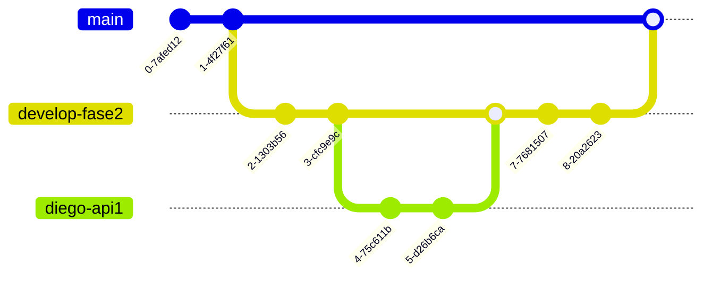

# Instrucciones:
## División de trabajos:
- Maqueta: Afinación de detalles, autenticación y conexión MQTT. (Diego)
- AWS Face rekognition API: Implementación e instrucciones de uso. (Daniel)
- Dashboard local: Graficación de datos en tiempo real y envío a las BD en la nube. (Bruce)
- Grafana: Graficación de los datos guardados en la BD y api que predice datos. (Natalia) 
> [!IMPORTANT] 
> Es importante que comenten su código para hacer la documentación posteriormente.
## Arquitectura propuesta:

## ¿Cómo hacer commits?
Rama de esta fase: develop-fase2.
- Se generará una rama develop-fase2
- De esa rama generarán otras ramas de uso propio.
- El nombre de esa rama será el suyo propio + feature. Ejemplo: diego-api1
- Probarémos cada cosa de manera individual y en la fase final haremos merge a la rama develop-fase2.

